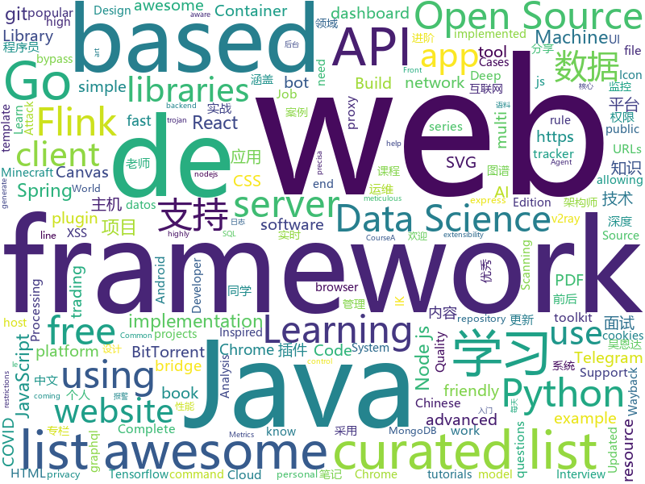

# 2020-04-26
See what the GitHub community is most excited about.

## python
+ [springer_free_books](https://github.com/alexgand/springer_free_books)(**25 stars today**): Python script to download all Springer books released for free during the 2020 COVID-19 quarantine
+ [ALAE](https://github.com/podgorskiy/ALAE)(**97 stars today**): [CVPR2020] Adversarial Latent Autoencoders
+ [PaddleHub](https://github.com/PaddlePaddle/PaddleHub)(**172 stars today**): Application toolkit for pre-trained models of PaddlePaddle（『飞桨』预训练模型应用工具 ）
+ [Background-Matting](https://github.com/senguptaumd/Background-Matting)(**172 stars today**): Background Matting: The World is Your Green Screen
+ [data-scientist-roadmap](https://github.com/MrMimic/data-scientist-roadmap)(**65 stars today**): Toturial coming with "data science roadmap" graphe.
+ [RandomPython](https://github.com/neha-chawla/RandomPython)(**31 stars today**): 
+ [comma10k](https://github.com/commaai/comma10k)(**20 stars today**): 10k crowdsourced images for training segnets
+ [ObstructionRemoval](https://github.com/alex04072000/ObstructionRemoval)(**19 stars today**): [CVPR 2020] Learning to See Through Obstructions
+ [covid19_dashboard](https://github.com/Unicorndy/covid19_dashboard)(**24 stars today**): Create your own dashboard web app with free resources
+ [awesome-machine-learning](https://github.com/josephmisiti/awesome-machine-learning)(**25 stars today**): A curated list of awesome Machine Learning frameworks, libraries and software.
+ [transformers](https://github.com/huggingface/transformers)(**50 stars today**): 🤗Transformers: State-of-the-art Natural Language Processing for TensorFlow 2.0 and PyTorch.
+ [client](https://github.com/wandb/client)(**62 stars today**): 🔥A tool for visualizing and tracking your machine learning experiments. This repo contains the CLI and Python API.
+ [keras-yolo3](https://github.com/qqwweee/keras-yolo3)(**14 stars today**): A Keras implementation of YOLOv3 (Tensorflow backend)
+ [freqtrade](https://github.com/freqtrade/freqtrade)(**5 stars today**): Free, open source crypto trading bot
+ [zipline](https://github.com/quantopian/zipline)(**7 stars today**): Zipline, a Pythonic Algorithmic Trading Library
+ [anki](https://github.com/ankitects/anki)(**9 stars today**): Anki for desktop computers
+ [django-realworld-example-app](https://github.com/gothinkster/django-realworld-example-app)(**4 stars today**): 
+ [espnet](https://github.com/espnet/espnet)(**8 stars today**): End-to-End Speech Processing Toolkit
+ [bbb-v2](https://github.com/diofeher/bbb-v2)(**2 stars today**): Bot pra votar no Big Brother que não precisa de interação com a página
+ [core](https://github.com/home-assistant/core)(**15 stars today**): 🏡Open source home automation that puts local control and privacy first
+ [pyTelegramBotAPI](https://github.com/eternnoir/pyTelegramBotAPI)(**7 stars today**): Python Telegram bot api.
+ [AnimationsWithManim](https://github.com/Elteoremadebeethoven/AnimationsWithManim)(**2 stars today**): Animation course with Manim
+ [shynet](https://github.com/milesmcc/shynet)(**55 stars today**): Modern, privacy-friendly, and detailed web analytics that works without cookies or JS.
+ [django](https://github.com/django/django)(**26 stars today**): The Web framework for perfectionists with deadlines.
+ [awesome-python](https://github.com/vinta/awesome-python)(**53 stars today**): A curated list of awesome Python frameworks, libraries, software and resources

## java
+ [CS-Notes](https://github.com/CyC2018/CS-Notes)(**174 stars today**): 📚技术面试必备基础知识、Leetcode、计算机操作系统、计算机网络、系统设计、Java、Python、C++
+ [advanced-java](https://github.com/doocs/advanced-java)(**71 stars today**): 😮互联网 Java 工程师进阶知识完全扫盲：涵盖高并发、分布式、高可用、微服务、海量数据处理等领域知识，后端同学必看，前端同学也可学习
+ [interviews](https://github.com/kdn251/interviews)(**48 stars today**): Everything you need to know to get the job.
+ [eladmin](https://github.com/elunez/eladmin)(**26 stars today**): 项目基于 Spring Boot 2.1.0 、 Jpa、 Spring Security、redis、Vue的前后端分离的后台管理系统，项目采用分模块开发方式， 权限控制采用 RBAC，支持数据字典与数据权限管理，支持一键生成前后端代码，支持动态路由
+ [java-design-patterns](https://github.com/iluwatar/java-design-patterns)(**127 stars today**): Design patterns implemented in Java
+ [JFoenix](https://github.com/jfoenixadmin/JFoenix)(**7 stars today**): JavaFX Material Design Library
+ [JavaGuide](https://github.com/Snailclimb/JavaGuide)(**96 stars today**): 【Java学习+面试指南】 一份涵盖大部分Java程序员所需要掌握的核心知识。
+ [flink-learning](https://github.com/zhisheng17/flink-learning)(**21 stars today**): flink learning blog. http://www.54tianzhisheng.cn 含 Flink 入门、概念、原理、实战、性能调优、源码解析等内容。涉及 Flink Connector、Metrics、Library、DataStream API、Table API & SQL 等内容的学习案例，还有 Flink 落地应用的大型项目案例（PVUV、日志存储、百亿数据实时去重、监控告警）分享。欢迎大家支持我的专栏《大数据实时计算引擎 Flink 实战与性能优化》
+ [Java](https://github.com/TheAlgorithms/Java)(**84 stars today**): All Algorithms implemented in Java
+ [proton-mail-android](https://github.com/ProtonMail/proton-mail-android)(**175 stars today**): ProtonMail Android app
+ [opentelemetry-java](https://github.com/open-telemetry/opentelemetry-java)(**19 stars today**): OpenTelemetry Java SDK
+ [Geyser](https://github.com/GeyserMC/Geyser)(**13 stars today**): A bridge/proxy allowing you to connect to Minecraft: Java Edition servers with Minecraft: Bedrock edition.
+ [igniter](https://github.com/trojan-gfw/igniter)(**11 stars today**): A trojan client for Android (UNDER CONSTRUCTION).
+ [okhttp](https://github.com/square/okhttp)(**33 stars today**): Square’s meticulous HTTP client for Java and Kotlin.
+ [spring5webapp](https://github.com/springframeworkguru/spring5webapp)(**2 stars today**): Example Spring 5 Web Application
+ [elasticsearch](https://github.com/elastic/elasticsearch)(**83 stars today**): Open Source, Distributed, RESTful Search Engine
+ [Mindustry](https://github.com/Anuken/Mindustry)(**7 stars today**): A sandbox tower defense game
+ [interview](https://github.com/mission-peace/interview)(**8 stars today**): Interview questions
+ [grpc-java](https://github.com/grpc/grpc-java)(**7 stars today**): The Java gRPC implementation. HTTP/2 based RPC
+ [spring-microservices](https://github.com/in28minutes/spring-microservices)(**2 stars today**): Spring Microservices using Spring Cloud
+ [Telegram-FOSS](https://github.com/Telegram-FOSS-Team/Telegram-FOSS)(**2 stars today**): Unofficial, FOSS-friendly fork of the original Telegram client for Android
+ [elasticsearch-analysis-ik](https://github.com/medcl/elasticsearch-analysis-ik)(**15 stars today**): The IK Analysis plugin integrates Lucene IK analyzer into elasticsearch, support customized dictionary.
+ [bigbluebutton](https://github.com/bigbluebutton/bigbluebutton)(**21 stars today**): Complete open source web conferencing system.
+ [fastjson](https://github.com/alibaba/fastjson)(**13 stars today**): A fast JSON parser/generator for Java.
+ [jadx](https://github.com/skylot/jadx)(**18 stars today**): Dex to Java decompiler

## unknown
+ [GitHubDaily](https://github.com/GitHubDaily/GitHubDaily)(**69 stars today**): GitHubDaily 分享内容定期整理与分类。欢迎推荐、自荐项目，让更多人知道你的项目。
+ [Data-science-best-resources](https://github.com/tirthajyoti/Data-science-best-resources)(**53 stars today**): Carefully curated resource links for data science in one place
+ [ds-cheatsheets](https://github.com/FavioVazquez/ds-cheatsheets)(**65 stars today**): List of Data Science Cheatsheets to rule the world
+ [stopp-corona-ios](https://github.com/austrianredcross/stopp-corona-ios)(**20 stars today**): iOS Source Code
+ [awesome-datascience](https://github.com/academic/awesome-datascience)(**93 stars today**): 📝An awesome Data Science repository to learn and apply for real world problems.
+ [COVID-19](https://github.com/CSSEGISandData/COVID-19)(**55 stars today**): Novel Coronavirus (COVID-19) Cases, provided by JHU CSSE
+ [1](https://github.com/8-jie/1)(**26 stars today**): 这里是直播平台永久回家页，有最新app下载地址。
+ [trackerslist](https://github.com/ngosang/trackerslist)(**38 stars today**): Updated list of public BitTorrent trackers
+ [awesome-for-beginners](https://github.com/MunGell/awesome-for-beginners)(**41 stars today**): A list of awesome beginners-friendly projects.
+ [awesome-shell](https://github.com/alebcay/awesome-shell)(**16 stars today**): A curated list of awesome command-line frameworks, toolkits, guides and gizmos. Inspired by awesome-php.
+ [awesome-architecture](https://github.com/toutiaoio/awesome-architecture)(**96 stars today**): 架构师技术图谱，助你早日成为架构师
+ [TrackersListCollection](https://github.com/XIU2/TrackersListCollection)(**19 stars today**): 🎈Updated daily! A list of popular public BitTorrent trackers. / 每天更新！全网热门公共 BitTorrent Tracker 列表！
+ [javascript-questions](https://github.com/lydiahallie/javascript-questions)(**20 stars today**): A long list of (advanced) JavaScript questions, and their explanations✨
+ [awesome-react-components](https://github.com/brillout/awesome-react-components)(**18 stars today**): Curated List of React Components & Libraries.
+ [DataScienceResources](https://github.com/jonathan-bower/DataScienceResources)(**52 stars today**): Open Source Data Science Resources.
+ [421pdf](https://github.com/yuanguangxin/421pdf)(**43 stars today**): 421页PDF 八卦汇总
+ [heroicons](https://github.com/refactoringui/heroicons)(**164 stars today**): A set of free MIT-licensed high-quality SVG icons for UI development.
+ [nuclei-templates](https://github.com/projectdiscovery/nuclei-templates)(**9 stars today**): Template files for the nuclei scanner
+ [You-Dont-Know-JS](https://github.com/getify/You-Dont-Know-JS)(**32 stars today**): A book series on JavaScript. @YDKJS on twitter.
+ [starter-workflows](https://github.com/actions/starter-workflows)(**6 stars today**): Accelerating new GitHub Actions workflows
+ [Python-programming-exercises](https://github.com/zhiwehu/Python-programming-exercises)(**13 stars today**): 100+ Python challenging programming exercises
+ [STC-WALLET-Testnet](https://github.com/LS1-develop/STC-WALLET-Testnet)(**3 stars today**): STC-WALLET (Testnet)
+ [nlp_chinese_corpus](https://github.com/brightmart/nlp_chinese_corpus)(**8 stars today**): 大规模中文自然语言处理语料 Large Scale Chinese Corpus for NLP
+ [hosts](https://github.com/googlehosts/hosts)(**20 stars today**): 镜像：https://scaffrey.coding.net/p/hosts/git / https://git.qvq.network/googlehosts/hosts
+ [awesome-deep-learning](https://github.com/ChristosChristofidis/awesome-deep-learning)(**22 stars today**): A curated list of awesome Deep Learning tutorials, projects and communities.

## javascript
+ [airframe-react](https://github.com/0wczar/airframe-react)(**25 stars today**): Free Open Source High Quality Dashboard based on Bootstrap 4 & React 16: http://dashboards.webkom.co/react/airframe
+ [ChromeAppHeroes](https://github.com/zhaoolee/ChromeAppHeroes)(**83 stars today**): 🌈谷粒-Chrome插件英雄榜, 为优秀的Chrome插件写一本中文说明书, 让Chrome插件英雄们造福人类~ ChromePluginHeroes, Write a Chinese manual for the excellent Chrome plugin, let the Chrome plugin heroes benefit the human~ 公众号「0加1」同步更新
+ [eruda](https://github.com/liriliri/eruda)(**227 stars today**): Console for mobile browsers
+ [learnGitBranching](https://github.com/pcottle/learnGitBranching)(**433 stars today**): An interactive git visualization to challenge and educate!
+ [alpine](https://github.com/alpinejs/alpine)(**29 stars today**): A rugged, minimal framework for composing JavaScript behavior in your markup.
+ [svelte](https://github.com/sveltejs/svelte)(**34 stars today**): Cybernetically enhanced web apps
+ [fullstack-course4](https://github.com/jhu-ep-coursera/fullstack-course4)(**10 stars today**): Example code for HTML, CSS, and Javascript for Web Developers Coursera Course
+ [secret-hitler](https://github.com/cozuya/secret-hitler)(**3 stars today**): A web adaptation of the social deduction board game Secret Hitler. https://secrethitler.io
+ [web-worker](https://github.com/developit/web-worker)(**44 stars today**): Consistent Web Workers in browser and Node.
+ [spug](https://github.com/openspug/spug)(**15 stars today**): 开源运维平台：面向中小型企业设计的无 Agent的自动化运维平台，整合了主机管理、主机批量执行、主机在线终端、应用发布、任务计划、配置中心、监控、报警等一系列功能。
+ [node-mongodb-native](https://github.com/mongodb/node-mongodb-native)(**5 stars today**): The Official MongoDB Node.js Driver
+ [simple-videochat-webrtc](https://github.com/Vinnu1/simple-videochat-webrtc)(**3 stars today**): Video chat between 2 people using simple-peer
+ [ResumeOnTheWeb-Gatsby](https://github.com/AmruthPillai/ResumeOnTheWeb-Gatsby)(**15 stars today**): Everyone needs their own little spot on the interwebs, and this is mine. Welcome to my resume, on the web!
+ [v4](https://github.com/bchiang7/v4)(**11 stars today**): Fourth iteration of my personal website
+ [unlock-music](https://github.com/ix64/unlock-music)(**20 stars today**): Unlock encrypted music file in browser. 在浏览器中解锁加密的音乐文件。
+ [next-learn-starter](https://github.com/zeit/next-learn-starter)(**5 stars today**): Learn Next.js Starter Code
+ [keystone](https://github.com/keystonejs/keystone)(**12 stars today**): A scalable platform and CMS to build Node.js applications
+ [fabric.js](https://github.com/fabricjs/fabric.js)(**8 stars today**): Javascript Canvas Library, SVG-to-Canvas (& canvas-to-SVG) Parser
+ [functions-samples](https://github.com/firebase/functions-samples)(**10 stars today**): Collection of sample apps showcasing popular use cases using Cloud Functions for Firebase
+ [zigbee2mqtt](https://github.com/Koenkk/zigbee2mqtt)(**8 stars today**): Zigbee🐝to MQTT bridge🌉, get rid of your proprietary Zigbee bridges🔨
+ [HoServer](https://github.com/hello-react/HoServer)(**41 stars today**): An out of the box application server scaffold base on nodejs express framework.
+ [gatsby](https://github.com/gatsbyjs/gatsby)(**29 stars today**): Build blazing fast, modern apps and websites with React
+ [telegraf](https://github.com/telegraf/telegraf)(**9 stars today**): Modern Telegram Bot Framework for Node.js
+ [evergreen](https://github.com/segmentio/evergreen)(**11 stars today**): 🌲Evergreen React UI Framework by Segment
+ [front-end-interview-handbook](https://github.com/yangshun/front-end-interview-handbook)(**13 stars today**): 🕸Almost complete answers to "Front-end Job Interview Questions" which you can use to interview potential candidates, test yourself or completely ignore

## html
+ [Coursera-ML-AndrewNg-Notes](https://github.com/fengdu78/Coursera-ML-AndrewNg-Notes)(**61 stars today**): 吴恩达老师的机器学习课程个人笔记
+ [nndl.github.io](https://github.com/nndl/nndl.github.io)(**51 stars today**): 《神经网络与深度学习》 邱锡鹏著 Neural Network and Deep Learning
+ [deeplearning_ai_books](https://github.com/fengdu78/deeplearning_ai_books)(**39 stars today**): deeplearning.ai（吴恩达老师的深度学习课程笔记及资源）
+ [deplacement-covid-19](https://github.com/LAB-MI/deplacement-covid-19)(**9 stars today**): Service de génération de l'attestation de déplacement dérogatoire à présenter dans le cadre du confinement lié au virus covid-19
+ [Awesome-CS-Books](https://github.com/wx-chevalier/Awesome-CS-Books)(**7 stars today**): 📚Awesome CS Books/Series(.pdf by git lfs) Warehouse for Geeks, ProgrammingLanguage, SoftwareEngineering, Web, AI, ServerSideApplication, Infrastructure, FE etc.💫优秀计算机科学与技术领域相关的书籍归档。
+ [beginner-javascript](https://github.com/wesbos/beginner-javascript)(**11 stars today**): Slam Dunk JavaScript
+ [zoombot](https://github.com/mcreed/zoombot)(**12 stars today**): A highly advanced AI to handle Zoom calls
+ [web-api-auth-examples](https://github.com/spotify/web-api-auth-examples)(**5 stars today**): Basic examples to authenticate and fetch data using the Spotify Web API
+ [geektime2pdf](https://github.com/jjeejj/geektime2pdf)(**8 stars today**): 极客时间专栏文章 转为 PDF 包含评论 音频
+ [ephtracy.github.io](https://github.com/ephtracy/ephtracy.github.io)(**5 stars today**): 
+ [222-responsive-icon-nav-css](https://github.com/fireship-io/222-responsive-icon-nav-css)(**5 stars today**): A Simple Responsive Animated CSS Icon Navbar
+ [OpenClash](https://github.com/vernesong/OpenClash)(**15 stars today**): A Clash Client For OpenWrt
+ [hugo-academic](https://github.com/gcushen/hugo-academic)(**12 stars today**): 📝The website builder for Hugo. Build and deploy a beautiful website in minutes!
+ [Java-Interview-Advanced](https://github.com/shishan100/Java-Interview-Advanced)(**32 stars today**): 中华石杉--互联网Java进阶面试训练营
+ [skill-map](https://github.com/TeamStuQ/skill-map)(**13 stars today**): 程序员技能图谱
+ [personal-website](https://github.com/github/personal-website)(**7 stars today**): Code that'll help you kickstart a personal website that showcases your work as a software developer.
+ [web-moderno](https://github.com/cod3rcursos/web-moderno)(**3 stars today**): 
+ [subspace](https://github.com/subspacecloud/subspace)(**3 stars today**): A simple WireGuard VPN server GUI
+ [java](https://github.com/bjmashibing/java)(**1 stars today**): 
+ [datasets](https://github.com/datadista/datasets)(**1 stars today**): Fuente de datos de los reportajes y proyectos de periodismo de investigación y datos de DATADISTA
+ [EIPs](https://github.com/ethereum/EIPs)(**2 stars today**): The Ethereum Improvement Proposal repository
+ [zenbot](https://github.com/DeviaVir/zenbot)(**2 stars today**): Zenbot is a command-line cryptocurrency trading bot using Node.js and MongoDB.
+ [v2-ui](https://github.com/sprov065/v2-ui)(**8 stars today**): 支持多协议多用户的 v2ray 面板，Support multi-protocol multi-user v2ray panel
+ [nodejs_wx_aipay_api](https://github.com/yioMe/nodejs_wx_aipay_api)(**7 stars today**): 微信支付宝个人免签收款Api系统，有了它对接再也不用担心我的业务不能支付了
+ [mvp](https://github.com/andybrewer/mvp)(**21 stars today**): MVP.css — Minimalist stylesheet for HTML elements

## go
+ [v2ray-core](https://github.com/v2ray/v2ray-core)(**60 stars today**): A platform for building proxies to bypass network restrictions.
+ [PhoneInfoga](https://github.com/sundowndev/PhoneInfoga)(**8 stars today**): Advanced information gathering & OSINT framework for phone numbers
+ [fiber](https://github.com/gofiber/fiber)(**73 stars today**): ⚡️Fiber is an Express inspired web framework written in Go with☕️
+ [golang-web-dev](https://github.com/GoesToEleven/golang-web-dev)(**4 stars today**): 
+ [awesome-go](https://github.com/avelino/awesome-go)(**29 stars today**): A curated list of awesome Go frameworks, libraries and software
+ [ion](https://github.com/pion/ion)(**16 stars today**): Distributed RTC System by pure Go and Flutter
+ [gqlgen](https://github.com/99designs/gqlgen)(**8 stars today**): go generate based graphql server library
+ [waybackurls](https://github.com/tomnomnom/waybackurls)(**8 stars today**): Fetch all the URLs that the Wayback Machine knows about for a domain
+ [pomerium](https://github.com/pomerium/pomerium)(**22 stars today**): Pomerium is an identity-aware access proxy.
+ [Amass](https://github.com/OWASP/Amass)(**6 stars today**): In-depth Attack Surface Mapping and Asset Discovery
+ [clash](https://github.com/Dreamacro/clash)(**31 stars today**): A rule-based tunnel in Go.
+ [colly](https://github.com/gocolly/colly)(**15 stars today**): Elegant Scraper and Crawler Framework for Golang
+ [caddy](https://github.com/caddyserver/caddy)(**21 stars today**): Fast, multi-platform web server with automatic HTTPS
+ [cri-o](https://github.com/cri-o/cri-o)(**1 stars today**): Open Container Initiative-based implementation of Kubernetes Container Runtime Interface
+ [evilginx2](https://github.com/kgretzky/evilginx2)(**11 stars today**): Standalone man-in-the-middle attack framework used for phishing login credentials along with session cookies, allowing for the bypass of 2-factor authentication
+ [examples](https://github.com/gin-gonic/examples)(**4 stars today**): A repository to host examples and tutorials for Gin.
+ [log](https://github.com/apex/log)(**20 stars today**): Structured logging package for Go.
+ [cortex](https://github.com/cortexlabs/cortex)(**28 stars today**): Cloud native model serving infrastructure
+ [direnv](https://github.com/direnv/direnv)(**5 stars today**): unclutter your .profile
+ [dalfox](https://github.com/hahwul/dalfox)(**20 stars today**): DalFox(Finder Of XSS) / Parameter Analysis and XSS Scanning tool based on golang
+ [graphql](https://github.com/graphql-go/graphql)(**6 stars today**): An implementation of GraphQL for Go / Golang
+ [nuclei](https://github.com/projectdiscovery/nuclei)(**8 stars today**): Nuclei is a fast tool for configurable targeted scanning based on templates offering massive extensibility and ease of use.
+ [kubesphere](https://github.com/kubesphere/kubesphere)(**18 stars today**): Easy-to-use Production Ready Container Platform
+ [gau](https://github.com/lc/gau)(**9 stars today**): Fetch known URLs from AlienVault's Open Threat Exchange, the Wayback Machine, and Common Crawl.
+ [syzkaller](https://github.com/google/syzkaller)(**4 stars today**): syzkaller is an unsupervised coverage-guided kernel fuzzer

## WordCloud

