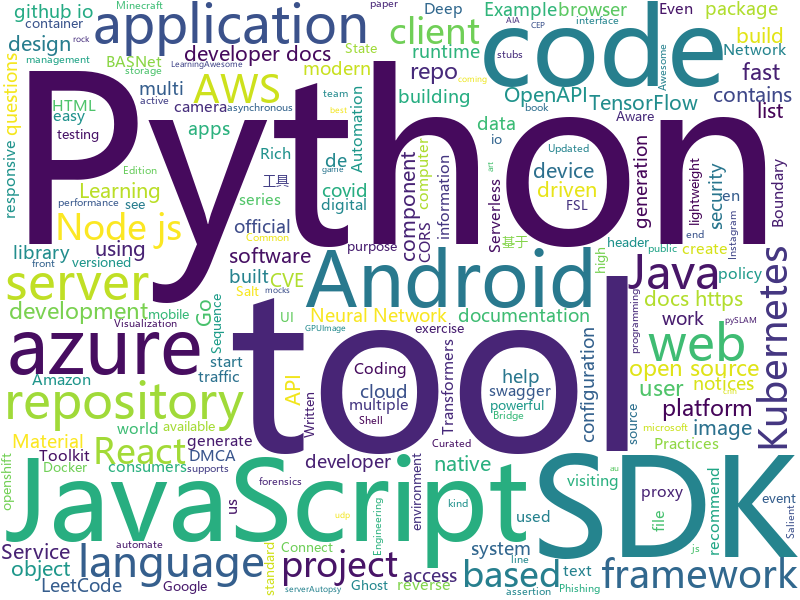

# 2020-05-07
See what the GitHub community is most excited about.

## python
+ [rich](https://github.com/willmcgugan/rich)(**456 stars today**): Rich is a Python library for rich text and beautiful formatting in the terminal.
+ [salt-security-backports](https://github.com/rossengeorgiev/salt-security-backports)(**24 stars today**): Salt security backports for CVE-2020-11651 & CVE-2020-11652
+ [azure-sdk-for-python](https://github.com/Azure/azure-sdk-for-python)(**1 stars today**): This repository is for active development of the Azure SDK for Python. For consumers of the SDK we recommend visiting our public developer docs at https://docs.microsoft.com/en-us/python/azure/ or our versioned developer docs at https://azure.github.io/azure-sdk-for-python.
+ [BASNet](https://github.com/NathanUA/BASNet)(**26 stars today**): Code for CVPR 2019 paper. BASNet: Boundary-Aware Salient Object Detection
+ [basnet-http](https://github.com/cyrildiagne/basnet-http)(**25 stars today**): HTTP service wrapper for BASNet: Boundary-Aware Salient Object Detection
+ [salt](https://github.com/saltstack/salt)(**104 stars today**): Software to automate the management and configuration of any infrastructure or application at scale. Get access to the Salt software package repository here:
+ [cve-2020-11651](https://github.com/dozernz/cve-2020-11651)(**16 stars today**): 
+ [pyslam](https://github.com/luigifreda/pyslam)(**94 stars today**): pySLAM contains a monocular Visual Odometry (VO) pipeline in Python. It supports many modern local features based on Deep Learning.
+ [black](https://github.com/psf/black)(**18 stars today**): The uncompromising Python code formatter
+ [daily-coding-problem](https://github.com/vineetjohn/daily-coding-problem)(**13 stars today**): Solutions to problems sent by dailycodingproblem.com
+ [screenpoint](https://github.com/cyrildiagne/screenpoint)(**33 stars today**): Project an image centroid to another image using OpenCV
+ [google-api-python-client](https://github.com/googleapis/google-api-python-client)(**10 stars today**): 🐍The official Python client library for Google's discovery based APIs.
+ [sigma](https://github.com/Neo23x0/sigma)(**7 stars today**): Generic Signature Format for SIEM Systems
+ [fairseq](https://github.com/pytorch/fairseq)(**18 stars today**): Facebook AI Research Sequence-to-Sequence Toolkit written in Python.
+ [ghost](https://github.com/entynetproject/ghost)(**31 stars today**): Ghost Framework is an Android post-exploitation framework that exploits the Android Debug Bridge to remotely access an Android device. Ghost Framework gives you the power and convenience of remote Android device administration.
+ [simpletransformers](https://github.com/ThilinaRajapakse/simpletransformers)(**6 stars today**): Transformers for Classification, NER, QA, Language Modelling, Language Generation, T5, Multi-Modal, and Conversational AI
+ [sampleproject](https://github.com/pypa/sampleproject)(**3 stars today**): A sample project that exists for PyPUG's "Tutorial on Packaging and Distributing Projects"
+ [Instagram_Bot](https://github.com/Harshp20/Instagram_Bot)(**4 stars today**): This is a robust, powerful and fully featured Instagram Bot that automates tedious tasks on Instagram using some really cool features
+ [keras](https://github.com/keras-team/keras)(**23 stars today**): Deep Learning for humans
+ [stylegan2](https://github.com/NVlabs/stylegan2)(**24 stars today**): StyleGAN2 - Official TensorFlow Implementation
+ [transformers](https://github.com/huggingface/transformers)(**53 stars today**): 🤗Transformers: State-of-the-art Natural Language Processing for Pytorch and TensorFlow 2.0.
+ [pipenv](https://github.com/pypa/pipenv)(**7 stars today**): Python Development Workflow for Humans.
+ [zulip](https://github.com/zulip/zulip)(**7 stars today**): Zulip server - powerful open source team chat
+ [spektral](https://github.com/danielegrattarola/spektral)(**14 stars today**): Graph Neural Networks with Keras and Tensorflow 2.
+ [Python](https://github.com/injetlee/Python)(**11 stars today**): Python脚本。模拟登录知乎， 爬虫，操作excel，微信公众号，远程开机

## java
+ [exposure-notifications-android](https://github.com/google/exposure-notifications-android)(**27 stars today**): Exposure Notifications Android Reference Design
+ [NewPipe](https://github.com/TeamNewPipe/NewPipe)(**34 stars today**): A libre lightweight streaming front-end for Android.
+ [ShizuruNotes](https://github.com/MalitsPlus/ShizuruNotes)(**7 stars today**): An unofficial Android tool application of the game "Princess Connect Re:Dive"
+ [react-native-camera](https://github.com/react-native-community/react-native-camera)(**7 stars today**): A Camera component for React Native. Also supports barcode scanning!
+ [kubernetes-client](https://github.com/fabric8io/kubernetes-client)(**2 stars today**): Java client for Kubernetes & OpenShift
+ [ghidra](https://github.com/NationalSecurityAgency/ghidra)(**25 stars today**): Ghidra is a software reverse engineering (SRE) framework
+ [tutorials](https://github.com/eugenp/tutorials)(**12 stars today**): Just Announced - "Learn Spring Security OAuth":
+ [quarkus](https://github.com/quarkusio/quarkus)(**25 stars today**): Quarkus: Supersonic Subatomic Java.
+ [openapi-generator](https://github.com/OpenAPITools/openapi-generator)(**14 stars today**): OpenAPI Generator allows generation of API client libraries (SDK generation), server stubs, documentation and configuration automatically given an OpenAPI Spec (v2, v3)
+ [Geyser](https://github.com/GeyserMC/Geyser)(**8 stars today**): A bridge/proxy allowing you to connect to Minecraft: Java Edition servers with Minecraft: Bedrock edition.
+ [azure-sdk-for-java](https://github.com/Azure/azure-sdk-for-java)(**0 stars today**): This repository is for active development of the Azure SDK for Java. For consumers of the SDK we recommend visiting our public developer docs at https://docs.microsoft.com/en-us/java/azure/ or our versioned developer docs at https://azure.github.io/azure-sdk-for-java.
+ [open-liberty](https://github.com/OpenLiberty/open-liberty)(**1 stars today**): Open Liberty is a highly composable, fast to start, dynamic application server runtime environment
+ [rest-assured](https://github.com/rest-assured/rest-assured)(**4 stars today**): Java DSL for easy testing of REST services
+ [android-gpuimage](https://github.com/cats-oss/android-gpuimage)(**45 stars today**): Android filters based on OpenGL (idea from GPUImage for iOS)
+ [bazel](https://github.com/bazelbuild/bazel)(**8 stars today**): a fast, scalable, multi-language and extensible build system
+ [aws-doc-sdk-examples](https://github.com/awsdocs/aws-doc-sdk-examples)(**10 stars today**): Welcome to the AWS Code Examples Repository. This repo contains code examples used in the AWS documentation, AWS SDK Developer Guides, and more. For more information, see the Readme.rst file below.
+ [netty](https://github.com/netty/netty)(**15 stars today**): Netty project - an event-driven asynchronous network application framework
+ [druid](https://github.com/apache/druid)(**4 stars today**): Apache Druid: a high performance real-time analytics database.
+ [commons-lang](https://github.com/apache/commons-lang)(**4 stars today**): Mirror of Apache Commons Lang
+ [jenkins](https://github.com/jenkinsci/jenkins)(**11 stars today**): Jenkins automation server
+ [autopsy](https://github.com/sleuthkit/autopsy)(**10 stars today**): Autopsy® is a digital forensics platform and graphical interface to The Sleuth Kit® and other digital forensics tools. It can be used by law enforcement, military, and corporate examiners to investigate what happened on a computer. You can even use it to recover photos from your camera's memory card.
+ [Auto.js](https://github.com/hyb1996/Auto.js)(**38 stars today**): A UiAutomator on android, does not need root access(安卓平台上的JavaScript自动化工具)
+ [openvidu](https://github.com/OpenVidu/openvidu)(**10 stars today**): OpenVidu Platform main repository
+ [spring-security](https://github.com/spring-projects/spring-security)(**8 stars today**): Spring Security
+ [mapstruct](https://github.com/mapstruct/mapstruct)(**10 stars today**): An annotation processor for generating type-safe bean mappers

## unknown
+ [reactjs-interview-questions](https://github.com/sudheerj/reactjs-interview-questions)(**106 stars today**): List of top 500 ReactJS Interview Questions & Answers....Coding exercise questions are coming soon!!
+ [fucking-algorithm](https://github.com/labuladong/fucking-algorithm)(**402 stars today**): 手把手撕LeetCode题目，扒各种算法套路的裤子。English version supported! Crack LeetCode, not only how, but also why.
+ [dmca](https://github.com/github/dmca)(**2 stars today**): Repository with text of DMCA takedown notices as received. GitHub does not endorse or adopt any assertion contained in the following notices. Users identified in the notices are presumed innocent until proven guilty. Additional information about our DMCA policy can be found at
+ [eng-practices](https://github.com/google/eng-practices)(**146 stars today**): Google's Engineering Practices documentation
+ [maratona2-desafios](https://github.com/codeedu/maratona2-desafios)(**6 stars today**): 
+ [Red-Teaming-Toolkit](https://github.com/infosecn1nja/Red-Teaming-Toolkit)(**101 stars today**): A collection of open source and commercial tools that aid in red team operations.
+ [coding-interview-university](https://github.com/jwasham/coding-interview-university)(**839 stars today**): A complete computer science study plan to become a software engineer.
+ [Bing-COVID-19-Data](https://github.com/microsoft/Bing-COVID-19-Data)(**1 stars today**): A repo for coronavirus related case count data from around the world. The repo will be regularly updated.
+ [leetcode_company_wise_questions](https://github.com/MysteryVaibhav/leetcode_company_wise_questions)(**10 stars today**): This is a repository containing the list of company wise questions available on leetcode premium
+ [FewShotPapers](https://github.com/tata1661/FewShotPapers)(**37 stars today**): This repository contains few-shot learning (FSL) papers mentioned in our FSL survey.
+ [pdown](https://github.com/pdown2020/pdown)(**15 stars today**): 2020
+ [open-source-cs](https://github.com/ForrestKnight/open-source-cs)(**52 stars today**): Video discussing this curriculum:
+ [acwa_book_ru](https://github.com/adelf/acwa_book_ru)(**29 stars today**): Книга "Архитектура сложных веб-приложений. С примерами на Laravel"
+ [COVID-19](https://github.com/pcm-dpc/COVID-19)(**2 stars today**): COVID-19 Italia - Monitoraggio situazione
+ [Python](https://github.com/TwoWater/Python)(**7 stars today**): 最良心的 Python 教程：
+ [You-Dont-Know-JS](https://github.com/getify/You-Dont-Know-JS)(**61 stars today**): A book series on JavaScript. @YDKJS on twitter.
+ [OpenAPI-Specification](https://github.com/OAI/OpenAPI-Specification)(**12 stars today**): The OpenAPI Specification Repository
+ [CVE-2020-0618](https://github.com/euphrat1ca/CVE-2020-0618)(**1 stars today**): SQL Server Reporting Services(CVE-2020-0618)中的RCE
+ [pwc](https://github.com/zziz/pwc)(**6 stars today**): Papers with code. Sorted by stars. Updated weekly.
+ [awesome](https://github.com/sindresorhus/awesome)(**96 stars today**): 😎Awesome lists about all kinds of interesting topics
+ [covid-policy-tracker](https://github.com/OxCGRT/covid-policy-tracker)(**4 stars today**): Systematic dataset of Covid-19 policy, from Oxford University
+ [AZ-300-MicrosoftAzureArchitectTechnologies](https://github.com/MicrosoftLearning/AZ-300-MicrosoftAzureArchitectTechnologies)(**1 stars today**): 
+ [first-contributions](https://github.com/firstcontributions/first-contributions)(**12 stars today**): 🚀✨Help beginners to contribute to open source projects
+ [CKAD-exercises](https://github.com/dgkanatsios/CKAD-exercises)(**7 stars today**): A set of exercises to prepare for Certified Kubernetes Application Developer exam by Cloud Native Computing Foundation
+ [you-dont-know-js-ru](https://github.com/azat-io/you-dont-know-js-ru)(**3 stars today**): 📚Russian translation of "You Don't Know JS" book series

## javascript
+ [tech-interview-handbook](https://github.com/yangshun/tech-interview-handbook)(**122 stars today**): 💯Materials to help you rock your next coding interview
+ [cnn-explainer](https://github.com/poloclub/cnn-explainer)(**786 stars today**): Learning Convolutional Neural Networks with Interactive Visualization. https://poloclub.github.io/cnn-explainer/
+ [fullstack-course4](https://github.com/jhu-ep-coursera/fullstack-course4)(**52 stars today**): Example code for HTML, CSS, and Javascript for Web Developers Coursera Course
+ [lx-music-desktop](https://github.com/lyswhut/lx-music-desktop)(**83 stars today**): 一个基于 electron 的音乐软件
+ [material-ui](https://github.com/mui-org/material-ui)(**45 stars today**): React components for faster and easier web development. Build your own design system, or start with Material Design.
+ [cypress](https://github.com/cypress-io/cypress)(**25 stars today**): Fast, easy and reliable testing for anything that runs in a browser.
+ [faker.js](https://github.com/Marak/faker.js)(**17 stars today**): generate massive amounts of realistic fake data in Node.js and the browser
+ [cli](https://github.com/npm/cli)(**9 stars today**): the package manager for JavaScript
+ [reaction](https://github.com/reactioncommerce/reaction)(**6 stars today**): Reaction is an API-first, headless commerce platform built using Node.js, React, GraphQL. Deployed via Docker and Kubernetes.
+ [react-query](https://github.com/tannerlinsley/react-query)(**29 stars today**): ⚛️Hooks for fetching, caching and updating asynchronous data in React
+ [snowpack](https://github.com/pikapkg/snowpack)(**192 stars today**): ☶ The fast, simple dev environment for modern web apps.
+ [react-native](https://github.com/facebook/react-native)(**97 stars today**): A framework for building native apps with React.
+ [NodeBB](https://github.com/NodeBB/NodeBB)(**6 stars today**): Node.js based forum software built for the modern web
+ [cep-promise](https://github.com/filipedeschamps/cep-promise)(**16 stars today**): Busca por CEP integrado diretamente aos serviços dos Correios, ViaCEP e outros (Node.js e Browser)
+ [carbon](https://github.com/carbon-design-system/carbon)(**7 stars today**): A design system built by IBM
+ [nodebestpractices](https://github.com/goldbergyoni/nodebestpractices)(**44 stars today**): ✅The Node.js best practices list (April 2020)
+ [ar-facedoodle](https://github.com/cyrildiagne/ar-facedoodle)(**26 stars today**): Doodle AR masks right from the browser with tensorflow.js
+ [cloudmapper](https://github.com/duo-labs/cloudmapper)(**4 stars today**): CloudMapper helps you analyze your Amazon Web Services (AWS) environments.
+ [react-router](https://github.com/ReactTraining/react-router)(**27 stars today**): Declarative routing for React
+ [serverless](https://github.com/serverless/serverless)(**19 stars today**): ⚡Serverless Framework – Build web, mobile and IoT applications with serverless architectures using AWS Lambda, Azure Functions, Google CloudFunctions & more! –
+ [cors-anywhere](https://github.com/Rob--W/cors-anywhere)(**10 stars today**): CORS Anywhere is a NodeJS reverse proxy which adds CORS headers to the proxied request.
+ [appium](https://github.com/appium/appium)(**15 stars today**): 📱Automation for iOS, Android, and Windows Apps.
+ [Prebid.js](https://github.com/prebid/Prebid.js)(**1 stars today**): Setup and manage header bidding advertising partners without writing code or confusing line items. Prebid.js is open source and free.
+ [node](https://github.com/nodejs/node)(**36 stars today**): Node.js JavaScript runtime✨🐢🚀✨
+ [gutenberg](https://github.com/WordPress/gutenberg)(**5 stars today**): The Block Editor project for WordPress and beyond. Plugin is available from the official repository.

## html
+ [nndl.github.io](https://github.com/nndl/nndl.github.io)(**128 stars today**): 《神经网络与深度学习》 邱锡鹏著 Neural Network and Deep Learning
+ [awesome-compose](https://github.com/docker/awesome-compose)(**254 stars today**): Awesome Docker Compose samples
+ [awesome-piracy](https://github.com/Igglybuff/awesome-piracy)(**11 stars today**): A curated list of awesome warez and piracy links
+ [tidytuesday](https://github.com/rfordatascience/tidytuesday)(**12 stars today**): Official repo for the #tidytuesday project
+ [en.javascript.info](https://github.com/javascript-tutorial/en.javascript.info)(**14 stars today**): Modern JavaScript Tutorial
+ [tiny-slider](https://github.com/ganlanyuan/tiny-slider)(**8 stars today**): Vanilla javascript slider for all purposes.
+ [django-DefectDojo](https://github.com/DefectDojo/django-DefectDojo)(**2 stars today**): DefectDojo is an open-source application vulnerability correlation and security orchestration tool.
+ [deplacement-covid-19](https://github.com/LAB-MI/deplacement-covid-19)(**8 stars today**): Service de génération de l'attestation de déplacement dérogatoire à présenter dans le cadre du confinement lié au virus covid-19
+ [foundation-emails](https://github.com/foundation/foundation-emails)(**3 stars today**): Quickly create responsive HTML emails that work on any device and client. Even Outlook.
+ [MatBlazor](https://github.com/SamProf/MatBlazor)(**4 stars today**): Material Design components for Blazor and Razor Components
+ [shellphish](https://github.com/thelinuxchoice/shellphish)(**7 stars today**): 19 Social Media Phishing Pages #phishing #shellphish #phish
+ [learning-area](https://github.com/mdn/learning-area)(**7 stars today**): Github repo for the MDN Learning Area.
+ [csgo_bugs](https://github.com/kkthxbye-code/csgo_bugs)(**0 stars today**): Random CSGO stuff
+ [terraform-website](https://github.com/hashicorp/terraform-website)(**0 stars today**): Prototype of Terraform website being assembled from multiple repositories
+ [spot-sdk](https://github.com/boston-dynamics/spot-sdk)(**11 stars today**): Spot SDK repo
+ [calico](https://github.com/projectcalico/calico)(**2 stars today**): Cloud native networking and network security
+ [TeroyJS](https://github.com/MathiasWP/TeroyJS)(**0 stars today**): The smallest JavaScript state-based component UI framework🔬(100 lines of code)⚡
+ [swagger-codegen](https://github.com/swagger-api/swagger-codegen)(**9 stars today**): swagger-codegen contains a template-driven engine to generate documentation, API clients and server stubs in different languages by parsing your OpenAPI / Swagger definition.
+ [zTree_v3](https://github.com/zTree/zTree_v3)(**2 stars today**): jQuery Tree Plugin
+ [foundation-sites](https://github.com/foundation/foundation-sites)(**5 stars today**): The most advanced responsive front-end framework in the world. Quickly create prototypes and production code for sites that work on any kind of device.
+ [keycloak-documentation](https://github.com/keycloak/keycloak-documentation)(**4 stars today**): 
+ [AR.js](https://github.com/jeromeetienne/AR.js)(**1 stars today**): Efficient Augmented Reality for the Web - 60fps on mobile!
+ [beginner-javascript](https://github.com/wesbos/beginner-javascript)(**6 stars today**): Slam Dunk JavaScript
+ [Java-Interview-Advanced](https://github.com/shishan100/Java-Interview-Advanced)(**8 stars today**): 中华石杉--互联网Java进阶面试训练营
+ [MIXBOX](https://github.com/monlor/MIXBOX)(**1 stars today**): 一款基于Shell的小米路由器工具箱，原为Monlor-Tools，A tool box for XiaoMi Router base on Shell.

## go
+ [esbuild](https://github.com/evanw/esbuild)(**379 stars today**): An extremely fast JavaScript bundler and minifier
+ [caddy](https://github.com/caddyserver/caddy)(**213 stars today**): Fast, multi-platform web server with automatic HTTPS
+ [moby](https://github.com/moby/moby)(**16 stars today**): Moby Project - a collaborative project for the container ecosystem to assemble container-based systems
+ [dapr](https://github.com/dapr/dapr)(**25 stars today**): Dapr is a portable, event-driven, runtime for building distributed applications across cloud and edge.
+ [loki](https://github.com/grafana/loki)(**10 stars today**): Like Prometheus, but for logs.
+ [BaiduPCS-Go](https://github.com/iikira/BaiduPCS-Go)(**49 stars today**): 百度网盘客户端 - Go语言编写
+ [kit](https://github.com/go-kit/kit)(**14 stars today**): A standard library for microservices.
+ [aws-sdk-go](https://github.com/aws/aws-sdk-go)(**6 stars today**): AWS SDK for the Go programming language.
+ [pprof](https://github.com/google/pprof)(**5 stars today**): pprof is a tool for visualization and analysis of profiling data
+ [aws-vault](https://github.com/99designs/aws-vault)(**14 stars today**): A vault for securely storing and accessing AWS credentials in development environments
+ [testify](https://github.com/stretchr/testify)(**11 stars today**): A toolkit with common assertions and mocks that plays nicely with the standard library
+ [kratos](https://github.com/ory/kratos)(**69 stars today**): Never build user login, user registration, 2fa, profile management ever again! Works on any operating system, cloud, with any programming language, user interface, and user experience! Written in Go.
+ [k3s](https://github.com/rancher/k3s)(**24 stars today**): Lightweight Kubernetes
+ [minio](https://github.com/minio/minio)(**31 stars today**): MinIO is a high performance object storage server compatible with Amazon S3 APIs
+ [learn-go-with-tests](https://github.com/quii/learn-go-with-tests)(**21 stars today**): Learn Go with test-driven development
+ [helm](https://github.com/helm/helm)(**11 stars today**): The Kubernetes Package Manager
+ [syncthing](https://github.com/syncthing/syncthing)(**12 stars today**): Open Source Continuous File Synchronization
+ [buildah](https://github.com/containers/buildah)(**1 stars today**): A tool that facilitates building OCI images
+ [packer](https://github.com/hashicorp/packer)(**15 stars today**): Packer is a tool for creating identical machine images for multiple platforms from a single source configuration.
+ [charts](https://github.com/helm/charts)(**19 stars today**): Curated applications for Kubernetes
+ [pingtunnel](https://github.com/esrrhs/pingtunnel)(**40 stars today**): 流量转发加速工具.a tool that advertises tcp/udp/socks5 traffic as icmp traffic for forwarding.
+ [mc](https://github.com/minio/mc)(**12 stars today**): MinIO Client is a replacement for ls, cp, mkdir, diff and rsync commands for filesystems and object storage.
+ [origin](https://github.com/openshift/origin)(**3 stars today**): Images for OpenShift 3 and 4 - see openshift/okd for more
+ [kustomize](https://github.com/kubernetes-sigs/kustomize)(**7 stars today**): Customization of kubernetes YAML configurations
+ [dashboard](https://github.com/kubernetes/dashboard)(**13 stars today**): General-purpose web UI for Kubernetes clusters

## WordCloud

