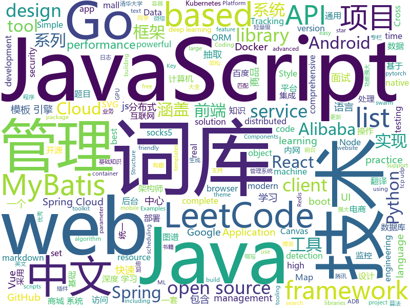

# 2020-05-09
See what the GitHub community is most excited about.

## python
+ [skillbox-async-messenger](https://github.com/manchenkoff/skillbox-async-messenger)(**13 stars today**): Пример клиент-серверного чата на Python для Skillbox
+ [system-design-primer](https://github.com/donnemartin/system-design-primer)(**457 stars today**): Learn how to design large-scale systems. Prep for the system design interview. Includes Anki flashcards.
+ [interview_internal_reference](https://github.com/0voice/interview_internal_reference)(**110 stars today**): 2019年最新总结，阿里，腾讯，百度，美团，头条等技术面试题目，以及答案，专家出题人分析汇总。
+ [eat_tensorflow2_in_30_days](https://github.com/lyhue1991/eat_tensorflow2_in_30_days)(**72 stars today**): Tensorflow2.0🍎🍊is delicious, just eat it!😋😋
+ [100-Days-Of-ML-Code](https://github.com/Avik-Jain/100-Days-Of-ML-Code)(**25 stars today**): 100 Days of ML Coding
+ [funNLP](https://github.com/fighting41love/funNLP)(**43 stars today**): 中英文敏感词、语言检测、中外手机/电话归属地/运营商查询、名字推断性别、手机号抽取、身份证抽取、邮箱抽取、中日文人名库、中文缩写库、拆字词典、词汇情感值、停用词、反动词表、暴恐词表、繁简体转换、英文模拟中文发音、汪峰歌词生成器、职业名称词库、同义词库、反义词库、否定词库、汽车品牌词库、汽车零件词库、连续英文切割、各种中文词向量、公司名字大全、古诗词库、IT词库、财经词库、成语词库、地名词库、历史名人词库、诗词词库、医学词库、饮食词库、法律词库、汽车词库、动物词库、中文聊天语料、中文谣言数据、百度中文问答数据集、句子相似度匹配算法集合、bert资源、文本生成&摘要相关工具、cocoNLP信息抽取工具、国内电话号码正则匹配、清华大学XLORE:中英文跨语言百科知识图谱、清华大学人工智能技术…
+ [DeepLearningExamples](https://github.com/NVIDIA/DeepLearningExamples)(**13 stars today**): Deep Learning Examples
+ [examples-of-web-crawlers](https://github.com/shengqiangzhang/examples-of-web-crawlers)(**35 stars today**): 一些非常有趣的python爬虫例子,对新手比较友好,主要爬取淘宝、天猫、微信、豆瓣、QQ等网站。(Some interesting examples of python crawlers that are friendly to beginners. )
+ [HelloGitHub](https://github.com/521xueweihan/HelloGitHub)(**46 stars today**): Find pearls on open-source seashore 分享 GitHub 上有趣、入门级的开源项目
+ [Real-Time-Voice-Cloning](https://github.com/CorentinJ/Real-Time-Voice-Cloning)(**59 stars today**): Clone a voice in 5 seconds to generate arbitrary speech in real-time
+ [incubator-tvm](https://github.com/apache/incubator-tvm)(**9 stars today**): Open deep learning compiler stack for cpu, gpu and specialized accelerators
+ [mobileperf](https://github.com/alibaba/mobileperf)(**30 stars today**): Android performance test
+ [mmdetection](https://github.com/open-mmlab/mmdetection)(**28 stars today**): Open MMLab Detection Toolbox and Benchmark
+ [d2l-en](https://github.com/d2l-ai/d2l-en)(**46 stars today**): An interactive deep learning book with code, math, and discussions, based on the NumPy interface.
+ [PaddleDetection](https://github.com/PaddlePaddle/PaddleDetection)(**33 stars today**): Object detection and instance segmentation toolkit based on PaddlePaddle.
+ [CenterTrack](https://github.com/xingyizhou/CenterTrack)(**28 stars today**): Simultaneous object detection and tracking using center points.
+ [nni](https://github.com/microsoft/nni)(**19 stars today**): An open source AutoML toolkit for automate machine learning lifecycle, including feature engineering, neural architecture search, model compression and hyper-parameter tuning.
+ [jesse](https://github.com/jesse-ai/jesse)(**31 stars today**): An advanced crypto trading framework
+ [GitHub-Chinese-Top-Charts](https://github.com/kon9chunkit/GitHub-Chinese-Top-Charts)(**75 stars today**): 🇨🇳GitHub中文排行榜，帮助你发现高分优秀中文项目、更高效地吸收国人的优秀经验成果；榜单每周更新一次，敬请关注！（中国加油！世界加油！）
+ [AiLearning](https://github.com/apachecn/AiLearning)(**54 stars today**): AiLearning: 机器学习 - MachineLearning - ML、深度学习 - DeepLearning - DL、自然语言处理 NLP
+ [horovod](https://github.com/horovod/horovod)(**17 stars today**): Distributed training framework for TensorFlow, Keras, PyTorch, and Apache MXNet.
+ [AlphaPose](https://github.com/MVIG-SJTU/AlphaPose)(**6 stars today**): Real-Time and Accurate Multi-Person Pose Estimation&Tracking System
+ [Yet-Another-EfficientDet-Pytorch](https://github.com/zylo117/Yet-Another-EfficientDet-Pytorch)(**31 stars today**): The pytorch re-implement of the official efficientdet with SOTA performance in real time and pretrained weights.
+ [causalml](https://github.com/uber/causalml)(**9 stars today**): Uplift modeling and causal inference with machine learning algorithms
+ [albert](https://github.com/google-research/albert)(**9 stars today**): ALBERT: A Lite BERT for Self-supervised Learning of Language Representations

## java
+ [xxl-job](https://github.com/xuxueli/xxl-job)(**38 stars today**): A distributed task scheduling framework.（分布式任务调度平台XXL-JOB）
+ [easyexcel](https://github.com/alibaba/easyexcel)(**48 stars today**): 快速、简单避免OOM的java处理Excel工具
+ [JavaGuide](https://github.com/Snailclimb/JavaGuide)(**151 stars today**): 【Java学习+面试指南】 一份涵盖大部分Java程序员所需要掌握的核心知识。
+ [advanced-java](https://github.com/doocs/advanced-java)(**95 stars today**): 😮互联网 Java 工程师进阶知识完全扫盲：涵盖高并发、分布式、高可用、微服务、海量数据处理等领域知识，后端同学必看，前端同学也可学习
+ [LeetCodeAnimation](https://github.com/MisterBooo/LeetCodeAnimation)(**165 stars today**): Demonstrate all the questions on LeetCode in the form of animation.（用动画的形式呈现解LeetCode题目的思路）
+ [SpringBoot-Labs](https://github.com/YunaiV/SpringBoot-Labs)(**67 stars today**): 一个涵盖六个专栏：Spring Boot 2.X、Spring Cloud、Spring Cloud Alibaba、Dubbo、分布式消息队列、分布式事务的仓库。希望胖友小手一抖，右上角来个 Star，感恩 1024
+ [spring-cloud-alibaba](https://github.com/alibaba/spring-cloud-alibaba)(**38 stars today**): Spring Cloud Alibaba provides a one-stop solution for application development for the distributed solutions of Alibaba middleware.
+ [CS-Notes](https://github.com/CyC2018/CS-Notes)(**136 stars today**): 📚技术面试必备基础知识、Leetcode、计算机操作系统、计算机网络、系统设计、Java、Python、C++
+ [elasticsearch](https://github.com/elastic/elasticsearch)(**48 stars today**): Open Source, Distributed, RESTful Search Engine
+ [mall](https://github.com/macrozheng/mall)(**66 stars today**): mall项目是一套电商系统，包括前台商城系统及后台管理系统，基于SpringBoot+MyBatis实现，采用Docker容器化部署。 前台商城系统包含首页门户、商品推荐、商品搜索、商品展示、购物车、订单流程、会员中心、客户服务、帮助中心等模块。 后台管理系统包含商品管理、订单管理、会员管理、促销管理、运营管理、内容管理、统计报表、财务管理、权限管理、设置等模块。
+ [spring-boot](https://github.com/spring-projects/spring-boot)(**46 stars today**): Spring Boot
+ [mall-learning](https://github.com/macrozheng/mall-learning)(**15 stars today**): mall学习教程，架构、业务、技术要点全方位解析。mall项目（25k+star）是一套电商系统，使用现阶段主流技术实现。 涵盖了SpringBoot2.1.3、MyBatis3.4.6、Elasticsearch6.2.2、RabbitMQ3.7.15、Redis3.2、Mongodb3.2、Mysql5.7等技术，采用Docker容器化部署。
+ [guava](https://github.com/google/guava)(**57 stars today**): Google core libraries for Java
+ [nacos](https://github.com/alibaba/nacos)(**37 stars today**): an easy-to-use dynamic service discovery, configuration and service management platform for building cloud native applications.
+ [dp3t-app-android-ch](https://github.com/DP-3T/dp3t-app-android-ch)(**7 stars today**): This is a COVID-19 tracing client using the DP3T Android SDK.
+ [okhttp](https://github.com/square/okhttp)(**26 stars today**): Square’s meticulous HTTP client for Java and Kotlin.
+ [mall-swarm](https://github.com/macrozheng/mall-swarm)(**11 stars today**): mall-swarm是一套微服务商城系统，采用了 Spring Cloud Greenwich、Spring Boot 2、MyBatis、Docker、Elasticsearch等核心技术，同时提供了基于Vue的管理后台方便快速搭建系统。mall-swarm在电商业务的基础集成了注册中心、配置中心、监控中心、网关等系统功能。文档齐全，附带全套Spring Cloud教程。
+ [jadx](https://github.com/skylot/jadx)(**34 stars today**): Dex to Java decompiler
+ [spring-boot-demo](https://github.com/xkcoding/spring-boot-demo)(**95 stars today**): spring boot demo 是一个用来深度学习并实战 spring boot 的项目，目前总共包含 65 个集成demo，已经完成 53 个。 该项目已成功集成 actuator(监控)、admin(可视化监控)、logback(日志)、aopLog(通过AOP记录web请求日志)、统一异常处理(json级别和页面级别)、freemarker(模板引擎)、thymeleaf(模板引擎)、Beetl(模板引擎)、Enjoy(模板引擎)、JdbcTemplate(通用JDBC操作数据库)、JPA(强大的ORM框架)、mybatis(强大的ORM框架)、通用Mapper(快速操作Mybatis)、PageHelper(通用的Mybatis分页插件)、mybatis-plus(快速操作M…
+ [firebase-android-sdk](https://github.com/firebase/firebase-android-sdk)(**5 stars today**): Firebase Android SDK
+ [skywalking](https://github.com/apache/skywalking)(**13 stars today**): APM, Application Performance Monitoring System
+ [redisson](https://github.com/redisson/redisson)(**18 stars today**): Redisson - Redis Java client with features of In-Memory Data Grid. Over 50 Redis based Java objects and services: Set, Multimap, SortedSet, Map, List, Queue, Deque, Semaphore, Lock, AtomicLong, Map Reduce, Publish / Subscribe, Bloom filter, Spring Cache, Tomcat, Scheduler, JCache API, Hibernate, MyBatis, RPC, local cache ...
+ [AndroidUtilCode](https://github.com/Blankj/AndroidUtilCode)(**20 stars today**): 🔥Android developers should collect the following utils(updating).
+ [arthas](https://github.com/alibaba/arthas)(**48 stars today**): Alibaba Java Diagnostic Tool Arthas/Alibaba Java诊断利器Arthas
+ [BaseRecyclerViewAdapterHelper](https://github.com/CymChad/BaseRecyclerViewAdapterHelper)(**30 stars today**): BRVAH:Powerful and flexible RecyclerAdapter

## unknown
+ [zork](https://github.com/MITDDC/zork)(**293 stars today**): Source code for a 1977 version of Zork
+ [COVID-19-app-Documentation-BETA](https://github.com/nhsx/COVID-19-app-Documentation-BETA)(**33 stars today**): Documentation relating to the Beta of the NHS COVID-19 app
+ [design-resources-for-developers](https://github.com/bradtraversy/design-resources-for-developers)(**1,951 stars today**): Curated list of design and UI resources from stock photos, web templates, CSS frameworks, UI libraries, tools and much more
+ [JavaFamily](https://github.com/AobingJava/JavaFamily)(**165 stars today**): 【互联网一线大厂面试+学习指南】
+ [browser-2020](https://github.com/luruke/browser-2020)(**160 stars today**): Things you can do with a browser in 2020☕️
+ [fucking-algorithm](https://github.com/labuladong/fucking-algorithm)(**476 stars today**): 手把手撕LeetCode题目，扒各种算法套路的裤子。English version supported! Crack LeetCode, not only how, but also why.
+ [coding-interview-university](https://github.com/jwasham/coding-interview-university)(**589 stars today**): A complete computer science study plan to become a software engineer.
+ [Gf-Patterns](https://github.com/1ndianl33t/Gf-Patterns)(**27 stars today**): GF Paterns For (ssrf,RCE,Lfi,sqli,ssti,idor,url redirection,debug_logic) parameters grep
+ [eng-practices](https://github.com/google/eng-practices)(**126 stars today**): Google's Engineering Practices documentation
+ [free-programming-books-zh_CN](https://github.com/justjavac/free-programming-books-zh_CN)(**41 stars today**): 📚免费的计算机编程类中文书籍，欢迎投稿
+ [Python-Core-50-Courses](https://github.com/jackfrued/Python-Core-50-Courses)(**24 stars today**): Python语言基础50课
+ [You-Dont-Know-JS](https://github.com/getify/You-Dont-Know-JS)(**69 stars today**): A book series on JavaScript. @YDKJS on twitter.
+ [Kubernetes-Certified-Administrator](https://github.com/walidshaari/Kubernetes-Certified-Administrator)(**8 stars today**): Online resources that will help you prepare for taking the CNCF CKA "Kubernetes Certified Administrator" Certification exam. with time, This is not likely the comprehensive up to date list - please make a pull request if there something that should be added here.
+ [architect-awesome](https://github.com/xingshaocheng/architect-awesome)(**25 stars today**): 后端架构师技术图谱
+ [gold-miner](https://github.com/xitu/gold-miner)(**25 stars today**): 🥇掘金翻译计划，可能是世界最大最好的英译中技术社区，最懂读者和译者的翻译平台：
+ [awesome](https://github.com/sindresorhus/awesome)(**103 stars today**): 😎Awesome lists about all kinds of interesting topics
+ [kubernetes-the-hard-way](https://github.com/kelseyhightower/kubernetes-the-hard-way)(**21 stars today**): Bootstrap Kubernetes the hard way on Google Cloud Platform. No scripts.
+ [dz](https://github.com/x1080x/dz)(**6 stars today**): 最新地址（2020.03.20 更新）
+ [awesome-architecture](https://github.com/toutiaoio/awesome-architecture)(**21 stars today**): 架构师技术图谱，助你早日成为架构师
+ [Blog](https://github.com/mqyqingfeng/Blog)(**41 stars today**): 冴羽写博客的地方，预计写四个系列：JavaScript深入系列、JavaScript专题系列、ES6系列、React系列。
+ [CVPR2020-Code](https://github.com/amusi/CVPR2020-Code)(**15 stars today**): CVPR 2020 论文开源项目合集
+ [proposals](https://github.com/tc39/proposals)(**21 stars today**): Tracking ECMAScript Proposals
+ [weekly](https://github.com/dt-fe/weekly)(**17 stars today**): 前端精读周刊
+ [awesome-adb](https://github.com/mzlogin/awesome-adb)(**12 stars today**): ADB Usage Complete / ADB 用法大全
+ [Specs](https://github.com/CocoaPods/Specs)(**4 stars today**): The CocoaPods Master Repo

## javascript
+ [playwright](https://github.com/microsoft/playwright)(**227 stars today**): Node library to automate Chromium, Firefox and WebKit with a single API
+ [vue](https://github.com/vuejs/vue)(**109 stars today**): 🖖Vue.js is a progressive, incrementally-adoptable JavaScript framework for building UI on the web.
+ [leetcode](https://github.com/azl397985856/leetcode)(**145 stars today**): LeetCode Solutions: A Record of My Problem Solving Journey.( leetcode题解，记录自己的leetcode解题之路。)
+ [yapi](https://github.com/YMFE/yapi)(**33 stars today**): YApi 是一个可本地部署的、打通前后端及QA的、可视化的接口管理平台
+ [uni-app](https://github.com/dcloudio/uni-app)(**59 stars today**): uni-app 是使用 Vue 语法开发小程序、H5、App的统一框架
+ [fabric.js](https://github.com/fabricjs/fabric.js)(**20 stars today**): Javascript Canvas Library, SVG-to-Canvas (& canvas-to-SVG) Parser
+ [mermaid](https://github.com/mermaid-js/mermaid)(**32 stars today**): Generation of diagram and flowchart from text in a similar manner as markdown
+ [taro](https://github.com/NervJS/taro)(**21 stars today**): 多端统一开发框架，支持用 React 的开发方式编写一次代码，生成能运行在微信/京东/百度/支付宝/字节跳动/ QQ 小程序/快应用/H5/React Native 等的应用。 https://taro.jd.com/
+ [jsencrypt](https://github.com/travist/jsencrypt)(**2 stars today**): A Javascript library to perform OpenSSL RSA Encryption, Decryption, and Key Generation.
+ [vue-cli](https://github.com/vuejs/vue-cli)(**19 stars today**): 🛠️Standard Tooling for Vue.js Development
+ [puppeteer](https://github.com/puppeteer/puppeteer)(**54 stars today**): Headless Chrome Node.js API
+ [dsa.js-data-structures-algorithms-javascript](https://github.com/amejiarosario/dsa.js-data-structures-algorithms-javascript)(**123 stars today**): 🥞Data Structures and Algorithms explained and implemented in JavaScript
+ [chakra-ui](https://github.com/chakra-ui/chakra-ui)(**26 stars today**): ⚡️Simple, Modular & Accessible UI Components for your React Applications
+ [Blog](https://github.com/ljianshu/Blog)(**20 stars today**): 关注基础知识，打造优质前端博客，公众号[前端工匠]的作者
+ [wp-calypso](https://github.com/Automattic/wp-calypso)(**6 stars today**): The JavaScript and API powered WordPress.com
+ [vscode-terraform](https://github.com/hashicorp/vscode-terraform)(**13 stars today**): A Visual Studio Code extension for Hashicorp Terraform
+ [jira_clone](https://github.com/oldboyxx/jira_clone)(**38 stars today**): A simplified Jira clone built with React/Babel (Client), and Node/TypeScript (API). Auto formatted with Prettier, tested with Cypress.
+ [nodebestpractices](https://github.com/goldbergyoni/nodebestpractices)(**42 stars today**): ✅The Node.js best practices list (April 2020)
+ [javascript](https://github.com/airbnb/javascript)(**46 stars today**): JavaScript Style Guide
+ [makeJs](https://github.com/zuluoaaa/makeJs)(**83 stars today**): A sub Javascript interpreter for interpreting itself
+ [react-virtualized](https://github.com/bvaughn/react-virtualized)(**24 stars today**): React components for efficiently rendering large lists and tabular data
+ [ueditor](https://github.com/fex-team/ueditor)(**5 stars today**): rich text 富文本编辑器
+ [gpuweb](https://github.com/gpuweb/gpuweb)(**31 stars today**): Where the GPU for the Web work happens!
+ [chinese-poetry](https://github.com/chinese-poetry/chinese-poetry)(**27 stars today**): The most comprehensive database of Chinese poetry🧶最全中华古诗词数据库, 唐宋两朝近一万四千古诗人, 接近5.5万首唐诗加26万宋诗. 两宋时期1564位词人，21050首词。
+ [wangEditor](https://github.com/wangfupeng1988/wangEditor)(**11 stars today**): wangEditor —— 轻量级web富文本框

## html
+ [geektime2pdf](https://github.com/jjeejj/geektime2pdf)(**6 stars today**): 极客时间专栏文章 转为 PDF 包含评论 音频
+ [WebFundamentals](https://github.com/google/WebFundamentals)(**8 stars today**): Best practices for modern web development
+ [computer-science-flash-cards](https://github.com/jwasham/computer-science-flash-cards)(**85 stars today**): Mini website for testing both general CS knowledge and enforce coding practice and common algorithm/data structure memorization.
+ [tabler-icons](https://github.com/tabler/tabler-icons)(**24 stars today**): A set of over 450 free MIT-licensed high-quality SVG icons for you to use in your web projects.
+ [hexo-theme-matery](https://github.com/blinkfox/hexo-theme-matery)(**11 stars today**): A beautiful hexo blog theme with material design and responsive design.一个基于材料设计和响应式设计而成的全面、美观的Hexo主题。国内访问：http://blinkfox.com
+ [CVE-2020-0674-Exploit](https://github.com/maxpl0it/CVE-2020-0674-Exploit)(**61 stars today**): This is an exploit for CVE-2020-0674 that runs on the x64 version of IE 8, 9, 10, and 11 on Windows 7.
+ [web-moderno](https://github.com/cod3rcursos/web-moderno)(**7 stars today**): 
+ [DetectionLab](https://github.com/clong/DetectionLab)(**5 stars today**): Vagrant & Packer scripts to build a lab environment complete with security tooling and logging best practices
+ [mxgraph](https://github.com/jgraph/mxgraph)(**3 stars today**): mxGraph is a fully client side JavaScript diagramming library
+ [rellax](https://github.com/dixonandmoe/rellax)(**8 stars today**): Lightweight, vanilla javascript parallax library
+ [qcloud-documents](https://github.com/tencentyun/qcloud-documents)(**3 stars today**): 腾讯云官方文档
+ [owasp-mstg](https://github.com/OWASP/owasp-mstg)(**12 stars today**): The Mobile Security Testing Guide (MSTG) is a comprehensive manual for mobile app security development, testing and reverse engineering.
+ [design-blocks](https://github.com/froala/design-blocks)(**7 stars today**): A set of 170+ Bootstrap based design blocks ready to be used to create clean modern websites.
+ [startbootstrap-sb-admin-2](https://github.com/BlackrockDigital/startbootstrap-sb-admin-2)(**6 stars today**): A free, open source, Bootstrap admin theme created by Start Bootstrap
+ [html](https://github.com/whatwg/html)(**6 stars today**): HTML Standard
+ [technical-books](https://github.com/doocs/technical-books)(**7 stars today**): 😆国内外互联网技术大牛们都写了哪些书籍：计算机基础、网络、前端、后端、数据库、架构、大数据、深度学习...
+ [remark](https://github.com/gnab/remark)(**10 stars today**): A simple, in-browser, markdown-driven slideshow tool.
+ [javascript-racer](https://github.com/jakesgordon/javascript-racer)(**5 stars today**): How to build an outrun-style racing game in javascript
+ [portainer](https://github.com/portainer/portainer)(**18 stars today**): Making Docker management easy.
+ [nbnhhsh](https://github.com/itorr/nbnhhsh)(**35 stars today**): 😩「能不能好好说话？」 拼音首字母缩写翻译工具
+ [HiddenEye](https://github.com/DarkSecDevelopers/HiddenEye)(**10 stars today**): Modern Phishing Tool With Advanced Functionality And Multiple Tunnelling Services [ Android-Support-Available ]
+ [svm-r-markdown-templates](https://github.com/svmiller/svm-r-markdown-templates)(**0 stars today**): I have a suite of R Markdown templates for academic manuscripts, beamer presentations, and syllabi. I share them here.
+ [screenfull.js](https://github.com/sindresorhus/screenfull.js)(**6 stars today**): Simple wrapper for cross-browser usage of the JavaScript Fullscreen API
+ [PandownloadFake](https://github.com/AyagawaSeirin/PandownloadFake)(**3 stars today**): 虚假的Pandownload验证“服务器”
+ [learning-area](https://github.com/mdn/learning-area)(**2 stars today**): Github repo for the MDN Learning Area.

## go
+ [client](https://github.com/keybase/client)(**65 stars today**): Keybase Go Library, Client, Service, OS X, iOS, Android, Electron
+ [esbuild](https://github.com/evanw/esbuild)(**253 stars today**): An extremely fast JavaScript bundler and minifier
+ [pingtunnel](https://github.com/esrrhs/pingtunnel)(**49 stars today**): 流量转发加速工具.a tool that advertises tcp/udp/socks5 traffic as icmp traffic for forwarding.
+ [buildpacks](https://github.com/GoogleCloudPlatform/buildpacks)(**41 stars today**): Builders and buildpacks designed to run on Google Cloud's container platforms
+ [gorm](https://github.com/jinzhu/gorm)(**25 stars today**): The fantastic ORM library for Golang, aims to be developer friendly (v2 is under development, PR based on master branch won't be accepted)
+ [terraform-provider-azurerm](https://github.com/terraform-providers/terraform-provider-azurerm)(**4 stars today**): Terraform provider for Azure Resource Manager
+ [beego](https://github.com/astaxie/beego)(**17 stars today**): beego is an open-source, high-performance web framework for the Go programming language.
+ [clash](https://github.com/Dreamacro/clash)(**35 stars today**): A rule-based tunnel in Go.
+ [terraform-provider-aws](https://github.com/terraform-providers/terraform-provider-aws)(**6 stars today**): Terraform AWS provider
+ [istio](https://github.com/istio/istio)(**14 stars today**): Connect, secure, control, and observe services.
+ [validator](https://github.com/go-playground/validator)(**14 stars today**): 💯Go Struct and Field validation, including Cross Field, Cross Struct, Map, Slice and Array diving
+ [protobuf](https://github.com/golang/protobuf)(**12 stars today**): Go support for Google's protocol buffers
+ [grpc-go](https://github.com/grpc/grpc-go)(**13 stars today**): The Go language implementation of gRPC. HTTP/2 based RPC
+ [telegraf](https://github.com/influxdata/telegraf)(**7 stars today**): The plugin-driven server agent for collecting & reporting metrics.
+ [k9s](https://github.com/derailed/k9s)(**17 stars today**): 🐶Kubernetes CLI To Manage Your Clusters In Style!
+ [aws-sdk-go](https://github.com/aws/aws-sdk-go)(**8 stars today**): AWS SDK for the Go programming language.
+ [keys](https://github.com/keys-pub/keys)(**55 stars today**): Key management is hard
+ [go.uuid](https://github.com/satori/go.uuid)(**3 stars today**): UUID package for Go
+ [kubernetes](https://github.com/kubernetes/kubernetes)(**32 stars today**): Production-Grade Container Scheduling and Management
+ [node_exporter](https://github.com/prometheus/node_exporter)(**9 stars today**): Exporter for machine metrics
+ [act](https://github.com/nektos/act)(**46 stars today**): Run your GitHub Actions locally🚀
+ [nps](https://github.com/ehang-io/nps)(**41 stars today**): 一款轻量级、高性能、功能强大的内网穿透代理服务器。支持tcp、udp、socks5、http等几乎所有流量转发，可用来访问内网网站、本地支付接口调试、ssh访问、远程桌面，内网dns解析、内网socks5代理等等……，并带有功能强大的web管理端。a lightweight, high-performance, powerful intranet penetration proxy server, with a powerful web management terminal.
+ [harbor](https://github.com/goharbor/harbor)(**14 stars today**): An open source trusted cloud native registry project that stores, signs, and scans content.
+ [advanced-go-programming-book](https://github.com/chai2010/advanced-go-programming-book)(**17 stars today**): 📚《Go语言高级编程》开源图书，涵盖CGO、Go汇编语言、RPC实现、Protobuf插件实现、Web框架实现、分布式系统等高阶主题(完稿)
+ [mysql](https://github.com/go-sql-driver/mysql)(**16 stars today**): Go MySQL Driver is a MySQL driver for Go's (golang) database/sql package

## WordCloud

