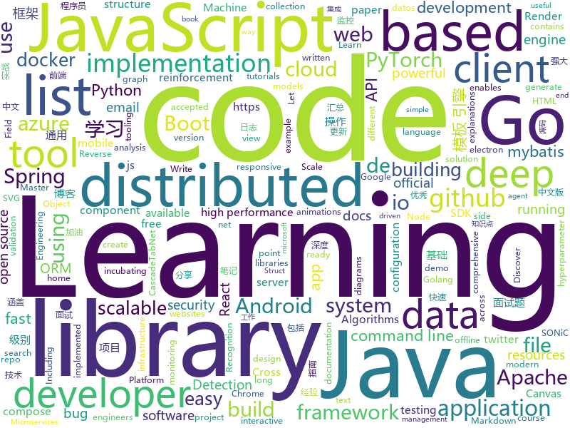

# 2020-05-12
See what the GitHub community is most excited about.

## python
+ [U-2-Net](https://github.com/NathanUA/U-2-Net)(**213 stars today**): The code for our newly accepted paper in Pattern Recognition 2020: "U^2-Net: Going Deeper with Nested U-Structure for Salient Object Detection."
+ [Python](https://github.com/TheAlgorithms/Python)(**79 stars today**): All Algorithms implemented in Python
+ [DeepLearning](https://github.com/MingchaoZhu/DeepLearning)(**177 stars today**): Python for “Deep Learning”，《深度学习》(花书) 数学推导、原理剖析与源码级别代码实现
+ [ray](https://github.com/ray-project/ray)(**25 stars today**): A fast and simple framework for building and running distributed applications. Ray is packaged with RLlib, a scalable reinforcement learning library, and Tune, a scalable hyperparameter tuning library.
+ [pytorch-lightning](https://github.com/PyTorchLightning/pytorch-lightning)(**64 stars today**): The lightweight PyTorch wrapper for ML researchers. Scale your models. Write less boilerplate
+ [docker-pi-hole](https://github.com/pi-hole/docker-pi-hole)(**19 stars today**): Pi-hole in a docker container
+ [fastapi](https://github.com/tiangolo/fastapi)(**42 stars today**): FastAPI framework, high performance, easy to learn, fast to code, ready for production
+ [python](https://github.com/kubernetes-client/python)(**9 stars today**): Official Python client library for kubernetes
+ [public-apis](https://github.com/public-apis/public-apis)(**144 stars today**): A collective list of free APIs for use in software and web development.
+ [system-design-primer](https://github.com/donnemartin/system-design-primer)(**244 stars today**): Learn how to design large-scale systems. Prep for the system design interview. Includes Anki flashcards.
+ [jina](https://github.com/jina-ai/jina)(**19 stars today**): Jina is the cloud-native neural search framework powered by state-of-the-art AI and deep learning
+ [PCDet](https://github.com/sshaoshuai/PCDet)(**6 stars today**): PCDet Toolbox in PyTorch for 3D Object Detection from Point Cloud
+ [GitHub-Chinese-Top-Charts](https://github.com/kon9chunkit/GitHub-Chinese-Top-Charts)(**54 stars today**): 🇨🇳GitHub中文排行榜，帮助你发现高分优秀中文项目、更高效地吸收国人的优秀经验成果；榜单每周更新一次，敬请关注！（中国加油！世界加油！）
+ [machine_learning_examples](https://github.com/lazyprogrammer/machine_learning_examples)(**15 stars today**): A collection of machine learning examples and tutorials.
+ [pytorch-metric-learning](https://github.com/KevinMusgrave/pytorch-metric-learning)(**39 stars today**): The easiest way to use deep metric learning in your application. Modular, flexible, and extensible. Written in PyTorch.
+ [stable-baselines3](https://github.com/DLR-RM/stable-baselines3)(**46 stars today**): PyTorch version of Stable Baselines, improved implementations of reinforcement learning algorithms.
+ [GPT2-Chinese](https://github.com/Morizeyao/GPT2-Chinese)(**52 stars today**): Chinese version of GPT2 training code, using BERT tokenizer.
+ [LubmerJack-automation](https://github.com/hblackmcn/LubmerJack-automation)(**10 stars today**): The code which plays LumberJack game for you
+ [oppia](https://github.com/oppia/oppia)(**9 stars today**): Tool for collaboratively building interactive lessons.
+ [CascadeTabNet](https://github.com/DevashishPrasad/CascadeTabNet)(**8 stars today**): This repository contains the code and implementation details of the CascadeTabNet paper "CascadeTabNet: An approach for end to end table detection and structure recognition from image-based documents"
+ [d2l-en](https://github.com/d2l-ai/d2l-en)(**48 stars today**): An interactive deep learning book with code, math, and discussions, based on the NumPy interface.
+ [optuna](https://github.com/optuna/optuna)(**8 stars today**): A hyperparameter optimization framework
+ [udemy-dl](https://github.com/r0oth3x49/udemy-dl)(**19 stars today**): A cross-platform python based utility to download courses from udemy for personal offline use.
+ [incubator-superset](https://github.com/apache/incubator-superset)(**12 stars today**): Apache Superset (incubating) is a modern, enterprise-ready business intelligence web application
+ [dbt](https://github.com/fishtown-analytics/dbt)(**4 stars today**): dbt (data build tool) enables data analysts and engineers to transform their data using the same practices that software engineers use to build applications.

## java
+ [spring-analysis](https://github.com/seaswalker/spring-analysis)(**130 stars today**): Spring源码阅读
+ [spring-boot-demo](https://github.com/xkcoding/spring-boot-demo)(**140 stars today**): spring boot demo 是一个用来深度学习并实战 spring boot 的项目，目前总共包含 65 个集成demo，已经完成 53 个。 该项目已成功集成 actuator(监控)、admin(可视化监控)、logback(日志)、aopLog(通过AOP记录web请求日志)、统一异常处理(json级别和页面级别)、freemarker(模板引擎)、thymeleaf(模板引擎)、Beetl(模板引擎)、Enjoy(模板引擎)、JdbcTemplate(通用JDBC操作数据库)、JPA(强大的ORM框架)、mybatis(强大的ORM框架)、通用Mapper(快速操作Mybatis)、PageHelper(通用的Mybatis分页插件)、mybatis-plus(快速操作M…
+ [interviews](https://github.com/kdn251/interviews)(**125 stars today**): Everything you need to know to get the job.
+ [hive](https://github.com/apache/hive)(**8 stars today**): Apache Hive
+ [elasticsearch](https://github.com/elastic/elasticsearch)(**46 stars today**): Open Source, Distributed, RESTful Search Engine
+ [mockito](https://github.com/mockito/mockito)(**7 stars today**): Most popular Mocking framework for unit tests written in Java
+ [rocketmq-externals](https://github.com/apache/rocketmq-externals)(**8 stars today**): Mirror of Apache RocketMQ (Incubating)
+ [AndroidUtilCode](https://github.com/Blankj/AndroidUtilCode)(**25 stars today**): 🔥Android developers should collect the following utils(updating).
+ [flink](https://github.com/apache/flink)(**13 stars today**): Apache Flink
+ [MPAndroidChart](https://github.com/PhilJay/MPAndroidChart)(**21 stars today**): A powerful🚀Android chart view / graph view library, supporting line- bar- pie- radar- bubble- and candlestick charts as well as scaling, dragging and animations.
+ [presto](https://github.com/prestodb/presto)(**7 stars today**): The official home of the Presto distributed SQL query engine for big data
+ [Leaf](https://github.com/Meituan-Dianping/Leaf)(**9 stars today**): Distributed ID Generate Service
+ [nifi](https://github.com/apache/nifi)(**7 stars today**): Apache NiFi
+ [azure-sdk-for-java](https://github.com/Azure/azure-sdk-for-java)(**0 stars today**): This repository is for active development of the Azure SDK for Java. For consumers of the SDK we recommend visiting our public developer docs at https://docs.microsoft.com/en-us/java/azure/ or our versioned developer docs at https://azure.github.io/azure-sdk-for-java.
+ [JavaGuide](https://github.com/Snailclimb/JavaGuide)(**175 stars today**): 【Java学习+面试指南】 一份涵盖大部分Java程序员所需要掌握的核心知识。
+ [karate](https://github.com/intuit/karate)(**6 stars today**): Test Automation Made Simple
+ [spring-microservices](https://github.com/in28minutes/spring-microservices)(**4 stars today**): Spring Microservices using Spring Cloud
+ [SpringBoot-Learning](https://github.com/dyc87112/SpringBoot-Learning)(**12 stars today**): Spring Boot基础教程，Spring Boot 2.x版本连载中！！！
+ [Sentinel](https://github.com/alibaba/Sentinel)(**21 stars today**): A powerful flow control component enabling reliability, resilience and monitoring for microservices. (面向云原生微服务的高可用流控防护组件)
+ [guava](https://github.com/google/guava)(**48 stars today**): Google core libraries for Java
+ [algs4](https://github.com/kevin-wayne/algs4)(**8 stars today**): Algorithms, 4th edition textbook code and libraries
+ [caffeine](https://github.com/ben-manes/caffeine)(**9 stars today**): A high performance caching library for Java 8
+ [seata](https://github.com/seata/seata)(**19 stars today**): 🔥Seata is an easy-to-use, high-performance, open source distributed transaction solution.
+ [lottie-android](https://github.com/airbnb/lottie-android)(**10 stars today**): Render After Effects animations natively on Android and iOS, Web, and React Native
+ [spring-boot](https://github.com/spring-projects/spring-boot)(**49 stars today**): Spring Boot

## unknown
+ [InterpretableMLBook](https://github.com/MingchaoZhu/InterpretableMLBook)(**545 stars today**): 《可解释的机器学习--黑盒模型可解释性理解指南》，该书为《Interpretable Machine Learning》中文版
+ [learn-istio](https://github.com/askmeegs/learn-istio)(**357 stars today**): ⛵️Istio resources🕸
+ [the-art-of-command-line](https://github.com/jlevy/the-art-of-command-line)(**80 stars today**): Master the command line, in one page
+ [Instrukcje-i-Tutoriale](https://github.com/qarmin/Instrukcje-i-Tutoriale)(**14 stars today**): Repozytorium z różnymi instrukcjami i poradnikami
+ [javascript-questions](https://github.com/lydiahallie/javascript-questions)(**36 stars today**): A long list of (advanced) JavaScript questions, and their explanations✨
+ [On-constitution-amendment-NO.1](https://github.com/Thestrangercamus/On-constitution-amendment-NO.1)(**54 stars today**): 
+ [awesome-reverse-engineering](https://github.com/alphaSeclab/awesome-reverse-engineering)(**46 stars today**): Reverse Engineering Resources About All Platforms(Windows/Linux/macOS/Android/iOS/IoT) And Every Aspect! (More than 3500 open source tools and 2300 posts&videos)
+ [deep-learning-drizzle](https://github.com/kmario23/deep-learning-drizzle)(**39 stars today**): Drench yourself in Deep Learning, Reinforcement Learning, Machine Learning, Computer Vision, and NLP by learning from these exciting lectures!!
+ [Best-websites-a-programmer-should-visit](https://github.com/sdmg15/Best-websites-a-programmer-should-visit)(**21 stars today**): 🔗Some useful websites for programmers.
+ [Best-websites-a-programmer-should-visit-zh](https://github.com/tuteng/Best-websites-a-programmer-should-visit-zh)(**65 stars today**): 程序员应该访问的最佳网站中文版
+ [Resources-for-Beginner-Bug-Bounty-Hunters](https://github.com/nahamsec/Resources-for-Beginner-Bug-Bounty-Hunters)(**17 stars today**): A list of resources for those interested in getting started in bug bounties
+ [3y](https://github.com/ZhongFuCheng3y/3y)(**62 stars today**): 📓从Java基础、JavaWeb基础到常用的框架再到面试题都有完整的教程，几乎涵盖了Java后端必备的知识点
+ [awesome-point-cloud-analysis](https://github.com/Yochengliu/awesome-point-cloud-analysis)(**5 stars today**): A list of papers and datasets about point cloud analysis (processing)
+ [Awesome-pytorch-list](https://github.com/bharathgs/Awesome-pytorch-list)(**37 stars today**): A comprehensive list of pytorch related content on github,such as different models,implementations,helper libraries,tutorials etc.
+ [docker-traefik](https://github.com/htpcBeginner/docker-traefik)(**4 stars today**): Docker media and home server stack with Docker Compose, Traefik, Swarm Mode, Google OAuth2/Authelia, and LetsEncrypt
+ [YCBlogs](https://github.com/yangchong211/YCBlogs)(**10 stars today**): 技术博客笔记大汇总【15年10月到至今】，包括Java基础及深入知识点，Android技术博客，Python，Go学习笔记等等，还包括平时开发中遇到的bug汇总，当然也在工作之余收集了大量的面试题，长期更新维护并且修正，持续完善……开源的文件是markdown格式的！同时也开源了生活博客，从12年起，积累共计N篇[近100万字]，转载请注明出处，谢谢！
+ [toc](https://github.com/cncf/toc)(**5 stars today**): ⚖️Technical Oversight Committee (TOC)
+ [gitignore](https://github.com/github/gitignore)(**107 stars today**): A collection of useful .gitignore templates
+ [tips_for_interview](https://github.com/conanhujinming/tips_for_interview)(**11 stars today**): 我的一些面试心得；自学CS历程分享；找工作经验分享
+ [developer-roadmap](https://github.com/kamranahmedse/developer-roadmap)(**175 stars today**): Roadmap to becoming a web developer in 2020
+ [awesome-baremetal](https://github.com/alexellis/awesome-baremetal)(**98 stars today**): Bare-metal is awesome. Let's share our favourite tools.
+ [eloquente-javascript](https://github.com/braziljs/eloquente-javascript)(**5 stars today**): Tradução do livro Eloquent JavaScript - 2ª edição.
+ [RestoreM8](https://github.com/80036nd/RestoreM8)(**1 stars today**): The first real GUI to Checkm8 downgrades
+ [dockprom](https://github.com/stefanprodan/dockprom)(**11 stars today**): Docker hosts and containers monitoring with Prometheus, Grafana, cAdvisor, NodeExporter and AlertManager
+ [You-Dont-Know-JS](https://github.com/getify/You-Dont-Know-JS)(**66 stars today**): A book series on JavaScript. @YDKJS on twitter.

## javascript
+ [pose-animator](https://github.com/yemount/pose-animator)(**992 stars today**): 
+ [github-vscode-theme](https://github.com/primer/github-vscode-theme)(**88 stars today**): GitHub's VS Code theme
+ [drawio-desktop](https://github.com/jgraph/drawio-desktop)(**57 stars today**): Official electron build of diagrams.net
+ [javascript-algorithms](https://github.com/trekhleb/javascript-algorithms)(**100 stars today**): 📝Algorithms and data structures implemented in JavaScript with explanations and links to further readings
+ [drawio](https://github.com/jgraph/drawio)(**71 stars today**): Source to app.diagrams.net
+ [unfetter](https://github.com/unfetter-discover/unfetter)(**12 stars today**): The main project for the Unfetter-Discover application. This is the project that will hold the configuration files, the docker-compose files, issue tracking, and documentation
+ [Daily-Interview-Question](https://github.com/Advanced-Frontend/Daily-Interview-Question)(**44 stars today**): 我是木易杨，公众号「高级前端进阶」作者，每天搞定一道前端大厂面试题，祝大家天天进步，一年后会看到不一样的自己。
+ [eslint](https://github.com/eslint/eslint)(**18 stars today**): Find and fix problems in your JavaScript code.
+ [deep-waters](https://github.com/antonioru/deep-waters)(**54 stars today**): 🔥Deep Waters is an easy-to-compose functional validation system for javascript developers🔥
+ [gatsby](https://github.com/gatsbyjs/gatsby)(**34 stars today**): Build blazing fast, modern apps and websites with React
+ [vue-cli](https://github.com/vuejs/vue-cli)(**13 stars today**): 🛠️Standard Tooling for Vue.js Development
+ [fabric.js](https://github.com/fabricjs/fabric.js)(**13 stars today**): Javascript Canvas Library, SVG-to-Canvas (& canvas-to-SVG) Parser
+ [slate](https://github.com/ianstormtaylor/slate)(**17 stars today**): A completely customizable framework for building rich text editors. (Currently in beta.)
+ [Rocket.Chat.ReactNative](https://github.com/RocketChat/Rocket.Chat.ReactNative)(**1 stars today**): Rocket.Chat mobile clients
+ [discord.js](https://github.com/discordjs/discord.js)(**10 stars today**): A powerful JavaScript library for interacting with the Discord API
+ [next.js](https://github.com/zeit/next.js)(**94 stars today**): The React Framework
+ [pdfmake](https://github.com/bpampuch/pdfmake)(**3 stars today**): Client/server side PDF printing in pure JavaScript
+ [puppeteer](https://github.com/puppeteer/puppeteer)(**45 stars today**): Headless Chrome Node.js API
+ [iptv](https://github.com/iptv-org/iptv)(**40 stars today**): Collection of 8000+ publicly available IPTV channels from all over the world
+ [wtfjs](https://github.com/denysdovhan/wtfjs)(**41 stars today**): A list of funny and tricky JavaScript examples
+ [eslint-plugin-import](https://github.com/benmosher/eslint-plugin-import)(**0 stars today**): ESLint plugin with rules that help validate proper imports.
+ [clean-code-javascript](https://github.com/ryanmcdermott/clean-code-javascript)(**45 stars today**): 🛁Clean Code concepts adapted for JavaScript
+ [Vue.Draggable](https://github.com/SortableJS/Vue.Draggable)(**21 stars today**): Vue drag-and-drop component based on Sortable.js
+ [markdown-here](https://github.com/adam-p/markdown-here)(**44 stars today**): Google Chrome, Firefox, and Thunderbird extension that lets you write email in Markdown and render it before sending.
+ [bootstrap-datepicker](https://github.com/uxsolutions/bootstrap-datepicker)(**3 stars today**): A datepicker for twitter bootstrap (@twbs)

## html
+ [schoolmanagement](https://github.com/sumitkumar1503/schoolmanagement)(**11 stars today**): School Management System || Python Django
+ [datasets](https://github.com/datadista/datasets)(**5 stars today**): Fuente de datos de los reportajes y proyectos de periodismo de investigación y datos de DATADISTA
+ [responsive-html-email-template](https://github.com/leemunroe/responsive-html-email-template)(**7 stars today**): A free simple responsive HTML email template
+ [Graphics](https://github.com/Unity-Technologies/Graphics)(**2 stars today**): Unity Graphics - Including Scriptable Render Pipeline
+ [mxgraph](https://github.com/jgraph/mxgraph)(**8 stars today**): mxGraph is a fully client side JavaScript diagramming library
+ [tidytuesday](https://github.com/rfordatascience/tidytuesday)(**29 stars today**): Official repo for the #tidytuesday project
+ [cypress-example-kitchensink](https://github.com/cypress-io/cypress-example-kitchensink)(**0 stars today**): This is an example app used to showcase Cypress.io testing.
+ [learning-area](https://github.com/mdn/learning-area)(**9 stars today**): Github repo for the MDN Learning Area.
+ [SONiC](https://github.com/Azure/SONiC)(**2 stars today**): Landing page for Software for Open Networking in the Cloud (SONiC) - http://azure.github.io/SONiC/
+ [free-for-dev](https://github.com/ripienaar/free-for-dev)(**46 stars today**): A list of SaaS, PaaS and IaaS offerings that have free tiers of interest to devops and infradev
+ [datavizm20.classes.andrewheiss.com](https://github.com/andrewheiss/datavizm20.classes.andrewheiss.com)(**6 stars today**): 🎓GSU MPA/MPP course on data visualization with R and ggplot2
+ [phpstan](https://github.com/phpstan/phpstan)(**9 stars today**): PHP Static Analysis Tool - discover bugs in your code without running it!
+ [flutter-in-action](https://github.com/flutterchina/flutter-in-action)(**9 stars today**): 《Flutter实战》电子书
+ [foundation-emails](https://github.com/foundation/foundation-emails)(**4 stars today**): Quickly create responsive HTML emails that work on any device and client. Even Outlook.
+ [owasp-mstg](https://github.com/OWASP/owasp-mstg)(**8 stars today**): The Mobile Security Testing Guide (MSTG) is a comprehensive manual for mobile app security development, testing and reverse engineering.
+ [electron-api-demos](https://github.com/electron/electron-api-demos)(**14 stars today**): Explore the Electron APIs
+ [bootstrap4-offline-docs](https://github.com/libracoder/bootstrap4-offline-docs)(**3 stars today**): Bootstrap 4.4 offline documentation
+ [fastText](https://github.com/facebookresearch/fastText)(**10 stars today**): Library for fast text representation and classification.
+ [space-grotesk](https://github.com/floriankarsten/space-grotesk)(**4 stars today**): Space Grotesk: Sans-serif typeface derived from Space Mono
+ [tools](https://github.com/googlecodelabs/tools)(**9 stars today**): Codelabs management & hosting tools
+ [zenbot](https://github.com/DeviaVir/zenbot)(**4 stars today**): Zenbot is a command-line cryptocurrency trading bot using Node.js and MongoDB.
+ [3d-force-graph](https://github.com/vasturiano/3d-force-graph)(**6 stars today**): 3D force-directed graph component using ThreeJS/WebGL
+ [twemoji](https://github.com/twitter/twemoji)(**3 stars today**): Emoji for everyone. https://twemoji.twitter.com/
+ [DetectionLab](https://github.com/clong/DetectionLab)(**7 stars today**): Vagrant & Packer scripts to build a lab environment complete with security tooling and logging best practices
+ [swagger-codegen](https://github.com/swagger-api/swagger-codegen)(**10 stars today**): swagger-codegen contains a template-driven engine to generate documentation, API clients and server stubs in different languages by parsing your OpenAPI / Swagger definition.

## go
+ [viper](https://github.com/spf13/viper)(**19 stars today**): Go configuration with fangs
+ [yubikey-agent](https://github.com/FiloSottile/yubikey-agent)(**116 stars today**): yubikey-agent is a seamless ssh-agent for YubiKeys.
+ [excelize](https://github.com/360EntSecGroup-Skylar/excelize)(**39 stars today**): Golang library for reading and writing Microsoft Excel™ (XLSX) files.
+ [tinygo](https://github.com/tinygo-org/tinygo)(**16 stars today**): Go compiler for small places. Microcontrollers, WebAssembly, and command-line tools. Based on LLVM.
+ [go-ethereum](https://github.com/ethereum/go-ethereum)(**15 stars today**): Official Go implementation of the Ethereum protocol
+ [consul](https://github.com/hashicorp/consul)(**16 stars today**): Consul is a distributed, highly available, and data center aware solution to connect and configure applications across dynamic, distributed infrastructure.
+ [flux](https://github.com/fluxcd/flux)(**12 stars today**): The GitOps Kubernetes operator
+ [argo](https://github.com/argoproj/argo)(**9 stars today**): Argo Workflows: Get stuff done with Kubernetes.
+ [slack](https://github.com/slack-go/slack)(**11 stars today**): Slack API in Go - community-maintained fork created by the original author, @nlopes
+ [resty](https://github.com/go-resty/resty)(**8 stars today**): Simple HTTP and REST client library for Go
+ [terraform-provider-aws](https://github.com/terraform-providers/terraform-provider-aws)(**7 stars today**): Terraform AWS provider
+ [gorm](https://github.com/jinzhu/gorm)(**36 stars today**): The fantastic ORM library for Golang, aims to be developer friendly (v2 is under development, PR based on master branch won't be accepted)
+ [validator](https://github.com/go-playground/validator)(**15 stars today**): 💯Go Struct and Field validation, including Cross Field, Cross Struct, Map, Slice and Array diving
+ [cli](https://github.com/cli/cli)(**63 stars today**): GitHub’s official command line tool
+ [go-ipfs](https://github.com/ipfs/go-ipfs)(**10 stars today**): IPFS implementation in Go
+ [grpc-go](https://github.com/grpc/grpc-go)(**9 stars today**): The Go language implementation of gRPC. HTTP/2 based RPC
+ [sarama](https://github.com/Shopify/sarama)(**2 stars today**): Sarama is a Go library for Apache Kafka 0.8, and up.
+ [rssfs](https://github.com/dertuxmalwieder/rssfs)(**17 stars today**): Git clone of the RSS file system.
+ [AdGuardHome](https://github.com/AdguardTeam/AdGuardHome)(**25 stars today**): Network-wide ads & trackers blocking DNS server
+ [rek](https://github.com/lucperkins/rek)(**60 stars today**): An easy HTTP client for Go. Inspired by the immortal Requests.
+ [cadence](https://github.com/uber/cadence)(**7 stars today**): Cadence is a distributed, scalable, durable, and highly available orchestration engine to execute asynchronous long-running business logic in a scalable and resilient way.
+ [prototool](https://github.com/uber/prototool)(**3 stars today**): Your Swiss Army Knife for Protocol Buffers
+ [alertmanager](https://github.com/prometheus/alertmanager)(**4 stars today**): Prometheus Alertmanager
+ [dapr](https://github.com/dapr/dapr)(**34 stars today**): Dapr is a portable, event-driven, runtime for building distributed applications across cloud and edge.
+ [terraform](https://github.com/hashicorp/terraform)(**21 stars today**): Terraform enables you to safely and predictably create, change, and improve infrastructure. It is an open source tool that codifies APIs into declarative configuration files that can be shared amongst team members, treated as code, edited, reviewed, and versioned.

## WordCloud

