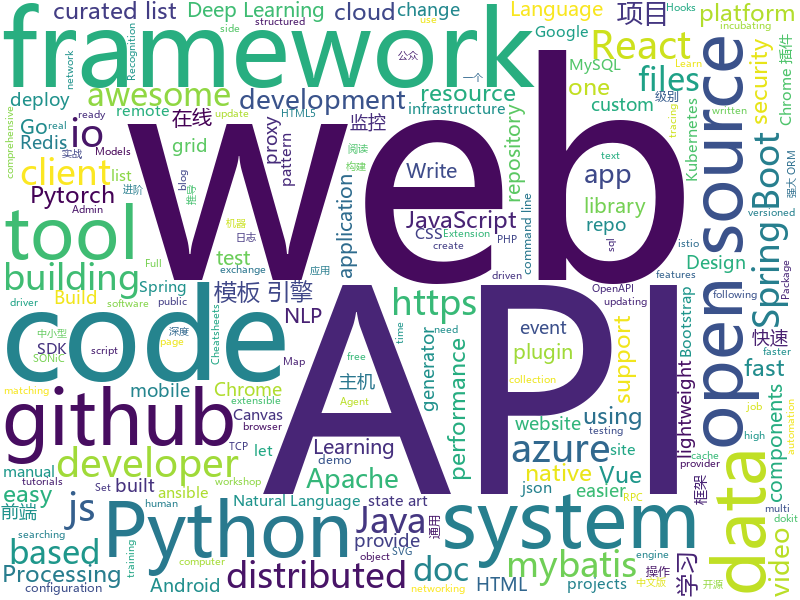

# 2020-05-13
See what the GitHub community is most excited about.

## python
+ [DeepLearning](https://github.com/MingchaoZhu/DeepLearning)(**186 stars today**): Python for “Deep Learning”，《深度学习》(花书) 数学推导、原理剖析与源码级别代码实现
+ [Python](https://github.com/TheAlgorithms/Python)(**99 stars today**): All Algorithms implemented in Python
+ [spycheck-linux](https://github.com/BjornRuytenberg/spycheck-linux)(**27 stars today**): Verify whether your Thunderbolt-enabled Linux system is vulnerable to the Thunderspy attacks.
+ [public-apis](https://github.com/public-apis/public-apis)(**248 stars today**): A collective list of free APIs for use in software and web development.
+ [azure-sdk-for-python](https://github.com/Azure/azure-sdk-for-python)(**5 stars today**): This repository is for active development of the Azure SDK for Python. For consumers of the SDK we recommend visiting our public developer docs at https://docs.microsoft.com/en-us/python/azure/ or our versioned developer docs at https://azure.github.io/azure-sdk-for-python.
+ [ansible](https://github.com/ansible/ansible)(**29 stars today**): Ansible is a radically simple IT automation platform that makes your applications and systems easier to deploy. Avoid writing scripts or custom code to deploy and update your applications — automate in a language that approaches plain English, using SSH, with no agents to install on remote systems. https://docs.ansible.com/ansible/
+ [pytorch-lightning](https://github.com/PyTorchLightning/pytorch-lightning)(**82 stars today**): The lightweight PyTorch wrapper for ML researchers. Scale your models. Write less boilerplate
+ [wait-for-it](https://github.com/vishnubob/wait-for-it)(**9 stars today**): Pure bash script to test and wait on the availability of a TCP host and port
+ [akshare](https://github.com/jindaxiang/akshare)(**19 stars today**): AkShare is an elegant and simple financial data interface library for Python, built for human beings! 开源财经数据接口库
+ [azure-cli](https://github.com/Azure/azure-cli)(**5 stars today**): Command-line tools for Azure.
+ [diagrams](https://github.com/mingrammer/diagrams)(**502 stars today**): 🎨Diagram as Code for prototyping cloud system architectures
+ [NLP-progress](https://github.com/sebastianruder/NLP-progress)(**19 stars today**): Repository to track the progress in Natural Language Processing (NLP), including the datasets and the current state-of-the-art for the most common NLP tasks.
+ [iOS-DeviceSupport](https://github.com/iGhibli/iOS-DeviceSupport)(**12 stars today**): This repository holds the device support files for the iOS, and I will update it regularly.
+ [U-2-Net](https://github.com/NathanUA/U-2-Net)(**103 stars today**): The code for our newly accepted paper in Pattern Recognition 2020: "U^2-Net: Going Deeper with Nested U-Structure for Salient Object Detection."
+ [spaCy](https://github.com/explosion/spaCy)(**12 stars today**): 💫Industrial-strength Natural Language Processing (NLP) with Python and Cython
+ [Kosmos](https://github.com/AtlasNX/Kosmos)(**7 stars today**): All-in-One CFW Package for the Nintendo Switch - previously SDFilesSwitch
+ [sympy](https://github.com/sympy/sympy)(**8 stars today**): A computer algebra system written in pure Python
+ [jina](https://github.com/jina-ai/jina)(**18 stars today**): Jina is the cloud-native neural search framework powered by state-of-the-art AI and deep learning
+ [superpaper](https://github.com/hhannine/superpaper)(**30 stars today**): A cross-platform multi monitor wallpaper manager.
+ [incubator-superset](https://github.com/apache/incubator-superset)(**14 stars today**): Apache Superset (incubating) is a modern, enterprise-ready business intelligence web application
+ [fastapi](https://github.com/tiangolo/fastapi)(**46 stars today**): FastAPI framework, high performance, easy to learn, fast to code, ready for production
+ [apex](https://github.com/NVIDIA/apex)(**7 stars today**): A PyTorch Extension: Tools for easy mixed precision and distributed training in Pytorch
+ [transformers](https://github.com/huggingface/transformers)(**68 stars today**): 🤗Transformers: State-of-the-art Natural Language Processing for Pytorch and TensorFlow 2.0.
+ [models](https://github.com/tensorflow/models)(**25 stars today**): Models and examples built with TensorFlow
+ [GPT2-Chinese](https://github.com/Morizeyao/GPT2-Chinese)(**46 stars today**): Chinese version of GPT2 training code, using BERT tokenizer.

## java
+ [spring-analysis](https://github.com/seaswalker/spring-analysis)(**134 stars today**): Spring源码阅读
+ [interviews](https://github.com/kdn251/interviews)(**182 stars today**): Everything you need to know to get the job.
+ [CS-Notes](https://github.com/CyC2018/CS-Notes)(**146 stars today**): 📚技术面试必备基础知识、Leetcode、计算机操作系统、计算机网络、系统设计、Java、Python、C++
+ [bazel](https://github.com/bazelbuild/bazel)(**8 stars today**): a fast, scalable, multi-language and extensible build system
+ [spring-boot-demo](https://github.com/xkcoding/spring-boot-demo)(**130 stars today**): spring boot demo 是一个用来深度学习并实战 spring boot 的项目，目前总共包含 65 个集成demo，已经完成 53 个。 该项目已成功集成 actuator(监控)、admin(可视化监控)、logback(日志)、aopLog(通过AOP记录web请求日志)、统一异常处理(json级别和页面级别)、freemarker(模板引擎)、thymeleaf(模板引擎)、Beetl(模板引擎)、Enjoy(模板引擎)、JdbcTemplate(通用JDBC操作数据库)、JPA(强大的ORM框架)、mybatis(强大的ORM框架)、通用Mapper(快速操作Mybatis)、PageHelper(通用的Mybatis分页插件)、mybatis-plus(快速操作M…
+ [redisson](https://github.com/redisson/redisson)(**18 stars today**): Redisson - Redis Java client with features of In-Memory Data Grid. Over 50 Redis based Java objects and services: Set, Multimap, SortedSet, Map, List, Queue, Deque, Semaphore, Lock, AtomicLong, Map Reduce, Publish / Subscribe, Bloom filter, Spring Cache, Tomcat, Scheduler, JCache API, Hibernate, MyBatis, RPC, local cache ...
+ [SpringBoot-Learning](https://github.com/dyc87112/SpringBoot-Learning)(**12 stars today**): Spring Boot基础教程，Spring Boot 2.x版本连载中！！！
+ [spring-boot-api-project-seed](https://github.com/lihengming/spring-boot-api-project-seed)(**18 stars today**): 🌱🚀一个基于Spring Boot & MyBatis的种子项目，用于快速构建中小型API、RESTful API项目~
+ [AndroidUtilCode](https://github.com/Blankj/AndroidUtilCode)(**19 stars today**): 🔥Android developers should collect the following utils(updating).
+ [dubbo](https://github.com/apache/dubbo)(**15 stars today**): Apache Dubbo is a high-performance, java based, open source RPC framework.
+ [react-native-navigation](https://github.com/wix/react-native-navigation)(**8 stars today**): A complete native navigation solution for React Native
+ [hbase](https://github.com/apache/hbase)(**3 stars today**): Apache HBase
+ [DoraemonKit](https://github.com/didi/DoraemonKit)(**19 stars today**): A full-featured App (iOS & Android) development assistant. You deserve it. 简称 "DoKit" 。一款功能齐全的客户端（ iOS 、Android、微信小程序 ）研发助手，你值得拥有。https://www.dokit.cn/
+ [pulsar](https://github.com/apache/pulsar)(**8 stars today**): Apache Pulsar - distributed pub-sub messaging system
+ [selenium](https://github.com/SeleniumHQ/selenium)(**13 stars today**): A browser automation framework and ecosystem.
+ [hive](https://github.com/apache/hive)(**10 stars today**): Apache Hive
+ [rocketmq-externals](https://github.com/apache/rocketmq-externals)(**8 stars today**): Mirror of Apache RocketMQ (Incubating)
+ [zipkin](https://github.com/openzipkin/zipkin)(**9 stars today**): Zipkin is a distributed tracing system
+ [Exchangis](https://github.com/WeBankFinTech/Exchangis)(**11 stars today**): Exchangis is a lightweight,highly extensible data exchange platform that supports data transmission between structured and unstructured heterogeneous data sources
+ [cryptomator](https://github.com/cryptomator/cryptomator)(**13 stars today**): Multi-platform transparent client-side encryption of your files in the cloud
+ [barcodescanner](https://github.com/dm77/barcodescanner)(**3 stars today**): Barcode Scanner Libraries for Android
+ [antlr4](https://github.com/antlr/antlr4)(**13 stars today**): ANTLR (ANother Tool for Language Recognition) is a powerful parser generator for reading, processing, executing, or translating structured text or binary files.
+ [kkFileView](https://github.com/kekingcn/kkFileView)(**11 stars today**): 使用spring boot打造文件文档在线预览项目解决方案，支持doc、docx、ppt、pptx、xls、xlsx、zip、rar、mp4，mp3以及众多类文本如txt、html、xml、java、properties、sql、js、md、json、conf、ini、vue、php、py、bat、gitignore等文件在线预览
+ [Spring-Boot-In-Action](https://github.com/hansonwang99/Spring-Boot-In-Action)(**11 stars today**): Spring Boot 系列实战合集
+ [tutorials](https://github.com/eugenp/tutorials)(**20 stars today**): Just Announced - "Learn Spring Security OAuth":

## unknown
+ [InterpretableMLBook](https://github.com/MingchaoZhu/InterpretableMLBook)(**435 stars today**): 《可解释的机器学习--黑盒模型可解释性理解指南》，该书为《Interpretable Machine Learning》中文版
+ [awesome-baremetal](https://github.com/alexellis/awesome-baremetal)(**94 stars today**): Bare-metal is awesome. Let's share our favourite tools.
+ [the-art-of-command-line](https://github.com/jlevy/the-art-of-command-line)(**84 stars today**): Master the command line, in one page
+ [pumpkin-book](https://github.com/datawhalechina/pumpkin-book)(**23 stars today**): 《机器学习》（西瓜书）公式推导解析，在线阅读地址：https://datawhalechina.github.io/pumpkin-book
+ [hksp](https://github.com/cloudsec/hksp)(**5 stars today**): Another kernel self protection
+ [OpenAPI-Specification](https://github.com/OAI/OpenAPI-Specification)(**11 stars today**): The OpenAPI Specification Repository
+ [deep-learning-drizzle](https://github.com/kmario23/deep-learning-drizzle)(**12 stars today**): Drench yourself in Deep Learning, Reinforcement Learning, Machine Learning, Computer Vision, and NLP by learning from these exciting lectures!!
+ [deep-stock](https://github.com/sangyx/deep-stock)(**36 stars today**): Deep Learning for Stock Market
+ [MIT-Linear-Algebra-Notes](https://github.com/yizhen20133868/MIT-Linear-Algebra-Notes)(**17 stars today**): Notes for MIT-Linear-Algebra
+ [api-guidelines](https://github.com/microsoft/api-guidelines)(**10 stars today**): Microsoft REST API Guidelines
+ [JavaScript-Algorithms](https://github.com/sisterAn/JavaScript-Algorithms)(**20 stars today**): 基础理论+JS框架应用+实践，从0到1构建整个前端算法体系
+ [Lab-Demo-Recordings](https://github.com/MicrosoftLearning/Lab-Demo-Recordings)(**4 stars today**): Recordings and Demos of Labs
+ [awesome-deep-learning](https://github.com/ChristosChristofidis/awesome-deep-learning)(**10 stars today**): A curated list of awesome Deep Learning tutorials, projects and communities.
+ [SPARROW](https://github.com/BasileLeparmentier/SPARROW)(**2 stars today**): 
+ [learn-istio](https://github.com/askmeegs/learn-istio)(**124 stars today**): ⛵️Istio resources🕸
+ [the-book-of-secret-knowledge](https://github.com/trimstray/the-book-of-secret-knowledge)(**17 stars today**): A collection of inspiring lists, manuals, cheatsheets, blogs, hacks, one-liners, cli/web tools and more.
+ [awesome-remote-job](https://github.com/lukasz-madon/awesome-remote-job)(**10 stars today**): A curated list of awesome remote jobs and resources. Inspired by https://github.com/vinta/awesome-python
+ [developer-roadmap](https://github.com/kamranahmedse/developer-roadmap)(**161 stars today**): Roadmap to becoming a web developer in 2020
+ [COVID-19](https://github.com/CSSEGISandData/COVID-19)(**52 stars today**): Novel Coronavirus (COVID-19) Cases, provided by JHU CSSE
+ [learn-regex](https://github.com/ziishaned/learn-regex)(**44 stars today**): Learn regex the easy way
+ [awesome-laravel](https://github.com/chiraggude/awesome-laravel)(**5 stars today**): A curated list of bookmarks, packages, tutorials, videos and other cool resources from the Laravel ecosystem
+ [precourse](https://github.com/NeuromatchAcademy/precourse)(**12 stars today**): A repo for the pre-course work at home exercises
+ [Best-websites-a-programmer-should-visit-zh](https://github.com/tuteng/Best-websites-a-programmer-should-visit-zh)(**43 stars today**): 程序员应该访问的最佳网站中文版
+ [github-issue-templates](https://github.com/stevemao/github-issue-templates)(**3 stars today**): 🔣A collection of GitHub issue and pull request templates

## javascript
+ [pose-animator](https://github.com/yemount/pose-animator)(**706 stars today**): 
+ [next.js](https://github.com/zeit/next.js)(**83 stars today**): The React Framework
+ [spug](https://github.com/openspug/spug)(**36 stars today**): 开源运维平台：面向中小型企业设计的无 Agent的自动化运维平台，整合了主机管理、主机批量执行、主机在线终端、应用发布、任务计划、配置中心、监控、报警等一系列功能。
+ [react-table](https://github.com/tannerlinsley/react-table)(**21 stars today**): ⚛️Hooks for building fast and extendable tables and datagrids for React
+ [gatsby](https://github.com/gatsbyjs/gatsby)(**30 stars today**): Build blazing fast, modern apps and websites with React
+ [Daily-Interview-Question](https://github.com/Advanced-Frontend/Daily-Interview-Question)(**38 stars today**): 我是木易杨，公众号「高级前端进阶」作者，每天搞定一道前端大厂面试题，祝大家天天进步，一年后会看到不一样的自己。
+ [bootstrap](https://github.com/twbs/bootstrap)(**58 stars today**): The most popular HTML, CSS, and JavaScript framework for developing responsive, mobile first projects on the web.
+ [video.js](https://github.com/videojs/video.js)(**15 stars today**): Video.js - open source HTML5 & Flash video player
+ [react-native](https://github.com/facebook/react-native)(**31 stars today**): A framework for building native apps with React.
+ [react-typescript-cheatsheet](https://github.com/typescript-cheatsheets/react-typescript-cheatsheet)(**33 stars today**): Cheatsheets for experienced React developers getting started with TypeScript
+ [bootstrap-vue](https://github.com/bootstrap-vue/bootstrap-vue)(**9 stars today**): BootstrapVue, with over 45 plugins, more than 85 custom components and over 500 icons, provides one of the most comprehensive implementations of Bootstrap v4 components and grid system for Vue.js. With extensive and automated WAI-ARIA accessibility markup.
+ [github-vscode-theme](https://github.com/primer/github-vscode-theme)(**155 stars today**): GitHub's VS Code theme
+ [ccxt](https://github.com/ccxt/ccxt)(**14 stars today**): A JavaScript / Python / PHP cryptocurrency trading API with support for more than 120 bitcoin/altcoin exchanges
+ [vue](https://github.com/vuejs/vue)(**91 stars today**): 🖖Vue.js is a progressive, incrementally-adoptable JavaScript framework for building UI on the web.
+ [material-ui](https://github.com/mui-org/material-ui)(**55 stars today**): React components for faster and easier web development. Build your own design system, or start with Material Design.
+ [bootstrap-datepicker](https://github.com/uxsolutions/bootstrap-datepicker)(**3 stars today**): A datepicker for twitter bootstrap (@twbs)
+ [markdown-here](https://github.com/adam-p/markdown-here)(**51 stars today**): Google Chrome, Firefox, and Thunderbird extension that lets you write email in Markdown and render it before sending.
+ [fullcalendar](https://github.com/fullcalendar/fullcalendar)(**4 stars today**): Full-sized drag & drop event calendar
+ [lib-jitsi-meet](https://github.com/jitsi/lib-jitsi-meet)(**7 stars today**): A low-level JS video API that allows adding a completely custom video experience to web apps.
+ [ChromeAppHeroes](https://github.com/zhaoolee/ChromeAppHeroes)(**35 stars today**): 🌈谷粒-Chrome插件英雄榜, 为优秀的Chrome插件写一本中文说明书, 让Chrome插件英雄们造福人类~ ChromePluginHeroes, Write a Chinese manual for the excellent Chrome plugin, let the Chrome plugin heroes benefit the human~ 公众号「0加1」同步更新
+ [select2](https://github.com/select2/select2)(**6 stars today**): Select2 is a jQuery based replacement for select boxes. It supports searching, remote data sets, and infinite scrolling of results.
+ [draft-js](https://github.com/facebook/draft-js)(**11 stars today**): A React framework for building text editors.
+ [axios](https://github.com/axios/axios)(**59 stars today**): Promise based HTTP client for the browser and node.js
+ [react-query](https://github.com/tannerlinsley/react-query)(**37 stars today**): ⚛️Hooks for fetching, caching and updating asynchronous data in React
+ [fabric.js](https://github.com/fabricjs/fabric.js)(**18 stars today**): Javascript Canvas Library, SVG-to-Canvas (& canvas-to-SVG) Parser

## html
+ [tidytuesday](https://github.com/rfordatascience/tidytuesday)(**24 stars today**): Official repo for the #tidytuesday project
+ [calico](https://github.com/projectcalico/calico)(**5 stars today**): Cloud native networking and network security
+ [swagger-codegen](https://github.com/swagger-api/swagger-codegen)(**10 stars today**): swagger-codegen contains a template-driven engine to generate documentation, API clients and server stubs in different languages by parsing your OpenAPI / Swagger definition.
+ [awesome-aws-workshops](https://github.com/dgomesbr/awesome-aws-workshops)(**14 stars today**): Unofficial curated list of awesome workshops found around in the internet. As we all have been there, finding that workshop that you have just attended shouldn't be hard. The idea is to provide an easy central repository, in a collaborative way.
+ [mxgraph](https://github.com/jgraph/mxgraph)(**14 stars today**): mxGraph is a fully client side JavaScript diagramming library
+ [hugo-academic](https://github.com/gcushen/hugo-academic)(**8 stars today**): 📝The website builder for Hugo. Build and deploy a beautiful website in minutes!
+ [html-css](https://github.com/gustavoguanabara/html-css)(**5 stars today**): Curso de HTML5 e CSS3
+ [eleventy-base-blog](https://github.com/11ty/eleventy-base-blog)(**10 stars today**): A starter repository for a blog web site using the Eleventy static site generator.
+ [masonry](https://github.com/desandro/masonry)(**3 stars today**): 🏩Cascading grid layout plugin
+ [ecma262](https://github.com/tc39/ecma262)(**11 stars today**): Status, process, and documents for ECMA-262
+ [stisla](https://github.com/stisla/stisla)(**10 stars today**): Free Bootstrap Admin Template
+ [SONiC](https://github.com/Azure/SONiC)(**3 stars today**): Landing page for Software for Open Networking in the Cloud (SONiC) - http://azure.github.io/SONiC/
+ [owasp-mstg](https://github.com/OWASP/owasp-mstg)(**8 stars today**): The Mobile Security Testing Guide (MSTG) is a comprehensive manual for mobile app security development, testing and reverse engineering.
+ [v-calendar](https://github.com/nathanreyes/v-calendar)(**5 stars today**): A lightweight, dependency-free plugin for building attributed calendars in Vue.js
+ [webdevbootcamp](https://github.com/nax3t/webdevbootcamp)(**4 stars today**): All source code for back-end projects from the Web Developer Bootcamp
+ [fonts](https://github.com/google/fonts)(**7 stars today**): Font files available from Google Fonts
+ [bulma-templates](https://github.com/BulmaTemplates/bulma-templates)(**3 stars today**): free flexbox templates built with the bulma css framework
+ [sketch-measure](https://github.com/utom/sketch-measure)(**7 stars today**): Make it a fun to create spec for developers and teammates
+ [material-design-lite](https://github.com/google/material-design-lite)(**6 stars today**): Material Design Components in HTML/CSS/JS
+ [django-DefectDojo](https://github.com/DefectDojo/django-DefectDojo)(**3 stars today**): DefectDojo is an open-source application vulnerability correlation and security orchestration tool.
+ [Django-CRM](https://github.com/MicroPyramid/Django-CRM)(**3 stars today**): Open Source Python CRM based on Django
+ [kubernetes-failure-stories](https://github.com/hjacobs/kubernetes-failure-stories)(**20 stars today**): Compilation of public failure/horror stories related to Kubernetes
+ [space-grotesk](https://github.com/floriankarsten/space-grotesk)(**4 stars today**): Space Grotesk: Sans-serif typeface derived from Space Mono
+ [istio.io](https://github.com/istio/istio.io)(**0 stars today**): Source for the istio.io site
+ [Java-Interview-Advanced](https://github.com/shishan100/Java-Interview-Advanced)(**6 stars today**): 中华石杉--互联网Java进阶面试训练营

## go
+ [terraform-provider-azurerm](https://github.com/terraform-providers/terraform-provider-azurerm)(**10 stars today**): Terraform provider for Azure Resource Manager
+ [terratest](https://github.com/gruntwork-io/terratest)(**5 stars today**): Terratest is a Go library that makes it easier to write automated tests for your infrastructure code.
+ [dapr](https://github.com/dapr/dapr)(**32 stars today**): Dapr is a portable, event-driven, runtime for building distributed applications across cloud and edge.
+ [goreplay](https://github.com/buger/goreplay)(**14 stars today**): GoReplay is an open-source tool for capturing and replaying live HTTP traffic into a test environment in order to continuously test your system with real data. It can be used to increase confidence in code deployments, configuration changes and infrastructure changes.
+ [redis](https://github.com/go-redis/redis)(**12 stars today**): Type-safe Redis client for Golang
+ [influxdb](https://github.com/influxdata/influxdb)(**8 stars today**): Scalable datastore for metrics, events, and real-time analytics
+ [kubernetes](https://github.com/kubernetes/kubernetes)(**44 stars today**): Production-Grade Container Scheduling and Management
+ [viper](https://github.com/spf13/viper)(**27 stars today**): Go configuration with fangs
+ [git-hound](https://github.com/tillson/git-hound)(**74 stars today**): GitHound pinpoints exposed API keys on GitHub using pattern matching, commit history searching, and a unique result scoring system. A batch-catching, pattern-matching, patch-attacking secret snatcher.
+ [cli](https://github.com/cli/cli)(**83 stars today**): GitHub’s official command line tool
+ [tidb](https://github.com/pingcap/tidb)(**24 stars today**): TiDB is an open source distributed HTAP database compatible with the MySQL protocol
+ [flux](https://github.com/fluxcd/flux)(**14 stars today**): The GitOps Kubernetes operator
+ [oauth2-proxy](https://github.com/oauth2-proxy/oauth2-proxy)(**10 stars today**): A reverse proxy that provides authentication with Google, Github or other providers.
+ [go](https://github.com/golang/go)(**55 stars today**): The Go programming language
+ [gin](https://github.com/gin-gonic/gin)(**49 stars today**): Gin is a HTTP web framework written in Go (Golang). It features a Martini-like API with much better performance -- up to 40 times faster. If you need smashing performance, get yourself some Gin.
+ [argo](https://github.com/argoproj/argo)(**11 stars today**): Argo Workflows: Get stuff done with Kubernetes.
+ [tailscale](https://github.com/tailscale/tailscale)(**17 stars today**): The easiest, most secure way to use WireGuard and 2FA.
+ [toxiproxy](https://github.com/Shopify/toxiproxy)(**7 stars today**): ⏰🔥A TCP proxy to simulate network and system conditions for chaos and resiliency testing
+ [mysql](https://github.com/go-sql-driver/mysql)(**10 stars today**): Go MySQL Driver is a MySQL driver for Go's (golang) database/sql package
+ [opa](https://github.com/open-policy-agent/opa)(**12 stars today**): An open source, general-purpose policy engine.
+ [opentelemetry-collector](https://github.com/open-telemetry/opentelemetry-collector)(**4 stars today**): OpenTelemetry Service
+ [grpc-gateway](https://github.com/grpc-ecosystem/grpc-gateway)(**16 stars today**): gRPC to JSON proxy generator following the gRPC HTTP spec
+ [terraform](https://github.com/hashicorp/terraform)(**17 stars today**): Terraform enables you to safely and predictably create, change, and improve infrastructure. It is an open source tool that codifies APIs into declarative configuration files that can be shared amongst team members, treated as code, edited, reviewed, and versioned.
+ [jaeger](https://github.com/jaegertracing/jaeger)(**13 stars today**): CNCF Jaeger, a Distributed Tracing Platform
+ [linkerd2](https://github.com/linkerd/linkerd2)(**5 stars today**): A service mesh for Kubernetes and beyond. Main repo for Linkerd 2.x.

## WordCloud

