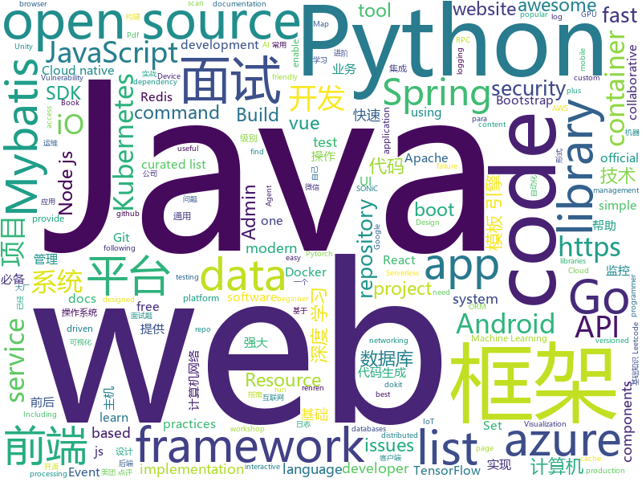

# 2020-05-14
See what the GitHub community is most excited about.

## python
+ [Python](https://github.com/TheAlgorithms/Python)(**164 stars today**): All Algorithms implemented in Python
+ [diagrams](https://github.com/mingrammer/diagrams)(**226 stars today**): 🎨Diagram as Code for prototyping cloud system architectures
+ [DeepLearning](https://github.com/MingchaoZhu/DeepLearning)(**290 stars today**): Python for “Deep Learning”，《深度学习》(花书) 数学推导、原理剖析与源码级别代码实现
+ [horovod](https://github.com/horovod/horovod)(**16 stars today**): Distributed training framework for TensorFlow, Keras, PyTorch, and Apache MXNet.
+ [DeepFaceLab](https://github.com/iperov/DeepFaceLab)(**49 stars today**): DeepFaceLab is the leading software for creating deepfakes.
+ [transformers](https://github.com/huggingface/transformers)(**107 stars today**): 🤗Transformers: State-of-the-art Natural Language Processing for Pytorch and TensorFlow 2.0.
+ [azure-sdk-for-python](https://github.com/Azure/azure-sdk-for-python)(**6 stars today**): This repository is for active development of the Azure SDK for Python. For consumers of the SDK we recommend visiting our public developer docs at https://docs.microsoft.com/en-us/python/azure/ or our versioned developer docs at https://azure.github.io/azure-sdk-for-python.
+ [bert](https://github.com/google-research/bert)(**29 stars today**): TensorFlow code and pre-trained models for BERT
+ [ResNeSt](https://github.com/zhanghang1989/ResNeSt)(**21 stars today**): ResNeSt: Split-Attention Network
+ [mmf](https://github.com/facebookresearch/mmf)(**24 stars today**): A modular framework for vision & language multimodal research from Facebook AI Research (FAIR)
+ [jax](https://github.com/google/jax)(**17 stars today**): Composable transformations of Python+NumPy programs: differentiate, vectorize, JIT to GPU/TPU, and more
+ [requests](https://github.com/psf/requests)(**13 stars today**): A simple, yet elegant HTTP library.
+ [ml-agents](https://github.com/Unity-Technologies/ml-agents)(**24 stars today**): Unity Machine Learning Agents Toolkit
+ [bokeh](https://github.com/bokeh/bokeh)(**9 stars today**): Interactive Data Visualization in the browser, from Python
+ [blackhat-python3](https://github.com/EONRaider/blackhat-python3)(**104 stars today**): Source code for the book "Black Hat Python" by Justin Seitz. The code has been fully converted to Python 3, reformatted to comply with PEP8 standards and refactored to eliminate issues of dependency resolution involving deprecated modules.
+ [alexa-actions](https://github.com/keatontaylor/alexa-actions)(**9 stars today**): A README and associated code to get actionable notifications setup for Alexa devices.
+ [scanyourpdf](https://github.com/baicunko/scanyourpdf)(**55 stars today**): Repository for the Scan Your Pdf community
+ [prefect](https://github.com/PrefectHQ/prefect)(**21 stars today**): The Prefect workflow platform
+ [bips](https://github.com/bitcoin/bips)(**3 stars today**): Bitcoin Improvement Proposals
+ [StanfordQuadruped](https://github.com/stanfordroboticsclub/StanfordQuadruped)(**25 stars today**): 
+ [models](https://github.com/tensorflow/models)(**37 stars today**): Models and examples built with TensorFlow
+ [public-apis](https://github.com/public-apis/public-apis)(**157 stars today**): A collective list of free APIs for use in software and web development.
+ [poetry](https://github.com/python-poetry/poetry)(**24 stars today**): Python dependency management and packaging made easy.
+ [eat_tensorflow2_in_30_days](https://github.com/lyhue1991/eat_tensorflow2_in_30_days)(**80 stars today**): Tensorflow2.0🍎🍊is delicious, just eat it!😋😋
+ [bandit](https://github.com/PyCQA/bandit)(**3 stars today**): Bandit is a tool designed to find common security issues in Python code.

## java
+ [jeecg-boot](https://github.com/zhangdaiscott/jeecg-boot)(**96 stars today**): 基于代码生成器的低代码开发平台，开源界“小普元”超越传统商业开发平台！前后端分离架构：SpringBoot 2.x，Ant Design&Vue，Mybatis-plus，Shiro，JWT。强大的代码生成器让前后端代码一键生成，无需写任何代码! 引领新开发模式(OnlineCoding-> 代码生成-> 手工MERGE)，帮助Java项目解决70%重复工作，让开发更关注业务逻辑，既能快速提高开发效率，帮助公司节省成本，同时又不失灵活性。
+ [spring-analysis](https://github.com/seaswalker/spring-analysis)(**132 stars today**): Spring源码阅读
+ [testcontainers-java](https://github.com/testcontainers/testcontainers-java)(**7 stars today**): Testcontainers is a Java library that supports JUnit tests, providing lightweight, throwaway instances of common databases, Selenium web browsers, or anything else that can run in a Docker container.
+ [tutorials](https://github.com/eugenp/tutorials)(**26 stars today**): Just Announced - "Learn Spring Security OAuth":
+ [AndroidUtilCode](https://github.com/Blankj/AndroidUtilCode)(**25 stars today**): 🔥Android developers should collect the following utils(updating).
+ [redisson](https://github.com/redisson/redisson)(**25 stars today**): Redisson - Redis Java client with features of In-Memory Data Grid. Over 50 Redis based Java objects and services: Set, Multimap, SortedSet, Map, List, Queue, Deque, Semaphore, Lock, AtomicLong, Map Reduce, Publish / Subscribe, Bloom filter, Spring Cache, Tomcat, Scheduler, JCache API, Hibernate, MyBatis, RPC, local cache ...
+ [dp3t-sdk-android](https://github.com/DP-3T/dp3t-sdk-android)(**43 stars today**): The DP3T-SDK for Android
+ [Auto.js](https://github.com/hyb1996/Auto.js)(**15 stars today**): A UiAutomator on android, does not need root access(安卓平台上的JavaScript自动化工具)
+ [CS-Notes](https://github.com/CyC2018/CS-Notes)(**132 stars today**): 📚技术面试必备基础知识、Leetcode、计算机操作系统、计算机网络、系统设计、Java、Python、C++
+ [mockito](https://github.com/mockito/mockito)(**8 stars today**): Most popular Mocking framework for unit tests written in Java
+ [debezium](https://github.com/debezium/debezium)(**7 stars today**): Change data capture for a variety of databases. Please log issues at https://issues.redhat.com/browse/DBZ.
+ [mapstruct](https://github.com/mapstruct/mapstruct)(**7 stars today**): An annotation processor for generating type-safe bean mappers
+ [spring-boot-demo](https://github.com/xkcoding/spring-boot-demo)(**100 stars today**): spring boot demo 是一个用来深度学习并实战 spring boot 的项目，目前总共包含 65 个集成demo，已经完成 53 个。 该项目已成功集成 actuator(监控)、admin(可视化监控)、logback(日志)、aopLog(通过AOP记录web请求日志)、统一异常处理(json级别和页面级别)、freemarker(模板引擎)、thymeleaf(模板引擎)、Beetl(模板引擎)、Enjoy(模板引擎)、JdbcTemplate(通用JDBC操作数据库)、JPA(强大的ORM框架)、mybatis(强大的ORM框架)、通用Mapper(快速操作Mybatis)、PageHelper(通用的Mybatis分页插件)、mybatis-plus(快速操作M…
+ [DoraemonKit](https://github.com/didi/DoraemonKit)(**32 stars today**): A full-featured App (iOS & Android) development assistant. You deserve it. 简称 "DoKit" 。一款功能齐全的客户端（ iOS 、Android、微信小程序 ）研发助手，你值得拥有。https://www.dokit.cn/
+ [cat](https://github.com/dianping/cat)(**12 stars today**): CAT 作为服务端项目基础组件，提供了 Java, C/C++, Node.js, Python, Go 等多语言客户端，已经在美团点评的基础架构中间件框架（MVC框架，RPC框架，数据库框架，缓存框架等，消息队列，配置系统等）深度集成，为美团点评各业务线提供系统丰富的性能指标、健康状况、实时告警等。
+ [zuul](https://github.com/Netflix/zuul)(**9 stars today**): Zuul is a gateway service that provides dynamic routing, monitoring, resiliency, security, and more.
+ [Hystrix](https://github.com/Netflix/Hystrix)(**12 stars today**): Hystrix is a latency and fault tolerance library designed to isolate points of access to remote systems, services and 3rd party libraries, stop cascading failure and enable resilience in complex distributed systems where failure is inevitable.
+ [dropwizard](https://github.com/dropwizard/dropwizard)(**5 stars today**): A damn simple library for building production-ready RESTful web services.
+ [interviews](https://github.com/kdn251/interviews)(**125 stars today**): Everything you need to know to get the job.
+ [zeppelin](https://github.com/apache/zeppelin)(**2 stars today**): Web-based notebook that enables data-driven, interactive data analytics and collaborative documents with SQL, Scala and more.
+ [spring-boot-admin](https://github.com/codecentric/spring-boot-admin)(**11 stars today**): Admin UI for administration of spring boot applications
+ [thingsboard](https://github.com/thingsboard/thingsboard)(**14 stars today**): Open-source IoT Platform - Device management, data collection, processing and visualization.
+ [ignite](https://github.com/apache/ignite)(**7 stars today**): Apache Ignite
+ [spring-kafka](https://github.com/spring-projects/spring-kafka)(**2 stars today**): Provides Familiar Spring Abstractions for Apache Kafka
+ [ExoPlayer](https://github.com/google/ExoPlayer)(**12 stars today**): An extensible media player for Android

## unknown
+ [AWS-SAA-C02-Course](https://github.com/alozano-77/AWS-SAA-C02-Course)(**38 stars today**): Personal notes for SAA-C02 test from:
+ [learn-programming-languages](https://github.com/jeanqasaur/learn-programming-languages)(**40 stars today**): Resources for the working programmer to learn more about the fundamentals and theory of programming languages.
+ [InterpretableMLBook](https://github.com/MingchaoZhu/InterpretableMLBook)(**296 stars today**): 《可解释的机器学习--黑盒模型可解释性理解指南》，该书为《Interpretable Machine Learning》中文版
+ [awesome-baremetal](https://github.com/alexellis/awesome-baremetal)(**86 stars today**): Bare-metal is awesome. Let's share our favourite tools.
+ [hacker-laws](https://github.com/dwmkerr/hacker-laws)(**316 stars today**): 💻📖Laws, Theories, Principles and Patterns that developers will find useful. #hackerlaws
+ [rdpwrap](https://github.com/fre4kyC0de/rdpwrap)(**10 stars today**): New offsets for RDP Wrapper Library
+ [100DaysOfMLCode](https://github.com/ayonroy2000/100DaysOfMLCode)(**7 stars today**): This repository contains all the required resources regarding the 100+ Days Of ML Code Telgram Group which was driven by me from 1-1-2019 to 31-12-2019 !!
+ [rust-blog](https://github.com/pretzelhammer/rust-blog)(**72 stars today**): Educational blog posts for Rust beginners
+ [por-onde-comecar](https://github.com/leticiadasilva/por-onde-comecar)(**19 stars today**): 
+ [Waking-Up](https://github.com/wolverinn/Waking-Up)(**16 stars today**): 计算机基础（计算机网络/操作系统/数据库/Git...）面试问题全面总结，包含详细的follow-up question以及答案；全部采用【问题+追问+答案】的形式，即拿即用，直击互联网大厂面试🚀；可用于模拟面试、面试前复习、短期内快速备战面试...
+ [3y](https://github.com/ZhongFuCheng3y/3y)(**61 stars today**): 📓从Java基础、JavaWeb基础到常用的框架再到面试题都有完整的教程，几乎涵盖了Java后端必备的知识点
+ [the-art-of-command-line](https://github.com/jlevy/the-art-of-command-line)(**100 stars today**): Master the command line, in one page
+ [fed-e-readme](https://github.com/lagoufed/fed-e-readme)(**9 stars today**): 拉勾教育 - 大前端高薪进阶训练营入营资料
+ [javascript-questions](https://github.com/lydiahallie/javascript-questions)(**27 stars today**): A long list of (advanced) JavaScript questions, and their explanations✨
+ [Best-websites-a-programmer-should-visit](https://github.com/sdmg15/Best-websites-a-programmer-should-visit)(**20 stars today**): 🔗Some useful websites for programmers.
+ [aksp](https://github.com/cloudsec/aksp)(**7 stars today**): Another kernel self protection
+ [DeepLearning-500-questions](https://github.com/scutan90/DeepLearning-500-questions)(**21 stars today**): 深度学习500问，以问答形式对常用的概率知识、线性代数、机器学习、深度学习、计算机视觉等热点问题进行阐述，以帮助自己及有需要的读者。 全书分为18个章节，50余万字。由于水平有限，书中不妥之处恳请广大读者批评指正。 未完待续............ 如有意合作，联系scutjy2015@163.com 版权所有，违权必究 Tan 2018.06
+ [brunch](https://github.com/sebanc/brunch)(**12 stars today**): Boot ChromeOS on any PC (with UEFI firmware and Intel GPU)
+ [JavaScript-Algorithms](https://github.com/sisterAn/JavaScript-Algorithms)(**15 stars today**): 基础理论+JS框架应用+实践，从0到1构建整个前端算法体系
+ [for-win](https://github.com/docker/for-win)(**4 stars today**): Bug reports for Docker Desktop for Windows
+ [awesome-ddd](https://github.com/heynickc/awesome-ddd)(**7 stars today**): A curated list of Domain-Driven Design (DDD), Command Query Responsibility Segregation (CQRS), Event Sourcing, and Event Storming resources
+ [vagas](https://github.com/frontendbr/vagas)(**4 stars today**): 🔬Espaço para divulgação de vagas para front-enders.
+ [course-content](https://github.com/NeuromatchAcademy/course-content)(**9 stars today**): Summer course content for Neuromatch Academy
+ [OpenAPI-Specification](https://github.com/OAI/OpenAPI-Specification)(**11 stars today**): The OpenAPI Specification Repository
+ [JavaInterview](https://github.com/OUYANGSIHAI/JavaInterview)(**20 stars today**): 【Java面试+Java后端技术学习指南】：一份通向理想互联网公司的面试指南，包括 Java，技术面试必备基础知识、Leetcode、计算机操作系统、计算机网络、系统设计、分布式、数据库（MySQL、Redis）、Java 项目实战等

## javascript
+ [intelligent-test-platform](https://github.com/alibaba/intelligent-test-platform)(**49 stars today**): intelligent-test-platform
+ [spug](https://github.com/openspug/spug)(**60 stars today**): 开源运维平台：面向中小型企业设计的无 Agent的自动化运维平台，整合了主机管理、主机批量执行、主机在线终端、应用发布、任务计划、配置中心、监控、报警等一系列功能。
+ [yapi](https://github.com/YMFE/yapi)(**45 stars today**): YApi 是一个可本地部署的、打通前后端及QA的、可视化的接口管理平台
+ [dom-testing-library](https://github.com/testing-library/dom-testing-library)(**8 stars today**): 🐙Simple and complete DOM testing utilities that encourage good testing practices.
+ [react-interactive-paycard](https://github.com/jasminmif/react-interactive-paycard)(**74 stars today**): Interactive React Paycard
+ [puppeteer](https://github.com/puppeteer/puppeteer)(**50 stars today**): Headless Chrome Node.js API
+ [Daily-Interview-Question](https://github.com/Advanced-Frontend/Daily-Interview-Question)(**37 stars today**): 我是木易杨，公众号「高级前端进阶」作者，每天搞定一道前端大厂面试题，祝大家天天进步，一年后会看到不一样的自己。
+ [bootstrap](https://github.com/twbs/bootstrap)(**54 stars today**): The most popular HTML, CSS, and JavaScript framework for developing responsive, mobile first projects on the web.
+ [serverless](https://github.com/serverless/serverless)(**23 stars today**): ⚡Serverless Framework – Build web, mobile and IoT applications with serverless architectures using AWS Lambda, Azure Functions, Google CloudFunctions & more! –
+ [lodash](https://github.com/lodash/lodash)(**29 stars today**): A modern JavaScript utility library delivering modularity, performance, & extras.
+ [appium](https://github.com/appium/appium)(**11 stars today**): 📱Automation for iOS, Android, and Windows Apps.
+ [renren-fast-vue](https://github.com/renrenio/renren-fast-vue)(**42 stars today**): renren-fast-vue基于vue、element-ui构建开发，实现renren-fast后台管理前端功能，提供一套更优的前端解决方案。
+ [nodebestpractices](https://github.com/goldbergyoni/nodebestpractices)(**52 stars today**): ✅The Node.js best practices list (May 2020)
+ [graphql-js](https://github.com/graphql/graphql-js)(**9 stars today**): A reference implementation of GraphQL for JavaScript
+ [strapi](https://github.com/strapi/strapi)(**45 stars today**): 🚀Open source Node.js Headless CMS to easily build customisable APIs
+ [next.js](https://github.com/zeit/next.js)(**78 stars today**): The React Framework
+ [bootstrap-vue](https://github.com/bootstrap-vue/bootstrap-vue)(**5 stars today**): BootstrapVue, with over 45 plugins, more than 85 custom components and over 500 icons, provides one of the most comprehensive implementations of Bootstrap v4 components and grid system for Vue.js. With extensive and automated WAI-ARIA accessibility markup.
+ [awx](https://github.com/ansible/awx)(**10 stars today**): AWX Project
+ [react-virtualized](https://github.com/bvaughn/react-virtualized)(**18 stars today**): React components for efficiently rendering large lists and tabular data
+ [lib-jitsi-meet](https://github.com/jitsi/lib-jitsi-meet)(**6 stars today**): A low-level JS video API that allows adding a completely custom video experience to web apps.
+ [create-react-app](https://github.com/facebook/create-react-app)(**36 stars today**): Set up a modern web app by running one command.
+ [gatsby](https://github.com/gatsbyjs/gatsby)(**39 stars today**): Build blazing fast, modern apps and websites with React
+ [draggable](https://github.com/Shopify/draggable)(**13 stars today**): The JavaScript Drag & Drop library your grandparents warned you about.
+ [Semantic-UI-React](https://github.com/Semantic-Org/Semantic-UI-React)(**12 stars today**): The official Semantic-UI-React integration
+ [react-sortable-hoc](https://github.com/clauderic/react-sortable-hoc)(**11 stars today**): A set of higher-order components to turn any list into an animated, accessible and touch-friendly sortable list✌️

## html
+ [Graphics](https://github.com/Unity-Technologies/Graphics)(**3 stars today**): Unity Graphics - Including Scriptable Render Pipeline
+ [aws-well-architected-labs](https://github.com/awslabs/aws-well-architected-labs)(**5 stars today**): Hands on labs and code to help you learn, measure, and build using architectural best practices.
+ [tidytuesday](https://github.com/rfordatascience/tidytuesday)(**21 stars today**): Official repo for the #tidytuesday project
+ [django-DefectDojo](https://github.com/DefectDojo/django-DefectDojo)(**9 stars today**): DefectDojo is an open-source application vulnerability correlation and security orchestration tool.
+ [website](https://github.com/kubernetes/website)(**5 stars today**): Kubernetes website and documentation repo:
+ [training-kit](https://github.com/github/training-kit)(**2 stars today**): Open source cheat sheets for Git and GitHub
+ [awesome-aws-workshops](https://github.com/dgomesbr/awesome-aws-workshops)(**11 stars today**): Unofficial curated list of awesome workshops found around in the internet. As we all have been there, finding that workshop that you have just attended shouldn't be hard. The idea is to provide an easy central repository, in a collaborative way.
+ [startbootstrap-sb-admin-2](https://github.com/BlackrockDigital/startbootstrap-sb-admin-2)(**10 stars today**): A free, open source, Bootstrap admin theme created by Start Bootstrap
+ [quarkus-tutorial](https://github.com/redhat-developer-demos/quarkus-tutorial)(**2 stars today**): Quarkus Tutorial for https://dn.dev/master
+ [seldon-core](https://github.com/SeldonIO/seldon-core)(**4 stars today**): A framework to deploy, manage and scale your production machine learning to thousands of models
+ [docker-ecs-lab](https://github.com/bikrambora/docker-ecs-lab)(**24 stars today**): Build and Run a Containerized Web Application using Docker and Amazon Elastic Container Service (ECS)
+ [fastText](https://github.com/facebookresearch/fastText)(**12 stars today**): Library for fast text representation and classification.
+ [kelaskita](https://github.com/zuramai/kelaskita)(**18 stars today**): Website untuk kelas berbasis PHP Laravel
+ [chatcord](https://github.com/bradtraversy/chatcord)(**5 stars today**): Realtime chat app with rooms
+ [Awesome-CS-Books](https://github.com/wx-chevalier/Awesome-CS-Books)(**12 stars today**): 📚Awesome CS Books/Series(.pdf by git lfs) Warehouse for Geeks, ProgrammingLanguage, SoftwareEngineering, Web, AI, ServerSideApplication, Infrastructure, FE etc.💫优秀计算机科学与技术领域相关的书籍归档。
+ [TheHive](https://github.com/TheHive-Project/TheHive)(**3 stars today**): TheHive: a Scalable, Open Source and Free Security Incident Response Platform
+ [docs](https://github.com/knative/docs)(**1 stars today**): User documentation for Knative components
+ [SONiC](https://github.com/Azure/SONiC)(**5 stars today**): Landing page for Software for Open Networking in the Cloud (SONiC) - http://azure.github.io/SONiC/
+ [fileUploadDemo](https://github.com/jiaozitang/fileUploadDemo)(**8 stars today**): Node 实现大文件分片上传、断点续传
+ [web-moderno](https://github.com/cod3rcursos/web-moderno)(**6 stars today**): 
+ [calico](https://github.com/projectcalico/calico)(**3 stars today**): Cloud native networking and network security
+ [gentelella](https://github.com/ColorlibHQ/gentelella)(**6 stars today**): Free Bootstrap 4 Admin Dashboard Template
+ [wpt](https://github.com/web-platform-tests/wpt)(**1 stars today**): Test suites for Web platform specs — including WHATWG, W3C, and others
+ [nodejs_wx_aipay_api](https://github.com/yioMe/nodejs_wx_aipay_api)(**15 stars today**): 微信支付宝个人免签收款Api系统，有了它对接再也不用担心我的业务不能支付了
+ [styleguide](https://github.com/google/styleguide)(**13 stars today**): Style guides for Google-originated open-source projects

## go
+ [cli](https://github.com/cli/cli)(**115 stars today**): GitHub’s official command line tool
+ [harbor](https://github.com/goharbor/harbor)(**26 stars today**): An open source trusted cloud native registry project that stores, signs, and scans content.
+ [Prometheus-Basics](https://github.com/yolossn/Prometheus-Basics)(**287 stars today**): A beginner friendly introduction to prometheus🔥
+ [flux](https://github.com/fluxcd/flux)(**14 stars today**): The GitOps Kubernetes operator
+ [terraform-provider-azurerm](https://github.com/terraform-providers/terraform-provider-azurerm)(**7 stars today**): Terraform provider for Azure Resource Manager
+ [grpc-gateway](https://github.com/grpc-ecosystem/grpc-gateway)(**16 stars today**): gRPC to JSON proxy generator following the gRPC HTTP spec
+ [helm](https://github.com/helm/helm)(**21 stars today**): The Kubernetes Package Manager
+ [terraform](https://github.com/hashicorp/terraform)(**25 stars today**): Terraform enables you to safely and predictably create, change, and improve infrastructure. It is an open source tool that codifies APIs into declarative configuration files that can be shared amongst team members, treated as code, edited, reviewed, and versioned.
+ [awesome-go](https://github.com/avelino/awesome-go)(**43 stars today**): A curated list of awesome Go frameworks, libraries and software
+ [skaffold](https://github.com/GoogleContainerTools/skaffold)(**11 stars today**): Easy and Repeatable Kubernetes Development
+ [moby](https://github.com/moby/moby)(**14 stars today**): Moby Project - a collaborative project for the container ecosystem to assemble container-based systems
+ [logrus](https://github.com/sirupsen/logrus)(**17 stars today**): Structured, pluggable logging for Go.
+ [loki](https://github.com/grafana/loki)(**16 stars today**): Like Prometheus, but for logs.
+ [opa](https://github.com/open-policy-agent/opa)(**16 stars today**): An open source, general-purpose policy engine.
+ [clair](https://github.com/quay/clair)(**5 stars today**): Vulnerability Static Analysis for Containers
+ [kubernetes](https://github.com/kubernetes/kubernetes)(**46 stars today**): Production-Grade Container Scheduling and Management
+ [traefik](https://github.com/containous/traefik)(**27 stars today**): The Cloud Native Edge Router
+ [knowledge](https://github.com/nikitavoloboev/knowledge)(**62 stars today**): Everything I know
+ [zap](https://github.com/uber-go/zap)(**11 stars today**): Blazing fast, structured, leveled logging in Go.
+ [grpc-go](https://github.com/grpc/grpc-go)(**12 stars today**): The Go language implementation of gRPC. HTTP/2 based RPC
+ [terraform-provider-aws](https://github.com/terraform-providers/terraform-provider-aws)(**12 stars today**): Terraform AWS provider
+ [cobra](https://github.com/spf13/cobra)(**17 stars today**): A Commander for modern Go CLI interactions
+ [influxdb](https://github.com/influxdata/influxdb)(**14 stars today**): Scalable datastore for metrics, events, and real-time analytics
+ [helmfile](https://github.com/roboll/helmfile)(**6 stars today**): Deploy Kubernetes Helm Charts
+ [go-ethereum](https://github.com/ethereum/go-ethereum)(**12 stars today**): Official Go implementation of the Ethereum protocol

## WordCloud

