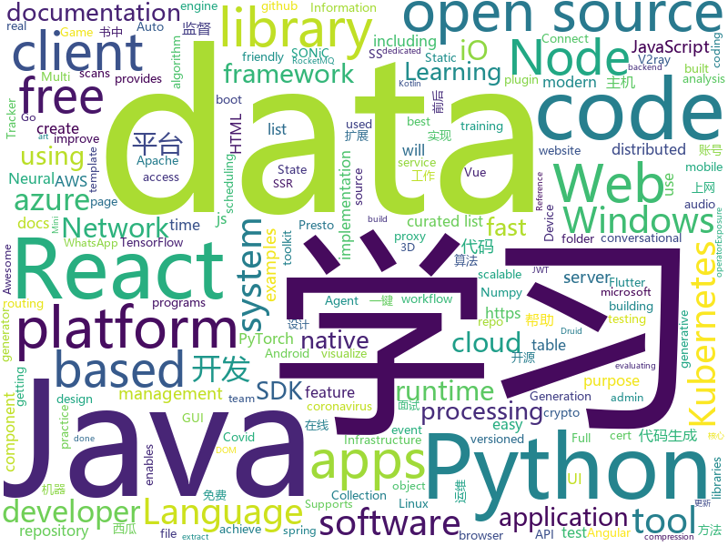

# 2020-05-16
See what the GitHub community is most excited about.

## python
+ [Python](https://github.com/TheAlgorithms/Python)(**191 stars today**): All Algorithms implemented in Python
+ [Statistical-Learning-Method_Code](https://github.com/Dod-o/Statistical-Learning-Method_Code)(**112 stars today**): 手写实现李航《统计学习方法》书中全部算法
+ [detectron2](https://github.com/facebookresearch/detectron2)(**51 stars today**): Detectron2 is FAIR's next-generation platform for object detection and segmentation.
+ [jax](https://github.com/google/jax)(**44 stars today**): Composable transformations of Python+NumPy programs: differentiate, vectorize, JIT to GPU/TPU, and more
+ [diagrams](https://github.com/mingrammer/diagrams)(**253 stars today**): 🎨Diagram as Code for prototyping cloud system architectures
+ [covid-19](https://github.com/datasets/covid-19)(**8 stars today**): Novel Coronavirus 2019 time series data on cases
+ [horovod](https://github.com/horovod/horovod)(**47 stars today**): Distributed training framework for TensorFlow, Keras, PyTorch, and Apache MXNet.
+ [nni](https://github.com/microsoft/nni)(**18 stars today**): An open source AutoML toolkit for automate machine learning lifecycle, including feature engineering, neural architecture search, model compression and hyper-parameter tuning.
+ [cdk8s](https://github.com/awslabs/cdk8s)(**122 stars today**): Define Kubernetes native apps and abstractions using object-oriented programming
+ [Realtime_PyAudio_FFT](https://github.com/tr1pzz/Realtime_PyAudio_FFT)(**46 stars today**): Realtime audio analysis in Python, using PyAudio and Numpy to extract and visualize FFT features from streaming audio.
+ [chain-reaction-ai](https://github.com/shridharrhegde/chain-reaction-ai)(**13 stars today**): ai opponent for the game chain reaction
+ [pytorch-YOLOv4](https://github.com/Tianxiaomo/pytorch-YOLOv4)(**16 stars today**): Minimal PyTorch implementation of YOLOv4
+ [tensortrade](https://github.com/tensortrade-org/tensortrade)(**17 stars today**): An open source reinforcement learning framework for training, evaluating, and deploying robust trading agents.
+ [awesome-python](https://github.com/vinta/awesome-python)(**46 stars today**): A curated list of awesome Python frameworks, libraries, software and resources
+ [DeepLearning](https://github.com/MingchaoZhu/DeepLearning)(**143 stars today**): Python for《Deep Learning》，该书为《深度学习》(花书) 数学推导、原理剖析与源码级别代码实现
+ [warp-plus-cloudflare](https://github.com/ALIILAPRO/warp-plus-cloudflare)(**19 stars today**): Script for getting unlimited GB on Warp+ ( https://1.1.1.1/ )
+ [flowtron](https://github.com/NVIDIA/flowtron)(**112 stars today**): Auto-regressive flow-based generative network for text to speech synthesis
+ [keras](https://github.com/keras-team/keras)(**21 stars today**): Deep Learning for humans
+ [lutris](https://github.com/lutris/lutris)(**10 stars today**): Lutris client - Open Source gaming platform for GNU/Linux
+ [simpletransformers](https://github.com/ThilinaRajapakse/simpletransformers)(**10 stars today**): Transformers for Classification, NER, QA, Language Modelling, Language Generation, T5, Multi-Modal, and Conversational AI
+ [avatarify](https://github.com/alievk/avatarify)(**42 stars today**): Avatars for Zoom, Skype and other video-conferencing apps.
+ [azure-sdk-for-python](https://github.com/Azure/azure-sdk-for-python)(**1 stars today**): This repository is for active development of the Azure SDK for Python. For consumers of the SDK we recommend visiting our public developer docs at https://docs.microsoft.com/en-us/python/azure/ or our versioned developer docs at https://azure.github.io/azure-sdk-for-python.
+ [transformers](https://github.com/huggingface/transformers)(**98 stars today**): 🤗Transformers: State-of-the-art Natural Language Processing for Pytorch and TensorFlow 2.0.
+ [fuzzDicts](https://github.com/TheKingOfDuck/fuzzDicts)(**10 stars today**): Web Pentesting Fuzz 字典,一个就够了。
+ [NeMo](https://github.com/NVIDIA/NeMo)(**17 stars today**): NeMo: a toolkit for conversational AI

## java
+ [rocketmq](https://github.com/apache/rocketmq)(**23 stars today**): Mirror of Apache RocketMQ
+ [jeecg-boot](https://github.com/zhangdaiscott/jeecg-boot)(**81 stars today**): 基于代码生成器的低代码开发平台，开源界“小普元”超越传统商业开发平台！前后端分离架构：SpringBoot 2.x，Ant Design&Vue，Mybatis-plus，Shiro，JWT。强大的代码生成器让前后端代码一键生成，无需写任何代码! 引领新开发模式(OnlineCoding-> 代码生成-> 手工MERGE)，帮助Java项目解决70%重复工作，让开发更关注业务逻辑，既能快速提高开发效率，帮助公司节省成本，同时又不失灵活性。
+ [Mindustry](https://github.com/Anuken/Mindustry)(**14 stars today**): A sandbox tower defense game
+ [presto](https://github.com/prestosql/presto)(**5 stars today**): Official home of the community managed version of Presto, the distributed SQL query engine for big data, under the auspices of the Presto Software Foundation.
+ [RxJava](https://github.com/ReactiveX/RxJava)(**14 stars today**): RxJava – Reactive Extensions for the JVM – a library for composing asynchronous and event-based programs using observable sequences for the Java VM.
+ [quarkus](https://github.com/quarkusio/quarkus)(**12 stars today**): Quarkus: Supersonic Subatomic Java.
+ [thingsboard](https://github.com/thingsboard/thingsboard)(**10 stars today**): Open-source IoT Platform - Device management, data collection, processing and visualization.
+ [dp3t-sdk-backend](https://github.com/DP-3T/dp3t-sdk-backend)(**4 stars today**): The backend implementation for DP3T
+ [JavaGuide](https://github.com/Snailclimb/JavaGuide)(**111 stars today**): 【Java学习+面试指南】 一份涵盖大部分Java程序员所需要掌握的核心知识。
+ [pysonar2](https://github.com/yinwang0/pysonar2)(**27 stars today**): PySonar2: an advanced semantic indexer for Python
+ [aws-doc-sdk-examples](https://github.com/awsdocs/aws-doc-sdk-examples)(**8 stars today**): Welcome to the AWS Code Examples Repository. This repo contains code examples used in the AWS documentation, AWS SDK Developer Guides, and more. For more information, see the Readme.rst file below.
+ [spring-boot-admin](https://github.com/codecentric/spring-boot-admin)(**11 stars today**): Admin UI for administration of spring boot applications
+ [druid](https://github.com/apache/druid)(**7 stars today**): Apache Druid: a high performance real-time analytics database.
+ [okhttp](https://github.com/square/okhttp)(**27 stars today**): Square’s meticulous HTTP client for Java and Kotlin.
+ [incubator-dolphinscheduler](https://github.com/apache/incubator-dolphinscheduler)(**9 stars today**): Dolphin Scheduler is a distributed and easy-to-extend visual workflow scheduling platform, dedicated to solving the complex dependencies in data processing, making the scheduling system out of the box for data processing.(分布式易扩展的可视化工作流任务调度)
+ [wiremock](https://github.com/tomakehurst/wiremock)(**3 stars today**): A tool for mocking HTTP services
+ [bazel](https://github.com/bazelbuild/bazel)(**14 stars today**): a fast, scalable, multi-language and extensible build system
+ [graphhopper](https://github.com/graphhopper/graphhopper)(**10 stars today**): An open source routing engine. Use it as Java library or server. With OpenStreetMap.
+ [spring-boot](https://github.com/spring-projects/spring-boot)(**52 stars today**): Spring Boot
+ [CS-Notes](https://github.com/CyC2018/CS-Notes)(**122 stars today**): 📚技术面试必备基础知识、Leetcode、计算机操作系统、计算机网络、系统设计、Java、Python、C++
+ [micronaut-core](https://github.com/micronaut-projects/micronaut-core)(**6 stars today**): Micronaut Application Framework
+ [react-native-push-notification](https://github.com/zo0r/react-native-push-notification)(**1 stars today**): React Native Local and Remote Notifications
+ [quarkus-quickstarts](https://github.com/quarkusio/quarkus-quickstarts)(**6 stars today**): Quarkus quickstart code
+ [flutter_boost](https://github.com/alibaba/flutter_boost)(**13 stars today**): FlutterBoost is a Flutter plugin which enables hybrid integration of Flutter for your existing native apps with minimum efforts
+ [zuul](https://github.com/Netflix/zuul)(**13 stars today**): Zuul is a gateway service that provides dynamic routing, monitoring, resiliency, security, and more.

## unknown
+ [documentation](https://github.com/immuni-app/documentation)(**186 stars today**): Repo for Immuni's documentation.
+ [app-ideas](https://github.com/florinpop17/app-ideas)(**118 stars today**): A Collection of application ideas which can be used to improve your coding skills.
+ [AWS-SAA-C02-Course](https://github.com/alozano-77/AWS-SAA-C02-Course)(**30 stars today**): Personal notes for SAA-C02 test from:
+ [DescomplicandoKubernetes](https://github.com/badtuxx/DescomplicandoKubernetes)(**26 stars today**): 
+ [awesome-automotive](https://github.com/Marcin214/awesome-automotive)(**10 stars today**): A curated list of delightful and free automotive resources
+ [Whose-gene-is-it-anyway](https://github.com/thethoughtemporium/Whose-gene-is-it-anyway)(**29 stars today**): 
+ [covid-19-data](https://github.com/nytimes/covid-19-data)(**15 stars today**): An ongoing repository of data on coronavirus cases and deaths in the U.S.
+ [Machine-learning-learning-notes](https://github.com/Vay-keen/Machine-learning-learning-notes)(**8 stars today**): 周志华《机器学习》又称西瓜书是一本较为全面的书籍，书中详细介绍了机器学习领域不同类型的算法(例如：监督学习、无监督学习、半监督学习、强化学习、集成降维、特征选择等)，记录了本人在学习过程中的理解思路与扩展知识点，希望对新人阅读西瓜书有所帮助！
+ [Signup](https://github.com/EpicGames/Signup)(**2 stars today**): Information about signing up for a free Epic Games account, and getting access to UnrealEngine source code.
+ [free-programming-books](https://github.com/EbookFoundation/free-programming-books)(**103 stars today**): 📚Freely available programming books
+ [clash_for_windows_pkg](https://github.com/Fndroid/clash_for_windows_pkg)(**39 stars today**): A Windows GUI based on Clash
+ [architecture_decision_record](https://github.com/joelparkerhenderson/architecture_decision_record)(**7 stars today**): Architecture decision record (ADR) examples for software planning, IT leadership, and template documenation
+ [AspNetCore-Developer-Roadmap](https://github.com/MoienTajik/AspNetCore-Developer-Roadmap)(**9 stars today**): Roadmap to becoming an ASP.NET Core developer in 2019
+ [awesome](https://github.com/sindresorhus/awesome)(**79 stars today**): 😎Awesome lists about all kinds of interesting topics
+ [rdpwrap](https://github.com/fre4kyC0de/rdpwrap)(**8 stars today**): New offsets for RDP Wrapper Library
+ [new-pac](https://github.com/Alvin9999/new-pac)(**29 stars today**): 科学上网/自由上网/翻墙/软件/方法，免费shadowsocks/ss/ssr/v2ray/goflyway账号，vps一键搭建脚本/教程
+ [SSR](https://github.com/DuyaoSS/SSR)(**10 stars today**): 毒药笔记
+ [OpenAPI-Specification](https://github.com/OAI/OpenAPI-Specification)(**9 stars today**): The OpenAPI Specification Repository
+ [COVID-19](https://github.com/pcm-dpc/COVID-19)(**9 stars today**): COVID-19 Italia - Monitoraggio situazione
+ [Share-SSR-V2ray](https://github.com/selierlin/Share-SSR-V2ray)(**8 stars today**): 🃏Free SS/SSR/V2ray 免费分享节点账号信息网站
+ [update_miui_ota](https://github.com/mooseIre/update_miui_ota)(**2 stars today**): 
+ [stockpredictionai](https://github.com/borisbanushev/stockpredictionai)(**4 stars today**): In this noteboook I will create a complete process for predicting stock price movements. Follow along and we will achieve some pretty good results. For that purpose we will use a Generative Adversarial Network (GAN) with LSTM, a type of Recurrent Neural Network, as generator, and a Convolutional Neural Network, CNN, as a discriminator. We use L…
+ [TrackersListCollection](https://github.com/XIU2/TrackersListCollection)(**15 stars today**): 🎈Updated daily! A list of popular BitTorrent Trackers. / 每天更新！全网热门 BT Tracker 列表！
+ [covid-policy-tracker](https://github.com/OxCGRT/covid-policy-tracker)(**8 stars today**): Systematic dataset of Covid-19 policy, from Oxford University
+ [Voron-2](https://github.com/VoronDesign/Voron-2)(**5 stars today**): Voron 2 CoreXY 3D Printer design

## javascript
+ [Recoil](https://github.com/facebookexperimental/Recoil)(**1,251 stars today**): Recoil is an experimental state management library for React apps. It provides several capabilities that are difficult to achieve with React alone, while being compatible with the newest features of React.
+ [cypress](https://github.com/cypress-io/cypress)(**47 stars today**): Fast, easy and reliable testing for anything that runs in a browser.
+ [csgo-commend-bot](https://github.com/BeepIsla/csgo-commend-bot)(**5 stars today**): Commend/Report bot in NodeJS
+ [node](https://github.com/nodejs/node)(**53 stars today**): Node.js JavaScript runtime✨🐢🚀✨
+ [crypto-js](https://github.com/brix/crypto-js)(**14 stars today**): JavaScript library of crypto standards.
+ [material-table](https://github.com/mbrn/material-table)(**8 stars today**): Datatable for React based on material-ui's table with additional features
+ [redash](https://github.com/getredash/redash)(**13 stars today**): Make Your Company Data Driven. Connect to any data source, easily visualize, dashboard and share your data.
+ [reveal.js](https://github.com/hakimel/reveal.js)(**28 stars today**): The HTML Presentation Framework
+ [jira_clone](https://github.com/oldboyxx/jira_clone)(**34 stars today**): A simplified Jira clone built with React/Babel (Client), and Node/TypeScript (API). Auto formatted with Prettier, tested with Cypress.
+ [the-one-cert](https://github.com/flotwig/the-one-cert)(**507 stars today**): One cert to rule them all: SSL cert that is valid for any and all domains + all levels of subdomains
+ [react-select](https://github.com/JedWatson/react-select)(**13 stars today**): The Select Component for React.js
+ [awesome-ctf](https://github.com/apsdehal/awesome-ctf)(**13 stars today**): A curated list of CTF frameworks, libraries, resources and softwares
+ [spug](https://github.com/openspug/spug)(**155 stars today**): 开源运维平台：面向中小型企业设计的轻量级无Agent的自动化运维平台，整合了主机管理、主机批量执行、主机在线终端、应用发布部署、在线任务计划、配置中心、监控、报警等一系列功能。
+ [nodebestpractices](https://github.com/goldbergyoni/nodebestpractices)(**43 stars today**): ✅The Node.js best practices list (May 2020)
+ [whatsapp-web.js](https://github.com/pedroslopez/whatsapp-web.js)(**10 stars today**): A WhatsApp client library that connects through the WhatsApp Web browser app
+ [intelligent-test-platform](https://github.com/alibaba/intelligent-test-platform)(**74 stars today**): intelligent-test-platform
+ [react-table](https://github.com/tannerlinsley/react-table)(**20 stars today**): ⚛️Hooks for building fast and extendable tables and datagrids for React
+ [carbon](https://github.com/carbon-design-system/carbon)(**11 stars today**): A design system built by IBM
+ [next.js](https://github.com/zeit/next.js)(**72 stars today**): The React Framework
+ [noVNC](https://github.com/novnc/noVNC)(**7 stars today**): VNC client web application
+ [node-http-proxy](https://github.com/http-party/node-http-proxy)(**6 stars today**): A full-featured http proxy for node.js
+ [appium](https://github.com/appium/appium)(**15 stars today**): 📱Automation for iOS, Android, and Windows Apps.
+ [vuepress](https://github.com/vuejs/vuepress)(**22 stars today**): 📝Minimalistic Vue-powered static site generator
+ [slick](https://github.com/kenwheeler/slick)(**9 stars today**): the last carousel you'll ever need
+ [gatsby](https://github.com/gatsbyjs/gatsby)(**25 stars today**): Build blazing fast, modern apps and websites with React

## html
+ [lockphish](https://github.com/thelinuxchoice/lockphish)(**10 stars today**): Lockphish is a tool for phishing attacks on the lock screen, designed to grab Windows credentials, Android PIN and iPhone Passcode
+ [masonry](https://github.com/desandro/masonry)(**5 stars today**): 🏩Cascading grid layout plugin
+ [quicklink](https://github.com/GoogleChromeLabs/quicklink)(**49 stars today**): ⚡️Faster subsequent page-loads by prefetching in-viewport links during idle time
+ [PlumHound](https://github.com/DefensiveOrigins/PlumHound)(**24 stars today**): Bloodhound for Blue and Purple Teams
+ [speedtest](https://github.com/librespeed/speedtest)(**15 stars today**): Self-hosted Speedtest for HTML5 and more. Easy setup, examples, configurable, mobile friendly. Supports PHP, Node, Multiple servers, and more
+ [hugo-book](https://github.com/alex-shpak/hugo-book)(**5 stars today**): Hugo documentation theme as simple as plain book
+ [msteams-docs](https://github.com/MicrosoftDocs/msteams-docs)(**0 stars today**): Source for the Microsoft Teams developer platform documentation.
+ [DIY_particle_detector](https://github.com/ozel/DIY_particle_detector)(**52 stars today**): A mobile low-cost spectrometer for measuring radioactivity and the energy of ionising radiation like alpha particles and electrons
+ [Web-Development](https://github.com/Internshala-Online-Trainings/Web-Development)(**0 stars today**): 
+ [HBBatchBeast](https://github.com/HaveAGitGat/HBBatchBeast)(**7 stars today**): A free GUI application for HandBrake and FFmpeg/FFprobe with an emphasis on batch conversion (including recursive folder scans and folder watching) -Windows, macOS, Linux & Docker
+ [3d-force-graph](https://github.com/vasturiano/3d-force-graph)(**2 stars today**): 3D force-directed graph component using ThreeJS/WebGL
+ [phpstan](https://github.com/phpstan/phpstan)(**3 stars today**): PHP Static Analysis Tool - discover bugs in your code without running it!
+ [high-res-deno-logo](https://github.com/denolib/high-res-deno-logo)(**6 stars today**): Deno logo, with higher resolution & SVG
+ [openwrt-packages](https://github.com/kenzok8/openwrt-packages)(**10 stars today**): openwet常用软件包
+ [computer-science-flash-cards](https://github.com/jwasham/computer-science-flash-cards)(**33 stars today**): Mini website for testing both general CS knowledge and enforce coding practice and common algorithm/data structure memorization.
+ [windows-syscalls](https://github.com/j00ru/windows-syscalls)(**9 stars today**): Windows System Call Tables (NT/2000/XP/2003/Vista/2008/7/2012/8/10)
+ [coreui-free-angular-admin-template](https://github.com/coreui/coreui-free-angular-admin-template)(**4 stars today**): CoreUI Angular is free Angular 2+ admin template based on Bootstrap 4
+ [tiny-slider](https://github.com/ganlanyuan/tiny-slider)(**8 stars today**): Vanilla javascript slider for all purposes.
+ [wpt](https://github.com/web-platform-tests/wpt)(**3 stars today**): Test suites for Web platform specs — including WHATWG, W3C, and others
+ [web-moderno](https://github.com/cod3rcursos/web-moderno)(**4 stars today**): 
+ [SONiC](https://github.com/Azure/SONiC)(**2 stars today**): Landing page for Software for Open Networking in the Cloud (SONiC) - http://azure.github.io/SONiC/
+ [SwiftSoup](https://github.com/scinfu/SwiftSoup)(**2 stars today**): SwiftSoup: Pure Swift HTML Parser, with best of DOM, CSS, and jquery (Supports Linux, iOS, Mac, tvOS, watchOS)
+ [import-maps](https://github.com/WICG/import-maps)(**6 stars today**): How to control the behavior of JavaScript imports
+ [glTF](https://github.com/KhronosGroup/glTF)(**4 stars today**): glTF – Runtime 3D Asset Delivery
+ [foundation-emails](https://github.com/foundation/foundation-emails)(**1 stars today**): Quickly create responsive HTML emails that work on any device and client. Even Outlook.

## go
+ [flux](https://github.com/fluxcd/flux)(**52 stars today**): The GitOps Kubernetes operator
+ [exposure-notifications-server](https://github.com/google/exposure-notifications-server)(**283 stars today**): Exposure Notification Reference Server | Covid-19 Exposure Notifications
+ [cli](https://github.com/cli/cli)(**188 stars today**): GitHub’s official command line tool
+ [grpc-gateway](https://github.com/grpc-ecosystem/grpc-gateway)(**20 stars today**): gRPC to JSON proxy generator following the gRPC HTTP spec
+ [ultimate-go](https://github.com/hoanhan101/ultimate-go)(**61 stars today**): Ultimate Go study guide
+ [charts](https://github.com/helm/charts)(**13 stars today**): Curated applications for Kubernetes
+ [rancher](https://github.com/rancher/rancher)(**5 stars today**): Complete container management platform
+ [kustomize](https://github.com/kubernetes-sigs/kustomize)(**8 stars today**): Customization of kubernetes YAML configurations
+ [terraform](https://github.com/hashicorp/terraform)(**16 stars today**): Terraform enables you to safely and predictably create, change, and improve infrastructure. It is an open source tool that codifies APIs into declarative configuration files that can be shared amongst team members, treated as code, edited, reviewed, and versioned.
+ [cert-manager](https://github.com/jetstack/cert-manager)(**7 stars today**): Automatically provision and manage TLS certificates in Kubernetes
+ [webwormhole](https://github.com/saljam/webwormhole)(**45 stars today**): Peer authenticated WebRTC.
+ [influxdb](https://github.com/influxdata/influxdb)(**13 stars today**): Scalable datastore for metrics, events, and real-time analytics
+ [controller-runtime](https://github.com/kubernetes-sigs/controller-runtime)(**4 stars today**): Repo for the controller-runtime subproject of kubebuilder (sig-apimachinery)
+ [autoscaler](https://github.com/kubernetes/autoscaler)(**6 stars today**): Autoscaling components for Kubernetes
+ [harbor](https://github.com/goharbor/harbor)(**75 stars today**): An open source trusted cloud native registry project that stores, signs, and scans content.
+ [go-filecoin](https://github.com/filecoin-project/go-filecoin)(**4 stars today**): Filecoin Full Node Implementation in Go
+ [vault](https://github.com/hashicorp/vault)(**13 stars today**): A tool for secrets management, encryption as a service, and privileged access management
+ [saltpack](https://github.com/keybase/saltpack)(**42 stars today**): a modern crypto messaging format
+ [apkurlgrep](https://github.com/ndelphit/apkurlgrep)(**56 stars today**): Extract endpoints from APK files
+ [dashboard](https://github.com/kubernetes/dashboard)(**13 stars today**): General-purpose web UI for Kubernetes clusters
+ [pulumi](https://github.com/pulumi/pulumi)(**11 stars today**): Pulumi - Modern Infrastructure as Code. Any cloud, any language🚀
+ [Prometheus-Basics](https://github.com/yolossn/Prometheus-Basics)(**111 stars today**): A beginner friendly introduction to prometheus🔥
+ [argo](https://github.com/argoproj/argo)(**10 stars today**): Argo Workflows: Get stuff done with Kubernetes.
+ [micro](https://github.com/micro/micro)(**9 stars today**): Micro is a distributed systems runtime for the Cloud
+ [mux](https://github.com/gorilla/mux)(**11 stars today**): A powerful HTTP router and URL matcher for building Go web servers with🦍

## WordCloud

