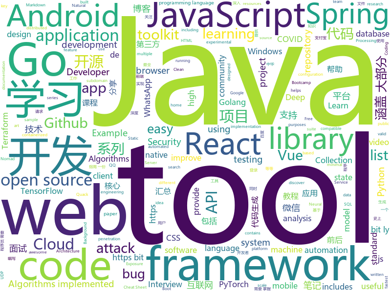

# 2020-05-19
See what the GitHub community is most excited about.

## python
+ [Background-Matting](https://github.com/senguptaumd/Background-Matting)(**281 stars today**): Background Matting: The World is Your Green Screen
+ [nlp](https://github.com/huggingface/nlp)(**148 stars today**): Datasets and evaluation metrics for Natural Language Processing in NumPy, Pandas, PyTorch and TensorFlow
+ [Statistical-Learning-Method_Code](https://github.com/Dod-o/Statistical-Learning-Method_Code)(**139 stars today**): 手写实现李航《统计学习方法》书中全部算法
+ [transformers](https://github.com/huggingface/transformers)(**235 stars today**): 🤗Transformers: State-of-the-art Natural Language Processing for Pytorch and TensorFlow 2.0.
+ [Python](https://github.com/TheAlgorithms/Python)(**420 stars today**): All Algorithms implemented in Python
+ [public-apis](https://github.com/public-apis/public-apis)(**361 stars today**): A collective list of free APIs for use in software and web development.
+ [HelloGitHub](https://github.com/521xueweihan/HelloGitHub)(**124 stars today**): Find pearls on open-source seashore 分享 GitHub 上有趣、入门级的开源项目
+ [gym](https://github.com/openai/gym)(**22 stars today**): A toolkit for developing and comparing reinforcement learning algorithms.
+ [h4cker](https://github.com/The-Art-of-Hacking/h4cker)(**24 stars today**): This repository is primarily maintained by Omar Santos and includes thousands of resources related to ethical hacking / penetration testing, digital forensics and incident response (DFIR), vulnerability research, exploit development, reverse engineering, and more.
+ [core](https://github.com/home-assistant/core)(**60 stars today**): 🏡Open source home automation that puts local control and privacy first
+ [scrapy](https://github.com/scrapy/scrapy)(**19 stars today**): Scrapy, a fast high-level web crawling & scraping framework for Python.
+ [content](https://github.com/demisto/content)(**0 stars today**): Demisto's ever-growing Content Repository
+ [nni](https://github.com/microsoft/nni)(**25 stars today**): An open source AutoML toolkit for automate machine learning lifecycle, including feature engineering, neural architecture search, model compression and hyper-parameter tuning.
+ [Mobile-Security-Framework-MobSF](https://github.com/MobSF/Mobile-Security-Framework-MobSF)(**9 stars today**): Mobile Security Framework (MobSF) is an automated, all-in-one mobile application (Android/iOS/Windows) pen-testing, malware analysis and security assessment framework capable of performing static and dynamic analysis.
+ [quack](https://github.com/entynetproject/quack)(**5 stars today**): Quack Toolkit is a set of tools to provide denial of service attacks. Quack Toolkit includes SMS attack tool, HTTP attack tool and many other attack tools.
+ [fastapi](https://github.com/tiangolo/fastapi)(**64 stars today**): FastAPI framework, high performance, easy to learn, fast to code, ready for production
+ [system-design-primer](https://github.com/donnemartin/system-design-primer)(**172 stars today**): Learn how to design large-scale systems. Prep for the system design interview. Includes Anki flashcards.
+ [VIBE](https://github.com/mkocabas/VIBE)(**11 stars today**): Official implementation of CVPR2020 paper "VIBE: Video Inference for Human Body Pose and Shape Estimation"
+ [SlowFast](https://github.com/facebookresearch/SlowFast)(**9 stars today**): PySlowFast: video understanding codebase from FAIR for reproducing state-of-the-art video models.
+ [keras](https://github.com/keras-team/keras)(**21 stars today**): Deep Learning for humans
+ [ResNeSt](https://github.com/zhanghang1989/ResNeSt)(**22 stars today**): ResNeSt: Split-Attention Network
+ [PayloadsAllTheThings](https://github.com/swisskyrepo/PayloadsAllTheThings)(**38 stars today**): A list of useful payloads and bypass for Web Application Security and Pentest/CTF
+ [imgaug](https://github.com/aleju/imgaug)(**27 stars today**): Image augmentation for machine learning experiments.
+ [allennlp](https://github.com/allenai/allennlp)(**4 stars today**): An open-source NLP research library, built on PyTorch.
+ [chineseocr](https://github.com/chineseocr/chineseocr)(**10 stars today**): yolo3+ocr

## java
+ [Java](https://github.com/TheAlgorithms/Java)(**144 stars today**): All Algorithms implemented in Java
+ [InternetArchitect](https://github.com/bjmashibing/InternetArchitect)(**15 stars today**): 年薪百万互联网架构师课程文档及源码(公开部分)
+ [JavaGuide](https://github.com/Snailclimb/JavaGuide)(**137 stars today**): 【Java学习+面试指南】 一份涵盖大部分Java程序员所需要掌握的核心知识。
+ [dbeaver](https://github.com/dbeaver/dbeaver)(**31 stars today**): Free universal database tool and SQL client
+ [hbase](https://github.com/apache/hbase)(**8 stars today**): Apache HBase
+ [White-Jotter](https://github.com/Antabot/White-Jotter)(**8 stars today**): 白卷是一款使用 Vue+Spring Boot 开发的前后端分离项目（类 CMS ），附带全套开发教程。
+ [JustAuth](https://github.com/justauth/JustAuth)(**41 stars today**): 💯史上最全的整合第三方登录的开源库。目前已支持Github、Gitee、微博、钉钉、百度、Coding、腾讯云开发者平台、OSChina、支付宝、QQ、微信、淘宝、Google、Facebook、抖音、领英、小米、微软、今日头条、Teambition、StackOverflow、Pinterest、人人、华为、企业微信、酷家乐、Gitlab、美团、饿了么和推特等第三方平台的授权登录。 Login, so easy!
+ [selenium](https://github.com/SeleniumHQ/selenium)(**12 stars today**): A browser automation framework and ecosystem.
+ [litemall](https://github.com/linlinjava/litemall)(**16 stars today**): 又一个小商城。litemall = Spring Boot后端 + Vue管理员前端 + 微信小程序用户前端 + Vue用户移动端
+ [testing-samples](https://github.com/android/testing-samples)(**7 stars today**): A collection of samples demonstrating different frameworks and techniques for automated testing
+ [spring-authorization-server](https://github.com/spring-projects-experimental/spring-authorization-server)(**7 stars today**): A community-driven project led by the Spring Security team and is focused on delivering Authorization Server support to the Spring community
+ [LeetCode](https://github.com/yuanguangxin/LeetCode)(**17 stars today**): LeetCode刷题记录
+ [android-interview-questions](https://github.com/MindorksOpenSource/android-interview-questions)(**51 stars today**): Your Cheat Sheet For Android Interview - Android Interview Questions
+ [lucene-solr](https://github.com/apache/lucene-solr)(**7 stars today**): Apache Lucene and Solr open-source search software
+ [jeecg-boot](https://github.com/zhangdaiscott/jeecg-boot)(**136 stars today**): 基于代码生成器的低代码开发平台，开源界“小普元”超越传统商业开发平台！前后端分离架构：SpringBoot 2.x，Ant Design&Vue，Mybatis-plus，Shiro，JWT。强大的代码生成器让前后端代码一键生成，无需写任何代码! 引领新开发模式(OnlineCoding-> 代码生成-> 手工MERGE)，帮助Java项目解决70%重复工作，让开发更关注业务逻辑，既能快速提高开发效率，帮助公司节省成本，同时又不失灵活性。
+ [micronaut-core](https://github.com/micronaut-projects/micronaut-core)(**0 stars today**): Micronaut Application Framework
+ [JUC](https://github.com/bjmashibing/JUC)(**9 stars today**): 多线程与高并发
+ [termux-app](https://github.com/termux/termux-app)(**23 stars today**): Android terminal and Linux environment - app repository.
+ [okhttp-RxHttp](https://github.com/liujingxing/okhttp-RxHttp)(**19 stars today**): 🔥🔥🔥30秒上手，比Retrofit更好用的协程、RxJava2、RxJava3，史上最优雅的实现文件上传/下载/进度监听、动态/多域名、缓存；支持第三方数据解析工具、自定义请求、自动关闭请求等等
+ [DataX](https://github.com/alibaba/DataX)(**22 stars today**): 
+ [CS-Notes](https://github.com/CyC2018/CS-Notes)(**108 stars today**): 📚技术面试必备基础知识、Leetcode、计算机操作系统、计算机网络、系统设计、Java、Python、C++
+ [springcloud-learning](https://github.com/macrozheng/springcloud-learning)(**7 stars today**): 一套涵盖大部分核心组件使用的Spring Cloud教程，包括Spring Cloud Alibaba及分布式事务Seata，基于Spring Cloud Greenwich及SpringBoot 2.1.7。20篇文章，篇篇精华，30个Demo，涵盖大部分应用场景。
+ [retrofit](https://github.com/square/retrofit)(**16 stars today**): A type-safe HTTP client for Android and the JVM
+ [flink](https://github.com/apache/flink)(**17 stars today**): Apache Flink
+ [java8-tutorial](https://github.com/winterbe/java8-tutorial)(**8 stars today**): Modern Java - A Guide to Java 8

## unknown
+ [google-cloud-4-words](https://github.com/gregsramblings/google-cloud-4-words)(**26 stars today**): The Google Cloud Developer's Cheat Sheet
+ [free-books](https://github.com/ruanyf/free-books)(**20 stars today**): 互联网上的免费书籍
+ [CodeGuide](https://github.com/fuzhengwei/CodeGuide)(**58 stars today**): 📚本代码库是作者小傅哥多年从事一线互联网 Java 开发的学习历程技术汇总，旨在为大家提供一个清晰详细的学习教程，侧重点更倾向编写Java核心内容。如果本仓库能为您提供帮助，请给予支持(关注、点赞、分享)！
+ [app-ideas](https://github.com/florinpop17/app-ideas)(**297 stars today**): A Collection of application ideas which can be used to improve your coding skills.
+ [Specs](https://github.com/CocoaPods/Specs)(**6 stars today**): The CocoaPods Master Repo
+ [you-dont-know-js-ru](https://github.com/azat-io/you-dont-know-js-ru)(**5 stars today**): 📚Russian translation of "You Don't Know JS" book series
+ [JavaFamily](https://github.com/AobingJava/JavaFamily)(**89 stars today**): 【Java学习+Java面试指南】 一份涵盖大部分Java程序员所需要掌握的核心知识。
+ [ml-visuals](https://github.com/dair-ai/ml-visuals)(**157 stars today**): Visuals contains figures and templates which you can reuse and customize to improve your scientific writing.
+ [Licensing](https://github.com/AaronDinnage/Licensing)(**24 stars today**): Microsoft 365 licensing diagrams
+ [cwa-documentation](https://github.com/corona-warn-app/cwa-documentation)(**210 stars today**): Project overview, general documentation, and white papers.
+ [GitHubDaily](https://github.com/GitHubDaily/GitHubDaily)(**33 stars today**): GitHubDaily 分享内容定期整理与分类。欢迎推荐、自荐项目，让更多人知道你的项目。
+ [coronavirus-data](https://github.com/nychealth/coronavirus-data)(**8 stars today**): 
+ [ConfigureDefender](https://github.com/AndyFul/ConfigureDefender)(**16 stars today**): Utility for configuring Windows 10 built-in Defender antivirus settings.
+ [acwa_book_ru](https://github.com/adelf/acwa_book_ru)(**14 stars today**): Книга "Архитектура сложных веб-приложений. С примерами на Laravel"
+ [awesome-java](https://github.com/Snailclimb/awesome-java)(**34 stars today**): Collection of awesome Java project on Github(Github 上非常棒的 Java 开源项目集合).
+ [keyhacks](https://github.com/streaak/keyhacks)(**15 stars today**): Keyhacks is a repository which shows quick ways in which API keys leaked by a bug bounty program can be checked to see if they're valid.
+ [COVID-19](https://github.com/pcm-dpc/COVID-19)(**5 stars today**): COVID-19 Italia - Monitoraggio situazione
+ [awesome-blazor](https://github.com/AdrienTorris/awesome-blazor)(**5 stars today**): Resources for Blazor, a .NET web framework using C#/Razor and HTML that runs in the browser with WebAssembly.
+ [bootcamp-gostack-desafios](https://github.com/Rocketseat/bootcamp-gostack-desafios)(**6 stars today**): Repositório contendo todos os desafios dos módulos do Bootcamp Gostack
+ [Algorithms-Explanation](https://github.com/TheAlgorithms/Algorithms-Explanation)(**11 stars today**): All Algorithms explained in simple English Language with example and links to their implementation in various programming languages and other required resources.
+ [awesome-test-automation](https://github.com/atinfo/awesome-test-automation)(**4 stars today**): A curated list of awesome test automation frameworks, tools, libraries, and software for different programming languages. Sponsored by http://sdclabs.com
+ [YCBlogs](https://github.com/yangchong211/YCBlogs)(**10 stars today**): 技术博客笔记大汇总【15年10月到至今】，包括Java基础及深入知识点，Android技术博客，Python，Go学习笔记等等，还包括平时开发中遇到的bug汇总，当然也在工作之余收集了大量的面试题，长期更新维护并且修正，持续完善……开源的文件是markdown格式的！同时也开源了生活博客，从12年起，积累共计N篇[近100万字]，转载请注明出处，谢谢！
+ [Blog](https://github.com/mqyqingfeng/Blog)(**20 stars today**): 冴羽写博客的地方，预计写四个系列：JavaScript深入系列、JavaScript专题系列、ES6系列、React系列。
+ [deep_learning_object_detection](https://github.com/hoya012/deep_learning_object_detection)(**10 stars today**): A paper list of object detection using deep learning.
+ [Flutter-Course-Resources](https://github.com/londonappbrewery/Flutter-Course-Resources)(**28 stars today**): Learn to Code While Building Apps - The Complete Flutter Development Bootcamp

## javascript
+ [Recoil](https://github.com/facebookexperimental/Recoil)(**713 stars today**): Recoil is an experimental state management library for React apps. It provides several capabilities that are difficult to achieve with React alone, while being compatible with the newest features of React.
+ [fullstack-course4](https://github.com/jhu-ep-coursera/fullstack-course4)(**25 stars today**): Example code for HTML, CSS, and Javascript for Web Developers Coursera Course
+ [Javascript](https://github.com/TheAlgorithms/Javascript)(**81 stars today**): A repository for All algorithms implemented in Javascript (for educational purposes only)
+ [covid19-forecast-hub](https://github.com/reichlab/covid19-forecast-hub)(**8 stars today**): Projections of COVID-19, in standardized format
+ [learnxinyminutes-docs](https://github.com/adambard/learnxinyminutes-docs)(**56 stars today**): Code documentation written as code! How novel and totally my idea!
+ [UnblockNeteaseMusic](https://github.com/nondanee/UnblockNeteaseMusic)(**37 stars today**): Revive unavailable songs for Netease Cloud Music
+ [responsively-app](https://github.com/manojVivek/responsively-app)(**104 stars today**): A modified browser that helps in responsive web development.
+ [chinese-poetry](https://github.com/chinese-poetry/chinese-poetry)(**40 stars today**): The most comprehensive database of Chinese poetry🧶最全中华古诗词数据库, 唐宋两朝近一万四千古诗人, 接近5.5万首唐诗加26万宋诗. 两宋时期1564位词人，21050首词。
+ [taro](https://github.com/NervJS/taro)(**35 stars today**): 多端统一开发框架，支持用 React 的开发方式编写一次代码，生成能运行在微信/京东/百度/支付宝/字节跳动/ QQ 小程序/快应用/H5/React Native 等的应用。 https://taro.jd.com/
+ [RSSHub](https://github.com/DIYgod/RSSHub)(**22 stars today**): 🍰Everything is RSSible
+ [Real-Time-Person-Removal](https://github.com/jasonmayes/Real-Time-Person-Removal)(**31 stars today**): Removing people from complex backgrounds in real time using TensorFlow.js in the web browser
+ [whatsapp-web.js](https://github.com/pedroslopez/whatsapp-web.js)(**20 stars today**): A WhatsApp client library for javascript that connects through the WhatsApp Web browser app
+ [G-Desktop-Suite](https://github.com/alexkim205/G-Desktop-Suite)(**124 stars today**): Google Suite as a desktop app. Made possible with Electron.
+ [freeCodeCamp](https://github.com/freeCodeCamp/freeCodeCamp)(**85 stars today**): freeCodeCamp.org's open source codebase and curriculum. Learn to code at home.
+ [nuxt.js](https://github.com/nuxt/nuxt.js)(**35 stars today**): The Intuitive Vue Framework
+ [node](https://github.com/nodejs/node)(**64 stars today**): Node.js JavaScript runtime✨🐢🚀✨
+ [sheetjs](https://github.com/SheetJS/sheetjs)(**31 stars today**): 📗SheetJS Community Edition -- Spreadsheet Data Toolkit
+ [selectize.js](https://github.com/selectize/selectize.js)(**6 stars today**): Selectize is the hybrid of a textbox and <select> box. It's jQuery based and it has autocomplete and native-feeling keyboard navigation; useful for tagging, contact lists, etc.
+ [vue-admin-template](https://github.com/PanJiaChen/vue-admin-template)(**20 stars today**): a vue2.0 minimal admin template
+ [objection.js](https://github.com/Vincit/objection.js)(**10 stars today**): An SQL-friendly ORM for Node.js
+ [ac-nh-turnip-prices](https://github.com/mikebryant/ac-nh-turnip-prices)(**25 stars today**): Price calculator/predictor for Turnip prices
+ [nx](https://github.com/nrwl/nx)(**9 stars today**): Extensible Dev Tools for Monorepos
+ [cloud-cap-samples](https://github.com/SAP-samples/cloud-cap-samples)(**3 stars today**): This project contains sample applications for SAP Cloud Application Programming Model.
+ [sulla](https://github.com/danielcardeenas/sulla)(**6 stars today**): 👩🏻‍🔬 Javascript Whatsapp api library for chatbots
+ [loadable-components](https://github.com/gregberge/loadable-components)(**17 stars today**): The recommended Code Splitting library for React✂️✨

## html
+ [Coursera-ML-AndrewNg-Notes](https://github.com/fengdu78/Coursera-ML-AndrewNg-Notes)(**122 stars today**): 吴恩达老师的机器学习课程个人笔记
+ [java](https://github.com/bjmashibing/java)(**3 stars today**): 
+ [lockphish](https://github.com/thelinuxchoice/lockphish)(**13 stars today**): Lockphish is a tool for phishing attacks on the lock screen, designed to grab Windows credentials, Android PIN and iPhone Passcode
+ [gopl-zh](https://github.com/golang-china/gopl-zh)(**5 stars today**): 📚Go语言圣经中文版
+ [DIY_particle_detector](https://github.com/ozel/DIY_particle_detector)(**35 stars today**): A mobile low-cost spectrometer for measuring radioactivity and the energy of ionising radiation like alpha particles and electrons
+ [stickyfill](https://github.com/wilddeer/stickyfill)(**4 stars today**): Polyfill for CSS `position: sticky`
+ [nndl.github.io](https://github.com/nndl/nndl.github.io)(**14 stars today**): 《神经网络与深度学习》 邱锡鹏著 Neural Network and Deep Learning
+ [deeplearning_ai_books](https://github.com/fengdu78/deeplearning_ai_books)(**48 stars today**): deeplearning.ai（吴恩达老师的深度学习课程笔记及资源）
+ [Ronin](https://github.com/hundredrabbits/Ronin)(**30 stars today**): Experimental Graphics Terminal
+ [forecasting](https://github.com/microsoft/forecasting)(**8 stars today**): Time Series Forecasting Best Practices & Examples
+ [Java-Interview-Advanced](https://github.com/shishan100/Java-Interview-Advanced)(**10 stars today**): 中华石杉--互联网Java进阶面试训练营
+ [keycloak-documentation](https://github.com/keycloak/keycloak-documentation)(**0 stars today**): 
+ [phpstan](https://github.com/phpstan/phpstan)(**6 stars today**): PHP Static Analysis Tool - discover bugs in your code without running it!
+ [nbnhhsh](https://github.com/itorr/nbnhhsh)(**24 stars today**): 😩「能不能好好说话？」 拼音首字母缩写翻译工具
+ [chatcord](https://github.com/bradtraversy/chatcord)(**3 stars today**): Realtime chat app with rooms
+ [wpt](https://github.com/web-platform-tests/wpt)(**1 stars today**): Test suites for Web platform specs — including WHATWG, W3C, and others
+ [github-markdown-css](https://github.com/sindresorhus/github-markdown-css)(**12 stars today**): The minimal amount of CSS to replicate the GitHub Markdown style
+ [ru.javascript.info](https://github.com/javascript-tutorial/ru.javascript.info)(**4 stars today**): Современный учебник JavaScript
+ [devdocs](https://github.com/magento/devdocs)(**0 stars today**): Magento Developer Documentation
+ [tiny-slider](https://github.com/ganlanyuan/tiny-slider)(**10 stars today**): Vanilla javascript slider for all purposes.
+ [webdevbootcamp](https://github.com/nax3t/webdevbootcamp)(**3 stars today**): All source code for back-end projects from the Web Developer Bootcamp
+ [CLRS](https://github.com/walkccc/CLRS)(**7 stars today**): 📚Solutions to Introduction to Algorithms Third Edition
+ [openmodelingfoundation.github.io](https://github.com/openmodelingfoundation/openmodelingfoundation.github.io)(**3 stars today**): Website for standards and governance of the Open Modeling Foundation
+ [beta.gouv.fr](https://github.com/betagouv/beta.gouv.fr)(**0 stars today**): Le site public de l'Incubateur de Services Numériques de l'État
+ [pybluez](https://github.com/pybluez/pybluez)(**3 stars today**): Bluetooth Python extension module

## go
+ [learngo](https://github.com/inancgumus/learngo)(**782 stars today**): 1000+ Hand-Crafted Go Examples, Exercises, and Quizzes
+ [immudb](https://github.com/codenotary/immudb)(**76 stars today**): immudb is lightweight, high-speed immutable database for systems and applications
+ [jsonparser](https://github.com/buger/jsonparser)(**57 stars today**): Alternative JSON parser for Go that does not require schema (so far fastest)
+ [nomad](https://github.com/hashicorp/nomad)(**5 stars today**): Nomad is an easy-to-use, flexible, and performant workload orchestrator that can deploy a mix of microservice, batch, containerized, and non-containerized applications. Nomad is easy to operate and scale and has native Consul and Vault integrations.
+ [go-plugin](https://github.com/hashicorp/go-plugin)(**6 stars today**): Golang plugin system over RPC.
+ [etcd](https://github.com/etcd-io/etcd)(**13 stars today**): Distributed reliable key-value store for the most critical data of a distributed system
+ [ikago](https://github.com/zhxie/ikago)(**51 stars today**): IkaGo is a proxy which helps bypassing UDP blocking, UDP QoS and NAT firewall written in Go.
+ [build-web-application-with-golang](https://github.com/astaxie/build-web-application-with-golang)(**18 stars today**): A golang ebook intro how to build a web with golang
+ [loki](https://github.com/grafana/loki)(**14 stars today**): Like Prometheus, but for logs.
+ [k6](https://github.com/loadimpact/k6)(**10 stars today**): A modern load testing tool, using Go and JavaScript - https://k6.io
+ [elastic](https://github.com/olivere/elastic)(**5 stars today**): Elasticsearch client for Go.
+ [terragrunt](https://github.com/gruntwork-io/terragrunt)(**7 stars today**): Terragrunt is a thin wrapper for Terraform that provides extra tools for working with multiple Terraform modules.
+ [logrus](https://github.com/sirupsen/logrus)(**16 stars today**): Structured, pluggable logging for Go.
+ [Go](https://github.com/TheAlgorithms/Go)(**42 stars today**): Algorithms Implemented in GoLang
+ [testify](https://github.com/stretchr/testify)(**19 stars today**): A toolkit with common assertions and mocks that plays nicely with the standard library
+ [subfinder](https://github.com/projectdiscovery/subfinder)(**5 stars today**): Subfinder is a subdomain discovery tool that discovers valid subdomains for websites. Designed as a passive framework to be useful for bug bounties and safe for penetration testing.
+ [aws-sdk-go](https://github.com/aws/aws-sdk-go)(**6 stars today**): AWS SDK for the Go programming language.
+ [terraform](https://github.com/hashicorp/terraform)(**18 stars today**): Terraform enables you to safely and predictably create, change, and improve infrastructure. It is an open source tool that codifies APIs into declarative configuration files that can be shared amongst team members, treated as code, edited, reviewed, and versioned.
+ [exposure-notifications-server](https://github.com/google/exposure-notifications-server)(**111 stars today**): Exposure Notification Reference Server | Covid-19 Exposure Notifications
+ [helmfile](https://github.com/roboll/helmfile)(**11 stars today**): Deploy Kubernetes Helm Charts
+ [client_golang](https://github.com/prometheus/client_golang)(**5 stars today**): Prometheus instrumentation library for Go applications
+ [go-clean-arch](https://github.com/bxcodec/go-clean-arch)(**5 stars today**): Go (Golang) Clean Architecture based on Reading Uncle Bob's Clean Architecture
+ [packer](https://github.com/hashicorp/packer)(**4 stars today**): Packer is a tool for creating identical machine images for multiple platforms from a single source configuration.
+ [iris](https://github.com/kataras/iris)(**10 stars today**): 感谢中国开发者 - https://bit.ly/謝謝 | The fastest community-driven web framework for Go. gRPC, Automatic HTTPS with Public Domain, MVC, Sessions, Caching, Versioning API, Problem API, Websocket, Dependency Injection and more. Fully compatible with the standard library and 3rd-party middleware packages. | https://bit.ly/iriscandothat1 | https://bit.ly/ir…
+ [runc](https://github.com/opencontainers/runc)(**7 stars today**): CLI tool for spawning and running containers according to the OCI specification

## WordCloud

