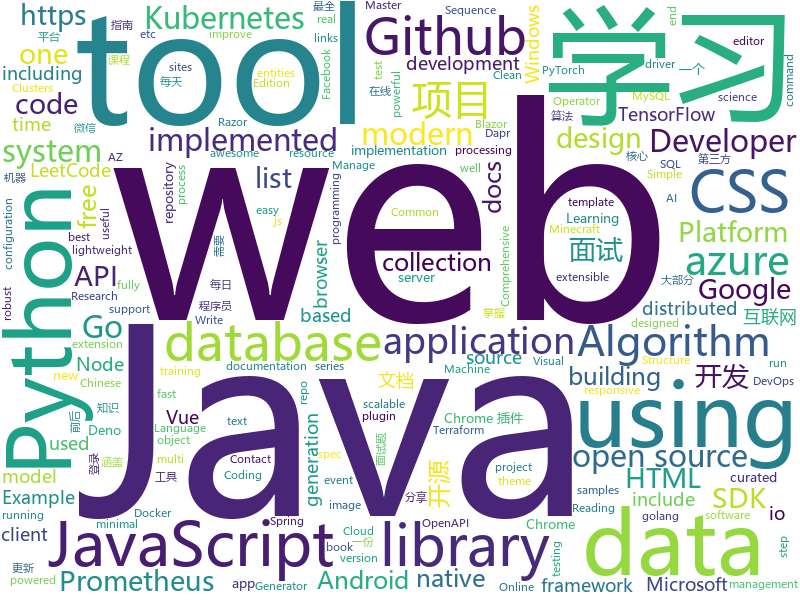

# 2020-05-20
See what the GitHub community is most excited about.

## python
+ [spleeter](https://github.com/deezer/spleeter)(**221 stars today**): Deezer source separation library including pretrained models.
+ [HelloGitHub](https://github.com/521xueweihan/HelloGitHub)(**168 stars today**): Find pearls on open-source seashore 分享 GitHub 上有趣、入门级的开源项目
+ [Python](https://github.com/TheAlgorithms/Python)(**578 stars today**): All Algorithms implemented in Python
+ [Background-Matting](https://github.com/senguptaumd/Background-Matting)(**329 stars today**): Background Matting: The World is Your Green Screen
+ [aitextgen](https://github.com/minimaxir/aitextgen)(**99 stars today**): A robust Python tool for text-based AI training and generation using GPT-2.
+ [public-apis](https://github.com/public-apis/public-apis)(**292 stars today**): A collective list of free APIs for use in software and web development.
+ [transformers](https://github.com/huggingface/transformers)(**159 stars today**): 🤗Transformers: State-of-the-art Natural Language Processing for Pytorch and TensorFlow 2.0.
+ [FairMOT](https://github.com/ifzhang/FairMOT)(**40 stars today**): A simple baseline for one-shot multi-object tracking
+ [cascadia-code](https://github.com/microsoft/cascadia-code)(**62 stars today**): This is a fun, new monospaced font that includes programming ligatures and is designed to enhance the modern look and feel of the Windows Terminal.
+ [labelImg](https://github.com/tzutalin/labelImg)(**25 stars today**): 🖍️LabelImg is a graphical image annotation tool and label object bounding boxes in images
+ [keras](https://github.com/keras-team/keras)(**20 stars today**): Deep Learning for humans
+ [system-design-primer](https://github.com/donnemartin/system-design-primer)(**204 stars today**): Learn how to design large-scale systems. Prep for the system design interview. Includes Anki flashcards.
+ [bert](https://github.com/google-research/bert)(**25 stars today**): TensorFlow code and pre-trained models for BERT
+ [Statistical-Learning-Method_Code](https://github.com/Dod-o/Statistical-Learning-Method_Code)(**401 stars today**): 手写实现李航《统计学习方法》书中全部算法
+ [allennlp](https://github.com/allenai/allennlp)(**7 stars today**): An open-source NLP research library, built on PyTorch.
+ [pydantic](https://github.com/samuelcolvin/pydantic)(**14 stars today**): Data parsing and validation using Python type hints
+ [PyTorch-GAN](https://github.com/eriklindernoren/PyTorch-GAN)(**16 stars today**): PyTorch implementations of Generative Adversarial Networks.
+ [azure-sdk-for-python](https://github.com/Azure/azure-sdk-for-python)(**7 stars today**): This repository is for active development of the Azure SDK for Python. For consumers of the SDK we recommend visiting our public developer docs at https://docs.microsoft.com/en-us/python/azure/ or our versioned developer docs at https://azure.github.io/azure-sdk-for-python.
+ [synapse](https://github.com/matrix-org/synapse)(**13 stars today**): Synapse: Matrix reference homeserver
+ [DeepSpeed](https://github.com/microsoft/DeepSpeed)(**14 stars today**): DeepSpeed is a deep learning optimization library that makes distributed training easy, efficient, and effective.
+ [DataCamp](https://github.com/wblakecannon/DataCamp)(**10 stars today**): DataCamp data-science courses
+ [TheAlgorithms-Python](https://github.com/subbarayudu-j/TheAlgorithms-Python)(**28 stars today**): TheAlgorithms/Python
+ [python-small-examples](https://github.com/jackzhenguo/python-small-examples)(**11 stars today**): 告别枯燥，60 秒学会一个 Python 小例子
+ [fairseq](https://github.com/pytorch/fairseq)(**20 stars today**): Facebook AI Research Sequence-to-Sequence Toolkit written in Python.
+ [kornia](https://github.com/kornia/kornia)(**14 stars today**): Open Source Differentiable Computer Vision Library for PyTorch

## java
+ [cwa-server](https://github.com/corona-warn-app/cwa-server)(**226 stars today**): Backend implementation for the Apple/Google exposure notification API.
+ [Java](https://github.com/TheAlgorithms/Java)(**350 stars today**): All Algorithms implemented in Java
+ [InternetArchitect](https://github.com/bjmashibing/InternetArchitect)(**86 stars today**): 年薪百万互联网架构师课程文档及源码(公开部分)
+ [JustAuth](https://github.com/justauth/JustAuth)(**45 stars today**): 💯史上最全的整合第三方登录的开源库。目前已支持Github、Gitee、微博、钉钉、百度、Coding、腾讯云开发者平台、OSChina、支付宝、QQ、微信、淘宝、Google、Facebook、抖音、领英、小米、微软、今日头条、Teambition、StackOverflow、Pinterest、人人、华为、企业微信、酷家乐、Gitlab、美团、饿了么和推特等第三方平台的授权登录。 Login, so easy!
+ [White-Jotter](https://github.com/Antabot/White-Jotter)(**11 stars today**): 白卷是一款使用 Vue+Spring Boot 开发的前后端分离项目（类 CMS ），附带全套开发教程。
+ [PictureSelector](https://github.com/LuckSiege/PictureSelector)(**15 stars today**): Picture Selector Library for Android or 图片选择器
+ [testcontainers-java](https://github.com/testcontainers/testcontainers-java)(**8 stars today**): Testcontainers is a Java library that supports JUnit tests, providing lightweight, throwaway instances of common databases, Selenium web browsers, or anything else that can run in a Docker container.
+ [vhr](https://github.com/lenve/vhr)(**34 stars today**): 微人事是一个前后端分离的人力资源管理系统，项目采用SpringBoot+Vue开发。
+ [quickstart-android](https://github.com/firebase/quickstart-android)(**10 stars today**): Firebase Quickstart Samples for Android
+ [bigbluebutton](https://github.com/bigbluebutton/bigbluebutton)(**60 stars today**): Complete open source web conferencing system.
+ [karate](https://github.com/intuit/karate)(**14 stars today**): Test Automation Made Simple
+ [MusicPlayer](https://github.com/Mpmart08/MusicPlayer)(**11 stars today**): Desktop Music Player for Windows and Mac using JavaFX/Java 8
+ [antlr4](https://github.com/antlr/antlr4)(**10 stars today**): ANTLR (ANother Tool for Language Recognition) is a powerful parser generator for reading, processing, executing, or translating structured text or binary files.
+ [LeetCode](https://github.com/yuanguangxin/LeetCode)(**14 stars today**): LeetCode刷题记录
+ [JUC](https://github.com/bjmashibing/JUC)(**10 stars today**): 多线程与高并发
+ [dbeaver](https://github.com/dbeaver/dbeaver)(**32 stars today**): Free universal database tool and SQL client
+ [Geyser](https://github.com/GeyserMC/Geyser)(**13 stars today**): A bridge/proxy allowing you to connect to Minecraft: Java Edition servers with Minecraft: Bedrock edition.
+ [keycloak](https://github.com/keycloak/keycloak)(**16 stars today**): Open Source Identity and Access Management For Modern Applications and Services
+ [jmx_exporter](https://github.com/prometheus/jmx_exporter)(**6 stars today**): A process for exposing JMX Beans via HTTP for Prometheus consumption
+ [JavaGuide](https://github.com/Snailclimb/JavaGuide)(**135 stars today**): 【Java学习+面试指南】 一份涵盖大部分Java程序员所需要掌握的核心知识。
+ [spring-boot](https://github.com/spring-projects/spring-boot)(**52 stars today**): Spring Boot
+ [pentaho-kettle](https://github.com/pentaho/pentaho-kettle)(**7 stars today**): Pentaho Data Integration ( ETL ) a.k.a Kettle
+ [openapi-generator](https://github.com/OpenAPITools/openapi-generator)(**16 stars today**): OpenAPI Generator allows generation of API client libraries (SDK generation), server stubs, documentation and configuration automatically given an OpenAPI Spec (v2, v3)
+ [geoserver](https://github.com/geoserver/geoserver)(**4 stars today**): Official GeoServer repository
+ [CDM](https://github.com/microsoft/CDM)(**6 stars today**): The Common Data Model (CDM) is a standard and extensible collection of schemas (entities, attributes, relationships) that represents business concepts and activities with well-defined semantics, to facilitate data interoperability. Examples of entities include: Account, Contact, Lead, Opportunity, Product, etc.

## unknown
+ [ddd-starter-modelling-process](https://github.com/ddd-crew/ddd-starter-modelling-process)(**235 stars today**): If you're new to DDD and not sure where to start, this process will guide you step-by-step
+ [pumpkin-book](https://github.com/datawhalechina/pumpkin-book)(**257 stars today**): 《机器学习》（西瓜书）公式推导解析，在线阅读地址：https://datawhalechina.github.io/pumpkin-book
+ [pragmatic-programmer-zh](https://github.com/caicaishmily/pragmatic-programmer-zh)(**84 stars today**): 《Pragmatic Programmer》中文翻译
+ [You-Dont-Know-JS](https://github.com/getify/You-Dont-Know-JS)(**71 stars today**): A book series on JavaScript. @YDKJS on twitter.
+ [app-ideas](https://github.com/florinpop17/app-ideas)(**198 stars today**): A Collection of application ideas which can be used to improve your coding skills.
+ [ml-visuals](https://github.com/dair-ai/ml-visuals)(**60 stars today**): Visuals contains figures and templates which you can reuse and customize to improve your scientific writing.
+ [GitHubDaily](https://github.com/GitHubDaily/GitHubDaily)(**46 stars today**): GitHubDaily 分享内容定期整理与分类。欢迎推荐、自荐项目，让更多人知道你的项目。
+ [the-art-of-command-line](https://github.com/jlevy/the-art-of-command-line)(**69 stars today**): Master the command line, in one page
+ [Fuck-XueXiQiangGuo](https://github.com/fuck-xuexiqiangguo/Fuck-XueXiQiangGuo)(**17 stars today**): 学习强国 懒人刷分工具 自动学习
+ [google-cloud-4-words](https://github.com/gregsramblings/google-cloud-4-words)(**53 stars today**): The Google Cloud Developer's Cheat Sheet
+ [awesome-blazor](https://github.com/AdrienTorris/awesome-blazor)(**28 stars today**): Resources for Blazor, a .NET web framework using C#/Razor and HTML that runs in the browser with WebAssembly.
+ [stanford-cs-229-machine-learning](https://github.com/afshinea/stanford-cs-229-machine-learning)(**28 stars today**): VIP cheatsheets for Stanford's CS 229 Machine Learning
+ [pdown](https://github.com/pdown2020/pdown)(**63 stars today**): 2020
+ [fucking-algorithm](https://github.com/labuladong/fucking-algorithm)(**181 stars today**): 手把手撕LeetCode题目，扒各种算法套路的裤子。English version supported! Crack LeetCode, not only how, but also why.
+ [JavaFamily](https://github.com/AobingJava/JavaFamily)(**96 stars today**): 【Java学习+Java面试指南】 一份涵盖大部分Java程序员所需要掌握的核心知识。
+ [build-your-own-x](https://github.com/danistefanovic/build-your-own-x)(**103 stars today**): 🤓Build your own (insert technology here)
+ [AZ-900T0x-MicrosoftAzureFundamentals](https://github.com/MicrosoftLearning/AZ-900T0x-MicrosoftAzureFundamentals)(**5 stars today**): Microsoft Azure Fundamentals - AZ-900T00 and AZ-900T01
+ [docs](https://github.com/dapr/docs)(**9 stars today**): User documentation for Dapr
+ [free-books](https://github.com/ruanyf/free-books)(**21 stars today**): 互联网上的免费书籍
+ [deno-tutorial](https://github.com/hylerrix/deno-tutorial)(**20 stars today**): 🦕长期更新的《Deno 钻研之术》！循序渐进学 Deno & 先易后难补 Node & 面向未来的 Deno Web 应用开发
+ [Data-science-best-resources](https://github.com/tirthajyoti/Data-science-best-resources)(**10 stars today**): Carefully curated resource links for data science in one place
+ [awesome-java](https://github.com/Snailclimb/awesome-java)(**21 stars today**): Collection of awesome Java project on Github(Github 上非常棒的 Java 开源项目集合).
+ [OpenAPI-Specification](https://github.com/OAI/OpenAPI-Specification)(**14 stars today**): The OpenAPI Specification Repository
+ [javascript-testing-best-practices](https://github.com/goldbergyoni/javascript-testing-best-practices)(**12 stars today**): 📗🌐🚢Comprehensive and exhaustive JavaScript & Node.js testing best practices (April 2020)
+ [gitignore](https://github.com/github/gitignore)(**90 stars today**): A collection of useful .gitignore templates

## javascript
+ [responsively-app](https://github.com/manojVivek/responsively-app)(**76 stars today**): A modified browser that helps in responsive web development.
+ [fullstack-course4](https://github.com/jhu-ep-coursera/fullstack-course4)(**35 stars today**): Example code for HTML, CSS, and Javascript for Web Developers Coursera Course
+ [chinese-poetry](https://github.com/chinese-poetry/chinese-poetry)(**44 stars today**): The most comprehensive database of Chinese poetry🧶最全中华古诗词数据库, 唐宋两朝近一万四千古诗人, 接近5.5万首唐诗加26万宋诗. 两宋时期1564位词人，21050首词。
+ [nectarjs](https://github.com/NectarJS/nectarjs)(**105 stars today**): 🔱Javascript's God Mode. No VM. No Bytecode. No GC. Just native binaries.
+ [html5-boilerplate](https://github.com/h5bp/html5-boilerplate)(**20 stars today**): A professional front-end template for building fast, robust, and adaptable web apps or sites.
+ [fe-interview](https://github.com/haizlin/fe-interview)(**46 stars today**): 前端面试每日 3+1，以面试题来驱动学习，提倡每日学习与思考，每天进步一点！每天早上5点纯手工发布面试题（死磕自己，愉悦大家）
+ [Javascript](https://github.com/TheAlgorithms/Javascript)(**80 stars today**): A repository for All algorithms implemented in Javascript (for educational purposes only)
+ [algorithm-visualizer](https://github.com/algorithm-visualizer/algorithm-visualizer)(**243 stars today**): 🎆Interactive Online Platform that Visualizes Algorithms from Code
+ [reveal.js](https://github.com/hakimel/reveal.js)(**23 stars today**): The HTML Presentation Framework
+ [create-react-app](https://github.com/facebook/create-react-app)(**39 stars today**): Set up a modern web app by running one command.
+ [Chart.js](https://github.com/chartjs/Chart.js)(**26 stars today**): Simple HTML5 Charts using the <canvas> tag
+ [showdoc](https://github.com/star7th/showdoc)(**31 stars today**): ShowDoc is a tool greatly applicable for an IT team to share documents online一个非常适合IT团队的在线API文档、技术文档工具
+ [lighthouse-ci](https://github.com/GoogleChrome/lighthouse-ci)(**11 stars today**): Automate running Lighthouse for every commit, viewing the changes, and preventing regressions
+ [javascript-algorithms](https://github.com/trekhleb/javascript-algorithms)(**90 stars today**): 📝Algorithms and data structures implemented in JavaScript with explanations and links to further readings
+ [Real-Time-Person-Removal](https://github.com/jasonmayes/Real-Time-Person-Removal)(**17 stars today**): Removing people from complex backgrounds in real time using TensorFlow.js in the web browser
+ [BackstopJS](https://github.com/garris/BackstopJS)(**12 stars today**): Catch CSS curve balls.
+ [nuxt.js](https://github.com/nuxt/nuxt.js)(**29 stars today**): The Intuitive Vue Framework
+ [selectize.js](https://github.com/selectize/selectize.js)(**6 stars today**): Selectize is the hybrid of a textbox and <select> box. It's jQuery based and it has autocomplete and native-feeling keyboard navigation; useful for tagging, contact lists, etc.
+ [deck.gl](https://github.com/visgl/deck.gl)(**6 stars today**): WebGL2 powered geospatial visualization layers
+ [realworld](https://github.com/gothinkster/realworld)(**69 stars today**): "The mother of all demo apps" — Exemplary fullstack Medium.com clone powered by React, Angular, Node, Django, and many more🏅
+ [nx](https://github.com/nrwl/nx)(**17 stars today**): Extensible Dev Tools for Monorepos
+ [mobile](https://github.com/kodilan-com/mobile)(**13 stars today**): React Native - iOS / Android codebase of Kodilan.com
+ [ChromeAppHeroes](https://github.com/zhaoolee/ChromeAppHeroes)(**46 stars today**): 🌈谷粒-Chrome插件英雄榜, 为优秀的Chrome插件写一本中文说明书, 让Chrome插件英雄们造福人类~ ChromePluginHeroes, Write a Chinese manual for the excellent Chrome plugin, let the Chrome plugin heroes benefit the human~ 公众号「0加1」同步更新
+ [vscode-terraform](https://github.com/hashicorp/vscode-terraform)(**15 stars today**): A Visual Studio Code extension for Hashicorp Terraform
+ [semantic-release](https://github.com/semantic-release/semantic-release)(**18 stars today**): 📦🚀Fully automated version management and package publishing

## html
+ [new.css](https://github.com/xz/new.css)(**418 stars today**): A classless CSS framework to write modern websites using only HTML.
+ [dropin-minimal-css](https://github.com/dohliam/dropin-minimal-css)(**87 stars today**): Drop-in switcher for previewing minimal CSS frameworks
+ [free-for-dev](https://github.com/ripienaar/free-for-dev)(**49 stars today**): A list of SaaS, PaaS and IaaS offerings that have free tiers of interest to devops and infradev
+ [webdevbootcamp](https://github.com/nax3t/webdevbootcamp)(**9 stars today**): All source code for back-end projects from the Web Developer Bootcamp
+ [awesome-competitive-programming](https://github.com/lnishan/awesome-competitive-programming)(**10 stars today**): 💎A curated list of awesome Competitive Programming, Algorithm and Data Structure resources
+ [Coursera-ML-AndrewNg-Notes](https://github.com/fengdu78/Coursera-ML-AndrewNg-Notes)(**80 stars today**): 吴恩达老师的机器学习课程个人笔记
+ [Graphics](https://github.com/Unity-Technologies/Graphics)(**6 stars today**): Unity Graphics - Including Scriptable Render Pipeline
+ [mslearn-tailspin-spacegame-web](https://github.com/MicrosoftDocs/mslearn-tailspin-spacegame-web)(**2 stars today**): Code used in Microsoft Learn modules to support Azure DevOps
+ [love](https://github.com/arunboy/love)(**6 stars today**): 表白网站
+ [sakura](https://github.com/oxalorg/sakura)(**45 stars today**): 🌸a minimal css framework/theme.
+ [delivery-carrier](https://github.com/OCA/delivery-carrier)(**0 stars today**): Odoo Carriers And Deliveries Management
+ [weird-wide-webring](https://github.com/jackmcdade/weird-wide-webring)(**16 stars today**): The web needs a little more weird. These sites are helping. Apply to join!
+ [stickyfill](https://github.com/wilddeer/stickyfill)(**2 stars today**): Polyfill for CSS `position: sticky`
+ [hugo-coder](https://github.com/luizdepra/hugo-coder)(**4 stars today**): A minimalist blog theme for hugo.
+ [lockphish](https://github.com/thelinuxchoice/lockphish)(**11 stars today**): Lockphish is a tool for phishing attacks on the lock screen, designed to grab Windows credentials, Android PIN and iPhone Passcode
+ [mxgraph](https://github.com/jgraph/mxgraph)(**11 stars today**): mxGraph is a fully client side JavaScript diagramming library
+ [csswg-drafts](https://github.com/w3c/csswg-drafts)(**3 stars today**): CSS Working Group Editor Drafts
+ [samples](https://github.com/GoogleChrome/samples)(**3 stars today**): A repo containing samples tied to new functionality in each release of Google Chrome.
+ [Java-Interview-Advanced](https://github.com/shishan100/Java-Interview-Advanced)(**8 stars today**): 中华石杉--互联网Java进阶面试训练营
+ [MatBlazor](https://github.com/SamProf/MatBlazor)(**13 stars today**): Material Design components for Blazor and Razor Components
+ [markdown-preview-enhanced](https://github.com/shd101wyy/markdown-preview-enhanced)(**3 stars today**): One of the 'BEST' markdown preview extensions for Atom editor!
+ [embeddedsw](https://github.com/Xilinx/embeddedsw)(**0 stars today**): Xilinx Embedded Software (embeddedsw) Development
+ [fem-layout](https://github.com/jen4web/fem-layout)(**1 stars today**): Frontend Masters: CSS Grids and Flexbox in Responsive Web Design workshop files
+ [wpt](https://github.com/web-platform-tests/wpt)(**1 stars today**): Test suites for Web platform specs — including WHATWG, W3C, and others
+ [learning-area](https://github.com/mdn/learning-area)(**4 stars today**): Github repo for the MDN Learning Area.

## go
+ [learngo](https://github.com/inancgumus/learngo)(**796 stars today**): 1000+ Hand-Crafted Go Examples, Exercises, and Quizzes
+ [Go](https://github.com/TheAlgorithms/Go)(**57 stars today**): Algorithms Implemented in GoLang
+ [mysql](https://github.com/go-sql-driver/mysql)(**10 stars today**): Go MySQL Driver is a MySQL driver for Go's (golang) database/sql package
+ [mux](https://github.com/gorilla/mux)(**13 stars today**): A powerful HTTP router and URL matcher for building Go web servers with🦍
+ [websocket](https://github.com/gorilla/websocket)(**14 stars today**): A fast, well-tested and widely used WebSocket implementation for Go.
+ [argo-cd](https://github.com/argoproj/argo-cd)(**15 stars today**): Declarative continuous deployment for Kubernetes.
+ [dapr](https://github.com/dapr/dapr)(**75 stars today**): Dapr is a portable, event-driven, runtime for building distributed applications across cloud and edge.
+ [terraform-provider-aws](https://github.com/terraform-providers/terraform-provider-aws)(**10 stars today**): Terraform AWS provider
+ [govmomi](https://github.com/vmware/govmomi)(**5 stars today**): Go library for the VMware vSphere API
+ [immudb](https://github.com/codenotary/immudb)(**244 stars today**): immudb is lightweight, high-speed immutable database for systems and applications
+ [k9s](https://github.com/derailed/k9s)(**37 stars today**): 🐶Kubernetes CLI To Manage Your Clusters In Style!
+ [charts](https://github.com/helm/charts)(**20 stars today**): Curated applications for Kubernetes
+ [skaffold](https://github.com/GoogleContainerTools/skaffold)(**14 stars today**): Easy and Repeatable Kubernetes Development
+ [kubernetes-ingress](https://github.com/nginxinc/kubernetes-ingress)(**11 stars today**): NGINX and NGINX Plus Ingress Controllers for Kubernetes
+ [distribution](https://github.com/docker/distribution)(**3 stars today**): The Docker toolset to pack, ship, store, and deliver content
+ [redis](https://github.com/go-redis/redis)(**15 stars today**): Type-safe Redis client for Golang
+ [prometheus-operator](https://github.com/coreos/prometheus-operator)(**11 stars today**): Prometheus Operator creates/configures/manages Prometheus clusters atop Kubernetes
+ [go-clean-arch](https://github.com/bxcodec/go-clean-arch)(**11 stars today**): Go (Golang) Clean Architecture based on Reading Uncle Bob's Clean Architecture
+ [prometheus](https://github.com/prometheus/prometheus)(**34 stars today**): The Prometheus monitoring system and time series database.
+ [influxdb](https://github.com/influxdata/influxdb)(**15 stars today**): Scalable datastore for metrics, events, and real-time analytics
+ [packer](https://github.com/hashicorp/packer)(**10 stars today**): Packer is a tool for creating identical machine images for multiple platforms from a single source configuration.
+ [k6](https://github.com/loadimpact/k6)(**12 stars today**): A modern load testing tool, using Go and JavaScript - https://k6.io
+ [cortex](https://github.com/cortexproject/cortex)(**8 stars today**): A horizontally scalable, highly available, multi-tenant, long term Prometheus.
+ [spark-on-k8s-operator](https://github.com/GoogleCloudPlatform/spark-on-k8s-operator)(**1 stars today**): Kubernetes operator for managing the lifecycle of Apache Spark applications on Kubernetes.
+ [jaeger](https://github.com/jaegertracing/jaeger)(**15 stars today**): CNCF Jaeger, a Distributed Tracing Platform

## WordCloud

