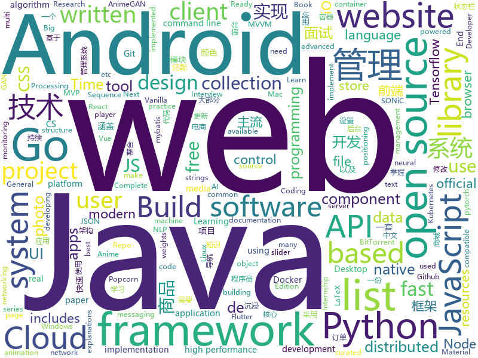

# 2020-05-26
See what the GitHub community is most excited about.

## python
+ [big-list-of-naughty-strings](https://github.com/minimaxir/big-list-of-naughty-strings)(**254 stars today**): The Big List of Naughty Strings is a list of strings which have a high probability of causing issues when used as user-input data.
+ [pytorch_geometric](https://github.com/rusty1s/pytorch_geometric)(**37 stars today**): Geometric Deep Learning Extension Library for PyTorch
+ [espnet](https://github.com/espnet/espnet)(**14 stars today**): End-to-End Speech Processing Toolkit
+ [public-apis](https://github.com/public-apis/public-apis)(**632 stars today**): A collective list of free APIs for use in software and web development.
+ [system-design-primer](https://github.com/donnemartin/system-design-primer)(**529 stars today**): Learn how to design large-scale systems. Prep for the system design interview. Includes Anki flashcards.
+ [building_tool](https://github.com/ranjian0/building_tool)(**46 stars today**): Building generation addon for blender
+ [sherlock](https://github.com/sherlock-project/sherlock)(**27 stars today**): 🔎Hunt down social media accounts by username across social networks
+ [PySyft](https://github.com/OpenMined/PySyft)(**17 stars today**): A library for encrypted, privacy preserving machine learning
+ [mmdetection](https://github.com/open-mmlab/mmdetection)(**23 stars today**): Open MMLab Detection Toolbox and Benchmark
+ [skiptracer](https://github.com/xillwillx/skiptracer)(**15 stars today**): OSINT python webscaping framework
+ [allennlp](https://github.com/allenai/allennlp)(**6 stars today**): An open-source NLP research library, built on PyTorch.
+ [spaCy](https://github.com/explosion/spaCy)(**15 stars today**): 💫Industrial-strength Natural Language Processing (NLP) with Python and Cython
+ [Yet-Another-EfficientDet-Pytorch](https://github.com/zylo117/Yet-Another-EfficientDet-Pytorch)(**17 stars today**): The pytorch re-implement of the official efficientdet with SOTA performance in real time and pretrained weights.
+ [next_word_prediction](https://github.com/renatoviolin/next_word_prediction)(**101 stars today**): Using transformers to predict next word and predict <mask> word
+ [Real_Time_Image_Animation](https://github.com/anandpawara/Real_Time_Image_Animation)(**49 stars today**): The Project is real time application in opencv using first order model
+ [fairseq](https://github.com/pytorch/fairseq)(**16 stars today**): Facebook AI Research Sequence-to-Sequence Toolkit written in Python.
+ [eat_tensorflow2_in_30_days](https://github.com/lyhue1991/eat_tensorflow2_in_30_days)(**51 stars today**): Tensorflow2.0🍎🍊is delicious, just eat it!😋😋
+ [ResNeSt](https://github.com/zhanghang1989/ResNeSt)(**40 stars today**): ResNeSt: Split-Attention Network
+ [discord.py](https://github.com/Rapptz/discord.py)(**10 stars today**): An API wrapper for Discord written in Python.
+ [big_transfer](https://github.com/google-research/big_transfer)(**105 stars today**): Official repository for the "Big Transfer (BiT): General Visual Representation Learning" paper.
+ [AnimeGAN](https://github.com/TachibanaYoshino/AnimeGAN)(**12 stars today**): A Tensorflow implementation of AnimeGAN for fast photo animation ! This is the Open source of the paper <AnimeGAN: a novel lightweight GAN for photo animation>, which uses the GAN framwork to transform real-world photos into anime images.
+ [examples-of-web-crawlers](https://github.com/shengqiangzhang/examples-of-web-crawlers)(**12 stars today**): 一些非常有趣的python爬虫例子,对新手比较友好,主要爬取淘宝、天猫、微信、豆瓣、QQ等网站。(Some interesting examples of python crawlers that are friendly to beginners. )
+ [tensorflow-yolov4-tflite](https://github.com/hunglc007/tensorflow-yolov4-tflite)(**15 stars today**): YOLOv4, YOLOv3, YOLO-tiny Implemented in Tensorflow 2.0, Android. Convert YOLO v4 .weights tensorflow, tensorrt and tflite
+ [textshot](https://github.com/ianzhao05/textshot)(**51 stars today**): Python tool for grabbing text via screenshot
+ [bitcoinbook](https://github.com/bitcoinbook/bitcoinbook)(**14 stars today**): Mastering Bitcoin 2nd Edition - Programming the Open Blockchain

## java
+ [Jetpack-MVVM-Best-Practice](https://github.com/KunMinX/Jetpack-MVVM-Best-Practice)(**210 stars today**): 是 难得一见 的 Jetpack MVVM 最佳实践！在 蕴繁于简 的代码中，对 视图控制器 乃至 标准化开发模式 形成正确、深入的理解！
+ [JavaGuide](https://github.com/Snailclimb/JavaGuide)(**180 stars today**): 「Java学习+面试指南」一份涵盖大部分Java程序员所需要掌握的核心知识。
+ [cwa-verification-server](https://github.com/corona-warn-app/cwa-verification-server)(**16 stars today**): Backend implementation of the verification process
+ [Auto.js](https://github.com/hyb1996/Auto.js)(**37 stars today**): A UiAutomator on android, does not need root access(安卓平台上的JavaScript自动化工具)
+ [SpringCloud-Learning](https://github.com/dyc87112/SpringCloud-Learning)(**4 stars today**): Spring Cloud基础教程，持续连载更新中
+ [dubbo](https://github.com/apache/dubbo)(**26 stars today**): Apache Dubbo is a high-performance, java based, open source RPC framework.
+ [mybatis](https://github.com/tuguangquan/mybatis)(**9 stars today**): mybatis源码中文注释
+ [edisyn](https://github.com/eclab/edisyn)(**7 stars today**): Synthesizer Patch Editor
+ [Telegram](https://github.com/DrKLO/Telegram)(**18 stars today**): Telegram for Android source
+ [MVVMHabit](https://github.com/goldze/MVVMHabit)(**16 stars today**): 👕基于谷歌最新AAC架构，MVVM设计模式的一套快速开发库，整合Okhttp+RxJava+Retrofit+Glide等主流模块，满足日常开发需求。使用该框架可以快速开发一个高质量、易维护的Android应用。
+ [material-components-android](https://github.com/material-components/material-components-android)(**10 stars today**): Modular and customizable Material Design UI components for Android
+ [JCSprout](https://github.com/crossoverJie/JCSprout)(**22 stars today**): 👨‍🎓Java Core Sprout : basic, concurrent, algorithm
+ [MVPArms](https://github.com/JessYanCoding/MVPArms)(**8 stars today**): ⚔️A common architecture for Android applications developing based on MVP, integrates many open source projects, to make your developing quicker and easier (一个整合了大量主流开源项目高度可配置化的 Android MVP 快速集成框架).
+ [libgdx](https://github.com/libgdx/libgdx)(**15 stars today**): Desktop/Android/HTML5/iOS Java game development framework
+ [mall](https://github.com/macrozheng/mall)(**49 stars today**): mall项目是一套电商系统，包括前台商城系统及后台管理系统，基于SpringBoot+MyBatis实现，采用Docker容器化部署。 前台商城系统包含首页门户、商品推荐、商品搜索、商品展示、购物车、订单流程、会员中心、客户服务、帮助中心等模块。 后台管理系统包含商品管理、订单管理、会员管理、促销管理、运营管理、内容管理、统计报表、财务管理、权限管理、设置等模块。
+ [Sentinel](https://github.com/alibaba/Sentinel)(**22 stars today**): A powerful flow control component enabling reliability, resilience and monitoring for microservices. (面向云原生微服务的高可用流控防护组件)
+ [interview](https://github.com/mission-peace/interview)(**11 stars today**): Interview questions
+ [mall-learning](https://github.com/macrozheng/mall-learning)(**10 stars today**): mall学习教程，架构、业务、技术要点全方位解析。mall项目（25k+star）是一套电商系统，使用现阶段主流技术实现。 涵盖了SpringBoot2.1.3、MyBatis3.4.6、Elasticsearch6.2.2、RabbitMQ3.7.15、Redis3.2、Mongodb3.2、Mysql5.7等技术，采用Docker容器化部署。
+ [quarkus](https://github.com/quarkusio/quarkus)(**15 stars today**): Quarkus: Supersonic Subatomic Java.
+ [ar-cptext](https://github.com/cyrildiagne/ar-cptext)(**14 stars today**): AR Copy Paste - Text Proto
+ [flutter_boost](https://github.com/alibaba/flutter_boost)(**8 stars today**): FlutterBoost is a Flutter plugin which enables hybrid integration of Flutter for your existing native apps with minimum efforts
+ [Signal-Android](https://github.com/signalapp/Signal-Android)(**9 stars today**): A private messenger for Android.
+ [ImmersionBar](https://github.com/gyf-dev/ImmersionBar)(**9 stars today**): android 4.4以上沉浸式状态栏和沉浸式导航栏管理，适配横竖屏切换、刘海屏、软键盘弹出等问题，可以修改状态栏字体颜色和导航栏图标颜色，以及不可修改字体颜色手机的适配，适用于Activity、Fragment、DialogFragment、Dialog，PopupWindow，一句代码轻松实现，以及对bar的其他设置，详见README。简书请参考：http://www.jianshu.com/p/2a884e211a62
+ [CS-Notes](https://github.com/CyC2018/CS-Notes)(**119 stars today**): 📚技术面试必备基础知识、Leetcode、计算机操作系统、计算机网络、系统设计、Java、Python、C++
+ [interviews](https://github.com/kdn251/interviews)(**57 stars today**): Everything you need to know to get the job.

## unknown
+ [immuni-documentation](https://github.com/immuni-app/immuni-documentation)(**74 stars today**): Repo for Immuni's documentation.
+ [coding-interview-university](https://github.com/jwasham/coding-interview-university)(**611 stars today**): A complete computer science study plan to become a software engineer.
+ [Marketing-for-Engineers](https://github.com/LisaDziuba/Marketing-for-Engineers)(**548 stars today**): A curated collection of marketing articles & tools to grow your product.
+ [You-Dont-Know-JS](https://github.com/getify/You-Dont-Know-JS)(**226 stars today**): A book series on JavaScript. @YDKJS on twitter.
+ [build-your-own-x](https://github.com/danistefanovic/build-your-own-x)(**1,023 stars today**): 🤓Build your own (insert technology here)
+ [the-art-of-command-line](https://github.com/jlevy/the-art-of-command-line)(**601 stars today**): Master the command line, in one page
+ [free-programming-books](https://github.com/EbookFoundation/free-programming-books)(**621 stars today**): 📚Freely available programming books
+ [developer-roadmap](https://github.com/kamranahmedse/developer-roadmap)(**445 stars today**): Roadmap to becoming a web developer in 2020
+ [Front-End-Checklist](https://github.com/thedaviddias/Front-End-Checklist)(**228 stars today**): 🗂The perfect Front-End Checklist for modern websites and meticulous developers
+ [reverse-interview](https://github.com/viraptor/reverse-interview)(**88 stars today**): Questions to ask the company during your interview
+ [design-resources-for-developers](https://github.com/bradtraversy/design-resources-for-developers)(**375 stars today**): Curated list of design and UI resources from stock photos, web templates, CSS frameworks, UI libraries, tools and much more
+ [javascript-questions](https://github.com/lydiahallie/javascript-questions)(**30 stars today**): A long list of (advanced) JavaScript questions, and their explanations✨
+ [gitignore](https://github.com/github/gitignore)(**250 stars today**): A collection of useful .gitignore templates
+ [Summer2021-Internships](https://github.com/Pitt-CSC/Summer2021-Internships)(**25 stars today**): Collection of Summer 2021 tech internships!
+ [JavaFamily](https://github.com/AobingJava/JavaFamily)(**81 stars today**): 【Java面试+Java学习指南】 一份涵盖大部分Java程序员所需要掌握的核心知识。
+ [deno-forum](https://github.com/DenoBrazil/deno-forum)(**114 stars today**): 🦖Fórum com o objetivo de centralizar discussões da comunidade de Deno
+ [JavaScript-Algorithms](https://github.com/sisterAn/JavaScript-Algorithms)(**60 stars today**): 基础理论+JS框架应用+实践，从0到1构建整个前端算法体系
+ [hiring2020](https://github.com/gcreddy42/hiring2020)(**15 stars today**): Internship status of companies - COVID-19
+ [nlp-beginner](https://github.com/FudanNLP/nlp-beginner)(**10 stars today**): NLP上手教程
+ [flink-training-course](https://github.com/flink-china/flink-training-course)(**10 stars today**): Flink 中文视频课程（持续更新...）
+ [xiaozhi](https://github.com/qq449245884/xiaozhi)(**14 stars today**): 
+ [Red-Teaming-Toolkit](https://github.com/infosecn1nja/Red-Teaming-Toolkit)(**12 stars today**): A collection of open source and commercial tools that aid in red team operations.
+ [GNNPapers](https://github.com/thunlp/GNNPapers)(**19 stars today**): Must-read papers on graph neural networks (GNN)
+ [Resources-For-CS-Students](https://github.com/monajalal/Resources-For-CS-Students)(**9 stars today**): A list of resources such as scholarships, fellowships, and mailing list for helping CS students succeed in their career
+ [acwa_book_ru](https://github.com/adelf/acwa_book_ru)(**5 stars today**): Книга "Архитектура сложных веб-приложений. С примерами на Laravel"

## javascript
+ [popcorn-desktop](https://github.com/popcorn-official/popcorn-desktop)(**211 stars today**): Popcorn Time is a multi-platform, free software BitTorrent client that includes an integrated media player. Desktop ( Windows / Mac / Linux ) a Butter-Project Fork
+ [responsively-app](https://github.com/manojVivek/responsively-app)(**441 stars today**): A modified browser that helps in responsive web development.
+ [content](https://github.com/nuxt/content)(**44 stars today**): Write in a content/ directory and fetch your Markdown, JSON, YAML and CSV files through a MongoDB like API, acting as a Git-based Headless CMS
+ [javascript-algorithms](https://github.com/trekhleb/javascript-algorithms)(**489 stars today**): 📝Algorithms and data structures implemented in JavaScript with explanations and links to further readings
+ [nodebestpractices](https://github.com/goldbergyoni/nodebestpractices)(**261 stars today**): ✅The Node.js best practices list (May 2020)
+ [google-meet-grid-view](https://github.com/Fugiman/google-meet-grid-view)(**18 stars today**): Userscript to offer a grid-view layout in Google Meets
+ [vue](https://github.com/vuejs/vue)(**97 stars today**): 🖖Vue.js is a progressive, incrementally-adoptable JavaScript framework for building UI on the web.
+ [Daily-Interview-Question](https://github.com/Advanced-Frontend/Daily-Interview-Question)(**53 stars today**): 我是木易杨，公众号「高级前端进阶」作者，每天搞定一道前端大厂面试题，祝大家天天进步，一年后会看到不一样的自己。
+ [realworld](https://github.com/gothinkster/realworld)(**141 stars today**): "The mother of all demo apps" — Exemplary fullstack Medium.com clone powered by React, Angular, Node, Django, and many more🏅
+ [gatsby](https://github.com/gatsbyjs/gatsby)(**34 stars today**): Build blazing fast, modern apps and websites with React
+ [next.js](https://github.com/zeit/next.js)(**49 stars today**): The React Framework
+ [clean-code-javascript](https://github.com/ryanmcdermott/clean-code-javascript)(**57 stars today**): 🛁Clean Code concepts adapted for JavaScript
+ [next-site](https://github.com/zeit/next-site)(**19 stars today**): The official website for Next.js
+ [axios](https://github.com/axios/axios)(**53 stars today**): Promise based HTTP client for the browser and node.js
+ [nuxt.js](https://github.com/nuxt/nuxt.js)(**26 stars today**): The Intuitive Vue Framework
+ [javascript](https://github.com/airbnb/javascript)(**123 stars today**): JavaScript Style Guide
+ [junior-recruit-scheduler](https://github.com/jojoldu/junior-recruit-scheduler)(**11 stars today**): 주니어 개발자 채용 정보
+ [bypass-paywalls-chrome](https://github.com/iamadamdev/bypass-paywalls-chrome)(**64 stars today**): Bypass Paywalls web browser extension
+ [three.js](https://github.com/mrdoob/three.js)(**44 stars today**): JavaScript 3D library.
+ [popcorn-api](https://github.com/popcorn-official/popcorn-api)(**13 stars today**): Popcorn Time is a multi-platform, free software BitTorrent client that includes an integrated media player. Compatible API Anime/Movies/Show Scrapper
+ [idasen-control](https://github.com/mitsuhiko/idasen-control)(**52 stars today**): Lets you control IKEA IDÅSEN desks from the command line.
+ [tailblocks](https://github.com/mertJF/tailblocks)(**55 stars today**): 🎉Ready-to-use Tailwind CSS blocks.
+ [iptv](https://github.com/iptv-org/iptv)(**47 stars today**): Collection of 8000+ publicly available IPTV channels from all over the world
+ [swiper](https://github.com/nolimits4web/swiper)(**11 stars today**): Most modern mobile touch slider with hardware accelerated transitions
+ [listen1_desktop](https://github.com/listen1/listen1_desktop)(**15 stars today**): one for all free music in china (Windows, Mac, Linux desktop)

## html
+ [latex-css](https://github.com/vincentdoerig/latex-css)(**489 stars today**): LaTeX.css is a CSS library that makes your website look like a LaTeX document
+ [awesome-piracy](https://github.com/Igglybuff/awesome-piracy)(**108 stars today**): A curated list of awesome warez and piracy links
+ [pcc_2e](https://github.com/ehmatthes/pcc_2e)(**31 stars today**): Online resources for Python Crash Course (Second Edition), from No Starch Press
+ [webdevbootcamp](https://github.com/nax3t/webdevbootcamp)(**3 stars today**): All source code for back-end projects from the Web Developer Bootcamp
+ [hyperblog](https://github.com/freddier/hyperblog)(**11 stars today**): Un blog increíble para el curso de Git y Github de Platzi
+ [web-moderno](https://github.com/cod3rcursos/web-moderno)(**7 stars today**): 
+ [JavaScript30](https://github.com/wesbos/JavaScript30)(**13 stars today**): 30 Day Vanilla JS Challenge
+ [hugo-academic](https://github.com/gcushen/hugo-academic)(**11 stars today**): 📝The website builder for Hugo. Build and deploy a beautiful website in minutes!
+ [tiny-slider](https://github.com/ganlanyuan/tiny-slider)(**5 stars today**): Vanilla javascript slider for all purposes.
+ [computer-science-flash-cards](https://github.com/jwasham/computer-science-flash-cards)(**14 stars today**): Mini website for testing both general CS knowledge and enforce coding practice and common algorithm/data structure memorization.
+ [Graphics](https://github.com/Unity-Technologies/Graphics)(**4 stars today**): Unity Graphics - Including Scriptable Render Pipeline
+ [nanopop](https://github.com/Simonwep/nanopop)(**77 stars today**): 🍦Minimalistic, small, positioning engine. Build for high-performance, minimal footprint and maximum control over positioning behavior.
+ [SONiC](https://github.com/Azure/SONiC)(**31 stars today**): Landing page for Software for Open Networking in the Cloud (SONiC) - http://azure.github.io/SONiC/
+ [fivem-docs](https://github.com/citizenfx/fivem-docs)(**0 stars today**): FiveM documentation repository
+ [flask-dashboard-gradientable](https://github.com/app-generator/flask-dashboard-gradientable)(**5 stars today**): Flask Dashboard Gradientable - Open-Source Admin Panel | AppSeed
+ [awesome-compose](https://github.com/docker/awesome-compose)(**8 stars today**): Awesome Docker Compose samples
+ [Awesome-CS-Books-and-Digests](https://github.com/wx-chevalier/Awesome-CS-Books-and-Digests)(**6 stars today**): 📚Awesome CS Books(with Digests)/Series(.pdf by git lfs) Warehouse for Geeks, ProgrammingLanguage, SoftwareEngineering, Web, AI, ServerSideApplication, Infrastructure, FE etc.💫优秀计算机科学与技术领域相关的书籍归档，以及我的读书笔记。
+ [blog_os](https://github.com/phil-opp/blog_os)(**10 stars today**): Writing an OS in Rust
+ [blog](https://github.com/lifesinger/blog)(**2 stars today**): 岁月如歌
+ [calico](https://github.com/projectcalico/calico)(**4 stars today**): Cloud native networking and network security
+ [ML-notes](https://github.com/Sakura-gh/ML-notes)(**9 stars today**): notes about machine learning
+ [startbootstrap-resume](https://github.com/BlackrockDigital/startbootstrap-resume)(**4 stars today**): A Bootstrap 4 resume/CV theme created by Start Bootstrap
+ [learning-area](https://github.com/mdn/learning-area)(**3 stars today**): Github repo for the MDN Learning Area.
+ [Java-Interview-Advanced](https://github.com/shishan100/Java-Interview-Advanced)(**7 stars today**): 中华石杉--互联网Java进阶面试训练营
+ [MatBlazor](https://github.com/SamProf/MatBlazor)(**10 stars today**): Material Design components for Blazor and Razor Components

## go
+ [olivia](https://github.com/olivia-ai/olivia)(**229 stars today**): 💁‍♀️Your new best friend powered by an artificial neural network
+ [clash](https://github.com/Dreamacro/clash)(**53 stars today**): A rule-based tunnel in Go.
+ [kratos](https://github.com/ory/kratos)(**15 stars today**): Never build user login, user registration, 2fa, profile management ever again! Works on any operating system, cloud, with any programming language, user interface, and user experience! Written in Go.
+ [learn-go-with-tests](https://github.com/quii/learn-go-with-tests)(**20 stars today**): Learn Go with test-driven development
+ [go-fault](https://github.com/github/go-fault)(**57 stars today**): Fault injection library in Go using standard http middleware
+ [grpc-gateway](https://github.com/grpc-ecosystem/grpc-gateway)(**10 stars today**): gRPC to JSON proxy generator following the gRPC HTTP spec
+ [seaweedfs](https://github.com/chrislusf/seaweedfs)(**7 stars today**): SeaweedFS is a simple and highly scalable distributed file system, to store and serve billions of files fast! SeaweedFS implements an object store with O(1) disk seek, transparent cloud integration, and an optional Filer supporting POSIX, S3 API, AES256 encryption, Erasure Coding for warm storage, FUSE mount, Hadoop compatible, WebDAV.
+ [PhoneInfoga](https://github.com/sundowndev/PhoneInfoga)(**4 stars today**): Advanced information gathering & OSINT framework for phone numbers
+ [chat](https://github.com/tinode/chat)(**9 stars today**): Instant messaging server; backend in Go; iOS, Android, web, command line clients; chatbots
+ [charts](https://github.com/helm/charts)(**28 stars today**): Curated applications for Kubernetes
+ [client-go](https://github.com/kubernetes/client-go)(**14 stars today**): Go client for Kubernetes.
+ [golang-web-dev](https://github.com/GoesToEleven/golang-web-dev)(**5 stars today**): 
+ [ffuf](https://github.com/ffuf/ffuf)(**22 stars today**): Fast web fuzzer written in Go
+ [7days-golang](https://github.com/geektutu/7days-golang)(**16 stars today**): 7 days golang apps from scratch (web framework Gee, distributed cache GeeCache, object relational mapping ORM framework GeeORM etc) 7天用Go动手写/从零实现系列
+ [beego](https://github.com/astaxie/beego)(**9 stars today**): beego is an open-source, high-performance web framework for the Go programming language.
+ [loki](https://github.com/grafana/loki)(**17 stars today**): Like Prometheus, but for logs.
+ [rancher](https://github.com/rancher/rancher)(**10 stars today**): Complete container management platform
+ [fiber](https://github.com/gofiber/fiber)(**20 stars today**): ⚡️Fiber is an Express inspired web framework written in Go with☕️
+ [jaeger-client-go](https://github.com/jaegertracing/jaeger-client-go)(**4 stars today**): Jaeger Bindings for Go OpenTracing API.
+ [etcd](https://github.com/etcd-io/etcd)(**20 stars today**): Distributed reliable key-value store for the most critical data of a distributed system
+ [nats-server](https://github.com/nats-io/nats-server)(**8 stars today**): High-Performance server for NATS, the cloud native messaging system.
+ [kubeedge](https://github.com/kubeedge/kubeedge)(**2 stars today**): Kubernetes Native Edge Computing Framework (project under CNCF)
+ [kubesphere](https://github.com/kubesphere/kubesphere)(**13 stars today**): Easy-to-use Production Ready Container Platform
+ [falcon-plus](https://github.com/open-falcon/falcon-plus)(**3 stars today**): An open-source and enterprise-level monitoring system.
+ [websocket](https://github.com/gorilla/websocket)(**13 stars today**): A fast, well-tested and widely used WebSocket implementation for Go.

## WordCloud

