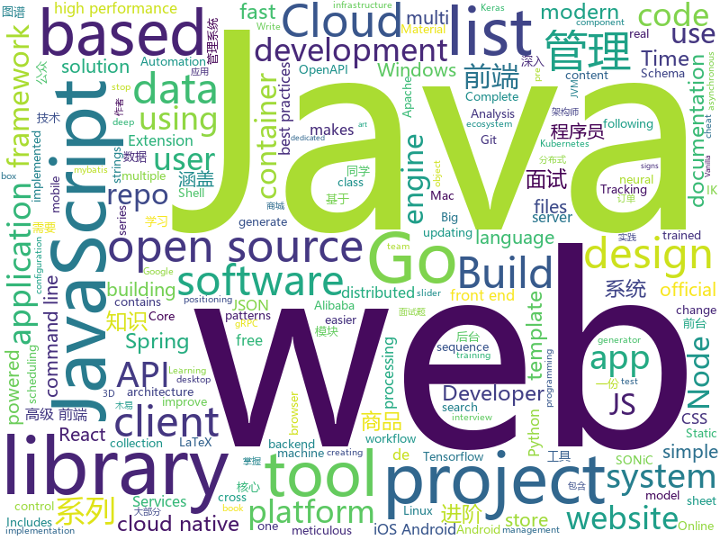

# 2020-05-27
See what the GitHub community is most excited about.

## python
+ [system-design-primer](https://github.com/donnemartin/system-design-primer)(**381 stars today**): Learn how to design large-scale systems. Prep for the system design interview. Includes Anki flashcards.
+ [Real_Time_Image_Animation](https://github.com/anandpawara/Real_Time_Image_Animation)(**590 stars today**): The Project is real time application in opencv using first order model
+ [public-apis](https://github.com/public-apis/public-apis)(**441 stars today**): A collective list of free APIs for use in software and web development.
+ [pytorch_geometric](https://github.com/rusty1s/pytorch_geometric)(**44 stars today**): Geometric Deep Learning Extension Library for PyTorch
+ [bert](https://github.com/google-research/bert)(**18 stars today**): TensorFlow code and pre-trained models for BERT
+ [jina](https://github.com/jina-ai/jina)(**21 stars today**): Jina is the cloud-native neural search framework powered by state-of-the-art AI and deep learning
+ [horovod](https://github.com/horovod/horovod)(**9 stars today**): Distributed training framework for TensorFlow, Keras, PyTorch, and Apache MXNet.
+ [building_tool](https://github.com/ranjian0/building_tool)(**73 stars today**): Building generation addon for blender
+ [espnet](https://github.com/espnet/espnet)(**20 stars today**): End-to-End Speech Processing Toolkit
+ [AB3DMOT](https://github.com/xinshuoweng/AB3DMOT)(**17 stars today**): Official Python Implementation for "A Baseline for 3D Multi-Object Tracking", In Submission
+ [vaex](https://github.com/vaexio/vaex)(**117 stars today**): Out-of-Core DataFrames for Python, ML, visualize and explore big tabular data at a billion rows per second🚀
+ [wttr.in](https://github.com/chubin/wttr.in)(**57 stars today**): ⛅The right way to check the weather
+ [PaddleHub](https://github.com/PaddlePaddle/PaddleHub)(**21 stars today**): Toolkit For Pre-Trained Model Application of PaddlePaddle（『飞桨』预训练模型应用工具 ）
+ [DeepFaceLab](https://github.com/iperov/DeepFaceLab)(**22 stars today**): DeepFaceLab is the leading software for creating deepfakes.
+ [big-list-of-naughty-strings](https://github.com/minimaxir/big-list-of-naughty-strings)(**222 stars today**): The Big List of Naughty Strings is a list of strings which have a high probability of causing issues when used as user-input data.
+ [sort](https://github.com/abewley/sort)(**7 stars today**): Simple, online, and realtime tracking of multiple objects in a video sequence.
+ [PySyft](https://github.com/OpenMined/PySyft)(**19 stars today**): A library for encrypted, privacy preserving machine learning
+ [keras-yolo3](https://github.com/qqwweee/keras-yolo3)(**11 stars today**): A Keras implementation of YOLOv3 (Tensorflow backend)
+ [point2mesh](https://github.com/ranahanocka/point2mesh)(**40 stars today**): Reconstruct Watertight Meshes from Point Clouds [SIGGRAPH 2020]
+ [compose](https://github.com/docker/compose)(**8 stars today**): Define and run multi-container applications with Docker
+ [elastalert](https://github.com/Yelp/elastalert)(**4 stars today**): Easy & Flexible Alerting With ElasticSearch
+ [httprunner](https://github.com/httprunner/httprunner)(**5 stars today**): One-stop solution for HTTP(S) testing.
+ [aws-cdk-examples](https://github.com/aws-samples/aws-cdk-examples)(**4 stars today**): Example projects using the AWS CDK
+ [eat_tensorflow2_in_30_days](https://github.com/lyhue1991/eat_tensorflow2_in_30_days)(**39 stars today**): Tensorflow2.0🍎🍊is delicious, just eat it!😋😋
+ [integrations-core](https://github.com/DataDog/integrations-core)(**0 stars today**): Core integrations of the Datadog Agent

## java
+ [Jetpack-MVVM-Best-Practice](https://github.com/KunMinX/Jetpack-MVVM-Best-Practice)(**192 stars today**): 是 难得一见 的 Jetpack MVVM 最佳实践！在 蕴繁于简 的代码中，对 视图控制器 乃至 标准化开发模式 形成正确、深入的理解！
+ [JavaGuide](https://github.com/Snailclimb/JavaGuide)(**176 stars today**): 「Java学习+面试指南」一份涵盖大部分Java程序员所需要掌握的核心知识。
+ [CS-Notes](https://github.com/CyC2018/CS-Notes)(**145 stars today**): 📚技术面试必备基础知识、Leetcode、计算机操作系统、计算机网络、系统设计、Java、Python、C++
+ [hutool](https://github.com/looly/hutool)(**54 stars today**): A set of tools that keep Java sweet.
+ [elasticsearch](https://github.com/elastic/elasticsearch)(**25 stars today**): Open Source, Distributed, RESTful Search Engine
+ [easyexcel](https://github.com/alibaba/easyexcel)(**21 stars today**): 快速、简单避免OOM的java处理Excel工具
+ [spring-cloud-alibaba](https://github.com/alibaba/spring-cloud-alibaba)(**37 stars today**): Spring Cloud Alibaba provides a one-stop solution for application development for the distributed solutions of Alibaba middleware.
+ [mybatis](https://github.com/tuguangquan/mybatis)(**15 stars today**): mybatis源码中文注释
+ [capacitor](https://github.com/ionic-team/capacitor)(**5 stars today**): Build cross-platform Native Progressive Web Apps for iOS, Android, and the web⚡️
+ [AndroidUtilCode](https://github.com/Blankj/AndroidUtilCode)(**16 stars today**): 🔥Android developers should collect the following utils(updating).
+ [spring-framework](https://github.com/spring-projects/spring-framework)(**38 stars today**): Spring Framework
+ [mall](https://github.com/macrozheng/mall)(**71 stars today**): mall项目是一套电商系统，包括前台商城系统及后台管理系统，基于SpringBoot+MyBatis实现，采用Docker容器化部署。 前台商城系统包含首页门户、商品推荐、商品搜索、商品展示、购物车、订单流程、会员中心、客户服务、帮助中心等模块。 后台管理系统包含商品管理、订单管理、会员管理、促销管理、运营管理、内容管理、统计报表、财务管理、权限管理、设置等模块。
+ [SpringCloud-Learning](https://github.com/dyc87112/SpringCloud-Learning)(**5 stars today**): Spring Cloud基础教程，持续连载更新中
+ [jenkins](https://github.com/jenkinsci/jenkins)(**10 stars today**): Jenkins automation server
+ [RIBs](https://github.com/uber/RIBs)(**5 stars today**): Uber's cross-platform mobile architecture framework.
+ [Springy-Store-Microservices](https://github.com/mohamed-taman/Springy-Store-Microservices)(**7 stars today**): Springy Store is a conceptual simple μServices-based project using the latest cutting-edge technologies, to demonstrate how the store is created to be a cloud-native and 12-factor app agnostic. Those μServices are developed based on Spring Boot & Cloud framework, that implement cloud-native intuitive, design patterns and best practices.
+ [incubator-dolphinscheduler](https://github.com/apache/incubator-dolphinscheduler)(**9 stars today**): Dolphin Scheduler is a distributed and easy-to-extend visual workflow scheduling platform, dedicated to solving the complex dependencies in data processing, making the scheduling system out of the box for data processing.(分布式易扩展的可视化工作流任务调度)
+ [elasticsearch-analysis-ik](https://github.com/medcl/elasticsearch-analysis-ik)(**18 stars today**): The IK Analysis plugin integrates Lucene IK analyzer into elasticsearch, support customized dictionary.
+ [okhttp](https://github.com/square/okhttp)(**18 stars today**): Square’s meticulous HTTP client for Java and Kotlin.
+ [druid](https://github.com/apache/druid)(**7 stars today**): Apache Druid: a high performance real-time analytics database.
+ [config](https://github.com/lightbend/config)(**5 stars today**): configuration library for JVM languages using HOCON files
+ [advanced-java](https://github.com/doocs/advanced-java)(**53 stars today**): 😮互联网 Java 工程师进阶知识完全扫盲：涵盖高并发、分布式、高可用、微服务、海量数据处理等领域知识，后端同学必看，前端同学也可学习
+ [graphhopper](https://github.com/graphhopper/graphhopper)(**20 stars today**): Open source routing engine for OpenStreetMap. Use it as Java library or server.
+ [RxJava](https://github.com/ReactiveX/RxJava)(**20 stars today**): RxJava – Reactive Extensions for the JVM – a library for composing asynchronous and event-based programs using observable sequences for the Java VM.
+ [java-design-patterns](https://github.com/iluwatar/java-design-patterns)(**21 stars today**): Design patterns implemented in Java

## unknown
+ [build-your-own-x](https://github.com/danistefanovic/build-your-own-x)(**575 stars today**): 🤓Build your own (insert technology here)
+ [deno-forum](https://github.com/DenoBrazil/deno-forum)(**114 stars today**): 🦖Fórum com o objetivo de centralizar discussões da comunidade de Deno
+ [free-programming-books](https://github.com/EbookFoundation/free-programming-books)(**419 stars today**): 📚Freely available programming books
+ [the-art-of-command-line](https://github.com/jlevy/the-art-of-command-line)(**361 stars today**): Master the command line, in one page
+ [developer-roadmap](https://github.com/kamranahmedse/developer-roadmap)(**360 stars today**): Roadmap to becoming a web developer in 2020
+ [ml-visuals](https://github.com/dair-ai/ml-visuals)(**190 stars today**): Visuals contains figures and templates which you can reuse and customize to improve your scientific writing.
+ [Front-End-Checklist](https://github.com/thedaviddias/Front-End-Checklist)(**155 stars today**): 🗂The perfect Front-End Checklist for modern websites and meticulous developers
+ [coding-interview-university](https://github.com/jwasham/coding-interview-university)(**411 stars today**): A complete computer science study plan to become a software engineer.
+ [You-Dont-Know-JS](https://github.com/getify/You-Dont-Know-JS)(**144 stars today**): A book series on JavaScript. @YDKJS on twitter.
+ [EleLab_v2](https://github.com/Chrismettal/EleLab_v2)(**27 stars today**): Cheap DIY lab system for hobbyists and the tinkering folk
+ [reverse-interview](https://github.com/viraptor/reverse-interview)(**53 stars today**): Questions to ask the company during your interview
+ [Resources-For-CS-Students](https://github.com/monajalal/Resources-For-CS-Students)(**15 stars today**): A list of resources such as scholarships, fellowships, and mailing list for helping CS students succeed in their career
+ [blog](https://github.com/yygmind/blog)(**14 stars today**): 我是木易杨，公众号「高级前端进阶」作者，跟着我每周重点攻克一个前端面试重难点。接下来让我带你走进高级前端的世界，在进阶的路上，共勉！
+ [awesome-architecture](https://github.com/toutiaoio/awesome-architecture)(**31 stars today**): 架构师技术图谱，助你早日成为架构师
+ [JavaScript-Algorithms](https://github.com/sisterAn/JavaScript-Algorithms)(**46 stars today**): 基础理论+JS框架应用+实践，从0到1构建整个前端算法体系
+ [gitignore](https://github.com/github/gitignore)(**152 stars today**): A collection of useful .gitignore templates
+ [Blog](https://github.com/mqyqingfeng/Blog)(**39 stars today**): 冴羽写博客的地方，预计写四个系列：JavaScript深入系列、JavaScript专题系列、ES6系列、React系列。
+ [immuni-documentation](https://github.com/immuni-app/immuni-documentation)(**52 stars today**): Repo for Immuni's documentation.
+ [immuni](https://github.com/immuni-app/immuni)(**12 stars today**): Reference metadata repository for publiccode.yml indexing
+ [JavaFamily](https://github.com/AobingJava/JavaFamily)(**72 stars today**): 【Java面试+Java学习指南】 一份涵盖大部分Java程序员所需要掌握的核心知识。
+ [Red-Teaming-Toolkit](https://github.com/infosecn1nja/Red-Teaming-Toolkit)(**9 stars today**): A collection of open source and commercial tools that aid in red team operations.
+ [android-ecosystem-cheat-sheet](https://github.com/igorwojda/android-ecosystem-cheat-sheet)(**26 stars today**): 🤖Android Ecosystem Cheatsheet 2020
+ [OpenAPI-Specification](https://github.com/OAI/OpenAPI-Specification)(**19 stars today**): The OpenAPI Specification Repository
+ [google-cloud-4-words](https://github.com/gregsramblings/google-cloud-4-words)(**24 stars today**): The Google Cloud Developer's Cheat Sheet
+ [God-Of-BigData](https://github.com/wangzhiwubigdata/God-Of-BigData)(**12 stars today**): 大数据面试题，大数据成神之路开启...Flink/Spark/Hadoop/Hbase/Hive...

## javascript
+ [javascript-algorithms](https://github.com/trekhleb/javascript-algorithms)(**324 stars today**): 📝Algorithms and data structures implemented in JavaScript with explanations and links to further readings
+ [popcorn-desktop](https://github.com/popcorn-official/popcorn-desktop)(**252 stars today**): Popcorn Time is a multi-platform, free software BitTorrent client that includes an integrated media player. Desktop ( Windows / Mac / Linux ) a Butter-Project Fork
+ [tailblocks](https://github.com/mertJF/tailblocks)(**156 stars today**): 🎉Ready-to-use Tailwind CSS blocks.
+ [nodebestpractices](https://github.com/goldbergyoni/nodebestpractices)(**172 stars today**): ✅The Node.js best practices list (May 2020)
+ [content](https://github.com/nuxt/content)(**104 stars today**): Write in a content/ directory and fetch your Markdown, JSON, YAML and CSV files through a MongoDB like API, acting as a Git-based Headless CMS
+ [responsively-app](https://github.com/manojVivek/responsively-app)(**458 stars today**): A modified browser that helps in responsive web development.
+ [javascript](https://github.com/airbnb/javascript)(**93 stars today**): JavaScript Style Guide
+ [realworld](https://github.com/gothinkster/realworld)(**90 stars today**): "The mother of all demo apps" — Exemplary fullstack Medium.com clone powered by React, Angular, Node, Django, and many more🏅
+ [lerna](https://github.com/lerna/lerna)(**24 stars today**): 🐉A tool for managing JavaScript projects with multiple packages.
+ [generator-jhipster](https://github.com/jhipster/generator-jhipster)(**14 stars today**): JHipster is a development platform to quickly generate, develop, & deploy modern web applications & microservice architectures.
+ [playwright](https://github.com/microsoft/playwright)(**40 stars today**): Node library to automate Chromium, Firefox and WebKit with a single API
+ [google-meet-grid-view](https://github.com/Fugiman/google-meet-grid-view)(**18 stars today**): Userscript to offer a grid-view layout in Google Meets
+ [react-jsonschema-form](https://github.com/rjsf-team/react-jsonschema-form)(**10 stars today**): A React component for building Web forms from JSON Schema.
+ [node-redis](https://github.com/NodeRedis/node-redis)(**7 stars today**): A high performance Node.js Redis client.
+ [microsoft-authentication-library-for-js](https://github.com/AzureAD/microsoft-authentication-library-for-js)(**4 stars today**): Microsoft Authentication Library (MSAL) for JS
+ [appium](https://github.com/appium/appium)(**6 stars today**): 📱Automation for iOS, Android, and Windows Apps.
+ [cesium](https://github.com/CesiumGS/cesium)(**7 stars today**): An open-source JavaScript library for world-class 3D globes and maps🌎
+ [Daily-Interview-Question](https://github.com/Advanced-Frontend/Daily-Interview-Question)(**58 stars today**): 我是木易杨，公众号「高级前端进阶」作者，每天搞定一道前端大厂面试题，祝大家天天进步，一年后会看到不一样的自己。
+ [gatsby](https://github.com/gatsbyjs/gatsby)(**37 stars today**): Build blazing fast, modern apps and websites with React
+ [bypass-paywalls-chrome](https://github.com/iamadamdev/bypass-paywalls-chrome)(**68 stars today**): Bypass Paywalls web browser extension
+ [clean-code-javascript](https://github.com/ryanmcdermott/clean-code-javascript)(**55 stars today**): 🛁Clean Code concepts adapted for JavaScript
+ [swiper](https://github.com/nolimits4web/swiper)(**20 stars today**): Most modern mobile touch slider with hardware accelerated transitions
+ [material-ui](https://github.com/mui-org/material-ui)(**25 stars today**): React components for faster and easier web development. Build your own design system, or start with Material Design.
+ [react-query](https://github.com/tannerlinsley/react-query)(**60 stars today**): ⚛️Hooks for fetching, caching and updating asynchronous data in React
+ [html5-boilerplate](https://github.com/h5bp/html5-boilerplate)(**43 stars today**): A professional front-end template for building fast, robust, and adaptable web apps or sites.

## html
+ [Bootcamp-Setup](https://github.com/panacloud/Bootcamp-Setup)(**12 stars today**): 
+ [tidytuesday](https://github.com/rfordatascience/tidytuesday)(**17 stars today**): Official repo for the #tidytuesday project
+ [ecma262](https://github.com/tc39/ecma262)(**10 stars today**): Status, process, and documents for ECMA-262
+ [learning-area](https://github.com/mdn/learning-area)(**6 stars today**): Github repo for the MDN Learning Area.
+ [awesome-piracy](https://github.com/Igglybuff/awesome-piracy)(**22 stars today**): A curated list of awesome warez and piracy links
+ [devdocs](https://github.com/magento/devdocs)(**0 stars today**): Magento Developer Documentation
+ [Graphics](https://github.com/Unity-Technologies/Graphics)(**5 stars today**): Unity Graphics - Including Scriptable Render Pipeline
+ [proposal-record-tuple](https://github.com/tc39/proposal-record-tuple)(**20 stars today**): ECMAScript proposal for the Record and Tuple value types. | Stage 1: it will change!
+ [Front-end-Developer-Interview-Questions](https://github.com/h5bp/Front-end-Developer-Interview-Questions)(**13 stars today**): A list of helpful front-end related questions you can use to interview potential candidates, test yourself or completely ignore.
+ [tiny-slider](https://github.com/ganlanyuan/tiny-slider)(**6 stars today**): Vanilla javascript slider for all purposes.
+ [hugo-book](https://github.com/alex-shpak/hugo-book)(**4 stars today**): Hugo documentation theme as simple as plain book
+ [nanopop](https://github.com/Simonwep/nanopop)(**64 stars today**): 🍦Minimalistic, small, positioning engine. Build for high-performance, minimal footprint and maximum control over positioning behavior.
+ [skill-map](https://github.com/TeamStuQ/skill-map)(**5 stars today**): 程序员技能图谱
+ [html-css](https://github.com/gustavoguanabara/html-css)(**3 stars today**): Curso de HTML5 e CSS3
+ [website](https://github.com/kubernetes/website)(**4 stars today**): Kubernetes website and documentation repo:
+ [SONiC](https://github.com/Azure/SONiC)(**11 stars today**): Landing page for Software for Open Networking in the Cloud (SONiC) - http://azure.github.io/SONiC/
+ [forecasting](https://github.com/microsoft/forecasting)(**3 stars today**): Time Series Forecasting Best Practices & Examples
+ [typedoc](https://github.com/TypeStrong/typedoc)(**7 stars today**): Documentation generator for TypeScript projects.
+ [latex-css](https://github.com/vincentdoerig/latex-css)(**76 stars today**): LaTeX.css is a CSS library that makes your website look like a LaTeX document
+ [embeddedsw](https://github.com/Xilinx/embeddedsw)(**1 stars today**): Xilinx Embedded Software (embeddedsw) Development
+ [swagger-codegen](https://github.com/swagger-api/swagger-codegen)(**6 stars today**): swagger-codegen contains a template-driven engine to generate documentation, API clients and server stubs in different languages by parsing your OpenAPI / Swagger definition.
+ [MIXBOX](https://github.com/monlor/MIXBOX)(**5 stars today**): 一款基于Shell的小米路由器工具箱，原为Monlor-Tools，A tool box for XiaoMi Router base on Shell.
+ [Publii](https://github.com/GetPublii/Publii)(**6 stars today**): Publii is a desktop-based CMS for Windows, Mac and Linux that makes creating static websites fast and hassle-free, even for beginners.
+ [phpstan](https://github.com/phpstan/phpstan)(**5 stars today**): PHP Static Analysis Tool - discover bugs in your code without running it!
+ [training-kit](https://github.com/github/training-kit)(**1 stars today**): Open source cheat sheets for Git and GitHub

## go
+ [esbuild](https://github.com/evanw/esbuild)(**208 stars today**): An extremely fast JavaScript bundler and minifier
+ [cli](https://github.com/cli/cli)(**62 stars today**): GitHub’s official command line tool
+ [istio](https://github.com/istio/istio)(**19 stars today**): Connect, secure, control, and observe services.
+ [olivia](https://github.com/olivia-ai/olivia)(**167 stars today**): 💁‍♀️Your new best friend powered by an artificial neural network
+ [client-go](https://github.com/kubernetes/client-go)(**11 stars today**): Go client for Kubernetes.
+ [eksctl](https://github.com/weaveworks/eksctl)(**3 stars today**): The official CLI for Amazon EKS
+ [chat](https://github.com/tinode/chat)(**13 stars today**): Instant messaging server; backend in Go; iOS, Android, web, command line clients; chatbots
+ [gophish](https://github.com/gophish/gophish)(**14 stars today**): Open-Source Phishing Toolkit
+ [harbor](https://github.com/goharbor/harbor)(**21 stars today**): An open source trusted cloud native registry project that stores, signs, and scans content.
+ [terraform](https://github.com/hashicorp/terraform)(**23 stars today**): Terraform enables you to safely and predictably create, change, and improve infrastructure. It is an open source tool that codifies APIs into declarative configuration files that can be shared amongst team members, treated as code, edited, reviewed, and versioned.
+ [logrus](https://github.com/sirupsen/logrus)(**10 stars today**): Structured, pluggable logging for Go.
+ [grpc-gateway](https://github.com/grpc-ecosystem/grpc-gateway)(**20 stars today**): gRPC to JSON proxy generator following the gRPC HTTP spec
+ [moby](https://github.com/moby/moby)(**18 stars today**): Moby Project - a collaborative project for the container ecosystem to assemble container-based systems
+ [argo](https://github.com/argoproj/argo)(**13 stars today**): Argo Workflows: Get stuff done with Kubernetes.
+ [gotraining](https://github.com/ardanlabs/gotraining)(**9 stars today**): Go Training Class Material :
+ [rancher](https://github.com/rancher/rancher)(**13 stars today**): Complete container management platform
+ [gh-ost](https://github.com/github/gh-ost)(**14 stars today**): GitHub's Online Schema Migrations for MySQL
+ [node_exporter](https://github.com/prometheus/node_exporter)(**7 stars today**): Exporter for machine metrics
+ [cert-manager](https://github.com/jetstack/cert-manager)(**11 stars today**): Automatically provision and manage TLS certificates in Kubernetes
+ [echo](https://github.com/labstack/echo)(**12 stars today**): High performance, minimalist Go web framework
+ [jaeger-client-go](https://github.com/jaegertracing/jaeger-client-go)(**9 stars today**): Jaeger Bindings for Go OpenTracing API.
+ [clash](https://github.com/Dreamacro/clash)(**73 stars today**): A rule-based tunnel in Go.
+ [opentelemetry-go](https://github.com/open-telemetry/opentelemetry-go)(**14 stars today**): OpenTelemetry Go API and SDK
+ [kratos](https://github.com/ory/kratos)(**30 stars today**): Never build user login, user registration, 2fa, profile management ever again! Works on any operating system, cloud, with any programming language, user interface, and user experience! Written in Go.
+ [terratest](https://github.com/gruntwork-io/terratest)(**9 stars today**): Terratest is a Go library that makes it easier to write automated tests for your infrastructure code.

## WordCloud

