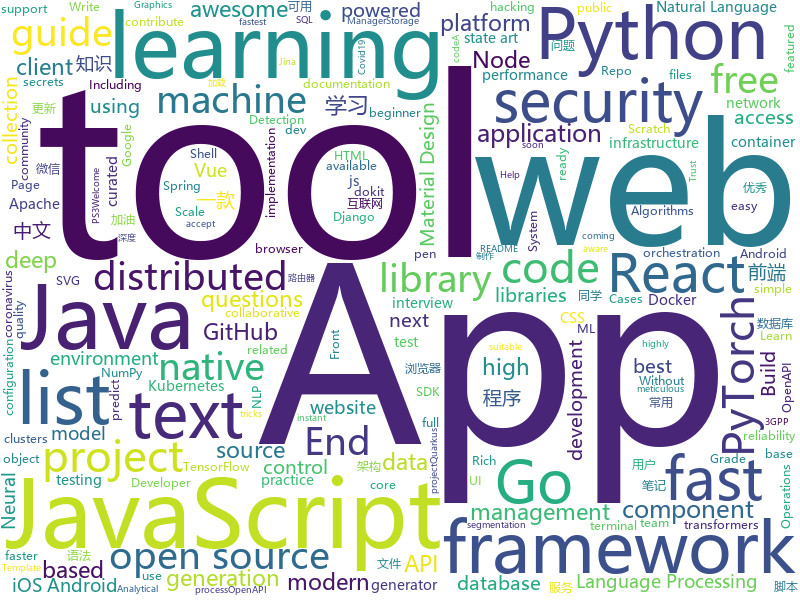

# 2020-05-29
See what the GitHub community is most excited about.

## python
+ [detr](https://github.com/facebookresearch/detr)(**773 stars today**): End-to-End Object Detection with Transformers
+ [ML-From-Scratch](https://github.com/eriklindernoren/ML-From-Scratch)(**94 stars today**): Machine Learning From Scratch. Bare bones NumPy implementations of machine learning models and algorithms with a focus on accessibility. Aims to cover everything from linear regression to deep learning.
+ [rich](https://github.com/willmcgugan/rich)(**561 stars today**): Rich is a Python library for rich text and beautiful formatting in the terminal.
+ [awesome-machine-learning](https://github.com/josephmisiti/awesome-machine-learning)(**33 stars today**): A curated list of awesome Machine Learning frameworks, libraries and software.
+ [pipenv](https://github.com/pypa/pipenv)(**18 stars today**): Python Development Workflow for Humans.
+ [GitHub-Chinese-Top-Charts](https://github.com/kon9chunkit/GitHub-Chinese-Top-Charts)(**87 stars today**): 🇨🇳GitHub中文排行榜，帮助你发现高分优秀中文项目、更高效地吸收国人的优秀经验成果；榜单每周更新一次，敬请关注！（中国加油！世界加油！）
+ [mlflow](https://github.com/mlflow/mlflow)(**13 stars today**): Open source platform for the machine learning lifecycle
+ [next_word_prediction](https://github.com/renatoviolin/next_word_prediction)(**83 stars today**): Using transformers to predict next word and predict <mask> word
+ [pytorch-lightning](https://github.com/PyTorchLightning/pytorch-lightning)(**23 stars today**): The lightweight PyTorch wrapper for ML researchers. Scale your models. Write less boilerplate
+ [fastapi](https://github.com/tiangolo/fastapi)(**77 stars today**): FastAPI framework, high performance, easy to learn, fast to code, ready for production
+ [vaex](https://github.com/vaexio/vaex)(**112 stars today**): Out-of-Core DataFrames for Python, ML, visualize and explore big tabular data at a billion rows per second🚀
+ [poetry](https://github.com/python-poetry/poetry)(**39 stars today**): Python dependency management and packaging made easy.
+ [DeepCreamPy](https://github.com/deeppomf/DeepCreamPy)(**16 stars today**): Decensoring Hentai with Deep Neural Networks
+ [detectron2](https://github.com/facebookresearch/detectron2)(**33 stars today**): Detectron2 is FAIR's next-generation platform for object detection and segmentation.
+ [dash](https://github.com/plotly/dash)(**14 stars today**): Analytical Web Apps for Python, R, Julia, and Jupyter. No JavaScript Required.
+ [helm-charts](https://github.com/elastic/helm-charts)(**5 stars today**): You know, for Kubernetes
+ [gitfiti](https://github.com/gelstudios/gitfiti)(**72 stars today**): abusing github commit history for the lulz
+ [flair](https://github.com/flairNLP/flair)(**50 stars today**): A very simple framework for state-of-the-art Natural Language Processing (NLP)
+ [transformers](https://github.com/huggingface/transformers)(**90 stars today**): 🤗Transformers: State-of-the-art Natural Language Processing for Pytorch and TensorFlow 2.0.
+ [jina](https://github.com/jina-ai/jina)(**9 stars today**): Jina is the cloud-native neural search framework powered by state-of-the-art AI and deep learning
+ [nlp](https://github.com/huggingface/nlp)(**25 stars today**): 🤗nlp: datasets and evaluation metrics for Natural Language Processing in NumPy, Pandas, PyTorch and TensorFlow
+ [Real_Time_Image_Animation](https://github.com/anandpawara/Real_Time_Image_Animation)(**269 stars today**): The Project is real time application in opencv using first order model
+ [GitHub520](https://github.com/521xueweihan/GitHub520)(**31 stars today**): 😘让你“爱”上 GitHub，解决访问时图裂、加载慢的问题。
+ [horovod](https://github.com/horovod/horovod)(**6 stars today**): Distributed training framework for TensorFlow, Keras, PyTorch, and Apache MXNet.
+ [PreSumm](https://github.com/nlpyang/PreSumm)(**6 stars today**): code for EMNLP 2019 paper Text Summarization with Pretrained Encoders

## java
+ [fastjson](https://github.com/alibaba/fastjson)(**23 stars today**): A fast JSON parser/generator for Java.
+ [advanced-java](https://github.com/doocs/advanced-java)(**49 stars today**): 😮互联网 Java 工程师进阶知识完全扫盲：涵盖高并发、分布式、高可用、微服务、海量数据处理等领域知识，后端同学必看，前端同学也可学习
+ [AarogyaSetu_Android](https://github.com/nic-delhi/AarogyaSetu_Android)(**266 stars today**): Aarogya Setu Android app native code
+ [DoraemonKit](https://github.com/didi/DoraemonKit)(**52 stars today**): A full-featured App (iOS & Android) development assistant. You deserve it. 简称 "DoKit" 。一款功能齐全的客户端（ iOS 、Android、微信小程序 ）研发助手，你值得拥有。https://www.dokit.cn/
+ [react-native-camera](https://github.com/react-native-community/react-native-camera)(**7 stars today**): A Camera component for React Native. Also supports barcode scanning!
+ [FrameworkBenchmarks](https://github.com/TechEmpower/FrameworkBenchmarks)(**14 stars today**): Source for the TechEmpower Framework Benchmarks project
+ [quarkus](https://github.com/quarkusio/quarkus)(**18 stars today**): Quarkus: Supersonic Subatomic Java.
+ [litemall](https://github.com/linlinjava/litemall)(**25 stars today**): 又一个小商城。litemall = Spring Boot后端 + Vue管理员前端 + 微信小程序用户前端 + Vue用户移动端
+ [capacitor](https://github.com/ionic-team/capacitor)(**4 stars today**): Build cross-platform Native Progressive Web Apps for iOS, Android, and the web⚡️
+ [tutorials](https://github.com/eugenp/tutorials)(**20 stars today**): Just Announced - "Learn Spring Security OAuth":
+ [mybatis](https://github.com/tuguangquan/mybatis)(**26 stars today**): mybatis源码中文注释
+ [pulsar](https://github.com/apache/pulsar)(**11 stars today**): Apache Pulsar - distributed pub-sub messaging system
+ [cwa-verification-server](https://github.com/corona-warn-app/cwa-verification-server)(**15 stars today**): Backend implementation of the verification process
+ [openapi-generator](https://github.com/OpenAPITools/openapi-generator)(**15 stars today**): OpenAPI Generator allows generation of API client libraries (SDK generation), server stubs, documentation and configuration automatically given an OpenAPI Spec (v2, v3)
+ [zfile](https://github.com/zhaojun1998/zfile)(**19 stars today**): 在线云盘
+ [commons-lang](https://github.com/apache/commons-lang)(**4 stars today**): Mirror of Apache Commons Lang
+ [pinpoint](https://github.com/naver/pinpoint)(**8 stars today**): APM, (Application Performance Management) tool for large-scale distributed systems.
+ [react-native-video](https://github.com/react-native-community/react-native-video)(**5 stars today**): A <Video /> component for react-native
+ [quarkus-quickstarts](https://github.com/quarkusio/quarkus-quickstarts)(**4 stars today**): Quarkus quickstart code
+ [lombok](https://github.com/rzwitserloot/lombok)(**7 stars today**): Very spicy additions to the Java programming language.
+ [QR-Code-generator](https://github.com/nayuki/QR-Code-generator)(**9 stars today**): High-quality QR Code generator library in Java, TypeScript/JavaScript, Python, C++, C, Rust.
+ [dbeaver](https://github.com/dbeaver/dbeaver)(**16 stars today**): Free universal database tool and SQL client
+ [Sentinel](https://github.com/alibaba/Sentinel)(**28 stars today**): A powerful flow control component enabling reliability, resilience and monitoring for microservices. (面向云原生微服务的高可用流控防护组件)
+ [zip4j](https://github.com/srikanth-lingala/zip4j)(**4 stars today**): A Java library for zip files and streams
+ [material-components-android](https://github.com/material-components/material-components-android)(**12 stars today**): Modular and customizable Material Design UI components for Android

## unknown
+ [Front-End-Checklist](https://github.com/thedaviddias/Front-End-Checklist)(**248 stars today**): 🗂The perfect Front-End Checklist for modern websites and meticulous developers
+ [introRL](https://github.com/zhoubolei/introRL)(**49 stars today**): Intro to Reinforcement Learning (强化学习纲要）
+ [WIKISTORE](https://github.com/TheWizWikii/WIKISTORE)(**5 stars today**): App/Game para PS3
+ [roadmap](https://github.com/docker/roadmap)(**12 stars today**): Welcome to the Public Roadmap for All Things Docker! We welcome your ideas.
+ [nl-covid19-notification-app-design](https://github.com/minvws/nl-covid19-notification-app-design)(**19 stars today**): Design documentatie rondom Covid19 Notificatie App
+ [computer-science](https://github.com/ossu/computer-science)(**124 stars today**): 🎓Path to a free self-taught education in Computer Science!
+ [freelancing-in-sweden](https://github.com/nabati/freelancing-in-sweden)(**19 stars today**): 
+ [OrangeJs](https://github.com/Orange-shirt/OrangeJs)(**63 stars today**): 使用Auto.js软件制作的脚本合辑
+ [COVID-19](https://github.com/CSSEGISandData/COVID-19)(**26 stars today**): Novel Coronavirus (COVID-19) Cases, provided by JHU CSSE
+ [project-based-learning](https://github.com/tuvtran/project-based-learning)(**66 stars today**): Curated list of project-based tutorials
+ [how-to-exit-vim](https://github.com/hakluke/how-to-exit-vim)(**21 stars today**): Below are some simple methods for exiting vim.
+ [cppbestpractices](https://github.com/lefticus/cppbestpractices)(**12 stars today**): Collaborative Collection of C++ Best Practices
+ [You-Dont-Know-JS](https://github.com/getify/You-Dont-Know-JS)(**101 stars today**): A book series on JavaScript. @YDKJS on twitter.
+ [covid-19-data](https://github.com/nytimes/covid-19-data)(**12 stars today**): An ongoing repository of data on coronavirus cases and deaths in the U.S.
+ [awesome-interview-questions](https://github.com/MaximAbramchuck/awesome-interview-questions)(**21 stars today**): A curated awesome list of lists of interview questions. Feel free to contribute!🎓
+ [first-contributions](https://github.com/firstcontributions/first-contributions)(**16 stars today**): 🚀✨Help beginners to contribute to open source projects
+ [PyTorchTricks](https://github.com/lartpang/PyTorchTricks)(**34 stars today**): Some tricks of pytorch...⭐
+ [OpenAPI-Specification](https://github.com/OAI/OpenAPI-Specification)(**14 stars today**): The OpenAPI Specification Repository
+ [heroicons](https://github.com/refactoringui/heroicons)(**24 stars today**): A set of free MIT-licensed high-quality SVG icons for UI development.
+ [README](https://github.com/guodongxiaren/README)(**7 stars today**): README文件语法解读，即Github Flavored Markdown语法介绍
+ [technology-talk](https://github.com/aalansehaiyang/technology-talk)(**9 stars today**): 汇总java生态圈常用技术框架、开源中间件，系统架构、数据库、大公司架构案例、常用三方类库、项目管理、线上问题排查、个人成长、思考等知识
+ [Specs](https://github.com/CocoaPods/Specs)(**2 stars today**): The CocoaPods Master Repo
+ [hacker-roadmap](https://github.com/sundowndev/hacker-roadmap)(**8 stars today**): 📌Your beginner pen-testing start guide. A guide for amateur pen testers and a collection of hacking tools, resources and references to practice ethical hacking and web security.
+ [risk-management-note](https://github.com/WalterInSH/risk-management-note)(**14 stars today**): 🧯风险控制笔记，适用于互联网企业

## javascript
+ [tailblocks](https://github.com/mertJF/tailblocks)(**512 stars today**): 🎉Ready-to-use Tailwind CSS blocks.
+ [create-snowpack-app](https://github.com/pikapkg/create-snowpack-app)(**59 stars today**): CSA - Get started with the fastest dev environment available.
+ [realworld](https://github.com/gothinkster/realworld)(**290 stars today**): "The mother of all demo apps" — Exemplary fullstack Medium.com clone powered by React, Angular, Node, Django, and many more🏅
+ [nodebestpractices](https://github.com/goldbergyoni/nodebestpractices)(**290 stars today**): ✅The Node.js best practices list (May 2020)
+ [javascript-algorithms](https://github.com/trekhleb/javascript-algorithms)(**311 stars today**): 📝Algorithms and data structures implemented in JavaScript with explanations and links to further readings
+ [javascript](https://github.com/airbnb/javascript)(**203 stars today**): JavaScript Style Guide
+ [snowpack](https://github.com/pikapkg/snowpack)(**374 stars today**): ☶ A faster dev environment for modern web apps.
+ [pose-animator](https://github.com/yemount/pose-animator)(**218 stars today**): 
+ [supabase](https://github.com/supabase/supabase)(**256 stars today**): Website, docs, and client libraries. Follow to stay updated about our public Beta.
+ [puppeteer](https://github.com/puppeteer/puppeteer)(**45 stars today**): Headless Chrome Node.js API
+ [vuepress](https://github.com/vuejs/vuepress)(**19 stars today**): 📝Minimalistic Vue-powered static site generator
+ [reactjs-interview-questions](https://github.com/sudheerj/reactjs-interview-questions)(**27 stars today**): List of top 500 ReactJS Interview Questions & Answers....Coding exercise questions are coming soon!!
+ [gatsby](https://github.com/gatsbyjs/gatsby)(**43 stars today**): Build blazing fast, modern apps and websites with React
+ [sweater](https://github.com/zarkin404/sweater)(**272 stars today**): 薅🐑毛，做衬衫（最近更新：京东 618 叠蛋糕脚本，非模拟点击，PC 浏览器可运行）
+ [AudioMass](https://github.com/pkalogiros/AudioMass)(**402 stars today**): Free full-featured web-based audio & waveform editing tool
+ [aws-sdk-js](https://github.com/aws/aws-sdk-js)(**8 stars today**): AWS SDK for JavaScript in the browser and Node.js
+ [opencti](https://github.com/OpenCTI-Platform/opencti)(**10 stars today**): Open Cyber Threat Intelligence Platform
+ [google-meet-grid-view](https://github.com/Fugiman/google-meet-grid-view)(**10 stars today**): Userscript to offer a grid-view layout in Google Meets
+ [didact](https://github.com/pomber/didact)(**33 stars today**): A DIY guide to build your own React
+ [htmx](https://github.com/bigskysoftware/htmx)(**377 stars today**): </> htmx - high power tools for HTML
+ [graphql-engine](https://github.com/hasura/graphql-engine)(**25 stars today**): Blazing fast, instant realtime GraphQL APIs on Postgres with fine grained access control, also trigger webhooks on database events.
+ [moment](https://github.com/moment/moment)(**10 stars today**): Parse, validate, manipulate, and display dates in javascript.
+ [svelte](https://github.com/sveltejs/svelte)(**43 stars today**): Cybernetically enhanced web apps
+ [CRUD](https://github.com/Laravel-Backpack/CRUD)(**5 stars today**): Build custom admin panels. Fast!
+ [stegcloak](https://github.com/KuroLabs/stegcloak)(**45 stars today**): Hide secrets with invisible characters in plain text securely using passwords 🧙🏻‍♂️⭐

## html
+ [awesome-compose](https://github.com/docker/awesome-compose)(**58 stars today**): Awesome Docker Compose samples
+ [nndl.github.io](https://github.com/nndl/nndl.github.io)(**26 stars today**): 《神经网络与深度学习》 邱锡鹏著 Neural Network and Deep Learning
+ [hospitalmanagement](https://github.com/sumitkumar1503/hospitalmanagement)(**6 stars today**): Hospital Management System || Python Django
+ [hexo-theme-fluid](https://github.com/fluid-dev/hexo-theme-fluid)(**8 stars today**): 🌊一款 Material Design 风格的 Hexo 主题 / An elegant Material-Design theme for Hexo
+ [www-community](https://github.com/OWASP/www-community)(**2 stars today**): OWASP Community Pages are a place where OWASP can accept community contributions for security-related content.
+ [webdevbootcamp](https://github.com/nax3t/webdevbootcamp)(**11 stars today**): All source code for back-end projects from the Web Developer Bootcamp
+ [MIXBOX](https://github.com/monlor/MIXBOX)(**6 stars today**): 一款基于Shell的小米路由器工具箱，原为Monlor-Tools，A tool box for XiaoMi Router base on Shell.
+ [pdf2htmlEX](https://github.com/coolwanglu/pdf2htmlEX)(**4 stars today**): Convert PDF to HTML without losing text or format.
+ [django-DefectDojo](https://github.com/DefectDojo/django-DefectDojo)(**6 stars today**): DefectDojo is an open-source application vulnerability correlation and security orchestration tool.
+ [web-dev-starter](https://github.com/pluralsight/web-dev-starter)(**1 stars today**): 
+ [ML-notes](https://github.com/Sakura-gh/ML-notes)(**9 stars today**): notes about machine learning
+ [calico](https://github.com/projectcalico/calico)(**3 stars today**): Cloud native networking and network security
+ [crx-selection-translate](https://github.com/lmk123/crx-selection-translate)(**5 stars today**): 让浏览任意语言的网站变得无比轻松的浏览器扩展程序。
+ [msteams-docs](https://github.com/MicrosoftDocs/msteams-docs)(**0 stars today**): Source for the Microsoft Teams developer platform documentation.
+ [Front-end-Developer-Interview-Questions](https://github.com/h5bp/Front-end-Developer-Interview-Questions)(**21 stars today**): A list of helpful front-end related questions you can use to interview potential candidates, test yourself or completely ignore.
+ [awesome-piracy](https://github.com/Igglybuff/awesome-piracy)(**24 stars today**): A curated list of awesome warez and piracy links
+ [aws-eks-best-practices](https://github.com/aws/aws-eks-best-practices)(**10 stars today**): A best practices guide for day 2 operations, including operational excellence, security, reliability, performance efficiency, and cost optimization.
+ [wysiwyg-editor](https://github.com/froala/wysiwyg-editor)(**3 stars today**): The next generation Javascript WYSIWYG HTML Editor.
+ [flag-icon-css](https://github.com/lipis/flag-icon-css)(**4 stars today**): 🎏A collection of all country flags in SVG — plus the CSS for easier integration
+ [import-maps](https://github.com/WICG/import-maps)(**5 stars today**): How to control the behavior of JavaScript imports
+ [Coursera-ML-AndrewNg-Notes](https://github.com/fengdu78/Coursera-ML-AndrewNg-Notes)(**20 stars today**): 吴恩达老师的机器学习课程个人笔记
+ [fastText](https://github.com/facebookresearch/fastText)(**9 stars today**): Library for fast text representation and classification.
+ [login-page-css](https://github.com/mazipan/login-page-css)(**5 stars today**): 🔐An Open Source Template for Login Page From Scratch Without Any CSS Framework
+ [hack](https://github.com/ddosi/hack)(**4 stars today**): 🔰渗透测试资源库🔰黑客工具🔰维基解密文件🔰木马免杀🔰信息安全🔰技能树🔰数据库泄露🔰
+ [Graphics](https://github.com/Unity-Technologies/Graphics)(**3 stars today**): Unity Graphics - Including Scriptable Render Pipeline

## go
+ [cli](https://github.com/cli/cli)(**91 stars today**): GitHub’s official command line tool
+ [micro](https://github.com/zyedidia/micro)(**323 stars today**): A modern and intuitive terminal-based text editor
+ [terraform](https://github.com/hashicorp/terraform)(**17 stars today**): Terraform enables you to safely and predictably create, change, and improve infrastructure. It is an open source tool that codifies APIs into declarative configuration files that can be shared amongst team members, treated as code, edited, reviewed, and versioned.
+ [protobuf](https://github.com/golang/protobuf)(**9 stars today**): Go support for Google's protocol buffers
+ [consul](https://github.com/hashicorp/consul)(**23 stars today**): Consul is a distributed, highly available, and data center aware solution to connect and configure applications across dynamic, distributed infrastructure.
+ [moby](https://github.com/moby/moby)(**12 stars today**): Moby Project - a collaborative project for the container ecosystem to assemble container-based systems
+ [kops](https://github.com/kubernetes/kops)(**7 stars today**): Kubernetes Operations (kops) - Production Grade K8s Installation, Upgrades, and Management
+ [helm](https://github.com/helm/helm)(**12 stars today**): The Kubernetes Package Manager
+ [rook](https://github.com/rook/rook)(**6 stars today**): Storage Orchestration for Kubernetes
+ [autoscaler](https://github.com/kubernetes/autoscaler)(**8 stars today**): Autoscaling components for Kubernetes
+ [free5gc](https://github.com/free5gc/free5gc)(**52 stars today**): Open source 5G core network base on 3GPP R15
+ [client-go](https://github.com/kubernetes/client-go)(**10 stars today**): Go client for Kubernetes.
+ [kubectx](https://github.com/ahmetb/kubectx)(**12 stars today**): Faster way to switch between clusters and namespaces in kubectl
+ [jx](https://github.com/jenkins-x/jx)(**6 stars today**): Jenkins X provides automated CI+CD for Kubernetes with Preview Environments on Pull Requests using Tekton, Knative, Prow, Skaffold and Helm
+ [elastic](https://github.com/olivere/elastic)(**7 stars today**): Elasticsearch client for Go.
+ [goconvey](https://github.com/smartystreets/goconvey)(**6 stars today**): Go testing in the browser. Integrates with `go test`. Write behavioral tests in Go.
+ [enhancements](https://github.com/kubernetes/enhancements)(**2 stars today**): Enhancements tracking repo for Kubernetes
+ [sqlx](https://github.com/jmoiron/sqlx)(**11 stars today**): general purpose extensions to golang's database/sql
+ [kubernetes](https://github.com/kubernetes/kubernetes)(**66 stars today**): Production-Grade Container Scheduling and Management
+ [kind](https://github.com/kubernetes-sigs/kind)(**8 stars today**): Kubernetes IN Docker - local clusters for testing Kubernetes
+ [go-cache](https://github.com/patrickmn/go-cache)(**4 stars today**): An in-memory key:value store/cache (similar to Memcached) library for Go, suitable for single-machine applications.
+ [ingress-nginx](https://github.com/kubernetes/ingress-nginx)(**10 stars today**): NGINX Ingress Controller for Kubernetes
+ [vault](https://github.com/hashicorp/vault)(**14 stars today**): A tool for secrets management, encryption as a service, and privileged access management
+ [teleport](https://github.com/gravitational/teleport)(**8 stars today**): Zero Trust Access to Infrastructure and Applications
+ [alertmanager](https://github.com/prometheus/alertmanager)(**4 stars today**): Prometheus Alertmanager

## WordCloud

