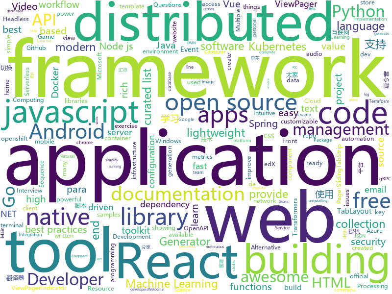

# 2020-05-30
See what the GitHub community is most excited about.

## python
+ [returns](https://github.com/dry-python/returns)(**68 stars today**): Make your functions return something meaningful, typed, and safe!
+ [rich](https://github.com/willmcgugan/rich)(**558 stars today**): Rich is a Python library for rich text and beautiful formatting in the terminal.
+ [prefect](https://github.com/PrefectHQ/prefect)(**16 stars today**): The Prefect workflow platform
+ [detr](https://github.com/facebookresearch/detr)(**629 stars today**): End-to-End Object Detection with Transformers
+ [pytube](https://github.com/nficano/pytube)(**11 stars today**): 🎞A lightweight, dependency-free Python library (and command-line utility) for downloading YouTube Videos.
+ [fastapi](https://github.com/tiangolo/fastapi)(**56 stars today**): FastAPI framework, high performance, easy to learn, fast to code, ready for production
+ [poetry](https://github.com/python-poetry/poetry)(**26 stars today**): Python dependency management and packaging made easy.
+ [ML-From-Scratch](https://github.com/eriklindernoren/ML-From-Scratch)(**87 stars today**): Machine Learning From Scratch. Bare bones NumPy implementations of machine learning models and algorithms with a focus on accessibility. Aims to cover everything from linear regression to deep learning.
+ [Dango-Translator](https://github.com/PantsuDango/Dango-Translator)(**36 stars today**): 团子翻译器 —— 个人兴趣制作的一款基于OCR技术的翻译器
+ [botframework-sdk](https://github.com/microsoft/botframework-sdk)(**6 stars today**): Bot Framework provides the most comprehensive experience for building conversation applications.
+ [erpnext](https://github.com/frappe/erpnext)(**9 stars today**): Open Source Alternative to SAP
+ [PyDebloatX](https://github.com/Teraskull/PyDebloatX)(**56 stars today**): Python GUI for uninstalling the default Windows 10 apps.
+ [edx-platform](https://github.com/edx/edx-platform)(**6 stars today**): The Open edX platform, the software that powers edX!
+ [scikit-learn](https://github.com/scikit-learn/scikit-learn)(**21 stars today**): scikit-learn: machine learning in Python
+ [DeepFaceLab](https://github.com/iperov/DeepFaceLab)(**29 stars today**): DeepFaceLab is the leading software for creating deepfakes.
+ [pipenv](https://github.com/pypa/pipenv)(**21 stars today**): Python Development Workflow for Humans.
+ [transformers](https://github.com/huggingface/transformers)(**101 stars today**): 🤗Transformers: State-of-the-art Natural Language Processing for Pytorch and TensorFlow 2.0.
+ [fairseq](https://github.com/pytorch/fairseq)(**20 stars today**): Facebook AI Research Sequence-to-Sequence Toolkit written in Python.
+ [AutoRCCar](https://github.com/hamuchiwa/AutoRCCar)(**8 stars today**): OpenCV Python Neural Network Autonomous RC Car
+ [GitHub520](https://github.com/521xueweihan/GitHub520)(**38 stars today**): 😘让你“爱”上 GitHub，解决访问时图裂、加载慢的问题。
+ [locust](https://github.com/locustio/locust)(**15 stars today**): Scalable user load testing tool written in Python
+ [CheatSheetSeries](https://github.com/OWASP/CheatSheetSeries)(**12 stars today**): The OWASP Cheat Sheet Series was created to provide a concise collection of high value information on specific application security topics.
+ [SegLoss](https://github.com/JunMa11/SegLoss)(**13 stars today**): A collection of loss functions for medical image segmentation
+ [RPA-Python](https://github.com/tebelorg/RPA-Python)(**6 stars today**): Python package for RPA (robotic process automation)
+ [awesome-machine-learning](https://github.com/josephmisiti/awesome-machine-learning)(**34 stars today**): A curated list of awesome Machine Learning frameworks, libraries and software.

## java
+ [fastjson](https://github.com/alibaba/fastjson)(**69 stars today**): A fast JSON parser/generator for Java.
+ [NewPipe](https://github.com/TeamNewPipe/NewPipe)(**29 stars today**): A libre lightweight streaming front-end for Android.
+ [Auto.js](https://github.com/hyb1996/Auto.js)(**52 stars today**): A UiAutomator on android, does not need root access(安卓平台上的JavaScript自动化工具)
+ [spring-cloud-aws](https://github.com/spring-cloud/spring-cloud-aws)(**5 stars today**): Integration for Amazon Web Services APIs with Spring
+ [camunda-bpm-platform](https://github.com/camunda/camunda-bpm-platform)(**4 stars today**): Flexible framework for workflow and decision automation with BPMN and DMN. Integration with Spring, Spring Boot, CDI.
+ [elasticsearch](https://github.com/elastic/elasticsearch)(**29 stars today**): Open Source, Distributed, RESTful Search Engine
+ [react-native-video](https://github.com/react-native-community/react-native-video)(**7 stars today**): A <Video /> component for react-native
+ [pulsar](https://github.com/apache/pulsar)(**7 stars today**): Apache Pulsar - distributed pub-sub messaging system
+ [flink](https://github.com/apache/flink)(**25 stars today**): Apache Flink
+ [tutorials](https://github.com/eugenp/tutorials)(**27 stars today**): Just Announced - "Learn Spring Security OAuth":
+ [FrameworkBenchmarks](https://github.com/TechEmpower/FrameworkBenchmarks)(**15 stars today**): Source for the TechEmpower Framework Benchmarks project
+ [mybatis-plus](https://github.com/baomidou/mybatis-plus)(**18 stars today**): An powerful enhanced toolkit of MyBatis for simplify development
+ [PictureSelector](https://github.com/LuckSiege/PictureSelector)(**14 stars today**): Picture Selector Library for Android or 图片选择器
+ [xxl-job](https://github.com/xuxueli/xxl-job)(**25 stars today**): A distributed task scheduling framework.（分布式任务调度平台XXL-JOB）
+ [BigData-Notes](https://github.com/heibaiying/BigData-Notes)(**19 stars today**): 大数据入门指南⭐
+ [zipkin](https://github.com/openzipkin/zipkin)(**8 stars today**): Zipkin is a distributed tracing system
+ [Mindustry](https://github.com/Anuken/Mindustry)(**12 stars today**): A sandbox tower defense game
+ [debezium](https://github.com/debezium/debezium)(**6 stars today**): Change data capture for a variety of databases. Please log issues at https://issues.redhat.com/browse/DBZ.
+ [micrometer](https://github.com/micrometer-metrics/micrometer)(**3 stars today**): An application metrics facade for the most popular monitoring tools. Think SLF4J, but for metrics.
+ [react-native-track-player](https://github.com/react-native-kit/react-native-track-player)(**6 stars today**): A fully fledged audio module created for music apps. Provides audio playback, external media controls, chromecast support, background mode and more!
+ [jmx_exporter](https://github.com/prometheus/jmx_exporter)(**2 stars today**): A process for exposing JMX Beans via HTTP for Prometheus consumption
+ [openapi-generator](https://github.com/OpenAPITools/openapi-generator)(**17 stars today**): OpenAPI Generator allows generation of API client libraries (SDK generation), server stubs, documentation and configuration automatically given an OpenAPI Spec (v2, v3)
+ [animation-samples](https://github.com/android/animation-samples)(**9 stars today**): Multiple samples showing the best practices in animation on Android.
+ [MagicIndicator](https://github.com/hackware1993/MagicIndicator)(**8 stars today**): A powerful, customizable and extensible ViewPager indicator framework. As the best alternative of ViewPagerIndicator, TabLayout and PagerSlidingTabStrip —— 强大、可定制、易扩展的 ViewPager 指示器框架。是ViewPagerIndicator、TabLayout、PagerSlidingTabStrip的最佳替代品。支持角标，更支持在非ViewPager场景下使用（使用hide()、show()切换Fragment或使用setVisibility切换FrameLayout里的View等），http://www.jianshu…
+ [views-widgets-samples](https://github.com/android/views-widgets-samples)(**10 stars today**): Multiple samples showing the best practices in views-widgets on Android.

## unknown
+ [Lab-Demo-Recordings](https://github.com/MicrosoftLearning/Lab-Demo-Recordings)(**15 stars today**): Recordings and Demos of Labs
+ [computer-science](https://github.com/ossu/computer-science)(**116 stars today**): 🎓Path to a free self-taught education in Computer Science!
+ [awesome-pipeline](https://github.com/pditommaso/awesome-pipeline)(**83 stars today**): A curated list of awesome pipeline toolkits inspired by Awesome Sysadmin
+ [CSSummerCamp2020](https://github.com/hcy226/CSSummerCamp2020)(**11 stars today**): 关于2020年CS保研夏令营的汇总。欢迎大家分享夏令营信息，资瓷一下互联网精神吼不吼啊？
+ [COVID-19](https://github.com/pcm-dpc/COVID-19)(**4 stars today**): COVID-19 Italia - Monitoraggio situazione
+ [nl-covid19-notification-app-coordination](https://github.com/minvws/nl-covid19-notification-app-coordination)(**6 stars today**): Documentation around Covid19 Notification App
+ [cwa-documentation](https://github.com/corona-warn-app/cwa-documentation)(**37 stars today**): Project overview, general documentation, and white papers.
+ [vagas](https://github.com/backend-br/vagas)(**7 stars today**): ✌️Espaço para divulgação de vagas para backenders
+ [app-ideas](https://github.com/florinpop17/app-ideas)(**130 stars today**): A Collection of application ideas which can be used to improve your coding skills.
+ [p1xt-guides](https://github.com/P1xt/p1xt-guides)(**29 stars today**): Programming curricula
+ [Front-End-Checklist](https://github.com/thedaviddias/Front-End-Checklist)(**214 stars today**): 🗂The perfect Front-End Checklist for modern websites and meticulous developers
+ [roadmap](https://github.com/docker/roadmap)(**6 stars today**): Welcome to the Public Roadmap for All Things Docker! We welcome your ideas.
+ [laravel-best-practices](https://github.com/alexeymezenin/laravel-best-practices)(**9 stars today**): Laravel best practices
+ [siber-guvenlik-sss](https://github.com/LuNiZz/siber-guvenlik-sss)(**5 stars today**): SSS sorulari burada...
+ [TeachYourselfCS-CN](https://github.com/keithnull/TeachYourselfCS-CN)(**26 stars today**): TeachYourselfCS 的中文翻译 | A Chinese translation of TeachYourselfCS
+ [introRL](https://github.com/zhoubolei/introRL)(**49 stars today**): Intro to Reinforcement Learning (强化学习纲要）
+ [CKAD-exercises](https://github.com/dgkanatsios/CKAD-exercises)(**10 stars today**): A set of exercises to prepare for Certified Kubernetes Application Developer exam by Cloud Native Computing Foundation
+ [crash-course-CRM](https://github.com/divanov11/crash-course-CRM)(**2 stars today**): Django customer management platform
+ [angular-interview-questions](https://github.com/sudheerj/angular-interview-questions)(**4 stars today**): List of 300 Angular Interview Questions and answers
+ [Flutter-Course-Resources](https://github.com/londonappbrewery/Flutter-Course-Resources)(**19 stars today**): Learn to Code While Building Apps - The Complete Flutter Development Bootcamp
+ [CodeGuide](https://github.com/fuzhengwei/CodeGuide)(**21 stars today**): 📚本代码库是作者小傅哥多年从事一线互联网 Java 开发的学习历程技术汇总，旨在为大家提供一个清晰详细的学习教程，侧重点更倾向编写Java核心内容。如果本仓库能为您提供帮助，请给予支持(关注、点赞、分享)！
+ [Awesome](https://github.com/Awesome-Windows/Awesome)(**12 stars today**): 💻🎉An awesome & curated list of best applications and tools for Windows.
+ [awesome-react](https://github.com/enaqx/awesome-react)(**19 stars today**): A collection of awesome things regarding React ecosystem
+ [WIKISTORE](https://github.com/TheWizWikii/WIKISTORE)(**5 stars today**): App/Game para PS3
+ [awesome-nlp](https://github.com/keon/awesome-nlp)(**9 stars today**): 📖A curated list of resources dedicated to Natural Language Processing (NLP)

## javascript
+ [pose-animator](https://github.com/yemount/pose-animator)(**242 stars today**): 
+ [react-native-reanimated](https://github.com/software-mansion/react-native-reanimated)(**53 stars today**): React Native's Animated library reimplemented
+ [tailblocks](https://github.com/mertJF/tailblocks)(**447 stars today**): 🎉Ready-to-use Tailwind CSS blocks.
+ [htmx](https://github.com/bigskysoftware/htmx)(**206 stars today**): </> htmx - high power tools for HTML
+ [taobaoVisitingVenues](https://github.com/sleepybear1113/taobaoVisitingVenues)(**41 stars today**): 京东/淘宝的自动浏览逛店脚本
+ [snowpack](https://github.com/pikapkg/snowpack)(**276 stars today**): ☶ A faster dev environment for modern web apps.
+ [react-native](https://github.com/facebook/react-native)(**47 stars today**): A framework for building native apps with React.
+ [fullstack-course4](https://github.com/jhu-ep-coursera/fullstack-course4)(**16 stars today**): Example code for HTML, CSS, and Javascript for Web Developers Coursera Course
+ [sweater](https://github.com/zarkin404/sweater)(**156 stars today**): 薅🐑毛，做衬衫（最近更新：京东 618 叠蛋糕脚本，非模拟点击，PC 浏览器可运行）
+ [nodebestpractices](https://github.com/goldbergyoni/nodebestpractices)(**217 stars today**): ✅The Node.js best practices list (May 2020)
+ [puppeteer](https://github.com/puppeteer/puppeteer)(**47 stars today**): Headless Chrome Node.js API
+ [moment](https://github.com/moment/moment)(**13 stars today**): Parse, validate, manipulate, and display dates in javascript.
+ [parcel](https://github.com/parcel-bundler/parcel)(**14 stars today**): 📦🚀Blazing fast, zero configuration web application bundler
+ [nuxt.js](https://github.com/nuxt/nuxt.js)(**31 stars today**): The Intuitive Vue Framework
+ [umi](https://github.com/umijs/umi)(**19 stars today**): 🌋Pluggable enterprise-level react application framework.
+ [slate](https://github.com/ianstormtaylor/slate)(**18 stars today**): A completely customizable framework for building rich text editors. (Currently in beta.)
+ [curso-javascript-ninja](https://github.com/da2k/curso-javascript-ninja)(**6 stars today**): Curso Javascript Ninja
+ [react-redux-realworld-example-app](https://github.com/gothinkster/react-redux-realworld-example-app)(**13 stars today**): Exemplary real world application built with React + Redux
+ [vue](https://github.com/vuejs/vue)(**103 stars today**): 🖖Vue.js is a progressive, incrementally-adoptable JavaScript framework for building UI on the web.
+ [thegreatsuspender](https://github.com/greatsuspender/thegreatsuspender)(**38 stars today**): A chrome extension for suspending all tabs to free up memory
+ [trilium](https://github.com/zadam/trilium)(**280 stars today**): Build your personal knowledge base with Trilium Notes
+ [create-snowpack-app](https://github.com/pikapkg/create-snowpack-app)(**57 stars today**): CSA - Get started with the fastest dev environment available.
+ [strapi](https://github.com/strapi/strapi)(**99 stars today**): 🚀Open source Node.js Headless CMS to easily build customisable APIs
+ [foliate](https://github.com/johnfactotum/foliate)(**55 stars today**): A simple and modern GTK eBook reader
+ [serverless](https://github.com/serverless/serverless)(**13 stars today**): ⚡Serverless Framework – Build web, mobile and IoT applications with serverless architectures using AWS Lambda, Azure Functions, Google CloudFunctions & more! –

## html
+ [web-moderno](https://github.com/cod3rcursos/web-moderno)(**6 stars today**): 
+ [REKCARC-TSC-UHT](https://github.com/PKUanonym/REKCARC-TSC-UHT)(**39 stars today**): 清华大学计算机系课程攻略 Guidance for courses in Department of Computer Science and Technology, Tsinghua University
+ [node-ytdl-core](https://github.com/fent/node-ytdl-core)(**5 stars today**): YouTube video downloader in javascript.
+ [calico](https://github.com/projectcalico/calico)(**4 stars today**): Cloud native networking and network security
+ [v-calendar](https://github.com/nathanreyes/v-calendar)(**3 stars today**): A lightweight, dependency-free plugin for building attributed calendars in Vue.js
+ [swagger-codegen](https://github.com/swagger-api/swagger-codegen)(**11 stars today**): swagger-codegen contains a template-driven engine to generate documentation, API clients and server stubs in different languages by parsing your OpenAPI / Swagger definition.
+ [personal-website](https://github.com/github/personal-website)(**6 stars today**): Code that'll help you kickstart a personal website that showcases your work as a software developer.
+ [portainer](https://github.com/portainer/portainer)(**21 stars today**): Making Docker management easy.
+ [msteams-docs](https://github.com/MicrosoftDocs/msteams-docs)(**0 stars today**): Source for the Microsoft Teams developer platform documentation.
+ [AR.js](https://github.com/jeromeetienne/AR.js)(**3 stars today**): Efficient Augmented Reality for the Web - 60fps on mobile!
+ [styleguide](https://github.com/google/styleguide)(**20 stars today**): Style guides for Google-originated open-source projects
+ [dotnet](https://github.com/microsoft/dotnet)(**7 stars today**): This repo is the official home of .NET on GitHub. It's a great starting point to find many .NET OSS projects from Microsoft and the community, including many that are part of the .NET Foundation.
+ [webdevbootcamp](https://github.com/nax3t/webdevbootcamp)(**6 stars today**): All source code for back-end projects from the Web Developer Bootcamp
+ [book-extra-content](https://github.com/securitum/book-extra-content)(**7 stars today**): 
+ [responsive-html-email-template](https://github.com/leemunroe/responsive-html-email-template)(**8 stars today**): A free simple responsive HTML email template
+ [email-templates](https://github.com/ColorlibHQ/email-templates)(**0 stars today**): Free HTML email templates for Mailchimp and other emails services
+ [django-DefectDojo](https://github.com/DefectDojo/django-DefectDojo)(**5 stars today**): DefectDojo is an open-source application vulnerability correlation and security orchestration tool.
+ [ru.javascript.info](https://github.com/javascript-tutorial/ru.javascript.info)(**4 stars today**): Современный учебник JavaScript
+ [dragon-book-exercise-answers](https://github.com/fool2fish/dragon-book-exercise-answers)(**6 stars today**): Compilers Principles, Techniques, & Tools (purple dragon book) second edition exercise answers. 编译原理（紫龙书）第2版习题答案。
+ [openwrt-packages](https://github.com/kenzok8/openwrt-packages)(**9 stars today**): openwet常用软件包
+ [geektime-ELK](https://github.com/onebirdrocks/geektime-ELK)(**4 stars today**): ELK Training
+ [html-css](https://github.com/gustavoguanabara/html-css)(**5 stars today**): Curso de HTML5 e CSS3
+ [school-management-system](https://github.com/hrshadhin/school-management-system)(**0 stars today**): Another School Management System
+ [apidoc](https://github.com/apidoc/apidoc)(**9 stars today**): RESTful web API Documentation Generator.
+ [raytracing.github.io](https://github.com/RayTracing/raytracing.github.io)(**5 stars today**): Main Repo / Main Web Site

## go
+ [go-interview](https://github.com/shomali11/go-interview)(**112 stars today**): Collection of Technical Interview Questions solved with Go
+ [micro](https://github.com/zyedidia/micro)(**211 stars today**): A modern and intuitive terminal-based text editor
+ [cli](https://github.com/cli/cli)(**116 stars today**): GitHub’s official command line tool
+ [trojan](https://github.com/Jrohy/trojan)(**25 stars today**): trojan多用户管理部署程序, 支持web页面管理
+ [atlantis](https://github.com/runatlantis/atlantis)(**7 stars today**): Terraform Pull Request Automation
+ [go](https://github.com/golang/go)(**44 stars today**): The Go programming language
+ [consul](https://github.com/hashicorp/consul)(**22 stars today**): Consul is a distributed, highly available, and data center aware solution to connect and configure applications across dynamic, distributed infrastructure.
+ [nakama](https://github.com/heroiclabs/nakama)(**25 stars today**): Distributed server for social and realtime games and apps.
+ [origin](https://github.com/openshift/origin)(**3 stars today**): Images for OpenShift 3 and 4 - see openshift/okd for more
+ [distribution](https://github.com/docker/distribution)(**2 stars today**): The Docker toolset to pack, ship, store, and deliver content
+ [openyurt](https://github.com/alibaba/openyurt)(**175 stars today**): OpenYurt - Extending your native Kubernetes to edge
+ [kubeedge](https://github.com/kubeedge/kubeedge)(**7 stars today**): Kubernetes Native Edge Computing Framework (project under CNCF)
+ [terraform-provider-azurerm](https://github.com/terraform-providers/terraform-provider-azurerm)(**6 stars today**): Terraform provider for Azure Resource Manager
+ [terraform](https://github.com/hashicorp/terraform)(**22 stars today**): Terraform enables you to safely and predictably create, change, and improve infrastructure. It is an open source tool that codifies APIs into declarative configuration files that can be shared amongst team members, treated as code, edited, reviewed, and versioned.
+ [grpc-go](https://github.com/grpc/grpc-go)(**11 stars today**): The Go language implementation of gRPC. HTTP/2 based RPC
+ [gopherdance](https://github.com/80at8/gopherdance)(**19 stars today**): some dancing gophers in your terminal
+ [opentelemetry-collector](https://github.com/open-telemetry/opentelemetry-collector)(**5 stars today**): OpenTelemetry Service
+ [go-cache](https://github.com/patrickmn/go-cache)(**8 stars today**): An in-memory key:value store/cache (similar to Memcached) library for Go, suitable for single-machine applications.
+ [keda](https://github.com/kedacore/keda)(**9 stars today**): KEDA is a Kubernetes-based Event Driven Autoscaling component. It provides event driven scale for any container running in Kubernetes
+ [beats](https://github.com/elastic/beats)(**2 stars today**): 🐠Beats - Lightweight shippers for Elasticsearch & Logstash
+ [govalidator](https://github.com/asaskevich/govalidator)(**6 stars today**): [Go] Package of validators and sanitizers for strings, numerics, slices and structs
+ [grpc-gateway](https://github.com/grpc-ecosystem/grpc-gateway)(**12 stars today**): gRPC to JSON proxy generator following the gRPC HTTP spec
+ [vault](https://github.com/hashicorp/vault)(**10 stars today**): A tool for secrets management, encryption as a service, and privileged access management
+ [bolt](https://github.com/boltdb/bolt)(**7 stars today**): An embedded key/value database for Go.
+ [libpod](https://github.com/containers/libpod)(**15 stars today**): libpod is a library used to create container pods. Home of Podman.

## WordCloud

