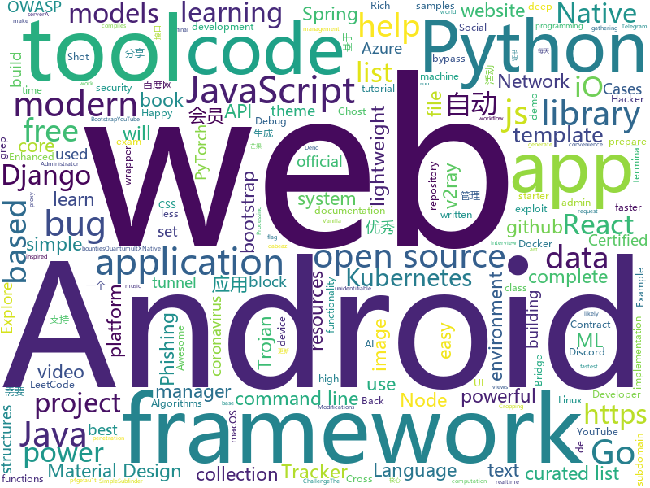

# 2020-05-31
See what the GitHub community is most excited about.

## python
+ [practical-python](https://github.com/dabeaz-course/practical-python)(**621 stars today**): Practical Python Programming (course by @dabeaz)
+ [snakeware](https://github.com/joshiemoore/snakeware)(**127 stars today**): A free Linux distro with a fully Python userspace
+ [prefect](https://github.com/PrefectHQ/prefect)(**67 stars today**): A modern data workflow platform
+ [vaex](https://github.com/vaexio/vaex)(**94 stars today**): Out-of-Core DataFrames for Python, ML, visualize and explore big tabular data at a billion rows per second🚀
+ [d2l-en](https://github.com/d2l-ai/d2l-en)(**23 stars today**): An interactive deep learning book with code, math, and discussions.
+ [rich](https://github.com/willmcgugan/rich)(**359 stars today**): Rich is a Python library for rich text and beautiful formatting in the terminal.
+ [transformers](https://github.com/huggingface/transformers)(**62 stars today**): 🤗Transformers: State-of-the-art Natural Language Processing for Pytorch and TensorFlow 2.0.
+ [wfuzz](https://github.com/xmendez/wfuzz)(**5 stars today**): Web application fuzzer
+ [freqtrade](https://github.com/freqtrade/freqtrade)(**12 stars today**): Free, open source crypto trading bot
+ [django](https://github.com/django/django)(**54 stars today**): The Web framework for perfectionists with deadlines.
+ [scikit-learn](https://github.com/scikit-learn/scikit-learn)(**23 stars today**): scikit-learn: machine learning in Python
+ [mlfinlab](https://github.com/hudson-and-thames/mlfinlab)(**12 stars today**): MlFinlab helps portfolio managers and traders who want to leverage the power of machine learning by providing reproducible, interpretable, and easy to use tools.
+ [django-rest-framework](https://github.com/encode/django-rest-framework)(**35 stars today**): Web APIs for Django.🎸
+ [newbee](https://github.com/yuedashen88/newbee)(**31 stars today**): 这是一个基于 Django 自动生成 增删改查数据库操作 http接口 的库，你仅仅需要在models中进行配置，就可以自动生成你想要的接口！
+ [pytube](https://github.com/nficano/pytube)(**19 stars today**): 🎞A lightweight, dependency-free Python library (and command-line utility) for downloading YouTube Videos.
+ [SegLoss](https://github.com/JunMa11/SegLoss)(**20 stars today**): A collection of loss functions for medical image segmentation
+ [r0pwn](https://github.com/enty8080/r0pwn)(**26 stars today**): Android Debug Bridge RCE exploit.
+ [hummingbird](https://github.com/microsoft/hummingbird)(**41 stars today**): Hummingbird compiles trained ML models into tensor computation for faster inference.
+ [GitHub520](https://github.com/521xueweihan/GitHub520)(**56 stars today**): 😘让你“爱”上 GitHub，解决访问时图裂、加载慢的问题。
+ [saleor](https://github.com/mirumee/saleor)(**19 stars today**): A modular, high performance, headless e-commerce storefront built with Python, GraphQL, Django, and ReactJS.
+ [RPA-Python](https://github.com/tebelorg/RPA-Python)(**15 stars today**): Python package for RPA (robotic process automation)
+ [pytorch-lightning](https://github.com/PyTorchLightning/pytorch-lightning)(**15 stars today**): The lightweight PyTorch wrapper for ML researchers. Scale your models. Write less boilerplate
+ [Awesome-Bugbounty-Writeups](https://github.com/devanshbatham/Awesome-Bugbounty-Writeups)(**10 stars today**): A curated list of bugbounty writeups (Bug type wise) , inspired from https://github.com/ngalongc/bug-bounty-reference
+ [AI-basketball-analysis](https://github.com/chonyy/AI-basketball-analysis)(**34 stars today**): 🏀🤖🏀AI web app and API to analyze basketball shots and shooting pose.
+ [ghost](https://github.com/entynetproject/ghost)(**13 stars today**): Ghost Framework is an Android post-exploitation framework that exploits the Android Debug Bridge to remotely access an Android device. Ghost Framework gives you the power and convenience of remote Android device administration.

## java
+ [NewPipe](https://github.com/TeamNewPipe/NewPipe)(**43 stars today**): A libre lightweight streaming front-end for Android.
+ [fastjson](https://github.com/alibaba/fastjson)(**65 stars today**): A fast JSON parser/generator for Java.
+ [spring-framework](https://github.com/spring-projects/spring-framework)(**43 stars today**): Spring Framework
+ [Trashemail](https://github.com/r0hi7/Trashemail)(**91 stars today**): A Java spring boot app that powers functionality behind https://t.me/trashemail_bot
+ [interview](https://github.com/mission-peace/interview)(**11 stars today**): Interview questions
+ [bigbluebutton](https://github.com/bigbluebutton/bigbluebutton)(**9 stars today**): Complete open source web conferencing system.
+ [MusicBot](https://github.com/jagrosh/MusicBot)(**8 stars today**): 🎶A Discord music bot that's easy to set up and run yourself!
+ [Algorithms](https://github.com/williamfiset/Algorithms)(**16 stars today**): A collection of algorithms and data structures
+ [halo](https://github.com/halo-dev/halo)(**22 stars today**): ✍An excellent open source blog publishing application. | 一个优秀的开源博客发布应用。
+ [devops-master-class](https://github.com/in28minutes/devops-master-class)(**4 stars today**): Devops Tutorial for Beginners Docker, Kubernetes, Terraform, Ansible, Jenkins and Azure Devops
+ [AntennaPod](https://github.com/AntennaPod/AntennaPod)(**4 stars today**): A podcast manager for Android
+ [backtobackswe](https://github.com/bephrem1/backtobackswe)(**4 stars today**): Legacy Code Examples For Back To Back SWE Lessons
+ [spring-in-action-5-samples](https://github.com/habuma/spring-in-action-5-samples)(**3 stars today**): Home for example code from Spring in Action 5.
+ [djl](https://github.com/awslabs/djl)(**8 stars today**): An Engine-Agnostic Deep Learning Framework in Java
+ [baritone](https://github.com/cabaletta/baritone)(**8 stars today**): google maps for block game
+ [dex2jar](https://github.com/pxb1988/dex2jar)(**10 stars today**): Tools to work with android .dex and java .class files
+ [cwa-verification-server](https://github.com/corona-warn-app/cwa-verification-server)(**8 stars today**): Backend implementation of the verification process
+ [LeetCode](https://github.com/yuanguangxin/LeetCode)(**10 stars today**): LeetCode刷题记录
+ [groovy](https://github.com/apache/groovy)(**5 stars today**): Apache Groovy: A powerful multi-faceted programming language for the JVM platform
+ [capacitor](https://github.com/ionic-team/capacitor)(**7 stars today**): Build cross-platform Native Progressive Web Apps for iOS, Android, and the web⚡️
+ [MinecraftForge](https://github.com/MinecraftForge/MinecraftForge)(**5 stars today**): Modifications to the Minecraft base files to assist in compatibility between mods.
+ [LagouAndroidShare](https://github.com/McoyJiang/LagouAndroidShare)(**5 stars today**): 本应用是拉勾教育《Android 工程师进阶34讲》专栏的示例应用
+ [runelite](https://github.com/runelite/runelite)(**6 stars today**): Open source Old School RuneScape client
+ [views-widgets-samples](https://github.com/android/views-widgets-samples)(**7 stars today**): Multiple samples showing the best practices in views-widgets on Android.
+ [Android-Image-Cropper](https://github.com/ArthurHub/Android-Image-Cropper)(**3 stars today**): Image Cropping Library for Android, optimized for Camera / Gallery.

## unknown
+ [JavaFamily](https://github.com/AobingJava/JavaFamily)(**112 stars today**): 【Java面试+Java学习指南】 一份涵盖大部分Java程序员所需要掌握的核心知识。
+ [gpt-3](https://github.com/openai/gpt-3)(**459 stars today**): GPT-3: Language Models are Few-Shot Learners
+ [DescomplicandoKubernetes](https://github.com/badtuxx/DescomplicandoKubernetes)(**60 stars today**): 
+ [siber-guvenlik-sss](https://github.com/LuNiZz/siber-guvenlik-sss)(**18 stars today**): SSS sorulari burada...
+ [cwa-documentation](https://github.com/corona-warn-app/cwa-documentation)(**42 stars today**): Project overview, general documentation, and white papers.
+ [Lab-Demo-Recordings](https://github.com/MicrosoftLearning/Lab-Demo-Recordings)(**15 stars today**): Recordings and Demos of Labs
+ [Resources-for-Beginner-Bug-Bounty-Hunters](https://github.com/nahamsec/Resources-for-Beginner-Bug-Bounty-Hunters)(**14 stars today**): A list of resources for those interested in getting started in bug bounties
+ [QuantumultX](https://github.com/nzw9314/QuantumultX)(**13 stars today**): QuantumultX
+ [AMD_Vanilla](https://github.com/AMD-OSX/AMD_Vanilla)(**9 stars today**): Native AMD macOS via Clover & OpenCore
+ [2020submissions](https://github.com/pwn2winctf/2020submissions)(**7 stars today**): Pwn2Win CTF 2020 flag submissions
+ [ProtestTips](https://github.com/frombeirutwithlove/ProtestTips)(**72 stars today**): 
+ [modern-js-cheatsheet](https://github.com/mbeaudru/modern-js-cheatsheet)(**17 stars today**): Cheatsheet for the JavaScript knowledge you will frequently encounter in modern projects.
+ [deno-forum](https://github.com/DenoBrazil/deno-forum)(**143 stars today**): 🦖Fórum com o objetivo de centralizar discussões da comunidade de Deno
+ [TrackersListCollection](https://github.com/XIU2/TrackersListCollection)(**27 stars today**): 🎈Updated daily! A list of popular BitTorrent Trackers. / 每天更新！全网热门 BT Tracker 列表！
+ [COVID-19](https://github.com/CSSEGISandData/COVID-19)(**32 stars today**): Novel Coronavirus (COVID-19) Cases, provided by JHU CSSE
+ [jd_tb_auto](https://github.com/czj2369/jd_tb_auto)(**9 stars today**): 基于AutoJs编写的京东618全民叠蛋糕的活动和淘宝领猫币活动任务自动完成脚本
+ [golang-developer-roadmap](https://github.com/Alikhll/golang-developer-roadmap)(**19 stars today**): Roadmap to becoming a Go developer in 2019
+ [you-dont-know-js-ru](https://github.com/azat-io/you-dont-know-js-ru)(**6 stars today**): 📚Russian translation of "You Don't Know JS" book series
+ [Kubernetes-Certified-Administrator](https://github.com/walidshaari/Kubernetes-Certified-Administrator)(**6 stars today**): Online resources that will help you prepare for taking the CNCF CKA "Kubernetes Certified Administrator" Certification exam. with time, This is not likely the comprehensive up to date list - please make a pull request if there something that should be added here.
+ [atguigu_spirngcloud2020](https://github.com/zzyybs/atguigu_spirngcloud2020)(**5 stars today**): 第2季当堂代码2020.3
+ [design-resources-for-developers](https://github.com/bradtraversy/design-resources-for-developers)(**169 stars today**): Curated list of design and UI resources from stock photos, web templates, CSS frameworks, UI libraries, tools and much more
+ [covid-19-data](https://github.com/nytimes/covid-19-data)(**14 stars today**): An ongoing repository of data on coronavirus cases and deaths in the U.S.
+ [CKAD-exercises](https://github.com/dgkanatsios/CKAD-exercises)(**11 stars today**): A set of exercises to prepare for Certified Kubernetes Application Developer exam by Cloud Native Computing Foundation
+ [Baidu-XunleiVIP](https://github.com/VIP-Share/Baidu-XunleiVIP)(**17 stars today**): 百度网盘超级会员，迅雷会员、爱奇艺会员账号每日分享，还有优酷，腾讯，芒果等VIP。AND。百度网盘(百度云)不限速工具分享。
+ [fucking-algorithm](https://github.com/labuladong/fucking-algorithm)(**145 stars today**): 手把手撕LeetCode题目，扒各种算法套路的裤子。English version supported! Crack LeetCode, not only how, but also why.

## javascript
+ [pose-animator](https://github.com/yemount/pose-animator)(**212 stars today**): 
+ [vue](https://github.com/tailwindui/vue)(**346 stars today**): 
+ [complete-javascript-course](https://github.com/jonasschmedtmann/complete-javascript-course)(**6 stars today**): Starter files, final projects and FAQ for my Complete JavaScript course
+ [Motrix](https://github.com/agalwood/Motrix)(**41 stars today**): A full-featured download manager.
+ [tailblocks](https://github.com/mertJF/tailblocks)(**427 stars today**): 🎉Ready-to-use Tailwind CSS blocks.
+ [snowpack](https://github.com/pikapkg/snowpack)(**275 stars today**): ☶ A faster dev environment for modern web apps.
+ [discord.js](https://github.com/discordjs/discord.js)(**15 stars today**): A powerful JavaScript library for interacting with the Discord API
+ [foliate](https://github.com/johnfactotum/foliate)(**72 stars today**): A simple and modern GTK eBook reader
+ [htmx](https://github.com/bigskysoftware/htmx)(**206 stars today**): </> htmx - high power tools for HTML
+ [brave-browser](https://github.com/brave/brave-browser)(**17 stars today**): Next generation Brave browser for macOS, Windows, Linux, Android.
+ [mostly-adequate-guide](https://github.com/MostlyAdequate/mostly-adequate-guide)(**31 stars today**): Mostly adequate guide to FP (in javascript)
+ [project_chat_application](https://github.com/adrianhajdin/project_chat_application)(**18 stars today**): This is a code repository for the corresponding YouTube video. In this tutorial we are going to build and deploy a real time chat application. Covered topics: React.js, Node.js, Express.js, and Socket.io.
+ [SpaceX-API](https://github.com/r-spacex/SpaceX-API)(**24 stars today**): 🚀Open Source REST API for rocket, core, capsule, pad, and launch data
+ [react-native-reanimated](https://github.com/software-mansion/react-native-reanimated)(**77 stars today**): React Native's Animated library reimplemented
+ [Iosevka](https://github.com/be5invis/Iosevka)(**19 stars today**): Slender typeface for code, from code.
+ [next.js](https://github.com/vercel/next.js)(**71 stars today**): The React Framework
+ [AriaNg](https://github.com/mayswind/AriaNg)(**17 stars today**): AriaNg, a modern web frontend making aria2 easier to use.
+ [webogram](https://github.com/zhukov/webogram)(**7 stars today**): Telegram web application, GPL v3
+ [text-to-handwriting](https://github.com/saurabhdaware/text-to-handwriting)(**41 stars today**): So your teacher asked you to upload written assignments on ERP? Hate writing assigments? This tool will help you convert your text to handwriting xD
+ [realworld](https://github.com/gothinkster/realworld)(**226 stars today**): "The mother of all demo apps" — Exemplary fullstack Medium.com clone powered by React, Angular, Node, Django, and many more🏅
+ [goindex-drive](https://github.com/kulokenci/goindex-drive)(**9 stars today**): Google Drive Directory Index
+ [openzeppelin-contracts](https://github.com/OpenZeppelin/openzeppelin-contracts)(**7 stars today**): OpenZeppelin Contracts is a library for secure smart contract development.
+ [react-native-starter](https://github.com/flatlogic/react-native-starter)(**4 stars today**): 🚀A powerful react native starter template that bootstraps development of your mobile application
+ [javascript-algorithms](https://github.com/trekhleb/javascript-algorithms)(**189 stars today**): 📝Algorithms and data structures implemented in JavaScript with explanations and links to further readings
+ [plugins](https://github.com/rollup/plugins)(**5 stars today**): 🍣The one-stop shop for official Rollup plugins

## html
+ [Bootcamp-Setup](https://github.com/panacloud/Bootcamp-Setup)(**11 stars today**): 
+ [awesome-eks](https://github.com/realvz/awesome-eks)(**73 stars today**): A curated list of awesome tools for Amazon EKS🌊
+ [electron-api-demos](https://github.com/electron/electron-api-demos)(**8 stars today**): Explore the Electron APIs
+ [website](https://github.com/kubernetes/website)(**3 stars today**): Kubernetes website and documentation repo:
+ [ru.javascript.info](https://github.com/javascript-tutorial/ru.javascript.info)(**5 stars today**): Современный учебник JavaScript
+ [zfaka](https://github.com/zlkbdotnet/zfaka)(**8 stars today**): 免费、安全、稳定、高效的发卡系统，值得拥有!
+ [fluxion](https://github.com/FluxionNetwork/fluxion)(**4 stars today**): Fluxion is a remake of linset by vk496 with less bugs and enhanced functionality.
+ [quickstart-js](https://github.com/firebase/quickstart-js)(**5 stars today**): Firebase Quickstart Samples for Web
+ [hexo-theme-fluid](https://github.com/fluid-dev/hexo-theme-fluid)(**14 stars today**): 🌊一款 Material Design 风格的 Hexo 主题 / An elegant Material-Design theme for Hexo
+ [blackeye](https://github.com/thelinuxchoice/blackeye)(**2 stars today**): The most complete Phishing Tool, with 32 templates +1 customizable
+ [DetectionLab](https://github.com/clong/DetectionLab)(**4 stars today**): Vagrant & Packer scripts to build a lab environment complete with security tooling and logging best practices
+ [shellphish](https://github.com/thelinuxchoice/shellphish)(**5 stars today**): 19 Social Media Phishing Pages #phishing #shellphish #phish
+ [startbootstrap-sb-admin-2](https://github.com/BlackrockDigital/startbootstrap-sb-admin-2)(**8 stars today**): A free, open source, Bootstrap admin theme created by Start Bootstrap
+ [node-ytdl-core](https://github.com/fent/node-ytdl-core)(**5 stars today**): YouTube video downloader in javascript.
+ [Introduction-to-Web-Development](https://github.com/WebDevSimplified/Introduction-to-Web-Development)(**4 stars today**): 
+ [RestAssuredFramework](https://github.com/amuthansakthivel/RestAssuredFramework)(**9 stars today**): 
+ [mslearn-tailspin-spacegame-web](https://github.com/MicrosoftDocs/mslearn-tailspin-spacegame-web)(**1 stars today**): Code used in Microsoft Learn modules to support Azure DevOps
+ [JavaScript30](https://github.com/wesbos/JavaScript30)(**8 stars today**): 30 Day Vanilla JS Challenge
+ [NodeGoat](https://github.com/OWASP/NodeGoat)(**13 stars today**): The OWASP NodeGoat project provides an environment to learn how OWASP Top 10 security risks apply to web applications developed using Node.js and how to effectively address them.
+ [realworld](https://github.com/sveltejs/realworld)(**4 stars today**): Svelte/Sapper implementation of the RealWorld app
+ [portainer](https://github.com/portainer/portainer)(**20 stars today**): Making Docker management easy.
+ [coreui-free-bootstrap-admin-template](https://github.com/coreui/coreui-free-bootstrap-admin-template)(**12 stars today**): CoreUI is free bootstrap admin template
+ [Awesome-CS-Books-and-Digests](https://github.com/wx-chevalier/Awesome-CS-Books-and-Digests)(**8 stars today**): 📚Awesome CS Books(with Digests)/Series(.pdf by git lfs) Warehouse for Geeks, ProgrammingLanguage, SoftwareEngineering, Web, AI, ServerSideApplication, Infrastructure, FE etc.💫优秀计算机科学与技术领域相关的书籍归档，以及我的读书笔记。
+ [app-privacy-policy-generator](https://github.com/nisrulz/app-privacy-policy-generator)(**6 stars today**): A simple web app to generate a generic privacy policy for your Android/iOS apps
+ [responsive-html-email-template](https://github.com/leemunroe/responsive-html-email-template)(**8 stars today**): A free simple responsive HTML email template

## go
+ [go-interview](https://github.com/shomali11/go-interview)(**272 stars today**): Collection of Technical Interview Questions solved with Go
+ [k9s](https://github.com/derailed/k9s)(**214 stars today**): 🐶Kubernetes CLI To Manage Your Clusters In Style!
+ [v2ray-core](https://github.com/v2ray/v2ray-core)(**101 stars today**): A platform for building proxies to bypass network restrictions.
+ [PhoneInfoga](https://github.com/sundowndev/PhoneInfoga)(**8 stars today**): Advanced information gathering & OSINT framework for phone numbers
+ [nakama](https://github.com/heroiclabs/nakama)(**33 stars today**): Distributed server for social and realtime games and apps.
+ [Dragonfly](https://github.com/dragonflyoss/Dragonfly)(**9 stars today**): Dragonfly is an intelligent P2P based image and file distribution system.
+ [WebHackersWeapons](https://github.com/hahwul/WebHackersWeapons)(**21 stars today**): ⚔️Web Hacker's Weapons / A collection of cool tools used by Web hackers. Happy hacking , Happy bug-hunting
+ [micro](https://github.com/zyedidia/micro)(**178 stars today**): A modern and intuitive terminal-based text editor
+ [fzf](https://github.com/junegunn/fzf)(**66 stars today**): 🌸A command-line fuzzy finder
+ [trojan](https://github.com/Jrohy/trojan)(**25 stars today**): trojan多用户管理部署程序, 支持web页面管理
+ [v2ray-poseidon](https://github.com/ColetteContreras/v2ray-poseidon)(**4 stars today**): An Enhanced V2Ray(based on v2ray-core) for VNetPanel, SSRPanel, V2board and SSPanel-v3-Uim to sync users from database to v2ray, to log traffics/system info
+ [k3s](https://github.com/rancher/k3s)(**24 stars today**): Lightweight Kubernetes
+ [gotraining](https://github.com/ardanlabs/gotraining)(**6 stars today**): Go Training Class Material :
+ [ngrok](https://github.com/inconshreveable/ngrok)(**6 stars today**): Introspected tunnels to localhost
+ [faas](https://github.com/openfaas/faas)(**21 stars today**): OpenFaaS - Serverless Functions Made Simple
+ [subfinder](https://github.com/projectdiscovery/subfinder)(**11 stars today**): Subfinder is a subdomain discovery tool that discovers valid subdomains for websites. Designed as a passive framework to be useful for bug bounties and safe for penetration testing.
+ [lnd](https://github.com/lightningnetwork/lnd)(**4 stars today**): Lightning Network Daemon⚡️
+ [httprobe](https://github.com/tomnomnom/httprobe)(**4 stars today**): Take a list of domains and probe for working HTTP and HTTPS servers
+ [cli](https://github.com/cli/cli)(**65 stars today**): GitHub’s official command line tool
+ [trojan-go](https://github.com/p4gefau1t/trojan-go)(**28 stars today**): Go实现的Trojan代理，支持自动证书申请/多路复用/路由功能/CDN中转，多平台，无依赖。A Trojan proxy written in Go. An unidentifiable mechanism that helps you bypass GFW. https://p4gefau1t.github.io/trojan-go/
+ [clash](https://github.com/Dreamacro/clash)(**44 stars today**): A rule-based tunnel in Go.
+ [AdGuardHome](https://github.com/AdguardTeam/AdGuardHome)(**17 stars today**): Network-wide ads & trackers blocking DNS server
+ [gf](https://github.com/tomnomnom/gf)(**2 stars today**): A wrapper around grep, to help you grep for things
+ [hugo](https://github.com/gohugoio/hugo)(**44 stars today**): The world’s fastest framework for building websites.
+ [fyne](https://github.com/fyne-io/fyne)(**12 stars today**): Cross platform GUI in Go based on Material Design

## WordCloud

