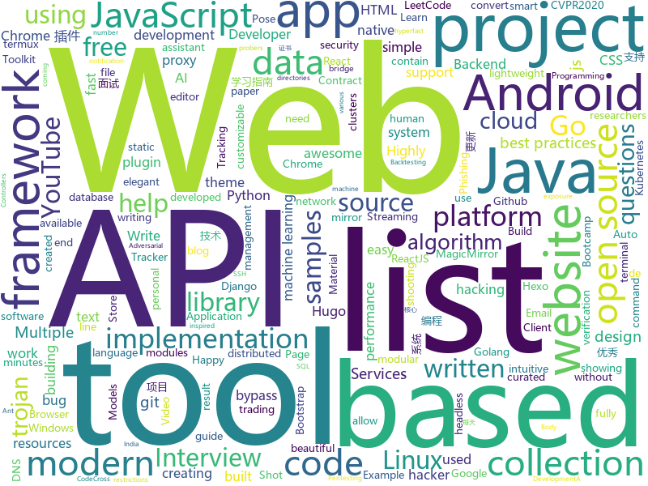

# 2020-06-01
See what the GitHub community is most excited about.

## python
+ [practical-python](https://github.com/dabeaz-course/practical-python)(**730 stars today**): Practical Python Programming (course by @dabeaz)
+ [freqtrade](https://github.com/freqtrade/freqtrade)(**14 stars today**): Free, open source crypto trading bot
+ [ALAE](https://github.com/podgorskiy/ALAE)(**19 stars today**): [CVPR2020] Adversarial Latent Autoencoders
+ [machine_learning_examples](https://github.com/lazyprogrammer/machine_learning_examples)(**13 stars today**): A collection of machine learning examples and tutorials.
+ [MONAI](https://github.com/Project-MONAI/MONAI)(**16 stars today**): AI Toolkit for Healthcare Imaging
+ [mlfinlab](https://github.com/hudson-and-thames/mlfinlab)(**15 stars today**): MlFinlab helps portfolio managers and traders who want to leverage the power of machine learning by providing reproducible, interpretable, and easy to use tools.
+ [prefect](https://github.com/PrefectHQ/prefect)(**102 stars today**): A modern data workflow platform
+ [django](https://github.com/django/django)(**67 stars today**): The Web framework for perfectionists with deadlines.
+ [star-clustering](https://github.com/josephius/star-clustering)(**17 stars today**): A clustering algorithm that automatically determines the number of clusters and works without hyperparameter fine-tuning.
+ [snakeware](https://github.com/joshiemoore/snakeware)(**133 stars today**): A free Linux distro with a fully Python userspace
+ [AI-basketball-analysis](https://github.com/chonyy/AI-basketball-analysis)(**52 stars today**): 🏀🤖🏀AI web app and API to analyze basketball shots and shooting pose.
+ [DeepFaceLab](https://github.com/iperov/DeepFaceLab)(**44 stars today**): DeepFaceLab is the leading software for creating deepfakes.
+ [pytorch-lightning](https://github.com/PyTorchLightning/pytorch-lightning)(**19 stars today**): The lightweight PyTorch wrapper for ML researchers. Scale your models. Write less boilerplate
+ [backtrader](https://github.com/mementum/backtrader)(**8 stars today**): Python Backtesting library for trading strategies
+ [networkx](https://github.com/networkx/networkx)(**8 stars today**): Official NetworkX source code repository.
+ [Tool-X](https://github.com/rajkumardusad/Tool-X)(**12 stars today**): Tool-X is a kali linux hacking Tool installer. Tool-X developed for termux and other Linux based systems. using Tool-X you can install almost 370+ hacking tools in termux app and other linux based distributions.
+ [manim](https://github.com/3b1b/manim)(**50 stars today**): Animation engine for explanatory math videos
+ [saleor](https://github.com/mirumee/saleor)(**30 stars today**): A modular, high performance, headless e-commerce storefront built with Python, GraphQL, Django, and ReactJS.
+ [VIBE](https://github.com/mkocabas/VIBE)(**184 stars today**): Official implementation of CVPR2020 paper "VIBE: Video Inference for Human Body Pose and Shape Estimation"
+ [django-rest-framework](https://github.com/encode/django-rest-framework)(**44 stars today**): Web APIs for Django.🎸
+ [keras](https://github.com/keras-team/keras)(**24 stars today**): Deep Learning for humans
+ [PayloadsAllTheThings](https://github.com/swisskyrepo/PayloadsAllTheThings)(**27 stars today**): A list of useful payloads and bypass for Web Application Security and Pentest/CTF
+ [scikit-learn](https://github.com/scikit-learn/scikit-learn)(**36 stars today**): scikit-learn: machine learning in Python
+ [joycontrol](https://github.com/mart1nro/joycontrol)(**12 stars today**): Emulate Nintendo Switch Controllers over Bluetooth
+ [Misago](https://github.com/rafalp/Misago)(**3 stars today**): Misago is fully featured modern forum application that is fast, scalable and responsive.

## java
+ [cwa-server](https://github.com/corona-warn-app/cwa-server)(**58 stars today**): Backend implementation for the Apple/Google exposure notification API.
+ [cwa-verification-portal](https://github.com/corona-warn-app/cwa-verification-portal)(**10 stars today**): Frontend implementation of verification process
+ [cwa-testresult-server](https://github.com/corona-warn-app/cwa-testresult-server)(**11 stars today**): Backend implementation of the test result information.
+ [NewPipe](https://github.com/TeamNewPipe/NewPipe)(**61 stars today**): A libre lightweight streaming front-end for Android.
+ [cwa-verification-server](https://github.com/corona-warn-app/cwa-verification-server)(**16 stars today**): Backend implementation of the verification process
+ [Arduino](https://github.com/arduino/Arduino)(**6 stars today**): open-source electronics platform
+ [Springy-Store-Microservices](https://github.com/mohamed-taman/Springy-Store-Microservices)(**14 stars today**): Springy Store is a conceptual simple μServices-based project using the latest cutting-edge technologies, to demonstrate how the store is created to be a cloud-native and 12-factor app agnostic. Those μServices are developed based on Spring Boot & Cloud framework, that implement cloud-native intuitive, design patterns and best practices.
+ [interview](https://github.com/mission-peace/interview)(**16 stars today**): Interview questions
+ [Algorithms](https://github.com/williamfiset/Algorithms)(**20 stars today**): A collection of algorithms and data structures
+ [traccar](https://github.com/traccar/traccar)(**4 stars today**): Traccar GPS Tracking System
+ [igniter](https://github.com/trojan-gfw/igniter)(**13 stars today**): A trojan client for Android (UNDER CONSTRUCTION).
+ [Signal-Android](https://github.com/signalapp/Signal-Android)(**9 stars today**): A private messenger for Android.
+ [spring-cloud-aws](https://github.com/spring-cloud/spring-cloud-aws)(**7 stars today**): Integration for Amazon Web Services APIs with Spring
+ [MinecraftForge](https://github.com/MinecraftForge/MinecraftForge)(**6 stars today**): Modifications to the Minecraft base files to assist in compatibility between mods.
+ [k-9](https://github.com/k9mail/k-9)(**4 stars today**): K-9 Mail – Open Source Email App for Android
+ [CircleImageView](https://github.com/hdodenhof/CircleImageView)(**5 stars today**): A circular ImageView for Android
+ [android-interview-questions](https://github.com/MindorksOpenSource/android-interview-questions)(**8 stars today**): Your Cheat Sheet For Android Interview - Android Interview Questions
+ [api-samples](https://github.com/youtube/api-samples)(**5 stars today**): Code samples for YouTube APIs, including the YouTube Data API, YouTube Analytics API, and YouTube Live Streaming API. The repo contains language-specific directories that contain the samples.
+ [rsp3](https://github.com/rs-peer/rsp3)(**5 stars today**): Source code for the RSPeer 3.0 project (Work-in-progress)
+ [ar-cptext](https://github.com/cyrildiagne/ar-cptext)(**13 stars today**): AR Copy Paste - Text Proto
+ [JUC](https://github.com/bjmashibing/JUC)(**4 stars today**): 多线程与高并发
+ [ud851-Exercises](https://github.com/udacity/ud851-Exercises)(**1 stars today**): 
+ [views-widgets-samples](https://github.com/android/views-widgets-samples)(**11 stars today**): Multiple samples showing the best practices in views-widgets on Android.
+ [fastjson](https://github.com/alibaba/fastjson)(**80 stars today**): A fast JSON parser/generator for Java.
+ [user-interface-samples](https://github.com/android/user-interface-samples)(**5 stars today**): Multiple samples showing the best practices in the user interface on Android.

## unknown
+ [cwa-documentation](https://github.com/corona-warn-app/cwa-documentation)(**109 stars today**): Project overview, general documentation, and white papers.
+ [DescomplicandoKubernetes](https://github.com/badtuxx/DescomplicandoKubernetes)(**64 stars today**): 
+ [JavaCollection](https://github.com/hansonwang99/JavaCollection)(**31 stars today**): Java开源项目之「自学编程之路」：学习指南+面试指南+资源分享+技术文章
+ [gpt-3](https://github.com/openai/gpt-3)(**219 stars today**): GPT-3: Language Models are Few-Shot Learners
+ [say-their-names](https://github.com/FranckNdame/say-their-names)(**15 stars today**): A non-profit platform to commemorate our black kings and queens. Making it easy to donate, raise awareness and sign petitions.
+ [JavaFamily](https://github.com/AobingJava/JavaFamily)(**145 stars today**): 【Java面试+Java学习指南】 一份涵盖大部分Java程序员所需要掌握的核心知识。
+ [ProtestTips](https://github.com/frombeirutwithlove/ProtestTips)(**88 stars today**): 
+ [Beginner-Network-Pentesting](https://github.com/hmaverickadams/Beginner-Network-Pentesting)(**9 stars today**): Notes for Beginner Network Pentesting Course
+ [system_design](https://github.com/shashank88/system_design)(**7 stars today**): Preparation links and resources for system design questions
+ [computer-science](https://github.com/ossu/computer-science)(**68 stars today**): 🎓Path to a free self-taught education in Computer Science!
+ [TrackersListCollection](https://github.com/XIU2/TrackersListCollection)(**40 stars today**): 🎈Updated daily! A list of popular BitTorrent Trackers. / 每天更新！全网热门 BT Tracker 列表！
+ [OnJava8](https://github.com/LingCoder/OnJava8)(**20 stars today**): 《On Java 8》中文版，又名《Java编程思想》 第5版
+ [WindowsExploitationResources](https://github.com/FULLSHADE/WindowsExploitationResources)(**65 stars today**): Some random resources I have enjoyed for certain topics of Windows exploit development and semi-related topics
+ [JavbuslibraryRealse](https://github.com/gentlemansolo/JavbuslibraryRealse)(**37 stars today**): JavRocket is a beautiful and elegant APP
+ [siber-guvenlik-sss](https://github.com/LuNiZz/siber-guvenlik-sss)(**24 stars today**): SSS sorulari burada...
+ [awesome-bug-bounty](https://github.com/djadmin/awesome-bug-bounty)(**8 stars today**): A comprehensive curated list of available Bug Bounty & Disclosure Programs and Write-ups.
+ [Resources-for-Beginner-Bug-Bounty-Hunters](https://github.com/nahamsec/Resources-for-Beginner-Bug-Bounty-Hunters)(**16 stars today**): A list of resources for those interested in getting started in bug bounties
+ [modern-cpp-cheatsheet](https://github.com/muqsitnawaz/modern-cpp-cheatsheet)(**33 stars today**): Cheatsheet for best practices of Modern C++ (taken from Effective Modern C++)
+ [CoronaFaceMaskDetectionTFJS](https://github.com/aribornstein/CoronaFaceMaskDetectionTFJS)(**4 stars today**): Corona Face Mask Detection with Custom Vision and Tensorflow.js
+ [datasharing](https://github.com/jtleek/datasharing)(**5 stars today**): The Leek group guide to data sharing
+ [project-based-learning](https://github.com/tuvtran/project-based-learning)(**44 stars today**): Curated list of project-based tutorials
+ [data-police-shootings](https://github.com/washingtonpost/data-police-shootings)(**11 stars today**): The Washington Post is compiling a database of every fatal shooting in the United States by a police officer in the line of duty in 2015 and 2016.
+ [fucking-algorithm](https://github.com/labuladong/fucking-algorithm)(**184 stars today**): 手把手撕LeetCode题目，扒各种算法套路的裤子。English version supported! Crack LeetCode, not only how, but also why.
+ [flutter_roadmap](https://github.com/olexale/flutter_roadmap)(**16 stars today**): Highly Subjective Roadmap to Flutter Development
+ [Awesome-Hacking](https://github.com/Hack-with-Github/Awesome-Hacking)(**15 stars today**): A collection of various awesome lists for hackers, pentesters and security researchers

## javascript
+ [algorithm-visualizer](https://github.com/algorithm-visualizer/algorithm-visualizer)(**129 stars today**): 🎆Interactive Online Platform that Visualizes Algorithms from Code
+ [beekeeper-studio](https://github.com/beekeeper-studio/beekeeper-studio)(**217 stars today**): Cross platform SQL editor and database management app for Windows, Linux, and Mac.
+ [SpaceX-API](https://github.com/r-spacex/SpaceX-API)(**35 stars today**): 🚀Open Source REST API for rocket, core, capsule, pad, and launch data
+ [pose-animator](https://github.com/yemount/pose-animator)(**349 stars today**): 
+ [mostly-adequate-guide](https://github.com/MostlyAdequate/mostly-adequate-guide)(**43 stars today**): Mostly adequate guide to FP (in javascript)
+ [covid19india-react](https://github.com/covid19india/covid19india-react)(**26 stars today**): Tracking the impact of COVID-19 in India
+ [ChromeAppHeroes](https://github.com/zhaoolee/ChromeAppHeroes)(**56 stars today**): 🌈谷粒-Chrome插件英雄榜, 为优秀的Chrome插件写一本中文说明书, 让Chrome插件英雄们造福人类~ ChromePluginHeroes, Write a Chinese manual for the excellent Chrome plugin, let the Chrome plugin heroes benefit the human~ 公众号「0加1」同步更新
+ [reactjs-interview-questions](https://github.com/sudheerj/reactjs-interview-questions)(**34 stars today**): List of top 500 ReactJS Interview Questions & Answers....Coding exercise questions are coming soon!!
+ [react-native](https://github.com/facebook/react-native)(**42 stars today**): A framework for building native apps with React.
+ [MagicMirror](https://github.com/MichMich/MagicMirror)(**10 stars today**): MagicMirror² is an open source modular smart mirror platform. With a growing list of installable modules, the MagicMirror² allows you to convert your hallway or bathroom mirror into your personal assistant.
+ [vue](https://github.com/tailwindui/vue)(**365 stars today**): 
+ [text-to-handwriting](https://github.com/saurabhdaware/text-to-handwriting)(**67 stars today**): So your teacher asked you to upload written assignments on ERP? Hate writing assigments? This tool will help you convert your text to handwriting xD
+ [react-data-table-component](https://github.com/jbetancur/react-data-table-component)(**15 stars today**): A simple table library with built in sorting, pagination, selection, expandable rows and customizable styling.
+ [gatsby-starter-blog](https://github.com/gatsbyjs/gatsby-starter-blog)(**6 stars today**): Gatsby starter for creating a blog
+ [fullstack-course4](https://github.com/jhu-ep-coursera/fullstack-course4)(**6 stars today**): Example code for HTML, CSS, and Javascript for Web Developers Coursera Course
+ [zigbee2mqtt](https://github.com/Koenkk/zigbee2mqtt)(**5 stars today**): Zigbee🐝to MQTT bridge🌉, get rid of your proprietary Zigbee bridges🔨
+ [RSSHub](https://github.com/DIYgod/RSSHub)(**41 stars today**): 🍰Everything is RSSible
+ [Auto.js_Projects](https://github.com/SuperMonster003/Auto.js_Projects)(**26 stars today**): 基于Auto.js的辅助工具项目 (蚂蚁森林) Auto.js-based assistant tools projects (Ant Forest)
+ [new_v2ex](https://github.com/sedgwickz/new_v2ex)(**126 stars today**): Nextjs 仿 v2ex
+ [discord.js](https://github.com/discordjs/discord.js)(**17 stars today**): A powerful JavaScript library for interacting with the Discord API
+ [wtfjs](https://github.com/denysdovhan/wtfjs)(**31 stars today**): A list of funny and tricky JavaScript examples
+ [website](https://github.com/CodingTrain/website)(**4 stars today**): Coding Train website
+ [openzeppelin-contracts](https://github.com/OpenZeppelin/openzeppelin-contracts)(**9 stars today**): OpenZeppelin Contracts is a library for secure smart contract development.
+ [next.js](https://github.com/vercel/next.js)(**85 stars today**): The React Framework
+ [Ghost](https://github.com/TryGhost/Ghost)(**16 stars today**): 👻The #1 headless Node.js CMS for professional publishing

## html
+ [Bootcamp-Setup](https://github.com/panacloud/Bootcamp-Setup)(**13 stars today**): 
+ [shellphish](https://github.com/thelinuxchoice/shellphish)(**6 stars today**): 19 Social Media Phishing Pages #phishing #shellphish #phish
+ [cstate](https://github.com/cstate/cstate)(**63 stars today**): 🔥Open source static status page. Uses hyperfast Golang & Hugo, minimal JS, super light HTML/CSS, customizable, outstanding browser support (IE8+).
+ [hexo-theme-fluid](https://github.com/fluid-dev/hexo-theme-fluid)(**17 stars today**): 🌊一款 Material Design 风格的 Hexo 主题 / An elegant Material-Design theme for Hexo
+ [Awesome-CS-Books-and-Digests](https://github.com/wx-chevalier/Awesome-CS-Books-and-Digests)(**10 stars today**): 📚Awesome CS Books(with Digests)/Series(.pdf by git lfs) Warehouse for Geeks, ProgrammingLanguage, SoftwareEngineering, Web, AI, ServerSideApplication, Infrastructure, FE etc.💫优秀计算机科学与技术领域相关的书籍归档，以及我的读书笔记。
+ [startbootstrap-sb-admin-2](https://github.com/BlackrockDigital/startbootstrap-sb-admin-2)(**11 stars today**): A free, open source, Bootstrap admin theme created by Start Bootstrap
+ [awesome-competitive-programming](https://github.com/lnishan/awesome-competitive-programming)(**10 stars today**): 💎A curated list of awesome Competitive Programming, Algorithm and Data Structure resources
+ [personal-website](https://github.com/github/personal-website)(**5 stars today**): Code that'll help you kickstart a personal website that showcases your work as a software developer.
+ [mslearn-tailspin-spacegame-web](https://github.com/MicrosoftDocs/mslearn-tailspin-spacegame-web)(**1 stars today**): Code used in Microsoft Learn modules to support Azure DevOps
+ [portainer](https://github.com/portainer/portainer)(**25 stars today**): Making Docker management easy.
+ [zfaka](https://github.com/zlkbdotnet/zfaka)(**13 stars today**): 免费、安全、稳定、高效的发卡系统，值得拥有!
+ [OpenClash](https://github.com/vernesong/OpenClash)(**10 stars today**): A Clash Client For OpenWrt
+ [java](https://github.com/bjmashibing/java)(**3 stars today**): 
+ [quickstart-js](https://github.com/firebase/quickstart-js)(**6 stars today**): Firebase Quickstart Samples for Web
+ [hugo-academic](https://github.com/gcushen/hugo-academic)(**5 stars today**): 📝The website builder for Hugo. Build and deploy a beautiful website in minutes!
+ [node-ytdl-core](https://github.com/fent/node-ytdl-core)(**6 stars today**): YouTube video downloader in javascript.
+ [learn-to-send-email-via-google-script-html-no-server](https://github.com/dwyl/learn-to-send-email-via-google-script-html-no-server)(**45 stars today**): ✉️An Example of using an HTML form (e.g: "Contact Us" on a website) to send Email without a Backend Server (using a Google Script) perfect for static websites that need to collect data.
+ [bulma-templates](https://github.com/BulmaTemplates/bulma-templates)(**2 stars today**): free flexbox templates built with the bulma css framework
+ [webdevbootcamp](https://github.com/nax3t/webdevbootcamp)(**10 stars today**): All source code for back-end projects from the Web Developer Bootcamp
+ [Coursera-ML-AndrewNg-Notes](https://github.com/fengdu78/Coursera-ML-AndrewNg-Notes)(**21 stars today**): 吴恩达老师的机器学习课程个人笔记
+ [bootcamp2020](https://github.com/zeeshanhanif/bootcamp2020)(**14 stars today**): Basic Website for Bootcamp Practice
+ [hyperblog](https://github.com/freddier/hyperblog)(**18 stars today**): Un blog increíble para el curso de Git y Github de Platzi
+ [hugo-coder](https://github.com/luizdepra/hugo-coder)(**1 stars today**): A minimalist blog theme for hugo.
+ [en.javascript.info](https://github.com/javascript-tutorial/en.javascript.info)(**18 stars today**): Modern JavaScript Tutorial
+ [BookItAutomationFall2019](https://github.com/CybertekSchool/BookItAutomationFall2019)(**3 stars today**): 

## go
+ [v2ray-core](https://github.com/v2ray/v2ray-core)(**116 stars today**): A platform for building proxies to bypass network restrictions.
+ [go-interview](https://github.com/shomali11/go-interview)(**445 stars today**): Collection of Technical Interview Questions solved with Go
+ [trojan-go](https://github.com/p4gefau1t/trojan-go)(**63 stars today**): Go实现的Trojan代理，支持自动证书申请/多路复用/路由功能/CDN中转，多平台，无依赖。A Trojan proxy written in Go. An unidentifiable mechanism that helps you bypass GFW. https://p4gefau1t.github.io/trojan-go/
+ [k9s](https://github.com/derailed/k9s)(**246 stars today**): 🐶Kubernetes CLI To Manage Your Clusters In Style!
+ [fiber](https://github.com/gofiber/fiber)(**57 stars today**): ⚡️Fiber is an Express inspired web framework written in Go with☕️
+ [thanos](https://github.com/thanos-io/thanos)(**7 stars today**): Highly available Prometheus setup with long term storage capabilities. CNCF Sandbox project.
+ [WebHackersWeapons](https://github.com/hahwul/WebHackersWeapons)(**36 stars today**): ⚔️Web Hacker's Weapons / A collection of cool tools used by Web hackers. Happy hacking , Happy bug-hunting
+ [ffuf](https://github.com/ffuf/ffuf)(**6 stars today**): Fast web fuzzer written in Go
+ [dnscrypt-proxy](https://github.com/DNSCrypt/dnscrypt-proxy)(**14 stars today**): dnscrypt-proxy 2 - A flexible DNS proxy, with support for encrypted DNS protocols.
+ [go-micro](https://github.com/micro/go-micro)(**112 stars today**): A distributed systems development framework
+ [micro](https://github.com/zyedidia/micro)(**230 stars today**): A modern and intuitive terminal-based text editor
+ [Cloudreve](https://github.com/cloudreve/Cloudreve)(**29 stars today**): 🌩支持多家云存储的云盘系统 (A project helps you build your own cloud in minutes)
+ [go-git](https://github.com/go-git/go-git)(**14 stars today**): A highly extensible Git implementation in pure Go.
+ [filebrowser](https://github.com/filebrowser/filebrowser)(**11 stars today**): 📂Web File Browser which can be used as a middleware or standalone app.
+ [hacks](https://github.com/tomnomnom/hacks)(**7 stars today**): A collection of hacks and one-off scripts
+ [service](https://github.com/ardanlabs/service)(**5 stars today**): Starter code for writing web services in Go
+ [fzf](https://github.com/junegunn/fzf)(**81 stars today**): 🌸A command-line fuzzy finder
+ [k3sup](https://github.com/alexellis/k3sup)(**59 stars today**): bootstrap Kubernetes with k3s over SSH < 1 min🚀
+ [hugo](https://github.com/gohugoio/hugo)(**58 stars today**): The world’s fastest framework for building websites.
+ [httpx](https://github.com/projectdiscovery/httpx)(**25 stars today**): httpx is a fast and multi-purpose HTTP toolkit allow to run multiple probers using retryablehttp library, it is designed to maintain the result reliability with increased threads.
+ [packer](https://github.com/hashicorp/packer)(**9 stars today**): Packer is a tool for creating identical machine images for multiple platforms from a single source configuration.
+ [nsq](https://github.com/nsqio/nsq)(**10 stars today**): A realtime distributed messaging platform
+ [v2ray-plugin](https://github.com/shadowsocks/v2ray-plugin)(**6 stars today**): A SIP003 plugin based on v2ray
+ [gin](https://github.com/gin-gonic/gin)(**37 stars today**): Gin is a HTTP web framework written in Go (Golang). It features a Martini-like API with much better performance -- up to 40 times faster. If you need smashing performance, get yourself some Gin.
+ [lazygit](https://github.com/jesseduffield/lazygit)(**20 stars today**): simple terminal UI for git commands

## WordCloud

