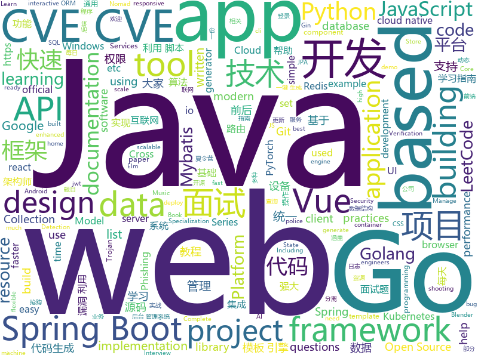

# 2020-06-02
See what the GitHub community is most excited about.

## python
+ [django-rest-framework](https://github.com/encode/django-rest-framework)(**45 stars today**): Web APIs for Django.🎸
+ [practical-python](https://github.com/dabeaz-course/practical-python)(**421 stars today**): Practical Python Programming (course by @dabeaz)
+ [cpython](https://github.com/python/cpython)(**115 stars today**): The Python programming language
+ [mmdetection](https://github.com/open-mmlab/mmdetection)(**21 stars today**): Open MMLab Detection Toolbox and Benchmark
+ [DeepFaceLab](https://github.com/iperov/DeepFaceLab)(**45 stars today**): DeepFaceLab is the leading software for creating deepfakes.
+ [jd-assistant](https://github.com/tychxn/jd-assistant)(**7 stars today**): 京东抢购助手：包含登录，查询商品库存/价格，添加/清空购物车，抢购商品(下单)，查询订单等功能
+ [python](https://github.com/kubernetes-client/python)(**4 stars today**): Official Python client library for kubernetes
+ [dbt](https://github.com/fishtown-analytics/dbt)(**5 stars today**): dbt (data build tool) enables data analysts and engineers to transform their data using the same practices that software engineers use to build applications.
+ [aws-data-wrangler](https://github.com/awslabs/aws-data-wrangler)(**7 stars today**): Pandas on AWS
+ [mlfinlab](https://github.com/hudson-and-thames/mlfinlab)(**24 stars today**): MlFinlab helps portfolio managers and traders who want to leverage the power of machine learning by providing reproducible, interpretable, and easy to use tools.
+ [models](https://github.com/tensorflow/models)(**29 stars today**): Models and examples built with TensorFlow
+ [MapsModelsImporter](https://github.com/eliemichel/MapsModelsImporter)(**11 stars today**): A Blender add-on to import models from google maps
+ [jukebox](https://github.com/openai/jukebox)(**27 stars today**): Code for the paper "Jukebox: A Generative Model for Music"
+ [AI-basketball-analysis](https://github.com/chonyy/AI-basketball-analysis)(**70 stars today**): 🏀🤖🏀AI web app and API to analyze basketball shots and shooting pose.
+ [SpaceshipGenerator](https://github.com/a1studmuffin/SpaceshipGenerator)(**357 stars today**): A Blender script to procedurally generate 3D spaceships
+ [TensorflowTTS](https://github.com/dathudeptrai/TensorflowTTS)(**35 stars today**): 😝TensorflowTTS: Real-Time State-of-the-art Speech Synthesis for Tensorflow 2
+ [exphub](https://github.com/zhzyker/exphub)(**17 stars today**): Exphub[漏洞利用脚本库] 包括Webloigc、Struts2、Tomcat、Nexus、Solr、Jboss、Drupal的漏洞利用脚本，优先更新高危且易利用的漏洞利用脚本，最新添加CVE-2020-11444、CVE-2020-10204、CVE-2020-10199、CVE-2020-1938、CVE-2020-2551、CVE-2020-2555、CVE-2020-2883、CVE-2019-17558、CVE-2019-6340
+ [full-stack-fastapi-postgresql](https://github.com/tiangolo/full-stack-fastapi-postgresql)(**12 stars today**): Full stack, modern web application generator. Using FastAPI, PostgreSQL as database, Docker, automatic HTTPS and more.
+ [ComputerVision-with-PyTorch-Learning-Program](https://github.com/tinkerhub-org/ComputerVision-with-PyTorch-Learning-Program)(**4 stars today**): Computer Vision using PyTorch Learning Program by TinkerHub Foundation
+ [google-api-python-client](https://github.com/googleapis/google-api-python-client)(**8 stars today**): 🐍The official Python client library for Google's discovery based APIs.
+ [pytorch-YOLOv4](https://github.com/Tianxiaomo/pytorch-YOLOv4)(**30 stars today**): Minimal PyTorch implementation of YOLOv4
+ [d2l-en](https://github.com/d2l-ai/d2l-en)(**23 stars today**): An interactive deep learning book with code, math, and discussions.
+ [PCDet](https://github.com/sshaoshuai/PCDet)(**10 stars today**): PCDet Toolbox in PyTorch for 3D Object Detection from Point Cloud
+ [flask](https://github.com/pallets/flask)(**24 stars today**): The Python micro framework for building web applications.
+ [algo](https://github.com/wangzheng0822/algo)(**19 stars today**): 数据结构和算法必知必会的50个代码实现

## java
+ [InternetArchitect](https://github.com/bjmashibing/InternetArchitect)(**80 stars today**): 年薪百万互联网架构师课程文档及源码(公开部分)
+ [fastjson](https://github.com/alibaba/fastjson)(**67 stars today**): A fast JSON parser/generator for Java.
+ [spring-analysis](https://github.com/seaswalker/spring-analysis)(**37 stars today**): Spring源码阅读
+ [cwa-server](https://github.com/corona-warn-app/cwa-server)(**53 stars today**): Backend implementation for the Apple/Google exposure notification API.
+ [jeecg-boot](https://github.com/zhangdaiscott/jeecg-boot)(**75 stars today**): 基于代码生成器的快速开发平台，超越传统商业开发平台！前后端分离架构：SpringBoot 2.x，Ant Design&Vue，Mybatis-plus，Shiro，JWT。强大的代码生成器让前后端代码一键生成，无需写任何代码! 引领新开发模式(OnlineCoding-> 代码生成-> 手工MERGE)，帮助Java项目解决70%重复工作，让开发更关注业务逻辑，既能快速提高开发效率，帮助公司节省成本，同时又不失灵活性。
+ [spring-security](https://github.com/spring-projects/spring-security)(**10 stars today**): Spring Security
+ [presto](https://github.com/prestodb/presto)(**7 stars today**): The official home of the Presto distributed SQL query engine for big data
+ [DS-Algo](https://github.com/Anuj-Kumar-Sharma/DS-Algo)(**8 stars today**): Implementation of Data structures and Algorithms at Apni Kaksha Java Placement Course
+ [kafka](https://github.com/apache/kafka)(**14 stars today**): Mirror of Apache Kafka
+ [initializr](https://github.com/spring-io/initializr)(**5 stars today**): A quickstart generator for Spring projects
+ [cwa-testresult-server](https://github.com/corona-warn-app/cwa-testresult-server)(**14 stars today**): Backend implementation of the test result information.
+ [cwa-verification-portal](https://github.com/corona-warn-app/cwa-verification-portal)(**11 stars today**): Frontend implementation of verification process
+ [LeetCodeAnimation](https://github.com/MisterBooo/LeetCodeAnimation)(**65 stars today**): Demonstrate all the questions on LeetCode in the form of animation.（用动画的形式呈现解LeetCode题目的思路）
+ [spring-boot-examples](https://github.com/ityouknow/spring-boot-examples)(**19 stars today**): about learning Spring Boot via examples. Spring Boot 教程、技术栈示例代码，快速简单上手教程。
+ [Auto.js](https://github.com/hyb1996/Auto.js)(**28 stars today**): A UiAutomator on android, does not need root access(安卓平台上的JavaScript自动化工具)
+ [flink](https://github.com/apache/flink)(**12 stars today**): Apache Flink
+ [eladmin](https://github.com/elunez/eladmin)(**30 stars today**): 项目基于 Spring Boot 2.1.0 、 Jpa、 Spring Security、redis、Vue的前后端分离的后台管理系统，项目采用分模块开发方式， 权限控制采用 RBAC，支持数据字典与数据权限管理，支持一键生成前后端代码，支持动态路由
+ [LeetCodeLearning](https://github.com/JessonYue/LeetCodeLearning)(**5 stars today**): 这个仓库主要用于每天一题，大家的自发刷题，大家可以自由的提交和修改
+ [webmagic](https://github.com/code4craft/webmagic)(**8 stars today**): A scalable web crawler framework for Java.
+ [react-native-video](https://github.com/react-native-community/react-native-video)(**5 stars today**): A <Video /> component for react-native
+ [jetlinks-community](https://github.com/jetlinks/jetlinks-community)(**6 stars today**): JetLinks 基于Java8,Spring Boot 2.x ,WebFlux,Netty,Vert.x,Reactor等开发, 是一个全响应式的物联网平台。支持统一物模型管理,多种设备,多种厂家,统一管理。统一设备连接管理,多协议适配(TCP,MQTT,UDP,CoAP,HTTP等),屏蔽网络编程复杂性,灵活接入不同厂家不同协议等设备。实时数据处理,设备告警,消息通知,数据转发。地理位置,数据可视化等。能帮助你快速建立物联网相关业务系统。
+ [spring-boot-demo](https://github.com/xkcoding/spring-boot-demo)(**51 stars today**): spring boot demo 是一个用来深度学习并实战 spring boot 的项目，目前总共包含 65 个集成demo，已经完成 53 个。 该项目已成功集成 actuator(监控)、admin(可视化监控)、logback(日志)、aopLog(通过AOP记录web请求日志)、统一异常处理(json级别和页面级别)、freemarker(模板引擎)、thymeleaf(模板引擎)、Beetl(模板引擎)、Enjoy(模板引擎)、JdbcTemplate(通用JDBC操作数据库)、JPA(强大的ORM框架)、mybatis(强大的ORM框架)、通用Mapper(快速操作Mybatis)、PageHelper(通用的Mybatis分页插件)、mybatis-plus(快速操作M…
+ [canal](https://github.com/alibaba/canal)(**25 stars today**): 阿里巴巴 MySQL binlog 增量订阅&消费组件
+ [thingsboard](https://github.com/thingsboard/thingsboard)(**6 stars today**): Open-source IoT Platform - Device management, data collection, processing and visualization.
+ [Springy-Store-Microservices](https://github.com/mohamed-taman/Springy-Store-Microservices)(**17 stars today**): Springy Store is a conceptual simple μServices-based project using the latest cutting-edge technologies, to demonstrate how the store is created to be a cloud-native and 12-factor app agnostic. Those μServices are developed based on Spring Boot & Cloud framework, that implement cloud-native intuitive, design patterns and best practices.

## unknown
+ [Resources-for-Beginner-Bug-Bounty-Hunters](https://github.com/nahamsec/Resources-for-Beginner-Bug-Bounty-Hunters)(**63 stars today**): A list of resources for those interested in getting started in bug bounties
+ [weekly](https://github.com/dt-fe/weekly)(**45 stars today**): 前端精读周刊
+ [cwa-documentation](https://github.com/corona-warn-app/cwa-documentation)(**136 stars today**): Project overview, general documentation, and white papers.
+ [For-Data-Science-Beginners](https://github.com/amrrs/For-Data-Science-Beginners)(**6 stars today**): Set of📝with🔗to help those who are Data Science beginners🤖
+ [JavaFamily](https://github.com/AobingJava/JavaFamily)(**178 stars today**): 【Java面试+Java学习指南】 一份涵盖大部分Java程序员所需要掌握的核心知识。
+ [jetbrains-agent](https://github.com/nickchou/jetbrains-agent)(**13 stars today**): 破解版
+ [WindowsExploitationResources](https://github.com/FULLSHADE/WindowsExploitationResources)(**44 stars today**): Some random resources I have enjoyed for certain topics of Windows exploit development and semi-related topics
+ [awesome-architecture](https://github.com/toutiaoio/awesome-architecture)(**27 stars today**): 架构师技术图谱，助你早日成为架构师
+ [the-book-of-secret-knowledge](https://github.com/trimstray/the-book-of-secret-knowledge)(**24 stars today**): A collection of inspiring lists, manuals, cheatsheets, blogs, hacks, one-liners, cli/web tools and more.
+ [Flutter-Course-Resources](https://github.com/londonappbrewery/Flutter-Course-Resources)(**18 stars today**): Learn to Code While Building Apps - The Complete Flutter Development Bootcamp
+ [Specs](https://github.com/CocoaPods/Specs)(**3 stars today**): The CocoaPods Master Repo
+ [project-based-learning](https://github.com/tuvtran/project-based-learning)(**39 stars today**): Curated list of project-based tutorials
+ [data-police-shootings](https://github.com/washingtonpost/data-police-shootings)(**13 stars today**): The Washington Post is compiling a database of every fatal shooting in the United States by a police officer in the line of duty in 2015 and 2016.
+ [JavaCollection](https://github.com/hansonwang99/JavaCollection)(**36 stars today**): Java开源项目之「自学编程之路」：学习指南+面试指南+资源分享+技术文章
+ [design-resources-for-developers](https://github.com/bradtraversy/design-resources-for-developers)(**114 stars today**): Curated list of design and UI resources from stock photos, web templates, CSS frameworks, UI libraries, tools and much more
+ [Awesome-Red-Teaming](https://github.com/yeyintminthuhtut/Awesome-Red-Teaming)(**6 stars today**): List of Awesome Red Teaming Resources
+ [git-recipes](https://github.com/geeeeeeeeek/git-recipes)(**27 stars today**): 🥡Git recipes in Chinese by Zhongyi Tong. 高质量的Git中文教程.
+ [JavaInterview](https://github.com/OUYANGSIHAI/JavaInterview)(**47 stars today**): 【Java面试+Java后端技术学习指南】：一份通向理想互联网公司的面试指南，包括 Java，技术面试必备基础知识、Leetcode、计算机操作系统、计算机网络、系统设计、分布式、数据库（MySQL、Redis）、Java 项目实战等
+ [CSSummerCamp2020](https://github.com/hcy226/CSSummerCamp2020)(**7 stars today**): 关于2020年CS保研夏令营的汇总。欢迎大家分享夏令营信息，资瓷一下互联网精神吼不吼啊？
+ [CKAD-exercises](https://github.com/dgkanatsios/CKAD-exercises)(**11 stars today**): A set of exercises to prepare for Certified Kubernetes Application Developer exam by Cloud Native Computing Foundation
+ [AZ-300-MicrosoftAzureArchitectTechnologies](https://github.com/MicrosoftLearning/AZ-300-MicrosoftAzureArchitectTechnologies)(**5 stars today**): 
+ [awesome-operators](https://github.com/operator-framework/awesome-operators)(**8 stars today**): A resource tracking a number of Operators out in the wild.
+ [fucking-algorithm](https://github.com/labuladong/fucking-algorithm)(**127 stars today**): 手把手撕LeetCode题目，扒各种算法套路的裤子。English version supported! Crack LeetCode, not only how, but also why.
+ [3y](https://github.com/ZhongFuCheng3y/3y)(**47 stars today**): 📓从Java基础、JavaWeb基础到常用的框架再到面试题都有完整的教程，几乎涵盖了Java后端必备的知识点
+ [eng-practices](https://github.com/google/eng-practices)(**21 stars today**): Google's Engineering Practices documentation

## javascript
+ [SpaceX-API](https://github.com/r-spacex/SpaceX-API)(**62 stars today**): 🚀Open Source REST API for rocket, core, capsule, pad, and launch data
+ [text-to-handwriting](https://github.com/saurabhdaware/text-to-handwriting)(**76 stars today**): So your teacher asked you to upload written assignments on ERP? Hate writing assigments? This tool will help you convert your text to handwriting xD
+ [Font-Awesome](https://github.com/FortAwesome/Font-Awesome)(**19 stars today**): The iconic SVG, font, and CSS toolkit
+ [UnblockNeteaseMusic](https://github.com/nondanee/UnblockNeteaseMusic)(**22 stars today**): Revive unavailable songs for Netease Cloud Music
+ [image-scrubber](https://github.com/everestpipkin/image-scrubber)(**160 stars today**): A friendly browser-based tool for anonymizing photographs taken at protests
+ [reactjs-interview-questions](https://github.com/sudheerj/reactjs-interview-questions)(**38 stars today**): List of top 500 ReactJS Interview Questions & Answers....Coding exercise questions are coming soon!!
+ [beekeeper-studio](https://github.com/beekeeper-studio/beekeeper-studio)(**115 stars today**): Cross platform SQL editor and database management app for Windows, Linux, and Mac.
+ [svelte](https://github.com/sveltejs/svelte)(**46 stars today**): Cybernetically enhanced web apps
+ [appium](https://github.com/appium/appium)(**10 stars today**): 📱Automation for iOS, Android, and Windows Apps.
+ [vue](https://github.com/vuejs/vue)(**95 stars today**): 🖖Vue.js is a progressive, incrementally-adoptable JavaScript framework for building UI on the web.
+ [awesomo](https://github.com/lk-geimfari/awesomo)(**20 stars today**): An extensive list of cool open source projects written in С, C++, Clojure, Lisp, Elixir, Erlang, Elm, Golang, Haskell, JavaScript, Lua, OCaml, Python, R, Ruby, Rust, Scala etc.
+ [wifi-card](https://github.com/bndw/wifi-card)(**192 stars today**): 📶Print a QR code for connecting to your WiFi
+ [react](https://github.com/facebook/react)(**79 stars today**): A declarative, efficient, and flexible JavaScript library for building user interfaces.
+ [scripts](https://github.com/chavyleung/scripts)(**18 stars today**): 
+ [Police-Data-Accessibility-Project](https://github.com/Police-Data-Accessibility-Project/Police-Data-Accessibility-Project)(**125 stars today**): A repository for all code related to the Police Accountability Project
+ [algorithm-visualizer](https://github.com/algorithm-visualizer/algorithm-visualizer)(**81 stars today**): 🎆Interactive Online Platform that Visualizes Algorithms from Code
+ [react-router](https://github.com/ReactTraining/react-router)(**29 stars today**): Declarative routing for React
+ [react-calendar-timeline](https://github.com/namespace-ee/react-calendar-timeline)(**5 stars today**): A modern and responsive react timeline component.
+ [material-ui](https://github.com/mui-org/material-ui)(**46 stars today**): React components for faster and easier web development. Build your own design system, or start with Material Design.
+ [slate](https://github.com/slatedocs/slate)(**11 stars today**): Beautiful static documentation for your API
+ [uni-app](https://github.com/dcloudio/uni-app)(**44 stars today**): uni-app 是使用 Vue 语法开发小程序、H5、App的统一框架
+ [fe-interview](https://github.com/haizlin/fe-interview)(**16 stars today**): 前端面试每日 3+1，以面试题来驱动学习，提倡每日学习与思考，每天进步一点！每天早上5点纯手工发布面试题（死磕自己，愉悦大家）
+ [unlock-music](https://github.com/ix64/unlock-music)(**23 stars today**): Unlock encrypted music file in browser. 在浏览器中解锁加密的音乐文件。
+ [vimium](https://github.com/philc/vimium)(**20 stars today**): The hacker's browser.
+ [vue](https://github.com/qq281113270/vue)(**10 stars today**): vue源码逐行注释分析+40多m的vue源码程序流程图思维导图 （diff部分待后续更新）

## html
+ [design-blocks](https://github.com/froala/design-blocks)(**59 stars today**): A set of 170+ Bootstrap based design blocks ready to be used to create clean modern websites.
+ [Awesome-CS-Books-and-Digests](https://github.com/wx-chevalier/Awesome-CS-Books-and-Digests)(**2 stars today**): 📚Awesome CS Books(with Digests)/Series(.pdf by git lfs) Warehouse for Geeks, ProgrammingLanguage, SoftwareEngineering, Web, AI, ServerSideApplication, Infrastructure, FE etc.💫优秀计算机科学与技术领域相关的书籍归档，以及我的读书笔记。
+ [en.javascript.info](https://github.com/javascript-tutorial/en.javascript.info)(**12 stars today**): Modern JavaScript Tutorial
+ [cypress-example-kitchensink](https://github.com/cypress-io/cypress-example-kitchensink)(**1 stars today**): This is an example app used to showcase Cypress.io testing.
+ [seldon-core](https://github.com/SeldonIO/seldon-core)(**3 stars today**): A framework to deploy, manage and scale your production machine learning to thousands of models
+ [JavaScript30](https://github.com/wesbos/JavaScript30)(**16 stars today**): 30 Day Vanilla JS Challenge
+ [blackeye](https://github.com/thelinuxchoice/blackeye)(**5 stars today**): The most complete Phishing Tool, with 32 templates +1 customizable
+ [zfaka](https://github.com/zlkbdotnet/zfaka)(**13 stars today**): 免费、安全、稳定、高效的发卡系统，值得拥有!
+ [responsive-html-email-template](https://github.com/leemunroe/responsive-html-email-template)(**8 stars today**): A free simple responsive HTML email template
+ [Blog](https://github.com/yangkun19921001/Blog)(**25 stars today**): Android 面试宝典、数据结构和算法、音视频 (FFmpeg、AAC、x264、MediaCodec)、 C/C++ 、OpenCV、跨平台等学习记录
+ [Home-Assistant-Config](https://github.com/JamesMcCarthy79/Home-Assistant-Config)(**3 stars today**): Home Assistant Configuration & Documentation for my Smart House.
+ [mslearn-tailspin-spacegame-web](https://github.com/MicrosoftDocs/mslearn-tailspin-spacegame-web)(**0 stars today**): Code used in Microsoft Learn modules to support Azure DevOps
+ [courses](https://github.com/DataScienceSpecialization/courses)(**4 stars today**): Course materials for the Data Science Specialization: https://www.coursera.org/specialization/jhudatascience/1
+ [swagger-codegen](https://github.com/swagger-api/swagger-codegen)(**7 stars today**): swagger-codegen contains a template-driven engine to generate documentation, API clients and server stubs in different languages by parsing your OpenAPI / Swagger definition.
+ [JPProject.IdentityServer4.SSO](https://github.com/brunohbrito/JPProject.IdentityServer4.SSO)(**3 stars today**): 🔒ASP.NET Core 3.1 Open Source SSO. Built within IdentityServer4🔑
+ [boost](https://github.com/boostorg/boost)(**5 stars today**): Super-project for modularized Boost
+ [embeddedsw](https://github.com/Xilinx/embeddedsw)(**0 stars today**): Xilinx Embedded Software (embeddedsw) Development
+ [keep-a-changelog](https://github.com/olivierlacan/keep-a-changelog)(**4 stars today**): If you build software, keep a changelog.
+ [pdfs](https://github.com/tpn/pdfs)(**3 stars today**): Technically-oriented PDF Collection (Papers, Specs, Decks, Manuals, etc)
+ [bibliogram](https://github.com/cloudrac3r/bibliogram)(**4 stars today**): An alternative front-end for Instagram.
+ [Graphics](https://github.com/Unity-Technologies/Graphics)(**2 stars today**): Unity Graphics - Including Scriptable Render Pipeline
+ [forecasting](https://github.com/microsoft/forecasting)(**6 stars today**): Time Series Forecasting Best Practices & Examples
+ [shellphish](https://github.com/thelinuxchoice/shellphish)(**4 stars today**): 19 Social Media Phishing Pages #phishing #shellphish #phish
+ [fluxion](https://github.com/FluxionNetwork/fluxion)(**2 stars today**): Fluxion is a remake of linset by vk496 with less bugs and enhanced functionality.
+ [ASVS](https://github.com/OWASP/ASVS)(**3 stars today**): Application Security Verification Standard

## go
+ [v2ray-core](https://github.com/v2ray/v2ray-core)(**126 stars today**): A platform for building proxies to bypass network restrictions.
+ [trojan-go](https://github.com/p4gefau1t/trojan-go)(**77 stars today**): Go实现的Trojan代理，支持自动证书申请/多路复用/路由功能/CDN中转，多平台，无依赖。A Trojan proxy written in Go. An unidentifiable mechanism that helps you bypass GFW. https://p4gefau1t.github.io/trojan-go/
+ [istio](https://github.com/istio/istio)(**24 stars today**): Connect, secure, control, and observe services.
+ [go-git](https://github.com/go-git/go-git)(**20 stars today**): A highly extensible Git implementation in pure Go.
+ [k9s](https://github.com/derailed/k9s)(**168 stars today**): 🐶Kubernetes CLI To Manage Your Clusters In Style!
+ [gin-vue-admin](https://github.com/flipped-aurora/gin-vue-admin)(**21 stars today**): 基于gin+vue搭建的后台管理系统框架，集成jwt鉴权，权限管理，动态路由，分页封装，多点登录拦截，资源权限，上传下载，代码生成器，表单生成器等基础功能，更多功能正在开发中，欢迎issue和pr~
+ [go](https://github.com/golang/go)(**49 stars today**): The Go programming language
+ [cron](https://github.com/robfig/cron)(**10 stars today**): a cron library for go
+ [jupiter](https://github.com/douyu/jupiter)(**271 stars today**): Jupiter是douyu开源的面向服务治理的Golang微服务框架
+ [nomad](https://github.com/hashicorp/nomad)(**5 stars today**): Nomad is an easy-to-use, flexible, and performant workload orchestrator that can deploy a mix of microservice, batch, containerized, and non-containerized applications. Nomad is easy to operate and scale and has native Consul and Vault integrations.
+ [concourse](https://github.com/concourse/concourse)(**2 stars today**): Concourse is a container-based continuous thing-doer written in Go and Elm.
+ [errors](https://github.com/pkg/errors)(**5 stars today**): Simple error handling primitives
+ [golang-design-pattern](https://github.com/senghoo/golang-design-pattern)(**16 stars today**): 设计模式 Golang实现－《研磨设计模式》读书笔记
+ [go-interview](https://github.com/shomali11/go-interview)(**226 stars today**): Collection of Technical Interview Questions solved with Go
+ [v2ray-plugin](https://github.com/shadowsocks/v2ray-plugin)(**7 stars today**): A SIP003 plugin based on v2ray
+ [k3sup](https://github.com/alexellis/k3sup)(**86 stars today**): bootstrap Kubernetes with k3s over SSH < 1 min🚀
+ [mux](https://github.com/gorilla/mux)(**17 stars today**): A powerful HTTP router and URL matcher for building Go web servers with🦍
+ [VictoriaMetrics](https://github.com/VictoriaMetrics/VictoriaMetrics)(**14 stars today**): VictoriaMetrics - fast, cost-effective and scalable time series database
+ [validator](https://github.com/go-playground/validator)(**12 stars today**): 💯Go Struct and Field validation, including Cross Field, Cross Struct, Map, Slice and Array diving
+ [kubesphere](https://github.com/kubesphere/kubesphere)(**14 stars today**): Easy-to-use Production Ready Container Platform
+ [fasthttp](https://github.com/valyala/fasthttp)(**18 stars today**): Fast HTTP package for Go. Tuned for high performance. Zero memory allocations in hot paths. Up to 10x faster than net/http
+ [minio](https://github.com/minio/minio)(**26 stars today**): MinIO is a high performance object storage server compatible with Amazon S3 APIs
+ [gin](https://github.com/gin-gonic/gin)(**37 stars today**): Gin is a HTTP web framework written in Go (Golang). It features a Martini-like API with much better performance -- up to 40 times faster. If you need smashing performance, get yourself some Gin.
+ [terraform-provider-google](https://github.com/terraform-providers/terraform-provider-google)(**1 stars today**): Terraform Google Cloud Platform provider
+ [redis](https://github.com/go-redis/redis)(**5 stars today**): Type-safe Redis client for Golang

## WordCloud

