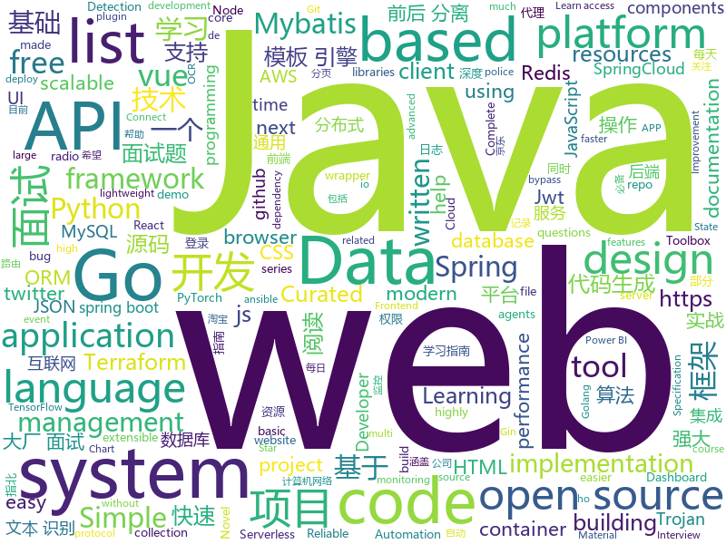

# 2020-06-03
See what the GitHub community is most excited about.

## python
+ [snakeware](https://github.com/joshiemoore/snakeware)(**543 stars today**): A free Linux distro with a fully Python userspace
+ [Police-Data-Accessibility-Project](https://github.com/Police-Data-Accessibility-Project/Police-Data-Accessibility-Project)(**154 stars today**): A repository for all code related to the Police Accountability Project
+ [acme](https://github.com/deepmind/acme)(**311 stars today**): A library of reinforcement learning components and agents
+ [mmdetection](https://github.com/open-mmlab/mmdetection)(**25 stars today**): Open MMLab Detection Toolbox and Benchmark
+ [django-rest-framework](https://github.com/encode/django-rest-framework)(**80 stars today**): Web APIs for Django.🎸
+ [fast-reid](https://github.com/JDAI-CV/fast-reid)(**32 stars today**): SOTA ReID Methods and Toolbox
+ [cpython](https://github.com/python/cpython)(**129 stars today**): The Python programming language
+ [ml-agents](https://github.com/Unity-Technologies/ml-agents)(**19 stars today**): Unity Machine Learning Agents Toolkit
+ [airflow](https://github.com/apache/airflow)(**18 stars today**): Apache Airflow - A platform to programmatically author, schedule, and monitor workflows
+ [bips](https://github.com/bitcoin/bips)(**3 stars today**): Bitcoin Improvement Proposals
+ [ansible](https://github.com/ansible/ansible)(**20 stars today**): Ansible is a radically simple IT automation platform that makes your applications and systems easier to deploy. Avoid writing scripts or custom code to deploy and update your applications — automate in a language that approaches plain English, using SSH, with no agents to install on remote systems. https://docs.ansible.com/ansible/
+ [python-small-examples](https://github.com/jackzhenguo/python-small-examples)(**18 stars today**): 告别枯燥，60 秒学会一个 Python 小例子
+ [PaddleOCR](https://github.com/PaddlePaddle/PaddleOCR)(**66 stars today**): 基于飞桨的OCR工具库，包含总模型仅8.6M的超轻量级中文OCR，单模型支持中英文数字组合识别、竖排文本识别、长文本识别。同时支持多种文本检测、文本识别的训练算法。
+ [transformers](https://github.com/huggingface/transformers)(**98 stars today**): 🤗Transformers: State-of-the-art Natural Language Processing for Pytorch and TensorFlow 2.0.
+ [poetry](https://github.com/python-poetry/poetry)(**40 stars today**): Python dependency management and packaging made easy.
+ [rq](https://github.com/rq/rq)(**41 stars today**): Simple job queues for Python
+ [httpx](https://github.com/encode/httpx)(**45 stars today**): A next generation HTTP client for Python.🦋
+ [pathfinder.vim](https://github.com/AlphaMycelium/pathfinder.vim)(**30 stars today**): Vim plugin which gives suggestions to improve your movements
+ [qiling](https://github.com/qilingframework/qiling)(**19 stars today**): Qiling Advanced Binary Emulation Framework
+ [mmaction](https://github.com/open-mmlab/mmaction)(**9 stars today**): An open-source toolbox for action understanding based on PyTorch
+ [detectron2](https://github.com/facebookresearch/detectron2)(**42 stars today**): Detectron2 is FAIR's next-generation platform for object detection and segmentation.
+ [pytorch-YOLOv4](https://github.com/Tianxiaomo/pytorch-YOLOv4)(**31 stars today**): Minimal PyTorch implementation of YOLOv4
+ [twitter-scraper](https://github.com/bisguzar/twitter-scraper)(**10 stars today**): Scrape the Twitter Frontend API without authentication.
+ [serverless-application-model](https://github.com/awslabs/serverless-application-model)(**7 stars today**): AWS Serverless Application Model (SAM) is an open-source framework for building serverless applications
+ [django](https://github.com/django/django)(**44 stars today**): The Web framework for perfectionists with deadlines.

## java
+ [InternetArchitect](https://github.com/bjmashibing/InternetArchitect)(**109 stars today**): 年薪百万互联网架构师课程文档及源码(公开部分)
+ [spring-analysis](https://github.com/seaswalker/spring-analysis)(**49 stars today**): Spring源码阅读
+ [vueblog](https://github.com/MarkerHub/vueblog)(**18 stars today**): 一个前后端分离的简单博客案例，适合刚入门vue，学前后端分离的童鞋！
+ [spring-framework](https://github.com/spring-projects/spring-framework)(**49 stars today**): Spring Framework
+ [light-reading-cloud](https://github.com/Zealon159/light-reading-cloud)(**120 stars today**): 📚轻松阅读，基于SpringCloud生态开发的阅读类APP微服务实战项目，涉及 SpringCloud-Config、Eureka、OpenFeign、Hystrix、Jwt、SpringCloud-Gateway、ElasticSearch 等技术栈的应用
+ [cwa-verification-portal](https://github.com/corona-warn-app/cwa-verification-portal)(**15 stars today**): Frontend implementation of verification process
+ [presto](https://github.com/prestodb/presto)(**4 stars today**): The official home of the Presto distributed SQL query engine for big data
+ [quarkus](https://github.com/quarkusio/quarkus)(**24 stars today**): Quarkus: Supersonic Subatomic Java.
+ [karate](https://github.com/intuit/karate)(**10 stars today**): Test Automation Made Simple
+ [interviewGuide](https://github.com/NotFound9/interviewGuide)(**34 stars today**): 《大厂面试指北》——Java后端面试题精选，包括Java基础、JVM、数据库、mysql、redis、计算机网络、算法、数据结构、操作系统、设计模式、系统设计、框架原理（获取《大厂面试指北》PDF版本请关注我的公众号"大厂面试"，技术交流可以扫主页的二维码进群，希望给我一个Star，谢谢！） 最佳阅读地址：http://notfound9.github.io/interviewGuide/
+ [spring-boot](https://github.com/spring-projects/spring-boot)(**66 stars today**): Spring Boot
+ [spring-security](https://github.com/spring-projects/spring-security)(**6 stars today**): Spring Security
+ [skywalking](https://github.com/apache/skywalking)(**30 stars today**): APM, Application Performance Monitoring System
+ [jeecg-boot](https://github.com/zhangdaiscott/jeecg-boot)(**67 stars today**): 基于代码生成器的快速开发平台，超越传统商业开发平台！前后端分离架构：SpringBoot 2.x，Ant Design&Vue，Mybatis-plus，Shiro，JWT。强大的代码生成器让前后端代码一键生成，无需写任何代码! 引领新开发模式(OnlineCoding-> 代码生成-> 手工MERGE)，帮助Java项目解决70%重复工作，让开发更关注业务逻辑，既能快速提高开发效率，帮助公司节省成本，同时又不失灵活性。
+ [sdrtrunk](https://github.com/DSheirer/sdrtrunk)(**7 stars today**): A cross-platform java application for decoding, monitoring, recording and streaming trunked mobile and related radio protocols using Software Defined Radios (SDR). Website:
+ [bazel](https://github.com/bazelbuild/bazel)(**11 stars today**): a fast, scalable, multi-language and extensible build system
+ [canal](https://github.com/alibaba/canal)(**23 stars today**): 阿里巴巴 MySQL binlog 增量订阅&消费组件
+ [SpringBoot-Labs](https://github.com/YunaiV/SpringBoot-Labs)(**39 stars today**): 一个涵盖六个专栏：Spring Boot 2.X、Spring Cloud、Spring Cloud Alibaba、Dubbo、分布式消息队列、分布式事务的仓库。希望胖友小手一抖，右上角来个 Star，感恩 1024
+ [cwa-testresult-server](https://github.com/corona-warn-app/cwa-testresult-server)(**12 stars today**): Backend implementation of the test result information.
+ [spring-boot-demo](https://github.com/xkcoding/spring-boot-demo)(**48 stars today**): spring boot demo 是一个用来深度学习并实战 spring boot 的项目，目前总共包含 65 个集成demo，已经完成 53 个。 该项目已成功集成 actuator(监控)、admin(可视化监控)、logback(日志)、aopLog(通过AOP记录web请求日志)、统一异常处理(json级别和页面级别)、freemarker(模板引擎)、thymeleaf(模板引擎)、Beetl(模板引擎)、Enjoy(模板引擎)、JdbcTemplate(通用JDBC操作数据库)、JPA(强大的ORM框架)、mybatis(强大的ORM框架)、通用Mapper(快速操作Mybatis)、PageHelper(通用的Mybatis分页插件)、mybatis-plus(快速操作M…
+ [bigbluebutton](https://github.com/bigbluebutton/bigbluebutton)(**15 stars today**): Complete open source web conferencing system.
+ [groovy](https://github.com/apache/groovy)(**6 stars today**): Apache Groovy: A powerful multi-faceted programming language for the JVM platform
+ [flowable-engine](https://github.com/flowable/flowable-engine)(**9 stars today**): A compact and highly efficient workflow and Business Process Management (BPM) platform for developers, system admins and business users.
+ [pentaho-kettle](https://github.com/pentaho/pentaho-kettle)(**8 stars today**): Pentaho Data Integration ( ETL ) a.k.a Kettle
+ [swagger-core](https://github.com/swagger-api/swagger-core)(**5 stars today**): Examples and server integrations for generating the Swagger API Specification, which enables easy access to your REST API

## unknown
+ [Resources-for-Beginner-Bug-Bounty-Hunters](https://github.com/nahamsec/Resources-for-Beginner-Bug-Bounty-Hunters)(**115 stars today**): A list of resources for those interested in getting started in bug bounties
+ [top10webseclist](https://github.com/irsdl/top10webseclist)(**88 stars today**): Top Ten Web Hacking Techniques List
+ [awesome-scalability](https://github.com/binhnguyennus/awesome-scalability)(**48 stars today**): The Patterns of Scalable, Reliable, and Performant Large-Scale Systems
+ [weekly](https://github.com/dt-fe/weekly)(**77 stars today**): 前端精读周刊
+ [cwa-documentation](https://github.com/corona-warn-app/cwa-documentation)(**99 stars today**): Project overview, general documentation, and white papers.
+ [data-police-shootings](https://github.com/washingtonpost/data-police-shootings)(**10 stars today**): The Washington Post is compiling a database of every fatal shooting in the United States by a police officer in the line of duty in 2015 and 2016.
+ [jetbrains-license-2020](https://github.com/imgVOID/jetbrains-license-2020)(**10 stars today**): JetBrains license servers 2020-2021 IntelliJ WebStorm PyCharm PhpStorm 04 April 2020 works; yo ho ho from Ukraine!
+ [design-resources-for-developers](https://github.com/bradtraversy/design-resources-for-developers)(**119 stars today**): Curated list of design and UI resources from stock photos, web templates, CSS frameworks, UI libraries, tools and much more
+ [You-Dont-Know-JS](https://github.com/getify/You-Dont-Know-JS)(**214 stars today**): A book series on JavaScript. @YDKJS on twitter.
+ [pandownload-login](https://github.com/TkzcM/pandownload-login)(**57 stars today**): 本地代理修复 Pandownload 登录失败
+ [3y](https://github.com/ZhongFuCheng3y/3y)(**44 stars today**): 📓从Java基础、JavaWeb基础到常用的框架再到面试题都有完整的教程，几乎涵盖了Java后端必备的知识点
+ [DeepLearningNotes](https://github.com/Sophia-11/DeepLearningNotes)(**24 stars today**): 《深度学习》花书手推笔记
+ [http3-note](https://github.com/flano-yuki/http3-note)(**45 stars today**): My HTTP/3 Note
+ [immuni-documentation](https://github.com/immuni-app/immuni-documentation)(**117 stars today**): Repo for Immuni's documentation.
+ [JavaInterview](https://github.com/OUYANGSIHAI/JavaInterview)(**49 stars today**): 【Java面试+Java后端技术学习指南】：一份通向理想互联网公司的面试指南，包括 Java，技术面试必备基础知识、Leetcode、计算机操作系统、计算机网络、系统设计、分布式、数据库（MySQL、Redis）、Java 项目实战等
+ [modern-cpp-features](https://github.com/AnthonyCalandra/modern-cpp-features)(**20 stars today**): A cheatsheet of modern C++ language and library features.
+ [awesome-reversing](https://github.com/tylerha97/awesome-reversing)(**9 stars today**): A curated list of awesome reversing resources
+ [JavaCollection](https://github.com/hansonwang99/JavaCollection)(**53 stars today**): Java开源项目之「自学编程之路」：学习指南+面试指南+资源分享+技术文章
+ [COVID-19](https://github.com/CSSEGISandData/COVID-19)(**38 stars today**): Novel Coronavirus (COVID-19) Cases, provided by JHU CSSE
+ [coronavirus-excess-mortality-data](https://github.com/Financial-Times/coronavirus-excess-mortality-data)(**29 stars today**): Excess mortality data compiled by the FT Visual & Data Journalism team
+ [Python-Core-50-Courses](https://github.com/jackfrued/Python-Core-50-Courses)(**21 stars today**): Python语言基础50课
+ [project-based-tutorials-in-c](https://github.com/rby90/project-based-tutorials-in-c)(**12 stars today**): A curated list of project-based tutorials in C
+ [Analyzing-Visualizing-Data-PowerBI](https://github.com/MicrosoftLearning/Analyzing-Visualizing-Data-PowerBI)(**5 stars today**): This repository contains the lab files and other resources for the free Microsoft course DAT207x: Analyzing and Visualizing Data with Power BI. To learn how to connect, explore, and visualize data with Power BI, sign up for this course on edX.
+ [corefx](https://github.com/dotnet/corefx)(**5 stars today**): CoreFX is the foundational class libraries for .NET Core. It includes types for collections, file systems, console, JSON, XML, async and many others.
+ [Flutter-Course-Resources](https://github.com/londonappbrewery/Flutter-Course-Resources)(**23 stars today**): Learn to Code While Building Apps - The Complete Flutter Development Bootcamp

## javascript
+ [nodebestpractices](https://github.com/goldbergyoni/nodebestpractices)(**421 stars today**): ✅The Node.js best practices list (June 2020)
+ [SpaceX-API](https://github.com/r-spacex/SpaceX-API)(**224 stars today**): 🚀Open Source REST API for rocket, core, capsule, pad, and launch data
+ [Font-Awesome](https://github.com/FortAwesome/Font-Awesome)(**20 stars today**): The iconic SVG, font, and CSS toolkit
+ [BrasilAPI](https://github.com/filipedeschamps/BrasilAPI)(**50 stars today**): Vamos transformar o Brasil em uma API?
+ [text-to-handwriting](https://github.com/saurabhdaware/text-to-handwriting)(**53 stars today**): So your teacher asked you to upload written assignments on ERP? Hate writing assigments? This tool will help you convert your text to handwriting xD
+ [image-scrubber](https://github.com/everestpipkin/image-scrubber)(**131 stars today**): A friendly browser-based tool for anonymizing photographs taken at protests
+ [material-ui](https://github.com/mui-org/material-ui)(**51 stars today**): React components for faster and easier web development. Build your own design system, or start with Material Design.
+ [learnxinyminutes-docs](https://github.com/adambard/learnxinyminutes-docs)(**109 stars today**): Code documentation written as code! How novel and totally my idea!
+ [fullstack-course4](https://github.com/jhu-ep-coursera/fullstack-course4)(**20 stars today**): Example code for HTML, CSS, and Javascript for Web Developers Coursera Course
+ [react-router](https://github.com/ReactTraining/react-router)(**42 stars today**): Declarative routing for React
+ [fe-interview](https://github.com/haizlin/fe-interview)(**20 stars today**): 前端面试每日 3+1，以面试题来驱动学习，提倡每日学习与思考，每天进步一点！每天早上5点纯手工发布面试题（死磕自己，愉悦大家）
+ [helper-618](https://github.com/ZainCheung/helper-618)(**249 stars today**): 🚀基于Autojs的淘宝/京东618自动刷任务项目，目前已支持京东叠蛋糕和淘宝列车。
+ [Base-React-App](https://github.com/panacloud/Base-React-App)(**4 stars today**): 
+ [Chart.js](https://github.com/chartjs/Chart.js)(**27 stars today**): Simple HTML5 Charts using the <canvas> tag
+ [sheetjs](https://github.com/SheetJS/sheetjs)(**24 stars today**): 📗SheetJS Community Edition -- Spreadsheet Data Toolkit
+ [insomnia](https://github.com/Kong/insomnia)(**14 stars today**): Leading Open Source API Client, and Collaborative API Design Platform for GraphQL, and REST
+ [ar-facedoodle](https://github.com/cyrildiagne/ar-facedoodle)(**29 stars today**): Doodle AR masks right from the browser with tensorflow.js
+ [fullcalendar](https://github.com/fullcalendar/fullcalendar)(**10 stars today**): Full-sized drag & drop event calendar
+ [react-window](https://github.com/bvaughn/react-window)(**15 stars today**): React components for efficiently rendering large lists and tabular data
+ [cypress](https://github.com/cypress-io/cypress)(**30 stars today**): Fast, easy and reliable testing for anything that runs in a browser.
+ [vue](https://github.com/qq281113270/vue)(**7 stars today**): vue源码逐行注释分析+40多m的vue源码程序流程图思维导图 （diff部分待后续更新）
+ [react-chartjs-2](https://github.com/jerairrest/react-chartjs-2)(**6 stars today**): React wrapper for Chart.js
+ [tech-interview-handbook](https://github.com/yangshun/tech-interview-handbook)(**37 stars today**): 💯Materials to help you rock your next coding interview
+ [cube.js](https://github.com/cube-js/cube.js)(**9 stars today**): 📊Cube.js - Open Source Analytics Framework
+ [redash](https://github.com/getredash/redash)(**14 stars today**): Make Your Company Data Driven. Connect to any data source, easily visualize, dashboard and share your data.

## html
+ [book-node-beyond-basics](https://github.com/jscomplete/book-node-beyond-basics)(**21 stars today**): Node Beyond the Basics - For questions https://jscomplete.com/help
+ [Graphics](https://github.com/Unity-Technologies/Graphics)(**5 stars today**): Unity Graphics - Including Scriptable Render Pipeline
+ [hyperblog](https://github.com/freddier/hyperblog)(**14 stars today**): Un blog increíble para el curso de Git y Github de Platzi
+ [machine-learning-systems-design](https://github.com/chiphuyen/machine-learning-systems-design)(**39 stars today**): A booklet on machine learning systems design with exercises
+ [Blog](https://github.com/yangkun19921001/Blog)(**19 stars today**): Android 面试宝典、数据结构和算法、音视频 (FFmpeg、AAC、x264、MediaCodec)、 C/C++ 、OpenCV、跨平台等学习记录
+ [webdevbootcamp](https://github.com/nax3t/webdevbootcamp)(**6 stars today**): All source code for back-end projects from the Web Developer Bootcamp
+ [v-calendar](https://github.com/nathanreyes/v-calendar)(**4 stars today**): A lightweight, dependency-free plugin for building attributed calendars in Vue.js
+ [json-viewer](https://github.com/tulios/json-viewer)(**3 stars today**): It is a Chrome extension for printing JSON and JSONP.
+ [design-blocks](https://github.com/froala/design-blocks)(**26 stars today**): A set of 170+ Bootstrap based design blocks ready to be used to create clean modern websites.
+ [free-for-dev](https://github.com/ripienaar/free-for-dev)(**34 stars today**): A list of SaaS, PaaS and IaaS offerings that have free tiers of interest to devops and infradev
+ [learning-area](https://github.com/mdn/learning-area)(**5 stars today**): Github repo for the MDN Learning Area.
+ [import-maps](https://github.com/WICG/import-maps)(**12 stars today**): How to control the behavior of JavaScript imports
+ [raytracing.github.io](https://github.com/RayTracing/raytracing.github.io)(**15 stars today**): Main Repo / Main Web Site
+ [riot-web](https://github.com/vector-im/riot-web)(**12 stars today**): A glossy Matrix collaboration client for the web.
+ [documents](https://github.com/ROBERT-proximity-tracing/documents)(**7 stars today**): Protocol specification, white paper, high level documents, etc.
+ [Java-Interview-Advanced](https://github.com/shishan100/Java-Interview-Advanced)(**8 stars today**): 中华石杉--互联网Java进阶面试训练营
+ [tabler](https://github.com/tabler/tabler)(**6 stars today**): Tabler is free and open-source HTML Dashboard UI Kit built on Bootstrap
+ [awesome-modern-cpp](https://github.com/rigtorp/awesome-modern-cpp)(**7 stars today**): A collection of resources on modern C++
+ [responsive-html-email-template](https://github.com/leemunroe/responsive-html-email-template)(**10 stars today**): A free simple responsive HTML email template
+ [DevOps-Guide](https://github.com/Tikam02/DevOps-Guide)(**7 stars today**): DevOps Guide from basic to advanced with Interview Questions and Notes🔥
+ [phpstan](https://github.com/phpstan/phpstan)(**7 stars today**): PHP Static Analysis Tool - discover bugs in your code without running it!
+ [EIPs](https://github.com/ethereum/EIPs)(**2 stars today**): The Ethereum Improvement Proposal repository
+ [Web-Development](https://github.com/Internshala-Online-Trainings/Web-Development)(**0 stars today**): 
+ [JavaScript30](https://github.com/wesbos/JavaScript30)(**8 stars today**): 30 Day Vanilla JS Challenge
+ [twemoji](https://github.com/twitter/twemoji)(**11 stars today**): Emoji for everyone. https://twemoji.twitter.com/

## go
+ [jupiter](https://github.com/douyu/jupiter)(**170 stars today**): Jupiter是douyu开源的面向服务治理的Golang微服务框架
+ [trojan-go](https://github.com/p4gefau1t/trojan-go)(**128 stars today**): Go实现的Trojan代理，支持自动证书申请/多路复用/路由功能/CDN中转，多平台，无依赖。A Trojan proxy written in Go. An unidentifiable mechanism that helps you bypass GFW. https://p4gefau1t.github.io/trojan-go/
+ [v2ray-core](https://github.com/v2ray/v2ray-core)(**135 stars today**): A platform for building proxies to bypass network restrictions.
+ [terraform-provider-aws](https://github.com/terraform-providers/terraform-provider-aws)(**8 stars today**): Terraform AWS provider
+ [rancher](https://github.com/rancher/rancher)(**16 stars today**): Complete container management platform
+ [influxdb](https://github.com/influxdata/influxdb)(**11 stars today**): Scalable datastore for metrics, events, and real-time analytics
+ [VictoriaMetrics](https://github.com/VictoriaMetrics/VictoriaMetrics)(**25 stars today**): VictoriaMetrics - fast, cost-effective and scalable time series database
+ [velero](https://github.com/vmware-tanzu/velero)(**10 stars today**): Backup and migrate Kubernetes applications and their persistent volumes
+ [MailHog](https://github.com/mailhog/MailHog)(**11 stars today**): Web and API based SMTP testing
+ [vault](https://github.com/hashicorp/vault)(**37 stars today**): A tool for secrets management, encryption as a service, and privileged access management
+ [gin](https://github.com/gin-gonic/gin)(**42 stars today**): Gin is a HTTP web framework written in Go (Golang). It features a Martini-like API with much better performance -- up to 40 times faster. If you need smashing performance, get yourself some Gin.
+ [concourse](https://github.com/concourse/concourse)(**4 stars today**): Concourse is a container-based continuous thing-doer written in Go and Elm.
+ [logrus](https://github.com/sirupsen/logrus)(**15 stars today**): Structured, pluggable logging for Go.
+ [terragrunt](https://github.com/gruntwork-io/terragrunt)(**5 stars today**): Terragrunt is a thin wrapper for Terraform that provides extra tools for working with multiple Terraform modules.
+ [charts](https://github.com/helm/charts)(**22 stars today**): Curated applications for Kubernetes
+ [sqlboiler](https://github.com/volatiletech/sqlboiler)(**11 stars today**): Generate a Go ORM tailored to your database schema.
+ [aws-sdk-go](https://github.com/aws/aws-sdk-go)(**5 stars today**): AWS SDK for the Go programming language.
+ [immudb](https://github.com/codenotary/immudb)(**74 stars today**): immudb is a lightweight, high-speed immutable database for systems and applications
+ [go-git](https://github.com/go-git/go-git)(**45 stars today**): A highly extensible Git implementation in pure Go.
+ [terraform-provider-kubernetes](https://github.com/terraform-providers/terraform-provider-kubernetes)(**1 stars today**): Terraform Kubernetes provider
+ [redis](https://github.com/go-redis/redis)(**6 stars today**): Type-safe Redis client for Golang
+ [errors](https://github.com/pkg/errors)(**12 stars today**): Simple error handling primitives
+ [kubernetes](https://github.com/kubernetes/kubernetes)(**53 stars today**): Production-Grade Container Scheduling and Management
+ [gin-vue-admin](https://github.com/flipped-aurora/gin-vue-admin)(**21 stars today**): 基于gin+vue搭建的后台管理系统框架，集成jwt鉴权，权限管理，动态路由，分页封装，多点登录拦截，资源权限，上传下载，代码生成器，表单生成器等基础功能，更多功能正在开发中，欢迎issue和pr~
+ [grpc-go](https://github.com/grpc/grpc-go)(**16 stars today**): The Go language implementation of gRPC. HTTP/2 based RPC

## WordCloud

