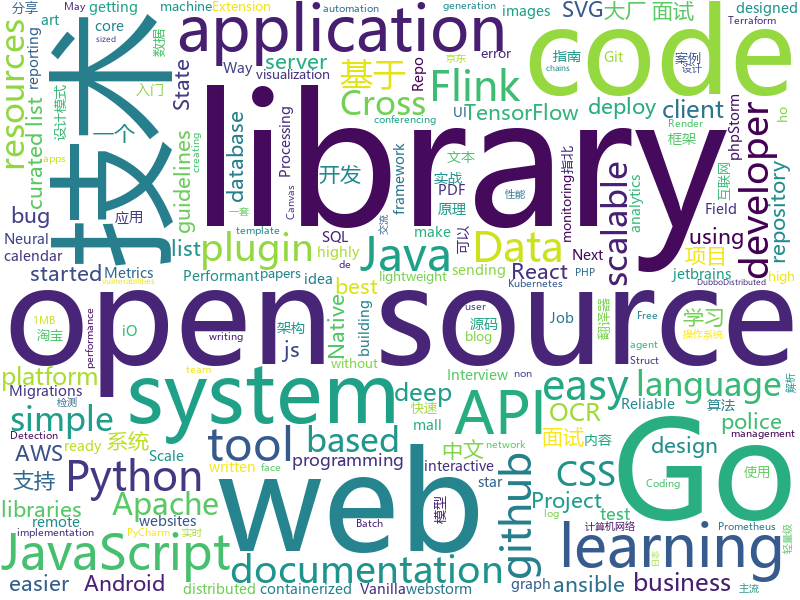

# 2020-06-05
See what the GitHub community is most excited about.

## python
+ [avatarify](https://github.com/alievk/avatarify)(**83 stars today**): Avatars for Zoom, Skype and other video-conferencing apps.
+ [DeepFaceLab](https://github.com/iperov/DeepFaceLab)(**315 stars today**): DeepFaceLab is the leading software for creating deepfakes.
+ [locust](https://github.com/locustio/locust)(**19 stars today**): Scalable user load testing tool written in Python
+ [acme](https://github.com/deepmind/acme)(**242 stars today**): A library of reinforcement learning components and agents
+ [altair](https://github.com/altair-viz/altair)(**164 stars today**): Declarative statistical visualization library for Python
+ [police-brutality](https://github.com/2020PB/police-brutality)(**179 stars today**): Repository containing evidence of police brutality during the 2020 George Floyd protests
+ [Police-Data-Accessibility-Project](https://github.com/Police-Data-Accessibility-Project/Police-Data-Accessibility-Project)(**95 stars today**): A repository for all code related to the Police Data Accessibility Project
+ [d2l-en](https://github.com/d2l-ai/d2l-en)(**97 stars today**): An interactive deep learning book with code, math, and discussions.
+ [Dango-Translator](https://github.com/PantsuDango/Dango-Translator)(**178 stars today**): 团子翻译器 —— 个人兴趣制作的一款基于OCR技术的翻译器
+ [pytorch_geometric](https://github.com/rusty1s/pytorch_geometric)(**16 stars today**): Geometric Deep Learning Extension Library for PyTorch
+ [WebWhatsapp-Wrapper](https://github.com/mukulhase/WebWhatsapp-Wrapper)(**4 stars today**): An API for sending and receiving messages over web.whatsapp [Working as of 18th May 2018]
+ [httpx](https://github.com/encode/httpx)(**37 stars today**): A next generation HTTP client for Python.🦋
+ [hue](https://github.com/cloudera/hue)(**5 stars today**): Open source SQL Query Assistant for Databases/Warehouses
+ [Shodanfy.py](https://github.com/m4ll0k/Shodanfy.py)(**57 stars today**): Get ports,vulnerabilities,informations,banners,..etc for any IP with Shodan (no apikey! no rate-limit!)
+ [incubator-superset](https://github.com/apache/incubator-superset)(**19 stars today**): Apache Superset (incubating) is a modern, enterprise-ready business intelligence web application
+ [sentry](https://github.com/getsentry/sentry)(**10 stars today**): Sentry is cross-platform application monitoring, with a focus on error reporting.
+ [stylegan2](https://github.com/NVlabs/stylegan2)(**18 stars today**): StyleGAN2 - Official TensorFlow Implementation
+ [CppCoreGuidelines](https://github.com/isocpp/CppCoreGuidelines)(**15 stars today**): The C++ Core Guidelines are a set of tried-and-true guidelines, rules, and best practices about coding in C++
+ [ansible](https://github.com/ansible/ansible)(**24 stars today**): Ansible is a radically simple IT automation platform that makes your applications and systems easier to deploy. Avoid writing scripts or custom code to deploy and update your applications — automate in a language that approaches plain English, using SSH, with no agents to install on remote systems. https://docs.ansible.com/ansible/
+ [Face-Mask-Detection](https://github.com/chandrikadeb7/Face-Mask-Detection)(**26 stars today**): Face Mask Detection system based on computer vision and deep learning using OpenCV and Tensorflow/Keras
+ [hermione](https://github.com/A3Data/hermione)(**11 stars today**): ML made simple
+ [python-small-examples](https://github.com/jackzhenguo/python-small-examples)(**22 stars today**): 告别枯燥，60 秒学会一个 Python 小例子
+ [PaddleOCR](https://github.com/PaddlePaddle/PaddleOCR)(**31 stars today**): OCR toolkit based on PaddlePaddle （基于飞桨的OCR工具库，包含总模型仅8.6M的超轻量级中文OCR，同时支持多种文本检测、文本识别的训练算法。）
+ [transformers](https://github.com/huggingface/transformers)(**85 stars today**): 🤗Transformers: State-of-the-art Natural Language Processing for Pytorch and TensorFlow 2.0.
+ [Ultra-Light-Fast-Generic-Face-Detector-1MB](https://github.com/Linzaer/Ultra-Light-Fast-Generic-Face-Detector-1MB)(**11 stars today**): 💎1MB lightweight face detection model (1MB轻量级人脸检测模型)

## java
+ [Signal-Android](https://github.com/signalapp/Signal-Android)(**12 stars today**): A private messenger for Android.
+ [dropwizard](https://github.com/dropwizard/dropwizard)(**4 stars today**): A damn simple library for building production-ready RESTful web services.
+ [flink-learning](https://github.com/zhisheng17/flink-learning)(**22 stars today**): flink learning blog. http://www.54tianzhisheng.cn 含 Flink 入门、概念、原理、实战、性能调优、源码解析等内容。涉及 Flink Connector、Metrics、Library、DataStream API、Table API & SQL 等内容的学习案例，还有 Flink 落地应用的大型项目案例（PVUV、日志存储、百亿数据实时去重、监控告警）分享。欢迎大家支持我的专栏《大数据实时计算引擎 Flink 实战与性能优化》
+ [MVVMHabit](https://github.com/goldze/MVVMHabit)(**15 stars today**): 👕基于谷歌最新AAC架构，MVVM设计模式的一套快速开发库，整合Okhttp+RxJava+Retrofit+Glide等主流模块，满足日常开发需求。使用该框架可以快速开发一个高质量、易维护的Android应用。
+ [druid](https://github.com/apache/druid)(**8 stars today**): Apache Druid: a high performance real-time analytics database.
+ [shardingsphere-elastic-job-lite](https://github.com/apache/shardingsphere-elastic-job-lite)(**14 stars today**): Elastic-Job is a distributed scheduled job framework, based on Quartz and Zookeeper.
+ [sqlancer](https://github.com/sqlancer/sqlancer)(**11 stars today**): Detecting Logic Bugs in DBMS
+ [IntelliJLicence](https://github.com/coffee-at-2am/IntelliJLicence)(**3 stars today**): Intellij idea licence for non-commercial use
+ [cordova-plugin-inappbrowser](https://github.com/apache/cordova-plugin-inappbrowser)(**0 stars today**): Apache Cordova Plugin inappbrowser
+ [flowable-engine](https://github.com/flowable/flowable-engine)(**6 stars today**): A compact and highly efficient workflow and Business Process Management (BPM) platform for developers, system admins and business users.
+ [CS-Notes](https://github.com/CyC2018/CS-Notes)(**87 stars today**): 📚技术面试必备基础知识、Leetcode、计算机操作系统、计算机网络、系统设计、Java、Python、C++
+ [hudi](https://github.com/apache/hudi)(**7 stars today**): Upserts, Deletes And Incremental Processing on Big Data.
+ [lottie-android](https://github.com/airbnb/lottie-android)(**16 stars today**): Render After Effects animations natively on Android and iOS, Web, and React Native
+ [bigbluebutton](https://github.com/bigbluebutton/bigbluebutton)(**3 stars today**): Complete open source web conferencing system.
+ [toBeTopJavaer](https://github.com/hollischuang/toBeTopJavaer)(**23 stars today**): To Be Top Javaer - Java工程师成神之路
+ [rocketmq](https://github.com/apache/rocketmq)(**20 stars today**): Mirror of Apache RocketMQ
+ [hive](https://github.com/apache/hive)(**2 stars today**): Apache Hive
+ [interviewGuide](https://github.com/NotFound9/interviewGuide)(**18 stars today**): 《大厂面试指北》——Java后端面试题精选，包括Java基础、JVM、数据库、mysql、redis、计算机网络、算法、数据结构、操作系统、设计模式、系统设计、框架原理（获取《大厂面试指北》PDF版本请关注我的公众号"大厂面试"，技术交流可以扫主页的二维码进群，希望给我一个Star，谢谢！） 最佳阅读地址：http://notfound9.github.io/interviewGuide/
+ [graylog2-server](https://github.com/Graylog2/graylog2-server)(**2 stars today**): Free and open source log management
+ [SDE-Interview-Questions](https://github.com/rishabh115/SDE-Interview-Questions)(**7 stars today**): Most comprehensive list📋of tech interview questions📘of companies scraped from Geeksforgeeks, CareerCup and Glassdoor.
+ [InternetArchitect](https://github.com/bjmashibing/InternetArchitect)(**145 stars today**): 年薪百万互联网架构师课程文档及源码(公开部分)
+ [java-docs-samples](https://github.com/GoogleCloudPlatform/java-docs-samples)(**3 stars today**): 
+ [mall-learning](https://github.com/macrozheng/mall-learning)(**18 stars today**): mall学习教程，架构、业务、技术要点全方位解析。mall项目（25k+star）是一套电商系统，使用现阶段主流技术实现。 涵盖了SpringBoot2.1.3、MyBatis3.4.6、Elasticsearch6.2.2、RabbitMQ3.7.15、Redis3.2、Mongodb3.2、Mysql5.7等技术，采用Docker容器化部署。
+ [react-native-push-notification](https://github.com/zo0r/react-native-push-notification)(**7 stars today**): React Native Local and Remote Notifications
+ [jib](https://github.com/GoogleContainerTools/jib)(**8 stars today**): 🏗Build container images for your Java applications.

## unknown
+ [jetbrains-agent](https://github.com/nickchou/jetbrains-agent)(**124 stars today**): jetbrains agent
+ [data-police-shootings](https://github.com/washingtonpost/data-police-shootings)(**26 stars today**): The Washington Post is compiling a database of every fatal shooting in the United States by a police officer in the line of duty in 2015 and 2016.
+ [design-resources-for-developers](https://github.com/bradtraversy/design-resources-for-developers)(**131 stars today**): Curated list of design and UI resources from stock photos, web templates, CSS frameworks, UI libraries, tools and much more
+ [awesome-scalability](https://github.com/binhnguyennus/awesome-scalability)(**89 stars today**): The Patterns of Scalable, Reliable, and Performant Large-Scale Systems
+ [learn-regex](https://github.com/ziishaned/learn-regex)(**26 stars today**): Learn regex the easy way
+ [weekly](https://github.com/dt-fe/weekly)(**74 stars today**): 前端精读周刊
+ [free-code](https://github.com/wenyanjun/free-code)(**9 stars today**): webstorm idea phpStorm pycharm 提供激活码和jar激活方式QQ技术交流②群 272712006
+ [top10webseclist](https://github.com/irsdl/top10webseclist)(**136 stars today**): Top Ten Web Hacking Techniques List
+ [circular-credit-card-radio](https://github.com/cheungbx/circular-credit-card-radio)(**6 stars today**): 
+ [JavaCollection](https://github.com/hansonwang99/JavaCollection)(**70 stars today**): Java开源项目之「自学编程之路」：学习指南+面试指南+资源分享+技术文章
+ [jetbrains-license-2020](https://github.com/imgVOID/jetbrains-license-2020)(**14 stars today**): JetBrains license servers 2020-2021 IntelliJ WebStorm PyCharm PhpStorm 05 May 2020 works; yo ho ho from Ukraine!
+ [immuni-documentation](https://github.com/immuni-app/immuni-documentation)(**20 stars today**): Repo for Immuni's documentation.
+ [GNNPapers](https://github.com/thunlp/GNNPapers)(**9 stars today**): Must-read papers on graph neural networks (GNN)
+ [Resources-for-Beginner-Bug-Bounty-Hunters](https://github.com/nahamsec/Resources-for-Beginner-Bug-Bounty-Hunters)(**70 stars today**): A list of resources for those interested in getting started in bug bounties
+ [OpenAPI-Specification](https://github.com/OAI/OpenAPI-Specification)(**16 stars today**): The OpenAPI Specification Repository
+ [Awesome](https://github.com/Awesome-Windows/Awesome)(**12 stars today**): 💻🎉An awesome & curated list of best applications and tools for Windows.
+ [Interview_Question_for_Beginner](https://github.com/JaeYeopHan/Interview_Question_for_Beginner)(**15 stars today**): 👦👧Technical-Interview guidelines written for those who started studying programming. I wish you all the best.👾
+ [cwa-documentation](https://github.com/corona-warn-app/cwa-documentation)(**85 stars today**): Project overview, general documentation, and white papers.
+ [readme-template](https://github.com/dbader/readme-template)(**4 stars today**): README.md template for your open-source project
+ [awesome-grpc](https://github.com/grpc-ecosystem/awesome-grpc)(**5 stars today**): A curated list of useful resources for gRPC
+ [COVID-19](https://github.com/pcm-dpc/COVID-19)(**3 stars today**): COVID-19 Italia - Monitoraggio situazione
+ [Unsupervised-Classification](https://github.com/wvangansbeke/Unsupervised-Classification)(**9 stars today**): Learning To Classify Images Without Labels
+ [Git-Commands](https://github.com/joshnh/Git-Commands)(**3 stars today**): A list of commonly used Git commands
+ [Python-programming-exercises](https://github.com/zhiwehu/Python-programming-exercises)(**13 stars today**): 100+ Python challenging programming exercises
+ [flutter_roadmap](https://github.com/olexale/flutter_roadmap)(**4 stars today**): Highly Subjective Roadmap to Flutter Development

## javascript
+ [SpaceX-API](https://github.com/r-spacex/SpaceX-API)(**460 stars today**): 🚀Open Source REST API for rocket, core, capsule, pad, and launch data
+ [Font-Awesome](https://github.com/FortAwesome/Font-Awesome)(**69 stars today**): The iconic SVG, font, and CSS toolkit
+ [d3](https://github.com/d3/d3)(**21 stars today**): Bring data to life with SVG, Canvas and HTML.📊📈🎉
+ [Chart.js](https://github.com/chartjs/Chart.js)(**30 stars today**): Simple HTML5 Charts using the <canvas> tag
+ [hngi7-task2](https://github.com/sixpathdev/hngi7-task2)(**12 stars today**): 
+ [BrasilAPI](https://github.com/filipedeschamps/BrasilAPI)(**114 stars today**): Vamos transformar o Brasil em uma API?
+ [react-typescript-cheatsheet](https://github.com/typescript-cheatsheets/react-typescript-cheatsheet)(**92 stars today**): Cheatsheets for experienced React developers getting started with TypeScript
+ [markdown-here](https://github.com/adam-p/markdown-here)(**27 stars today**): Google Chrome, Firefox, and Thunderbird extension that lets you write email in Markdown and render it before sending.
+ [HNG-Script](https://github.com/elishaukpong/HNG-Script)(**4 stars today**): 
+ [Leaflet](https://github.com/Leaflet/Leaflet)(**17 stars today**): 🍃JavaScript library for mobile-friendly interactive maps
+ [HNGi7_Titans_Task2](https://github.com/team-titians/HNGi7_Titans_Task2)(**3 stars today**): 
+ [eslint](https://github.com/eslint/eslint)(**3 stars today**): Find and fix problems in your JavaScript code.
+ [HNG-Task-2-Team-Falcon](https://github.com/anubabajide/HNG-Task-2-Team-Falcon)(**5 stars today**): Team Falcon submission repository for the second task in HNG.
+ [team-superman-hngi7](https://github.com/DreyWesson/team-superman-hngi7)(**4 stars today**): 
+ [emotion](https://github.com/emotion-js/emotion)(**14 stars today**): 👩‍🎤CSS-in-JS library designed for high performance style composition
+ [HNG_storm-task](https://github.com/Seymaster/HNG_storm-task)(**7 stars today**): task answer
+ [mobx](https://github.com/mobxjs/mobx)(**11 stars today**): Simple, scalable state management.
+ [docusaurus](https://github.com/facebook/docusaurus)(**39 stars today**): Easy to maintain open source documentation websites.
+ [ccxt](https://github.com/ccxt/ccxt)(**12 stars today**): A JavaScript / Python / PHP cryptocurrency trading API with support for more than 120 bitcoin/altcoin exchanges
+ [statsd](https://github.com/statsd/statsd)(**5 stars today**): Daemon for easy but powerful stats aggregation
+ [next-auth](https://github.com/iaincollins/next-auth)(**16 stars today**): An authentication library for Next.js projects
+ [odoo](https://github.com/odoo/odoo)(**13 stars today**): Odoo. Open Source Apps To Grow Your Business.
+ [jsPDF](https://github.com/MrRio/jsPDF)(**16 stars today**): Client-side JavaScript PDF generation for everyone.
+ [fullcalendar](https://github.com/fullcalendar/fullcalendar)(**17 stars today**): Full-sized drag & drop event calendar
+ [helper-618](https://github.com/ZainCheung/helper-618)(**87 stars today**): 🚀基于Autojs的淘宝/京东618自动刷任务项目，目前已支持京东叠蛋糕和淘宝列车。

## html
+ [machine-learning-systems-design](https://github.com/chiphuyen/machine-learning-systems-design)(**32 stars today**): A booklet on machine learning systems design with exercises
+ [riot-web](https://github.com/vector-im/riot-web)(**4 stars today**): A glossy Matrix collaboration client for the web.
+ [devdocs](https://github.com/magento/devdocs)(**1 stars today**): Magento Developer Documentation
+ [nndl.github.io](https://github.com/nndl/nndl.github.io)(**20 stars today**): 《神经网络与深度学习》 邱锡鹏著 Neural Network and Deep Learning
+ [glTF](https://github.com/KhronosGroup/glTF)(**1 stars today**): glTF – Runtime 3D Asset Delivery
+ [all-contributors](https://github.com/all-contributors/all-contributors)(**6 stars today**): ✨Recognize all contributors, not just the ones who push code✨
+ [flag-icon-css](https://github.com/lipis/flag-icon-css)(**5 stars today**): 🎏A collection of all country flags in SVG — plus the CSS for easier integration
+ [hyperblog](https://github.com/freddier/hyperblog)(**6 stars today**): Un blog increíble para el curso de Git y Github de Platzi
+ [styleguide](https://github.com/google/styleguide)(**13 stars today**): Style guides for Google-originated open-source projects
+ [rellax](https://github.com/dixonandmoe/rellax)(**3 stars today**): Lightweight, vanilla javascript parallax library
+ [import-maps](https://github.com/WICG/import-maps)(**4 stars today**): How to control the behavior of JavaScript imports
+ [gohugo-theme-ananke](https://github.com/budparr/gohugo-theme-ananke)(**1 stars today**): Ananke: A theme for Hugo Sites
+ [expressjs.com](https://github.com/expressjs/expressjs.com)(**2 stars today**): 
+ [awesome-creative-coding](https://github.com/terkelg/awesome-creative-coding)(**11 stars today**): Creative Coding: Generative Art, Data visualization, Interaction Design, Resources.
+ [fastText](https://github.com/facebookresearch/fastText)(**10 stars today**): Library for fast text representation and classification.
+ [Police-Data-Accessibility-Project.github.io](https://github.com/Police-Data-Accessibility-Project/Police-Data-Accessibility-Project.github.io)(**7 stars today**): PDAP github page
+ [serenity-core](https://github.com/serenity-bdd/serenity-core)(**1 stars today**): Serenity BDD is a test automation library designed to make writing automated acceptance tests easier, and more fun.
+ [learning-area](https://github.com/mdn/learning-area)(**6 stars today**): Github repo for the MDN Learning Area.
+ [phpstan](https://github.com/phpstan/phpstan)(**8 stars today**): PHP Static Analysis Tool - discover bugs in your code without running it!
+ [tiny-slider](https://github.com/ganlanyuan/tiny-slider)(**4 stars today**): Vanilla javascript slider for all purposes.
+ [webdevbootcamp](https://github.com/nax3t/webdevbootcamp)(**5 stars today**): All source code for back-end projects from the Web Developer Bootcamp
+ [ML-notes](https://github.com/Sakura-gh/ML-notes)(**17 stars today**): notes about machine learning
+ [v-calendar](https://github.com/nathanreyes/v-calendar)(**4 stars today**): A lightweight, dependency-free plugin for building attributed calendars in Vue.js
+ [Java-Interview-Advanced](https://github.com/shishan100/Java-Interview-Advanced)(**7 stars today**): 中华石杉--互联网Java进阶面试训练营
+ [PowerBI-visuals](https://github.com/microsoft/PowerBI-visuals)(**2 stars today**): Documentation for creating visuals for Power BI

## go
+ [logrus](https://github.com/sirupsen/logrus)(**14 stars today**): Structured, pluggable logging for Go.
+ [terraform-provider-aws](https://github.com/terraform-providers/terraform-provider-aws)(**5 stars today**): Terraform AWS provider
+ [telegraf](https://github.com/influxdata/telegraf)(**5 stars today**): The plugin-driven server agent for collecting & reporting metrics.
+ [gh-ost](https://github.com/github/gh-ost)(**12 stars today**): GitHub's Online Schema Migrations for MySQL
+ [statping](https://github.com/statping/statping)(**42 stars today**): Status Page for monitoring your websites and applications with beautiful graphs, analytics, and plugins. Run on any type of environment.
+ [terraform](https://github.com/hashicorp/terraform)(**27 stars today**): Terraform enables you to safely and predictably create, change, and improve infrastructure. It is an open source tool that codifies APIs into declarative configuration files that can be shared amongst team members, treated as code, edited, reviewed, and versioned.
+ [aws-sdk-go](https://github.com/aws/aws-sdk-go)(**8 stars today**): AWS SDK for the Go programming language.
+ [dubbo-go](https://github.com/apache/dubbo-go)(**29 stars today**): Go Implementation For Apache Dubbo
+ [ion](https://github.com/pion/ion)(**6 stars today**): Distributed RTC System by pure Go and Flutter
+ [volcano](https://github.com/volcano-sh/volcano)(**8 stars today**): A Kubernetes Native Batch System (Project under CNCF)
+ [grpc-go](https://github.com/grpc/grpc-go)(**13 stars today**): The Go language implementation of gRPC. HTTP/2 based RPC
+ [errors](https://github.com/pkg/errors)(**8 stars today**): Simple error handling primitives
+ [migrate](https://github.com/golang-migrate/migrate)(**9 stars today**): Database migrations. CLI and Golang library.
+ [gauge](https://github.com/getgauge/gauge)(**4 stars today**): Light weight cross-platform test automation
+ [external-storage](https://github.com/kubernetes-incubator/external-storage)(**5 stars today**): External storage plugins, provisioners, and helper libraries
+ [the-way-to-go_ZH_CN](https://github.com/unknwon/the-way-to-go_ZH_CN)(**31 stars today**): 《The Way to Go》中文译本，中文正式名《Go 入门指南》
+ [velero](https://github.com/vmware-tanzu/velero)(**12 stars today**): Backup and migrate Kubernetes applications and their persistent volumes
+ [cortex](https://github.com/cortexproject/cortex)(**5 stars today**): A horizontally scalable, highly available, multi-tenant, long term Prometheus.
+ [aws-lambda-go](https://github.com/aws/aws-lambda-go)(**3 stars today**): Libraries, samples and tools to help Go developers develop AWS Lambda functions.
+ [validator](https://github.com/go-playground/validator)(**7 stars today**): 💯Go Struct and Field validation, including Cross Field, Cross Struct, Map, Slice and Array diving
+ [etcd](https://github.com/etcd-io/etcd)(**31 stars today**): Distributed reliable key-value store for the most critical data of a distributed system
+ [redigo](https://github.com/gomodule/redigo)(**8 stars today**): Go client for Redis
+ [nomad](https://github.com/hashicorp/nomad)(**5 stars today**): Nomad is an easy-to-use, flexible, and performant workload orchestrator that can deploy a mix of microservice, batch, containerized, and non-containerized applications. Nomad is easy to operate and scale and has native Consul and Vault integrations.
+ [coredns](https://github.com/coredns/coredns)(**10 stars today**): CoreDNS is a DNS server that chains plugins
+ [loki](https://github.com/grafana/loki)(**10 stars today**): Like Prometheus, but for logs.

## WordCloud

