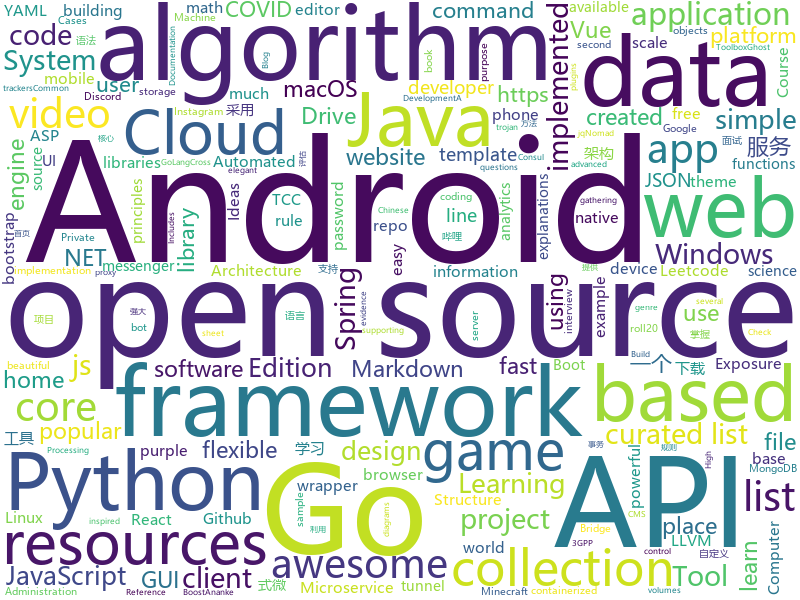

# 2020-06-07
See what the GitHub community is most excited about.

## python
+ [genetic-drawing](https://github.com/anopara/genetic-drawing)(**398 stars today**): A genetic algorithm toy project for drawing
+ [DeepFaceLab](https://github.com/iperov/DeepFaceLab)(**438 stars today**): DeepFaceLab is the leading software for creating deepfakes.
+ [avatarify](https://github.com/alievk/avatarify)(**234 stars today**): Avatars for Zoom, Skype and other video-conferencing apps.
+ [Python](https://github.com/TheAlgorithms/Python)(**212 stars today**): All Algorithms implemented in Python
+ [d2l-en](https://github.com/d2l-ai/d2l-en)(**150 stars today**): An interactive deep learning book with code, math, and discussions.
+ [fast-reid](https://github.com/JDAI-CV/fast-reid)(**81 stars today**): SOTA ReID Methods and Toolbox
+ [ghost](https://github.com/entynetproject/ghost)(**11 stars today**): Ghost Framework is an Android post-exploitation framework that exploits the Android Debug Bridge to remotely access an Android device. Ghost Framework gives you the power and convenience of remote Android device administration.
+ [WebWhatsapp-Wrapper](https://github.com/mukulhase/WebWhatsapp-Wrapper)(**18 stars today**): An API for sending and receiving messages over web.whatsapp [Working as of 18th May 2018]
+ [machine_learning_examples](https://github.com/lazyprogrammer/machine_learning_examples)(**8 stars today**): A collection of machine learning examples and tutorials.
+ [hosts](https://github.com/StevenBlack/hosts)(**55 stars today**): Consolidating and Extending hosts files from several well-curated sources. You can optionally pick extensions to block Porn, Social Media, and other categories..
+ [manim](https://github.com/3b1b/manim)(**46 stars today**): Animation engine for explanatory math videos
+ [Veil](https://github.com/Veil-Framework/Veil)(**7 stars today**): Veil 3.1.X (Check version info in Veil at runtime)
+ [Practical-Ethical-Hacking-Resources](https://github.com/Gr1mmie/Practical-Ethical-Hacking-Resources)(**17 stars today**): Compilation of Resources from TCM's Practical Ethical Hacking Udemy Course
+ [core](https://github.com/home-assistant/core)(**39 stars today**): 🏡Open source home automation that puts local control and privacy first
+ [python-small-examples](https://github.com/jackzhenguo/python-small-examples)(**77 stars today**): 告别枯燥，60 秒学会一个 Python 小例子
+ [pandas](https://github.com/pandas-dev/pandas)(**22 stars today**): Flexible and powerful data analysis / manipulation library for Python, providing labeled data structures similar to R data.frame objects, statistical functions, and much more
+ [InstaPy](https://github.com/timgrossmann/InstaPy)(**13 stars today**): 📷Instagram Bot - Tool for automated Instagram interactions
+ [face_recognition](https://github.com/ageitgey/face_recognition)(**21 stars today**): The world's simplest facial recognition api for Python and the command line
+ [system-design-primer](https://github.com/donnemartin/system-design-primer)(**97 stars today**): Learn how to design large-scale systems. Prep for the system design interview. Includes Anki flashcards.
+ [Games](https://github.com/CharlesPikachu/Games)(**12 stars today**): Some games created by python code.
+ [alpha_vantage](https://github.com/RomelTorres/alpha_vantage)(**5 stars today**): A python wrapper for Alpha Vantage API for financial data.
+ [samplemod](https://github.com/navdeep-G/samplemod)(**3 stars today**): 
+ [javsdt](https://github.com/javsdt/javsdt)(**7 stars today**): 影片信息整理工具，抓取元数据nfo，自定义重命名文件(夹)，下载fanart裁剪poster，为emby、kodi、极影派铺路。
+ [sigma](https://github.com/Neo23x0/sigma)(**5 stars today**): Generic Signature Format for SIEM Systems
+ [youtube-dl](https://github.com/ytdl-org/youtube-dl)(**53 stars today**): Command-line program to download videos from YouTube.com and other video sites

## java
+ [ide-eval-resetter](https://github.com/pengzhile/ide-eval-resetter)(**63 stars today**): Reset your IDE eval information.
+ [CS-Notes](https://github.com/CyC2018/CS-Notes)(**167 stars today**): 📚技术面试必备基础知识、Leetcode、计算机操作系统、计算机网络、系统设计、Java、Python、C++
+ [Java](https://github.com/TheAlgorithms/Java)(**108 stars today**): All Algorithms implemented in Java
+ [Signal-Android](https://github.com/signalapp/Signal-Android)(**45 stars today**): A private messenger for Android.
+ [k-9](https://github.com/k9mail/k-9)(**4 stars today**): K-9 Mail – Open Source Email App for Android
+ [igniter](https://github.com/trojan-gfw/igniter)(**15 stars today**): A trojan client for Android (UNDER CONSTRUCTION).
+ [Geyser](https://github.com/GeyserMC/Geyser)(**5 stars today**): A bridge/proxy allowing you to connect to Minecraft: Java Edition servers with Minecraft: Bedrock edition.
+ [Algorithms](https://github.com/williamfiset/Algorithms)(**14 stars today**): A collection of algorithms and data structures
+ [runelite](https://github.com/runelite/runelite)(**2 stars today**): Open source Old School RuneScape client
+ [Telegram](https://github.com/DrKLO/Telegram)(**13 stars today**): Telegram for Android source
+ [piggymetrics](https://github.com/sqshq/piggymetrics)(**8 stars today**): Microservice Architecture with Spring Boot, Spring Cloud and Docker
+ [CommonUtil](https://github.com/LJWLgl/CommonUtil)(**18 stars today**): 轻便简单的Java常用工具类库
+ [mlkit](https://github.com/googlesamples/mlkit)(**3 stars today**): 
+ [say-their-names-android](https://github.com/Say-Their-Name/say-their-names-android)(**3 stars today**): 
+ [android](https://github.com/owncloud/android)(**1 stars today**): ☎️The ownCloud Android App
+ [EhViewer](https://github.com/seven332/EhViewer)(**8 stars today**): [DEPRECATED] An Unofficial E-Hentai Application for Android
+ [JDA](https://github.com/DV8FromTheWorld/JDA)(**3 stars today**): Java wrapper for the popular chat & VOIP service: Discord https://discordapp.com
+ [SpringBootVulExploit](https://github.com/LandGrey/SpringBootVulExploit)(**54 stars today**): SpringBoot 相关漏洞学习资料，利用方法和技巧合集，黑盒安全评估 checklist
+ [fabric](https://github.com/FabricMC/fabric)(**3 stars today**): Essential hooks and patches for modding with Fabric.
+ [JavaGuide](https://github.com/Snailclimb/JavaGuide)(**81 stars today**): 「Java学习+面试指南」一份涵盖大部分Java程序员所需要掌握的核心知识。
+ [Pix-EzViewer](https://github.com/Notsfsssf/Pix-EzViewer)(**8 stars today**): 一个支持免代理直连及查看动图的第三方Pixiv android客户端
+ [tcc-transaction](https://github.com/changmingxie/tcc-transaction)(**4 stars today**): tcc-transaction是TCC型事务java实现
+ [lucene-solr](https://github.com/apache/lucene-solr)(**4 stars today**): Apache Lucene and Solr open-source search software
+ [SpringBlade](https://github.com/chillzhuang/SpringBlade)(**33 stars today**): SpringBlade 是一个由商业级项目升级优化而来的SpringCloud分布式微服务架构、SpringBoot单体式微服务架构并存的综合型项目，采用Java8 API重构了业务代码，完全遵循阿里巴巴编码规范。采用Spring Boot 2 、Spring Cloud Hoxton 、Mybatis 等核心技术，同时提供基于React和Vue的两个前端框架用于快速搭建企业级的SaaS多租户微服务平台。 官网：https://bladex.vip
+ [picasso](https://github.com/square/picasso)(**7 stars today**): A powerful image downloading and caching library for Android

## unknown
+ [design-resources-for-developers](https://github.com/bradtraversy/design-resources-for-developers)(**147 stars today**): Curated list of design and UI resources from stock photos, web templates, CSS frameworks, UI libraries, tools and much more
+ [computer-science](https://github.com/ossu/computer-science)(**68 stars today**): 🎓Path to a free self-taught education in Computer Science!
+ [flutter_roadmap](https://github.com/olexale/flutter_roadmap)(**19 stars today**): Highly Subjective Roadmap to Flutter Development
+ [awesome-algorithms](https://github.com/tayllan/awesome-algorithms)(**52 stars today**): A curated list of awesome places to learn and/or practice algorithms.
+ [COVID-19](https://github.com/CSSEGISandData/COVID-19)(**32 stars today**): Novel Coronavirus (COVID-19) Cases, provided by JHU CSSE
+ [trackerslist](https://github.com/ngosang/trackerslist)(**52 stars today**): Updated list of public BitTorrent trackers
+ [expo-common-issues](https://github.com/Rocketseat/expo-common-issues)(**30 stars today**): Common issues while developing with Expo
+ [awesome-cdk](https://github.com/eladb/awesome-cdk)(**40 stars today**): A collection of awesome things related to the AWS Cloud Development Kit (CDK)
+ [pb-videos](https://github.com/pb-files/pb-videos)(**11 stars today**): 
+ [system-design-interview](https://github.com/checkcheckzz/system-design-interview)(**19 stars today**): System design interview for IT companies
+ [gitignore](https://github.com/github/gitignore)(**76 stars today**): A collection of useful .gitignore templates
+ [coding-interview-university](https://github.com/jwasham/coding-interview-university)(**124 stars today**): A complete computer science study plan to become a software engineer.
+ [DescomplicandoKubernetes](https://github.com/badtuxx/DescomplicandoKubernetes)(**19 stars today**): 
+ [leetcode](https://github.com/grandyang/leetcode)(**6 stars today**): Provide all my solutions and explanations in Chinese for all the Leetcode coding problems.
+ [awesome-project-ideas](https://github.com/NirantK/awesome-project-ideas)(**7 stars today**): Curated list of Machine Learning, NLP, Vision, Recommender Systems Project Ideas
+ [awesome](https://github.com/sindresorhus/awesome)(**75 stars today**): 😎Awesome lists about all kinds of interesting topics
+ [Kubernetes_public](https://github.com/kunchalavikram1427/Kubernetes_public)(**4 stars today**): Public repo of Kubernetes
+ [Xiaomi_Kernel_OpenSource](https://github.com/MiCode/Xiaomi_Kernel_OpenSource)(**5 stars today**): Xiaomi Mobile Phone Kernel OpenSource
+ [javascript-questions](https://github.com/lydiahallie/javascript-questions)(**31 stars today**): A long list of (advanced) JavaScript questions, and their explanations✨
+ [Rules](https://github.com/lhie1/Rules)(**10 stars today**): Rules / 规则：Surge / Shadowrocket / Surfboard / Clash
+ [clash_for_windows_pkg](https://github.com/Fndroid/clash_for_windows_pkg)(**30 stars today**): A Windows/macOS GUI based on Clash
+ [binance-official-api-docs](https://github.com/binance-exchange/binance-official-api-docs)(**2 stars today**): Official Documentation for the Binance APIs and Streams
+ [app-ideas](https://github.com/florinpop17/app-ideas)(**60 stars today**): A Collection of application ideas which can be used to improve your coding skills.
+ [games](https://github.com/leereilly/games)(**11 stars today**): 🎮A list of popular/awesome videos games, add-ons, maps, etc. hosted on GitHub. Any genre. Any platform. Any engine.
+ [datasharing](https://github.com/jtleek/datasharing)(**5 stars today**): The Leek group guide to data sharing

## javascript
+ [password-manager-resources](https://github.com/apple/password-manager-resources)(**783 stars today**): A place for creators and users of password managers to collaborate on resources to make password management better.
+ [posthog](https://github.com/PostHog/posthog)(**108 stars today**): 🦔PostHog is developer-friendly, open-source product analytics.
+ [shapez.io](https://github.com/tobspr/shapez.io)(**28 stars today**): shapez.io is an open source base building game inspired by factorio! Available on web & desktop
+ [functions-samples](https://github.com/firebase/functions-samples)(**7 stars today**): Collection of sample apps showcasing popular use cases using Cloud Functions for Firebase
+ [Javascript](https://github.com/TheAlgorithms/Javascript)(**21 stars today**): A repository for All algorithms implemented in Javascript (for educational purposes only)
+ [freeCodeCamp](https://github.com/freeCodeCamp/freeCodeCamp)(**64 stars today**): freeCodeCamp.org's open source codebase and curriculum. Learn to code at home.
+ [react-typescript-cheatsheet](https://github.com/typescript-cheatsheets/react-typescript-cheatsheet)(**220 stars today**): Cheatsheets for experienced React developers getting started with TypeScript
+ [phaser](https://github.com/photonstorm/phaser)(**8 stars today**): Phaser is a fun, free and fast 2D game framework for making HTML5 games for desktop and mobile web browsers, supporting Canvas and WebGL rendering.
+ [marktext](https://github.com/marktext/marktext)(**40 stars today**): 📝A simple and elegant markdown editor, available for Linux, macOS and Windows.
+ [cgm-remote-monitor](https://github.com/nightscout/cgm-remote-monitor)(**2 stars today**): nightscout web monitor
+ [discord-api-docs](https://github.com/discord/discord-api-docs)(**5 stars today**): Official Discord API Documentation
+ [content](https://github.com/nuxt/content)(**14 stars today**): Write in a content/ directory and fetch your Markdown, JSON, YAML and CSV files through a MongoDB like API, acting as a Git-based Headless CMS
+ [tui.editor](https://github.com/nhn/tui.editor)(**77 stars today**): 🍞📝Markdown WYSIWYG Editor. GFM Standard + Chart & UML Extensible.
+ [Bilibili-Evolved](https://github.com/the1812/Bilibili-Evolved)(**21 stars today**): 强大的哔哩哔哩增强脚本: 下载视频, 音乐, 封面, 弹幕 / 简化直播间, 评论区, 首页 / 自定义顶栏, 删除广告, 夜间模式 / 触屏设备支持
+ [bartzalewski.com-v2](https://github.com/bartzalewski/bartzalewski.com-v2)(**7 stars today**): My 2nd portfolio website
+ [covid19india-react](https://github.com/covid19india/covid19india-react)(**18 stars today**): Tracking the impact of COVID-19 in India
+ [ms](https://github.com/vercel/ms)(**22 stars today**): Tiny milisecond conversion utility
+ [number-precision](https://github.com/nefe/number-precision)(**47 stars today**): 🚀1K tiny & fast lib for doing addition, subtraction, multiplication and division operations precisely
+ [vue-realworld-example-app](https://github.com/gothinkster/vue-realworld-example-app)(**9 stars today**): An exemplary real-world application built with Vue.js, Vuex, axios and different other technologies. This is a good example to discover Vue for beginners.
+ [brave-browser](https://github.com/brave/brave-browser)(**19 stars today**): Next generation Brave browser for macOS, Windows, Linux, Android.
+ [SpaceX-API](https://github.com/r-spacex/SpaceX-API)(**480 stars today**): 🚀Open Source REST API for rocket, core, capsule, pad, and launch data
+ [awesome-ctf](https://github.com/apsdehal/awesome-ctf)(**11 stars today**): A curated list of CTF frameworks, libraries, resources and softwares
+ [p5.js](https://github.com/processing/p5.js)(**10 stars today**): p5.js is a client-side JS platform that empowers artists, designers, students, and anyone to learn to code and express themselves creatively on the web. It is based on the core principles of Processing. http://twitter.com/p5xjs —
+ [react](https://github.com/facebook/react)(**75 stars today**): A declarative, efficient, and flexible JavaScript library for building user interfaces.
+ [Signal-Desktop](https://github.com/signalapp/Signal-Desktop)(**16 stars today**): Signal — Private Messenger for Windows, Mac, and Linux

## html
+ [defund12.org](https://github.com/defund12/defund12.org)(**18 stars today**): defund12.org
+ [dragon-book-exercise-answers](https://github.com/fool2fish/dragon-book-exercise-answers)(**3 stars today**): Compilers Principles, Techniques, & Tools (purple dragon book) second edition exercise answers. 编译原理（紫龙书）第2版习题答案。
+ [learning-area](https://github.com/mdn/learning-area)(**4 stars today**): Github repo for the MDN Learning Area.
+ [quickstart-js](https://github.com/firebase/quickstart-js)(**5 stars today**): Firebase Quickstart Samples for Web
+ [home-assistant.io](https://github.com/home-assistant/home-assistant.io)(**5 stars today**): 📘Home Assistant User documentation
+ [startbootstrap-resume](https://github.com/BlackrockDigital/startbootstrap-resume)(**3 stars today**): A Bootstrap 4 resume/CV theme created by Start Bootstrap
+ [zenbot](https://github.com/DeviaVir/zenbot)(**0 stars today**): Zenbot is a command-line cryptocurrency trading bot using Node.js and MongoDB.
+ [zphisher](https://github.com/htr-tech/zphisher)(**2 stars today**): Automated Phishing Tool
+ [qiubaiying.github.io](https://github.com/qiubaiying/qiubaiying.github.io)(**10 stars today**): BY Blog ->
+ [awesome-competitive-programming](https://github.com/lnishan/awesome-competitive-programming)(**8 stars today**): 💎A curated list of awesome Competitive Programming, Algorithm and Data Structure resources
+ [JPProject.IdentityServer4.AdminUI](https://github.com/brunohbrito/JPProject.IdentityServer4.AdminUI)(**3 stars today**): 🔧ASP.NET Core 3 & Angular 8 Administration Panel for💞IdentityServer4 and ASP.NET Core Identity
+ [APT06202001](https://github.com/DefensiveOrigins/APT06202001)(**64 stars today**): Applied Purple Teaming - Infrastructure, Threat Optics, and Continious Improvement - June 6, 2020
+ [java](https://github.com/bjmashibing/java)(**6 stars today**): 
+ [boost](https://github.com/boostorg/boost)(**2 stars today**): Super-project for modularized Boost
+ [gohugo-theme-ananke](https://github.com/budparr/gohugo-theme-ananke)(**3 stars today**): Ananke: A theme for Hugo Sites
+ [personal-website](https://github.com/github/personal-website)(**2 stars today**): Code that'll help you kickstart a personal website that showcases your work as a software developer.
+ [roll20-character-sheets](https://github.com/Roll20/roll20-character-sheets)(**1 stars today**): Character sheet templates created by the community for use in Roll20 VTT. Contact team@roll20.net if critical hotfixes need to be requested.
+ [pwned-antifas](https://github.com/cuducos/pwned-antifas)(**8 stars today**): 
+ [ephtracy.github.io](https://github.com/ephtracy/ephtracy.github.io)(**4 stars today**): 
+ [html](https://github.com/whatwg/html)(**5 stars today**): HTML Standard
+ [pcc_2e](https://github.com/ehmatthes/pcc_2e)(**3 stars today**): Online resources for Python Crash Course (Second Edition), from No Starch Press
+ [ace](https://github.com/bopoda/ace)(**1 stars today**): Twitter bootstrap 3 admin template
+ [beautiful-jekyll](https://github.com/daattali/beautiful-jekyll)(**8 stars today**): ✨Build a beautiful and simple website in literally minutes. Demo at https://beautifuljekyll.com
+ [en.javascript.info](https://github.com/javascript-tutorial/en.javascript.info)(**13 stars today**): Modern JavaScript Tutorial
+ [OpenClash](https://github.com/vernesong/OpenClash)(**11 stars today**): A Clash Client For OpenWrt

## go
+ [police-brutality](https://github.com/2020PB/police-brutality)(**539 stars today**): Repository containing evidence of police brutality during the 2020 George Floyd protests
+ [jqview](https://github.com/fiatjaf/jqview)(**213 stars today**): simplest possible native GUI for inspecting JSON objects with jq
+ [nomad](https://github.com/hashicorp/nomad)(**14 stars today**): Nomad is an easy-to-use, flexible, and performant workload orchestrator that can deploy a mix of microservice, batch, containerized, and non-containerized applications. Nomad is easy to operate and scale and has native Consul and Vault integrations.
+ [free5gc](https://github.com/free5gc/free5gc)(**220 stars today**): Open source 5G core network base on 3GPP R15
+ [PhoneInfoga](https://github.com/sundowndev/PhoneInfoga)(**4 stars today**): Advanced information gathering & OSINT framework for phone numbers
+ [Go](https://github.com/TheAlgorithms/Go)(**30 stars today**): Algorithms Implemented in GoLang
+ [fyne](https://github.com/fyne-io/fyne)(**33 stars today**): Cross platform GUI in Go based on Material Design
+ [clash](https://github.com/Dreamacro/clash)(**35 stars today**): A rule-based tunnel in Go.
+ [exposure-notifications-server](https://github.com/google/exposure-notifications-server)(**22 stars today**): Exposure Notification Reference Server | Covid-19 Exposure Notifications
+ [tinygo](https://github.com/tinygo-org/tinygo)(**7 stars today**): Go compiler for small places. Microcontrollers, WebAssembly, and command-line tools. Based on LLVM.
+ [ServerScan](https://github.com/Adminisme/ServerScan)(**20 stars today**): ServerScan一款使用Golang开发的高并发网络扫描、服务探测工具。
+ [prysm](https://github.com/prysmaticlabs/prysm)(**4 stars today**): Go implementation of the Ethereum 2.0 blockchain
+ [annie](https://github.com/iawia002/annie)(**10 stars today**): 👾Fast, simple and clean video downloader
+ [prometheus-operator](https://github.com/coreos/prometheus-operator)(**5 stars today**): Prometheus Operator creates/configures/manages Prometheus clusters atop Kubernetes
+ [rclone](https://github.com/rclone/rclone)(**23 stars today**): "rsync for cloud storage" - Google Drive, Amazon Drive, S3, Dropbox, Backblaze B2, One Drive, Swift, Hubic, Cloudfiles, Google Cloud Storage, Yandex Files
+ [draft](https://github.com/lucasepe/draft)(**135 stars today**): Generate High Level Microservice Architecture diagrams for GraphViz using simple YAML syntax.
+ [deej](https://github.com/omriharel/deej)(**11 stars today**): Arduino & Go project for setting app volumes with physical sliders
+ [gron](https://github.com/tomnomnom/gron)(**24 stars today**): Make JSON greppable!
+ [gojq](https://github.com/itchyny/gojq)(**37 stars today**): Pure Go implementation of jq
+ [heimdall](https://github.com/gojek/heimdall)(**50 stars today**): An enhanced HTTP client for Go
+ [opa](https://github.com/open-policy-agent/opa)(**8 stars today**): An open source, general-purpose policy engine.
+ [go-ast-book](https://github.com/chai2010/go-ast-book)(**67 stars today**): 📚《Go语法树入门》(开源免费图书/Go语言进阶/掌握抽象语法树/Go语言AST/LLVM/LLIR)
+ [statping](https://github.com/statping/statping)(**65 stars today**): Status Page for monitoring your websites and applications with beautiful graphs, analytics, and plugins. Run on any type of environment.
+ [syncthing](https://github.com/syncthing/syncthing)(**21 stars today**): Open Source Continuous File Synchronization
+ [ngrok](https://github.com/inconshreveable/ngrok)(**11 stars today**): Introspected tunnels to localhost

## WordCloud

