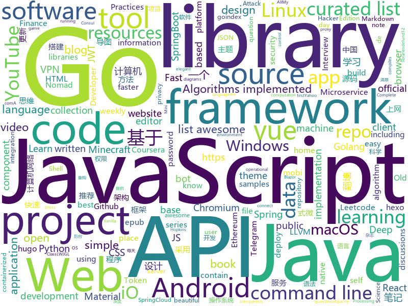

# 2020-06-08
See what the GitHub community is most excited about.

## python
+ [genetic-drawing](https://github.com/anopara/genetic-drawing)(**479 stars today**): A genetic algorithm toy project for drawing
+ [Python](https://github.com/TheAlgorithms/Python)(**291 stars today**): All Algorithms implemented in Python
+ [faceswap](https://github.com/deepfakes/faceswap)(**25 stars today**): Deepfakes Software For All
+ [Python](https://github.com/geekcomputers/Python)(**23 stars today**): My Python Examples
+ [DeepFaceLab](https://github.com/iperov/DeepFaceLab)(**387 stars today**): DeepFaceLab is the leading software for creating deepfakes.
+ [pwntools](https://github.com/Gallopsled/pwntools)(**10 stars today**): CTF framework and exploit development library
+ [covid19-br](https://github.com/turicas/covid19-br)(**16 stars today**): Dados diários mais recentes do coronavírus por município brasileiro
+ [d2l-en](https://github.com/d2l-ai/d2l-en)(**202 stars today**): An interactive deep learning book with code, math, and discussions.
+ [Instagram](https://github.com/Pure-L0G1C/Instagram)(**2 stars today**): Bruteforce attack for Instagram
+ [hummingbird](https://github.com/microsoft/hummingbird)(**135 stars today**): Hummingbird compiles trained ML models into tensor computation for faster inference.
+ [core](https://github.com/home-assistant/core)(**31 stars today**): 🏡Open source home automation that puts local control and privacy first
+ [yfinance](https://github.com/ranaroussi/yfinance)(**16 stars today**): Yahoo! Finance market data downloader (+faster Pandas Datareader)
+ [scikit-learn](https://github.com/scikit-learn/scikit-learn)(**18 stars today**): scikit-learn: machine learning in Python
+ [django-rest-framework-simplejwt](https://github.com/SimpleJWT/django-rest-framework-simplejwt)(**8 stars today**): A JSON Web Token authentication plugin for the Django REST Framework.
+ [avatarify](https://github.com/alievk/avatarify)(**210 stars today**): Avatars for Zoom, Skype and other video-conferencing apps.
+ [nlp-recipes](https://github.com/microsoft/nlp-recipes)(**66 stars today**): Natural Language Processing Best Practices & Examples
+ [OpMinneapolis](https://github.com/HLoTW/OpMinneapolis)(**9 stars today**): OpMinneapolis DDoS tool for the public..
+ [awesome-machine-learning](https://github.com/josephmisiti/awesome-machine-learning)(**24 stars today**): A curated list of awesome Machine Learning frameworks, libraries and software.
+ [youtube-dl](https://github.com/ytdl-org/youtube-dl)(**76 stars today**): Command-line program to download videos from YouTube.com and other video sites
+ [ungoogled-chromium](https://github.com/Eloston/ungoogled-chromium)(**218 stars today**): Google Chromium, sans integration with Google
+ [brasil.io](https://github.com/turicas/brasil.io)(**30 stars today**): Backend da API do https://Brasil.IO/
+ [DeepCreamPy](https://github.com/deeppomf/DeepCreamPy)(**12 stars today**): Decensoring Hentai with Deep Neural Networks
+ [kivy](https://github.com/kivy/kivy)(**6 stars today**): Open source UI framework written in Python, running on Windows, Linux, macOS, Android and iOS
+ [DeDRM_tools](https://github.com/apprenticeharper/DeDRM_tools)(**5 stars today**): DeDRM tools for ebooks
+ [pyTelegramBotAPI](https://github.com/eternnoir/pyTelegramBotAPI)(**6 stars today**): Python Telegram bot api.

## java
+ [Java](https://github.com/TheAlgorithms/Java)(**136 stars today**): All Algorithms implemented in Java
+ [ide-eval-resetter](https://github.com/pengzhile/ide-eval-resetter)(**85 stars today**): Reset your IDE eval information.
+ [SpringBootVulExploit](https://github.com/LandGrey/SpringBootVulExploit)(**78 stars today**): SpringBoot 相关漏洞学习资料，利用方法和技巧合集，黑盒安全评估 checklist
+ [CS-Notes](https://github.com/CyC2018/CS-Notes)(**187 stars today**): 📚技术面试必备基础知识、Leetcode、计算机操作系统、计算机网络、系统设计、Java、Python、C++
+ [sqlancer](https://github.com/sqlancer/sqlancer)(**168 stars today**): Detecting Logic Bugs in DBMS
+ [termux-app](https://github.com/termux/termux-app)(**12 stars today**): Android terminal and Linux environment - app repository.
+ [mlkit](https://github.com/googlesamples/mlkit)(**5 stars today**): 
+ [liugh-parent](https://github.com/qq53182347/liugh-parent)(**17 stars today**): SpringBoot+SpringCloud Oauth2+JWT+MybatisPlus实现Restful快速开发后端脚手架
+ [shopizer](https://github.com/shopizer-ecommerce/shopizer)(**3 stars today**): Shopizer java e-commerce software
+ [Algorithms](https://github.com/williamfiset/Algorithms)(**20 stars today**): A collection of algorithms and data structures
+ [runelite](https://github.com/runelite/runelite)(**3 stars today**): Open source Old School RuneScape client
+ [CommonUtil](https://github.com/LJWLgl/CommonUtil)(**22 stars today**): 轻便简单的Java常用工具类库
+ [LeetCode](https://github.com/yuanguangxin/LeetCode)(**17 stars today**): LeetCode刷题记录
+ [SpringBlade](https://github.com/chillzhuang/SpringBlade)(**30 stars today**): SpringBlade 是一个由商业级项目升级优化而来的SpringCloud分布式微服务架构、SpringBoot单体式微服务架构并存的综合型项目，采用Java8 API重构了业务代码，完全遵循阿里巴巴编码规范。采用Spring Boot 2 、Spring Cloud Hoxton 、Mybatis 等核心技术，同时提供基于React和Vue的两个前端框架用于快速搭建企业级的SaaS多租户微服务平台。 官网：https://bladex.vip
+ [clojure](https://github.com/clojure/clojure)(**1 stars today**): The Clojure programming language
+ [Geyser](https://github.com/GeyserMC/Geyser)(**6 stars today**): A bridge/proxy allowing you to connect to Minecraft: Java Edition servers with Minecraft: Bedrock edition.
+ [api-samples](https://github.com/youtube/api-samples)(**6 stars today**): Code samples for YouTube APIs, including the YouTube Data API, YouTube Analytics API, and YouTube Live Streaming API. The repo contains language-specific directories that contain the samples.
+ [TelegramBots](https://github.com/rubenlagus/TelegramBots)(**5 stars today**): Java library to create bots using Telegram Bots API
+ [MinecraftForge](https://github.com/MinecraftForge/MinecraftForge)(**4 stars today**): Modifications to the Minecraft base files to assist in compatibility between mods.
+ [Signal-Server](https://github.com/signalapp/Signal-Server)(**4 stars today**): 
+ [interview](https://github.com/mission-peace/interview)(**13 stars today**): Interview questions
+ [fineract](https://github.com/apache/fineract)(**1 stars today**): Apache Fineract
+ [tutorials](https://github.com/eugenp/tutorials)(**22 stars today**): Just Announced - "Learn Spring Security OAuth":
+ [Summer2020_B20](https://github.com/CybertekSchool/Summer2020_B20)(**1 stars today**): B20_Java Class
+ [lwjgl3](https://github.com/LWJGL/lwjgl3)(**3 stars today**): LWJGL is a Java library that enables cross-platform access to popular native APIs useful in the development of graphics (OpenGL, Vulkan), audio (OpenAL), parallel computing (OpenCL, CUDA) and XR (OpenVR, LibOVR) applications.

## unknown
+ [awesome-quant](https://github.com/wilsonfreitas/awesome-quant)(**186 stars today**): A curated list of insanely awesome libraries, packages and resources for Quants (Quantitative Finance)
+ [learn-security-engineering](https://github.com/veeral-patel/learn-security-engineering)(**56 stars today**): How I'm learning to build secure systems
+ [computer-science](https://github.com/ossu/computer-science)(**54 stars today**): 🎓Path to a free self-taught education in Computer Science!
+ [Voron-2](https://github.com/VoronDesign/Voron-2)(**3 stars today**): Voron 2 CoreXY 3D Printer design
+ [awesome-public-datasets](https://github.com/awesomedata/awesome-public-datasets)(**26 stars today**): A topic-centric list of HQ open datasets.
+ [COVID-19](https://github.com/CSSEGISandData/COVID-19)(**17 stars today**): Novel Coronavirus (COVID-19) Cases, provided by JHU CSSE
+ [You-Dont-Know-JS](https://github.com/getify/You-Dont-Know-JS)(**79 stars today**): A book series on JavaScript. @YDKJS on twitter.
+ [awesome-for-beginners](https://github.com/MunGell/awesome-for-beginners)(**40 stars today**): A list of awesome beginners-friendly projects.
+ [chromium](https://github.com/chromium/chromium)(**15 stars today**): The official GitHub mirror of the Chromium source
+ [hacker-news-undocumented](https://github.com/minimaxir/hacker-news-undocumented)(**54 stars today**): Some of the hidden norms about Hacker News not otherwise covered in the Guidelines and the FAQ.
+ [Fix-Pandownload-login](https://github.com/Admirepowered/Fix-Pandownload-login)(**16 stars today**): 
+ [Flutter-Course-Resources](https://github.com/londonappbrewery/Flutter-Course-Resources)(**17 stars today**): Learn to Code While Building Apps - The Complete Flutter Development Bootcamp
+ [awesome](https://github.com/sindresorhus/awesome)(**71 stars today**): 😎Awesome lists about all kinds of interesting topics
+ [awesome-iptv](https://github.com/iptv-org/awesome-iptv)(**2 stars today**): A curated list of resources related to IPTV
+ [DeepLearningNotes](https://github.com/Sophia-11/DeepLearningNotes)(**22 stars today**): 《深度学习》花书手推笔记
+ [SuperWordlist](https://github.com/klionsec/SuperWordlist)(**123 stars today**): 基于实战沉淀下的各种弱口令字典
+ [Kubernetes_public](https://github.com/kunchalavikram1427/Kubernetes_public)(**4 stars today**): Public repo of Kubernetes
+ [you-dont-know-js-ru](https://github.com/azat-io/you-dont-know-js-ru)(**5 stars today**): 📚Russian translation of "You Don't Know JS" book series
+ [CS-Xmind-Note](https://github.com/SSHeRun/CS-Xmind-Note)(**10 stars today**): 计算机专业课（408）思维导图和笔记：计算机组成原理（第五版 王爱英），数据结构（王道），计算机网络（第七版 谢希仁），操作系统（第四版 汤小丹）
+ [ml-nlp-paper-discussions](https://github.com/dair-ai/ml-nlp-paper-discussions)(**6 stars today**): A repo containing notes and discussions for weekly NLP paper discussions
+ [show-me-the-code](https://github.com/Yixiaohan/show-me-the-code)(**16 stars today**): Python 练习册，每天一个小程序
+ [the-economist-ebooks](https://github.com/hehonghui/the-economist-ebooks)(**10 stars today**): The Economist ebooks(epub, mobi, pdf format), update weekly. 经济学人、纽约客杂志电子版下载、订阅,支持epub、mobi格式, 每周更新
+ [awesome-deep-learning](https://github.com/ChristosChristofidis/awesome-deep-learning)(**10 stars today**): A curated list of awesome Deep Learning tutorials, projects and communities.
+ [what-happens-when](https://github.com/alex/what-happens-when)(**12 stars today**): An attempt to answer the age old interview question "What happens when you type google.com into your browser and press enter?"
+ [app-ideas](https://github.com/florinpop17/app-ideas)(**44 stars today**): A Collection of application ideas which can be used to improve your coding skills.

## javascript
+ [Zettlr](https://github.com/Zettlr/Zettlr)(**51 stars today**): A Markdown Editor for the 21st century.
+ [vanillawebprojects](https://github.com/bradtraversy/vanillawebprojects)(**35 stars today**): Mini projects built with HTML5, CSS & JavaScript. No frameworks or libraries
+ [defund12.org](https://github.com/defund12/defund12.org)(**32 stars today**): defund12.org
+ [password-manager-resources](https://github.com/apple/password-manager-resources)(**890 stars today**): A place for creators and users of password managers to collaborate on resources to make password management better.
+ [brave-browser](https://github.com/brave/brave-browser)(**24 stars today**): Next generation Brave browser for macOS, Windows, Linux, Android.
+ [discord.js](https://github.com/discordjs/discord.js)(**9 stars today**): A powerful JavaScript library for interacting with the Discord API
+ [Javascript](https://github.com/TheAlgorithms/Javascript)(**31 stars today**): A repository for All algorithms implemented in Javascript (for educational purposes only)
+ [goindex-theme-acrou](https://github.com/Aicirou/goindex-theme-acrou)(**10 stars today**): This is a goindex theme.一个goindex的扩展主题。
+ [How-To-Ask-Questions-The-Smart-Way](https://github.com/ryanhanwu/How-To-Ask-Questions-The-Smart-Way)(**19 stars today**): 本文原文由知名 Hacker Eric S. Raymond 所撰寫，教你如何正確的提出技術問題並獲得你滿意的答案。
+ [uBlock](https://github.com/gorhill/uBlock)(**22 stars today**): uBlock Origin - An efficient blocker for Chromium and Firefox. Fast and lean.
+ [alpine](https://github.com/alpinejs/alpine)(**45 stars today**): A rugged, minimal framework for composing JavaScript behavior in your markup.
+ [pose-animator](https://github.com/yemount/pose-animator)(**109 stars today**): 
+ [v4](https://github.com/bchiang7/v4)(**7 stars today**): Fourth iteration of my personal website
+ [jquery](https://github.com/jquery/jquery)(**7 stars today**): jQuery JavaScript Library
+ [marktext](https://github.com/marktext/marktext)(**30 stars today**): 📝A simple and elegant markdown editor, available for Linux, macOS and Windows.
+ [baseweb](https://github.com/uber/baseweb)(**21 stars today**): A React Component library implementing the Base design language
+ [brackets](https://github.com/adobe/brackets)(**7 stars today**): An open source code editor for the web, written in JavaScript, HTML and CSS.
+ [react-leaflet](https://github.com/PaulLeCam/react-leaflet)(**17 stars today**): ⚛️React components for🍃Leaflet maps
+ [nuxt.js](https://github.com/nuxt/nuxt.js)(**18 stars today**): The Intuitive Vue Framework
+ [joplin](https://github.com/laurent22/joplin)(**21 stars today**): Joplin - an open source note taking and to-do application with synchronization capabilities for Windows, macOS, Linux, Android and iOS. Forum: https://discourse.joplinapp.org/
+ [fullstack-course4](https://github.com/jhu-ep-coursera/fullstack-course4)(**19 stars today**): Example code for HTML, CSS, and Javascript for Web Developers Coursera Course
+ [gatsby](https://github.com/gatsbyjs/gatsby)(**40 stars today**): Build blazing fast, modern apps and websites with React
+ [cgm-remote-monitor](https://github.com/nightscout/cgm-remote-monitor)(**3 stars today**): nightscout web monitor
+ [TiddlyWiki5](https://github.com/Jermolene/TiddlyWiki5)(**13 stars today**): A self-contained JavaScript wiki for the browser, Node.js, AWS Lambda etc.
+ [vue](https://github.com/qq281113270/vue)(**20 stars today**): vue源码逐行注释分析+40多m的vue源码程序流程图思维导图 （diff部分待后续更新）

## html
+ [APT06202001](https://github.com/DefensiveOrigins/APT06202001)(**82 stars today**): Applied Purple Teaming - Infrastructure, Threat Optics, and Continious Improvement - June 6, 2020
+ [hugo-academic](https://github.com/gcushen/hugo-academic)(**11 stars today**): 📝The website builder for Hugo. Build and deploy a beautiful website in minutes!
+ [webdevbootcamp](https://github.com/nax3t/webdevbootcamp)(**8 stars today**): All source code for back-end projects from the Web Developer Bootcamp
+ [howtheytest](https://github.com/abhivaikar/howtheytest)(**3 stars today**): A collection of public resources about how software companies test their software
+ [web-moderno](https://github.com/cod3rcursos/web-moderno)(**8 stars today**): 
+ [Coursera-ML-AndrewNg-Notes](https://github.com/fengdu78/Coursera-ML-AndrewNg-Notes)(**16 stars today**): 吴恩达老师的机器学习课程个人笔记
+ [home-assistant.io](https://github.com/home-assistant/home-assistant.io)(**7 stars today**): 📘Home Assistant User documentation
+ [awesome-piracy](https://github.com/Igglybuff/awesome-piracy)(**13 stars today**): A curated list of awesome warez and piracy links
+ [boost](https://github.com/boostorg/boost)(**4 stars today**): Super-project for modularized Boost
+ [aws-eks-best-practices](https://github.com/aws/aws-eks-best-practices)(**3 stars today**): A best practices guide for day 2 operations, including operational excellence, security, reliability, performance efficiency, and cost optimization.
+ [hexo-theme-matery](https://github.com/blinkfox/hexo-theme-matery)(**4 stars today**): A beautiful hexo blog theme with material design and responsive design.一个基于材料设计和响应式设计而成的全面、美观的Hexo主题。国内访问：http://blinkfox.com
+ [hugo-coder](https://github.com/luizdepra/hugo-coder)(**2 stars today**): A minimalist blog theme for hugo.
+ [privacytools.io](https://github.com/privacytools/privacytools.io)(**7 stars today**): 🛡🛠You are being watched. Protect your privacy against global mass surveillance.
+ [MatBlazor](https://github.com/SamProf/MatBlazor)(**9 stars today**): Material Design components for Blazor and Razor Components
+ [sachac-hand](https://github.com/sachac/sachac-hand)(**9 stars today**): Working on a handwriting font
+ [vpncn.github.io](https://github.com/vpncn/vpncn.github.io)(**7 stars today**): 2020中国翻墙软件VPN推荐指南，以及对比SSR、蓝灯、WireGuard、V2ray、老王VPN等科学上网软件与翻墙方法的优缺点，中国最新科学上网翻墙VPN梯子推荐，稳定好用。
+ [luci-app-clash](https://github.com/frainzy1477/luci-app-clash)(**5 stars today**): Luci interface for Clash Openwrt
+ [MIXBOX](https://github.com/monlor/MIXBOX)(**4 stars today**): 一款基于Shell的小米路由器工具箱，原为Monlor-Tools，A tool box for XiaoMi Router base on Shell.
+ [500LineorLess_CN](https://github.com/HT524/500LineorLess_CN)(**8 stars today**): 500 line or less 中文翻译计划。
+ [JavaScript30](https://github.com/wesbos/JavaScript30)(**5 stars today**): 30 Day Vanilla JS Challenge
+ [ML-notes](https://github.com/Sakura-gh/ML-notes)(**11 stars today**): notes about machine learning
+ [craftinginterpreters](https://github.com/munificent/craftinginterpreters)(**8 stars today**): Repository for the book "Crafting Interpreters"
+ [datasciencecoursera](https://github.com/mGalarnyk/datasciencecoursera)(**2 stars today**): Data Science Repo and blog for John Hopkins Coursera Courses. Please let me know if you have any questions.
+ [openwrt-packages](https://github.com/kenzok8/openwrt-packages)(**3 stars today**): openwet常用软件包
+ [hyperblog](https://github.com/freddier/hyperblog)(**11 stars today**): Un blog increíble para el curso de Git y Github de Platzi

## go
+ [go-ast-book](https://github.com/chai2010/go-ast-book)(**90 stars today**): 📚《Go语法树入门》(开源免费图书/Go语言进阶/掌握抽象语法树/Go语言AST/LLVM/LLIR)
+ [nomad](https://github.com/hashicorp/nomad)(**42 stars today**): Nomad is an easy-to-use, flexible, and performant workload orchestrator that can deploy a mix of microservice, batch, containerized, and non-containerized applications. Nomad is easy to operate and scale and has native Consul and Vault integrations.
+ [Go](https://github.com/TheAlgorithms/Go)(**36 stars today**): Algorithms Implemented in GoLang
+ [annie](https://github.com/iawia002/annie)(**15 stars today**): 👾Fast, simple and clean video downloader
+ [PhoneInfoga](https://github.com/sundowndev/PhoneInfoga)(**6 stars today**): Advanced information gathering & OSINT framework for phone numbers
+ [gin-vue-admin](https://github.com/flipped-aurora/gin-vue-admin)(**39 stars today**): 基于gin+vue搭建的后台管理系统框架，集成jwt鉴权，权限管理，动态路由，分页封装，多点登录拦截，资源权限，上传下载，代码生成器，表单生成器等基础功能，更多功能正在开发中，欢迎issue和pr~
+ [draft](https://github.com/lucasepe/draft)(**142 stars today**): Generate High Level Microservice Architecture diagrams for GraphViz using simple YAML syntax.
+ [jwt-go](https://github.com/dgrijalva/jwt-go)(**11 stars today**): Golang implementation of JSON Web Tokens (JWT)
+ [Amass](https://github.com/OWASP/Amass)(**12 stars today**): In-depth Attack Surface Mapping and Asset Discovery
+ [fyne](https://github.com/fyne-io/fyne)(**32 stars today**): Cross platform GUI in Go based on Material Design
+ [goplus](https://github.com/qiniu/goplus)(**3 stars today**): GoPlus - The Go+ language for data science
+ [GolangTraining](https://github.com/GoesToEleven/GolangTraining)(**5 stars today**): Training for Golang (go language)
+ [client](https://github.com/keybase/client)(**6 stars today**): Keybase Go Library, Client, Service, OS X, iOS, Android, Electron
+ [BaiduPCS-Go](https://github.com/felixonmars/BaiduPCS-Go)(**7 stars today**): Re-upload of iikira/BaiduPCS-Go
+ [tinygo](https://github.com/tinygo-org/tinygo)(**8 stars today**): Go compiler for small places. Microcontrollers, WebAssembly, and command-line tools. Based on LLVM.
+ [gobuster](https://github.com/OJ/gobuster)(**10 stars today**): Directory/File, DNS and VHost busting tool written in Go
+ [water-reminder](https://github.com/0xfederama/water-reminder)(**12 stars today**): Simple notifications app that reminds you to drink
+ [ebiten](https://github.com/hajimehoshi/ebiten)(**4 stars today**): A dead simple 2D game library for Go
+ [chat](https://github.com/tinode/chat)(**7 stars today**): Instant messaging server; backend in Go; iOS, Android, web, command line clients; chatbots
+ [dns](https://github.com/miekg/dns)(**5 stars today**): DNS library in Go
+ [cli](https://github.com/cli/cli)(**52 stars today**): GitHub’s official command line tool
+ [prysm](https://github.com/prysmaticlabs/prysm)(**7 stars today**): Go implementation of the Ethereum 2.0 blockchain
+ [clash](https://github.com/Dreamacro/clash)(**49 stars today**): A rule-based tunnel in Go.
+ [go-ethereum](https://github.com/ethereum/go-ethereum)(**7 stars today**): Official Go implementation of the Ethereum protocol
+ [fzf](https://github.com/junegunn/fzf)(**36 stars today**): 🌸A command-line fuzzy finder

## WordCloud

