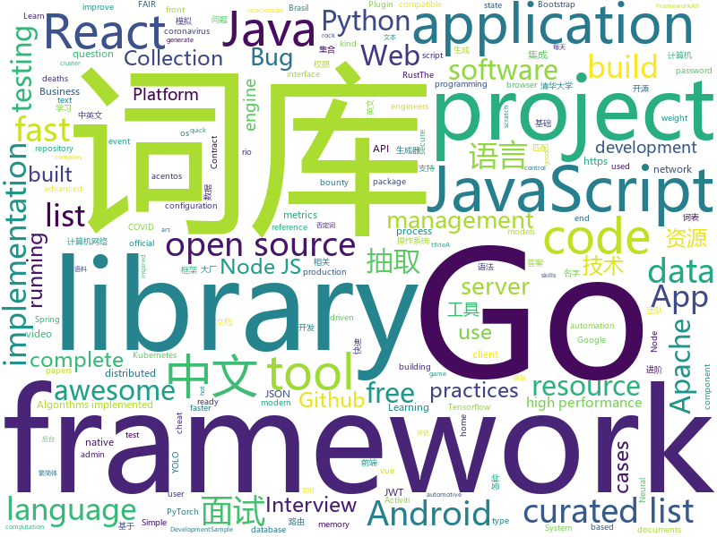

# 2020-06-09
See what the GitHub community is most excited about.

## python
+ [brasil.io](https://github.com/turicas/brasil.io)(**38 stars today**): Backend da API do https://Brasil.IO/
+ [genetic-drawing](https://github.com/anopara/genetic-drawing)(**272 stars today**): A genetic algorithm toy project for drawing
+ [fsociety](https://github.com/Manisso/fsociety)(**25 stars today**): fsociety Hacking Tools Pack – A Penetration Testing Framework
+ [Python](https://github.com/TheAlgorithms/Python)(**216 stars today**): All Algorithms implemented in Python
+ [DeepFaceLab](https://github.com/iperov/DeepFaceLab)(**248 stars today**): DeepFaceLab is the leading software for creating deepfakes.
+ [abyss](https://github.com/patois/abyss)(**21 stars today**): abyss - IDAPython Plugin for Postprocessing of Hexrays Decompiler Output
+ [fastapi](https://github.com/tiangolo/fastapi)(**67 stars today**): FastAPI framework, high performance, easy to learn, fast to code, ready for production
+ [covid19-br](https://github.com/turicas/covid19-br)(**15 stars today**): Dados diários mais recentes do coronavírus por município brasileiro
+ [Python](https://github.com/geekcomputers/Python)(**29 stars today**): My Python Examples
+ [hummingbird](https://github.com/microsoft/hummingbird)(**182 stars today**): Hummingbird compiles trained ML models into tensor computation for faster inference.
+ [nlp-recipes](https://github.com/microsoft/nlp-recipes)(**42 stars today**): Natural Language Processing Best Practices & Examples
+ [MONAI](https://github.com/Project-MONAI/MONAI)(**12 stars today**): AI Toolkit for Healthcare Imaging
+ [python](https://github.com/kubernetes-client/python)(**7 stars today**): Official Python client library for kubernetes
+ [OpMinneapolis](https://github.com/HLoTW/OpMinneapolis)(**1 stars today**): OpMinneapolis DDoS tool for the public..
+ [fbi](https://github.com/xHak9x/fbi)(**11 stars today**): Facebook Information
+ [dbt](https://github.com/fishtown-analytics/dbt)(**5 stars today**): dbt (data build tool) enables data analysts and engineers to transform their data using the same practices that software engineers use to build applications.
+ [TransformerTTS](https://github.com/as-ideas/TransformerTTS)(**23 stars today**): 🤖💬Implementation of a non-autoregressive Transformer based neural network for text to speech.
+ [core](https://github.com/home-assistant/core)(**21 stars today**): 🏡Open source home automation that puts local control and privacy first
+ [LinkFinder](https://github.com/GerbenJavado/LinkFinder)(**17 stars today**): A python script that finds endpoints in JavaScript files
+ [tensorflow-yolov4-tflite](https://github.com/hunglc007/tensorflow-yolov4-tflite)(**14 stars today**): YOLOv4, YOLOv3, YOLO-tiny Implemented in Tensorflow 2.0, Android. Convert YOLO v4 .weights tensorflow, tensorrt and tflite
+ [Awesome-Bugbounty-Writeups](https://github.com/devanshbatham/Awesome-Bugbounty-Writeups)(**13 stars today**): A curated list of bugbounty writeups (Bug type wise) , inspired from https://github.com/ngalongc/bug-bounty-reference
+ [funNLP](https://github.com/fighting41love/funNLP)(**59 stars today**): 中英文敏感词、语言检测、中外手机/电话归属地/运营商查询、名字推断性别、手机号抽取、身份证抽取、邮箱抽取、中日文人名库、中文缩写库、拆字词典、词汇情感值、停用词、反动词表、暴恐词表、繁简体转换、英文模拟中文发音、汪峰歌词生成器、职业名称词库、同义词库、反义词库、否定词库、汽车品牌词库、汽车零件词库、连续英文切割、各种中文词向量、公司名字大全、古诗词库、IT词库、财经词库、成语词库、地名词库、历史名人词库、诗词词库、医学词库、饮食词库、法律词库、汽车词库、动物词库、中文聊天语料、中文谣言数据、百度中文问答数据集、句子相似度匹配算法集合、bert资源、文本生成&摘要相关工具、cocoNLP信息抽取工具、国内电话号码正则匹配、清华大学XLORE:中英文跨语言百科知识图谱、清华大学人工智能技术…
+ [detectron2](https://github.com/facebookresearch/detectron2)(**41 stars today**): Detectron2 is FAIR's next-generation platform for object detection and segmentation.
+ [SlowFast](https://github.com/facebookresearch/SlowFast)(**3 stars today**): PySlowFast: video understanding codebase from FAIR for reproducing state-of-the-art video models.
+ [my_first_calculator.py](https://github.com/AceLewis/my_first_calculator.py)(**7 stars today**): my_first_calculator.py

## java
+ [Java](https://github.com/TheAlgorithms/Java)(**150 stars today**): All Algorithms implemented in Java
+ [ide-eval-resetter](https://github.com/pengzhile/ide-eval-resetter)(**131 stars today**): Reset your IDE eval information.
+ [sqlancer](https://github.com/sqlancer/sqlancer)(**123 stars today**): Detecting Logic Bugs in DBMS
+ [liugh-parent](https://github.com/qq53182347/liugh-parent)(**17 stars today**): SpringBoot+SpringCloud Oauth2+JWT+MybatisPlus实现Restful快速开发后端脚手架
+ [SpringBootVulExploit](https://github.com/LandGrey/SpringBootVulExploit)(**71 stars today**): SpringBoot 相关漏洞学习资料，利用方法和技巧合集，黑盒安全评估 checklist
+ [CS-Notes](https://github.com/CyC2018/CS-Notes)(**154 stars today**): 📚技术面试必备基础知识、Leetcode、计算机操作系统、计算机网络、系统设计、Java、Python、C++
+ [react-native-navigation](https://github.com/wix/react-native-navigation)(**7 stars today**): A complete native navigation solution for React Native
+ [BurpBounty](https://github.com/wagiro/BurpBounty)(**10 stars today**): Burp Bounty (Scan Check Builder in BApp Store) is a extension of Burp Suite that allows you, in a quick and simple way, to improve the active and passive scanner by means of personalized rules through a very intuitive graphical interface.
+ [iceberg](https://github.com/apache/iceberg)(**5 stars today**): Apache Iceberg
+ [neo4j](https://github.com/neo4j/neo4j)(**15 stars today**): Graphs for Everyone
+ [ARouter](https://github.com/alibaba/ARouter)(**12 stars today**): 💪A framework for assisting in the renovation of Android componentization (帮助 Android App 进行组件化改造的路由框架)
+ [flink](https://github.com/apache/flink)(**13 stars today**): Apache Flink
+ [android-interview-questions](https://github.com/MindorksOpenSource/android-interview-questions)(**5 stars today**): Your Cheat Sheet For Android Interview - Android Interview Questions
+ [micrometer](https://github.com/micrometer-metrics/micrometer)(**4 stars today**): An application metrics facade for the most popular monitoring tools. Think SLF4J, but for metrics.
+ [grpc-spring-boot-starter](https://github.com/yidongnan/grpc-spring-boot-starter)(**8 stars today**): Spring Boot starter module for gRPC framework.
+ [spring-boot](https://github.com/spring-projects/spring-boot)(**38 stars today**): Spring Boot
+ [datax-web](https://github.com/WeiYe-Jing/datax-web)(**14 stars today**): DataX集成可视化页面，选择数据源一键生成JSON并脱敏，集成定时任务，支持分布式，支持增量获取，实时查看运行日志，监控执行器资源，kill运行进程。
+ [configuration-as-code-plugin](https://github.com/jenkinsci/configuration-as-code-plugin)(**3 stars today**): Jenkins Configuration as Code Plugin
+ [quarkus](https://github.com/quarkusio/quarkus)(**15 stars today**): Quarkus: Supersonic Subatomic Java.
+ [Activiti](https://github.com/Activiti/Activiti)(**9 stars today**): Activiti is a light-weight workflow and Business Process Management (BPM) Platform targeted at business people, developers and system admins. Its core is a super-fast and rock-solid BPMN 2 process engine for Java. It's open-source and distributed under the Apache license. Activiti runs in any Java application, on a server, on a cluster or in the…
+ [netty](https://github.com/netty/netty)(**21 stars today**): Netty project - an event-driven asynchronous network application framework
+ [spring-cloud-netflix](https://github.com/spring-cloud/spring-cloud-netflix)(**2 stars today**): Integration with Netflix OSS components
+ [presto](https://github.com/prestodb/presto)(**8 stars today**): The official home of the Presto distributed SQL query engine for big data
+ [shardingsphere](https://github.com/apache/shardingsphere)(**14 stars today**): Distributed database middleware
+ [fresco](https://github.com/facebook/fresco)(**5 stars today**): An Android library for managing images and the memory they use.

## unknown
+ [dnsguide](https://github.com/EmilHernvall/dnsguide)(**136 stars today**): A guide to writing a DNS Server from scratch in Rust
+ [the-incredible-pytorch](https://github.com/ritchieng/the-incredible-pytorch)(**47 stars today**): The Incredible PyTorch: a curated list of tutorials, papers, projects, communities and more relating to PyTorch.
+ [app-ideas](https://github.com/florinpop17/app-ideas)(**76 stars today**): A Collection of application ideas which can be used to improve your coding skills.
+ [learn-security-engineering](https://github.com/veeral-patel/learn-security-engineering)(**82 stars today**): How I'm learning to build secure systems
+ [awesome-quant](https://github.com/wilsonfreitas/awesome-quant)(**196 stars today**): A curated list of insanely awesome libraries, packages and resources for Quants (Quantitative Finance)
+ [awesome-java](https://github.com/Snailclimb/awesome-java)(**71 stars today**): Collection of awesome Java project on Github(Github 上非常棒的 Java 开源项目集合).
+ [SuperWordlist](https://github.com/klionsec/SuperWordlist)(**104 stars today**): 基于实战沉淀下的各种弱口令字典
+ [javascript-questions](https://github.com/lydiahallie/javascript-questions)(**42 stars today**): A long list of (advanced) JavaScript questions, and their explanations✨
+ [AZ-300-MicrosoftAzureArchitectTechnologies](https://github.com/MicrosoftLearning/AZ-300-MicrosoftAzureArchitectTechnologies)(**5 stars today**): 
+ [awesome](https://github.com/sindresorhus/awesome)(**87 stars today**): 😎Awesome lists about all kinds of interesting topics
+ [covid-19-data](https://github.com/nytimes/covid-19-data)(**14 stars today**): An ongoing repository of data on coronavirus cases and deaths in the U.S.
+ [awesome-for-beginners](https://github.com/MunGell/awesome-for-beginners)(**45 stars today**): A list of awesome beginners-friendly projects.
+ [img](https://github.com/BlueSkyXN/img)(**20 stars today**): 
+ [COVID-19](https://github.com/CSSEGISandData/COVID-19)(**26 stars today**): Novel Coronavirus (COVID-19) Cases, provided by JHU CSSE
+ [covid19br](https://github.com/wcota/covid19br)(**11 stars today**): Confirmed cases and deaths of COVID-19 in Brazil, at municipal (city) level. Description of the data: https://doi.org/10.1590/SciELOPreprints.362
+ [Waking-Up](https://github.com/wolverinn/Waking-Up)(**11 stars today**): 计算机基础（计算机网络/操作系统/数据库/Git...）面试问题全面总结，包含详细的follow-up question以及答案；全部采用【问题+追问+答案】的形式，即拿即用，直击互联网大厂面试🚀；可用于模拟面试、面试前复习、短期内快速备战面试...
+ [bootcamp-gostack-desafios](https://github.com/Rocketseat/bootcamp-gostack-desafios)(**7 stars today**): Repositório contendo todos os desafios dos módulos do Bootcamp Gostack
+ [Fix-Pandownload-login](https://github.com/Admirepowered/Fix-Pandownload-login)(**14 stars today**): 
+ [awesome-godot](https://github.com/godotengine/awesome-godot)(**6 stars today**): A curated list of free/libre plugins, scripts and add-ons for Godot
+ [CVPR2020-Paper-Code-Interpretation](https://github.com/extreme-assistant/CVPR2020-Paper-Code-Interpretation)(**17 stars today**): cvpr2020/cvpr2019／cvpr2018/cvpr2017 papers，极市团队整理
+ [Flutter-Course-Resources](https://github.com/londonappbrewery/Flutter-Course-Resources)(**18 stars today**): Learn to Code While Building Apps - The Complete Flutter Development Bootcamp
+ [cidades-estados-brasil-json](https://github.com/felipefdl/cidades-estados-brasil-json)(**3 stars today**): Array de estados (com acentos) e cidades (com acentos) do Brasil em JSON com ID relacionado.
+ [awesome-project-ideas](https://github.com/NirantK/awesome-project-ideas)(**8 stars today**): Curated list of Machine Learning, NLP, Vision, Recommender Systems Project Ideas
+ [jest-cheat-sheet](https://github.com/sapegin/jest-cheat-sheet)(**4 stars today**): Jest cheat sheet
+ [awesome-automotive](https://github.com/Marcin214/awesome-automotive)(**27 stars today**): A curated list of delightful and free automotive resources

## javascript
+ [vanillawebprojects](https://github.com/bradtraversy/vanillawebprojects)(**42 stars today**): Mini projects built with HTML5, CSS & JavaScript. No frameworks or libraries
+ [showdoc](https://github.com/star7th/showdoc)(**14 stars today**): ShowDoc is a tool greatly applicable for an IT team to share documents online一个非常适合IT团队的在线API文档、技术文档工具
+ [password-manager-resources](https://github.com/apple/password-manager-resources)(**342 stars today**): A place for creators and users of password managers to collaborate on resources to make password management better.
+ [Recoil](https://github.com/facebookexperimental/Recoil)(**101 stars today**): Recoil is an experimental state management library for React apps. It provides several capabilities that are difficult to achieve with React alone, while being compatible with the newest features of React.
+ [pose-animator](https://github.com/yemount/pose-animator)(**121 stars today**): 
+ [Javascript](https://github.com/TheAlgorithms/Javascript)(**45 stars today**): A repository for All algorithms implemented in Javascript (for educational purposes only)
+ [openzeppelin-contracts](https://github.com/OpenZeppelin/openzeppelin-contracts)(**9 stars today**): OpenZeppelin Contracts is a library for secure smart contract development.
+ [socket.io](https://github.com/socketio/socket.io)(**20 stars today**): Realtime application framework (Node.JS server)
+ [axios](https://github.com/axios/axios)(**58 stars today**): Promise based HTTP client for the browser and node.js
+ [Zettlr](https://github.com/Zettlr/Zettlr)(**80 stars today**): A Markdown Editor for the 21st century.
+ [three.js](https://github.com/mrdoob/three.js)(**36 stars today**): JavaScript 3D library.
+ [react-select](https://github.com/JedWatson/react-select)(**17 stars today**): The Select Component for React.js
+ [samples](https://github.com/webrtc/samples)(**7 stars today**): WebRTC Web demos and samples
+ [create-snowpack-app](https://github.com/pikapkg/create-snowpack-app)(**26 stars today**): CSA - Get started with the fastest dev environment available.
+ [create-react-app](https://github.com/facebook/create-react-app)(**38 stars today**): Set up a modern web app by running one command.
+ [odoo](https://github.com/odoo/odoo)(**15 stars today**): Odoo. Open Source Apps To Grow Your Business.
+ [graphql-js](https://github.com/graphql/graphql-js)(**7 stars today**): A reference implementation of GraphQL for JavaScript
+ [strapi](https://github.com/strapi/strapi)(**122 stars today**): 🚀Open source Node.js Headless CMS to easily build customisable APIs
+ [cypress-example-recipes](https://github.com/cypress-io/cypress-example-recipes)(**5 stars today**): Various recipes for testing common scenarios with Cypress
+ [webdriverio](https://github.com/webdriverio/webdriverio)(**4 stars today**): Next-gen browser and mobile automation test framework for Node.js
+ [jquery](https://github.com/jquery/jquery)(**9 stars today**): jQuery JavaScript Library
+ [Daily-Interview-Question](https://github.com/Advanced-Frontend/Daily-Interview-Question)(**31 stars today**): 我是木易杨，公众号「高级前端进阶」作者，每天搞定一道前端大厂面试题，祝大家天天进步，一年后会看到不一样的自己。
+ [react](https://github.com/facebook/react)(**93 stars today**): A declarative, efficient, and flexible JavaScript library for building user interfaces.
+ [react-testing-library](https://github.com/testing-library/react-testing-library)(**15 stars today**): 🐐Simple and complete React DOM testing utilities that encourage good testing practices.
+ [react-bootstrap](https://github.com/react-bootstrap/react-bootstrap)(**8 stars today**): Bootstrap components built with React

## html
+ [boost](https://github.com/boostorg/boost)(**4 stars today**): Super-project for modularized Boost
+ [nndl.github.io](https://github.com/nndl/nndl.github.io)(**12 stars today**): 《神经网络与深度学习》 邱锡鹏著 Neural Network and Deep Learning
+ [Front-end-Developer-Interview-Questions](https://github.com/h5bp/Front-end-Developer-Interview-Questions)(**19 stars today**): A list of helpful front-end related questions you can use to interview potential candidates, test yourself or completely ignore.
+ [phpstan](https://github.com/phpstan/phpstan)(**9 stars today**): PHP Static Analysis Tool - discover bugs in your code without running it!
+ [free-for-dev](https://github.com/ripienaar/free-for-dev)(**42 stars today**): A list of SaaS, PaaS and IaaS offerings that have free tiers of interest to devops and infradev
+ [TitleRun](https://github.com/janniks/TitleRun)(**18 stars today**): The game that only exists in your title bar
+ [Graphics](https://github.com/Unity-Technologies/Graphics)(**4 stars today**): Unity Graphics - Including Scriptable Render Pipeline
+ [GDIndex](https://github.com/maple3142/GDIndex)(**10 stars today**): A Google Drive Index built with Vue Running on CloudFlare Workers
+ [swagger-codegen](https://github.com/swagger-api/swagger-codegen)(**10 stars today**): swagger-codegen contains a template-driven engine to generate documentation, API clients and server stubs in different languages by parsing your OpenAPI / Swagger definition.
+ [ecma262](https://github.com/tc39/ecma262)(**10 stars today**): Status, process, and documents for ECMA-262
+ [startbootstrap-sb-admin](https://github.com/BlackrockDigital/startbootstrap-sb-admin)(**3 stars today**): A free, open source, Bootstrap admin theme created by Start Bootstrap
+ [COVID-19](https://github.com/peixebabel/COVID-19)(**16 stars today**): Dados e plots sobre as informações do Corona Virus levantadas pelo Peixe Babel.
+ [fastText](https://github.com/facebookresearch/fastText)(**11 stars today**): Library for fast text representation and classification.
+ [awesome-modern-cpp](https://github.com/rigtorp/awesome-modern-cpp)(**11 stars today**): A collection of resources on modern C++
+ [zphisher](https://github.com/htr-tech/zphisher)(**4 stars today**): Automated Phishing Tool
+ [learning-area](https://github.com/mdn/learning-area)(**4 stars today**): Github repo for the MDN Learning Area.
+ [proposal-record-tuple](https://github.com/tc39/proposal-record-tuple)(**7 stars today**): ECMAScript proposal for the Record and Tuple value types. | Stage 1: it will change!
+ [embeddedsw](https://github.com/Xilinx/embeddedsw)(**0 stars today**): Xilinx Embedded Software (embeddedsw) Development
+ [chart-doctor](https://github.com/ft-interactive/chart-doctor)(**3 stars today**): Sample files to accompany the FT's Chart Doctor column
+ [fullstack-course5](https://github.com/jhu-ep-coursera/fullstack-course5)(**1 stars today**): All of the source code for the Single Page Web Applications with AngularJS course.
+ [Video-Transcoder](https://github.com/Mozilla-Open-Lab-Etwas/Video-Transcoder)(**3 stars today**): FFMPEG Wasm Video Transcoder
+ [blog_os](https://github.com/phil-opp/blog_os)(**13 stars today**): Writing an OS in Rust
+ [foundation-sites](https://github.com/foundation/foundation-sites)(**8 stars today**): The most advanced responsive front-end framework in the world. Quickly create prototypes and production code for sites that work on any kind of device.
+ [ephtracy.github.io](https://github.com/ephtracy/ephtracy.github.io)(**4 stars today**): 
+ [keep-a-changelog](https://github.com/olivierlacan/keep-a-changelog)(**2 stars today**): If you build software, keep a changelog.

## go
+ [go-ast-book](https://github.com/chai2010/go-ast-book)(**108 stars today**): 📚《Go语法树入门》(开源免费图书/Go语言进阶/掌握抽象语法树/Go语言AST/LLVM/LLIR/凹语言)
+ [sarama](https://github.com/Shopify/sarama)(**8 stars today**): Sarama is a Go library for Apache Kafka 0.8, and up.
+ [fasthttp](https://github.com/valyala/fasthttp)(**17 stars today**): Fast HTTP package for Go. Tuned for high performance. Zero memory allocations in hot paths. Up to 10x faster than net/http
+ [websocket](https://github.com/gorilla/websocket)(**10 stars today**): A fast, well-tested and widely used WebSocket implementation for Go.
+ [goplus](https://github.com/qiniu/goplus)(**14 stars today**): GoPlus - The Go+ language for data science
+ [kubernetes](https://github.com/kubernetes/kubernetes)(**56 stars today**): Production-Grade Container Scheduling and Management
+ [zap](https://github.com/uber-go/zap)(**16 stars today**): Blazing fast, structured, leveled logging in Go.
+ [HFish](https://github.com/hacklcx/HFish)(**23 stars today**): 🍯A Most Convenient Honeypot Platform.🐝🐝🐝🐝🐝
+ [go-ethereum](https://github.com/ethereum/go-ethereum)(**8 stars today**): Official Go implementation of the Ethereum protocol
+ [tidb](https://github.com/pingcap/tidb)(**39 stars today**): TiDB is an open source distributed HTAP database compatible with the MySQL protocol
+ [influxdb](https://github.com/influxdata/influxdb)(**8 stars today**): Scalable datastore for metrics, events, and real-time analytics
+ [go](https://github.com/golang/go)(**48 stars today**): The Go programming language
+ [v2ray-cloudfoundry](https://github.com/badafans/v2ray-cloudfoundry)(**3 stars today**): push v2ray on ibm cloudfoundry
+ [jwt-go](https://github.com/dgrijalva/jwt-go)(**9 stars today**): Golang implementation of JSON Web Tokens (JWT)
+ [flux](https://github.com/fluxcd/flux)(**16 stars today**): The GitOps Kubernetes operator
+ [gvisor](https://github.com/google/gvisor)(**6 stars today**): Application Kernel for Containers
+ [nvm-windows](https://github.com/coreybutler/nvm-windows)(**19 stars today**): A node.js version management utility for Windows. Ironically written in Go.
+ [gin-vue-admin](https://github.com/flipped-aurora/gin-vue-admin)(**49 stars today**): 基于gin+vue搭建的后台管理系统框架，集成jwt鉴权，权限管理，动态路由，分页封装，多点登录拦截，资源权限，上传下载，代码生成器，表单生成器等基础功能，更多功能正在开发中，欢迎issue和pr~
+ [gf](https://github.com/gogf/gf)(**15 stars today**): GoFrame is a modular, powerful, high-performance and production-ready application development framework of golang.
+ [traefik](https://github.com/containous/traefik)(**25 stars today**): The Cloud Native Edge Router
+ [pipeline](https://github.com/tektoncd/pipeline)(**8 stars today**): A K8s-native Pipeline resource.
+ [kustomize](https://github.com/kubernetes-sigs/kustomize)(**11 stars today**): Customization of kubernetes YAML configurations
+ [protobuf](https://github.com/golang/protobuf)(**7 stars today**): Go support for Google's protocol buffers
+ [hcl](https://github.com/hashicorp/hcl)(**3 stars today**): HCL is the HashiCorp configuration language.
+ [mock](https://github.com/golang/mock)(**8 stars today**): GoMock is a mocking framework for the Go programming language.

## WordCloud

