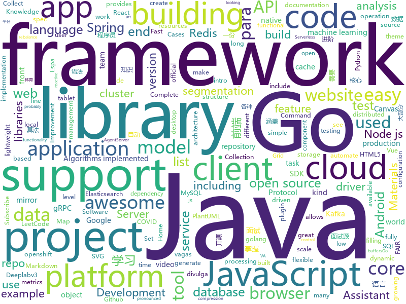

# 2020-06-10
See what the GitHub community is most excited about.

## python
+ [StayAwake](https://github.com/trevtravtrev/StayAwake)(**4 stars today**): Stay Awake is a simple app that keeps your computer from going to sleep.
+ [Python](https://github.com/TheAlgorithms/Python)(**191 stars today**): All Algorithms implemented in Python
+ [incubator-superset](https://github.com/apache/incubator-superset)(**17 stars today**): Apache Superset (incubating) is a modern, enterprise-ready business intelligence web application
+ [dask](https://github.com/dask/dask)(**3 stars today**): Parallel computing with task scheduling
+ [hue](https://github.com/cloudera/hue)(**1 stars today**): Open source SQL Query Assistant for Databases/Warehouses
+ [models](https://github.com/tensorflow/models)(**39 stars today**): Models and examples built with TensorFlow
+ [localstack](https://github.com/localstack/localstack)(**17 stars today**): 💻A fully functional local AWS cloud stack. Develop and test your cloud & Serverless apps offline!
+ [botocore](https://github.com/boto/botocore)(**1 stars today**): The low-level, core functionality of boto 3.
+ [pre-commit](https://github.com/pre-commit/pre-commit)(**7 stars today**): A framework for managing and maintaining multi-language pre-commit hooks.
+ [sampleproject](https://github.com/pypa/sampleproject)(**90 stars today**): A sample project that exists for PyPUG's "Tutorial on Packaging and Distributing Projects"
+ [azure-cli](https://github.com/Azure/azure-cli)(**0 stars today**): Azure Command-Line Interface
+ [botframework-sdk](https://github.com/microsoft/botframework-sdk)(**1 stars today**): Bot Framework provides the most comprehensive experience for building conversation applications.
+ [elasticsearch-py](https://github.com/elastic/elasticsearch-py)(**6 stars today**): Official Python low-level client for Elasticsearch.
+ [nni](https://github.com/microsoft/nni)(**7 stars today**): An open source AutoML toolkit for automate machine learning lifecycle, including feature engineering, neural architecture search, model compression and hyper-parameter tuning.
+ [pymatgen](https://github.com/materialsproject/pymatgen)(**0 stars today**): Python Materials Genomics (pymatgen) is a robust materials analysis code that defines core object representations for structures and molecules with support for many electronic structure codes. It is currently the core analysis code powering the Materials Project.
+ [gunicorn](https://github.com/benoitc/gunicorn)(**6 stars today**): gunicorn 'Green Unicorn' is a WSGI HTTP Server for UNIX, fast clients and sleepy applications.
+ [spack](https://github.com/spack/spack)(**0 stars today**): A flexible package manager that supports multiple versions, configurations, platforms, and compilers.
+ [pytest](https://github.com/pytest-dev/pytest)(**6 stars today**): The pytest framework makes it easy to write small tests, yet scales to support complex functional testing
+ [flower](https://github.com/mher/flower)(**5 stars today**): Real-time monitor and web admin for Celery distributed task queue
+ [mlflow](https://github.com/mlflow/mlflow)(**7 stars today**): Open source platform for the machine learning lifecycle
+ [SlowFast](https://github.com/facebookresearch/SlowFast)(**3 stars today**): PySlowFast: video understanding codebase from FAIR for reproducing state-of-the-art video models.
+ [espnet](https://github.com/espnet/espnet)(**2 stars today**): End-to-End Speech Processing Toolkit
+ [awesome-semantic-segmentation-pytorch](https://github.com/Tramac/awesome-semantic-segmentation-pytorch)(**2 stars today**): Semantic Segmentation on PyTorch (include FCN, PSPNet, Deeplabv3, Deeplabv3+, DANet, DenseASPP, BiSeNet, EncNet, DUNet, ICNet, ENet, OCNet, CCNet, PSANet, CGNet, ESPNet, LEDNet, DFANet)
+ [detectron2](https://github.com/facebookresearch/detectron2)(**58 stars today**): Detectron2 is FAIR's next-generation platform for object detection and segmentation.
+ [faceswap](https://github.com/deepfakes/faceswap)(**37 stars today**): Deepfakes Software For All

## java
+ [Java](https://github.com/TheAlgorithms/Java)(**176 stars today**): All Algorithms implemented in Java
+ [lettuce-core](https://github.com/lettuce-io/lettuce-core)(**3 stars today**): Advanced Java Redis client for thread-safe sync, async, and reactive usage. Supports Cluster, Sentinel, Pipelining, and codecs.
+ [aem-core-wcm-components](https://github.com/adobe/aem-core-wcm-components)(**0 stars today**): Set of standardized components to build websites on AEM.
+ [JavaGuide](https://github.com/Snailclimb/JavaGuide)(**97 stars today**): 「Java学习+面试指南」一份涵盖大部分Java程序员所需要掌握的核心知识。
+ [rocketmq](https://github.com/apache/rocketmq)(**20 stars today**): Mirror of Apache RocketMQ
+ [powermock](https://github.com/powermock/powermock)(**0 stars today**): PowerMock is a Java framework that allows you to unit test code normally regarded as untestable.
+ [serve](https://github.com/pytorch/serve)(**23 stars today**): Model Serving on PyTorch
+ [spring-authorization-server](https://github.com/spring-projects-experimental/spring-authorization-server)(**5 stars today**): A community-driven project led by the Spring Security team and is focused on delivering Authorization Server support to the Spring community
+ [redisson](https://github.com/redisson/redisson)(**8 stars today**): Redisson - Redis Java client with features of In-Memory Data Grid. Over 50 Redis based Java objects and services: Set, Multimap, SortedSet, Map, List, Queue, Deque, Semaphore, Lock, AtomicLong, Map Reduce, Publish / Subscribe, Bloom filter, Spring Cache, Tomcat, Scheduler, JCache API, Hibernate, MyBatis, RPC, local cache ...
+ [firebase-android-sdk](https://github.com/firebase/firebase-android-sdk)(**1 stars today**): Firebase Android SDK
+ [shardingsphere](https://github.com/apache/shardingsphere)(**16 stars today**): Distributed database middleware
+ [opentelemetry-java](https://github.com/open-telemetry/opentelemetry-java)(**2 stars today**): OpenTelemetry Java SDK
+ [druid](https://github.com/apache/druid)(**6 stars today**): Apache Druid: a high performance real-time analytics database.
+ [collect](https://github.com/getodk/collect)(**1 stars today**): ODK Collect is an Android app for filling out forms. It's been used to collect billions of data points in challenging environments around the world. Contribute and make the world a better place!✨📋✨
+ [cruise-control](https://github.com/linkedin/cruise-control)(**3 stars today**): Cruise-control is the first of its kind to fully automate the dynamic workload rebalance and self-healing of a kafka cluster. It provides great value to Kafka users by simplifying the operation of Kafka clusters.
+ [guice](https://github.com/google/guice)(**5 stars today**): Guice (pronounced 'juice') is a lightweight dependency injection framework for Java 6 and above, brought to you by Google.
+ [micrometer](https://github.com/micrometer-metrics/micrometer)(**2 stars today**): An application metrics facade for the most popular monitoring tools. Think SLF4J, but for metrics.
+ [ApplicationInsights-Java](https://github.com/microsoft/ApplicationInsights-Java)(**0 stars today**): Application Insights SDK for Java
+ [SpringCloudLearning](https://github.com/forezp/SpringCloudLearning)(**11 stars today**): 《史上最简单的Spring Cloud教程源码》
+ [selenium](https://github.com/SeleniumHQ/selenium)(**12 stars today**): A browser automation framework and ecosystem.
+ [Android-PickerView](https://github.com/Bigkoo/Android-PickerView)(**6 stars today**): This is a picker view for android , support linkage effect, timepicker and optionspicker.（时间选择器、省市区三级联动）
+ [nacos](https://github.com/alibaba/nacos)(**25 stars today**): an easy-to-use dynamic service discovery, configuration and service management platform for building cloud native applications.
+ [xxl-job](https://github.com/xuxueli/xxl-job)(**19 stars today**): A distributed task scheduling framework.（分布式任务调度平台XXL-JOB）
+ [guava](https://github.com/google/guava)(**14 stars today**): Google core libraries for Java
+ [ExoPlayer](https://github.com/google/ExoPlayer)(**10 stars today**): An extensible media player for Android

## unknown
+ [vagas](https://github.com/frontendbr/vagas)(**8 stars today**): 🔬Espaço para divulgação de vagas para front-enders.
+ [JavaFamily](https://github.com/AobingJava/JavaFamily)(**52 stars today**): 【Java面试+Java学习指南】 一份涵盖大部分Java程序员所需要掌握的核心知识。
+ [Flutter-Course-Resources](https://github.com/londonappbrewery/Flutter-Course-Resources)(**17 stars today**): Learn to Code While Building Apps - The Complete Flutter Development Bootcamp
+ [learn-regex](https://github.com/ziishaned/learn-regex)(**13 stars today**): Learn regex the easy way
+ [penguins](https://github.com/allisonhorst/penguins)(**47 stars today**): A great intro dataset for data exploration & visualization (alternative to iris).
+ [Specs](https://github.com/CocoaPods/Specs)(**2 stars today**): The CocoaPods Master Repo
+ [fucking-algorithm](https://github.com/labuladong/fucking-algorithm)(**133 stars today**): 手把手撕LeetCode题目，扒各种算法套路的裤子。English version supported! Crack LeetCode, not only how, but also why.
+ [Fuck-XueXiQiangGuo](https://github.com/fuck-xuexiqiangguo/Fuck-XueXiQiangGuo)(**4 stars today**): 学习强国 懒人刷分工具 自动学习
+ [COVID-19](https://github.com/CSSEGISandData/COVID-19)(**23 stars today**): Novel Coronavirus (COVID-19) Cases, provided by JHU CSSE
+ [God-Of-BigData](https://github.com/wangzhiwubigdata/God-Of-BigData)(**5 stars today**): 大数据面试题，大数据成神之路开启...Flink/Spark/Hadoop/Hbase/Hive...
+ [awesome-semantic-segmentation](https://github.com/mrgloom/awesome-semantic-segmentation)(**9 stars today**): 🤘awesome-semantic-segmentation
+ [JavaScript-Algorithms](https://github.com/sisterAn/JavaScript-Algorithms)(**18 stars today**): 基础理论+JS框架应用+实践，从0到1构建整个前端算法体系
+ [awesome](https://github.com/sindresorhus/awesome)(**105 stars today**): 😎Awesome lists about all kinds of interesting topics
+ [Java-Interview](https://github.com/gzc426/Java-Interview)(**7 stars today**): Java 面试必会 直通BAT
+ [C4-PlantUML](https://github.com/RicardoNiepel/C4-PlantUML)(**4 stars today**): C4-PlantUML combines the benefits of PlantUML and the C4 model for providing a simple way of describing and communicate software architectures
+ [vagas](https://github.com/backend-br/vagas)(**2 stars today**): ✌️Espaço para divulgação de vagas para backenders
+ [SuperWordlist](https://github.com/klionsec/SuperWordlist)(**50 stars today**): 基于实战沉淀下的各种弱口令字典
+ [app-ideas](https://github.com/florinpop17/app-ideas)(**176 stars today**): A Collection of application ideas which can be used to improve your coding skills.
+ [awesome-cpp](https://github.com/fffaraz/awesome-cpp)(**19 stars today**): A curated list of awesome C++ (or C) frameworks, libraries, resources, and shiny things. Inspired by awesome-... stuff.
+ [awesome-java](https://github.com/Snailclimb/awesome-java)(**27 stars today**): Collection of awesome Java project on Github(Github 上非常棒的 Java 开源项目集合).
+ [888](https://github.com/888mmm/888)(****): test
+ [Manual](https://github.com/Bloomberg-Beta/Manual)(**5 stars today**): You were probably looking for our website... this is it. We moved our website here, so you can see the insides of how we work.
+ [announcements](https://github.com/dotnet/announcements)(**2 stars today**): Subscribe to this repo to be notified of Announcements and changes in .NET Core.
+ [COVID-19](https://github.com/pcm-dpc/COVID-19)(**1 stars today**): COVID-19 Italia - Monitoraggio situazione
+ [oo](https://github.com/odoor3/oo)(**0 stars today**): 

## javascript
+ [vanillawebprojects](https://github.com/bradtraversy/vanillawebprojects)(**120 stars today**): Mini projects built with HTML5, CSS & JavaScript. No frameworks or libraries
+ [Rocket.Chat](https://github.com/RocketChat/Rocket.Chat)(**15 stars today**): The ultimate Free Open Source Solution for team communications.
+ [strapi](https://github.com/strapi/strapi)(**79 stars today**): 🚀Open source Node.js Headless CMS to easily build customisable APIs
+ [Daily-Interview-Question](https://github.com/Advanced-Frontend/Daily-Interview-Question)(**25 stars today**): 我是木易杨，公众号「高级前端进阶」作者，每天搞定一道前端大厂面试题，祝大家天天进步，一年后会看到不一样的自己。
+ [outline](https://github.com/outline/outline)(**22 stars today**): The fastest wiki and knowledge base for growing teams. Beautiful, feature rich, and markdown compatible.
+ [cypress](https://github.com/cypress-io/cypress)(**31 stars today**): Fast, easy and reliable testing for anything that runs in a browser.
+ [react-native](https://github.com/facebook/react-native)(**37 stars today**): A framework for building native apps with React.
+ [Javascript](https://github.com/TheAlgorithms/Javascript)(**42 stars today**): A repository for All algorithms implemented in Javascript (for educational purposes only)
+ [fabric.js](https://github.com/fabricjs/fabric.js)(**5 stars today**): Javascript Canvas Library, SVG-to-Canvas (& canvas-to-SVG) Parser
+ [handsontable](https://github.com/handsontable/handsontable)(**3 stars today**): Handsontable is a JavaScript/HTML5 data grid with spreadsheet look & feel. Available for React, Vue and Angular.
+ [react](https://github.com/facebook/react)(**81 stars today**): A declarative, efficient, and flexible JavaScript library for building user interfaces.
+ [Zettlr](https://github.com/Zettlr/Zettlr)(**119 stars today**): A Markdown Editor for the 21st century.
+ [bpmn-js-examples](https://github.com/bpmn-io/bpmn-js-examples)(**3 stars today**): Some examples how to use bpmn-js
+ [puppeteer](https://github.com/puppeteer/puppeteer)(**42 stars today**): Headless Chrome Node.js API
+ [browserslist](https://github.com/browserslist/browserslist)(**4 stars today**): 🦔Share target browsers between different front-end tools, like Autoprefixer, Stylelint and babel-preset-env
+ [MagicMirror](https://github.com/MichMich/MagicMirror)(**10 stars today**): MagicMirror² is an open source modular smart mirror platform. With a growing list of installable modules, the MagicMirror² allows you to convert your hallway or bathroom mirror into your personal assistant.
+ [data](https://github.com/emberjs/data)(**0 stars today**): A data persistence library for Ember.js.
+ [TIMSDK](https://github.com/tencentyun/TIMSDK)(**1 stars today**): 腾讯云即时通信 IM 服务，国内下载镜像：
+ [hexo-theme-next](https://github.com/next-theme/hexo-theme-next)(**6 stars today**): 🎉Elegant and powerful theme for Hexo.
+ [vue-i18n](https://github.com/kazupon/vue-i18n)(**3 stars today**): 🌐Internationalization plugin for Vue.js
+ [flow-typed](https://github.com/flow-typed/flow-typed)(**1 stars today**): A central repository for Flow library definitions
+ [ali-oss](https://github.com/ali-sdk/ali-oss)(**1 stars today**): Aliyun OSS(open storage service) JavaScript SDK for the browser and Node.js
+ [junior-recruit-scheduler](https://github.com/jojoldu/junior-recruit-scheduler)(**4 stars today**): 주니어 개발자 채용 정보
+ [dropzone](https://github.com/enyo/dropzone)(**2 stars today**): Dropzone is an easy to use drag'n'drop library. It supports image previews and shows nice progress bars.
+ [javascript](https://github.com/airbnb/javascript)(**57 stars today**): JavaScript Style Guide

## html
+ [phpstan](https://github.com/phpstan/phpstan)(**7 stars today**): PHP Static Analysis Tool - discover bugs in your code without running it!
+ [Graphics](https://github.com/Unity-Technologies/Graphics)(**2 stars today**): Unity Graphics - Including Scriptable Render Pipeline
+ [calico](https://github.com/projectcalico/calico)(**3 stars today**): Cloud native networking and network security
+ [chosen](https://github.com/harvesthq/chosen)(**0 stars today**): Deprecated - Chosen is a library for making long, unwieldy select boxes more friendly.
+ [APT06202001](https://github.com/DefensiveOrigins/APT06202001)(**14 stars today**): Applied Purple Teaming - Infrastructure, Threat Optics, and Continuous Improvement - June 6, 2020
+ [node-ytdl-core](https://github.com/fent/node-ytdl-core)(**2 stars today**): YouTube video downloader in javascript.
+ [wpt](https://github.com/web-platform-tests/wpt)(**2 stars today**): Test suites for Web platform specs — including WHATWG, W3C, and others
+ [website](https://github.com/kubernetes/website)(**1 stars today**): Kubernetes website and documentation repo:
+ [Coursera-ML-AndrewNg-Notes](https://github.com/fengdu78/Coursera-ML-AndrewNg-Notes)(**20 stars today**): 吴恩达老师的机器学习课程个人笔记
+ [foundation-sites](https://github.com/foundation/foundation-sites)(**2 stars today**): The most advanced responsive front-end framework in the world. Quickly create prototypes and production code for sites that work on any kind of device.
+ [cypress-example-kitchensink](https://github.com/cypress-io/cypress-example-kitchensink)(**1 stars today**): This is an example app used to showcase Cypress.io testing.
+ [ephtracy.github.io](https://github.com/ephtracy/ephtracy.github.io)(**1 stars today**): 
+ [EIPs](https://github.com/ethereum/EIPs)(**2 stars today**): The Ethereum Improvement Proposal repository
+ [iptv](https://github.com/freeview/iptv)(**2 stars today**): Free-to-air TV channels from Southeast Asia
+ [boost](https://github.com/boostorg/boost)(**34 stars today**): Super-project for modularized Boost
+ [Developers-Innkeeper](https://github.com/Sky-Enterprises/Developers-Innkeeper)(****): 
+ [fdty](https://github.com/KevinWang15/fdty)(**4 stars today**): 复旦体育理论考试 自动做题器
+ [aave-protocol](https://github.com/aave/aave-protocol)(**0 stars today**): Aave Protocol Version 1.0 - Decentralized Lending Pools
+ [lovelace-dwains-theme](https://github.com/dwainscheeren/lovelace-dwains-theme)(**10 stars today**): An auto generating Home Assistant Lovelace UI theme for desktop, tablet and mobile by Dwains for desktop, tablet, mobile
+ [Home](https://github.com/NuGet/Home)(**1 stars today**): Repo for NuGet Client issues
+ [va.gov-team](https://github.com/department-of-veterans-affairs/va.gov-team)(**1 stars today**): Public resources for building on and in support of VA.gov. Visit complete Knowledge Hub:
+ [specs](https://github.com/open-ness/specs)(**0 stars today**): This repository includes the literature related to OpenNESS solution
+ [swagger-codegen](https://github.com/swagger-api/swagger-codegen)(**8 stars today**): swagger-codegen contains a template-driven engine to generate documentation, API clients and server stubs in different languages by parsing your OpenAPI / Swagger definition.
+ [seldon-core](https://github.com/SeldonIO/seldon-core)(**2 stars today**): A framework to deploy, manage and scale your production machine learning to thousands of models
+ [public-files](https://github.com/braddelong/public-files)(**0 stars today**): 

## go
+ [go-ast-book](https://github.com/chai2010/go-ast-book)(**286 stars today**): 📚《Go语法树入门》(开源免费图书/Go语言进阶/掌握抽象语法树/Go语言AST/LLVM/LLIR/凹语言)
+ [distribution](https://github.com/docker/distribution)(**1 stars today**): The Docker toolset to pack, ship, store, and deliver content
+ [cli](https://github.com/cli/cli)(**51 stars today**): GitHub’s official command line tool
+ [google-cloud-go](https://github.com/googleapis/google-cloud-go)(**2 stars today**): Google Cloud Client Libraries for Go.
+ [protobuf](https://github.com/gogo/protobuf)(**7 stars today**): Protocol Buffers for Go with Gadgets
+ [origin](https://github.com/openshift/origin)(**1 stars today**): Images for OpenShift 3 and 4 - see openshift/okd for more
+ [protobuf](https://github.com/golang/protobuf)(**2 stars today**): Go support for Google's protocol buffers
+ [mysql](https://github.com/go-sql-driver/mysql)(**3 stars today**): Go MySQL Driver is a MySQL driver for Go's (golang) database/sql package
+ [kops](https://github.com/kubernetes/kops)(**9 stars today**): Kubernetes Operations (kops) - Production Grade K8s Installation, Upgrades, and Management
+ [grpc-go](https://github.com/grpc/grpc-go)(**13 stars today**): The Go language implementation of gRPC. HTTP/2 based RPC
+ [govmomi](https://github.com/vmware/govmomi)(**1 stars today**): Go library for the VMware vSphere API
+ [dep](https://github.com/golang/dep)(**1 stars today**): Go dependency management tool
+ [aws-sdk-go](https://github.com/aws/aws-sdk-go)(**1 stars today**): AWS SDK for the Go programming language.
+ [go-cloud](https://github.com/google/go-cloud)(**4 stars today**): The Go Cloud Development Kit (Go CDK): A library and tools for open cloud development in Go.
+ [grpc-gateway](https://github.com/grpc-ecosystem/grpc-gateway)(**8 stars today**): gRPC to JSON proxy generator following the gRPC HTTP spec
+ [beats](https://github.com/elastic/beats)(**2 stars today**): 🐠Beats - Lightweight shippers for Elasticsearch & Logstash
+ [thanos](https://github.com/thanos-io/thanos)(**3 stars today**): Highly available Prometheus setup with long term storage capabilities. CNCF Sandbox project.
+ [mongo-go-driver](https://github.com/mongodb/mongo-go-driver)(**5 stars today**): The Go driver for MongoDB
+ [groupcache](https://github.com/golang/groupcache)(**4 stars today**): groupcache is a caching and cache-filling library, intended as a replacement for memcached in many cases.
+ [build-web-application-with-golang](https://github.com/astaxie/build-web-application-with-golang)(**13 stars today**): A golang ebook intro how to build a web with golang
+ [datadog-agent](https://github.com/DataDog/datadog-agent)(**1 stars today**): Datadog Agent
+ [prebid-server](https://github.com/prebid/prebid-server)(**0 stars today**): Server side component to offload prebid processing to the cloud
+ [go-swagger](https://github.com/go-swagger/go-swagger)(**7 stars today**): Swagger 2.0 implementation for go
+ [protoc-gen-validate](https://github.com/envoyproxy/protoc-gen-validate)(**3 stars today**): protoc plugin to generate polyglot message validators
+ [libpod](https://github.com/containers/libpod)(**8 stars today**): libpod is a library used to create container pods. Home of Podman.

## WordCloud

