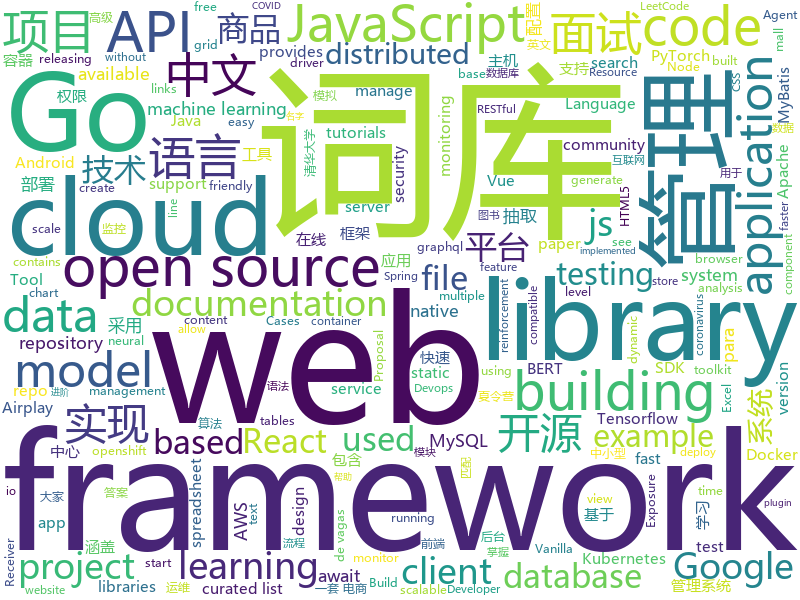

# 2020-06-11
See what the GitHub community is most excited about.

## python
+ [CallStranger](https://github.com/yunuscadirci/CallStranger)(**62 stars today**): Vulnerability checker for Callstranger (CVE-2020-12695)
+ [hummingbird](https://github.com/microsoft/hummingbird)(**192 stars today**): Hummingbird compiles trained ML models into tensor computation for faster inference.
+ [albert](https://github.com/google-research/albert)(**8 stars today**): ALBERT: A Lite BERT for Self-supervised Learning of Language Representations
+ [hue](https://github.com/cloudera/hue)(**6 stars today**): Open source SQL Query Assistant for Databases/Warehouses
+ [horovod](https://github.com/horovod/horovod)(**15 stars today**): Distributed training framework for TensorFlow, Keras, PyTorch, and Apache MXNet.
+ [flower](https://github.com/mher/flower)(**5 stars today**): Real-time monitor and web admin for Celery distributed task queue
+ [AdelaiDet](https://github.com/aim-uofa/AdelaiDet)(**10 stars today**): AdelaiDet is an open source toolbox for multiple instance-level detection and recognition tasks.
+ [models](https://github.com/tensorflow/models)(**38 stars today**): Models and examples built with TensorFlow
+ [bert](https://github.com/google-research/bert)(**36 stars today**): TensorFlow code and pre-trained models for BERT
+ [spaCy](https://github.com/explosion/spaCy)(**9 stars today**): 💫Industrial-strength Natural Language Processing (NLP) with Python and Cython
+ [ray](https://github.com/ray-project/ray)(**22 stars today**): A fast and simple framework for building and running distributed applications. Ray is packaged with RLlib, a scalable reinforcement learning library, and Tune, a scalable hyperparameter tuning library.
+ [ntlm_theft](https://github.com/Greenwolf/ntlm_theft)(**45 stars today**): A tool for generating multiple types of NTLMv2 hash theft files by Jacob Wilkin (Greenwolf)
+ [CVPR2020-HAttMatting](https://github.com/wukaoliu/CVPR2020-HAttMatting)(**47 stars today**): Attention-Guided Hierarchical Structure Aggregation for Image Matting(CVPR2020)
+ [BentoML](https://github.com/bentoml/BentoML)(**41 stars today**): Model Serving Made Easy
+ [tensorflow-yolov4-tflite](https://github.com/hunglc007/tensorflow-yolov4-tflite)(**13 stars today**): YOLOv4, YOLOv3, YOLO-tiny Implemented in Tensorflow 2.0, Android. Convert YOLO v4 .weights tensorflow, tensorrt and tflite
+ [big_transfer](https://github.com/google-research/big_transfer)(**38 stars today**): Official repository for the "Big Transfer (BiT): General Visual Representation Learning" paper.
+ [nni](https://github.com/microsoft/nni)(**4 stars today**): An open source AutoML toolkit for automate machine learning lifecycle, including feature engineering, neural architecture search, model compression and hyper-parameter tuning.
+ [fsociety](https://github.com/Manisso/fsociety)(**32 stars today**): fsociety Hacking Tools Pack – A Penetration Testing Framework
+ [Decentralized-Internet](https://github.com/Lonero-Team/Decentralized-Internet)(**197 stars today**): A SDK/library for decentralized web and distributing computing projects
+ [walle-web](https://github.com/meolu/walle-web)(**33 stars today**): walle - 瓦力 Devops开源项目代码部署平台
+ [jina](https://github.com/jina-ai/jina)(**11 stars today**): Jina is the cloud-native neural search framework powered by state-of-the-art AI and deep learning
+ [tensortrade](https://github.com/tensortrade-org/tensortrade)(**20 stars today**): An open source reinforcement learning framework for training, evaluating, and deploying robust trading agents.
+ [funNLP](https://github.com/fighting41love/funNLP)(**67 stars today**): 中英文敏感词、语言检测、中外手机/电话归属地/运营商查询、名字推断性别、手机号抽取、身份证抽取、邮箱抽取、中日文人名库、中文缩写库、拆字词典、词汇情感值、停用词、反动词表、暴恐词表、繁简体转换、英文模拟中文发音、汪峰歌词生成器、职业名称词库、同义词库、反义词库、否定词库、汽车品牌词库、汽车零件词库、连续英文切割、各种中文词向量、公司名字大全、古诗词库、IT词库、财经词库、成语词库、地名词库、历史名人词库、诗词词库、医学词库、饮食词库、法律词库、汽车词库、动物词库、中文聊天语料、中文谣言数据、百度中文问答数据集、句子相似度匹配算法集合、bert资源、文本生成&摘要相关工具、cocoNLP信息抽取工具、国内电话号码正则匹配、清华大学XLORE:中英文跨语言百科知识图谱、清华大学人工智能技术…
+ [great_expectations](https://github.com/great-expectations/great_expectations)(**10 stars today**): Always know what to expect from your data.
+ [localstack](https://github.com/localstack/localstack)(**24 stars today**): 💻A fully functional local AWS cloud stack. Develop and test your cloud & Serverless apps offline!

## java
+ [community](https://github.com/GoogleCloudPlatform/community)(**5 stars today**): This repository holds the content submitted to https://cloud.google.com/community. Files added to the tutorials/ will appear at https://cloud.google.com/community/tutorials.
+ [mall](https://github.com/macrozheng/mall)(**92 stars today**): mall项目是一套电商系统，包括前台商城系统及后台管理系统，基于SpringBoot+MyBatis实现，采用Docker容器化部署。 前台商城系统包含首页门户、商品推荐、商品搜索、商品展示、购物车、订单流程、会员中心、客户服务、帮助中心等模块。 后台管理系统包含商品管理、订单管理、会员管理、促销管理、运营管理、内容管理、统计报表、财务管理、权限管理、设置等模块。
+ [PanelSwitchHelper](https://github.com/YummyLau/PanelSwitchHelper)(**97 stars today**): ✔️A framework that helps the keyboard smoothly transition to the function panel 一个帮助键盘平稳过渡到功能面板的框架，支持动画无缝衔接，支持 activity/fragment/dialog/dialogFragment/popupWindow 容器，支持IM/直播/视频播放/信息流评论等场景
+ [JavaGuide](https://github.com/Snailclimb/JavaGuide)(**88 stars today**): 「Java学习+面试指南」一份涵盖大部分Java程序员所需要掌握的核心知识。
+ [elasticsearch](https://github.com/elastic/elasticsearch)(**35 stars today**): Open Source, Distributed, RESTful Search Engine
+ [canal](https://github.com/alibaba/canal)(**28 stars today**): 阿里巴巴 MySQL binlog 增量订阅&消费组件
+ [apollo](https://github.com/ctripcorp/apollo)(**19 stars today**): Apollo（阿波罗）是携程框架部门研发的分布式配置中心，能够集中化管理应用不同环境、不同集群的配置，配置修改后能够实时推送到应用端，并且具备规范的权限、流程治理等特性，适用于微服务配置管理场景。
+ [zuul](https://github.com/Netflix/zuul)(**15 stars today**): Zuul is a gateway service that provides dynamic routing, monitoring, resiliency, security, and more.
+ [Arduino](https://github.com/arduino/Arduino)(**19 stars today**): open-source electronics platform
+ [aws-doc-sdk-examples](https://github.com/awsdocs/aws-doc-sdk-examples)(**6 stars today**): Welcome to the AWS Code Examples Repository. This repo contains code examples used in the AWS documentation, AWS SDK Developer Guides, and more. For more information, see the Readme.rst file below.
+ [react-native-camera](https://github.com/react-native-community/react-native-camera)(**7 stars today**): A Camera component for React Native. Also supports barcode scanning!
+ [jmeter](https://github.com/apache/jmeter)(**6 stars today**): Apache JMeter
+ [mall-learning](https://github.com/macrozheng/mall-learning)(**21 stars today**): mall学习教程，架构、业务、技术要点全方位解析。mall项目（25k+star）是一套电商系统，使用现阶段主流技术实现。 涵盖了SpringBoot2.1.3、MyBatis3.4.6、Elasticsearch6.2.2、RabbitMQ3.7.15、Redis3.2、Mongodb3.2、Mysql5.7等技术，采用Docker容器化部署。
+ [MPAndroidChart](https://github.com/PhilJay/MPAndroidChart)(**21 stars today**): A powerful🚀Android chart view / graph view library, supporting line- bar- pie- radar- bubble- and candlestick charts as well as scaling, panning and animations.
+ [nacos](https://github.com/alibaba/nacos)(**31 stars today**): an easy-to-use dynamic service discovery, configuration and service management platform for building cloud native applications.
+ [easyexcel](https://github.com/alibaba/easyexcel)(**38 stars today**): 快速、简单避免OOM的java处理Excel工具
+ [spring-boot-api-project-seed](https://github.com/lihengming/spring-boot-api-project-seed)(**24 stars today**): 🌱🚀一个基于Spring Boot & MyBatis的种子项目，用于快速构建中小型API、RESTful API项目~
+ [alluxio](https://github.com/Alluxio/alluxio)(**5 stars today**): Alluxio, data orchestration for analytics and machine learning in the cloud
+ [Jetpack-MVVM-Best-Practice](https://github.com/KunMinX/Jetpack-MVVM-Best-Practice)(**42 stars today**): 是 难得一见 的 Jetpack MVVM 最佳实践！在 蕴繁于简 的代码中，对 视图控制器 乃至 标准化开发模式 形成正确、深入的理解！
+ [beam](https://github.com/apache/beam)(**6 stars today**): Apache Beam is a unified programming model for Batch and Streaming
+ [firebase-android-sdk](https://github.com/firebase/firebase-android-sdk)(**3 stars today**): Firebase Android SDK
+ [skywalking](https://github.com/apache/skywalking)(**24 stars today**): APM, Application Performance Monitoring System
+ [zipkin](https://github.com/openzipkin/zipkin)(**12 stars today**): Zipkin is a distributed tracing system
+ [sonarqube-community-branch-plugin](https://github.com/mc1arke/sonarqube-community-branch-plugin)(**5 stars today**): A plugin for SonarQube to allow branch analysis in the community version
+ [druid](https://github.com/alibaba/druid)(**20 stars today**): 阿里巴巴计算平台事业部出品，为监控而生的数据库连接池

## unknown
+ [the-incredible-pytorch](https://github.com/ritchieng/the-incredible-pytorch)(**139 stars today**): The Incredible PyTorch: a curated list of tutorials, papers, projects, communities and more relating to PyTorch.
+ [managers-playbook](https://github.com/ksindi/managers-playbook)(**24 stars today**): 📖Heuristics for effective management
+ [fucking-algorithm](https://github.com/labuladong/fucking-algorithm)(**236 stars today**): 手把手撕LeetCode题目，扒各种算法套路的裤子。English version supported! Crack LeetCode, not only how, but also why.
+ [vagas](https://github.com/frontendbr/vagas)(**9 stars today**): 🔬Espaço para divulgação de vagas para front-enders.
+ [covid-19-data](https://github.com/nytimes/covid-19-data)(**11 stars today**): An ongoing repository of data on coronavirus cases and deaths in the U.S.
+ [ru-test-assignments](https://github.com/Hexlet/ru-test-assignments)(**113 stars today**): Тестовые задания для самостоятельного выполнения от разных it компаний
+ [vue3-News](https://github.com/vue3/vue3-News)(**20 stars today**): 🎯Find the latest breaking √vue3 & vue-cli 3+ News.
+ [releasing-research-code](https://github.com/paperswithcode/releasing-research-code)(**21 stars today**): Tips for releasing research code in Machine Learning (with official NeurIPS 2020 recommendations)
+ [COVID-19](https://github.com/CSSEGISandData/COVID-19)(**30 stars today**): Novel Coronavirus (COVID-19) Cases, provided by JHU CSSE
+ [vagas](https://github.com/backend-br/vagas)(**8 stars today**): ✌️Espaço para divulgação de vagas para backenders
+ [CVPR2020-Code](https://github.com/amusi/CVPR2020-Code)(**166 stars today**): CVPR 2020 论文开源项目合集
+ [awesome-gog-galaxy](https://github.com/Mixaill/awesome-gog-galaxy)(**7 stars today**): A list of GOG Galaxy 2.0 integrations and upcoming features
+ [CVPR2020-Paper-Code-Interpretation](https://github.com/extreme-assistant/CVPR2020-Paper-Code-Interpretation)(**21 stars today**): cvpr2020/cvpr2019／cvpr2018/cvpr2017 papers，极市团队整理
+ [app-ideas](https://github.com/florinpop17/app-ideas)(**70 stars today**): A Collection of application ideas which can be used to improve your coding skills.
+ [project-based-learning](https://github.com/tuvtran/project-based-learning)(**35 stars today**): Curated list of project-based tutorials
+ [awesome-production-machine-learning](https://github.com/EthicalML/awesome-production-machine-learning)(**8 stars today**): A curated list of awesome open source libraries to deploy, monitor, version and scale your machine learning
+ [bootcamp-gostack-desafios](https://github.com/Rocketseat/bootcamp-gostack-desafios)(**4 stars today**): Repositório contendo todos os desafios dos módulos do Bootcamp Gostack
+ [developer-roadmap](https://github.com/kamranahmedse/developer-roadmap)(**91 stars today**): Roadmap to becoming a web developer in 2020
+ [API-Security-Checklist](https://github.com/shieldfy/API-Security-Checklist)(**5 stars today**): Checklist of the most important security countermeasures when designing, testing, and releasing your API
+ [CSSummerCamp2020](https://github.com/hcy226/CSSummerCamp2020)(**9 stars today**): 关于2020年CS保研夏令营的汇总。欢迎大家分享夏令营信息，资瓷一下互联网精神吼不吼啊？
+ [system_design](https://github.com/shashank88/system_design)(**15 stars today**): Preparation links and resources for system design questions
+ [free-programming-books](https://github.com/EbookFoundation/free-programming-books)(**97 stars today**): 📚Freely available programming books
+ [Waking-Up](https://github.com/wolverinn/Waking-Up)(**7 stars today**): 计算机基础（计算机网络/操作系统/数据库/Git...）面试问题全面总结，包含详细的follow-up question以及答案；全部采用【问题+追问+答案】的形式，即拿即用，直击互联网大厂面试🚀；可用于模拟面试、面试前复习、短期内快速备战面试...
+ [AZ-300-MicrosoftAzureArchitectTechnologies](https://github.com/MicrosoftLearning/AZ-300-MicrosoftAzureArchitectTechnologies)(**5 stars today**): 
+ [awesome-malware-analysis](https://github.com/rshipp/awesome-malware-analysis)(**6 stars today**): Defund the Police.

## javascript
+ [vanillawebprojects](https://github.com/bradtraversy/vanillawebprojects)(**310 stars today**): Mini projects built with HTML5, CSS & JavaScript. No frameworks or libraries
+ [xgenecloud](https://github.com/xgenecloud/xgenecloud)(**238 stars today**): 🚀Instant REST & GraphQL APIs on any Database (MySQL, Postgres, MsSQL, SQLite, MariaDB)
+ [stegcloak](https://github.com/KuroLabs/stegcloak)(**188 stars today**): Hide secrets with invisible characters in plain text securely using passwords 🧙🏻‍♂️⭐
+ [playwright](https://github.com/microsoft/playwright)(**37 stars today**): Node library to automate Chromium, Firefox and WebKit with a single API
+ [javascript-algorithms](https://github.com/trekhleb/javascript-algorithms)(**110 stars today**): 📝Algorithms and data structures implemented in JavaScript with explanations and links to further readings
+ [clean-code-javascript](https://github.com/ryanmcdermott/clean-code-javascript)(**41 stars today**): 🛁Clean Code concepts adapted for JavaScript
+ [jexcel](https://github.com/paulhodel/jexcel)(**30 stars today**): jExcel is a lightweight vanilla javascript plugin to create amazing web-based interactive tables and spreadsheets compatible with Excel or any other spreadsheet software.
+ [outline](https://github.com/outline/outline)(**47 stars today**): The fastest wiki and knowledge base for growing teams. Beautiful, feature rich, and markdown compatible.
+ [react-native](https://github.com/facebook/react-native)(**43 stars today**): A framework for building native apps with React.
+ [Daily-Interview-Question](https://github.com/Advanced-Frontend/Daily-Interview-Question)(**45 stars today**): 我是木易杨，公众号「高级前端进阶」作者，每天搞定一道前端大厂面试题，祝大家天天进步，一年后会看到不一样的自己。
+ [cypress](https://github.com/cypress-io/cypress)(**60 stars today**): Fast, easy and reliable testing for anything that runs in a browser.
+ [robintrack](https://github.com/Ameobea/robintrack)(**18 stars today**): Scrapes the Robinhood API to retrieve + store popularity and price data.
+ [microsoft-authentication-library-for-js](https://github.com/AzureAD/microsoft-authentication-library-for-js)(**3 stars today**): Microsoft Authentication Library (MSAL) for JS
+ [vue](https://github.com/vuejs/vue)(**102 stars today**): 🖖Vue.js is a progressive, incrementally-adoptable JavaScript framework for building UI on the web.
+ [Prebid.js](https://github.com/prebid/Prebid.js)(**2 stars today**): Setup and manage header bidding advertising partners without writing code or confusing line items. Prebid.js is open source and free.
+ [axios](https://github.com/axios/axios)(**63 stars today**): Promise based HTTP client for the browser and node.js
+ [react-table](https://github.com/tannerlinsley/react-table)(**18 stars today**): ⚛️Hooks for building fast and extendable tables and datagrids for React
+ [handsontable](https://github.com/handsontable/handsontable)(**5 stars today**): Handsontable is a JavaScript/HTML5 data grid with spreadsheet look & feel. Available for React, Vue and Angular.
+ [vue-admin-template](https://github.com/PanJiaChen/vue-admin-template)(**27 stars today**): a vue2.0 minimal admin template
+ [spug](https://github.com/openspug/spug)(**44 stars today**): 开源运维平台：面向中小型企业设计的轻量级无Agent的自动化运维平台，整合了主机管理、主机批量执行、主机在线终端、文件在线上传下载、应用发布部署、在线任务计划、配置中心、监控、报警等一系列功能。
+ [material-ui](https://github.com/mui-org/material-ui)(**58 stars today**): React components for faster and easier web development. Build your own design system, or start with Material Design.
+ [slate](https://github.com/slatedocs/slate)(**19 stars today**): Beautiful static documentation for your API
+ [shapez.io](https://github.com/tobspr/shapez.io)(**16 stars today**): shapez.io is an open source base building game inspired by factorio! Available on web & desktop
+ [wappalyzer](https://github.com/AliasIO/wappalyzer)(**11 stars today**): Identify technology on websites.
+ [bootstrap](https://github.com/twbs/bootstrap)(**34 stars today**): The most popular HTML, CSS, and JavaScript framework for developing responsive, mobile first projects on the web.

## html
+ [phpstan](https://github.com/phpstan/phpstan)(**23 stars today**): PHP Static Analysis Tool - discover bugs in your code without running it!
+ [shan-shui-inf](https://github.com/LingDong-/shan-shui-inf)(**209 stars today**): Procedurally generated Chinese landscape painting.
+ [free-for-dev](https://github.com/ripienaar/free-for-dev)(**34 stars today**): A list of SaaS, PaaS and IaaS offerings that have free tiers of interest to devops and infradev
+ [riot-web](https://github.com/vector-im/riot-web)(**10 stars today**): A glossy Matrix collaboration client for the web.
+ [Coursera-ML-AndrewNg-Notes](https://github.com/fengdu78/Coursera-ML-AndrewNg-Notes)(**22 stars today**): 吴恩达老师的机器学习课程个人笔记
+ [JavaScript30](https://github.com/wesbos/JavaScript30)(**14 stars today**): 30 Day Vanilla JS Challenge
+ [fonts](https://github.com/google/fonts)(**5 stars today**): Font files available from Google Fonts
+ [website](https://github.com/kubernetes/website)(**5 stars today**): Kubernetes website and documentation repo:
+ [Airplay-SDK](https://github.com/xfirefly/Airplay-SDK)(**5 stars today**): Airplay Receiver SDK supports Airplay Mirroring and AirPlay Casting to a receiver device.
+ [seldon-core](https://github.com/SeldonIO/seldon-core)(**10 stars today**): A framework to deploy, manage and scale your production machine learning to thousands of models
+ [chosen](https://github.com/harvesthq/chosen)(**4 stars today**): Deprecated - Chosen is a library for making long, unwieldy select boxes more friendly.
+ [openwrt-packages](https://github.com/kenzok8/openwrt-packages)(**6 stars today**): openwet常用软件包
+ [scroll-to-text-fragment](https://github.com/WICG/scroll-to-text-fragment)(**14 stars today**): Proposal to allow specifying a text snippet in a URL fragment
+ [proposal-await.ops](https://github.com/Jack-Works/proposal-await.ops)(**2 stars today**): Introduce await.all / await.race / await.allSettled / await.any to simplify the usage of Promises
+ [PanacloudBootcamp2020](https://github.com/MuhammadMohsin/PanacloudBootcamp2020)(**1 stars today**): 
+ [EIPs](https://github.com/ethereum/EIPs)(**3 stars today**): The Ethereum Improvement Proposal repository
+ [serenity-core](https://github.com/serenity-bdd/serenity-core)(**1 stars today**): Serenity BDD is a test automation library designed to make writing automated acceptance tests easier, and more fun.
+ [cypress-example-kitchensink](https://github.com/cypress-io/cypress-example-kitchensink)(**2 stars today**): This is an example app used to showcase Cypress.io testing.
+ [startbootstrap-resume](https://github.com/BlackrockDigital/startbootstrap-resume)(**4 stars today**): A Bootstrap 4 resume/CV theme created by Start Bootstrap
+ [RuoYi](https://github.com/yangzongzhuan/RuoYi)(**5 stars today**): 基于SpringBoot2.0的权限管理系统 易读易懂、界面简洁美观。 核心技术采用Spring、MyBatis、Shiro没有任何其它重度依赖。直接运行即可用
+ [docs](https://github.com/prometheus/docs)(**0 stars today**): Prometheus documentation: content and static site generator
+ [swagger-codegen](https://github.com/swagger-api/swagger-codegen)(**11 stars today**): swagger-codegen contains a template-driven engine to generate documentation, API clients and server stubs in different languages by parsing your OpenAPI / Swagger definition.
+ [learning-area](https://github.com/mdn/learning-area)(**2 stars today**): Github repo for the MDN Learning Area.
+ [masonry](https://github.com/desandro/masonry)(**4 stars today**): 🏩Cascading grid layout plugin
+ [tiny-slider](https://github.com/ganlanyuan/tiny-slider)(**7 stars today**): Vanilla javascript slider for all purposes.

## go
+ [utahfs](https://github.com/cloudflare/utahfs)(**95 stars today**): UtahFS is an encrypted storage system that provides a user-friendly FUSE drive backed by cloud storage.
+ [google-cloud-go](https://github.com/googleapis/google-cloud-go)(**12 stars today**): Google Cloud Client Libraries for Go.
+ [grpc-gateway](https://github.com/grpc-ecosystem/grpc-gateway)(**12 stars today**): gRPC to JSON proxy generator following the gRPC HTTP spec
+ [go-ast-book](https://github.com/chai2010/go-ast-book)(**215 stars today**): 📚《Go语法树入门》(开源免费图书/Go语言进阶/掌握抽象语法树/Go语言AST/LLVM/LLIR/凹语言)
+ [charts](https://github.com/helm/charts)(**23 stars today**): Curated applications for Kubernetes
+ [mysql](https://github.com/go-sql-driver/mysql)(**7 stars today**): Go MySQL Driver is a MySQL driver for Go's (golang) database/sql package
+ [distribution](https://github.com/docker/distribution)(**34 stars today**): The Docker toolset to pack, ship, store, and deliver content
+ [cilium](https://github.com/cilium/cilium)(**8 stars today**): API-aware Networking and Security using eBPF and XDP
+ [client-go](https://github.com/kubernetes/client-go)(**7 stars today**): Go client for Kubernetes.
+ [prometheus](https://github.com/prometheus/prometheus)(**45 stars today**): The Prometheus monitoring system and time series database.
+ [libpod](https://github.com/containers/libpod)(**10 stars today**): libpod is a library used to create container pods. Home of Podman.
+ [gqlgen](https://github.com/99designs/gqlgen)(**10 stars today**): go generate based graphql server library
+ [build-web-application-with-golang](https://github.com/astaxie/build-web-application-with-golang)(**19 stars today**): A golang ebook intro how to build a web with golang
+ [kubernetes](https://github.com/kubernetes/kubernetes)(**60 stars today**): Production-Grade Container Scheduling and Management
+ [kustomize](https://github.com/kubernetes-sigs/kustomize)(**12 stars today**): Customization of kubernetes YAML configurations
+ [testify](https://github.com/stretchr/testify)(**18 stars today**): A toolkit with common assertions and mocks that plays nicely with the standard library
+ [advanced-go-programming-book](https://github.com/chai2010/advanced-go-programming-book)(**20 stars today**): 📚《Go语言高级编程》开源图书，涵盖CGO、Go汇编语言、RPC实现、Protobuf插件实现、Web框架实现、分布式系统等高阶主题(完稿)
+ [protobuf](https://github.com/golang/protobuf)(**8 stars today**): Go support for Google's protocol buffers
+ [protobuf](https://github.com/gogo/protobuf)(**15 stars today**): Protocol Buffers for Go with Gadgets
+ [operator-sdk](https://github.com/operator-framework/operator-sdk)(**6 stars today**): SDK for building Kubernetes applications. Provides high level APIs, useful abstractions, and project scaffolding.
+ [exposure-notifications-server](https://github.com/google/exposure-notifications-server)(**17 stars today**): Exposure Notification Reference Server | Covid-19 Exposure Notifications
+ [cert-manager](https://github.com/jetstack/cert-manager)(**15 stars today**): Automatically provision and manage TLS certificates in Kubernetes
+ [terraform-provider-azurerm](https://github.com/terraform-providers/terraform-provider-azurerm)(**5 stars today**): Terraform provider for Azure Resource Manager
+ [origin](https://github.com/openshift/origin)(**2 stars today**): Images for OpenShift 3 and 4 - see openshift/okd for more
+ [controller-runtime](https://github.com/kubernetes-sigs/controller-runtime)(**3 stars today**): Repo for the controller-runtime subproject of kubebuilder (sig-apimachinery)

## WordCloud

