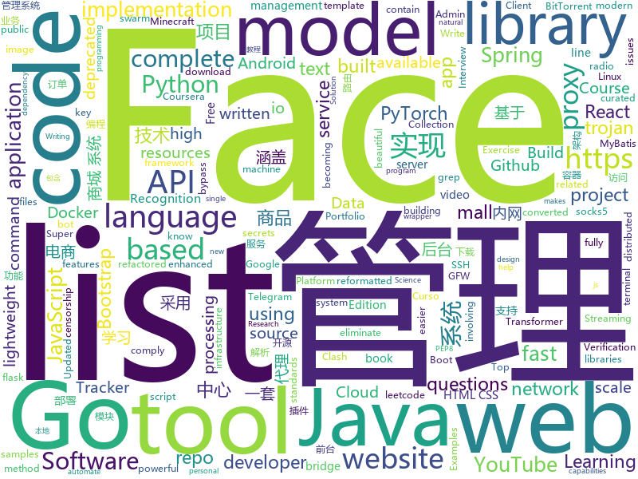

# 2020-06-14
See what the GitHub community is most excited about.

## python
+ [you-get](https://github.com/soimort/you-get)(**92 stars today**): ⏬Dumb downloader that scrapes the web
+ [mmf](https://github.com/facebookresearch/mmf)(**92 stars today**): A modular framework for vision & language multimodal research from Facebook AI Research (FAIR)
+ [gpt-2](https://github.com/openai/gpt-2)(**45 stars today**): Code for the paper "Language Models are Unsupervised Multitask Learners"
+ [PayloadsAllTheThings](https://github.com/swisskyrepo/PayloadsAllTheThings)(**40 stars today**): A list of useful payloads and bypass for Web Application Security and Pentest/CTF
+ [system-design-primer](https://github.com/donnemartin/system-design-primer)(**163 stars today**): Learn how to design large-scale systems. Prep for the system design interview. Includes Anki flashcards.
+ [gibMacOS](https://github.com/corpnewt/gibMacOS)(**30 stars today**): Py2/py3 script that can download macOS components direct from Apple
+ [searx](https://github.com/asciimoo/searx)(**124 stars today**): Privacy-respecting metasearch engine
+ [manim](https://github.com/3b1b/manim)(**60 stars today**): Animation engine for explanatory math videos
+ [Impulse](https://github.com/LimerBoy/Impulse)(**7 stars today**): 💣Impulse Denial-of-service ToolKit
+ [pulse](https://github.com/adamian98/pulse)(**49 stars today**): PULSE: Self-Supervised Photo Upsampling via Latent Space Exploration of Generative Models
+ [Replicating-Face-Mask-Detector](https://github.com/Jaldekoa/Replicating-Face-Mask-Detector)(**49 stars today**): 
+ [blackhat-python3](https://github.com/EONRaider/blackhat-python3)(**110 stars today**): Source code for the book "Black Hat Python" by Justin Seitz. The code has been fully converted to Python 3, reformatted to comply with PEP8 standards and refactored to eliminate dependency issues involving the implementation of deprecated libraries.
+ [Transformer_STR](https://github.com/opconty/Transformer_STR)(**15 stars today**): PyTorch implementation of my new method for Scene Text Recognition (STR) based on Transformer,Equipped with Transformer, this method outperforms the best model of the aforementioned deep-text-recognition-benchmark by 7.6% on CUTE80.
+ [violent-python3](https://github.com/EONRaider/violent-python3)(**168 stars today**): Source code for the book "Violent Python" by TJ O'Connor. The code has been fully converted to Python 3, reformatted to comply with PEP8 standards and refactored to eliminate dependency issues involving the implementation of deprecated libraries.
+ [pyinfra](https://github.com/Fizzadar/pyinfra)(**177 stars today**): pyinfra automates infrastructure super fast at massive scale. It can be used for ad-hoc command execution, service deployment, configuration management and more.
+ [pytorch-image-models](https://github.com/rwightman/pytorch-image-models)(**49 stars today**): PyTorch image models, scripts, pretrained weights -- (SE)ResNet/ResNeXT, DPN, EfficientNet, MixNet, MobileNet-V3/V2, MNASNet, Single-Path NAS, FBNet, and more
+ [dfdc_deepfake_challenge](https://github.com/selimsef/dfdc_deepfake_challenge)(**55 stars today**): A prize winning solution for DFDC challenge
+ [Harry-potter-Invisible-Cloak](https://github.com/Gaurav-chatterjee/Harry-potter-Invisible-Cloak)(**26 stars today**): 
+ [RsaCtfTool](https://github.com/Ganapati/RsaCtfTool)(**9 stars today**): RSA attack tool (mainly for ctf) - retreive private key from weak public key and/or uncipher data
+ [curso-flask](https://github.com/codeshow/curso-flask)(**12 stars today**): Repositorio Curso Flask - https://skip.gg/curso-flask-codeshow
+ [pytorch-lightning](https://github.com/PyTorchLightning/pytorch-lightning)(**33 stars today**): The lightweight PyTorch wrapper for ML researchers. Scale your models. Write less boilerplate
+ [nlp](https://github.com/huggingface/nlp)(**96 stars today**): 🤗nlp: datasets and evaluation metrics for Natural Language Processing in NumPy, Pandas, PyTorch and TensorFlow
+ [youtube-dl](https://github.com/ytdl-org/youtube-dl)(**79 stars today**): Command-line program to download videos from YouTube.com and other video sites
+ [detect-secrets](https://github.com/Yelp/detect-secrets)(**59 stars today**): An enterprise friendly way of detecting and preventing secrets in code.
+ [models](https://github.com/tensorflow/models)(**47 stars today**): Models and examples built with TensorFlow

## java
+ [mall-swarm](https://github.com/macrozheng/mall-swarm)(**23 stars today**): mall-swarm是一套微服务商城系统，采用了 Spring Cloud Greenwich、Spring Boot 2、MyBatis、Docker、Elasticsearch等核心技术，同时提供了基于Vue的管理后台方便快速搭建系统。mall-swarm在电商业务的基础集成了注册中心、配置中心、监控中心、网关等系统功能。文档齐全，附带全套Spring Cloud教程。
+ [Telegram](https://github.com/DrKLO/Telegram)(**16 stars today**): Telegram for Android source
+ [api-samples](https://github.com/youtube/api-samples)(**13 stars today**): Code samples for YouTube APIs, including the YouTube Data API, YouTube Analytics API, and YouTube Live Streaming API. The repo contains language-specific directories that contain the samples.
+ [cwa-server](https://github.com/corona-warn-app/cwa-server)(**20 stars today**): Backend implementation for the Apple/Google exposure notification API.
+ [spring-framework](https://github.com/spring-projects/spring-framework)(**50 stars today**): Spring Framework
+ [cwa-verification-server](https://github.com/corona-warn-app/cwa-verification-server)(**3 stars today**): Backend implementation of the verification process
+ [toBeTopJavaer](https://github.com/hollischuang/toBeTopJavaer)(**32 stars today**): To Be Top Javaer - Java工程师成神之路
+ [Algorithms](https://github.com/williamfiset/Algorithms)(**18 stars today**): A collection of algorithms and data structures
+ [sdrtrunk](https://github.com/DSheirer/sdrtrunk)(**3 stars today**): A cross-platform java application for decoding, monitoring, recording and streaming trunked mobile and related radio protocols using Software Defined Radios (SDR). Website:
+ [EhViewer](https://github.com/seven332/EhViewer)(**6 stars today**): [DEPRECATED] An Unofficial E-Hentai Application for Android
+ [igniter](https://github.com/trojan-gfw/igniter)(**15 stars today**): A trojan client for Android (UNDER CONSTRUCTION).
+ [mall](https://github.com/macrozheng/mall)(**74 stars today**): mall项目是一套电商系统，包括前台商城系统及后台管理系统，基于SpringBoot+MyBatis实现，采用Docker容器化部署。 前台商城系统包含首页门户、商品推荐、商品搜索、商品展示、购物车、订单流程、会员中心、客户服务、帮助中心等模块。 后台管理系统包含商品管理、订单管理、会员管理、促销管理、运营管理、内容管理、统计报表、财务管理、权限管理、设置等模块。
+ [termux-app](https://github.com/termux/termux-app)(**41 stars today**): Android terminal and Linux environment - app repository.
+ [TagMo](https://github.com/HiddenRamblings/TagMo)(**4 stars today**): 
+ [tablesaw](https://github.com/jtablesaw/tablesaw)(**6 stars today**): Java dataframe and visualization library
+ [JavaGuide](https://github.com/Snailclimb/JavaGuide)(**70 stars today**): 「Java学习+面试指南」一份涵盖大部分Java程序员所需要掌握的核心知识。
+ [mall-learning](https://github.com/macrozheng/mall-learning)(**40 stars today**): mall学习教程，架构、业务、技术要点全方位解析。mall项目（25k+star）是一套电商系统，使用现阶段主流技术实现。 涵盖了SpringBoot2.1.3、MyBatis3.4.6、Elasticsearch6.2.2、RabbitMQ3.7.15、Redis3.2、Mongodb3.2、Mysql5.7等技术，采用Docker容器化部署。
+ [Geyser](https://github.com/GeyserMC/Geyser)(**13 stars today**): A bridge/proxy allowing you to connect to Minecraft: Java Edition servers with Minecraft: Bedrock edition.
+ [ns-usbloader](https://github.com/developersu/ns-usbloader)(**7 stars today**): Awoo Installer/TinFoil/GoldLeaf NSPs (and other files) uploader and RCM tool. Also a tool for split files and merge them back.
+ [ghidra](https://github.com/NationalSecurityAgency/ghidra)(**25 stars today**): Ghidra is a software reverse engineering (SRE) framework
+ [maven](https://github.com/apache/maven)(**3 stars today**): Apache Maven core
+ [staffjoy](https://github.com/spring2go/staffjoy)(**3 stars today**): 微服务(Microservices)和云原生架构教学案例项目，基于Spring Boot和Kubernetes技术栈
+ [jdk](https://github.com/openjdk/jdk)(**19 stars today**): Read-only mirror of https://hg.openjdk.java.net/jdk/jdk
+ [interview](https://github.com/mission-peace/interview)(**11 stars today**): Interview questions
+ [spring-boot](https://github.com/spring-projects/spring-boot)(**60 stars today**): Spring Boot

## unknown
+ [javascript-questions](https://github.com/lydiahallie/javascript-questions)(**456 stars today**): A long list of (advanced) JavaScript questions, and their explanations✨
+ [managers-playbook](https://github.com/ksindi/managers-playbook)(**217 stars today**): 📖Heuristics for effective management
+ [wwdc](https://github.com/twostraws/wwdc)(**230 stars today**): WWDC Community: Learning and sharing together
+ [free-programming-books](https://github.com/EbookFoundation/free-programming-books)(**325 stars today**): 📚Freely available programming books
+ [COVID-19](https://github.com/CSSEGISandData/COVID-19)(**52 stars today**): Novel Coronavirus (COVID-19) Cases, provided by JHU CSSE
+ [precourse](https://github.com/NeuromatchAcademy/precourse)(**7 stars today**): A repo for the pre-course work at home exercises
+ [awesome-gcp-certifications](https://github.com/sathishvj/awesome-gcp-certifications)(**58 stars today**): Google Cloud Platform Certification resources.
+ [ztm-python-cheat-sheet](https://github.com/aneagoie/ztm-python-cheat-sheet)(**5 stars today**): 
+ [developer-roadmap](https://github.com/kamranahmedse/developer-roadmap)(**226 stars today**): Roadmap to becoming a web developer in 2020
+ [coding-interview-university](https://github.com/jwasham/coding-interview-university)(**163 stars today**): A complete computer science study plan to become a software engineer.
+ [CVPR2020-Code](https://github.com/amusi/CVPR2020-Code)(**299 stars today**): CVPR 2020 论文开源项目合集
+ [trackerslist](https://github.com/ngosang/trackerslist)(**55 stars today**): Updated list of public BitTorrent trackers
+ [TrackersListCollection](https://github.com/XIU2/TrackersListCollection)(**26 stars today**): 🎈Updated daily! A list of popular BitTorrent Trackers. / 每天更新！全网热门 BT Tracker 列表！
+ [trojan](https://github.com/atrandys/trojan)(**3 stars today**): 
+ [Resources-for-Beginner-Bug-Bounty-Hunters](https://github.com/nahamsec/Resources-for-Beginner-Bug-Bounty-Hunters)(**24 stars today**): A list of resources for those interested in getting started in bug bounties
+ [idiomatic.js](https://github.com/rwaldron/idiomatic.js)(**10 stars today**): Principles of Writing Consistent, Idiomatic JavaScript
+ [Flutter-Course-Resources](https://github.com/londonappbrewery/Flutter-Course-Resources)(**29 stars today**): Learn to Code While Building Apps - The Complete Flutter Development Bootcamp
+ [project-based-tutorials-in-c](https://github.com/rby90/project-based-tutorials-in-c)(**18 stars today**): A curated list of project-based tutorials in C
+ [bootcamp-2020](https://github.com/panacloud/bootcamp-2020)(**5 stars today**): 
+ [gpt-3](https://github.com/openai/gpt-3)(**51 stars today**): GPT-3: Language Models are Few-Shot Learners
+ [project-based-learning](https://github.com/tuvtran/project-based-learning)(**78 stars today**): Curated list of project-based tutorials
+ [awesome-Face_Recognition](https://github.com/ChanChiChoi/awesome-Face_Recognition)(**25 stars today**): papers about Face Detection; Face Alignment; Face Recognition && Face Identification && Face Verification && Face Representation; Face Reconstruction; Face Tracking; Face Super-Resolution && Face Deblurring; Face Generation && Face Synthesis; Face Transfer; Face Anti-Spoofing; Face Retrieval;
+ [Hackintosh-Intel-i9-10900k-Gigabyte-Z490-Vision-D](https://github.com/SchmockLord/Hackintosh-Intel-i9-10900k-Gigabyte-Z490-Vision-D)(**9 stars today**): 
+ [MyBooks](https://github.com/SaikrishnaReddy1919/MyBooks)(**4 stars today**): This is my personal reading list of books related to programming language :) for becoming a better programmer.....1919
+ [books](https://github.com/programthink/books)(**17 stars today**): 【编程随想】收藏的电子书清单（多个学科，含下载链接）

## javascript
+ [iptv](https://github.com/iptv-org/iptv)(**508 stars today**): Collection of 8000+ publicly available IPTV channels from all over the world
+ [shapez.io](https://github.com/tobspr/shapez.io)(**118 stars today**): shapez.io is an open source base building game inspired by factorio! Available on web & desktop
+ [playwright](https://github.com/microsoft/playwright)(**200 stars today**): Node library to automate Chromium, Firefox and WebKit with a single API
+ [htmx](https://github.com/bigskysoftware/htmx)(**47 stars today**): </> htmx - high power tools for HTML
+ [fullstack-course4](https://github.com/jhu-ep-coursera/fullstack-course4)(**27 stars today**): Example code for HTML, CSS, and Javascript for Web Developers Coursera Course
+ [audino](https://github.com/midas-research/audino)(**188 stars today**): Open source audio annotation tool for humans™
+ [devconnector_2.0](https://github.com/bradtraversy/devconnector_2.0)(**5 stars today**): Social network for developers, built on the MERN stack
+ [reactjs-interview-questions](https://github.com/sudheerj/reactjs-interview-questions)(**30 stars today**): List of top 500 ReactJS Interview Questions & Answers....Coding exercise questions are coming soon!!
+ [AdminLTE](https://github.com/ColorlibHQ/AdminLTE)(**44 stars today**): AdminLTE - Free admin dashboard template based on Bootstrap 4
+ [Script](https://github.com/NobyDa/Script)(**17 stars today**): This project is based on the scripting capabilities of two excellent iOS proxy tools, Quantumult X or Surge.
+ [gatsby](https://github.com/gatsbyjs/gatsby)(**58 stars today**): Build blazing fast, modern apps and websites with React
+ [curso-javascript-ninja](https://github.com/da2k/curso-javascript-ninja)(**4 stars today**): Curso Javascript Ninja
+ [awesome-selfhosted](https://github.com/awesome-selfhosted/awesome-selfhosted)(**71 stars today**): A list of Free Software network services and web applications which can be hosted locally. Selfhosting is the process of hosting and managing applications instead of renting from Software-as-a-Service providers
+ [33-js-concepts](https://github.com/leonardomso/33-js-concepts)(**37 stars today**): 📜33 concepts every JavaScript developer should know.
+ [next.js](https://github.com/vercel/next.js)(**95 stars today**): The React Framework
+ [vue-source](https://github.com/zhufengzhufeng/vue-source)(**3 stars today**): 
+ [cinnamon](https://github.com/linuxmint/cinnamon)(**3 stars today**): A Linux desktop featuring a traditional layout, built from modern technology and introducing brand new innovative features.
+ [svelte](https://github.com/sveltejs/svelte)(**77 stars today**): Cybernetically enhanced web apps
+ [adarkroom](https://github.com/doublespeakgames/adarkroom)(**17 stars today**): A Dark Room - A Minimalist Text Adventure
+ [leetcode](https://github.com/azl397985856/leetcode)(**70 stars today**): LeetCode Solutions: A Record of My Problem Solving Journey.( leetcode题解，记录自己的leetcode解题之路。)
+ [v4](https://github.com/bchiang7/v4)(**9 stars today**): Fourth iteration of my personal website
+ [next-auth](https://github.com/iaincollins/next-auth)(**38 stars today**): An authentication library for Next.js projects
+ [zigbee2mqtt](https://github.com/Koenkk/zigbee2mqtt)(**4 stars today**): Zigbee🐝to MQTT bridge🌉, get rid of your proprietary Zigbee bridges🔨
+ [stegcloak](https://github.com/KuroLabs/stegcloak)(**377 stars today**): Hide secrets with invisible characters in plain text securely using passwords 🧙🏻‍♂️⭐
+ [Recoil](https://github.com/facebookexperimental/Recoil)(**94 stars today**): Recoil is an experimental state management library for React apps. It provides several capabilities that are difficult to achieve with React alone, while being compatible with the newest features of React.

## html
+ [awesome-piracy](https://github.com/Igglybuff/awesome-piracy)(**155 stars today**): A curated list of awesome warez and piracy links
+ [us-potus-model](https://github.com/TheEconomist/us-potus-model)(**120 stars today**): Code for a dynamic multilevel Bayesian model to predict US presidential elections. Written in R and Stan.
+ [hackathon2020](https://github.com/ohbm/hackathon2020)(**6 stars today**): Website for the 2020 OHBM Hackathon (Location: 3rd planet from the Sun)
+ [fluxion](https://github.com/FluxionNetwork/fluxion)(**8 stars today**): Fluxion is a remake of linset by vk496 with enhanced functionality.
+ [datasciencecoursera](https://github.com/mGalarnyk/datasciencecoursera)(**4 stars today**): Data Science Repo and blog for John Hopkins Coursera Courses. Please let me know if you have any questions.
+ [OpenClash](https://github.com/vernesong/OpenClash)(**15 stars today**): A Clash Client For OpenWrt
+ [pcc_2e](https://github.com/ehmatthes/pcc_2e)(**2 stars today**): Online resources for Python Crash Course (Second Edition), from No Starch Press
+ [zfaka](https://github.com/zlkbdotnet/zfaka)(**7 stars today**): 免费、安全、稳定、高效的发卡系统，值得拥有!
+ [java](https://github.com/bjmashibing/java)(**2 stars today**): 
+ [hermit](https://github.com/Track3/hermit)(**3 stars today**): A minimal & fast Hugo theme for bloggers
+ [haskell-code-spot](https://github.com/grin-compiler/haskell-code-spot)(**13 stars today**): Visual tool to spot odd runtime behaviour of Haskell programs.
+ [blackeye](https://github.com/thelinuxchoice/blackeye)(**3 stars today**): The most complete Phishing Tool, with 32 templates +1 customizable
+ [twemoji](https://github.com/twitter/twemoji)(**9 stars today**): Emoji for everyone. https://twemoji.twitter.com/
+ [Web-Development](https://github.com/Internshala-Online-Trainings/Web-Development)(**2 stars today**): 
+ [blog_os](https://github.com/phil-opp/blog_os)(**33 stars today**): Writing an OS in Rust
+ [iptv-m3u-maker](https://github.com/EvilCult/iptv-m3u-maker)(**6 stars today**): IPTV 国内+国外 电视台直播源m3u文件, 收集&汇总&本地源脚本
+ [PortFolio_Website](https://github.com/akashyap2013/PortFolio_Website)(**3 stars today**): Complete Portfolio Website with Bootstrap - HTML/CSS In this project, we are going to learn and build how to create a complete portfolio website with bootstrap using HTML and CSS. We will understand everything from scratch.
+ [privacytools.io](https://github.com/privacytools/privacytools.io)(**10 stars today**): 🛡🛠You are being watched. Protect your privacy against global mass surveillance.
+ [beautiful-jekyll](https://github.com/daattali/beautiful-jekyll)(**8 stars today**): ✨Build a beautiful and simple website in literally minutes. Demo at https://beautifuljekyll.com
+ [luci-app-clash](https://github.com/frainzy1477/luci-app-clash)(**8 stars today**): Luci interface for Clash Openwrt
+ [zenbot](https://github.com/DeviaVir/zenbot)(**3 stars today**): Zenbot is a command-line cryptocurrency trading bot using Node.js and MongoDB.
+ [nbnhhsh](https://github.com/itorr/nbnhhsh)(**13 stars today**): 😩「能不能好好说话？」 拼音首字母缩写翻译工具
+ [learning-area](https://github.com/mdn/learning-area)(**7 stars today**): Github repo for the MDN Learning Area.
+ [Coursera-ML-AndrewNg-Notes](https://github.com/fengdu78/Coursera-ML-AndrewNg-Notes)(**37 stars today**): 吴恩达老师的机器学习课程个人笔记
+ [stisla](https://github.com/stisla/stisla)(**3 stars today**): Free Bootstrap Admin Template

## go
+ [cortex](https://github.com/cortexlabs/cortex)(**89 stars today**): Build machine learning APIs
+ [esbuild](https://github.com/evanw/esbuild)(**58 stars today**): An extremely fast JavaScript bundler and minifier
+ [dgraph](https://github.com/dgraph-io/dgraph)(**20 stars today**): Fast, Distributed Graph DB
+ [trojan](https://github.com/Jrohy/trojan)(**17 stars today**): trojan多用户管理部署程序, 支持web页面管理
+ [containerssh](https://github.com/janoszen/containerssh)(**16 stars today**): ContainerSSH: An SSH server that launches containers
+ [lantern](https://github.com/getlantern/lantern)(**44 stars today**): Lantern官方版本下载 蓝灯 翻墙 代理 科学上网 外网 加速器 梯子 路由 lantern proxy vpn censorship-circumvention censorship gfw accelerator
+ [learngo](https://github.com/inancgumus/learngo)(**69 stars today**): 1000+ Hand-Crafted Go Examples, Exercises, and Quizzes
+ [telegram-bot-api](https://github.com/go-telegram-bot-api/telegram-bot-api)(**6 stars today**): Golang bindings for the Telegram Bot API
+ [httprobe](https://github.com/tomnomnom/httprobe)(**10 stars today**): Take a list of domains and probe for working HTTP and HTTPS servers
+ [hub](https://github.com/github/hub)(**15 stars today**): A command-line tool that makes git easier to use with GitHub.
+ [nps](https://github.com/ehang-io/nps)(**40 stars today**): 一款轻量级、高性能、功能强大的内网穿透代理服务器。支持tcp、udp、socks5、http等几乎所有流量转发，可用来访问内网网站、本地支付接口调试、ssh访问、远程桌面，内网dns解析、内网socks5代理等等……，并带有功能强大的web管理端。a lightweight, high-performance, powerful intranet penetration proxy server, with a powerful web management terminal.
+ [trojan-go](https://github.com/p4gefau1t/trojan-go)(**29 stars today**): Go实现的Trojan代理，支持多路复用/路由功能/CDN中转/Shadowsocks混淆插件，多平台，无依赖。A Trojan proxy written in Go. An unidentifiable mechanism that helps you bypass GFW. https://p4gefau1t.github.io/trojan-go/
+ [terratest](https://github.com/gruntwork-io/terratest)(**11 stars today**): Terratest is a Go library that makes it easier to write automated tests for your infrastructure code.
+ [elrond-go](https://github.com/ElrondNetwork/elrond-go)(**7 stars today**): Elrond Network testnet
+ [gf](https://github.com/tomnomnom/gf)(**30 stars today**): A wrapper around grep, to help you grep for things
+ [gotraining](https://github.com/ardanlabs/gotraining)(**5 stars today**): Go Training Class Material :
+ [gclone](https://github.com/donwa/gclone)(**11 stars today**): rclone mod
+ [PhoneInfoga](https://github.com/sundowndev/PhoneInfoga)(**7 stars today**): Advanced information gathering & OSINT framework for phone numbers
+ [google-api-go-client](https://github.com/googleapis/google-api-go-client)(**45 stars today**): Auto-generated Google APIs for Go.
+ [advanced-go-programming-book](https://github.com/chai2010/advanced-go-programming-book)(**89 stars today**): 📚《Go语言高级编程》开源图书，涵盖CGO、Go汇编语言、RPC实现、Protobuf插件实现、Web框架实现、分布式系统等高阶主题(完稿)
+ [clash](https://github.com/Dreamacro/clash)(**50 stars today**): A rule-based tunnel in Go.
+ [spago](https://github.com/nlpodyssey/spago)(**89 stars today**): spaGO is a beautiful and maintainable machine learning library written in Go designed to support relevant neural network architectures in natural language processing tasks
+ [rqlite](https://github.com/rqlite/rqlite)(**25 stars today**): The lightweight, distributed relational database built on SQLite.
+ [pgx](https://github.com/jackc/pgx)(**4 stars today**): PostgreSQL driver and toolkit for Go
+ [bimg](https://github.com/h2non/bimg)(**73 stars today**): Go package for fast high-level image processing powered by libvips C library

## WordCloud

