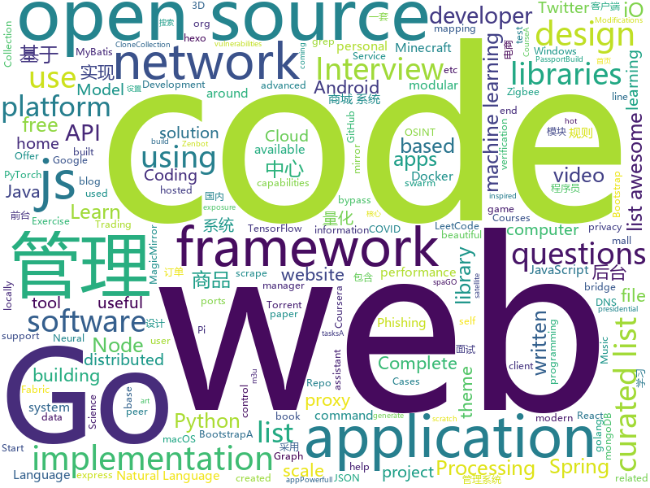

# 2020-06-15
See what the GitHub community is most excited about.

## python
+ [twint](https://github.com/twintproject/twint)(**78 stars today**): An advanced Twitter scraping & OSINT tool written in Python that doesn't use Twitter's API, allowing you to scrape a user's followers, following, Tweets and more while evading most API limitations.
+ [avatarify](https://github.com/alievk/avatarify)(**87 stars today**): Avatars for Zoom, Skype and other video-conferencing apps.
+ [you-get](https://github.com/soimort/you-get)(**122 stars today**): ⏬Dumb downloader that scrapes the web
+ [violent-python3](https://github.com/EONRaider/violent-python3)(**52 stars today**): Source code for the book "Violent Python" by TJ O'Connor. The code has been fully converted to Python 3, reformatted to comply with PEP8 standards and refactored to eliminate dependency issues involving the implementation of deprecated libraries.
+ [SuperGluePretrainedNetwork](https://github.com/magicleap/SuperGluePretrainedNetwork)(**23 stars today**): SuperGlue: Learning Feature Matching with Graph Neural Networks (CVPR 2020, Oral)
+ [system-design-primer](https://github.com/donnemartin/system-design-primer)(**237 stars today**): Learn how to design large-scale systems. Prep for the system design interview. Includes Anki flashcards.
+ [transformers](https://github.com/huggingface/transformers)(**81 stars today**): 🤗Transformers: State-of-the-art Natural Language Processing for Pytorch and TensorFlow 2.0.
+ [pulse](https://github.com/adamian98/pulse)(**76 stars today**): PULSE: Self-Supervised Photo Upsampling via Latent Space Exploration of Generative Models
+ [stylegan2](https://github.com/NVlabs/stylegan2)(**30 stars today**): StyleGAN2 - Official TensorFlow Implementation
+ [Real-Time-Voice-Cloning](https://github.com/CorentinJ/Real-Time-Voice-Cloning)(**28 stars today**): Clone a voice in 5 seconds to generate arbitrary speech in real-time
+ [core](https://github.com/home-assistant/core)(**19 stars today**): 🏡Open source home automation that puts local control and privacy first
+ [Shodanfy.py](https://github.com/m4ll0k/Shodanfy.py)(**28 stars today**): Get ports,vulnerabilities,informations,banners,..etc for any IP with Shodan (no apikey! no rate-limit!)
+ [nlp](https://github.com/huggingface/nlp)(**122 stars today**): 🤗nlp: datasets and evaluation metrics for Natural Language Processing in NumPy, Pandas, PyTorch and TensorFlow
+ [manim](https://github.com/3b1b/manim)(**79 stars today**): Animation engine for explanatory math videos
+ [zipline](https://github.com/quantopian/zipline)(**7 stars today**): Zipline, a Pythonic Algorithmic Trading Library
+ [MicroscoPy](https://github.com/IBM/MicroscoPy)(**21 stars today**): An open-source, motorized, and modular microscope built using LEGO bricks, Arduino, Raspberry Pi and 3D printing.
+ [dfdc_deepfake_challenge](https://github.com/selimsef/dfdc_deepfake_challenge)(**65 stars today**): A prize winning solution for DFDC challenge
+ [pegasus](https://github.com/google-research/pegasus)(**74 stars today**): 
+ [abu](https://github.com/bbfamily/abu)(**6 stars today**): 阿布量化交易系统(股票，期权，期货，比特币，机器学习) 基于python的开源量化交易，量化投资架构
+ [public-apis](https://github.com/public-apis/public-apis)(**94 stars today**): A collective list of free APIs for use in software and web development.
+ [gpt-2](https://github.com/openai/gpt-2)(**57 stars today**): Code for the paper "Language Models are Unsupervised Multitask Learners"
+ [docker-pi-hole](https://github.com/pi-hole/docker-pi-hole)(**1 stars today**): Pi-hole in a docker container
+ [PhoneSploit](https://github.com/metachar/PhoneSploit)(**5 stars today**): Using open Adb ports we can exploit a Andriod Device
+ [prefect](https://github.com/PrefectHQ/prefect)(**9 stars today**): A modern data workflow platform
+ [PayloadsAllTheThings](https://github.com/swisskyrepo/PayloadsAllTheThings)(**57 stars today**): A list of useful payloads and bypass for Web Application Security and Pentest/CTF

## java
+ [cwa-server](https://github.com/corona-warn-app/cwa-server)(**29 stars today**): Backend implementation for the Apple/Google exposure notification API.
+ [cwa-verification-server](https://github.com/corona-warn-app/cwa-verification-server)(**6 stars today**): Backend implementation of the verification process
+ [Mindustry](https://github.com/Anuken/Mindustry)(**4 stars today**): A sandbox tower defense game
+ [mall-swarm](https://github.com/macrozheng/mall-swarm)(**40 stars today**): mall-swarm是一套微服务商城系统，采用了 Spring Cloud Greenwich、Spring Boot 2、MyBatis、Docker、Elasticsearch等核心技术，同时提供了基于Vue的管理后台方便快速搭建系统。mall-swarm在电商业务的基础集成了注册中心、配置中心、监控中心、网关等系统功能。文档齐全，附带全套Spring Cloud教程。
+ [mall](https://github.com/macrozheng/mall)(**56 stars today**): mall项目是一套电商系统，包括前台商城系统及后台管理系统，基于SpringBoot+MyBatis实现，采用Docker容器化部署。 前台商城系统包含首页门户、商品推荐、商品搜索、商品展示、购物车、订单流程、会员中心、客户服务、帮助中心等模块。 后台管理系统包含商品管理、订单管理、会员管理、促销管理、运营管理、内容管理、统计报表、财务管理、权限管理、设置等模块。
+ [MCVmComputers](https://github.com/Delta2Force/MCVmComputers)(**30 stars today**): Order computer parts from a satellite orbiting around your minecraft world and build actual working computers with them!
+ [igniter](https://github.com/trojan-gfw/igniter)(**21 stars today**): A trojan client for Android (UNDER CONSTRUCTION).
+ [CtCI-6th-Edition](https://github.com/careercup/CtCI-6th-Edition)(**7 stars today**): Cracking the Coding Interview 6th Ed. Solutions
+ [openhab-addons](https://github.com/openhab/openhab-addons)(**3 stars today**): Add-ons for openHAB
+ [JavaGuide](https://github.com/Snailclimb/JavaGuide)(**72 stars today**): 「Java学习+面试指南」一份涵盖大部分Java程序员所需要掌握的核心知识。
+ [MinecraftForge](https://github.com/MinecraftForge/MinecraftForge)(**3 stars today**): Modifications to the Minecraft base files to assist in compatibility between mods.
+ [RxJava](https://github.com/ReactiveX/RxJava)(**11 stars today**): RxJava – Reactive Extensions for the JVM – a library for composing asynchronous and event-based programs using observable sequences for the Java VM.
+ [interview](https://github.com/mission-peace/interview)(**14 stars today**): Interview questions
+ [AmazeFileManager](https://github.com/TeamAmaze/AmazeFileManager)(**2 stars today**): Material design file manager for Android
+ [LuckPerms](https://github.com/lucko/LuckPerms)(**1 stars today**): A permissions plugin for Minecraft servers.
+ [android](https://github.com/nextcloud/android)(**6 stars today**): 📱Nextcloud Android app
+ [xdm](https://github.com/subhra74/xdm)(**7 stars today**): Powerfull download accelerator and video downloader
+ [skywalking](https://github.com/apache/skywalking)(**29 stars today**): APM, Application Performance Monitoring System
+ [cwa-verification-portal](https://github.com/corona-warn-app/cwa-verification-portal)(**1 stars today**): Frontend implementation of verification process
+ [TagMo](https://github.com/HiddenRamblings/TagMo)(**7 stars today**): 
+ [spring-microservices](https://github.com/in28minutes/spring-microservices)(**0 stars today**): Spring Microservices using Spring Cloud
+ [fabric](https://github.com/FabricMC/fabric)(**1 stars today**): Essential hooks and patches for modding with Fabric.
+ [AntennaPod](https://github.com/AntennaPod/AntennaPod)(**1 stars today**): A podcast manager for Android
+ [ingrosware](https://github.com/Ingros/ingrosware)(**6 stars today**): best in the game.
+ [leetcode](https://github.com/doocs/leetcode)(**4 stars today**): 😏LeetCode solutions in any programming language | 多种编程语言实现 LeetCode、《剑指 Offer（第 2 版）》、《程序员面试金典（第 6 版）》题解

## unknown
+ [gpt-3](https://github.com/openai/gpt-3)(**52 stars today**): GPT-3: Language Models are Few-Shot Learners
+ [QuantumultX](https://github.com/nzw9314/QuantumultX)(**18 stars today**): QuantumultX
+ [free-programming-books](https://github.com/EbookFoundation/free-programming-books)(**214 stars today**): 📚Freely available programming books
+ [javascript-questions](https://github.com/lydiahallie/javascript-questions)(**652 stars today**): A long list of (advanced) JavaScript questions, and their explanations✨
+ [COVID-19](https://github.com/CSSEGISandData/COVID-19)(**75 stars today**): Novel Coronavirus (COVID-19) Cases, provided by JHU CSSE
+ [awesome-production-machine-learning](https://github.com/EthicalML/awesome-production-machine-learning)(**13 stars today**): A curated list of awesome open source libraries to deploy, monitor, version and scale your machine learning
+ [data_science_questions](https://github.com/jayveer2807/data_science_questions)(**12 stars today**): 
+ [managers-playbook](https://github.com/ksindi/managers-playbook)(**108 stars today**): 📖Heuristics for effective management
+ [cwa-documentation](https://github.com/corona-warn-app/cwa-documentation)(**31 stars today**): Project overview, general documentation, and white papers.
+ [developer-roadmap](https://github.com/kamranahmedse/developer-roadmap)(**104 stars today**): Roadmap to becoming a web developer in 2020
+ [gitignore](https://github.com/github/gitignore)(**43 stars today**): A collection of useful .gitignore templates
+ [1024app-android](https://github.com/yuuwill/1024app-android)(**7 stars today**): 草榴官方客户端，小草客户端，Android
+ [wwdc](https://github.com/twostraws/wwdc)(**62 stars today**): WWDC Community: Learning and sharing together
+ [awesome-gog-galaxy](https://github.com/Mixaill/awesome-gog-galaxy)(**10 stars today**): A list of GOG Galaxy 2.0 integrations and upcoming features
+ [machine-learning-resources](https://github.com/datascienceid/machine-learning-resources)(**5 stars today**): A curated list of awesome machine learning frameworks, libraries, courses, books and many more.
+ [Best-websites-a-programmer-should-visit](https://github.com/sdmg15/Best-websites-a-programmer-should-visit)(**20 stars today**): 🔗Some useful websites for programmers.
+ [coding-interview-university](https://github.com/jwasham/coding-interview-university)(**74 stars today**): A complete computer science study plan to become a software engineer.
+ [clash_for_windows_pkg](https://github.com/Fndroid/clash_for_windows_pkg)(**30 stars today**): A Windows/macOS GUI based on Clash
+ [terminal-mac-cheatsheet](https://github.com/0nn0/terminal-mac-cheatsheet)(**4 stars today**): List of my most used commands and shortcuts in the terminal for Mac
+ [awesome-react-components](https://github.com/brillout/awesome-react-components)(**7 stars today**): Curated List of React Components & Libraries.
+ [Flutter-Course-Resources](https://github.com/londonappbrewery/Flutter-Course-Resources)(**13 stars today**): Learn to Code While Building Apps - The Complete Flutter Development Bootcamp
+ [awesome-iptv](https://github.com/iptv-org/awesome-iptv)(**11 stars today**): A curated list of resources related to IPTV
+ [datasharing](https://github.com/jtleek/datasharing)(**7 stars today**): The Leek group guide to data sharing
+ [Beginner-Network-Pentesting](https://github.com/hmaverickadams/Beginner-Network-Pentesting)(**7 stars today**): Notes for Beginner Network Pentesting Course
+ [app-ideas](https://github.com/florinpop17/app-ideas)(**70 stars today**): A Collection of application ideas which can be used to improve your coding skills.

## javascript
+ [playwright](https://github.com/microsoft/playwright)(**317 stars today**): Node library to automate Chromium, Firefox and WebKit with a single API
+ [myDrive](https://github.com/subnub/myDrive)(**208 stars today**): Node.js and mongoDB Google Drive Clone
+ [iptv](https://github.com/iptv-org/iptv)(**650 stars today**): Collection of 8000+ publicly available IPTV channels from all over the world
+ [devconnector_2.0](https://github.com/bradtraversy/devconnector_2.0)(**9 stars today**): Social network for developers, built on the MERN stack
+ [fullstack-course4](https://github.com/jhu-ep-coursera/fullstack-course4)(**40 stars today**): Example code for HTML, CSS, and Javascript for Web Developers Coursera Course
+ [Script](https://github.com/NobyDa/Script)(**24 stars today**): This project is based on the scripting capabilities of two excellent iOS proxy tools, Quantumult X or Surge.
+ [joplin](https://github.com/laurent22/joplin)(**23 stars today**): Joplin - an open source note taking and to-do application with synchronization capabilities for Windows, macOS, Linux, Android and iOS. Forum: https://discourse.joplinapp.org/
+ [v4](https://github.com/bchiang7/v4)(**14 stars today**): Fourth iteration of my personal website
+ [awesome-selfhosted](https://github.com/awesome-selfhosted/awesome-selfhosted)(**89 stars today**): A list of Free Software network services and web applications which can be hosted locally. Selfhosting is the process of hosting and managing applications instead of renting from Software-as-a-Service providers
+ [svelte](https://github.com/sveltejs/svelte)(**97 stars today**): Cybernetically enhanced web apps
+ [decentralized-video-chat](https://github.com/ianramzy/decentralized-video-chat)(**48 stars today**): 🚀Zipcall.io🚀Peer to peer browser video calling platform with unmatched video quality and latency.
+ [complete-javascript-course](https://github.com/jonasschmedtmann/complete-javascript-course)(**12 stars today**): Starter files, final projects and FAQ for my Complete JavaScript course
+ [shapez.io](https://github.com/tobspr/shapez.io)(**72 stars today**): shapez.io is an open source base building game inspired by factorio! Available on web & desktop
+ [freeCodeCamp](https://github.com/freeCodeCamp/freeCodeCamp)(**47 stars today**): freeCodeCamp.org's open source codebase and curriculum. Learn to code at home.
+ [zigbee2mqtt](https://github.com/Koenkk/zigbee2mqtt)(**7 stars today**): Zigbee🐝to MQTT bridge🌉, get rid of your proprietary Zigbee bridges🔨
+ [MagicMirror](https://github.com/MichMich/MagicMirror)(**10 stars today**): MagicMirror² is an open source modular smart mirror platform. With a growing list of installable modules, the MagicMirror² allows you to convert your hallway or bathroom mirror into your personal assistant.
+ [covid19india-react](https://github.com/covid19india/covid19india-react)(**24 stars today**): Tracking the impact of COVID-19 in India
+ [JSVerbalExpressions](https://github.com/VerbalExpressions/JSVerbalExpressions)(**29 stars today**): JavaScript Regular expressions made easy
+ [reactjs-interview-questions](https://github.com/sudheerj/reactjs-interview-questions)(**61 stars today**): List of top 500 ReactJS Interview Questions & Answers....Coding exercise questions are coming soon!!
+ [p5.js](https://github.com/processing/p5.js)(**13 stars today**): p5.js is a client-side JS platform that empowers artists, designers, students, and anyone to learn to code and express themselves creatively on the web. It is based on the core principles of Processing. http://twitter.com/p5xjs —
+ [next-auth](https://github.com/iaincollins/next-auth)(**48 stars today**): Easy authentication for Next.js and Serverless
+ [foliate](https://github.com/johnfactotum/foliate)(**9 stars today**): A simple and modern GTK eBook reader
+ [three.js](https://github.com/mrdoob/three.js)(**35 stars today**): JavaScript 3D library.
+ [node_passport_login](https://github.com/bradtraversy/node_passport_login)(**0 stars today**): Node.js login, registration and access control using Express and Passport
+ [node-react-ecommerce](https://github.com/basir/node-react-ecommerce)(**4 stars today**): Build ECommerce Website Like Amazon By React & Node & MongoDB

## html
+ [awesome-piracy](https://github.com/Igglybuff/awesome-piracy)(**82 stars today**): A curated list of awesome warez and piracy links
+ [datasciencecoursera](https://github.com/mGalarnyk/datasciencecoursera)(**3 stars today**): Data Science Repo and blog for John Hopkins Coursera Courses. Please let me know if you have any questions.
+ [home-assistant.io](https://github.com/home-assistant/home-assistant.io)(**6 stars today**): 📘Home Assistant User documentation
+ [webdevbootcamp](https://github.com/nax3t/webdevbootcamp)(**3 stars today**): All source code for back-end projects from the Web Developer Bootcamp
+ [zphisher](https://github.com/htr-tech/zphisher)(**7 stars today**): Automated Phishing Tool
+ [startbootstrap-sb-admin-2](https://github.com/BlackrockDigital/startbootstrap-sb-admin-2)(**5 stars today**): A free, open source, Bootstrap admin theme created by Start Bootstrap
+ [startbootstrap-resume](https://github.com/BlackrockDigital/startbootstrap-resume)(**3 stars today**): A Bootstrap 4 resume/CV theme created by Start Bootstrap
+ [TinDog-Start](https://github.com/londonappbrewery/TinDog-Start)(**2 stars today**): 
+ [hexo-theme-matery](https://github.com/blinkfox/hexo-theme-matery)(**8 stars today**): A beautiful hexo blog theme with material design and responsive design.一个基于材料设计和响应式设计而成的全面、美观的Hexo主题。国内访问：http://blinkfox.com
+ [ACL4SSR](https://github.com/ACL4SSR/ACL4SSR)(**7 stars today**): SSR 去广告ACL规则/SS完整GFWList规则/Clash规则碎片，Telegram频道订阅地址
+ [us-potus-model](https://github.com/TheEconomist/us-potus-model)(**25 stars today**): Code for a dynamic multilevel Bayesian model to predict US presidential elections. Written in R and Stan.
+ [Front-end-Developer-Interview-Questions](https://github.com/h5bp/Front-end-Developer-Interview-Questions)(**14 stars today**): A list of helpful front-end related questions you can use to interview potential candidates, test yourself or completely ignore.
+ [all-contributors](https://github.com/all-contributors/all-contributors)(**6 stars today**): ✨Recognize all contributors, not just the ones who push code✨
+ [zenbot](https://github.com/DeviaVir/zenbot)(**4 stars today**): Zenbot is a command-line cryptocurrency trading bot using Node.js and MongoDB.
+ [music-grid](https://github.com/irshadshalu/music-grid)(**93 stars today**): A Music Grid you can play around and create short music.
+ [personal-website](https://github.com/github/personal-website)(**3 stars today**): Code that'll help you kickstart a personal website that showcases your work as a software developer.
+ [CNN-Architectures](https://github.com/Machine-Learning-Tokyo/CNN-Architectures)(**11 stars today**): 
+ [free-for-dev](https://github.com/ripienaar/free-for-dev)(**31 stars today**): A list of SaaS, PaaS and IaaS offerings that have free tiers of interest to devops and infradev
+ [shellphish](https://github.com/thelinuxchoice/shellphish)(**1 stars today**): 19 Social Media Phishing Pages #phishing #shellphish #phish
+ [iptv-m3u-maker](https://github.com/EvilCult/iptv-m3u-maker)(**7 stars today**): IPTV 国内+国外 电视台直播源m3u文件, 收集&汇总&本地源脚本
+ [bandinchina](https://github.com/caffeine-overload/bandinchina)(**3 stars today**): Naming and shaming companies who kowtow to Chinese censorship requests
+ [simple-icons](https://github.com/simple-icons/simple-icons)(**5 stars today**): SVG icons for popular brands
+ [learning-area](https://github.com/mdn/learning-area)(**6 stars today**): Github repo for the MDN Learning Area.
+ [web-dev-starter](https://github.com/pluralsight/web-dev-starter)(**0 stars today**): 
+ [wpt](https://github.com/web-platform-tests/wpt)(**3 stars today**): Test suites for Web platform specs — including WHATWG, W3C, and others

## go
+ [cortex](https://github.com/cortexlabs/cortex)(**242 stars today**): Build machine learning APIs
+ [Amass](https://github.com/OWASP/Amass)(**20 stars today**): In-depth Attack Surface Mapping and Asset Discovery
+ [yay](https://github.com/Jguer/yay)(**16 stars today**): Yet another Yogurt - An AUR Helper written in Go
+ [learngo](https://github.com/inancgumus/learngo)(**91 stars today**): 1000+ Hand-Crafted Go Examples, Exercises, and Quizzes
+ [ion](https://github.com/pion/ion)(**17 stars today**): Distributed RTC System by pure Go and Flutter
+ [gjson](https://github.com/tidwall/gjson)(**35 stars today**): Get JSON values quickly - JSON parser for Go
+ [webrtc](https://github.com/pion/webrtc)(**73 stars today**): Pure Go implementation of the WebRTC API
+ [discordgo](https://github.com/bwmarrin/discordgo)(**3 stars today**): (Golang) Go bindings for Discord
+ [hub](https://github.com/github/hub)(**23 stars today**): A command-line tool that makes git easier to use with GitHub.
+ [spago](https://github.com/nlpodyssey/spago)(**94 stars today**): spaGO is a beautiful and maintainable machine learning library written in Go designed to support relevant neural network architectures in natural language processing tasks
+ [v2ray-core](https://github.com/v2ray/v2ray-core)(**42 stars today**): A platform for building proxies to bypass network restrictions.
+ [awesome-go](https://github.com/avelino/awesome-go)(**22 stars today**): A curated list of awesome Go frameworks, libraries and software
+ [loki](https://github.com/grafana/loki)(**23 stars today**): Like Prometheus, but for logs.
+ [graphql](https://github.com/graphql-go/graphql)(**7 stars today**): An implementation of GraphQL for Go / Golang
+ [terraform-provider-aws](https://github.com/terraform-providers/terraform-provider-aws)(**3 stars today**): Terraform AWS provider
+ [PhoneInfoga](https://github.com/sundowndev/PhoneInfoga)(**7 stars today**): Advanced information gathering & OSINT framework for phone numbers
+ [7days-golang](https://github.com/geektutu/7days-golang)(**14 stars today**): 7 days golang apps from scratch (web framework Gee, distributed cache GeeCache, object relational mapping ORM framework GeeORM etc) 7天用Go动手写/从零实现系列
+ [dgraph](https://github.com/dgraph-io/dgraph)(**14 stars today**): Fast, Distributed Graph DB
+ [fasthttp](https://github.com/valyala/fasthttp)(**15 stars today**): Fast HTTP package for Go. Tuned for high performance. Zero memory allocations in hot paths. Up to 10x faster than net/http
+ [act](https://github.com/nektos/act)(**25 stars today**): Run your GitHub Actions locally🚀
+ [cloud-torrent](https://github.com/jpillora/cloud-torrent)(**4 stars today**): ☁️Cloud Torrent: a self-hosted remote torrent client
+ [fabric](https://github.com/hyperledger/fabric)(**10 stars today**): Hyperledger Fabric is an enterprise-grade permissioned distributed ledger framework for developing solutions and applications. Its modular and versatile design satisfies a broad range of industry use cases. It offers a unique approach to consensus that enables performance at scale while preserving privacy.
+ [pgx](https://github.com/jackc/pgx)(**3 stars today**): PostgreSQL driver and toolkit for Go
+ [gf](https://github.com/tomnomnom/gf)(**7 stars today**): A wrapper around grep, to help you grep for things
+ [dnscrypt-proxy](https://github.com/DNSCrypt/dnscrypt-proxy)(**6 stars today**): dnscrypt-proxy 2 - A flexible DNS proxy, with support for encrypted DNS protocols.

## WordCloud

