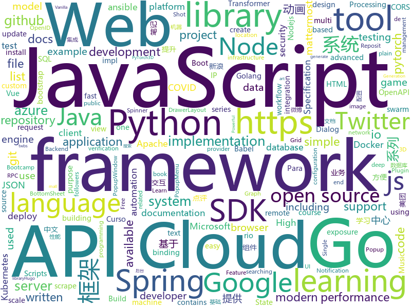

# 2020-06-16
See what the GitHub community is most excited about.

## python
+ [pifuhd](https://github.com/facebookresearch/pifuhd)(**248 stars today**): High-Resolution 3D Human Digitization from A Single Image.
+ [pulse](https://github.com/adamian98/pulse)(**88 stars today**): PULSE: Self-Supervised Photo Upsampling via Latent Space Exploration of Generative Models
+ [integrations-core](https://github.com/DataDog/integrations-core)(**0 stars today**): Core integrations of the Datadog Agent
+ [FairMOT](https://github.com/ifzhang/FairMOT)(**11 stars today**): A simple baseline for one-shot multi-object tracking
+ [azure-sdk-for-python](https://github.com/Azure/azure-sdk-for-python)(**2 stars today**): This repository is for active development of the Azure SDK for Python. For consumers of the SDK we recommend visiting our public developer docs at https://docs.microsoft.com/en-us/python/azure/ or our versioned developer docs at https://azure.github.io/azure-sdk-for-python.
+ [ParlAI](https://github.com/facebookresearch/ParlAI)(**8 stars today**): A framework for training and evaluating AI models on a variety of openly available dialogue datasets.
+ [fastHan](https://github.com/fastnlp/fastHan)(**55 stars today**): fastHan是基于fastNLP与pytorch实现的中文自然语言处理工具，像spacy一样调用方便。
+ [ansible](https://github.com/ansible/ansible)(**18 stars today**): Ansible is a radically simple IT automation platform that makes your applications and systems easier to deploy. Avoid writing scripts or custom code to deploy and update your applications — automate in a language that approaches plain English, using SSH, with no agents to install on remote systems. https://docs.ansible.com/ansible/
+ [prefect](https://github.com/PrefectHQ/prefect)(**11 stars today**): A modern data workflow platform
+ [python-docs-samples](https://github.com/GoogleCloudPlatform/python-docs-samples)(**6 stars today**): Code samples used on cloud.google.com
+ [incubator-tvm](https://github.com/apache/incubator-tvm)(**6 stars today**): Open deep learning compiler stack for cpu, gpu and specialized accelerators
+ [twint](https://github.com/twintproject/twint)(**196 stars today**): An advanced Twitter scraping & OSINT tool written in Python that doesn't use Twitter's API, allowing you to scrape a user's followers, following, Tweets and more while evading most API limitations.
+ [byob](https://github.com/malwaredllc/byob)(**98 stars today**): BYOB (Build Your Own Botnet)
+ [you-get](https://github.com/soimort/you-get)(**128 stars today**): ⏬Dumb downloader that scrapes the web
+ [SuperGluePretrainedNetwork](https://github.com/magicleap/SuperGluePretrainedNetwork)(**34 stars today**): SuperGlue: Learning Feature Matching with Graph Neural Networks (CVPR 2020, Oral)
+ [pytorch3d](https://github.com/facebookresearch/pytorch3d)(**39 stars today**): PyTorch3D is FAIR's library of reusable components for deep learning with 3D data
+ [espnet](https://github.com/espnet/espnet)(**4 stars today**): End-to-End Speech Processing Toolkit
+ [fastNLP](https://github.com/fastnlp/fastNLP)(**14 stars today**): fastNLP: A Modularized and Extensible NLP Framework. Currently still in incubation.
+ [iOS-DeviceSupport](https://github.com/iGhibli/iOS-DeviceSupport)(**13 stars today**): This repository holds the device support files for the iOS, and I will update it regularly.
+ [Chinese-Text-Classification-Pytorch](https://github.com/649453932/Chinese-Text-Classification-Pytorch)(**16 stars today**): 中文文本分类，TextCNN，TextRNN，FastText，TextRCNN，BiLSTM_Attention，DPCNN，Transformer，基于pytorch，开箱即用。
+ [efficientdet-pytorch](https://github.com/rwightman/efficientdet-pytorch)(**9 stars today**): A PyTorch impl of EfficientDet faithful to the original Google impl w/ ported weights
+ [system-design-primer](https://github.com/donnemartin/system-design-primer)(**144 stars today**): Learn how to design large-scale systems. Prep for the system design interview. Includes Anki flashcards.
+ [weiboSpider](https://github.com/dataabc/weiboSpider)(**7 stars today**): 新浪微博爬虫，用python爬取新浪微博数据
+ [smuggler](https://github.com/defparam/smuggler)(**60 stars today**): Smuggler - An HTTP Request Smuggling / Desync testing tool written in Python 3
+ [transformers](https://github.com/huggingface/transformers)(**65 stars today**): 🤗Transformers: State-of-the-art Natural Language Processing for Pytorch and TensorFlow 2.0.

## java
+ [cwa-server](https://github.com/corona-warn-app/cwa-server)(**30 stars today**): Backend implementation for the Apple/Google exposure notification API.
+ [cwa-verification-server](https://github.com/corona-warn-app/cwa-verification-server)(**11 stars today**): Backend implementation of the verification process
+ [testcontainers-java](https://github.com/testcontainers/testcontainers-java)(**4 stars today**): Testcontainers is a Java library that supports JUnit tests, providing lightweight, throwaway instances of common databases, Selenium web browsers, or anything else that can run in a Docker container.
+ [java-docs-samples](https://github.com/GoogleCloudPlatform/java-docs-samples)(**1 stars today**): 
+ [geode](https://github.com/apache/geode)(**1 stars today**): Apache Geode
+ [geoserver](https://github.com/geoserver/geoserver)(**2 stars today**): Official GeoServer repository
+ [Mindustry](https://github.com/Anuken/Mindustry)(**9 stars today**): A sandbox tower defense game
+ [ip2region](https://github.com/lionsoul2014/ip2region)(**51 stars today**): Ip2region is a offline IP location library with accuracy rate of 99.9% and 0.0x millseconds searching performance. DB file is ONLY a few megabytes with all IP address stored. binding for Java,PHP,C,Python,Nodejs,Golang,C#,lua. Binary,B-tree,Memory searching algorithm
+ [cwa-verification-portal](https://github.com/corona-warn-app/cwa-verification-portal)(**2 stars today**): Frontend implementation of verification process
+ [karate](https://github.com/intuit/karate)(**7 stars today**): Test Automation Made Simple
+ [lucene-solr](https://github.com/apache/lucene-solr)(**4 stars today**): Apache Lucene and Solr open-source search software
+ [spring-cloud-kubernetes](https://github.com/spring-cloud/spring-cloud-kubernetes)(**3 stars today**): Kubernetes integration with Spring Cloud Discovery Client, Configuration, etc...
+ [maxwell](https://github.com/zendesk/maxwell)(**1 stars today**): Maxwell's daemon, a mysql-to-json kafka producer
+ [kafdrop](https://github.com/obsidiandynamics/kafdrop)(**6 stars today**): Kafka Web UI
+ [mall-swarm](https://github.com/macrozheng/mall-swarm)(**24 stars today**): mall-swarm是一套微服务商城系统，采用了 Spring Cloud Greenwich、Spring Boot 2、MyBatis、Docker、Elasticsearch等核心技术，同时提供了基于Vue的管理后台方便快速搭建系统。mall-swarm在电商业务的基础集成了注册中心、配置中心、监控中心、网关等系统功能。文档齐全，附带全套Spring Cloud教程。
+ [tutorials](https://github.com/eugenp/tutorials)(**20 stars today**): Just Announced - "Learn Spring Security OAuth":
+ [liferay-portal](https://github.com/liferay/liferay-portal)(**1 stars today**): 
+ [dbeaver](https://github.com/dbeaver/dbeaver)(**25 stars today**): Free universal database tool and SQL client
+ [cat](https://github.com/dianping/cat)(**18 stars today**): CAT 作为服务端项目基础组件，提供了 Java, C/C++, Node.js, Python, Go 等多语言客户端，已经在美团点评的基础架构中间件框架（MVC框架，RPC框架，数据库框架，缓存框架等，消息队列，配置系统等）深度集成，为美团点评各业务线提供系统丰富的性能指标、健康状况、实时告警等。
+ [beam](https://github.com/apache/beam)(**7 stars today**): Apache Beam is a unified programming model for Batch and Streaming
+ [dubbo](https://github.com/apache/dubbo)(**11 stars today**): Apache Dubbo is a high-performance, java based, open source RPC framework.
+ [jenkins](https://github.com/jenkinsci/jenkins)(**7 stars today**): Jenkins automation server
+ [XPopup](https://github.com/li-xiaojun/XPopup)(**17 stars today**): 🔥XPopup2.0版本重磅来袭，2倍以上性能提升，带来可观的动画性能优化和交互细节的提升！！！功能强大，交互优雅，动画丝滑的通用弹窗！可以替代Dialog，PopupWindow，PopupMenu，BottomSheet，DrawerLayout，Spinner等组件，自带十几种效果良好的动画， 支持完全的UI和动画自定义！(Powerful and Beautiful Popup，can absolutely replace Dialog，PopupWindow，PopupMenu，BottomSheet，DrawerLayout，Spinner. With built-in animators , very easy to custom popup view.)
+ [nifi](https://github.com/apache/nifi)(**1 stars today**): Apache NiFi
+ [moshi](https://github.com/square/moshi)(**2 stars today**): A modern JSON library for Kotlin and Java.

## unknown
+ [wikileaks-9-11-files](https://github.com/gadsden0/wikileaks-9-11-files)(**12 stars today**): The files from the United States government on 9/11, released by wiki leaks.
+ [javascript-questions](https://github.com/lydiahallie/javascript-questions)(**325 stars today**): A long list of (advanced) JavaScript questions, and their explanations✨
+ [gpt-3](https://github.com/openai/gpt-3)(**80 stars today**): GPT-3: Language Models are Few-Shot Learners
+ [free-programming-books](https://github.com/EbookFoundation/free-programming-books)(**253 stars today**): 📚Freely available programming books
+ [Specs](https://github.com/CocoaPods/Specs)(**4 stars today**): The CocoaPods Master Repo
+ [CloudPentestCheatsheets](https://github.com/dafthack/CloudPentestCheatsheets)(**215 stars today**): This repository contains a collection of cheatsheets I have put together for tools related to pentesting organizations that leverage cloud providers.
+ [hosts](https://github.com/googlehosts/hosts)(**14 stars today**): 镜像：https://scaffrey.coding.net/p/hosts/git / https://git.qvq.network/googlehosts/hosts
+ [COVID-19](https://github.com/CSSEGISandData/COVID-19)(**25 stars today**): Novel Coronavirus (COVID-19) Cases, provided by JHU CSSE
+ [twitter-export](https://github.com/balajis/twitter-export)(**14 stars today**): Tool for mass export of Twitter followers to Substack, Ghost, or email list.
+ [You-Dont-Know-JS](https://github.com/getify/You-Dont-Know-JS)(**63 stars today**): A book series on JavaScript. @YDKJS on twitter.
+ [bootcamp-gostack-desafios](https://github.com/Rocketseat/bootcamp-gostack-desafios)(**15 stars today**): Repositório contendo todos os desafios dos módulos do Bootcamp Gostack
+ [you-dont-know-js-ru](https://github.com/azat-io/you-dont-know-js-ru)(**3 stars today**): 📚Russian translation of "You Don't Know JS" book series
+ [Blog](https://github.com/mqyqingfeng/Blog)(**25 stars today**): 冴羽写博客的地方，预计写四个系列：JavaScript深入系列、JavaScript专题系列、ES6系列、React系列。
+ [babel-handbook](https://github.com/jamiebuilds/babel-handbook)(**15 stars today**): 📘A guided handbook on how to use Babel and how to create plugins for Babel.
+ [pumpkin-book](https://github.com/datawhalechina/pumpkin-book)(**37 stars today**): 《机器学习》（西瓜书）公式推导解析，在线阅读地址：https://datawhalechina.github.io/pumpkin-book
+ [All-in-one_BugBounty_PDF_bundles](https://github.com/1ndianl33t/All-in-one_BugBounty_PDF_bundles)(**11 stars today**): 
+ [binance-official-api-docs](https://github.com/binance-exchange/binance-official-api-docs)(**6 stars today**): Official Documentation for the Binance APIs and Streams
+ [OpenAPI-Specification](https://github.com/OAI/OpenAPI-Specification)(**15 stars today**): The OpenAPI Specification Repository
+ [learning-path-spring-boot-microservices](https://github.com/TechPrimers/learning-path-spring-boot-microservices)(**7 stars today**): Curated path for learning Spring Boot & Microservices based on published videos in TechPrimers
+ [eloquente-javascript](https://github.com/braziljs/eloquente-javascript)(**1 stars today**): Tradução do livro Eloquent JavaScript - 2ª edição.
+ [awesome](https://github.com/sindresorhus/awesome)(**112 stars today**): 😎Awesome lists about all kinds of interesting topics
+ [xamarin-forms-goodlooking-UI](https://github.com/jsuarezruiz/xamarin-forms-goodlooking-UI)(**1 stars today**): Xamarin.Forms goodlooking UI samples
+ [modern-javascript](https://github.com/iamshaunjp/modern-javascript)(**2 stars today**): All lecture files from the Modern JavaScript (Novice to Ninja) course on Udemy.
+ [Front-End-Interview-Notebook](https://github.com/CavsZhouyou/Front-End-Interview-Notebook)(**11 stars today**): 🐜前端面试复习笔记
+ [Micro8](https://github.com/Micropoor/Micro8)(**6 stars today**): Gitbook

## javascript
+ [subscription-use-cases](https://github.com/stripe-samples/subscription-use-cases)(**0 stars today**): 
+ [engine](https://github.com/cocos-creator/engine)(**4 stars today**): Cocos Creator is a complete package of game development tools and workflow, including a game engine, resource management, scene editing, game preview, debug and publish one project to multiple platforms.
+ [puppeteer](https://github.com/puppeteer/puppeteer)(**49 stars today**): Headless Chrome Node.js API
+ [google-meet-grid-view](https://github.com/Fugiman/google-meet-grid-view)(**15 stars today**): Userscript to offer a grid-view layout in Google Meets
+ [bootstrap-datepicker](https://github.com/uxsolutions/bootstrap-datepicker)(**2 stars today**): A datepicker for twitter bootstrap (@twbs)
+ [mattermost-webapp](https://github.com/mattermost/mattermost-webapp)(**1 stars today**): Webapp of Mattermost server: https://github.com/mattermost/mattermost-server
+ [sequelize](https://github.com/sequelize/sequelize)(**12 stars today**): An easy-to-use multi SQL dialect ORM for Node.js
+ [Vulkan-Docs](https://github.com/KhronosGroup/Vulkan-Docs)(**2 stars today**): The Vulkan API Specification and related tools
+ [iptv](https://github.com/iptv-org/iptv)(**399 stars today**): Collection of 8000+ publicly available IPTV channels from all over the world
+ [graduation](https://github.com/education/graduation)(**8 stars today**): $ git remote <graduation> yearbook
+ [nuxt.js](https://github.com/nuxt/nuxt.js)(**17 stars today**): The Intuitive Vue Framework
+ [magnetW](https://github.com/xiandanin/magnetW)(**299 stars today**): 磁力链接聚合搜索
+ [sjcl](https://github.com/bitwiseshiftleft/sjcl)(**98 stars today**): Stanford Javascript Crypto Library
+ [aws-sdk-js](https://github.com/aws/aws-sdk-js)(**3 stars today**): AWS SDK for JavaScript in the browser and Node.js
+ [alpine](https://github.com/alpinejs/alpine)(**41 stars today**): A rugged, minimal framework for composing JavaScript behavior in your markup.
+ [mermaid](https://github.com/mermaid-js/mermaid)(**64 stars today**): Generation of diagram and flowchart from text in a similar manner as markdown
+ [parcel](https://github.com/parcel-bundler/parcel)(**14 stars today**): 📦🚀Blazing fast, zero configuration web application bundler
+ [myDrive](https://github.com/subnub/myDrive)(**159 stars today**): Node.js and mongoDB Google Drive Clone
+ [gutenberg](https://github.com/WordPress/gutenberg)(**4 stars today**): The Block Editor project for WordPress and beyond. Plugin is available from the official repository.
+ [deck.gl](https://github.com/visgl/deck.gl)(**4 stars today**): WebGL2 powered geospatial visualization layers
+ [mocha](https://github.com/mochajs/mocha)(**6 stars today**): ☕️simple, flexible, fun javascript test framework for node.js & the browser
+ [chinese-poetry](https://github.com/chinese-poetry/chinese-poetry)(**24 stars today**): The most comprehensive database of Chinese poetry🧶最全中华古诗词数据库, 唐宋两朝近一万四千古诗人, 接近5.5万首唐诗加26万宋诗. 两宋时期1564位词人，21050首词。
+ [cors-anywhere](https://github.com/Rob--W/cors-anywhere)(**5 stars today**): CORS Anywhere is a NodeJS reverse proxy which adds CORS headers to the proxied request.
+ [openlayers](https://github.com/openlayers/openlayers)(**3 stars today**): OpenLayers
+ [covid19-forecast-hub](https://github.com/reichlab/covid19-forecast-hub)(**2 stars today**): Projections of COVID-19, in standardized format

## html
+ [wpt](https://github.com/web-platform-tests/wpt)(**6 stars today**): Test suites for Web platform specs — including WHATWG, W3C, and others
+ [webdevbootcamp](https://github.com/nax3t/webdevbootcamp)(**7 stars today**): All source code for back-end projects from the Web Developer Bootcamp
+ [qcloud-documents](https://github.com/tencentyun/qcloud-documents)(**4 stars today**): 腾讯云官方文档
+ [seldon-core](https://github.com/SeldonIO/seldon-core)(**3 stars today**): A framework to deploy, manage and scale your production machine learning to thousands of models
+ [swagger-codegen](https://github.com/swagger-api/swagger-codegen)(**9 stars today**): swagger-codegen contains a template-driven engine to generate documentation, API clients and server stubs in different languages by parsing your OpenAPI / Swagger definition.
+ [hackathon2020](https://github.com/ohbm/hackathon2020)(**12 stars today**): Website for the 2020 OHBM Hackathon (Location: 3rd planet from the Sun)
+ [tiny-slider](https://github.com/ganlanyuan/tiny-slider)(**4 stars today**): Vanilla javascript slider for all purposes.
+ [Graphics](https://github.com/Unity-Technologies/Graphics)(**0 stars today**): Unity Graphics - Including Scriptable Render Pipeline
+ [fullstack-course5](https://github.com/jhu-ep-coursera/fullstack-course5)(**1 stars today**): All of the source code for the Single Page Web Applications with AngularJS course.
+ [hyperblog](https://github.com/freddier/hyperblog)(**7 stars today**): Un blog increíble para el curso de Git y Github de Platzi
+ [zepto](https://github.com/madrobby/zepto)(**0 stars today**): Zepto.js is a minimalist JavaScript library for modern browsers, with a jQuery-compatible API
+ [Coursera-ML-AndrewNg-Notes](https://github.com/fengdu78/Coursera-ML-AndrewNg-Notes)(**35 stars today**): 吴恩达老师的机器学习课程个人笔记
+ [PowerBI-DataScience](https://github.com/dsacademybr/PowerBI-DataScience)(**3 stars today**): Repositório do Curso Microsoft Power BI Para Data Science
+ [music-grid](https://github.com/irshadshalu/music-grid)(**32 stars today**): A Music Grid you can play around and create short music.
+ [mxgraph](https://github.com/jgraph/mxgraph)(**5 stars today**): mxGraph is a fully client side JavaScript diagramming library
+ [hugo-book](https://github.com/alex-shpak/hugo-book)(**2 stars today**): Hugo documentation theme as simple as plain book
+ [cypress-example-kitchensink](https://github.com/cypress-io/cypress-example-kitchensink)(**2 stars today**): This is an example app used to showcase Cypress.io testing.
+ [openjdk-docker](https://github.com/AdoptOpenJDK/openjdk-docker)(**1 stars today**): Scripts for creating Docker images of OpenJDK binaries.
+ [mslearn-tailspin-spacegame-web](https://github.com/MicrosoftDocs/mslearn-tailspin-spacegame-web)(**0 stars today**): Code used in Microsoft Learn modules to support Azure DevOps
+ [simpl](https://github.com/samdutton/simpl)(**1 stars today**): Simplest possible examples of HTML, CSS and Javascript:
+ [coreui-free-laravel-admin-template](https://github.com/coreui/coreui-free-laravel-admin-template)(**1 stars today**): CoreUI Free Laravel Bootstrap Admin Template
+ [fastText](https://github.com/facebookresearch/fastText)(**7 stars today**): Library for fast text representation and classification.
+ [web-moderno](https://github.com/cod3rcursos/web-moderno)(**6 stars today**): 
+ [keycloak-documentation](https://github.com/keycloak/keycloak-documentation)(**2 stars today**): 
+ [html](https://github.com/whatwg/html)(**5 stars today**): HTML Standard

## go
+ [vault](https://github.com/hashicorp/vault)(**17 stars today**): A tool for secrets management, encryption as a service, and privileged access management
+ [argo-cd](https://github.com/argoproj/argo-cd)(**8 stars today**): Declarative continuous deployment for Kubernetes.
+ [loki](https://github.com/grafana/loki)(**22 stars today**): Like Prometheus, but for logs.
+ [goplus](https://github.com/qiniu/goplus)(**16 stars today**): GoPlus - The Go+ language for data science
+ [gin](https://github.com/gin-gonic/gin)(**44 stars today**): Gin is a HTTP web framework written in Go (Golang). It features a Martini-like API with much better performance -- up to 40 times faster. If you need smashing performance, get yourself some Gin.
+ [cortex](https://github.com/cortexlabs/cortex)(**114 stars today**): Build machine learning APIs
+ [exposure-notifications-server](https://github.com/google/exposure-notifications-server)(**16 stars today**): Exposure Notification Reference Server | Covid-19 Exposure Notifications
+ [opentelemetry-collector](https://github.com/open-telemetry/opentelemetry-collector)(**2 stars today**): OpenTelemetry Service
+ [opa](https://github.com/open-policy-agent/opa)(**5 stars today**): An open source, general-purpose policy engine.
+ [installer](https://github.com/openshift/installer)(**1 stars today**): Install an OpenShift 4.x cluster
+ [learngo](https://github.com/inancgumus/learngo)(**116 stars today**): 1000+ Hand-Crafted Go Examples, Exercises, and Quizzes
+ [hydra](https://github.com/ory/hydra)(**11 stars today**): OAuth2 Server and OpenID Certified™ OpenID Connect Provider written in Go - cloud native, security-first, open source API security for your infrastructure. SDKs for any language.
+ [ginkgo](https://github.com/onsi/ginkgo)(**2 stars today**): BDD Testing Framework for Go
+ [dgraph](https://github.com/dgraph-io/dgraph)(**12 stars today**): Fast, Distributed Graph DB
+ [go-github](https://github.com/google/go-github)(**2 stars today**): Go library for accessing the GitHub API
+ [protobuf](https://github.com/golang/protobuf)(**8 stars today**): Go support for Google's protocol buffers
+ [kubebuilder](https://github.com/kubernetes-sigs/kubebuilder)(**1 stars today**): Kubebuilder - SDK for building Kubernetes APIs using CRDs
+ [jwt-go](https://github.com/dgrijalva/jwt-go)(**6 stars today**): Golang implementation of JSON Web Tokens (JWT)
+ [eventing](https://github.com/knative/eventing)(**1 stars today**): Open source specification and implementation of Knative event binding and delivery
+ [wal-g](https://github.com/wal-g/wal-g)(**7 stars today**): Archival and Restoration for Postgres
+ [ion](https://github.com/pion/ion)(**15 stars today**): Distributed RTC System by pure Go and Flutter
+ [cosmos-sdk](https://github.com/cosmos/cosmos-sdk)(**3 stars today**): ⛓️A Framework for Building High Value Public Blockchains✨
+ [awsls](https://github.com/jckuester/awsls)(**32 stars today**): A list command for AWS resources
+ [go-cloud](https://github.com/google/go-cloud)(**4 stars today**): The Go Cloud Development Kit (Go CDK): A library and tools for open cloud development in Go.
+ [test-infra](https://github.com/kubernetes/test-infra)(**5 stars today**): Test infrastructure for the Kubernetes project.

## WordCloud

