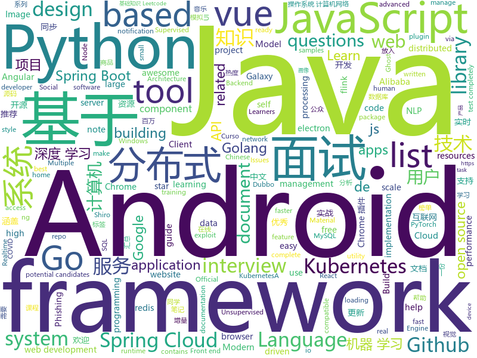

# 2020-06-17
See what the GitHub community is most excited about.

## python
+ [byob](https://github.com/malwaredllc/byob)(**107 stars today**): BYOB (Build Your Own Botnet)
+ [pifuhd](https://github.com/facebookresearch/pifuhd)(**406 stars today**): High-Resolution 3D Human Digitization from A Single Image.
+ [stylegan2](https://github.com/NVlabs/stylegan2)(**63 stars today**): StyleGAN2 - Official TensorFlow Implementation
+ [pulse](https://github.com/adamian98/pulse)(**154 stars today**): PULSE: Self-Supervised Photo Upsampling via Latent Space Exploration of Generative Models
+ [multi-task-NLP](https://github.com/hellohaptik/multi-task-NLP)(**16 stars today**): multi_task_NLP is a utility toolkit enabling NLP developers to easily train and infer a single model for multiple tasks.
+ [ghost](https://github.com/entynetproject/ghost)(**9 stars today**): Ghost Framework is an Android post-exploitation framework that exploits the Android Debug Bridge to remotely access an Android device. Ghost Framework gives you the power and convenience of remote Android device administration.
+ [system-design-primer](https://github.com/donnemartin/system-design-primer)(**138 stars today**): Learn how to design large-scale systems. Prep for the system design interview. Includes Anki flashcards.
+ [AdamP](https://github.com/clovaai/AdamP)(**38 stars today**): Slowing Down the Weight Norm Increase in Momentum-based Optimizers
+ [fastapi](https://github.com/tiangolo/fastapi)(**84 stars today**): FastAPI framework, high performance, easy to learn, fast to code, ready for production
+ [poetry](https://github.com/python-poetry/poetry)(**23 stars today**): Python dependency management and packaging made easy.
+ [Red-DiscordBot](https://github.com/Cog-Creators/Red-DiscordBot)(**4 stars today**): A multifunction Discord bot
+ [practical-python](https://github.com/dabeaz-course/practical-python)(**41 stars today**): Practical Python Programming (course by @dabeaz)
+ [pytorch3d](https://github.com/facebookresearch/pytorch3d)(**32 stars today**): PyTorch3D is FAIR's library of reusable components for deep learning with 3D data
+ [Grafiki](https://github.com/lucky-luk3/Grafiki)(**28 stars today**): Threat Hunting tool about Sysmon and graphs
+ [tunit](https://github.com/clovaai/tunit)(**31 stars today**): Rethinking the Truly Unsupervised Image-to-Image Translation - Official PyTorch Implementation
+ [cpython](https://github.com/python/cpython)(**25 stars today**): The Python programming language
+ [interview_internal_reference](https://github.com/0voice/interview_internal_reference)(**27 stars today**): 2019年最新总结，阿里，腾讯，百度，美团，头条等技术面试题目，以及答案，专家出题人分析汇总。
+ [PARL](https://github.com/PaddlePaddle/PARL)(**273 stars today**): PARL A high-performance distributed training framework for Reinforcement Learning
+ [OpenSelfSup](https://github.com/open-mmlab/OpenSelfSup)(**169 stars today**): Self-Supervised Learning Toolbox and Benchmark
+ [NotQuite0DayFriday](https://github.com/grimm-co/NotQuite0DayFriday)(**47 stars today**): This is a repo which documents real bugs in real software to illustrate trends, learn how to prevent or find them more quickly.
+ [galaxy-integrations-python-api](https://github.com/gogcom/galaxy-integrations-python-api)(**17 stars today**): NOTE: Please report here only issues related to the python API. Issues and general feedback regarding the Galaxy Client 2.0 shall be sent via Galaxy Client menu
+ [ltp](https://github.com/HIT-SCIR/ltp)(**34 stars today**): Language Technology Platform
+ [gpt-2](https://github.com/openai/gpt-2)(**29 stars today**): Code for the paper "Language Models are Unsupervised Multitask Learners"
+ [insightface](https://github.com/deepinsight/insightface)(**11 stars today**): Face Analysis Project on MXNet
+ [nlp](https://github.com/huggingface/nlp)(**39 stars today**): 🤗nlp: datasets and evaluation metrics for Natural Language Processing in NumPy, Pandas, PyTorch and TensorFlow

## java
+ [cwa-server](https://github.com/corona-warn-app/cwa-server)(**114 stars today**): Backend implementation for the Apple/Google exposure notification API.
+ [cwa-verification-server](https://github.com/corona-warn-app/cwa-verification-server)(**30 stars today**): Backend implementation of the verification process
+ [piranha](https://github.com/uber/piranha)(**54 stars today**): A tool for refactoring code related to feature flag APIs
+ [GitHub-Chinese-Top-Charts](https://github.com/kon9chunkit/GitHub-Chinese-Top-Charts)(**57 stars today**): 🇨🇳GitHub中文排行榜，帮助你发现高分优秀中文项目、更高效地吸收国人的优秀经验成果；榜单每周更新一次，敬请关注！
+ [views-widgets-samples](https://github.com/android/views-widgets-samples)(**11 stars today**): Multiple samples showing the best practices in views-widgets on Android.
+ [piggymetrics](https://github.com/sqshq/piggymetrics)(**6 stars today**): Microservice Architecture with Spring Boot, Spring Cloud and Docker
+ [SpringBoot-Labs](https://github.com/YunaiV/SpringBoot-Labs)(**38 stars today**): 一个涵盖六个专栏：Spring Boot 2.X、Spring Cloud、Spring Cloud Alibaba、Dubbo、分布式消息队列、分布式事务的仓库。希望胖友小手一抖，右上角来个 Star，感恩 1024
+ [advanced-java](https://github.com/doocs/advanced-java)(**49 stars today**): 😮互联网 Java 工程师进阶知识完全扫盲：涵盖高并发、分布式、高可用、微服务、海量数据处理等领域知识，后端同学必看，前端同学也可学习
+ [CS-Notes](https://github.com/CyC2018/CS-Notes)(**101 stars today**): 📚技术面试必备基础知识、Leetcode、计算机操作系统、计算机网络、系统设计、Java、Python、C++
+ [JavaGuide](https://github.com/Snailclimb/JavaGuide)(**121 stars today**): 「Java学习+面试指南」一份涵盖大部分Java程序员所需要掌握的核心知识。
+ [Mindustry](https://github.com/Anuken/Mindustry)(**11 stars today**): A sandbox tower defense game
+ [mybatis-3](https://github.com/mybatis/mybatis-3)(**12 stars today**): MyBatis SQL mapper framework for Java
+ [CoraLibre-android-sdk](https://github.com/theScrabi/CoraLibre-android-sdk)(**25 stars today**): CoraLibre-android-sdk fork of prestandard DP-3T to make compatible with the Google/Apple protocoll
+ [PermissionX](https://github.com/guolindev/PermissionX)(**37 stars today**): An open source Android library that makes handling runtime permissions extremely easy.
+ [onemall](https://github.com/YunaiV/onemall)(**8 stars today**): mall 商城，基于微服务的思想，构建在 B2C 电商场景下的项目实战。核心技术栈，是 Spring Boot + Dubbo 。未来，会重构成 Spring Cloud Alibaba 。
+ [flinkx](https://github.com/DTStack/flinkx)(**10 stars today**): 基于flink的分布式数据同步工具
+ [VirtualApp10](https://github.com/lx82319214/VirtualApp10)(**5 stars today**): 应用分身，虚拟多开，模拟用户操作。欢迎各类朋友交流
+ [flink-recommandSystem-demo](https://github.com/CheckChe0803/flink-recommandSystem-demo)(**7 stars today**): 🚁🚀基于Flink实现的商品实时推荐系统。flink统计商品热度，放入redis缓存，分析日志信息，将画像标签和实时记录放入Hbase。在用户发起推荐请求后，根据用户画像重排序热度榜，并结合协同过滤和标签两个推荐模块为新生成的榜单的每一个产品添加关联产品，最后返回新的用户列表。
+ [canal](https://github.com/alibaba/canal)(**28 stars today**): 阿里巴巴 MySQL binlog 增量订阅&消费组件
+ [jeecg-cloud](https://github.com/zhangdaiscott/jeecg-cloud)(**6 stars today**): 基于Spring Boot 2.1.3、 Spring Cloud Greenwich.SR3 & Alibaba、 Shiro、JWT的 JAVA快速开发平台（Jeecg Boot的微服务版本，功能和底层代码，两边保持同步）
+ [InternetArchitect](https://github.com/bjmashibing/InternetArchitect)(**33 stars today**): 年薪百万互联网架构师课程文档及源码(公开部分)
+ [pinpoint](https://github.com/naver/pinpoint)(**12 stars today**): APM, (Application Performance Management) tool for large-scale distributed systems.
+ [zeppelin](https://github.com/apache/zeppelin)(**5 stars today**): Web-based notebook that enables data-driven, interactive data analytics and collaborative documents with SQL, Scala and more.
+ [concurrent](https://github.com/RedSpider1/concurrent)(**24 stars today**): 这是RedSpider社区成员原创与维护的Java多线程系列文章。
+ [datax-web](https://github.com/WeiYe-Jing/datax-web)(**8 stars today**): DataX集成可视化页面，选择数据源一键生成JSON并脱敏，集成定时任务，支持分布式，支持增量获取，实时查看运行日志，监控执行器资源，kill运行进程。

## unknown
+ [build-your-own-x](https://github.com/danistefanovic/build-your-own-x)(**233 stars today**): 🤓Build your own (insert technology here)
+ [wikileaks-9-11-files](https://github.com/gadsden0/wikileaks-9-11-files)(**32 stars today**): The files from the United States government on 9/11, released by wiki leaks.
+ [Python-Core-50-Courses](https://github.com/jackfrued/Python-Core-50-Courses)(**16 stars today**): Python语言基础50课
+ [Awesome-GEE](https://github.com/giswqs/Awesome-GEE)(**15 stars today**): A curated list of Google Earth Engine resources
+ [awesome-java](https://github.com/Snailclimb/awesome-java)(**20 stars today**): Collection of awesome Java project on Github(Github 上非常棒的 Java 开源项目集合).
+ [You-Dont-Know-JS](https://github.com/getify/You-Dont-Know-JS)(**78 stars today**): A book series on JavaScript. @YDKJS on twitter.
+ [CloudPentestCheatsheets](https://github.com/dafthack/CloudPentestCheatsheets)(**71 stars today**): This repository contains a collection of cheatsheets I have put together for tools related to pentesting organizations that leverage cloud providers.
+ [computer-science](https://github.com/ossu/computer-science)(**63 stars today**): 🎓Path to a free self-taught education in Computer Science!
+ [javascript-questions](https://github.com/lydiahallie/javascript-questions)(**189 stars today**): A long list of (advanced) JavaScript questions, and their explanations✨
+ [pumpkin-book](https://github.com/datawhalechina/pumpkin-book)(**47 stars today**): 《机器学习》（西瓜书）公式推导解析，在线阅读地址：https://datawhalechina.github.io/pumpkin-book
+ [COVID-19](https://github.com/CSSEGISandData/COVID-19)(**29 stars today**): Novel Coronavirus (COVID-19) Cases, provided by JHU CSSE
+ [100-days-of-angular](https://github.com/angular-vietnam/100-days-of-angular)(**14 stars today**): Series độc quyền cung cấp bởi thành viên của Angular Vietnam về các chủ đề liên quan tới Angular trong vòng 100 ngày.
+ [gpt-3](https://github.com/openai/gpt-3)(**58 stars today**): GPT-3: Language Models are Few-Shot Learners
+ [awesome-learning-resources](https://github.com/lauragift21/awesome-learning-resources)(**14 stars today**): 🔥Awesome list of resources on Web Development.
+ [JavaInterview](https://github.com/OUYANGSIHAI/JavaInterview)(**18 stars today**): 【Java面试+Java后端技术学习指南】：一份通向理想互联网公司的面试指南，包括 Java，技术面试必备基础知识、Leetcode、计算机操作系统、计算机网络、系统设计、分布式、数据库（MySQL、Redis）、Java 项目实战等
+ [WindowsExploitationResources](https://github.com/FULLSHADE/WindowsExploitationResources)(**40 stars today**): Resources for Windows exploit development
+ [2020](https://github.com/wwdc/2020)(**19 stars today**): Student submissions for the WWDC 2020 Swift Student Challenge
+ [bootcamp-launchbase-desafios-01](https://github.com/Rocketseat/bootcamp-launchbase-desafios-01)(**6 stars today**): Desafios do primeiro módulo do Bootcamp Launchbase🚀👨🏻‍🚀
+ [Enterprise-Scale](https://github.com/Azure/Enterprise-Scale)(**12 stars today**): Enterprise-Scale
+ [awesome-wechat-weapp](https://github.com/justjavac/awesome-wechat-weapp)(**18 stars today**): 微信小程序开发资源汇总💯
+ [daily-paper-computer-vision](https://github.com/amusi/daily-paper-computer-vision)(**13 stars today**): 记录每天整理的计算机视觉/深度学习/机器学习相关方向的论文
+ [first-contributions](https://github.com/firstcontributions/first-contributions)(**14 stars today**): 🚀✨Help beginners to contribute to open source projects
+ [DeepLearning-500-questions](https://github.com/scutan90/DeepLearning-500-questions)(**16 stars today**): 深度学习500问，以问答形式对常用的概率知识、线性代数、机器学习、深度学习、计算机视觉等热点问题进行阐述，以帮助自己及有需要的读者。 全书分为18个章节，50余万字。由于水平有限，书中不妥之处恳请广大读者批评指正。 未完待续............ 如有意合作，联系scutjy2015@163.com 版权所有，违权必究 Tan 2018.06
+ [CyberProfDevelopmentCovidResources](https://github.com/gerryguy311/CyberProfDevelopmentCovidResources)(**7 stars today**): An awesome list of FREE resources for training, conferences, speaking, labs, reading, etc that are free all the time or during COVID-19 that cybersecurity professionals with downtime can take advantage of to improve their skills and marketability to come out on the other side ready to rock.
+ [awesome-gog-galaxy](https://github.com/Mixaill/awesome-gog-galaxy)(**52 stars today**): A list of GOG Galaxy 2.0 integrations and upcoming features

## javascript
+ [magnetW](https://github.com/xiandanin/magnetW)(**110 stars today**): 磁力链接聚合搜索
+ [vue](https://github.com/vuejs/vue)(**100 stars today**): 🖖Vue.js is a progressive, incrementally-adoptable JavaScript framework for building UI on the web.
+ [Cactus-app](https://github.com/MasterTeus/Cactus-app)(**15 stars today**): 
+ [curso-javascript-ninja](https://github.com/da2k/curso-javascript-ninja)(**4 stars today**): Curso Javascript Ninja
+ [ChromeAppHeroes](https://github.com/zhaoolee/ChromeAppHeroes)(**15 stars today**): 🌈谷粒-Chrome插件英雄榜, 为优秀的Chrome插件写一本中文说明书, 让Chrome插件英雄们造福人类~ ChromePluginHeroes, Write a Chinese manual for the excellent Chrome plugin, let the Chrome plugin heroes benefit the human~ 公众号「0加1」同步更新
+ [decentralized-video-chat](https://github.com/ianramzy/decentralized-video-chat)(**104 stars today**): 🚀Zipcall.io🚀Peer to peer browser video calling platform with unmatched video quality and latency.
+ [freeCodeCamp](https://github.com/freeCodeCamp/freeCodeCamp)(**54 stars today**): freeCodeCamp.org's open source codebase and curriculum. Learn to code at home.
+ [front-end-interview-handbook](https://github.com/yangshun/front-end-interview-handbook)(**14 stars today**): 🕸Almost complete answers to "Front-end Job Interview Questions" which you can use to interview potential candidates, test yourself or completely ignore
+ [react](https://github.com/facebook/react)(**76 stars today**): A declarative, efficient, and flexible JavaScript library for building user interfaces.
+ [hackathon-starter](https://github.com/sahat/hackathon-starter)(**10 stars today**): A boilerplate for Node.js web applications
+ [AnotherRedisDesktopManager](https://github.com/qishibo/AnotherRedisDesktopManager)(**41 stars today**): 🚀🚀🚀A faster, better and more stable redis desktop manager, compatible with Linux, windows, mac. What's more, it won't crash when loading a large number of keys.
+ [styled-components](https://github.com/styled-components/styled-components)(**21 stars today**): Visual primitives for the component age. Use the best bits of ES6 and CSS to style your apps without stress💅
+ [JavaGuide-Interview](https://github.com/Snailclimb/JavaGuide-Interview)(**31 stars today**): JavaGuide面试突击版
+ [PythonSpider](https://github.com/DingZaiHub/PythonSpider)(**17 stars today**): JS逆向系列教程，模拟登录，AES、RSA、DES加密等，持续更新，欢迎 star！
+ [bypass-paywalls-chrome](https://github.com/iamadamdev/bypass-paywalls-chrome)(**105 stars today**): Bypass Paywalls web browser extension for Chrome and Firefox.
+ [material-ui](https://github.com/mui-org/material-ui)(**38 stars today**): React components for faster and easier web development. Build your own design system, or start with Material Design.
+ [realworld](https://github.com/gothinkster/realworld)(**48 stars today**): "The mother of all demo apps" — Exemplary fullstack Medium.com clone powered by React, Angular, Node, Django, and many more🏅
+ [chinese-poetry](https://github.com/chinese-poetry/chinese-poetry)(**30 stars today**): The most comprehensive database of Chinese poetry🧶最全中华古诗词数据库, 唐宋两朝近一万四千古诗人, 接近5.5万首唐诗加26万宋诗. 两宋时期1564位词人，21050首词。
+ [vue-echarts](https://github.com/ecomfe/vue-echarts)(**12 stars today**): ECharts component for Vue.js.
+ [sharedb](https://github.com/share/sharedb)(**18 stars today**): Realtime database backend based on Operational Transformation (OT)
+ [responsively-app](https://github.com/manojVivek/responsively-app)(**57 stars today**): A modified browser that helps in responsive web development.
+ [MrDoc](https://github.com/zmister2016/MrDoc)(**16 stars today**): 基于Python开发的在线文档系统，适合作为个人和小型团队的文档、笔记、知识管理工具。a online document system developed based on python. It is suitable for individuals and small teams to manage documents, knowledge and notes.
+ [jumpserver](https://github.com/jumpserver/jumpserver)(**15 stars today**): JumpServer 是全球首款开源的堡垒机，是符合 4A 的专业运维安全审计系统。
+ [electron-vue-music](https://github.com/SmallRuralDog/electron-vue-music)(**6 stars today**): 基于 electron-vue 开发的音乐播放器，界面模仿QQ音乐，技术栈electron-vue+vue+vuex+vue-router+element- UI。欢迎star
+ [date-fns](https://github.com/date-fns/date-fns)(**15 stars today**): ⏳Modern JavaScript date utility library⌛️

## html
+ [100knocks-preprocess](https://github.com/The-Japan-DataScientist-Society/100knocks-preprocess)(**124 stars today**): データサイエンス100本ノック（構造化データ加工編）
+ [kubernetes-goat](https://github.com/madhuakula/kubernetes-goat)(**77 stars today**): Kubernetes Goat is "Vulnerable by Design" Kubernetes Cluster.
+ [shellphish](https://github.com/thelinuxchoice/shellphish)(**8 stars today**): 19 Social Media Phishing Pages #phishing #shellphish #phish
+ [swagger-codegen](https://github.com/swagger-api/swagger-codegen)(**10 stars today**): swagger-codegen contains a template-driven engine to generate documentation, API clients and server stubs in different languages by parsing your OpenAPI / Swagger definition.
+ [lnbook](https://github.com/lnbook/lnbook)(**5 stars today**): Mastering the Lightning Network (LN)
+ [SVG-Loaders](https://github.com/SamHerbert/SVG-Loaders)(**6 stars today**): Loading icons and small animations built with pure SVG.
+ [website](https://github.com/kubernetes/website)(**8 stars today**): Kubernetes website and documentation repo:
+ [GDPR-Developer-Guide](https://github.com/LINCnil/GDPR-Developer-Guide)(**4 stars today**): The CNIL publishes a GDPR guide for developers
+ [quickstart-js](https://github.com/firebase/quickstart-js)(**3 stars today**): Firebase Quickstart Samples for Web
+ [personal-website](https://github.com/github/personal-website)(**11 stars today**): Code that'll help you kickstart a personal website that showcases your work as a software developer.
+ [deeplearning_ai_books](https://github.com/fengdu78/deeplearning_ai_books)(**13 stars today**): deeplearning.ai（吴恩达老师的深度学习课程笔记及资源）
+ [blackeye](https://github.com/thelinuxchoice/blackeye)(**3 stars today**): The most complete Phishing Tool, with 32 templates +1 customizable
+ [Front-end-Developer-Interview-Questions](https://github.com/h5bp/Front-end-Developer-Interview-Questions)(**21 stars today**): A list of helpful front-end related questions you can use to interview potential candidates, test yourself or completely ignore.
+ [DevOps-Guide](https://github.com/Tikam02/DevOps-Guide)(**2 stars today**): DevOps Guide from basic to advanced with Interview Questions and Notes🔥
+ [shiro-example](https://github.com/zhangkaitao/shiro-example)(**2 stars today**): 跟我学Shiro（我的公众号：kaitao-1234567，我的新书：《亿级流量网站架构核心技术》）
+ [hyperblog](https://github.com/freddier/hyperblog)(**8 stars today**): Un blog increíble para el curso de Git y Github de Platzi
+ [Machine-Learning-in-Action-Python3](https://github.com/wzy6642/Machine-Learning-in-Action-Python3)(**2 stars today**): 《机器学习实战》python3源码
+ [en.javascript.info](https://github.com/javascript-tutorial/en.javascript.info)(**9 stars today**): Modern JavaScript Tutorial
+ [goproxy.cn](https://github.com/goproxy/goproxy.cn)(**8 stars today**): The most trusted Go module proxy in China.
+ [styleguide](https://github.com/google/styleguide)(**12 stars today**): Style guides for Google-originated open-source projects
+ [grpc.io](https://github.com/grpc/grpc.io)(**3 stars today**): Repository for the gRPC website and documentation
+ [electron-api-demos](https://github.com/electron/electron-api-demos)(**4 stars today**): Explore the Electron APIs
+ [courses](https://github.com/DataScienceSpecialization/courses)(**2 stars today**): Course materials for the Data Science Specialization: https://www.coursera.org/specialization/jhudatascience/1
+ [r-basic](https://github.com/joanby/r-basic)(**1 stars today**): Curso de introducción a la estadística descriptiva con R Studio
+ [Graphics](https://github.com/Unity-Technologies/Graphics)(**3 stars today**): Unity Graphics - Including Scriptable Render Pipeline

## go
+ [pkgsite](https://github.com/golang/pkgsite)(**116 stars today**): [mirror] Home of the pkg.go.dev website
+ [jupiter](https://github.com/douyu/jupiter)(**60 stars today**): Jupiter是douyu开源的面向服务治理的Golang微服务框架
+ [dapr](https://github.com/dapr/dapr)(**18 stars today**): Dapr is a portable, event-driven, runtime for building distributed applications across cloud and edge.
+ [vault](https://github.com/hashicorp/vault)(**51 stars today**): A tool for secrets management, encryption as a service, and privileged access management
+ [helm-operator](https://github.com/fluxcd/helm-operator)(**8 stars today**): The Flux Helm Operator, for declarative Helming
+ [spago](https://github.com/nlpodyssey/spago)(**65 stars today**): spaGO is a beautiful and maintainable machine learning library written in Go designed to support relevant neural network architectures in natural language processing tasks
+ [kubernetes](https://github.com/kubernetes/kubernetes)(**69 stars today**): Production-Grade Container Scheduling and Management
+ [gowebsocket](https://github.com/link1st/gowebsocket)(**10 stars today**): golang基于websocket单台机器支持百万连接分布式聊天(IM)系统
+ [memberlist](https://github.com/hashicorp/memberlist)(**4 stars today**): Golang package for gossip based membership and failure detection
+ [micro](https://github.com/zyedidia/micro)(**34 stars today**): A modern and intuitive terminal-based text editor
+ [charts](https://github.com/helm/charts)(**22 stars today**): Curated applications for Kubernetes
+ [nakama](https://github.com/heroiclabs/nakama)(**7 stars today**): Distributed server for social and realtime games and apps.
+ [rook](https://github.com/rook/rook)(**2 stars today**): Storage Orchestration for Kubernetes
+ [gorush](https://github.com/appleboy/gorush)(**6 stars today**): A push notification server written in Go (Golang).
+ [flux](https://github.com/fluxcd/flux)(**15 stars today**): The GitOps Kubernetes operator
+ [go-swagger](https://github.com/go-swagger/go-swagger)(**8 stars today**): Swagger 2.0 implementation for go
+ [go](https://github.com/golang/go)(**72 stars today**): The Go programming language
+ [gitea](https://github.com/go-gitea/gitea)(**25 stars today**): Git with a cup of tea, painless self-hosted git service
+ [cloud-on-k8s](https://github.com/elastic/cloud-on-k8s)(**3 stars today**): Elastic Cloud on Kubernetes
+ [gopacket](https://github.com/google/gopacket)(**5 stars today**): Provides packet processing capabilities for Go
+ [argo-cd](https://github.com/argoproj/argo-cd)(**58 stars today**): Declarative continuous deployment for Kubernetes.
+ [pan-light](https://github.com/peterq/pan-light)(**11 stars today**): 百度网盘不限速客户端, golang + qt5, 跨平台图形界面
+ [go-gin-example](https://github.com/eddycjy/go-gin-example)(**10 stars today**): An example of gin
+ [cert-manager](https://github.com/jetstack/cert-manager)(**12 stars today**): Automatically provision and manage TLS certificates in Kubernetes
+ [cli](https://github.com/urfave/cli)(**12 stars today**): A simple, fast, and fun package for building command line apps in Go

## WordCloud

