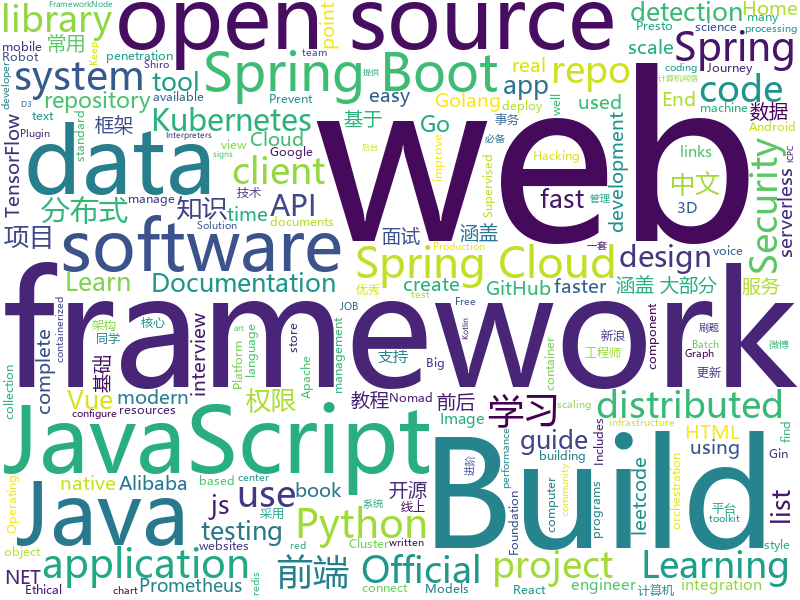

# 2020-06-19
See what the GitHub community is most excited about.

## python
+ [pulse](https://github.com/adamian98/pulse)(**196 stars today**): PULSE: Self-Supervised Photo Upsampling via Latent Space Exploration of Generative Models
+ [practical-python](https://github.com/dabeaz-course/practical-python)(**82 stars today**): Practical Python Programming (course by @dabeaz)
+ [image-gpt](https://github.com/openai/image-gpt)(**119 stars today**): 
+ [detectron2](https://github.com/facebookresearch/detectron2)(**43 stars today**): Detectron2 is FAIR's next-generation platform for object detection and segmentation.
+ [plugin.video.netflix](https://github.com/CastagnaIT/plugin.video.netflix)(**7 stars today**): InputStream based Netflix plugin for Kodi
+ [OpenSelfSup](https://github.com/open-mmlab/OpenSelfSup)(**118 stars today**): Self-Supervised Learning Toolbox and Benchmark
+ [pifuhd](https://github.com/facebookresearch/pifuhd)(**265 stars today**): High-Resolution 3D Human Digitization from A Single Image.
+ [public-apis](https://github.com/public-apis/public-apis)(**157 stars today**): A collective list of free APIs for use in software and web development.
+ [stylegan2](https://github.com/NVlabs/stylegan2)(**54 stars today**): StyleGAN2 - Official TensorFlow Implementation
+ [system-design-primer](https://github.com/donnemartin/system-design-primer)(**151 stars today**): Learn how to design large-scale systems. Prep for the system design interview. Includes Anki flashcards.
+ [checkov](https://github.com/bridgecrewio/checkov)(**15 stars today**): Prevent cloud misconfigurations during build-time for Terraform, Cloudformation, Kubernetes and other infrastructure-as-code-languages with Checkov by Bridgecrew.
+ [byob](https://github.com/malwaredllc/byob)(**147 stars today**): BYOB (Build Your Own Botnet)
+ [jwt_tool](https://github.com/ticarpi/jwt_tool)(**17 stars today**): 🐍A toolkit for testing, tweaking and cracking JSON Web Tokens
+ [unsup3d](https://github.com/elliottwu/unsup3d)(**61 stars today**): (CVPR'20 Oral) Unsupervised Learning of Probably Symmetric Deformable 3D Objects from Images in the Wild
+ [dbt](https://github.com/fishtown-analytics/dbt)(**9 stars today**): dbt (data build tool) enables data analysts and engineers to transform their data using the same practices that software engineers use to build applications.
+ [models](https://github.com/tensorflow/models)(**38 stars today**): Models and examples built with TensorFlow
+ [rasa](https://github.com/RasaHQ/rasa)(**9 stars today**): 💬Open source machine learning framework to automate text- and voice-based conversations: NLU, dialogue management, connect to Slack, Facebook, and more - Create chatbots and voice assistants
+ [weiboSpider](https://github.com/dataabc/weiboSpider)(**122 stars today**): 新浪微博爬虫，用python爬取新浪微博数据
+ [prefect](https://github.com/PrefectHQ/prefect)(**17 stars today**): A modern data workflow platform
+ [wtfpython-cn](https://github.com/leisurelicht/wtfpython-cn)(**79 stars today**): wtfpython的中文翻译/施工结束/ 能力有限，欢迎帮我改进翻译
+ [elasticsearch-py](https://github.com/elastic/elasticsearch-py)(**4 stars today**): Official Python low-level client for Elasticsearch
+ [NotQuite0DayFriday](https://github.com/grimm-co/NotQuite0DayFriday)(**27 stars today**): This is a repo which documents real bugs in real software to illustrate trends, learn how to prevent or find them more quickly.
+ [jax](https://github.com/google/jax)(**23 stars today**): Composable transformations of Python+NumPy programs: differentiate, vectorize, JIT to GPU/TPU, and more
+ [CenterNet](https://github.com/xingyizhou/CenterNet)(**13 stars today**): Object detection, 3D detection, and pose estimation using center point detection:
+ [TensorflowTTS](https://github.com/dathudeptrai/TensorflowTTS)(**12 stars today**): 😝TensorflowTTS: Real-Time State-of-the-art Speech Synthesis for Tensorflow 2

## java
+ [SpringBoot-Labs](https://github.com/YunaiV/SpringBoot-Labs)(**54 stars today**): 一个涵盖六个专栏：Spring Boot 2.X、Spring Cloud、Spring Cloud Alibaba、Dubbo、分布式消息队列、分布式事务的仓库。希望胖友小手一抖，右上角来个 Star，感恩 1024
+ [GitHub-Chinese-Top-Charts](https://github.com/kon9chunkit/GitHub-Chinese-Top-Charts)(**109 stars today**): 🇨🇳GitHub中文排行榜，帮助你发现高分优秀中文项目、更高效地吸收国人的优秀经验成果；榜单每周更新一次，敬请关注！
+ [SpringAll](https://github.com/wuyouzhuguli/SpringAll)(**23 stars today**): 循序渐进，学习Spring Boot、Spring Boot & Shiro、Spring Batch、Spring Cloud、Spring Cloud Alibaba、Spring Security & Spring Security OAuth2，博客Spring系列源码：https://mrbird.cc
+ [spring-framework](https://github.com/spring-projects/spring-framework)(**34 stars today**): Spring Framework
+ [CS-Notes](https://github.com/CyC2018/CS-Notes)(**84 stars today**): 📚技术面试必备基础知识、Leetcode、计算机操作系统、计算机网络、系统设计、Java、Python、C++
+ [camel](https://github.com/apache/camel)(**3 stars today**): Apache Camel
+ [advanced-java](https://github.com/doocs/advanced-java)(**55 stars today**): 😮互联网 Java 工程师进阶知识完全扫盲：涵盖高并发、分布式、高可用、微服务、海量数据处理等领域知识，后端同学必看，前端同学也可学习
+ [springcloud-learning](https://github.com/macrozheng/springcloud-learning)(**57 stars today**): 一套涵盖大部分核心组件使用的Spring Cloud教程，包括Spring Cloud Alibaba及分布式事务Seata，基于Spring Cloud Greenwich及SpringBoot 2.1.7。20篇文章，篇篇精华，30个Demo，涵盖大部分应用场景。
+ [MPAndroidChart](https://github.com/PhilJay/MPAndroidChart)(**17 stars today**): A powerful🚀Android chart view / graph view library, supporting line- bar- pie- radar- bubble- and candlestick charts as well as scaling, panning and animations.
+ [presto](https://github.com/prestosql/presto)(**4 stars today**): Home of the community managed version of Presto, the distributed SQL query engine for big data, under the auspices of the Presto Software Foundation.
+ [xxl-job](https://github.com/xuxueli/xxl-job)(**20 stars today**): A distributed task scheduling framework.（分布式任务调度平台XXL-JOB）
+ [spotless](https://github.com/diffplug/spotless)(**7 stars today**): Keep your code spotless
+ [eladmin](https://github.com/elunez/eladmin)(**39 stars today**): 项目基于 Spring Boot 2.1.0 、 Jpa、 Spring Security、redis、Vue的前后端分离的后台管理系统，项目采用分模块开发方式， 权限控制采用 RBAC，支持数据字典与数据权限管理，支持一键生成前后端代码，支持动态路由
+ [hudi](https://github.com/apache/hudi)(**7 stars today**): Upserts, Deletes And Incremental Processing on Big Data.
+ [Java](https://github.com/TheAlgorithms/Java)(**49 stars today**): All Algorithms implemented in Java
+ [pulsar](https://github.com/apache/pulsar)(**7 stars today**): Apache Pulsar - distributed pub-sub messaging system
+ [SpringBoot-Learning](https://github.com/dyc87112/SpringBoot-Learning)(**15 stars today**): Spring Boot基础教程，Spring Boot 2.x版本连载中！！！
+ [neo4j](https://github.com/neo4j/neo4j)(**5 stars today**): Graphs for Everyone
+ [react-native-camera](https://github.com/react-native-community/react-native-camera)(**6 stars today**): A Camera component for React Native. Also supports barcode scanning!
+ [JavaGuide](https://github.com/Snailclimb/JavaGuide)(**115 stars today**): 「Java学习+面试指南」一份涵盖大部分Java程序员所需要掌握的核心知识。
+ [SpringBoot-Shiro-Vue](https://github.com/Heeexy/SpringBoot-Shiro-Vue)(**16 stars today**): 提供一套基于Spring Boot-Shiro-Vue的权限管理思路.前后端都加以控制,做到按钮/接口级别的权限
+ [spring-security](https://github.com/spring-projects/spring-security)(**4 stars today**): Spring Security
+ [okhttp](https://github.com/square/okhttp)(**20 stars today**): Square’s meticulous HTTP client for Java and Kotlin.
+ [hive](https://github.com/apache/hive)(**5 stars today**): Apache Hive
+ [graal](https://github.com/oracle/graal)(**13 stars today**): GraalVM: Run Programs Faster Anywhere🚀

## unknown
+ [Python-Core-50-Courses](https://github.com/jackfrued/Python-Core-50-Courses)(**170 stars today**): Python语言基础50课
+ [build-your-own-x](https://github.com/danistefanovic/build-your-own-x)(**275 stars today**): 🤓Build your own (insert technology here)
+ [zoom-e2e-whitepaper](https://github.com/zoom/zoom-e2e-whitepaper)(**23 stars today**): End-to-End Encryption for Zoom Meetings
+ [awesome-gog-galaxy](https://github.com/Mixaill/awesome-gog-galaxy)(**33 stars today**): A list of GOG Galaxy 2.0 integrations and upcoming features
+ [app-ideas](https://github.com/florinpop17/app-ideas)(**176 stars today**): A Collection of application ideas which can be used to improve your coding skills.
+ [coding-interview-university](https://github.com/jwasham/coding-interview-university)(**144 stars today**): A complete computer science study plan to become a software engineer.
+ [You-Dont-Know-JS](https://github.com/getify/You-Dont-Know-JS)(**99 stars today**): A book series on JavaScript. @YDKJS on twitter.
+ [3y](https://github.com/ZhongFuCheng3y/3y)(**47 stars today**): 📓从Java基础、JavaWeb基础到常用的框架再到面试题都有完整的教程，几乎涵盖了Java后端必备的知识点
+ [awesome-point-cloud-analysis](https://github.com/Yochengliu/awesome-point-cloud-analysis)(**7 stars today**): A list of papers and datasets about point cloud analysis (processing)
+ [Red-Teaming-Toolkit](https://github.com/infosecn1nja/Red-Teaming-Toolkit)(**11 stars today**): A collection of open source and commercial tools that aid in red team operations.
+ [shell-cheatsheet](https://github.com/merveenoyan/shell-cheatsheet)(**11 stars today**): Shell çitşit (Türkçe)
+ [awesome-programming-books-1](https://github.com/greyireland/awesome-programming-books-1)(**46 stars today**): 计算机经典书籍📚，保留书单
+ [PENTESTING-BIBLE](https://github.com/blaCCkHatHacEEkr/PENTESTING-BIBLE)(**8 stars today**): Updates to this repository will continue to arrive until the number of links reaches 10000 links & 10000 pdf files .Learn Ethical Hacking and penetration testing .hundreds of ethical hacking & penetration testing & red team & cyber security & computer science resources.
+ [exploits](https://github.com/MegadodoPublications/exploits)(**5 stars today**): Some of my public exploits
+ [Java-Interview](https://github.com/gzc426/Java-Interview)(**17 stars today**): Java 面试必会 直通BAT
+ [Licensing](https://github.com/AaronDinnage/Licensing)(**1 stars today**): Microsoft 365 licensing diagrams
+ [styleguides](https://github.com/SAP/styleguides)(**2 stars today**): This repository provides SAP style guides for coding.
+ [ml-visuals](https://github.com/dair-ai/ml-visuals)(**23 stars today**): Visuals contains figures and templates which you can reuse and customize to improve your scientific writing.
+ [technology-talk](https://github.com/aalansehaiyang/technology-talk)(**13 stars today**): 汇总java生态圈常用技术框架、开源中间件，系统架构、数据库、大公司架构案例、常用三方类库、项目管理、线上问题排查、个人成长、思考等知识
+ [obfuscator](https://github.com/obfuscator-llvm/obfuscator)(**10 stars today**): 
+ [docs](https://github.com/nuxt/docs)(**0 stars today**): Documentation of Nuxt.js💚
+ [Flutter-Course-Resources](https://github.com/londonappbrewery/Flutter-Course-Resources)(**13 stars today**): Learn to Code While Building Apps - The Complete Flutter Development Bootcamp
+ [morphogenesis-resources](https://github.com/jasonwebb/morphogenesis-resources)(**18 stars today**): Comprehensive list of resources on the topic of digital morphogenesis (the creation of form through code). Includes links to major articles, code repos, creative projects, books, software, and more.
+ [ros2](https://github.com/ros2/ros2)(**3 stars today**): The Robot Operating System, is a meta operating system for robots.
+ [OI-wiki](https://github.com/OI-wiki/OI-wiki)(**13 stars today**): 🌟Wiki of OI / ICPC for everyone. （某大型游戏线上攻略，内含炫酷算术魔法）

## javascript
+ [pose-animator](https://github.com/yemount/pose-animator)(**127 stars today**): 
+ [vxe-table](https://github.com/xuliangzhan/vxe-table)(**13 stars today**): 🐬vxe-table vue 表格解决方案
+ [bootstrap](https://github.com/twbs/bootstrap)(**77 stars today**): The most popular HTML, CSS, and JavaScript framework for developing responsive, mobile first projects on the web.
+ [robintrack](https://github.com/Ameobea/robintrack)(**22 stars today**): Scrapes the Robinhood API to retrieve + store popularity and price data.
+ [docusaurus](https://github.com/facebook/docusaurus)(**27 stars today**): Easy to maintain open source documentation websites.
+ [cropperjs](https://github.com/fengyuanchen/cropperjs)(**13 stars today**): JavaScript image cropper.
+ [alpine](https://github.com/alpinejs/alpine)(**47 stars today**): A rugged, minimal framework for composing JavaScript behavior in your markup.
+ [gatsby](https://github.com/gatsbyjs/gatsby)(**35 stars today**): Build blazing fast, modern apps and websites with React
+ [puppeteer](https://github.com/puppeteer/puppeteer)(**39 stars today**): Headless Chrome Node.js API
+ [leetcode](https://github.com/azl397985856/leetcode)(**48 stars today**): LeetCode Solutions: A Record of My Problem Solving Journey.( leetcode题解，记录自己的leetcode解题之路。)
+ [appium](https://github.com/appium/appium)(**12 stars today**): 📱Automation for iOS, Android, and Windows Apps.
+ [front-end-interview-handbook](https://github.com/yangshun/front-end-interview-handbook)(**31 stars today**): 🕸Almost complete answers to "Front-end Job Interview Questions" which you can use to interview potential candidates, test yourself or completely ignore
+ [vue](https://github.com/vuejs/vue)(**110 stars today**): 🖖Vue.js is a progressive, incrementally-adoptable JavaScript framework for building UI on the web.
+ [serverless](https://github.com/serverless/serverless)(**27 stars today**): ⚡Serverless Framework – Build web, mobile and IoT applications with serverless architectures using AWS Lambda, Azure Functions, Google CloudFunctions & more! –
+ [Mindmap-Full-Stack](https://github.com/8bithemant/Mindmap-Full-Stack)(**26 stars today**): 
+ [posthog](https://github.com/PostHog/posthog)(**31 stars today**): 🦔PostHog is developer-friendly, open-source product analytics.
+ [material-ui](https://github.com/mui-org/material-ui)(**42 stars today**): React components for faster and easier web development. Build your own design system, or start with Material Design.
+ [reveal.js](https://github.com/hakimel/reveal.js)(**48 stars today**): The HTML Presentation Framework
+ [node](https://github.com/nodejs/node)(**35 stars today**): Node.js JavaScript runtime✨🐢🚀✨
+ [pipedream](https://github.com/PipedreamHQ/pipedream)(**7 stars today**): Free, serverless integration and compute platform
+ [create-react-app](https://github.com/facebook/create-react-app)(**43 stars today**): Set up a modern web app by running one command.
+ [Web](https://github.com/qianguyihao/Web)(**17 stars today**): 前端入门到进阶，超详细的Web前端学习图文教程。从零开始学前端，做一名精致优雅的前端工程师。每日更新...
+ [gitmoji](https://github.com/carloscuesta/gitmoji)(**16 stars today**): An emoji guide for your commit messages.😜
+ [SpaceX-API](https://github.com/r-spacex/SpaceX-API)(**47 stars today**): 🚀Open Source REST API for rocket, core, capsule, pad, and launch data
+ [gutenberg](https://github.com/WordPress/gutenberg)(**15 stars today**): The Block Editor project for WordPress and beyond. Plugin is available from the official repository.

## html
+ [GDPR-Developer-Guide](https://github.com/LINCnil/GDPR-Developer-Guide)(**45 stars today**): The CNIL publishes a GDPR guide for developers
+ [100knocks-preprocess](https://github.com/The-Japan-DataScientist-Society/100knocks-preprocess)(**69 stars today**): データサイエンス100本ノック（構造化データ加工編）
+ [tidytuesday](https://github.com/rfordatascience/tidytuesday)(**4 stars today**): Official repo for the #tidytuesday project
+ [ecma262](https://github.com/tc39/ecma262)(**9 stars today**): Status, process, and documents for ECMA-262
+ [mxgraph](https://github.com/jgraph/mxgraph)(**7 stars today**): mxGraph is a fully client side JavaScript diagramming library
+ [apidoc](https://github.com/apidoc/apidoc)(**6 stars today**): RESTful web API Documentation Generator.
+ [hugo-book](https://github.com/alex-shpak/hugo-book)(**5 stars today**): Hugo documentation theme as simple as plain book
+ [samples](https://github.com/azure-ad-b2c/samples)(**0 stars today**): Azure AD B2C Identity Experience Framework sample User Journeys.
+ [styleguide](https://github.com/google/styleguide)(**16 stars today**): Style guides for Google-originated open-source projects
+ [keep-a-changelog](https://github.com/olivierlacan/keep-a-changelog)(**5 stars today**): If you build software, keep a changelog.
+ [fastText](https://github.com/facebookresearch/fastText)(**8 stars today**): Library for fast text representation and classification.
+ [summer-institute](https://github.com/compsocialscience/summer-institute)(**3 stars today**): Summer Institutes in Computational Social Science
+ [d3js_doc](https://github.com/xswei/d3js_doc)(**4 stars today**): D3js中文文档 D3中文📊📈🎉
+ [craftinginterpreters](https://github.com/munificent/craftinginterpreters)(**6 stars today**): Repository for the book "Crafting Interpreters"
+ [kubernetes-goat](https://github.com/madhuakula/kubernetes-goat)(**37 stars today**): Kubernetes Goat is "Vulnerable by Design" Kubernetes Cluster.
+ [seldon-core](https://github.com/SeldonIO/seldon-core)(**3 stars today**): A framework to deploy, manage and scale your production machine learning to thousands of models
+ [Coursera-ML-AndrewNg-Notes](https://github.com/fengdu78/Coursera-ML-AndrewNg-Notes)(**24 stars today**): 吴恩达老师的机器学习课程个人笔记
+ [html](https://github.com/whatwg/html)(**5 stars today**): HTML Standard
+ [favorites-web](https://github.com/cloudfavorites/favorites-web)(**7 stars today**): 云收藏 Spring Boot 2.X 开源项目
+ [bootcamp-launchbase-desafios-02](https://github.com/Rocketseat/bootcamp-launchbase-desafios-02)(**0 stars today**): Desafios do segundo módulo do Bootcamp Launchbase🚀👨🏻‍🚀
+ [riot-web](https://github.com/vector-im/riot-web)(**6 stars today**): A glossy Matrix collaboration client for the web.
+ [django-DefectDojo](https://github.com/DefectDojo/django-DefectDojo)(**1 stars today**): DefectDojo is an open-source application vulnerability correlation and security orchestration tool.
+ [learning-area](https://github.com/mdn/learning-area)(**5 stars today**): Github repo for the MDN Learning Area.
+ [dotnet](https://github.com/microsoft/dotnet)(**4 stars today**): This repo is the official home of .NET on GitHub. It's a great starting point to find many .NET OSS projects from Microsoft and the community, including many that are part of the .NET Foundation.
+ [node-ytdl-core](https://github.com/fent/node-ytdl-core)(**4 stars today**): YouTube video downloader in javascript.

## go
+ [jupiter](https://github.com/douyu/jupiter)(**92 stars today**): Jupiter是douyu开源的面向服务治理的Golang微服务框架
+ [algorithm-pattern](https://github.com/greyireland/algorithm-pattern)(**452 stars today**): 算法模板，最科学的刷题方式，最快速的刷题路径，你值得拥有~
+ [kubermatic](https://github.com/kubermatic/kubermatic)(**49 stars today**): The Central Kubernetes Management Platform For Any Infrastructure
+ [goplus](https://github.com/qiniu/goplus)(**49 stars today**): GoPlus - The Go+ language for data science
+ [helm](https://github.com/helm/helm)(**9 stars today**): The Kubernetes Package Manager
+ [consul](https://github.com/hashicorp/consul)(**21 stars today**): Consul is a distributed, highly available, and data center aware solution to connect and configure applications across dynamic, distributed infrastructure.
+ [libpod](https://github.com/containers/libpod)(**9 stars today**): libpod is a library used to create container pods. Home of Podman.
+ [gin](https://github.com/gin-gonic/gin)(**36 stars today**): Gin is a HTTP web framework written in Go (Golang). It features a Martini-like API with much better performance -- up to 40 times faster. If you need smashing performance, get yourself some Gin.
+ [bk-cmdb](https://github.com/Tencent/bk-cmdb)(**7 stars today**): 蓝鲸智云配置平台(BlueKing CMDB)
+ [alertmanager](https://github.com/prometheus/alertmanager)(**4 stars today**): Prometheus Alertmanager
+ [rook](https://github.com/rook/rook)(**8 stars today**): Storage Orchestration for Kubernetes
+ [kubesphere](https://github.com/kubesphere/kubesphere)(**12 stars today**): Easy-to-use Production Ready Container Platform
+ [vegeta](https://github.com/tsenart/vegeta)(**14 stars today**): HTTP load testing tool and library. It's over 9000!
+ [learn-go-with-tests](https://github.com/quii/learn-go-with-tests)(**12 stars today**): Learn Go with test-driven development
+ [harbor](https://github.com/goharbor/harbor)(**15 stars today**): An open source trusted cloud native registry project that stores, signs, and scans content.
+ [nomad](https://github.com/hashicorp/nomad)(**11 stars today**): Nomad is an easy-to-use, flexible, and performant workload orchestrator that can deploy a mix of microservice, batch, containerized, and non-containerized applications. Nomad is easy to operate and scale and has native Consul and Vault integrations.
+ [prometheus-operator](https://github.com/coreos/prometheus-operator)(**7 stars today**): Prometheus Operator creates/configures/manages Prometheus clusters atop Kubernetes
+ [esbuild](https://github.com/evanw/esbuild)(**44 stars today**): An extremely fast JavaScript bundler and minifier
+ [ingress-nginx](https://github.com/kubernetes/ingress-nginx)(**10 stars today**): NGINX Ingress Controller for Kubernetes
+ [govmomi](https://github.com/vmware/govmomi)(**2 stars today**): Go library for the VMware vSphere API
+ [websocket](https://github.com/gorilla/websocket)(**17 stars today**): A fast, well-tested and widely used WebSocket implementation for Go.
+ [testify](https://github.com/stretchr/testify)(**7 stars today**): A toolkit with common assertions and mocks that plays nicely with the standard library
+ [lotus](https://github.com/filecoin-project/lotus)(**3 stars today**): Implementation of the Filecoin protocol, written in Go
+ [vitess](https://github.com/vitessio/vitess)(**10 stars today**): Vitess is a database clustering system for horizontal scaling of MySQL.
+ [redis](https://github.com/go-redis/redis)(**11 stars today**): Type-safe Redis client for Golang

## WordCloud

