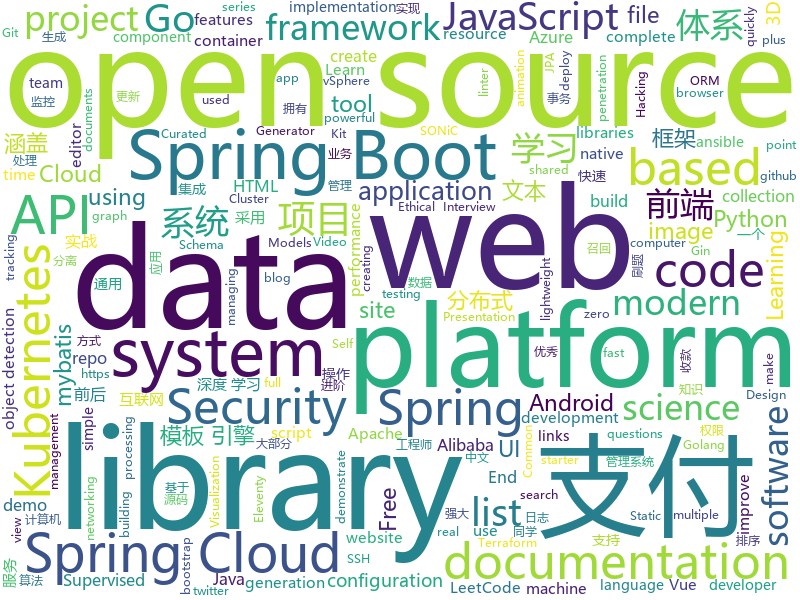

# 2020-06-20
See what the GitHub community is most excited about.

## python
+ [practical-python](https://github.com/dabeaz-course/practical-python)(**1,343 stars today**): Practical Python Programming (course by @dabeaz)
+ [pulse](https://github.com/adamian98/pulse)(**323 stars today**): PULSE: Self-Supervised Photo Upsampling via Latent Space Exploration of Generative Models
+ [NotQuite0DayFriday](https://github.com/grimm-co/NotQuite0DayFriday)(**31 stars today**): This is a repo which documents real bugs in real software to illustrate trends, learn how to prevent or find them more quickly.
+ [plugin.video.netflix](https://github.com/CastagnaIT/plugin.video.netflix)(**22 stars today**): InputStream based Netflix plugin for Kodi
+ [public-apis](https://github.com/public-apis/public-apis)(**169 stars today**): A collective list of free APIs for use in software and web development.
+ [wtfpython-cn](https://github.com/leisurelicht/wtfpython-cn)(**45 stars today**): wtfpython的中文翻译/施工结束/ 能力有限，欢迎帮我改进翻译
+ [detectron2](https://github.com/facebookresearch/detectron2)(**62 stars today**): Detectron2 is FAIR's next-generation platform for object detection and segmentation.
+ [unsup3d](https://github.com/elliottwu/unsup3d)(**62 stars today**): (CVPR'20 Oral) Unsupervised Learning of Probably Symmetric Deformable 3D Objects from Images in the Wild
+ [PCDet](https://github.com/sshaoshuai/PCDet)(**9 stars today**): PCDet Toolbox in PyTorch for 3D Object Detection from Point Cloud
+ [jina](https://github.com/jina-ai/jina)(**31 stars today**): Jina is the cloud-native neural search framework powered by state-of-the-art AI and deep learning
+ [DirectML](https://github.com/microsoft/DirectML)(**7 stars today**): Sample code for DirectML that demonstrates how build hardware-accelerated machine learning applications.
+ [ansible](https://github.com/ansible/ansible)(**22 stars today**): Ansible is a radically simple IT automation platform that makes your applications and systems easier to deploy. Avoid writing scripts or custom code to deploy and update your applications — automate in a language that approaches plain English, using SSH, with no agents to install on remote systems. https://docs.ansible.com/ansible/
+ [keras-retinanet](https://github.com/fizyr/keras-retinanet)(**5 stars today**): Keras implementation of RetinaNet object detection.
+ [SatanSword](https://github.com/Lucifer1993/SatanSword)(**62 stars today**): 红队综合渗透框架
+ [simclr](https://github.com/google-research/simclr)(**19 stars today**): SimCLRv2 - Big Self-Supervised Models are Strong Semi-Supervised Learners
+ [netmiko](https://github.com/ktbyers/netmiko)(**5 stars today**): Multi-vendor library to simplify Paramiko SSH connections to network devices
+ [data-science-from-scratch](https://github.com/joelgrus/data-science-from-scratch)(**7 stars today**): code for Data Science From Scratch book
+ [yamllint](https://github.com/adrienverge/yamllint)(**8 stars today**): A linter for YAML files.
+ [bokeh](https://github.com/bokeh/bokeh)(**10 stars today**): Interactive Data Visualization in the browser, from Python
+ [pylint](https://github.com/PyCQA/pylint)(**5 stars today**): It's not just a linter that annoys you!
+ [pipelines](https://github.com/kubeflow/pipelines)(**4 stars today**): Machine Learning Pipelines for Kubeflow
+ [Statistical-Learning-Method_Code](https://github.com/Dod-o/Statistical-Learning-Method_Code)(**15 stars today**): 手写实现李航《统计学习方法》书中全部算法
+ [awesome-python](https://github.com/vinta/awesome-python)(**62 stars today**): A curated list of awesome Python frameworks, libraries, software and resources
+ [hub](https://github.com/tensorflow/hub)(**4 stars today**): A library for transfer learning by reusing parts of TensorFlow models.
+ [image-gpt](https://github.com/openai/image-gpt)(**85 stars today**): 

## java
+ [SpringBoot-Labs](https://github.com/YunaiV/SpringBoot-Labs)(**185 stars today**): 一个涵盖六个专栏：Spring Boot 2.X、Spring Cloud、Spring Cloud Alibaba、Dubbo、分布式消息队列、分布式事务的仓库。希望胖友小手一抖，右上角来个 Star，感恩 1024
+ [GitHub-Chinese-Top-Charts](https://github.com/kon9chunkit/GitHub-Chinese-Top-Charts)(**183 stars today**): 🇨🇳GitHub中文排行榜，帮助你发现高分优秀中文项目、更高效地吸收国人的优秀经验成果；榜单每周更新一次，敬请关注！
+ [grpc-java](https://github.com/grpc/grpc-java)(**8 stars today**): The Java gRPC implementation. HTTP/2 based RPC
+ [spring-boot-demo](https://github.com/xkcoding/spring-boot-demo)(**64 stars today**): spring boot demo 是一个用来深度学习并实战 spring boot 的项目，目前总共包含 65 个集成demo，已经完成 53 个。 该项目已成功集成 actuator(监控)、admin(可视化监控)、logback(日志)、aopLog(通过AOP记录web请求日志)、统一异常处理(json级别和页面级别)、freemarker(模板引擎)、thymeleaf(模板引擎)、Beetl(模板引擎)、Enjoy(模板引擎)、JdbcTemplate(通用JDBC操作数据库)、JPA(强大的ORM框架)、mybatis(强大的ORM框架)、通用Mapper(快速操作Mybatis)、PageHelper(通用的Mybatis分页插件)、mybatis-plus(快速操作M…
+ [vhr](https://github.com/lenve/vhr)(**36 stars today**): 微人事是一个前后端分离的人力资源管理系统，项目采用SpringBoot+Vue开发。
+ [thingsboard](https://github.com/thingsboard/thingsboard)(**7 stars today**): Open-source IoT Platform - Device management, data collection, processing and visualization.
+ [springcloud-learning](https://github.com/macrozheng/springcloud-learning)(**56 stars today**): 一套涵盖大部分核心组件使用的Spring Cloud教程，包括Spring Cloud Alibaba及分布式事务Seata，基于Spring Cloud Greenwich及SpringBoot 2.1.7。20篇文章，篇篇精华，30个Demo，涵盖大部分应用场景。
+ [litho](https://github.com/facebook/litho)(**4 stars today**): A declarative framework for building efficient UIs on Android.
+ [camel](https://github.com/apache/camel)(**2 stars today**): Apache Camel
+ [commons-lang](https://github.com/apache/commons-lang)(**3 stars today**): Mirror of Apache Commons Lang
+ [exposure-notifications-android](https://github.com/google/exposure-notifications-android)(**8 stars today**): Exposure Notifications Android Reference Design
+ [MPAndroidChart](https://github.com/PhilJay/MPAndroidChart)(**14 stars today**): A powerful🚀Android chart view / graph view library, supporting line- bar- pie- radar- bubble- and candlestick charts as well as scaling, panning and animations.
+ [eladmin](https://github.com/elunez/eladmin)(**41 stars today**): 项目基于 Spring Boot 2.1.0 、 Jpa、 Spring Security、redis、Vue的前后端分离的后台管理系统，项目采用分模块开发方式， 权限控制采用 RBAC，支持数据字典与数据权限管理，支持一键生成前后端代码，支持动态路由
+ [advanced-java](https://github.com/doocs/advanced-java)(**56 stars today**): 😮互联网 Java 工程师进阶知识完全扫盲：涵盖高并发、分布式、高可用、微服务、海量数据处理等领域知识，后端同学必看，前端同学也可学习
+ [VirtualXposed](https://github.com/android-hacker/VirtualXposed)(**9 stars today**): A simple app to use Xposed without root, unlock the bootloader or modify system image, etc.
+ [hazelcast](https://github.com/hazelcast/hazelcast)(**3 stars today**): Open Source In-Memory Data Grid
+ [SpringAll](https://github.com/wuyouzhuguli/SpringAll)(**21 stars today**): 循序渐进，学习Spring Boot、Spring Boot & Shiro、Spring Batch、Spring Cloud、Spring Cloud Alibaba、Spring Security & Spring Security OAuth2，博客Spring系列源码：https://mrbird.cc
+ [openapi-generator](https://github.com/OpenAPITools/openapi-generator)(**16 stars today**): OpenAPI Generator allows generation of API client libraries (SDK generation), server stubs, documentation and configuration automatically given an OpenAPI Spec (v2, v3)
+ [LeetCodeAnimation](https://github.com/MisterBooo/LeetCodeAnimation)(**54 stars today**): Demonstrate all the questions on LeetCode in the form of animation.（用动画的形式呈现解LeetCode题目的思路）
+ [CS-Notes](https://github.com/CyC2018/CS-Notes)(**119 stars today**): 📚技术面试必备基础知识、Leetcode、计算机操作系统、计算机网络、系统设计、Java、Python、C++
+ [AgentWeb](https://github.com/Justson/AgentWeb)(**7 stars today**): AgentWeb is a powerful library based on Android WebView.
+ [react-native-video](https://github.com/react-native-community/react-native-video)(**4 stars today**): A <Video /> component for react-native
+ [spring-kafka](https://github.com/spring-projects/spring-kafka)(**2 stars today**): Provides Familiar Spring Abstractions for Apache Kafka
+ [roncoo-pay](https://github.com/roncoo/roncoo-pay)(**5 stars today**): 龙果支付系统（roncoo-pay）是国内首款开源的互联网支付系统，拥有独立的账户体系、用户体系、支付接入体系、支付交易体系、对账清结算体系。目标是打造一款集成主流支付方式且轻量易用的支付收款系统，满足互联网业务系统打通支付通道实现支付收款和业务资金管理等功能。
+ [SpringBoot-Learning](https://github.com/dyc87112/SpringBoot-Learning)(**12 stars today**): Spring Boot基础教程，Spring Boot 2.x版本连载中！！！

## unknown
+ [app-ideas](https://github.com/florinpop17/app-ideas)(**201 stars today**): A Collection of application ideas which can be used to improve your coding skills.
+ [project-based-learning](https://github.com/tuvtran/project-based-learning)(**128 stars today**): Curated list of project-based tutorials
+ [coding-interview-university](https://github.com/jwasham/coding-interview-university)(**149 stars today**): A complete computer science study plan to become a software engineer.
+ [Python-Core-50-Courses](https://github.com/jackfrued/Python-Core-50-Courses)(**122 stars today**): Python语言基础50课
+ [build-your-own-x](https://github.com/danistefanovic/build-your-own-x)(**273 stars today**): 🤓Build your own (insert technology here)
+ [developer-roadmap](https://github.com/kamranahmedse/developer-roadmap)(**138 stars today**): Roadmap to becoming a web developer in 2020
+ [You-Dont-Know-JS](https://github.com/getify/You-Dont-Know-JS)(**88 stars today**): A book series on JavaScript. @YDKJS on twitter.
+ [awesome-programming-books-1](https://github.com/greyireland/awesome-programming-books-1)(**82 stars today**): 计算机经典书籍📚，保留书单
+ [zoom-e2e-whitepaper](https://github.com/zoom/zoom-e2e-whitepaper)(**28 stars today**): End-to-End Encryption for Zoom Meetings
+ [awesome-papers](https://github.com/huggingface/awesome-papers)(**17 stars today**): Papers & presentation materials from Hugging Face's internal science day
+ [Summer2021-Internships](https://github.com/Pitt-CSC/Summer2021-Internships)(**8 stars today**): Collection of Summer 2021 tech internships!
+ [xamarin-forms-goodlooking-UI](https://github.com/jsuarezruiz/xamarin-forms-goodlooking-UI)(**3 stars today**): Xamarin.Forms goodlooking UI samples
+ [kubernetes-the-hard-way](https://github.com/kelseyhightower/kubernetes-the-hard-way)(**16 stars today**): Bootstrap Kubernetes the hard way on Google Cloud Platform. No scripts.
+ [ml-visuals](https://github.com/dair-ai/ml-visuals)(**25 stars today**): Visuals contains figures and templates which you can reuse and customize to improve your scientific writing.
+ [modern-cpp-features](https://github.com/AnthonyCalandra/modern-cpp-features)(**7 stars today**): A cheatsheet of modern C++ language and library features.
+ [awesome-point-cloud-analysis](https://github.com/Yochengliu/awesome-point-cloud-analysis)(**4 stars today**): A list of papers and datasets about point cloud analysis (processing)
+ [weekly](https://github.com/ruanyf/weekly)(**12 stars today**): 科技爱好者周刊，每周五发布
+ [docs](https://github.com/nuxt/docs)(**0 stars today**): Documentation of Nuxt.js💚
+ [beginner-projects](https://github.com/jorgegonzalez/beginner-projects)(**17 stars today**): 👶A list of projects for beginners.
+ [Flutter-Course-Resources](https://github.com/londonappbrewery/Flutter-Course-Resources)(**16 stars today**): Learn to Code While Building Apps - The Complete Flutter Development Bootcamp
+ [ue4-style-guide](https://github.com/Allar/ue4-style-guide)(**5 stars today**): An attempt to make Unreal Engine 4 projects more consistent
+ [Cookbook](https://github.com/andkret/Cookbook)(**10 stars today**): The Data Engineering Cookbook
+ [Rules](https://github.com/lhie1/Rules)(**15 stars today**): Rules / 规则：Surge / Shadowrocket / Surfboard / Clash
+ [Tech_Aarticle](https://github.com/DA-southampton/Tech_Aarticle)(**38 stars today**): 深度学习各种模型实战-深度学习模型在各大公司实际生产环境的应用讲解文章，涉及到搜索(Query理解，召回，排序)/推荐(召回，排序)/自然语言处理(文本分类，文本相似度判定，文本匹配，文本生成，命名体识别)
+ [PENTESTING-BIBLE](https://github.com/blaCCkHatHacEEkr/PENTESTING-BIBLE)(**11 stars today**): Updates to this repository will continue to arrive until the number of links reaches 10000 links & 10000 pdf files .Learn Ethical Hacking and penetration testing .hundreds of ethical hacking & penetration testing & red team & cyber security & computer science resources.

## javascript
+ [pose-animator](https://github.com/yemount/pose-animator)(**143 stars today**): 
+ [sjcl](https://github.com/bitwiseshiftleft/sjcl)(**107 stars today**): Stanford Javascript Crypto Library
+ [cropperjs](https://github.com/fengyuanchen/cropperjs)(**28 stars today**): JavaScript image cropper.
+ [mathtocode](https://github.com/vthommeret/mathtocode)(**33 stars today**): 
+ [parcel](https://github.com/parcel-bundler/parcel)(**19 stars today**): 📦🚀Blazing fast, zero configuration web application bundler
+ [vxe-table](https://github.com/xuliangzhan/vxe-table)(**53 stars today**): 🐬vxe-table vue 表格解决方案
+ [js-framework-benchmark](https://github.com/krausest/js-framework-benchmark)(**8 stars today**): A comparison of the perfomance of a few popular javascript frameworks
+ [eslint](https://github.com/eslint/eslint)(**18 stars today**): Find and fix problems in your JavaScript code.
+ [Web](https://github.com/qianguyihao/Web)(**25 stars today**): 前端入门到进阶，超详细的Web前端学习图文教程。从零开始学前端，做一名精致优雅的前端工程师。每日更新...
+ [robintrack](https://github.com/Ameobea/robintrack)(**24 stars today**): Scrapes the Robinhood API to retrieve + store popularity and price data.
+ [webglstudio.js](https://github.com/jagenjo/webglstudio.js)(**28 stars today**): A full open source 3D graphics editor in the browser, with scene editor, coding pad, graph editor, virtual file system, and many features more.
+ [front-end-interview-handbook](https://github.com/yangshun/front-end-interview-handbook)(**27 stars today**): 🕸Almost complete answers to "Front-end Job Interview Questions" which you can use to interview potential candidates, test yourself or completely ignore
+ [nock](https://github.com/nock/nock)(**33 stars today**): HTTP server mocking and expectations library for Node.js
+ [Magnific-Popup](https://github.com/dimsemenov/Magnific-Popup)(**2 stars today**): Light and responsive lightbox script with focus on performance.
+ [slides](https://github.com/sokra/slides)(**39 stars today**): Presentations
+ [clean-code-javascript](https://github.com/ryanmcdermott/clean-code-javascript)(**28 stars today**): 🛁Clean Code concepts adapted for JavaScript
+ [pipedream](https://github.com/PipedreamHQ/pipedream)(**12 stars today**): Serverless integration and compute platform. Free for developers.
+ [javascript-algorithms](https://github.com/trekhleb/javascript-algorithms)(**52 stars today**): 📝Algorithms and data structures implemented in JavaScript with explanations and links to further readings
+ [search-ui](https://github.com/elastic/search-ui)(**15 stars today**): Search UI. Libraries for the fast development of modern, engaging search experiences.
+ [netlify-cms](https://github.com/netlify/netlify-cms)(**19 stars today**): A Git-based CMS for Static Site Generators
+ [keen-slider](https://github.com/rcbyr/keen-slider)(**169 stars today**): Smooth, Lightweight, Library Agnostic HTML Touch Slider Carousel
+ [react-native-calendars](https://github.com/wix/react-native-calendars)(**9 stars today**): React Native Calendar Components🗓️📆
+ [Viewers](https://github.com/OHIF/Viewers)(**3 stars today**): OHIF zero-footprint DICOM viewer and oncology specific Lesion Tracker, plus shared extension packages
+ [bootstrap-datetimepicker](https://github.com/Eonasdan/bootstrap-datetimepicker)(**1 stars today**): Date/time picker widget based on twitter bootstrap
+ [lerna](https://github.com/lerna/lerna)(**22 stars today**): 🐉A tool for managing JavaScript projects with multiple packages.

## html
+ [kubernetes-goat](https://github.com/madhuakula/kubernetes-goat)(**37 stars today**): Kubernetes Goat is "Vulnerable by Design" Kubernetes Cluster.
+ [eleventy-base-blog](https://github.com/11ty/eleventy-base-blog)(**2 stars today**): A starter repository for a blog web site using the Eleventy static site generator.
+ [training-kit](https://github.com/github/training-kit)(**3 stars today**): Open source cheat sheets for Git and GitHub
+ [WebFundamentals](https://github.com/google/WebFundamentals)(**10 stars today**): Best practices for modern web development
+ [website](https://github.com/kubernetes/website)(**1 stars today**): Kubernetes website and documentation repo:
+ [ecma262](https://github.com/tc39/ecma262)(**2 stars today**): Status, process, and documents for ECMA-262
+ [new.css](https://github.com/xz/new.css)(**17 stars today**): A classless CSS framework to write modern websites using only HTML.
+ [tabler](https://github.com/tabler/tabler)(**12 stars today**): Tabler is free and open-source HTML Dashboard UI Kit built on Bootstrap
+ [Machine-Learning-in-Action-Python3](https://github.com/wzy6642/Machine-Learning-in-Action-Python3)(**12 stars today**): 《机器学习实战》python3源码
+ [edx-dl](https://github.com/coursera-dl/edx-dl)(**4 stars today**): A simple tool to download video lectures from edx.org (and other openedx sites)
+ [schemaorg](https://github.com/schemaorg/schemaorg)(**3 stars today**): Schema.org - schemas and (appengine) software
+ [hylia](https://github.com/hankchizljaw/hylia)(**3 stars today**): Hylia is a lightweight Eleventy starter kit to help you to create your own blog or personal website.
+ [Markdown-Resume](https://github.com/CyC2018/Markdown-Resume)(**4 stars today**): ⭐️Markdown 简历模版
+ [web-moderno](https://github.com/cod3rcursos/web-moderno)(**3 stars today**): 
+ [bootcamp-launchbase-desafios-02](https://github.com/Rocketseat/bootcamp-launchbase-desafios-02)(**1 stars today**): Desafios do segundo módulo do Bootcamp Launchbase🚀👨🏻‍🚀
+ [ClashR_for_Windows](https://github.com/BoyceLig/ClashR_for_Windows)(**8 stars today**): 
+ [html-css](https://github.com/gustavoguanabara/html-css)(**5 stars today**): Curso de HTML5 e CSS3
+ [TheHive](https://github.com/TheHive-Project/TheHive)(**3 stars today**): TheHive: a Scalable, Open Source and Free Security Incident Response Platform
+ [glTF](https://github.com/KhronosGroup/glTF)(**4 stars today**): glTF – Runtime 3D Asset Delivery
+ [GTFOBins.github.io](https://github.com/GTFOBins/GTFOBins.github.io)(**8 stars today**): Curated list of Unix binaries that can be exploited to bypass system security restrictions
+ [msteams-docs](https://github.com/MicrosoftDocs/msteams-docs)(**0 stars today**): Source for the Microsoft Teams developer platform documentation.
+ [SONiC](https://github.com/Azure/SONiC)(**0 stars today**): Landing page for Software for Open Networking in the Cloud (SONiC) - http://azure.github.io/SONiC/
+ [awesome-modern-cpp](https://github.com/rigtorp/awesome-modern-cpp)(**8 stars today**): A collection of resources on modern C++
+ [summer-institute](https://github.com/compsocialscience/summer-institute)(**1 stars today**): Summer Institutes in Computational Social Science
+ [MatBlazor](https://github.com/SamProf/MatBlazor)(**6 stars today**): Material Design components for Blazor and Razor Components

## go
+ [goplus](https://github.com/qiniu/goplus)(**404 stars today**): GoPlus - The Go+ language for data science
+ [algorithm-pattern](https://github.com/greyireland/algorithm-pattern)(**836 stars today**): 算法模板，最科学的刷题方式，最快速的刷题路径，你值得拥有~
+ [kubermatic](https://github.com/kubermatic/kubermatic)(**56 stars today**): The Central Kubernetes Management Platform For Any Infrastructure
+ [libpod](https://github.com/containers/libpod)(**8 stars today**): libpod is a library used to create container pods. Home of Podman.
+ [gin](https://github.com/gin-gonic/gin)(**41 stars today**): Gin is a HTTP web framework written in Go (Golang). It features a Martini-like API with much better performance -- up to 40 times faster. If you need smashing performance, get yourself some Gin.
+ [thanos](https://github.com/thanos-io/thanos)(**8 stars today**): Highly available Prometheus setup with long term storage capabilities. CNCF Sandbox project.
+ [tidb](https://github.com/pingcap/tidb)(**17 stars today**): TiDB is an open source distributed HTAP database compatible with the MySQL protocol
+ [eksctl](https://github.com/weaveworks/eksctl)(**8 stars today**): The official CLI for Amazon EKS
+ [goatcounter](https://github.com/zgoat/goatcounter)(**41 stars today**): Easy web analytics. No tracking of personal data.
+ [packer](https://github.com/hashicorp/packer)(**5 stars today**): Packer is a tool for creating identical machine images for multiple platforms from a single source configuration.
+ [flatend](https://github.com/lithdew/flatend)(**84 stars today**): Quickly build microservices using p2p networking in NodeJS/Go.
+ [OpenDiablo2](https://github.com/OpenDiablo2/OpenDiablo2)(**71 stars today**): An open source re-implementation of Diablo 2
+ [prometheus](https://github.com/prometheus/prometheus)(**16 stars today**): The Prometheus monitoring system and time series database.
+ [testify](https://github.com/stretchr/testify)(**9 stars today**): A toolkit with common assertions and mocks that plays nicely with the standard library
+ [containers-the-hard-way](https://github.com/shuveb/containers-the-hard-way)(**75 stars today**): Learning about containers and how they work by creating them the hard way
+ [kubernetes](https://github.com/kubernetes/kubernetes)(**27 stars today**): Production-Grade Container Scheduling and Management
+ [swag](https://github.com/swaggo/swag)(**10 stars today**): Automatically generate RESTful API documentation with Swagger 2.0 for Go.
+ [terraform](https://github.com/hashicorp/terraform)(**14 stars today**): Terraform enables you to safely and predictably create, change, and improve infrastructure. It is an open source tool that codifies APIs into declarative configuration files that can be shared amongst team members, treated as code, edited, reviewed, and versioned.
+ [opentelemetry-go](https://github.com/open-telemetry/opentelemetry-go)(**3 stars today**): OpenTelemetry Go API and SDK
+ [jupiter](https://github.com/douyu/jupiter)(**71 stars today**): Jupiter是douyu开源的面向服务治理的Golang微服务框架
+ [gardener](https://github.com/gardener/gardener)(**3 stars today**): Kubernetes-native system managing the full lifecycle of conformant Kubernetes clusters as a service on Alicloud, AWS, Azure, GCP, OpenStack, Packet, MetalStack, and vSphere with minimal TCO.
+ [govmomi](https://github.com/vmware/govmomi)(**0 stars today**): Go library for the VMware vSphere API
+ [terraform-docs](https://github.com/segmentio/terraform-docs)(**4 stars today**): Generate documentation from Terraform modules in various output formats
+ [enhancements](https://github.com/kubernetes/enhancements)(**7 stars today**): Enhancements tracking repo for Kubernetes
+ [terraform-provider-azurerm](https://github.com/terraform-providers/terraform-provider-azurerm)(**2 stars today**): Terraform provider for Azure Resource Manager

## WordCloud

