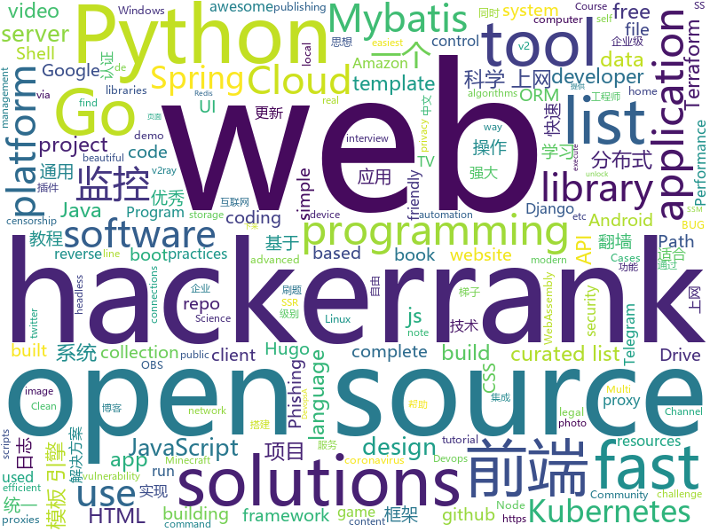

# 2020-06-21
See what the GitHub community is most excited about.

## python
+ [pulse](https://github.com/adamian98/pulse)(**306 stars today**): PULSE: Self-Supervised Photo Upsampling via Latent Space Exploration of Generative Models
+ [youtube-dl](https://github.com/ytdl-org/youtube-dl)(**74 stars today**): Command-line program to download videos from YouTube.com and other video sites
+ [public-apis](https://github.com/public-apis/public-apis)(**247 stars today**): A collective list of free APIs for use in software and web development.
+ [practical-python](https://github.com/dabeaz-course/practical-python)(**406 stars today**): Practical Python Programming (course by @dabeaz)
+ [DeDRM_tools](https://github.com/apprenticeharper/DeDRM_tools)(**12 stars today**): DeDRM tools for ebooks
+ [plugin.video.netflix](https://github.com/CastagnaIT/plugin.video.netflix)(**27 stars today**): InputStream based Netflix plugin for Kodi
+ [python-small-examples](https://github.com/jackzhenguo/python-small-examples)(**43 stars today**): 告别枯燥，60 秒学会一个 Python 小例子
+ [saleor](https://github.com/mirumee/saleor)(**45 stars today**): A modular, high performance, headless e-commerce storefront built with Python, GraphQL, Django, and ReactJS.
+ [awesome-python](https://github.com/vinta/awesome-python)(**74 stars today**): A curated list of awesome Python frameworks, libraries, software and resources
+ [tuya-convert](https://github.com/ct-Open-Source/tuya-convert)(**8 stars today**): A collection of scripts to flash Tuya IoT devices to alternative firmwares
+ [DeepCreamPy](https://github.com/deeppomf/DeepCreamPy)(**14 stars today**): Decensoring Hentai with Deep Neural Networks
+ [system-design-primer](https://github.com/donnemartin/system-design-primer)(**132 stars today**): Learn how to design large-scale systems. Prep for the system design interview. Includes Anki flashcards.
+ [python-cheatsheet](https://github.com/gto76/python-cheatsheet)(**41 stars today**): Comprehensive Python Cheatsheet
+ [taiga-back](https://github.com/taigaio/taiga-back)(**13 stars today**): Agile project management platform. Built on top of Django and AngularJS
+ [NotQuite0DayFriday](https://github.com/grimm-co/NotQuite0DayFriday)(**60 stars today**): This is a repo which documents real bugs in real software to illustrate trends, learn how to prevent or find them more quickly.
+ [XSStrike](https://github.com/s0md3v/XSStrike)(**8 stars today**): Most advanced XSS scanner.
+ [SatanSword](https://github.com/Lucifer1993/SatanSword)(**30 stars today**): 红队综合渗透框架
+ [cpython](https://github.com/python/cpython)(**33 stars today**): The Python programming language
+ [modular_tree](https://github.com/MaximeHerpin/modular_tree)(**9 stars today**): 
+ [mmdetection](https://github.com/open-mmlab/mmdetection)(**56 stars today**): OpenMMLab Detection Toolbox and Benchmark
+ [checkov](https://github.com/bridgecrewio/checkov)(**23 stars today**): Prevent cloud misconfigurations during build-time for Terraform, Cloudformation, Kubernetes and other infrastructure-as-code-languages with Checkov by Bridgecrew.
+ [pytorch-image-models](https://github.com/rwightman/pytorch-image-models)(**15 stars today**): PyTorch image models, scripts, pretrained weights -- (SE)ResNet/ResNeXT, DPN, EfficientNet, MixNet, MobileNet-V3/V2, MNASNet, Single-Path NAS, FBNet, and more
+ [bips](https://github.com/bitcoin/bips)(**5 stars today**): Bitcoin Improvement Proposals
+ [pyTelegramBotAPI](https://github.com/eternnoir/pyTelegramBotAPI)(**6 stars today**): Python Telegram bot api.
+ [core](https://github.com/home-assistant/core)(**23 stars today**): 🏡Open source home automation that puts local control and privacy first

## java
+ [GitHub-Chinese-Top-Charts](https://github.com/kon9chunkit/GitHub-Chinese-Top-Charts)(**175 stars today**): 🇨🇳GitHub中文排行榜，帮助你发现高分优秀中文项目、更高效地吸收国人的优秀经验成果；榜单每周更新一次，敬请关注！
+ [SpringBoot-Labs](https://github.com/YunaiV/SpringBoot-Labs)(**165 stars today**): 一个涵盖六个专栏：Spring Boot 2.X、Spring Cloud、Spring Cloud Alibaba、Dubbo、分布式消息队列、分布式事务的仓库。希望胖友小手一抖，右上角来个 Star，感恩 1024
+ [soul](https://github.com/Dromara/soul)(**14 stars today**): High-Performance Java API Gateway
+ [HMCL](https://github.com/huanghongxun/HMCL)(**3 stars today**): A Minecraft Launcher which is multi-functional, cross-platform and popular
+ [microservices-platform](https://github.com/zlt2000/microservices-platform)(**5 stars today**): 基于SpringBoot2.x、SpringCloud和SpringCloudAlibaba并采用前后端分离的企业级微服务多租户系统架构。并引入组件化的思想实现高内聚低耦合，项目代码简洁注释丰富上手容易，适合学习和企业中使用。真正实现了基于RBAC、jwt和oauth2的无状态统一权限认证的解决方案，面向互联网设计同时适合B端和C端用户，支持CI/CD多环境部署，并提供应用管理方便第三方系统接入；同时还集合各种微服务治理功能和监控功能。模块包括:企业级的认证系统、开发平台、应用监控、慢sql监控、统一日志、单点登录、Redis分布式高速缓存、配置中心、分布式任务调度、接口文档、代码生成等等。
+ [halo](https://github.com/halo-dev/halo)(**23 stars today**): ✍An excellent open source blog publishing application. | 一个优秀的开源博客发布应用。
+ [zfile](https://github.com/zhaojun1998/zfile)(**40 stars today**): 在线云盘
+ [exposure-notifications-android](https://github.com/google/exposure-notifications-android)(**4 stars today**): Exposure Notifications Android Reference Design
+ [Leaf](https://github.com/Meituan-Dianping/Leaf)(**8 stars today**): Distributed ID Generate Service
+ [ForestBlog](https://github.com/saysky/ForestBlog)(**6 stars today**): 一个简单漂亮的SSM(Spring+SpringMVC+Mybatis)博客系统
+ [BungeeCord](https://github.com/SpigotMC/BungeeCord)(**1 stars today**): BungeeCord, the 6th in a generation of server portal suites. Efficiently proxies and maintains connections and transport between multiple Minecraft servers.
+ [HackerRank_solutions](https://github.com/RodneyShag/HackerRank_solutions)(**4 stars today**): 317 efficient solutions to HackerRank problems
+ [linuxdeploy](https://github.com/meefik/linuxdeploy)(**3 stars today**): Install and run GNU/Linux on Android
+ [baritone](https://github.com/cabaletta/baritone)(**11 stars today**): google maps for block game
+ [ghidra](https://github.com/NationalSecurityAgency/ghidra)(**20 stars today**): Ghidra is a software reverse engineering (SRE) framework
+ [Conversations](https://github.com/iNPUTmice/Conversations)(**5 stars today**): Conversations is an open source XMPP/Jabber client for Android
+ [VirtualXposed](https://github.com/android-hacker/VirtualXposed)(**10 stars today**): A simple app to use Xposed without root, unlock the bootloader or modify system image, etc.
+ [devops-master-class](https://github.com/in28minutes/devops-master-class)(**3 stars today**): Devops Tutorial for Beginners Docker, Kubernetes, Terraform, Ansible, Jenkins and Azure Devops
+ [igniter](https://github.com/trojan-gfw/igniter)(**7 stars today**): A trojan client for Android (UNDER CONSTRUCTION).
+ [FairEmail](https://github.com/M66B/FairEmail)(**7 stars today**): Fully featured, open source, privacy friendly email app for Android
+ [graal](https://github.com/oracle/graal)(**15 stars today**): GraalVM: Run Programs Faster Anywhere🚀
+ [flink](https://github.com/apache/flink)(**15 stars today**): Apache Flink
+ [Mindustry](https://github.com/Anuken/Mindustry)(**7 stars today**): A sandbox tower defense game
+ [spring-boot-demo](https://github.com/xkcoding/spring-boot-demo)(**38 stars today**): spring boot demo 是一个用来深度学习并实战 spring boot 的项目，目前总共包含 65 个集成demo，已经完成 53 个。 该项目已成功集成 actuator(监控)、admin(可视化监控)、logback(日志)、aopLog(通过AOP记录web请求日志)、统一异常处理(json级别和页面级别)、freemarker(模板引擎)、thymeleaf(模板引擎)、Beetl(模板引擎)、Enjoy(模板引擎)、JdbcTemplate(通用JDBC操作数据库)、JPA(强大的ORM框架)、mybatis(强大的ORM框架)、通用Mapper(快速操作Mybatis)、PageHelper(通用的Mybatis分页插件)、mybatis-plus(快速操作M…
+ [Hackerrank-Solutions](https://github.com/Java-aid/Hackerrank-Solutions)(**3 stars today**): hackerrank solutions github | hackerrank all solutions | hackerrank solutions for java | hackerrank video tutorial | hackerrank cracking the coding interview solutions | hackerrank data structures | hackerrank solutions algorithms | hackerrank challenge | hackerrank coding challenge | hackerrank algorithms solutions github| hackerrank problem so…

## unknown
+ [app-ideas](https://github.com/florinpop17/app-ideas)(**306 stars today**): A Collection of application ideas which can be used to improve your coding skills.
+ [COVID-19](https://github.com/CSSEGISandData/COVID-19)(**34 stars today**): Novel Coronavirus (COVID-19) Cases, provided by JHU CSSE
+ [coding-interview-university](https://github.com/jwasham/coding-interview-university)(**217 stars today**): A complete computer science study plan to become a software engineer.
+ [You-Dont-Know-JS](https://github.com/getify/You-Dont-Know-JS)(**97 stars today**): A book series on JavaScript. @YDKJS on twitter.
+ [free-programming-books](https://github.com/EbookFoundation/free-programming-books)(**261 stars today**): 📚Freely available programming books
+ [awesome-programming-books-1](https://github.com/greyireland/awesome-programming-books-1)(**66 stars today**): 计算机经典书籍📚，保留书单
+ [nuclei-templates](https://github.com/projectdiscovery/nuclei-templates)(**2 stars today**): Community curated list of template files for the nuclei engine to find security vulnerability and fingerprinting the targets.
+ [DescomplicandoKubernetes](https://github.com/badtuxx/DescomplicandoKubernetes)(**14 stars today**): 
+ [design-resources-for-developers](https://github.com/bradtraversy/design-resources-for-developers)(**73 stars today**): Curated list of design and UI resources from stock photos, web templates, CSS frameworks, UI libraries, tools and much more
+ [trackerslist](https://github.com/ngosang/trackerslist)(**37 stars today**): Updated list of public BitTorrent trackers
+ [TeachYourselfCS-CN](https://github.com/keithnull/TeachYourselfCS-CN)(**27 stars today**): TeachYourselfCS 的中文翻译 | A Chinese translation of TeachYourselfCS
+ [new-pac](https://github.com/Alvin9999/new-pac)(**21 stars today**): 科学上网/自由上网/翻墙/软件/方法，免费shadowsocks/ss/ssr/v2ray/goflyway账号，vps一键搭建脚本/教程
+ [shell-cheatsheet](https://github.com/merveenoyan/shell-cheatsheet)(**15 stars today**): Shell çitşit (Türkçe)
+ [OnJava8](https://github.com/LingCoder/OnJava8)(**25 stars today**): 《On Java 8》中文版，又名《Java编程思想》 第5版
+ [awesome-web-hacking](https://github.com/infoslack/awesome-web-hacking)(**20 stars today**): A list of web application security
+ [project-based-learning](https://github.com/tuvtran/project-based-learning)(**161 stars today**): Curated list of project-based tutorials
+ [learn-python3](https://github.com/michaelliao/learn-python3)(**3 stars today**): Learn Python 3 Sample Code
+ [covid-19-data](https://github.com/nytimes/covid-19-data)(**11 stars today**): An ongoing repository of data on coronavirus cases and deaths in the U.S.
+ [computer-science](https://github.com/ossu/computer-science)(**106 stars today**): 🎓Path to a free self-taught education in Computer Science!
+ [developer-roadmap](https://github.com/kamranahmedse/developer-roadmap)(**126 stars today**): Roadmap to becoming a web developer in 2020
+ [TDTChannels](https://github.com/LaQuay/TDTChannels)(**4 stars today**): Listado de Canales de TV (TDT) en abierto, 100% legal, 100% gratuito // Spanish TV Channels, 100% legal, 100% free
+ [SaaS4Devs](https://github.com/nicolas-racchi/SaaS4Devs)(**38 stars today**): Awesome collection of content for developers trying to bootstrap their SaaS
+ [NeverSink-Filter](https://github.com/NeverSinkDev/NeverSink-Filter)(**13 stars today**): This is a lootfilter for the game "Path of Exile". It hides low value items, uses a markup-scheme and sounds to highlight expensive gear and is based on economy data mining.
+ [fancyss_history_package](https://github.com/hq450/fancyss_history_package)(**16 stars today**): 科学上网插件的离线安装包储存在这里
+ [Python-programming-exercises](https://github.com/zhiwehu/Python-programming-exercises)(**28 stars today**): 100+ Python challenging programming exercises

## javascript
+ [awesomechat](https://github.com/FamManh/awesomechat)(**28 stars today**): 
+ [keen-slider](https://github.com/rcbyr/keen-slider)(**211 stars today**): The HTML touch slider carousel with the most native feeling
+ [fullstack-course4](https://github.com/jhu-ep-coursera/fullstack-course4)(**21 stars today**): Example code for HTML, CSS, and Javascript for Web Developers Coursera Course
+ [react-router](https://github.com/ReactTraining/react-router)(**24 stars today**): Declarative routing for React
+ [pose-animator](https://github.com/yemount/pose-animator)(**113 stars today**): 
+ [storybooks](https://github.com/bradtraversy/storybooks)(**41 stars today**): Node.js app with Google OAuth
+ [node-typescript-structure](https://github.com/Rocketseat/node-typescript-structure)(**101 stars today**): Node.js, ESLint, TypeScript, Jest & Babel
+ [vxe-table](https://github.com/xuliangzhan/vxe-table)(**51 stars today**): 🐬vxe-table vue 表格解决方案
+ [perspective](https://github.com/finos/perspective)(**5 stars today**): Streaming pivot visualization via WebAssembly
+ [opensource.guide](https://github.com/github/opensource.guide)(**7 stars today**): 📚Community guides for open source creators
+ [joplin](https://github.com/laurent22/joplin)(**28 stars today**): Joplin - an open source note taking and to-do application with synchronization capabilities for Windows, macOS, Linux, Android and iOS. Forum: https://discourse.joplinapp.org/
+ [Web](https://github.com/qianguyihao/Web)(**21 stars today**): 前端入门到进阶，超详细的Web前端学习图文教程。从零开始学前端，做一名精致优雅的前端工程师。每日更新...
+ [frontend-hard-mode-interview](https://github.com/coffe1891/frontend-hard-mode-interview)(**11 stars today**): 《前端内参》帮助前端工程师们夯实技术以通过一线互联网企业技术面试。日拱一卒，一年下来你会惊叹自己的进步。
+ [webogram](https://github.com/zhukov/webogram)(**3 stars today**): Telegram web application, GPL v3
+ [AriaNg](https://github.com/mayswind/AriaNg)(**9 stars today**): AriaNg, a modern web frontend making aria2 easier to use.
+ [complete-javascript-course](https://github.com/jonasschmedtmann/complete-javascript-course)(**11 stars today**): Starter files, final projects and FAQ for my Complete JavaScript course
+ [uBlock](https://github.com/gorhill/uBlock)(**15 stars today**): uBlock Origin - An efficient blocker for Chromium and Firefox. Fast and lean.
+ [clean-code-javascript](https://github.com/ryanmcdermott/clean-code-javascript)(**48 stars today**): 🛁Clean Code concepts adapted for JavaScript
+ [Ghost](https://github.com/TryGhost/Ghost)(**13 stars today**): 👻The #1 headless Node.js CMS for professional publishing
+ [githon](https://github.com/githon/githon)(**44 stars today**): 📖GitHon is building beautiful books using Markdown - Fork of GitBook
+ [next-auth](https://github.com/iaincollins/next-auth)(**49 stars today**): Easy authentication for Next.js and Serverless
+ [deleteDiscordMessages](https://github.com/victornpb/deleteDiscordMessages)(**11 stars today**): Delete all messages in a Discord channel or DM (Easy and fast) Bulk delete
+ [Functional-Light-JS](https://github.com/getify/Functional-Light-JS)(**15 stars today**): Pragmatic, balanced FP in JavaScript. @FLJSBook on twitter.
+ [node-react-ecommerce](https://github.com/basir/node-react-ecommerce)(**4 stars today**): Build ECommerce Website Like Amazon By React & Node & MongoDB
+ [three.js](https://github.com/mrdoob/three.js)(**40 stars today**): JavaScript 3D library.

## html
+ [youdownloadtheappanditdoesntwork](https://github.com/lperiodbose/youdownloadtheappanditdoesntwork)(**89 stars today**): 
+ [kubernetes-goat](https://github.com/madhuakula/kubernetes-goat)(**69 stars today**): Kubernetes Goat is "Vulnerable by Design" Kubernetes Cluster.
+ [awesome-piracy](https://github.com/Igglybuff/awesome-piracy)(**53 stars today**): A curated list of awesome warez and piracy links
+ [hugo-academic](https://github.com/gcushen/hugo-academic)(**9 stars today**): 📝The website builder for Hugo. Build and deploy a beautiful website in minutes!
+ [tidytuesday](https://github.com/rfordatascience/tidytuesday)(**11 stars today**): Official repo for the #tidytuesday project
+ [shellphish](https://github.com/thelinuxchoice/shellphish)(**5 stars today**): 19 Social Media Phishing Pages #phishing #shellphish #phish
+ [free-for-dev](https://github.com/ripienaar/free-for-dev)(**37 stars today**): A list of SaaS, PaaS and IaaS offerings that have free tiers of interest to devops and infradev
+ [learning-area](https://github.com/mdn/learning-area)(**3 stars today**): Github repo for the MDN Learning Area.
+ [riot-web](https://github.com/vector-im/riot-web)(**11 stars today**): A glossy Matrix collaboration client for the web.
+ [blackeye](https://github.com/thelinuxchoice/blackeye)(**3 stars today**): The most complete Phishing Tool, with 32 templates +1 customizable
+ [boost](https://github.com/boostorg/boost)(**6 stars today**): Super-project for modularized Boost
+ [ClashR_for_Windows](https://github.com/BoyceLig/ClashR_for_Windows)(**5 stars today**): 
+ [django-DefectDojo](https://github.com/DefectDojo/django-DefectDojo)(**5 stars today**): DefectDojo is an open-source application vulnerability correlation and security orchestration tool.
+ [obs-web](https://github.com/Niek/obs-web)(**147 stars today**): OBS-web - the easiest way to control OBS remotely
+ [Dism-Multi-language](https://github.com/Chuyu-Team/Dism-Multi-language)(**3 stars today**): Dism++ Multi-language Support & BUG Report
+ [docsy](https://github.com/google/docsy)(**3 stars today**): A set of Hugo doc templates for launching open source content.
+ [ML-notes](https://github.com/Sakura-gh/ML-notes)(**16 stars today**): notes about machine learning
+ [luci-app-clash](https://github.com/frainzy1477/luci-app-clash)(**6 stars today**): Luci interface for Clash Openwrt
+ [material-design-lite](https://github.com/google/material-design-lite)(**4 stars today**): Material Design Components in HTML/CSS/JS
+ [python-getting-started](https://github.com/heroku/python-getting-started)(**1 stars today**): Getting Started with Python on Heroku.
+ [pcc_2e](https://github.com/ehmatthes/pcc_2e)(**1 stars today**): Online resources for Python Crash Course (Second Edition), from No Starch Press
+ [WebFundamentals](https://github.com/google/WebFundamentals)(**6 stars today**): Best practices for modern web development
+ [hermit](https://github.com/Track3/hermit)(**2 stars today**): A minimal & fast Hugo theme for bloggers
+ [MIXBOX](https://github.com/monlor/MIXBOX)(**3 stars today**): 一款基于Shell的小米路由器工具箱，原为Monlor-Tools，A tool box for XiaoMi Router base on Shell.
+ [tabler](https://github.com/tabler/tabler)(**10 stars today**): Tabler is free and open-source HTML Dashboard UI Kit built on Bootstrap

## go
+ [OpenDiablo2](https://github.com/OpenDiablo2/OpenDiablo2)(**105 stars today**): An open source re-implementation of Diablo 2
+ [algorithm-pattern](https://github.com/greyireland/algorithm-pattern)(**713 stars today**): 算法模板，最科学的刷题方式，最快速的刷题路径，你值得拥有~
+ [fzf](https://github.com/junegunn/fzf)(**40 stars today**): 🌸A command-line fuzzy finder
+ [goplus](https://github.com/qiniu/goplus)(**189 stars today**): GoPlus - The Go+ language for data science
+ [libpod](https://github.com/containers/libpod)(**15 stars today**): libpod is a library used to create container pods. Home of Podman.
+ [vssh](https://github.com/yahoo/vssh)(**86 stars today**): Go library to handle tens of thousands SSH connections and execute the command(s) with higher-level API for building network device / server automation.
+ [PhoneInfoga](https://github.com/sundowndev/PhoneInfoga)(**9 stars today**): Advanced information gathering & OSINT framework for phone numbers
+ [syncthing](https://github.com/syncthing/syncthing)(**67 stars today**): Open Source Continuous File Synchronization
+ [ebiten](https://github.com/hajimehoshi/ebiten)(**17 stars today**): A dead simple 2D game library for Go
+ [tailscale](https://github.com/tailscale/tailscale)(**13 stars today**): The easiest, most secure way to use WireGuard and 2FA.
+ [kubermatic](https://github.com/kubermatic/kubermatic)(**55 stars today**): The Central Kubernetes Management Platform For Any Infrastructure
+ [goreleaser](https://github.com/goreleaser/goreleaser)(**24 stars today**): Deliver Go binaries as fast and easily as possible
+ [httprobe](https://github.com/tomnomnom/httprobe)(**4 stars today**): Take a list of domains and probe for working HTTP and HTTPS servers
+ [annie](https://github.com/iawia002/annie)(**18 stars today**): 👾Fast, simple and clean video downloader
+ [go-app](https://github.com/maxence-charriere/go-app)(**6 stars today**): A package to build progressive web apps with Go programming language and WebAssembly.
+ [HFish](https://github.com/hacklcx/HFish)(**20 stars today**): 🍯A Most Convenient Honeypot Platform.🐝🐝🐝🐝🐝
+ [v2ray-core](https://github.com/v2ray/v2ray-core)(**59 stars today**): A platform for building proxies to bypass network restrictions.
+ [rclone](https://github.com/rclone/rclone)(**19 stars today**): "rsync for cloud storage" - Google Drive, Amazon Drive, S3, Dropbox, Backblaze B2, One Drive, Swift, Hubic, Cloudfiles, Google Cloud Storage, Yandex Files
+ [lantern](https://github.com/getlantern/lantern)(**27 stars today**): Lantern官方版本下载 蓝灯 翻墙 代理 科学上网 外网 加速器 梯子 路由 lantern proxy vpn censorship-circumvention censorship gfw accelerator
+ [walk](https://github.com/lxn/walk)(**3 stars today**): A Windows GUI toolkit for the Go Programming Language
+ [tflint](https://github.com/terraform-linters/tflint)(**13 stars today**): TFLint is a Terraform linter focused on possible errors, best practices, etc. (Terraform >= 0.12)
+ [gorm](https://github.com/go-gorm/gorm)(**30 stars today**): The fantastic ORM library for Golang, aims to be developer friendly (v2 is under public testing...)
+ [gotraining](https://github.com/ardanlabs/gotraining)(**10 stars today**): Go Training Class Material :
+ [frp](https://github.com/fatedier/frp)(**37 stars today**): A fast reverse proxy to help you expose a local server behind a NAT or firewall to the internet.
+ [FreePAC](https://github.com/xiaoming2028/FreePAC)(**9 stars today**): 科学上网/梯子/自由上网/翻墙 SS/SSR/V2Ray/Brook 搭建教程

## WordCloud

