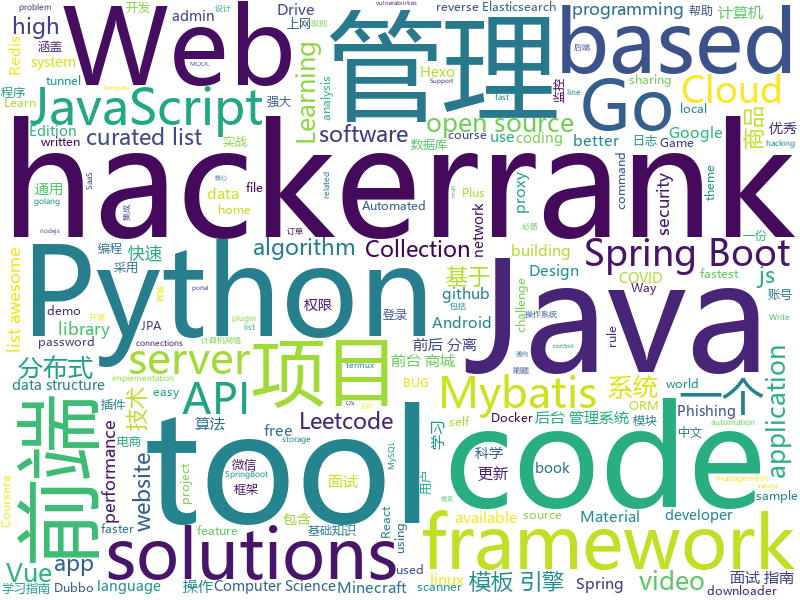

# 2020-06-22
See what the GitHub community is most excited about.

## python
+ [pulse](https://github.com/adamian98/pulse)(**461 stars today**): PULSE: Self-Supervised Photo Upsampling via Latent Space Exploration of Generative Models
+ [Better-Python-59-Ways](https://github.com/SigmaQuan/Better-Python-59-Ways)(**125 stars today**): Code Sample of Book "Effective Python: 59 Specific Ways to Write Better Pyton" by Brett Slatkin
+ [youtube-dl](https://github.com/ytdl-org/youtube-dl)(**85 stars today**): Command-line program to download videos from YouTube.com and other video sites
+ [core](https://github.com/home-assistant/core)(**18 stars today**): 🏡Open source home automation that puts local control and privacy first
+ [public-apis](https://github.com/public-apis/public-apis)(**239 stars today**): A collective list of free APIs for use in software and web development.
+ [python-small-examples](https://github.com/jackzhenguo/python-small-examples)(**29 stars today**): 告别枯燥，60 秒学会一个 Python 小例子
+ [awesome-python](https://github.com/vinta/awesome-python)(**68 stars today**): A curated list of awesome Python frameworks, libraries, software and resources
+ [DeDRM_tools](https://github.com/apprenticeharper/DeDRM_tools)(**18 stars today**): DeDRM tools for ebooks
+ [python-cheatsheet](https://github.com/gto76/python-cheatsheet)(**52 stars today**): Comprehensive Python Cheatsheet
+ [saleor](https://github.com/mirumee/saleor)(**38 stars today**): A modular, high performance, headless e-commerce storefront built with Python, GraphQL, Django, and ReactJS.
+ [lets_git_exercise_de](https://github.com/SanJSp/lets_git_exercise_de)(**8 stars today**): This is an excercise created for our MOOC "Let's Git - Versionsverwaltung & Open Source"
+ [Tool-X](https://github.com/rajkumardusad/Tool-X)(**9 stars today**): Tool-X is a kali linux hacking Tool installer. Tool-X developed for termux and other Linux based systems. using Tool-X you can install almost 370+ hacking tools in termux app and other linux based distributions.
+ [practical-python](https://github.com/dabeaz-course/practical-python)(**294 stars today**): Practical Python Programming (course by @dabeaz)
+ [Instagram](https://github.com/Pure-L0G1C/Instagram)(**3 stars today**): Bruteforce attack for Instagram
+ [chalice](https://github.com/aws/chalice)(**17 stars today**): Python Serverless Microframework for AWS
+ [yfinance](https://github.com/ranaroussi/yfinance)(**15 stars today**): Yahoo! Finance market data downloader (+faster Pandas Datareader)
+ [neural-networks-and-deep-learning](https://github.com/mnielsen/neural-networks-and-deep-learning)(**6 stars today**): Code samples for my book "Neural Networks and Deep Learning"
+ [stylegan](https://github.com/NVlabs/stylegan)(**16 stars today**): StyleGAN - Official TensorFlow Implementation
+ [caliban](https://github.com/google/caliban)(**24 stars today**): Research workflows made easy, locally and in the Cloud.
+ [plugin.video.netflix](https://github.com/CastagnaIT/plugin.video.netflix)(**25 stars today**): InputStream based Netflix plugin for Kodi
+ [scikit-learn](https://github.com/scikit-learn/scikit-learn)(**12 stars today**): scikit-learn: machine learning in Python
+ [pytorch-lightning](https://github.com/PyTorchLightning/pytorch-lightning)(**37 stars today**): The lightweight PyTorch wrapper for ML researchers. Scale your models. Write less boilerplate
+ [symmetrynet](https://github.com/zhou13/symmetrynet)(**10 stars today**): SymmetryNet: Learning to Detect 3D Reflection Symmetry for Single-View Reconstruction
+ [vyper](https://github.com/vyperlang/vyper)(**3 stars today**): Pythonic Smart Contract Language for the EVM
+ [effectivepython](https://github.com/bslatkin/effectivepython)(**14 stars today**): Effective Python: Second Edition — Source Code and Errata for the Book

## java
+ [spring-boot-demo](https://github.com/xkcoding/spring-boot-demo)(**40 stars today**): spring boot demo 是一个用来深度学习并实战 spring boot 的项目，目前总共包含 65 个集成demo，已经完成 53 个。 该项目已成功集成 actuator(监控)、admin(可视化监控)、logback(日志)、aopLog(通过AOP记录web请求日志)、统一异常处理(json级别和页面级别)、freemarker(模板引擎)、thymeleaf(模板引擎)、Beetl(模板引擎)、Enjoy(模板引擎)、JdbcTemplate(通用JDBC操作数据库)、JPA(强大的ORM框架)、mybatis(强大的ORM框架)、通用Mapper(快速操作Mybatis)、PageHelper(通用的Mybatis分页插件)、mybatis-plus(快速操作M…
+ [tsunami-security-scanner](https://github.com/google/tsunami-security-scanner)(**190 stars today**): Tsunami is a general purpose network security scanner with an extensible plugin system for detecting high severity vulnerabilities with high confidence.
+ [GitHub-Chinese-Top-Charts](https://github.com/kon9chunkit/GitHub-Chinese-Top-Charts)(**169 stars today**): 🇨🇳GitHub中文排行榜，帮助你发现高分优秀中文项目、更高效地吸收国人的优秀经验成果；榜单每周更新一次，敬请关注！
+ [Geyser](https://github.com/GeyserMC/Geyser)(**10 stars today**): A bridge/proxy allowing you to connect to Minecraft: Java Edition servers with Minecraft: Bedrock edition.
+ [mall](https://github.com/macrozheng/mall)(**125 stars today**): mall项目是一套电商系统，包括前台商城系统及后台管理系统，基于SpringBoot+MyBatis实现，采用Docker容器化部署。 前台商城系统包含首页门户、商品推荐、商品搜索、商品展示、购物车、订单流程、会员中心、客户服务、帮助中心等模块。 后台管理系统包含商品管理、订单管理、会员管理、促销管理、运营管理、内容管理、统计报表、财务管理、权限管理、设置等模块。
+ [litemall](https://github.com/linlinjava/litemall)(**92 stars today**): 又一个小商城。litemall = Spring Boot后端 + Vue管理员前端 + 微信小程序用户前端 + Vue用户移动端
+ [Algorithms](https://github.com/williamfiset/Algorithms)(**15 stars today**): A collection of algorithms and data structures
+ [xmall](https://github.com/Exrick/xmall)(**116 stars today**): 基于SOA架构的分布式电商购物商城 前后端分离 前台商城:Vue全家桶 后台管理系统:Dubbo/SSM/Elasticsearch/Redis/MySQL/ActiveMQ/Shiro/Zookeeper等
+ [CS-Notes](https://github.com/CyC2018/CS-Notes)(**92 stars today**): 📚技术面试必备基础知识、Leetcode、计算机操作系统、计算机网络、系统设计、Java、Python、C++
+ [ghidra](https://github.com/NationalSecurityAgency/ghidra)(**14 stars today**): Ghidra is a software reverse engineering (SRE) framework
+ [SpringBoot-Labs](https://github.com/YunaiV/SpringBoot-Labs)(**83 stars today**): 一个涵盖六个专栏：Spring Boot 2.X、Spring Cloud、Spring Cloud Alibaba、Dubbo、分布式消息队列、分布式事务的仓库。希望胖友小手一抖，右上角来个 Star，感恩 1024
+ [zfile](https://github.com/zhaojun1998/zfile)(**15 stars today**): 在线云盘
+ [HackerRank_solutions](https://github.com/RodneyShag/HackerRank_solutions)(**6 stars today**): 317 efficient solutions to HackerRank problems
+ [vhr](https://github.com/lenve/vhr)(**28 stars today**): 微人事是一个前后端分离的人力资源管理系统，项目采用SpringBoot+Vue开发。
+ [BungeeCord](https://github.com/SpigotMC/BungeeCord)(**3 stars today**): BungeeCord, the 6th in a generation of server portal suites. Efficiently proxies and maintains connections and transport between multiple Minecraft servers.
+ [piranha](https://github.com/uber/piranha)(**120 stars today**): A tool for refactoring code related to feature flag APIs
+ [androrat](https://github.com/wszf/androrat)(**4 stars today**): androrat
+ [EdXposedManager](https://github.com/ElderDrivers/EdXposedManager)(**4 stars today**): Companion Android application for EdXposed
+ [Hackerrank-Solutions](https://github.com/Java-aid/Hackerrank-Solutions)(**4 stars today**): hackerrank solutions github | hackerrank all solutions | hackerrank solutions for java | hackerrank video tutorial | hackerrank cracking the coding interview solutions | hackerrank data structures | hackerrank solutions algorithms | hackerrank challenge | hackerrank coding challenge | hackerrank algorithms solutions github| hackerrank problem so…
+ [soul](https://github.com/Dromara/soul)(**24 stars today**): High-Performance Java API Gateway
+ [openhab-addons](https://github.com/openhab/openhab-addons)(**1 stars today**): Add-ons for openHAB
+ [JavaGuide](https://github.com/Snailclimb/JavaGuide)(**82 stars today**): 「Java学习+面试指南」一份涵盖大部分Java程序员所需要掌握的核心知识。
+ [halo](https://github.com/halo-dev/halo)(**26 stars today**): ✍An excellent open source blog publishing application. | 一个优秀的开源博客发布应用。
+ [storm](https://github.com/apache/storm)(**3 stars today**): Mirror of Apache Storm
+ [xboot](https://github.com/Exrick/xboot)(**6 stars today**): 基于Spring Boot 2.x的一站式前后端分离快速开发平台XBoot 微信小程序+Uniapp 前端：Vue+iView Admin 后端：Spring Boot 2.x/Spring Security/JWT/JPA+Mybatis-Plus/Redis/Elasticsearch/Activiti 分布式限流/同步锁/验证码/SnowFlake雪花算法ID生成 动态权限管理 数据权限 工作流 代码生成 定时任务 第三方社交账号、短信登录 单点登录 OAuth2开放平台

## unknown
+ [COVID-19](https://github.com/CSSEGISandData/COVID-19)(**26 stars today**): Novel Coronavirus (COVID-19) Cases, provided by JHU CSSE
+ [app-ideas](https://github.com/florinpop17/app-ideas)(**289 stars today**): A Collection of application ideas which can be used to improve your coding skills.
+ [TeachYourselfCS-CN](https://github.com/keithnull/TeachYourselfCS-CN)(**319 stars today**): TeachYourselfCS 的中文翻译 | A Chinese translation of TeachYourselfCS
+ [coding-interview-university](https://github.com/jwasham/coding-interview-university)(**434 stars today**): A complete computer science study plan to become a software engineer.
+ [snipsnap](https://github.com/snipsnapdev/snipsnap)(**73 stars today**): The ultimate snippets collection for VS Code
+ [computer-science](https://github.com/ossu/computer-science)(**195 stars today**): 🎓Path to a free self-taught education in Computer Science!
+ [awesome-for-beginners](https://github.com/MunGell/awesome-for-beginners)(**68 stars today**): A list of awesome beginners-friendly projects.
+ [JavaCollection](https://github.com/hansonwang99/JavaCollection)(**32 stars today**): Java开源项目之「自学编程之路」：学习指南+面试指南+资源分享+技术文章
+ [awesome-programming-books-1](https://github.com/greyireland/awesome-programming-books-1)(**51 stars today**): 计算机经典书籍📚，保留书单
+ [DescomplicandoKubernetes](https://github.com/badtuxx/DescomplicandoKubernetes)(**13 stars today**): 
+ [You-Dont-Know-JS](https://github.com/getify/You-Dont-Know-JS)(**81 stars today**): A book series on JavaScript. @YDKJS on twitter.
+ [awesome-web-hacking](https://github.com/infoslack/awesome-web-hacking)(**11 stars today**): A list of web application security
+ [free-programming-books](https://github.com/EbookFoundation/free-programming-books)(**135 stars today**): 📚Freely available programming books
+ [golang-developer-roadmap](https://github.com/Alikhll/golang-developer-roadmap)(**10 stars today**): Roadmap to becoming a Go developer in 2020
+ [ClashForAndroid](https://github.com/Kr328/ClashForAndroid)(**19 stars today**): A rule-based tunnel for Android.
+ [WIKISTORE](https://github.com/TheWizWikii/WIKISTORE)(**6 stars today**): App/Game para PS3
+ [fucking-algorithm](https://github.com/labuladong/fucking-algorithm)(**142 stars today**): 手把手撕LeetCode题目，扒各种算法套路的裤子。English version supported! Crack LeetCode, not only how, but also why.
+ [wwdc](https://github.com/twostraws/wwdc)(**51 stars today**): WWDC Community: Learning and sharing together
+ [awesome-vpn](https://github.com/hugetiny/awesome-vpn)(**13 stars today**): Free VPN/proxy,server,account,link list.,实时更新免费的代理,科学上网,翻墙,梯子,服务器,客户端,账号
+ [datasharing](https://github.com/jtleek/datasharing)(**5 stars today**): The Leek group guide to data sharing
+ [books](https://github.com/programthink/books)(**9 stars today**): 【编程随想】收藏的电子书清单（多个学科，含下载链接）
+ [fancyss_history_package](https://github.com/hq450/fancyss_history_package)(**13 stars today**): 科学上网插件的离线安装包储存在这里
+ [JavaInterview](https://github.com/OUYANGSIHAI/JavaInterview)(**21 stars today**): 【Java面试+Java后端技术学习指南】：一份通向理想互联网公司的面试指南，包括 Java，技术面试必备基础知识、Leetcode、计算机操作系统、计算机网络、系统设计、分布式、数据库（MySQL、Redis）、Java 项目实战等
+ [project-based-learning](https://github.com/tuvtran/project-based-learning)(**40 stars today**): Curated list of project-based tutorials

## javascript
+ [next-auth](https://github.com/iaincollins/next-auth)(**70 stars today**): Easy authentication for Next.js and Serverless
+ [storybooks](https://github.com/bradtraversy/storybooks)(**17 stars today**): Node.js app with Google OAuth
+ [covid19india-react](https://github.com/covid19india/covid19india-react)(**14 stars today**): Tracking the impact of COVID-19 in India
+ [next.js](https://github.com/vercel/next.js)(**38 stars today**): The React Framework
+ [awesomechat](https://github.com/FamManh/awesomechat)(**22 stars today**): 
+ [clean-code-javascript](https://github.com/ryanmcdermott/clean-code-javascript)(**84 stars today**): 🛁Clean Code concepts adapted for JavaScript
+ [freeCodeCamp](https://github.com/freeCodeCamp/freeCodeCamp)(**39 stars today**): freeCodeCamp.org's open source codebase and curriculum. Learn to code at home.
+ [password-manager-resources](https://github.com/apple/password-manager-resources)(**30 stars today**): A place for creators and users of password managers to collaborate on resources to make password management better.
+ [automated-irrigation-system](https://github.com/PatrickHallek/automated-irrigation-system)(**89 stars today**): 
+ [node-typescript-structure](https://github.com/Rocketseat/node-typescript-structure)(**54 stars today**): Node.js, ESLint, TypeScript, Jest & Babel
+ [DPlayer](https://github.com/MoePlayer/DPlayer)(**13 stars today**): 🍭Wow, such a lovely HTML5 danmaku video player
+ [fullstack-course4](https://github.com/jhu-ep-coursera/fullstack-course4)(**16 stars today**): Example code for HTML, CSS, and Javascript for Web Developers Coursera Course
+ [Vulkan-Docs](https://github.com/KhronosGroup/Vulkan-Docs)(**2 stars today**): The Vulkan API Specification and related tools
+ [RSSHub](https://github.com/DIYgod/RSSHub)(**11 stars today**): 🍰Everything is RSSible
+ [wtfjs](https://github.com/denysdovhan/wtfjs)(**14 stars today**): A list of funny and tricky JavaScript examples
+ [react-saas-template](https://github.com/dunky11/react-saas-template)(**4 stars today**): 🌊Template for building an SaaS or admin website using React + Material-UI
+ [discord.js](https://github.com/discordjs/discord.js)(**5 stars today**): A powerful JavaScript library for interacting with the Discord API
+ [Web](https://github.com/qianguyihao/Web)(**14 stars today**): 前端入门到进阶，超详细的Web前端学习图文教程。从零开始学前端，做一名精致优雅的前端工程师。每日更新...
+ [udemy-downloader-gui](https://github.com/FaisalUmair/udemy-downloader-gui)(**4 stars today**): A desktop application for downloading Udemy Courses
+ [create-snowpack-app](https://github.com/pikapkg/create-snowpack-app)(**17 stars today**): CSA - Get started with the fastest dev environment available.
+ [redux-thunk](https://github.com/reduxjs/redux-thunk)(**6 stars today**): Thunk middleware for Redux
+ [QQMusicApi](https://github.com/jsososo/QQMusicApi)(**3 stars today**): 基于 Express + Axios 的 QQ音乐接口 nodejs 版
+ [iptv](https://github.com/iptv-org/iptv)(**53 stars today**): Collection of 8000+ publicly available IPTV channels from all over the world
+ [react-navigation-v5-mix](https://github.com/itzpradip/react-navigation-v5-mix)(**2 stars today**): 
+ [How-To-Ask-Questions-The-Smart-Way](https://github.com/ryanhanwu/How-To-Ask-Questions-The-Smart-Way)(**14 stars today**): 本文原文由知名 Hacker Eric S. Raymond 所撰寫，教你如何正確的提出技術問題並獲得你滿意的答案。

## html
+ [free-for-dev](https://github.com/ripienaar/free-for-dev)(**25 stars today**): A list of SaaS, PaaS and IaaS offerings that have free tiers of interest to devops and infradev
+ [awesome-piracy](https://github.com/Igglybuff/awesome-piracy)(**26 stars today**): A curated list of awesome warez and piracy links
+ [beginner-javascript](https://github.com/wesbos/beginner-javascript)(**6 stars today**): Slam Dunk JavaScript
+ [REKCARC-TSC-UHT](https://github.com/PKUanonym/REKCARC-TSC-UHT)(**15 stars today**): 清华大学计算机系课程攻略 Guidance for courses in Department of Computer Science and Technology, Tsinghua University
+ [hexo-theme-fluid](https://github.com/fluid-dev/hexo-theme-fluid)(**11 stars today**): 🌊一款 Material Design 风格的 Hexo 主题 / An elegant Material-Design theme for Hexo
+ [hugo-academic](https://github.com/gcushen/hugo-academic)(**7 stars today**): 📝The website builder for Hugo. Build and deploy a beautiful website in minutes!
+ [awesome-compose](https://github.com/docker/awesome-compose)(**6 stars today**): Awesome Docker Compose samples
+ [learning-area](https://github.com/mdn/learning-area)(**4 stars today**): Github repo for the MDN Learning Area.
+ [zphisher](https://github.com/htr-tech/zphisher)(**6 stars today**): Automated Phishing Tool
+ [ClashR_for_Windows](https://github.com/BoyceLig/ClashR_for_Windows)(**10 stars today**): 
+ [awesome-competitive-programming](https://github.com/lnishan/awesome-competitive-programming)(**4 stars today**): 💎A curated list of awesome Competitive Programming, Algorithm and Data Structure resources
+ [hospitalmanagement](https://github.com/sumitkumar1503/hospitalmanagement)(**3 stars today**): Hospital Management System || Python Django
+ [carikerja](https://github.com/rizafahmi/carikerja)(**22 stars today**): Daftar developer keren yang terpaksa di PHK karena dampak pandemi COVID-19.
+ [hexo-matery-modified](https://github.com/godweiyang/hexo-matery-modified)(**2 stars today**): My personal modified hexo matery theme with some bugs fixed.
+ [youdownloadtheappanditdoesntwork](https://github.com/lperiodbose/youdownloadtheappanditdoesntwork)(**35 stars today**): 
+ [web-moderno](https://github.com/cod3rcursos/web-moderno)(**2 stars today**): 
+ [bootcamp-launchbase-desafios-02](https://github.com/Rocketseat/bootcamp-launchbase-desafios-02)(**1 stars today**): Desafios do segundo módulo do Bootcamp Launchbase🚀👨🏻‍🚀
+ [shellphish](https://github.com/thelinuxchoice/shellphish)(**3 stars today**): 19 Social Media Phishing Pages #phishing #shellphish #phish
+ [chart-doctor](https://github.com/ft-interactive/chart-doctor)(**5 stars today**): Sample files to accompany the FT's Chart Doctor column
+ [JavaScript30](https://github.com/wesbos/JavaScript30)(**6 stars today**): 30 Day Vanilla JS Challenge
+ [node-ytdl-core](https://github.com/fent/node-ytdl-core)(**3 stars today**): YouTube video downloader in javascript.
+ [Introduction-to-CSS3](https://github.com/abdullahaalam/Introduction-to-CSS3)(**0 stars today**): Coursera - Web Design for Everybody
+ [fluxion](https://github.com/FluxionNetwork/fluxion)(**2 stars today**): Fluxion is a remake of linset by vk496 with enhanced functionality.
+ [Dism-Multi-language](https://github.com/Chuyu-Team/Dism-Multi-language)(**3 stars today**): Dism++ Multi-language Support & BUG Report
+ [ssl-config-generator](https://github.com/mozilla/ssl-config-generator)(**10 stars today**): Mozilla SSL Configuration Generator

## go
+ [OpenDiablo2](https://github.com/OpenDiablo2/OpenDiablo2)(**83 stars today**): An open source re-implementation of Diablo 2
+ [algorithm-pattern](https://github.com/greyireland/algorithm-pattern)(**471 stars today**): 算法模板，最科学的刷题方式，最快速的刷题路径，你值得拥有~
+ [tailscale](https://github.com/tailscale/tailscale)(**13 stars today**): The easiest, most secure way to use WireGuard and 2FA.
+ [rclone](https://github.com/rclone/rclone)(**18 stars today**): "rsync for cloud storage" - Google Drive, Amazon Drive, S3, Dropbox, Backblaze B2, One Drive, Swift, Hubic, Cloudfiles, Google Cloud Storage, Yandex Files
+ [goplus](https://github.com/qiniu/goplus)(**167 stars today**): GoPlus - The Go+ language for data science
+ [vssh](https://github.com/yahoo/vssh)(**72 stars today**): Go library to handle tens of thousands SSH connections and execute the command(s) with higher-level API for building network device / server automation.
+ [PhoneInfoga](https://github.com/sundowndev/PhoneInfoga)(**7 stars today**): Advanced information gathering & OSINT framework for phone numbers
+ [go-whatsapp](https://github.com/Rhymen/go-whatsapp)(**3 stars today**): WhatsApp Web API
+ [v2ray-cloudfoundry](https://github.com/badafans/v2ray-cloudfoundry)(**7 stars today**): push v2ray on ibm cloudfoundry
+ [syncthing](https://github.com/syncthing/syncthing)(**38 stars today**): Open Source Continuous File Synchronization
+ [hugo](https://github.com/gohugoio/hugo)(**28 stars today**): The world’s fastest framework for building websites.
+ [fzf](https://github.com/junegunn/fzf)(**38 stars today**): 🌸A command-line fuzzy finder
+ [ebiten](https://github.com/hajimehoshi/ebiten)(**12 stars today**): A dead simple 2D game library for Go
+ [gin](https://github.com/gin-gonic/gin)(**32 stars today**): Gin is a HTTP web framework written in Go (Golang). It features a Martini-like API with much better performance -- up to 40 times faster. If you need smashing performance, get yourself some Gin.
+ [kubesphere](https://github.com/kubesphere/kubesphere)(**14 stars today**): Easy-to-use Production Ready Container Platform
+ [websocket](https://github.com/gorilla/websocket)(**7 stars today**): A fast, well-tested and widely used WebSocket implementation for Go.
+ [client](https://github.com/keybase/client)(**3 stars today**): Keybase Go Library, Client, Service, OS X, iOS, Android, Electron
+ [arkade](https://github.com/alexellis/arkade)(**7 stars today**): Kubernetes apps for developers
+ [clash](https://github.com/Dreamacro/clash)(**21 stars today**): A rule-based tunnel in Go.
+ [ent](https://github.com/facebookincubator/ent)(**38 stars today**): An entity framework for Go
+ [reviewdog](https://github.com/reviewdog/reviewdog)(**23 stars today**): 🐶Automated code review tool integrated with any code analysis tools regardless of programming language
+ [Worldwide](https://github.com/Akatsuki-py/Worldwide)(**25 stars today**): GameBoy Color emulator written in golang.
+ [frp](https://github.com/fatedier/frp)(**41 stars today**): A fast reverse proxy to help you expose a local server behind a NAT or firewall to the internet.
+ [tfsec](https://github.com/liamg/tfsec)(**26 stars today**): 🔒🌍Static analysis powered security scanner for your terraform code
+ [micro](https://github.com/zyedidia/micro)(**21 stars today**): A modern and intuitive terminal-based text editor

## WordCloud

