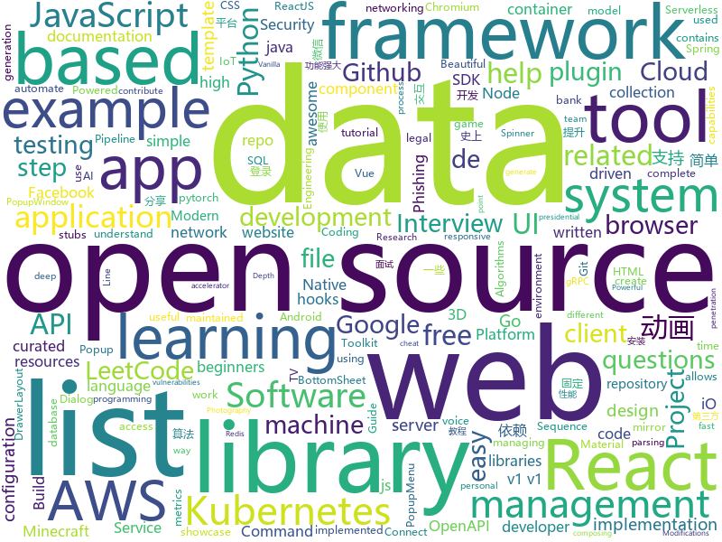

# 2020-06-25
See what the GitHub community is most excited about.

## python
+ [ALAE](https://github.com/podgorskiy/ALAE)(**39 stars today**): [CVPR2020] Adversarial Latent Autoencoders
+ [3d-photo-inpainting](https://github.com/vt-vl-lab/3d-photo-inpainting)(**39 stars today**): [CVPR 2020] 3D Photography using Context-aware Layered Depth Inpainting
+ [jax](https://github.com/google/jax)(**37 stars today**): Composable transformations of Python+NumPy programs: differentiate, vectorize, JIT to GPU/TPU, and more
+ [rasa](https://github.com/RasaHQ/rasa)(**20 stars today**): 💬Open source machine learning framework to automate text- and voice-based conversations: NLU, dialogue management, connect to Slack, Facebook, and more - Create chatbots and voice assistants
+ [algo](https://github.com/trailofbits/algo)(**32 stars today**): Set up a personal VPN in the cloud
+ [horovod](https://github.com/horovod/horovod)(**15 stars today**): Distributed training framework for TensorFlow, Keras, PyTorch, and Apache MXNet.
+ [pytorch_geometric](https://github.com/rusty1s/pytorch_geometric)(**16 stars today**): Geometric Deep Learning Extension Library for PyTorch
+ [nginx-ui](https://github.com/schenkd/nginx-ui)(**308 stars today**): Nginx UI allows you to access and modify the nginx configurations files without cli.
+ [awesome-python-login-model](https://github.com/Kr1s77/awesome-python-login-model)(**13 stars today**): 😮python模拟登陆一些大型网站，还有一些简单的爬虫，希望对你们有所帮助❤️，如果喜欢记得给个star哦🌟
+ [h4cker](https://github.com/The-Art-of-Hacking/h4cker)(**12 stars today**): This repository is primarily maintained by Omar Santos and includes thousands of resources related to ethical hacking / penetration testing, digital forensics and incident response (DFIR), vulnerability research, exploit development, reverse engineering, and more.
+ [PySyft](https://github.com/OpenMined/PySyft)(**10 stars today**): A library for encrypted, privacy preserving machine learning
+ [WireViz](https://github.com/formatc1702/WireViz)(**827 stars today**): Easily document cables and wiring harnesses
+ [OpenLidarPerceptron](https://github.com/open-mmlab/OpenLidarPerceptron)(**44 stars today**): OpenLidarPerceptron for LiDAR-based 3D Scene Perception (e.g. PCDet toolbox for 3D detection from point cloud).
+ [fairseq](https://github.com/pytorch/fairseq)(**17 stars today**): Facebook AI Research Sequence-to-Sequence Toolkit written in Python.
+ [Python](https://github.com/TheAlgorithms/Python)(**88 stars today**): All Algorithms implemented in Python
+ [azure-cli](https://github.com/Azure/azure-cli)(**5 stars today**): Azure Command-Line Interface
+ [insightface](https://github.com/deepinsight/insightface)(**6 stars today**): Face Analysis Project on MXNet
+ [patma](https://github.com/gvanrossum/patma)(**71 stars today**): Pattern Matching
+ [pipelines](https://github.com/kubeflow/pipelines)(**3 stars today**): Machine Learning Pipelines for Kubeflow
+ [routersploit](https://github.com/threat9/routersploit)(**4 stars today**): Exploitation Framework for Embedded Devices
+ [aws-cli](https://github.com/aws/aws-cli)(**10 stars today**): Universal Command Line Interface for Amazon Web Services
+ [wttr.in](https://github.com/chubin/wttr.in)(**24 stars today**): ⛅The right way to check the weather
+ [stylegan2-pytorch](https://github.com/lucidrains/stylegan2-pytorch)(**6 stars today**): Simplest working implementation of Stylegan2 in Pytorch
+ [LinkedBot](https://github.com/arielgs/LinkedBot)(**5 stars today**): Automatize conexões no linkedin
+ [Statistical-Learning-Method_Code](https://github.com/Dod-o/Statistical-Learning-Method_Code)(**26 stars today**): 手写实现李航《统计学习方法》书中全部算法

## java
+ [thingsboard](https://github.com/thingsboard/thingsboard)(**168 stars today**): Open-source IoT Platform - Device management, data collection, processing and visualization.
+ [CS-Notes](https://github.com/CyC2018/CS-Notes)(**103 stars today**): 📚技术面试必备基础知识、Leetcode、计算机操作系统、计算机网络、系统设计、Java、Python、C++
+ [tsunami-security-scanner](https://github.com/google/tsunami-security-scanner)(**138 stars today**): Tsunami is a general purpose network security scanner with an extensible plugin system for detecting high severity vulnerabilities with high confidence.
+ [jdk](https://github.com/openjdk/jdk)(**9 stars today**): Read-only mirror of https://hg.openjdk.java.net/jdk/jdk
+ [questdb](https://github.com/questdb/questdb)(**44 stars today**): An open source SQL database designed to process time-series data, faster
+ [capacitor](https://github.com/ionic-team/capacitor)(**14 stars today**): Build cross-platform Native Progressive Web Apps for iOS, Android, and the web⚡️
+ [SpringCloudLearning](https://github.com/forezp/SpringCloudLearning)(**81 stars today**): 《史上最简单的Spring Cloud教程源码》
+ [PdfTool](https://github.com/fengdongdongwsn/PdfTool)(**3 stars today**): pdf转word
+ [LeetCodeAnimation](https://github.com/MisterBooo/LeetCodeAnimation)(**92 stars today**): Demonstrate all the questions on LeetCode in the form of animation.（用动画的形式呈现解LeetCode题目的思路）
+ [JustAuth](https://github.com/justauth/JustAuth)(**23 stars today**): 💯史上最全的整合第三方登录的开源库。目前已支持Github、Gitee、微博、钉钉、百度、Coding、腾讯云开发者平台、OSChina、支付宝、QQ、微信、淘宝、Google、Facebook、抖音、领英、小米、微软、今日头条、Teambition、StackOverflow、Pinterest、人人、华为、企业微信、酷家乐、Gitlab、美团、饿了么和推特等第三方平台的授权登录。 Login, so easy!
+ [Nukkit](https://github.com/NukkitX/Nukkit)(**4 stars today**): Nuclear-Powered Server Software for Minecraft: Bedrock Edition.
+ [MinecraftForge](https://github.com/MinecraftForge/MinecraftForge)(**4 stars today**): Modifications to the Minecraft base files to assist in compatibility between mods.
+ [mlkit](https://github.com/googlesamples/mlkit)(**11 stars today**): A collection of sample apps to demonstrate how to use Google's ML Kit APIs on Android and iOS
+ [dubbo](https://github.com/apache/dubbo)(**12 stars today**): Apache Dubbo is a high-performance, java based, open source RPC framework.
+ [XPopup](https://github.com/li-xiaojun/XPopup)(**6 stars today**): 🔥XPopup2.0版本重磅来袭，2倍以上性能提升，带来可观的动画性能优化和交互细节的提升！！！功能强大，交互优雅，动画丝滑的通用弹窗！可以替代Dialog，PopupWindow，PopupMenu，BottomSheet，DrawerLayout，Spinner等组件，自带十几种效果良好的动画， 支持完全的UI和动画自定义！(Powerful and Beautiful Popup，can absolutely replace Dialog，PopupWindow，PopupMenu，BottomSheet，DrawerLayout，Spinner. With built-in animators , very easy to custom popup view.)
+ [aws-doc-sdk-examples](https://github.com/awsdocs/aws-doc-sdk-examples)(**6 stars today**): Welcome to the AWS Code Examples Repository. This repo contains code examples used in the AWS documentation, AWS SDK Developer Guides, and more. For more information, see the Readme.rst file below.
+ [vhr](https://github.com/lenve/vhr)(**37 stars today**): 微人事是一个前后端分离的人力资源管理系统，项目采用SpringBoot+Vue开发。
+ [tutorials](https://github.com/eugenp/tutorials)(**15 stars today**): Just Announced - "Learn Spring Security OAuth":
+ [openapi-generator](https://github.com/OpenAPITools/openapi-generator)(**10 stars today**): OpenAPI Generator allows generation of API client libraries (SDK generation), server stubs, documentation and configuration automatically given an OpenAPI Spec (v2, v3)
+ [keycloak](https://github.com/keycloak/keycloak)(**7 stars today**): Open Source Identity and Access Management For Modern Applications and Services
+ [flink](https://github.com/apache/flink)(**5 stars today**): Apache Flink
+ [PowerJob](https://github.com/KFCFans/PowerJob)(**5 stars today**): 新一代分布式任务调度与计算框架，支持CRON、API、固定频率、固定延迟等调度策略，提供工作流来编排任务解决依赖关系，使用简单，功能强大，文档齐全，欢迎各位接入使用！
+ [mcaselector](https://github.com/Querz/mcaselector)(**11 stars today**): A tool to select chunks from Minecraft worlds for deletion or export.
+ [react-native-camera](https://github.com/react-native-community/react-native-camera)(**3 stars today**): A Camera component for React Native. Also supports barcode scanning!
+ [xdm](https://github.com/subhra74/xdm)(**11 stars today**): Powerfull download accelerator and video downloader

## unknown
+ [fucking-algorithm](https://github.com/labuladong/fucking-algorithm)(**623 stars today**): 刷算法全靠套路，认准 labuladong 就够了！English version supported! Crack LeetCode, not only how, but also why.
+ [coding-interview-university](https://github.com/jwasham/coding-interview-university)(**325 stars today**): A complete computer science study plan to become a software engineer.
+ [Papers-Literature-ML-DL-RL-AI](https://github.com/tirthajyoti/Papers-Literature-ML-DL-RL-AI)(**31 stars today**): Highly cited and useful papers related to machine learning, deep learning, AI, game theory, reinforcement learning
+ [Privilege-Escalation](https://github.com/Ignitetechnologies/Privilege-Escalation)(**6 stars today**): This cheasheet is aimed at the CTF Players and Beginners to help them understand the fundamentals of Privilege Escalation with examples.
+ [awesome-interview-questions](https://github.com/MaximAbramchuck/awesome-interview-questions)(**17 stars today**): A curated awesome list of lists of interview questions. Feel free to contribute!🎓
+ [design-resources-for-developers](https://github.com/bradtraversy/design-resources-for-developers)(**41 stars today**): Curated list of design and UI resources from stock photos, web templates, CSS frameworks, UI libraries, tools and much more
+ [covid-19-data](https://github.com/nytimes/covid-19-data)(**10 stars today**): An ongoing repository of data on coronavirus cases and deaths in the U.S.
+ [Interview_Question_for_Beginner](https://github.com/JaeYeopHan/Interview_Question_for_Beginner)(**9 stars today**): 👦👧Technical-Interview guidelines written for those who started studying programming. I wish you all the best.👾
+ [Awesome-pytorch-list](https://github.com/bharathgs/Awesome-pytorch-list)(**23 stars today**): A comprehensive list of pytorch related content on github,such as different models,implementations,helper libraries,tutorials etc.
+ [TDTChannels](https://github.com/LaQuay/TDTChannels)(**2 stars today**): Listado de Canales de TV (TDT) en abierto, 100% legal, 100% gratuito // Spanish TV Channels, 100% legal, 100% free
+ [first-contributions](https://github.com/firstcontributions/first-contributions)(**16 stars today**): 🚀✨Help beginners to contribute to open source projects
+ [Enterprise-Scale](https://github.com/Azure/Enterprise-Scale)(**7 stars today**): Enterprise-Scale
+ [awesome-nodejs](https://github.com/sindresorhus/awesome-nodejs)(**17 stars today**): ⚡Delightful Node.js packages and resources
+ [OSCP-Preparation-Material](https://github.com/RihaMaheshwari/OSCP-Preparation-Material)(**7 stars today**): All in One OSCP Preparation Material
+ [bank_interview](https://github.com/sty945/bank_interview)(**9 stars today**): 🏦银行笔试面试经验分享及资料分享（help you pass the bank interview, and get a amazing bank offer!）
+ [guide](https://github.com/uber-go/guide)(**5 stars today**): The Uber Go Style Guide.
+ [precourse](https://github.com/NeuromatchAcademy/precourse)(**3 stars today**): A repo for the pre-course work at home exercises
+ [Cookbook](https://github.com/andkret/Cookbook)(**15 stars today**): The Data Engineering Cookbook
+ [developer-roadmap](https://github.com/kamranahmedse/developer-roadmap)(**95 stars today**): Roadmap to becoming a web developer in 2020
+ [architecture_decision_record](https://github.com/joelparkerhenderson/architecture_decision_record)(**6 stars today**): Architecture decision record (ADR) examples for software planning, IT leadership, and template documentation
+ [attacking-cloudgoat2](https://github.com/appsecco/attacking-cloudgoat2)(**4 stars today**): A step-by-step walkthrough of CloudGoat 2.0 scenarios.
+ [awesome-graphql](https://github.com/chentsulin/awesome-graphql)(**5 stars today**): Awesome list of GraphQL & Relay
+ [kubernetes-the-hard-way](https://github.com/kelseyhightower/kubernetes-the-hard-way)(**20 stars today**): Bootstrap Kubernetes the hard way on Google Cloud Platform. No scripts.
+ [awesome-tailwindcss](https://github.com/aniftyco/awesome-tailwindcss)(**11 stars today**): A curated list of awesome things related to Tailwind CSS
+ [chromium](https://github.com/chromium/chromium)(**15 stars today**): The official GitHub mirror of the Chromium source

## javascript
+ [bookshelf](https://github.com/kentcdodds/bookshelf)(**6 stars today**): Build a ReactJS App workshop
+ [awesome-selfhosted](https://github.com/awesome-selfhosted/awesome-selfhosted)(**48 stars today**): A list of Free Software network services and web applications which can be hosted locally. Selfhosting is the process of hosting and managing applications instead of renting from Software-as-a-Service providers
+ [material-ui](https://github.com/mui-org/material-ui)(**31 stars today**): React components for faster and easier web development. Build your own design system, or start with Material Design.
+ [sequelize](https://github.com/sequelize/sequelize)(**11 stars today**): An easy-to-use multi SQL dialect ORM for Node.js
+ [Script](https://github.com/NobyDa/Script)(**7 stars today**): This project is based on the scripting capabilities of two excellent iOS proxy tools, Quantumult X or Surge.
+ [kubernetes-basicLearning](https://github.com/knrt10/kubernetes-basicLearning)(**36 stars today**): Understand kubernetes step by step. A simple repo for beginners🔥
+ [gatsby](https://github.com/gatsbyjs/gatsby)(**29 stars today**): Build blazing fast, modern apps and websites with React
+ [react-query](https://github.com/tannerlinsley/react-query)(**219 stars today**): ⚛️Hooks for fetching, caching and updating asynchronous data in React
+ [playwright](https://github.com/microsoft/playwright)(**36 stars today**): Node library to automate Chromium, Firefox and WebKit with a single API
+ [octotree](https://github.com/ovity/octotree)(**7 stars today**): GitHub on steroids
+ [beautiful-react-hooks](https://github.com/beautifulinteractions/beautiful-react-hooks)(**87 stars today**): 🔥A collection of beautiful and (hopefully) useful React hooks to speed-up your components and hooks development🔥
+ [next.js](https://github.com/vercel/next.js)(**45 stars today**): The React Framework
+ [Recoil](https://github.com/facebookexperimental/Recoil)(**50 stars today**): Recoil is an experimental state management library for React apps. It provides several capabilities that are difficult to achieve with React alone, while being compatible with the newest features of React.
+ [redash](https://github.com/getredash/redash)(**60 stars today**): Make Your Company Data Driven. Connect to any data source, easily visualize, dashboard and share your data.
+ [responsively-app](https://github.com/manojVivek/responsively-app)(**87 stars today**): A modified browser that helps in responsive web development.
+ [javascript-algorithms](https://github.com/trekhleb/javascript-algorithms)(**60 stars today**): 📝Algorithms and data structures implemented in JavaScript with explanations and links to further readings
+ [mapbox-gl-js](https://github.com/mapbox/mapbox-gl-js)(**4 stars today**): Interactive, thoroughly customizable maps in the browser, powered by vector tiles and WebGL
+ [alpine](https://github.com/alpinejs/alpine)(**48 stars today**): A rugged, minimal framework for composing JavaScript behavior in your markup.
+ [microsoft-authentication-library-for-js](https://github.com/AzureAD/microsoft-authentication-library-for-js)(**4 stars today**): Microsoft Authentication Library (MSAL) for JS
+ [kubernetes-external-secrets](https://github.com/godaddy/kubernetes-external-secrets)(**3 stars today**): Integrate external secret management systems with Kubernetes
+ [cypress](https://github.com/cypress-io/cypress)(**27 stars today**): Fast, easy and reliable testing for anything that runs in a browser.
+ [reactjs-interview-questions](https://github.com/sudheerj/reactjs-interview-questions)(**16 stars today**): List of top 500 ReactJS Interview Questions & Answers....Coding exercise questions are coming soon!!
+ [serverless](https://github.com/serverless/serverless)(**17 stars today**): ⚡Serverless Framework – Build web, mobile and IoT applications with serverless architectures using AWS Lambda, Azure Functions, Google CloudFunctions & more! –
+ [axios](https://github.com/axios/axios)(**33 stars today**): Promise based HTTP client for the browser and node.js
+ [hiring-without-whiteboards](https://github.com/poteto/hiring-without-whiteboards)(**11 stars today**): ⭐️Companies that don't have a broken hiring process

## html
+ [ui_components](https://github.com/bradtraversy/ui_components)(**47 stars today**): Collection of HTML & CSS UI components
+ [us-potus-model](https://github.com/TheEconomist/us-potus-model)(**19 stars today**): Code for a dynamic multilevel Bayesian model to predict US presidential elections. Written in R and Stan.
+ [machine-learning-systems-design](https://github.com/chiphuyen/machine-learning-systems-design)(**14 stars today**): A booklet on machine learning systems design with exercises
+ [responsive-html-email-template](https://github.com/leemunroe/responsive-html-email-template)(**6 stars today**): A free simple responsive HTML email template
+ [JavaScript30](https://github.com/wesbos/JavaScript30)(**10 stars today**): 30 Day Vanilla JS Challenge
+ [electron-api-demos](https://github.com/electron/electron-api-demos)(**8 stars today**): Explore the Electron APIs
+ [en.javascript.info](https://github.com/javascript-tutorial/en.javascript.info)(**19 stars today**): Modern JavaScript Tutorial
+ [blackeye](https://github.com/thelinuxchoice/blackeye)(**4 stars today**): The most complete Phishing Tool, with 32 templates +1 customizable
+ [Graphics](https://github.com/Unity-Technologies/Graphics)(**1 stars today**): Unity Graphics - Including Scriptable Render Pipeline
+ [zh.javascript.info](https://github.com/javascript-tutorial/zh.javascript.info)(**27 stars today**): 现代 JavaScript 教程（The Modern JavaScript Tutorial）
+ [training-kit](https://github.com/github/training-kit)(**5 stars today**): Open source cheat sheets for Git and GitHub
+ [FakeLocation](https://github.com/Lerist/FakeLocation)(**7 stars today**): Fake Location
+ [v-calendar](https://github.com/nathanreyes/v-calendar)(**3 stars today**): A lightweight, dependency-free plugin for building attributed calendars in Vue.js
+ [personal-website](https://github.com/github/personal-website)(**7 stars today**): Code that'll help you kickstart a personal website that showcases your work as a software developer.
+ [cypress-example-kitchensink](https://github.com/cypress-io/cypress-example-kitchensink)(**1 stars today**): This is an example app used to showcase Cypress.io testing.
+ [ASVS](https://github.com/OWASP/ASVS)(**0 stars today**): Application Security Verification Standard
+ [shellphish](https://github.com/thelinuxchoice/shellphish)(**2 stars today**): 19 Social Media Phishing Pages #phishing #shellphish #phish
+ [kubernetes-failure-stories](https://github.com/hjacobs/kubernetes-failure-stories)(**8 stars today**): Compilation of public failure/horror stories related to Kubernetes
+ [swagger-codegen](https://github.com/swagger-api/swagger-codegen)(**6 stars today**): swagger-codegen contains a template-driven engine to generate documentation, API clients and server stubs in different languages by parsing your OpenAPI / Swagger definition.
+ [xiaojiejie](https://github.com/JMWpower/xiaojiejie)(**3 stars today**): 
+ [hyperblog](https://github.com/freddier/hyperblog)(**7 stars today**): Un blog increíble para el curso de Git y Github de Platzi
+ [calico](https://github.com/projectcalico/calico)(**6 stars today**): Cloud native networking and network security
+ [webring](https://github.com/XXIIVV/webring)(**3 stars today**): Make yourself a website
+ [hospitalmanagement](https://github.com/sumitkumar1503/hospitalmanagement)(**6 stars today**): Hospital Management System || Python Django
+ [grpc.io](https://github.com/grpc/grpc.io)(**5 stars today**): Repository for the gRPC website and documentation

## go
+ [OpenDiablo2](https://github.com/OpenDiablo2/OpenDiablo2)(**887 stars today**): An open source re-implementation of Diablo 2
+ [esbuild](https://github.com/evanw/esbuild)(**117 stars today**): An extremely fast JavaScript bundler and minifier
+ [terraform-provider-aws](https://github.com/terraform-providers/terraform-provider-aws)(**6 stars today**): Terraform AWS provider
+ [moby](https://github.com/moby/moby)(**17 stars today**): Moby Project - a collaborative project for the container ecosystem to assemble container-based systems
+ [envconfig](https://github.com/kelseyhightower/envconfig)(**9 stars today**): Golang library for managing configuration data from environment variables
+ [plugins](https://github.com/containernetworking/plugins)(**1 stars today**): Some reference and example networking plugins, maintained by the CNI team.
+ [influxdb](https://github.com/influxdata/influxdb)(**5 stars today**): Scalable datastore for metrics, events, and real-time analytics
+ [flux](https://github.com/fluxcd/flux)(**7 stars today**): The GitOps Kubernetes operator
+ [testify](https://github.com/stretchr/testify)(**13 stars today**): A toolkit with common assertions and mocks that plays nicely with the standard library
+ [aws-sdk-go](https://github.com/aws/aws-sdk-go)(**2 stars today**): AWS SDK for the Go programming language.
+ [awsls](https://github.com/jckuester/awsls)(**25 stars today**): A list command for AWS resources
+ [terraform](https://github.com/hashicorp/terraform)(**15 stars today**): Terraform enables you to safely and predictably create, change, and improve infrastructure. It is an open source tool that codifies APIs into declarative configuration files that can be shared amongst team members, treated as code, edited, reviewed, and versioned.
+ [ebiten](https://github.com/hajimehoshi/ebiten)(**7 stars today**): A dead simple 2D game library for Go
+ [redis](https://github.com/go-redis/redis)(**3 stars today**): Type-safe Redis client for Golang
+ [grpc-go](https://github.com/grpc/grpc-go)(**11 stars today**): The Go language implementation of gRPC. HTTP/2 based RPC
+ [alertmanager](https://github.com/prometheus/alertmanager)(**5 stars today**): Prometheus Alertmanager
+ [telegraf](https://github.com/influxdata/telegraf)(**6 stars today**): The plugin-driven server agent for collecting & reporting metrics.
+ [cloud-nuke](https://github.com/gruntwork-io/cloud-nuke)(**4 stars today**): A tool for cleaning up your cloud accounts by nuking (deleting) all resources within it
+ [charts](https://github.com/helm/charts)(**14 stars today**): Curated applications for Kubernetes
+ [sealos](https://github.com/fanux/sealos)(**5 stars today**): 只能用丝滑一词形容的kubernetes高可用安装（kubernetes install）工具，一条命令，离线安装，包含所有依赖，内核负载不依赖haproxy keepalived,纯golang开发,99年证书,支持v1.16 v1.15 v1.17 v1.18!
+ [opentelemetry-specification](https://github.com/open-telemetry/opentelemetry-specification)(**3 stars today**): Specifications for OpenTelemetry
+ [ginkgo](https://github.com/onsi/ginkgo)(**4 stars today**): BDD Testing Framework for Go
+ [runc](https://github.com/opencontainers/runc)(**1 stars today**): CLI tool for spawning and running containers according to the OCI specification
+ [vitess](https://github.com/vitessio/vitess)(**38 stars today**): Vitess is a database clustering system for horizontal scaling of MySQL.
+ [go-envconfig](https://github.com/sethvargo/go-envconfig)(**68 stars today**): A Go library for parsing struct tags from environment variables.

## WordCloud

