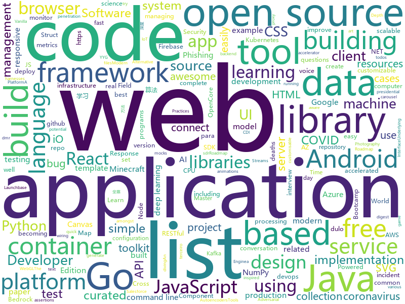

# 2020-06-26
See what the GitHub community is most excited about.

## python
+ [WireViz](https://github.com/formatc1702/WireViz)(**285 stars today**): Easily document cables and wiring harnesses
+ [rasa](https://github.com/RasaHQ/rasa)(**48 stars today**): 💬Open source machine learning framework to automate text- and voice-based conversations: NLU, dialogue management, connect to Slack, Facebook, and more - Create chatbots and voice assistants
+ [data-science-ipython-notebooks](https://github.com/donnemartin/data-science-ipython-notebooks)(**19 stars today**): Data science Python notebooks: Deep learning (TensorFlow, Theano, Caffe, Keras), scikit-learn, Kaggle, big data (Spark, Hadoop MapReduce, HDFS), matplotlib, pandas, NumPy, SciPy, Python essentials, AWS, and various command lines.
+ [ALAE](https://github.com/podgorskiy/ALAE)(**44 stars today**): [CVPR2020] Adversarial Latent Autoencoders
+ [macOS-Simple-KVM](https://github.com/foxlet/macOS-Simple-KVM)(**98 stars today**): Tools to set up a quick macOS VM in QEMU, accelerated by KVM.
+ [forecasting](https://github.com/microsoft/forecasting)(**5 stars today**): Time Series Forecasting Best Practices & Examples
+ [jax](https://github.com/google/jax)(**37 stars today**): Composable transformations of Python+NumPy programs: differentiate, vectorize, JIT to GPU/TPU, and more
+ [siren](https://github.com/vsitzmann/siren)(**89 stars today**): Official implementation of "Implicit Neural Representations with Periodic Activation Functions"
+ [azure-cli](https://github.com/Azure/azure-cli)(**6 stars today**): Azure Command-Line Interface
+ [yyg-seir-simulator](https://github.com/youyanggu/yyg-seir-simulator)(**5 stars today**): Underlying SEIR simulator for the YYG / covid19-projections.com model
+ [spacy-streamlit](https://github.com/explosion/spacy-streamlit)(**23 stars today**): 👑spaCy building blocks and visualizers for Streamlit apps
+ [patma](https://github.com/gvanrossum/patma)(**47 stars today**): Pattern Matching
+ [Awesome-Bugbounty-Writeups](https://github.com/devanshbatham/Awesome-Bugbounty-Writeups)(**11 stars today**): A curated list of bugbounty writeups (Bug type wise) , inspired from https://github.com/ngalongc/bug-bounty-reference
+ [3d-photo-inpainting](https://github.com/vt-vl-lab/3d-photo-inpainting)(**39 stars today**): [CVPR 2020] 3D Photography using Context-aware Layered Depth Inpainting
+ [fairlearn](https://github.com/fairlearn/fairlearn)(**10 stars today**): A Python package to assess and improve fairness of machine learning models.
+ [flair](https://github.com/flairNLP/flair)(**15 stars today**): A very simple framework for state-of-the-art Natural Language Processing (NLP)
+ [botframework-sdk](https://github.com/microsoft/botframework-sdk)(**2 stars today**): Bot Framework provides the most comprehensive experience for building conversation applications.
+ [covid-19-data](https://github.com/owid/covid-19-data)(**4 stars today**): Data on COVID-19 (coronavirus) confirmed cases, deaths, and tests • All countries • Updated daily by Our World in Data
+ [airflow](https://github.com/apache/airflow)(**13 stars today**): Apache Airflow - A platform to programmatically author, schedule, and monitor workflows
+ [wttr.in](https://github.com/chubin/wttr.in)(**18 stars today**): ⛅The right way to check the weather
+ [Statistical-Learning-Method_Code](https://github.com/Dod-o/Statistical-Learning-Method_Code)(**26 stars today**): 手写实现李航《统计学习方法》书中全部算法
+ [cupy](https://github.com/cupy/cupy)(**4 stars today**): NumPy-like API accelerated with CUDA
+ [erpnext](https://github.com/frappe/erpnext)(**3 stars today**): Open Source Alternative to SAP
+ [h4cker](https://github.com/The-Art-of-Hacking/h4cker)(**12 stars today**): This repository is primarily maintained by Omar Santos and includes thousands of resources related to ethical hacking / penetration testing, digital forensics and incident response (DFIR), vulnerability research, exploit development, reverse engineering, and more.
+ [MONAI](https://github.com/Project-MONAI/MONAI)(**1 stars today**): AI Toolkit for Healthcare Imaging

## java
+ [xdm](https://github.com/subhra74/xdm)(**12 stars today**): Powerfull download accelerator and video downloader
+ [Mindustry](https://github.com/Anuken/Mindustry)(**24 stars today**): A sandbox tower defense game
+ [dropwizard](https://github.com/dropwizard/dropwizard)(**4 stars today**): A damn simple library for building production-ready RESTful web services.
+ [tutorials](https://github.com/eugenp/tutorials)(**19 stars today**): Just Announced - "Learn Spring Security OAuth":
+ [thingsboard](https://github.com/thingsboard/thingsboard)(**150 stars today**): Open-source IoT Platform - Device management, data collection, processing and visualization.
+ [mlkit](https://github.com/googlesamples/mlkit)(**10 stars today**): A collection of sample apps to demonstrate how to use Google's ML Kit APIs on Android and iOS
+ [quarkus](https://github.com/quarkusio/quarkus)(**11 stars today**): Quarkus: Supersonic Subatomic Java.
+ [jdk](https://github.com/openjdk/jdk)(**58 stars today**): Read-only mirror of https://hg.openjdk.java.net/jdk/jdk
+ [dp3t-app-android-ch](https://github.com/DP-3T/dp3t-app-android-ch)(**21 stars today**): This is a COVID-19 tracing client using the DP3T Android SDK.
+ [Geyser](https://github.com/GeyserMC/Geyser)(**4 stars today**): A bridge/proxy allowing you to connect to Minecraft: Java Edition servers with Minecraft: Bedrock edition.
+ [rest-assured](https://github.com/rest-assured/rest-assured)(**2 stars today**): Java DSL for easy testing of REST services
+ [moshi](https://github.com/square/moshi)(**5 stars today**): A modern JSON library for Kotlin and Java.
+ [FrameworkBenchmarks](https://github.com/TechEmpower/FrameworkBenchmarks)(**7 stars today**): Source for the TechEmpower Framework Benchmarks project
+ [zxing](https://github.com/zxing/zxing)(**8 stars today**): ZXing ("Zebra Crossing") barcode scanning library for Java, Android
+ [BedrockConnect](https://github.com/Pugmatt/BedrockConnect)(**4 stars today**): Join any server IP on Xbox One, Nintendo Switch, and PS4
+ [kafdrop](https://github.com/obsidiandynamics/kafdrop)(**11 stars today**): Kafka Web UI
+ [kafka-streams-examples](https://github.com/confluentinc/kafka-streams-examples)(**3 stars today**): Demo applications and code examples for Apache Kafka's Streams API.
+ [jib](https://github.com/GoogleContainerTools/jib)(**5 stars today**): 🏗Build container images for your Java applications.
+ [graal](https://github.com/oracle/graal)(**6 stars today**): GraalVM: Run Programs Faster Anywhere🚀
+ [micrometer](https://github.com/micrometer-metrics/micrometer)(**3 stars today**): An application metrics facade for the most popular monitoring tools. Think SLF4J, but for metrics.
+ [gpstest](https://github.com/barbeau/gpstest)(**3 stars today**): The #1 open-source Android GNSS/GPS test program
+ [elasticsearch](https://github.com/elastic/elasticsearch)(**18 stars today**): Open Source, Distributed, RESTful Search Engine
+ [bazel](https://github.com/bazelbuild/bazel)(**9 stars today**): a fast, scalable, multi-language and extensible build system
+ [Nukkit](https://github.com/NukkitX/Nukkit)(**6 stars today**): Nuclear-Powered Server Software for Minecraft: Bedrock Edition.
+ [helidon](https://github.com/oracle/helidon)(**10 stars today**): Java libraries for writing microservices

## unknown
+ [COVID-19](https://github.com/CSSEGISandData/COVID-19)(**19 stars today**): Novel Coronavirus (COVID-19) Cases, provided by JHU CSSE
+ [fucking-algorithm](https://github.com/labuladong/fucking-algorithm)(**334 stars today**): 刷算法全靠套路，认准 labuladong 就够了！English version supported! Crack LeetCode, not only how, but also why.
+ [awesome-interview-questions](https://github.com/MaximAbramchuck/awesome-interview-questions)(**35 stars today**): A curated awesome list of lists of interview questions. Feel free to contribute!🎓
+ [Papers-Literature-ML-DL-RL-AI](https://github.com/tirthajyoti/Papers-Literature-ML-DL-RL-AI)(**53 stars today**): Highly cited and useful papers related to machine learning, deep learning, AI, game theory, reinforcement learning
+ [papers-with-annotations](https://github.com/Machine-Learning-Tokyo/papers-with-annotations)(**63 stars today**): Research papers with annotations, illustrations and explanations
+ [design-resources-for-developers](https://github.com/bradtraversy/design-resources-for-developers)(**66 stars today**): Curated list of design and UI resources from stock photos, web templates, CSS frameworks, UI libraries, tools and much more
+ [readings](https://github.com/erikgrinaker/readings)(**29 stars today**): Interesting readings and talks on computer science
+ [OpenCore-Factory](https://github.com/williambj1/OpenCore-Factory)(**11 stars today**): Automated OpenCore build, triggers every 8 hours. 自动化 OpenCore 编译，每 8 小时刷新一次。
+ [AspNetCore-Developer-Roadmap](https://github.com/MoienTajik/AspNetCore-Developer-Roadmap)(**7 stars today**): Roadmap to becoming an ASP.NET Core developer in 2019
+ [Production-Level-Deep-Learning](https://github.com/alirezadir/Production-Level-Deep-Learning)(**20 stars today**): A guideline for building practical production-level deep learning systems to be deployed in real world applications.
+ [bootcamp-gostack-desafios](https://github.com/Rocketseat/bootcamp-gostack-desafios)(**6 stars today**): Repositório contendo todos os desafios dos módulos do Bootcamp Gostack
+ [1](https://github.com/6mao6/1)(**4 stars today**): 这里是直播平台永久回家页，有最新app下载地址。
+ [covid-19-data](https://github.com/nytimes/covid-19-data)(**15 stars today**): An ongoing repository of data on coronavirus cases and deaths in the U.S.
+ [AZ-900T0x-MicrosoftAzureFundamentals](https://github.com/MicrosoftLearning/AZ-900T0x-MicrosoftAzureFundamentals)(**5 stars today**): Microsoft Azure Fundamentals - AZ-900T00 and AZ-900T01
+ [vietnam](https://github.com/awesome-jobs/vietnam)(**2 stars today**): The best place to find devs in Vietnam!
+ [vagas](https://github.com/backend-br/vagas)(**5 stars today**): ✌️Espaço para divulgação de vagas para backenders
+ [awesome-actions](https://github.com/sdras/awesome-actions)(**22 stars today**): A curated list of awesome actions to use on GitHub
+ [openear](https://github.com/moneriomaa/openear)(**4 stars today**): windows based project that try to decoding protocols (tetra,dmr, ...) using rtl-sdr
+ [developer-roadmap](https://github.com/kamranahmedse/developer-roadmap)(**89 stars today**): Roadmap to becoming a web developer in 2020
+ [awesome-graphql](https://github.com/chentsulin/awesome-graphql)(**8 stars today**): Awesome list of GraphQL & Relay
+ [awesome-production-machine-learning](https://github.com/EthicalML/awesome-production-machine-learning)(**9 stars today**): A curated list of awesome open source libraries to deploy, monitor, version and scale your machine learning
+ [SharpCollection](https://github.com/Flangvik/SharpCollection)(**36 stars today**): Nightly builds of common C# offensive tools, fresh from their respective master branches built and released in a CDI fashion using Azure DevOps release pipelines.
+ [100-days-of-code](https://github.com/kallaway/100-days-of-code)(**3 stars today**): Fork this template for the 100 days journal - to keep yourself accountable (multiple languages available)
+ [coding-interview-university](https://github.com/jwasham/coding-interview-university)(**254 stars today**): A complete computer science study plan to become a software engineer.
+ [system_design](https://github.com/shashank88/system_design)(**11 stars today**): Preparation links and resources for system design questions

## javascript
+ [awesome-selfhosted](https://github.com/awesome-selfhosted/awesome-selfhosted)(**86 stars today**): A list of Free Software network services and web applications which can be hosted locally. Selfhosting is the process of hosting and managing applications instead of renting from Software-as-a-Service providers
+ [elevator.js](https://github.com/tholman/elevator.js)(**90 stars today**): Finally, a "back to top" button that behaves like a real elevator.
+ [generator-jhipster](https://github.com/jhipster/generator-jhipster)(**10 stars today**): JHipster is a development platform to quickly generate, develop, & deploy modern web applications & microservice architectures.
+ [strapi](https://github.com/strapi/strapi)(**43 stars today**): 🚀Open source Node.js Headless CMS to easily build customisable APIs
+ [material-table](https://github.com/mbrn/material-table)(**7 stars today**): Datatable for React based on material-ui's table with additional features
+ [bypass-paywalls-chrome](https://github.com/iamadamdev/bypass-paywalls-chrome)(**43 stars today**): Bypass Paywalls web browser extension for Chrome and Firefox.
+ [covid19india-react](https://github.com/covid19india/covid19india-react)(**10 stars today**): Tracking the impact of COVID-19 in India
+ [baseweb](https://github.com/uber/baseweb)(**16 stars today**): A React Component library implementing the Base design language
+ [fabric.js](https://github.com/fabricjs/fabric.js)(**8 stars today**): Javascript Canvas Library, SVG-to-Canvas (& canvas-to-SVG) Parser
+ [redash](https://github.com/getredash/redash)(**26 stars today**): Make Your Company Data Driven. Connect to any data source, easily visualize, dashboard and share your data.
+ [axios](https://github.com/axios/axios)(**30 stars today**): Promise based HTTP client for the browser and node.js
+ [OpenAPI-Specification](https://github.com/OAI/OpenAPI-Specification)(**11 stars today**): The OpenAPI Specification Repository
+ [mapbox-gl-js](https://github.com/mapbox/mapbox-gl-js)(**4 stars today**): Interactive, thoroughly customizable maps in the browser, powered by vector tiles and WebGL
+ [hapi](https://github.com/hapijs/hapi)(**11 stars today**): The Simple, Secure Framework Developers Trust
+ [Indian-Paper-Currency-Prediction](https://github.com/rowhitswami/Indian-Paper-Currency-Prediction)(**17 stars today**): Source code of Indian Paper Currency Prediction🔥
+ [bookshelf](https://github.com/kentcdodds/bookshelf)(**17 stars today**): Build a ReactJS App workshop
+ [lwc-recipes](https://github.com/trailheadapps/lwc-recipes)(**7 stars today**): A collection of easy-to-digest code examples for Lightning Web Components on Salesforce Platform
+ [carbon](https://github.com/carbon-design-system/carbon)(**6 stars today**): A design system built by IBM
+ [responsively-app](https://github.com/manojVivek/responsively-app)(**67 stars today**): A modified browser that helps in responsive web development.
+ [react-native-firebase](https://github.com/invertase/react-native-firebase)(**1 stars today**): 🔥A well-tested feature-rich modular Firebase implementation for React Native. Supports both iOS & Android platforms for all Firebase services.
+ [aws-serverless-workshops](https://github.com/aws-samples/aws-serverless-workshops)(**3 stars today**): Code and walkthrough labs to set up serverless applications for Wild Rydes workshops
+ [slick](https://github.com/kenwheeler/slick)(**7 stars today**): the last carousel you'll ever need
+ [swagger-editor](https://github.com/swagger-api/swagger-editor)(**3 stars today**): Swagger Editor
+ [next.js](https://github.com/vercel/next.js)(**52 stars today**): The React Framework
+ [fullstack-course4](https://github.com/jhu-ep-coursera/fullstack-course4)(**19 stars today**): Example code for HTML, CSS, and Javascript for Web Developers Coursera Course

## html
+ [ui_components](https://github.com/bradtraversy/ui_components)(**75 stars today**): Collection of HTML & CSS UI components
+ [cypress-example-kitchensink](https://github.com/cypress-io/cypress-example-kitchensink)(**4 stars today**): This is an example app used to showcase Cypress.io testing.
+ [us-potus-model](https://github.com/TheEconomist/us-potus-model)(**32 stars today**): Code for a dynamic multilevel Bayesian model to predict US presidential elections. Written in R and Stan.
+ [electron-api-demos](https://github.com/electron/electron-api-demos)(**3 stars today**): Explore the Electron APIs
+ [web-moderno](https://github.com/cod3rcursos/web-moderno)(**6 stars today**): 
+ [JavaScript30](https://github.com/wesbos/JavaScript30)(**10 stars today**): 30 Day Vanilla JS Challenge
+ [phpstan](https://github.com/phpstan/phpstan)(**7 stars today**): PHP Static Analysis Tool - discover bugs in your code without running it!
+ [learning-area](https://github.com/mdn/learning-area)(**4 stars today**): Github repo for the MDN Learning Area.
+ [responsive-html-email-template](https://github.com/leemunroe/responsive-html-email-template)(**7 stars today**): A free simple responsive HTML email template
+ [blackeye](https://github.com/thelinuxchoice/blackeye)(**10 stars today**): The most complete Phishing Tool, with 32 templates +1 customizable
+ [zh.javascript.info](https://github.com/javascript-tutorial/zh.javascript.info)(**29 stars today**): 现代 JavaScript 教程（The Modern JavaScript Tutorial）
+ [shellphish](https://github.com/thelinuxchoice/shellphish)(**8 stars today**): 19 Social Media Phishing Pages #phishing #shellphish #phish
+ [bootcamp-launchbase-desafios-03](https://github.com/Rocketseat/bootcamp-launchbase-desafios-03)(**0 stars today**): Desafios do terceiro módulo do Bootcamp Launchbase🚀👨🏻‍🚀
+ [free-for-dev](https://github.com/ripienaar/free-for-dev)(**25 stars today**): A list of SaaS, PaaS and IaaS offerings that have free tiers of interest to devops and infradev
+ [csswg-drafts](https://github.com/w3c/csswg-drafts)(**2 stars today**): CSS Working Group Editor Drafts
+ [SVG-Loaders](https://github.com/SamHerbert/SVG-Loaders)(**5 stars today**): Loading icons and small animations built with pure SVG.
+ [website](https://github.com/kubernetes/website)(**9 stars today**): Kubernetes website and documentation repo:
+ [Web-Development](https://github.com/Internshala-Online-Trainings/Web-Development)(**1 stars today**): 
+ [Front-end-Developer-Interview-Questions](https://github.com/h5bp/Front-end-Developer-Interview-Questions)(**8 stars today**): A list of helpful front-end related questions you can use to interview potential candidates, test yourself or completely ignore.
+ [TheHive](https://github.com/TheHive-Project/TheHive)(**5 stars today**): TheHive: a Scalable, Open Source and Free Security Incident Response Platform
+ [wpt](https://github.com/web-platform-tests/wpt)(**3 stars today**): Test suites for Web platform specs — including WHATWG, W3C, and others
+ [fem-layout](https://github.com/jen4web/fem-layout)(**1 stars today**): Frontend Masters: CSS Grids and Flexbox in Responsive Web Design workshop files
+ [en.javascript.info](https://github.com/javascript-tutorial/en.javascript.info)(**14 stars today**): Modern JavaScript Tutorial
+ [styleguide](https://github.com/google/styleguide)(**12 stars today**): Style guides for Google-originated open-source projects
+ [deeplearning_ai_books](https://github.com/fengdu78/deeplearning_ai_books)(**10 stars today**): deeplearning.ai（吴恩达老师的深度学习课程笔记及资源）

## go
+ [terraform-provider-aws](https://github.com/terraform-providers/terraform-provider-aws)(**11 stars today**): Terraform AWS provider
+ [fgprof](https://github.com/felixge/fgprof)(**212 stars today**): 🚀fgprof is a sampling Go profiler that allows you to analyze On-CPU as well as Off-CPU (e.g. I/O) time together.
+ [OpenDiablo2](https://github.com/OpenDiablo2/OpenDiablo2)(**303 stars today**): An open source re-implementation of Diablo 2
+ [terraform](https://github.com/hashicorp/terraform)(**15 stars today**): Terraform enables you to safely and predictably create, change, and improve infrastructure. It is an open source tool that codifies APIs into declarative configuration files that can be shared amongst team members, treated as code, edited, reviewed, and versioned.
+ [kubernetes](https://github.com/kubernetes/kubernetes)(**40 stars today**): Production-Grade Container Scheduling and Management
+ [validator](https://github.com/go-playground/validator)(**8 stars today**): 💯Go Struct and Field validation, including Cross Field, Cross Struct, Map, Slice and Array diving
+ [esbuild](https://github.com/evanw/esbuild)(**118 stars today**): An extremely fast JavaScript bundler and minifier
+ [testify](https://github.com/stretchr/testify)(**13 stars today**): A toolkit with common assertions and mocks that plays nicely with the standard library
+ [aws-sdk-go](https://github.com/aws/aws-sdk-go)(**3 stars today**): AWS SDK for the Go programming language.
+ [differential-privacy](https://github.com/google/differential-privacy)(**5 stars today**): Google's differential privacy library.
+ [Burrow](https://github.com/linkedin/Burrow)(**3 stars today**): Kafka Consumer Lag Checking
+ [vault](https://github.com/hashicorp/vault)(**10 stars today**): A tool for secrets management, encryption as a service, and privileged access management
+ [eksctl](https://github.com/weaveworks/eksctl)(**2 stars today**): The official CLI for Amazon EKS
+ [envconfig](https://github.com/kelseyhightower/envconfig)(**12 stars today**): Golang library for managing configuration data from environment variables
+ [vitess](https://github.com/vitessio/vitess)(**52 stars today**): Vitess is a database clustering system for horizontal scaling of MySQL.
+ [pgx](https://github.com/jackc/pgx)(**0 stars today**): PostgreSQL driver and toolkit for Go
+ [google-cloud-go](https://github.com/googleapis/google-cloud-go)(**2 stars today**): Google Cloud Client Libraries for Go.
+ [moby](https://github.com/moby/moby)(**14 stars today**): Moby Project - a collaborative project for the container ecosystem to assemble container-based systems
+ [chi](https://github.com/go-chi/chi)(**12 stars today**): lightweight, idiomatic and composable router for building Go HTTP services
+ [skaffold](https://github.com/GoogleContainerTools/skaffold)(**2 stars today**): Easy and Repeatable Kubernetes Development
+ [charts](https://github.com/helm/charts)(**7 stars today**): Curated applications for Kubernetes
+ [chat](https://github.com/tinode/chat)(**4 stars today**): Instant messaging server; backend in Go; iOS, Android, web, command line clients; chatbots
+ [singularity](https://github.com/hpcng/singularity)(**3 stars today**): Singularity: Application containers for Linux
+ [terratest](https://github.com/gruntwork-io/terratest)(**5 stars today**): Terratest is a Go library that makes it easier to write automated tests for your infrastructure code.
+ [grpc-go](https://github.com/grpc/grpc-go)(**9 stars today**): The Go language implementation of gRPC. HTTP/2 based RPC

## WordCloud

