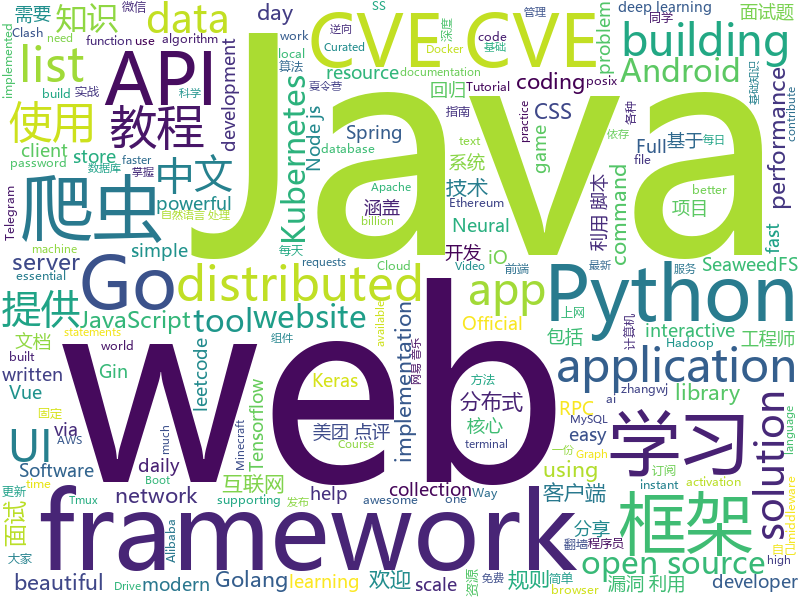

# 2020-06-29
See what the GitHub community is most excited about.

## python
+ [avatarify](https://github.com/alievk/avatarify)(**169 stars today**): Avatars for Zoom, Skype and other video-conferencing apps.
+ [spektral](https://github.com/danielegrattarola/spektral)(**115 stars today**): Graph Neural Networks with Keras and Tensorflow 2.
+ [Bug-Bounty-Toolz](https://github.com/m4ll0k/Bug-Bounty-Toolz)(**105 stars today**): BBT - Bug Bounty Tools
+ [TextAttack](https://github.com/QData/TextAttack)(**60 stars today**): TextAttack🐙is a Python framework for adversarial attacks, data augmentation, and model training in NLP
+ [data-science-ipython-notebooks](https://github.com/donnemartin/data-science-ipython-notebooks)(**197 stars today**): Data science Python notebooks: Deep learning (TensorFlow, Theano, Caffe, Keras), scikit-learn, Kaggle, big data (Spark, Hadoop MapReduce, HDFS), matplotlib, pandas, NumPy, SciPy, Python essentials, AWS, and various command lines.
+ [exphub](https://github.com/zhzyker/exphub)(**27 stars today**): Exphub[漏洞利用脚本库] 包括Webloigc、Struts2、Tomcat、Nexus、Solr、Jboss、Drupal的漏洞利用脚本，优先更新高危且易利用的漏洞利用脚本，最新添加CVE-2020-11444、CVE-2020-10204、CVE-2020-10199、CVE-2020-1938、CVE-2020-2551、CVE-2020-2555、CVE-2020-2883、CVE-2019-17558、CVE-2019-6340
+ [learn_python3_spider](https://github.com/wistbean/learn_python3_spider)(**37 stars today**): python爬虫教程系列、从0到1学习python爬虫，包括浏览器抓包，手机APP抓包，如 fiddler、mitmproxy，各种爬虫涉及的模块的使用，如：requests、beautifulSoup、selenium、appium、scrapy等，以及IP代理，验证码识别，Mysql，MongoDB数据库的python使用，多线程多进程爬虫的使用，css 爬虫加密逆向破解，JS爬虫逆向，分布式爬虫，爬虫项目实战实例等
+ [bert4keras](https://github.com/bojone/bert4keras)(**5 stars today**): keras implement of transformers for humans
+ [pwntools](https://github.com/Gallopsled/pwntools)(**18 stars today**): CTF framework and exploit development library
+ [HelloGitHub](https://github.com/521xueweihan/HelloGitHub)(**92 stars today**): Find pearls on open-source seashore 分享 GitHub 上有趣、入门级的开源项目
+ [Statistical-Learning-Method_Code](https://github.com/Dod-o/Statistical-Learning-Method_Code)(**60 stars today**): 手写实现李航《统计学习方法》书中全部算法
+ [EasyQuant](https://github.com/deepglint/EasyQuant)(**61 stars today**): EasyQuant(EQ) is an efficient and simple post-training quantization method via effectively optimizing the scales of weights and activations.
+ [python-telegram-bot](https://github.com/python-telegram-bot/python-telegram-bot)(**17 stars today**): We have made you a wrapper you can't refuse
+ [Virtual-Hover-Pen](https://github.com/sharanya02/Virtual-Hover-Pen)(**10 stars today**): Virtual Hover Pen with OpenCV library
+ [pytorch-tutorial](https://github.com/yunjey/pytorch-tutorial)(**19 stars today**): PyTorch Tutorial for Deep Learning Researchers
+ [rich](https://github.com/willmcgugan/rich)(**102 stars today**): Rich is a Python library for rich text and beautiful formatting in the terminal.
+ [siren](https://github.com/vsitzmann/siren)(**89 stars today**): Official implementation of "Implicit Neural Representations with Periodic Activation Functions"
+ [stargan-v2](https://github.com/clovaai/stargan-v2)(**28 stars today**): StarGAN v2 - Official PyTorch Implementation (CVPR 2020)
+ [Shadowrocket-ADBlock-Rules](https://github.com/h2y/Shadowrocket-ADBlock-Rules)(**20 stars today**): 提供多款 Shadowrocket 规则，带广告过滤功能。用于 iOS 未越狱设备选择性地自动翻墙。
+ [HanLP](https://github.com/hankcs/HanLP)(**15 stars today**): 中文分词 词性标注 命名实体识别 依存句法分析 语义依存分析 新词发现 关键词短语提取 自动摘要 文本分类聚类 拼音简繁转换 自然语言处理
+ [you-get](https://github.com/soimort/you-get)(**48 stars today**): ⏬Dumb downloader that scrapes the web
+ [tuya-convert](https://github.com/ct-Open-Source/tuya-convert)(**5 stars today**): A collection of scripts to flash Tuya IoT devices to alternative firmwares
+ [tf-pose-estimation](https://github.com/ildoonet/tf-pose-estimation)(**15 stars today**): Deep Pose Estimation implemented using Tensorflow with Custom Architectures for fast inference.
+ [PayloadsAllTheThings](https://github.com/swisskyrepo/PayloadsAllTheThings)(**20 stars today**): A list of useful payloads and bypass for Web Application Security and Pentest/CTF
+ [vyper](https://github.com/vyperlang/vyper)(**4 stars today**): Pythonic Smart Contract Language for the EVM

## java
+ [Mindustry](https://github.com/Anuken/Mindustry)(**116 stars today**): A sandbox tower defense game
+ [CS-Notes](https://github.com/CyC2018/CS-Notes)(**145 stars today**): 📚技术面试必备基础知识、Leetcode、计算机操作系统、计算机网络、系统设计、Java、Python、C++
+ [JavaGuide](https://github.com/Snailclimb/JavaGuide)(**102 stars today**): 「Java学习+面试指南」一份涵盖大部分Java程序员所需要掌握的核心知识。
+ [canal](https://github.com/alibaba/canal)(**28 stars today**): 阿里巴巴 MySQL binlog 增量订阅&消费组件
+ [advanced-java](https://github.com/doocs/advanced-java)(**85 stars today**): 😮互联网 Java 工程师进阶知识完全扫盲：涵盖高并发、分布式、高可用、微服务、海量数据处理等领域知识，后端同学必看，前端同学也可学习
+ [shardingsphere-elasticjob-lite](https://github.com/apache/shardingsphere-elasticjob-lite)(**7 stars today**): Distributed scheduled job framework
+ [NewPipe](https://github.com/TeamNewPipe/NewPipe)(**19 stars today**): A libre lightweight streaming front-end for Android.
+ [toBeTopJavaer](https://github.com/hollischuang/toBeTopJavaer)(**140 stars today**): To Be Top Javaer - Java工程师成神之路
+ [rocketmq](https://github.com/apache/rocketmq)(**17 stars today**): Mirror of Apache RocketMQ
+ [QMUI_Android](https://github.com/Tencent/QMUI_Android)(**18 stars today**): 提高 Android UI 开发效率的 UI 库
+ [cat](https://github.com/dianping/cat)(**12 stars today**): CAT 作为服务端项目基础组件，提供了 Java, C/C++, Node.js, Python, Go 等多语言客户端，已经在美团点评的基础架构中间件框架（MVC框架，RPC框架，数据库框架，缓存框架等，消息队列，配置系统等）深度集成，为美团点评各业务线提供系统丰富的性能指标、健康状况、实时告警等。
+ [dubbo](https://github.com/apache/dubbo)(**16 stars today**): Apache Dubbo is a high-performance, java based, open source RPC framework.
+ [xxl-job](https://github.com/xuxueli/xxl-job)(**20 stars today**): A distributed task scheduling framework.（分布式任务调度平台XXL-JOB）
+ [spring-boot-examples](https://github.com/ityouknow/spring-boot-examples)(**17 stars today**): about learning Spring Boot via examples. Spring Boot 教程、技术栈示例代码，快速简单上手教程。
+ [Essentials](https://github.com/EssentialsX/Essentials)(**5 stars today**): The essential plugin suite for Minecraft servers.
+ [hutool](https://github.com/looly/hutool)(**33 stars today**): A set of tools that keep Java sweet.
+ [shardingsphere](https://github.com/apache/shardingsphere)(**13 stars today**): Distributed database middleware
+ [seata](https://github.com/seata/seata)(**24 stars today**): 🔥Seata is an easy-to-use, high-performance, open source distributed transaction solution.
+ [Java](https://github.com/TheAlgorithms/Java)(**66 stars today**): All Algorithms implemented in Java
+ [jadx](https://github.com/skylot/jadx)(**13 stars today**): Dex to Java decompiler
+ [Nukkit](https://github.com/NukkitX/Nukkit)(**5 stars today**): Nuclear-Powered Server Software for Minecraft: Bedrock Edition.
+ [AndroidUtilCode](https://github.com/Blankj/AndroidUtilCode)(**12 stars today**): 🔥Android developers should collect the following utils(updating).
+ [spring-cloud-alibaba](https://github.com/alibaba/spring-cloud-alibaba)(**26 stars today**): Spring Cloud Alibaba provides a one-stop solution for application development for the distributed solutions of Alibaba middleware.
+ [JApiDocs](https://github.com/YeDaxia/JApiDocs)(**12 stars today**): A magical api documentation generator without annotation for springboot.
+ [PowerJob](https://github.com/KFCFans/PowerJob)(**32 stars today**): 新一代分布式任务调度与计算框架，支持CRON、API、固定频率、固定延迟等调度策略，提供工作流来编排任务解决依赖关系，使用简单，功能强大，文档齐全，欢迎各位接入使用！

## unknown
+ [OnJava8](https://github.com/LingCoder/OnJava8)(**373 stars today**): 《On Java 8》中文版，又名《Java编程思想》 第5版
+ [awesome-courses](https://github.com/prakhar1989/awesome-courses)(**52 stars today**): 📚List of awesome university courses for learning Computer Science!
+ [Deep-learning-books](https://github.com/loveunk/Deep-learning-books)(**17 stars today**): Books for machine learning, deep learning, math, NLP, CV, RL, etc
+ [JavaFamily](https://github.com/AobingJava/JavaFamily)(**59 stars today**): 【Java面试+Java学习指南】 一份涵盖大部分Java程序员所需要掌握的核心知识。
+ [design-resources-for-developers](https://github.com/bradtraversy/design-resources-for-developers)(**80 stars today**): Curated list of design and UI resources from stock photos, web templates, CSS frameworks, UI libraries, tools and much more
+ [awesome-wechat-weapp](https://github.com/justjavac/awesome-wechat-weapp)(**20 stars today**): 微信小程序开发资源汇总💯
+ [NLP_ability](https://github.com/DA-southampton/NLP_ability)(**46 stars today**): 分享自然语言处理工程师(NLP)需要积累的各方面知识，包括各种面试题，基础知识，工程能力等等，提升核心竞争力
+ [Pwdb-Public](https://github.com/FlameOfIgnis/Pwdb-Public)(**118 stars today**): A collection of all the data i could extract from 1 billion leaked credentials from internet.
+ [1024app-android](https://github.com/yuuwill/1024app-android)(**3 stars today**): 草榴官方客户端，小草客户端，Android
+ [Profiles](https://github.com/ConnersHua/Profiles)(**10 stars today**): 
+ [weekly](https://github.com/ruanyf/weekly)(**9 stars today**): 科技爱好者周刊，每周五发布
+ [speedchallenge](https://github.com/commaai/speedchallenge)(**6 stars today**): The comma.ai Speed Prediction Challenge!
+ [awesome-scalability](https://github.com/binhnguyennus/awesome-scalability)(**11 stars today**): The Patterns of Scalable, Reliable, and Performant Large-Scale Systems
+ [Flutter-Course-Resources](https://github.com/londonappbrewery/Flutter-Course-Resources)(**15 stars today**): Learn to Code While Building Apps - The Complete Flutter Development Bootcamp
+ [.tmux](https://github.com/gpakosz/.tmux)(**22 stars today**): 🇫🇷Oh My Tmux! Pretty & versatile tmux configuration / customization made with❤️
+ [new-pac](https://github.com/Alvin9999/new-pac)(**29 stars today**): 科学上网/自由上网/翻墙/软件/方法，免费shadowsocks/ss/ssr/v2ray/goflyway账号，vps一键搭建脚本/教程
+ [developer-roadmap](https://github.com/kamranahmedse/developer-roadmap)(**101 stars today**): Roadmap to becoming a web developer in 2020
+ [COVID-19](https://github.com/pcm-dpc/COVID-19)(**2 stars today**): COVID-19 Italia - Monitoraggio situazione
+ [Python](https://github.com/TwoWater/Python)(**13 stars today**): 最良心的 Python 教程：
+ [CSSummerCamp2020](https://github.com/hcy226/CSSummerCamp2020)(**16 stars today**): 关于2020年CS保研夏令营的汇总。欢迎大家分享夏令营信息，资瓷一下互联网精神吼不吼啊？
+ [document-style-guide](https://github.com/ruanyf/document-style-guide)(**20 stars today**): 中文技术文档的写作规范
+ [architecture.of.internet-product](https://github.com/davideuler/architecture.of.internet-product)(**7 stars today**): 互联网公司技术架构，微信/淘宝/微博/腾讯/阿里/美团点评/百度/Google/Facebook/Amazon/eBay的架构，欢迎PR补充
+ [free-programming-books-zh_CN](https://github.com/justjavac/free-programming-books-zh_CN)(**49 stars today**): 📚免费的计算机编程类中文书籍，欢迎投稿
+ [open-source-cs](https://github.com/ForrestKnight/open-source-cs)(**10 stars today**): Video discussing this curriculum:
+ [gans-awesome-applications](https://github.com/nashory/gans-awesome-applications)(**6 stars today**): Curated list of awesome GAN applications and demo

## javascript
+ [leetcode](https://github.com/azl397985856/leetcode)(**57 stars today**): LeetCode Solutions: A Record of My Problem Solving Journey.( leetcode题解，记录自己的leetcode解题之路。)
+ [honkit](https://github.com/honkit/honkit)(**185 stars today**): 📖HonKit is building beautiful books using Markdown - Fork of GitBook
+ [cnn-explainer](https://github.com/poloclub/cnn-explainer)(**73 stars today**): Learning Convolutional Neural Networks with Interactive Visualization.
+ [Unlock-netease-cloud-music](https://github.com/meng-chuan/Unlock-netease-cloud-music)(**355 stars today**): 解锁网易云音乐客户端变灰歌曲
+ [snowpack](https://github.com/pikapkg/snowpack)(**75 stars today**): The near-instant build tool for modern web apps.
+ [gd-utils](https://github.com/iwestlin/gd-utils)(**80 stars today**): Google Drive 百宝箱
+ [awesome-selfhosted](https://github.com/awesome-selfhosted/awesome-selfhosted)(**121 stars today**): A list of Free Software network services and web applications which can be hosted locally. Selfhosting is the process of hosting and managing applications instead of renting from Software-as-a-Service providers
+ [uni-app](https://github.com/dcloudio/uni-app)(**56 stars today**): uni-app 是使用 Vue 语法开发小程序、H5、App的统一框架
+ [vanillawebprojects](https://github.com/bradtraversy/vanillawebprojects)(**84 stars today**): Mini projects built with HTML5, CSS & JavaScript. No frameworks or libraries
+ [svelte](https://github.com/sveltejs/svelte)(**76 stars today**): Cybernetically enhanced web apps
+ [kuboard-press](https://github.com/eip-work/kuboard-press)(**41 stars today**): Kuboard 是基于 Kubernetes 的微服务管理界面。同时提供 Kubernetes 免费中文教程，入门教程，最新版本的 Kubernetes v1.18 安装手册，(k8s install) 在线答疑，持续更新。
+ [incubator-echarts](https://github.com/apache/incubator-echarts)(**29 stars today**): A powerful, interactive charting and visualization library for browser
+ [nodebestpractices](https://github.com/goldbergyoni/nodebestpractices)(**42 stars today**): ✅The Node.js best practices list (June 2020)
+ [tech-interview-handbook](https://github.com/yangshun/tech-interview-handbook)(**17 stars today**): 💯Materials to help you rock your next coding interview
+ [shapez.io](https://github.com/tobspr/shapez.io)(**112 stars today**): shapez.io is an open source base building game inspired by factorio! Available on web & desktop
+ [NeteaseCloudMusicApi](https://github.com/Binaryify/NeteaseCloudMusicApi)(**22 stars today**): 网易云音乐 Node.js API service
+ [fullstack-course4](https://github.com/jhu-ep-coursera/fullstack-course4)(**43 stars today**): Example code for HTML, CSS, and Javascript for Web Developers Coursera Course
+ [24a2](https://github.com/jamesroutley/24a2)(**163 stars today**): 🏵An ultra-minimalist game engine
+ [password-manager-resources](https://github.com/apple/password-manager-resources)(**121 stars today**): A place for creators and users of password managers to collaborate on resources to make password management better.
+ [Rando.js](https://github.com/nastyox/Rando.js)(**42 stars today**): The world's easiest, most powerful random function.
+ [iptv](https://github.com/iptv-org/iptv)(**112 stars today**): Collection of 8000+ publicly available IPTV channels from all over the world
+ [vant](https://github.com/youzan/vant)(**15 stars today**): Lightweight Mobile UI Components built on Vue
+ [fe-interview](https://github.com/haizlin/fe-interview)(**21 stars today**): 前端面试每日 3+1，以面试题来驱动学习，提倡每日学习与思考，每天进步一点！每天早上5点纯手工发布面试题（死磕自己，愉悦大家）
+ [discord.js](https://github.com/discordjs/discord.js)(**4 stars today**): A powerful JavaScript library for interacting with the Discord API
+ [braft-editor](https://github.com/margox/braft-editor)(**5 stars today**): 美观易用的React富文本编辑器，基于draft-js开发

## html
+ [Java-Interview-Advanced](https://github.com/shishan100/Java-Interview-Advanced)(**6 stars today**): 中华石杉--互联网Java进阶面试训练营
+ [shan-shui-inf](https://github.com/LingDong-/shan-shui-inf)(**20 stars today**): Procedurally generated Chinese landscape painting.
+ [text-to-handwriting](https://github.com/saurabhdaware/text-to-handwriting)(**28 stars today**): So your teacher asked you to upload written assignments on ERP? Hate writing assigments? This tool will help you convert your text to handwriting xD
+ [startbootstrap-sb-admin-2](https://github.com/StartBootstrap/startbootstrap-sb-admin-2)(**6 stars today**): A free, open source, Bootstrap admin theme created by Start Bootstrap
+ [web-moderno](https://github.com/cod3rcursos/web-moderno)(**7 stars today**): 
+ [ACL4SSR](https://github.com/ACL4SSR/ACL4SSR)(**14 stars today**): SSR 去广告ACL规则/SS完整GFWList规则/Clash规则碎片，Telegram频道订阅地址
+ [zh.javascript.info](https://github.com/javascript-tutorial/zh.javascript.info)(**40 stars today**): 现代 JavaScript 教程（The Modern JavaScript Tutorial）
+ [ML-notes](https://github.com/Sakura-gh/ML-notes)(**7 stars today**): notes about machine learning
+ [ctf-wiki](https://github.com/ctf-wiki/ctf-wiki)(**5 stars today**): CTF Wiki Online. Come and join us, we need you!
+ [howdoi](https://github.com/gleitz/howdoi)(**15 stars today**): instant coding answers via the command line
+ [Tasmota](https://github.com/arendst/Tasmota)(**15 stars today**): Alternative firmware for ESP8266 with easy configuration using webUI, OTA updates, automation using timers or rules, expandability and entirely local control over MQTT, HTTP, Serial or KNX. Full documentation at
+ [hugo-academic](https://github.com/gcushen/hugo-academic)(**9 stars today**): 📝The website builder for Hugo. Build and deploy a beautiful website in minutes!
+ [Machine-Learning](https://github.com/Jack-Cherish/Machine-Learning)(**6 stars today**): ⚡机器学习实战（Python3）：kNN、决策树、贝叶斯、逻辑回归、SVM、线性回归、树回归
+ [PowerBI-DataScience](https://github.com/dsacademybr/PowerBI-DataScience)(**6 stars today**): Repositório do Curso Microsoft Power BI Para Data Science
+ [kube-resource-report](https://github.com/hjacobs/kube-resource-report)(**2 stars today**): Report Kubernetes cluster and pod resource requests vs usage and generate static HTML
+ [i-book.in_Archive](https://github.com/SaltyLeo/i-book.in_Archive)(**18 stars today**): 
+ [zphisher](https://github.com/htr-tech/zphisher)(**8 stars today**): Automated Phishing Tool
+ [mikutap](https://github.com/HFIProgramming/mikutap)(**10 stars today**): A Mainland China Friendly and independent version extracted from https://aidn.jp/mikutap
+ [computer-science-flash-cards](https://github.com/jwasham/computer-science-flash-cards)(**9 stars today**): Mini website for testing both general CS knowledge and enforce coding practice and common algorithm/data structure memorization.
+ [OpenClash](https://github.com/vernesong/OpenClash)(**3 stars today**): A Clash Client For OpenWrt
+ [Information-Security-Tasks](https://github.com/bb1nfosec/Information-Security-Tasks)(**8 stars today**): This repository is created only for infosec professionals whom work day to day basis to equip ourself with uptodate skillset, We can daily contribute daily one hour for day to day tasks and work on problem statements daily, Please contribute by providing problem statements and solutions
+ [portainer](https://github.com/portainer/portainer)(**9 stars today**): Making Docker management easy.
+ [EIPs](https://github.com/ethereum/EIPs)(**3 stars today**): The Ethereum Improvement Proposal repository
+ [ClashR_for_Windows](https://github.com/BoyceLig/ClashR_for_Windows)(**11 stars today**): 
+ [deeplearning_ai_books](https://github.com/fengdu78/deeplearning_ai_books)(**10 stars today**): deeplearning.ai（吴恩达老师的深度学习课程笔记及资源）

## go
+ [gin](https://github.com/gin-gonic/gin)(**36 stars today**): Gin is a HTTP web framework written in Go (Golang). It features a Martini-like API with much better performance -- up to 40 times faster. If you need smashing performance, get yourself some Gin.
+ [algorithm-pattern](https://github.com/greyireland/algorithm-pattern)(**345 stars today**): 算法模板，最科学的刷题方式，最快速的刷题路径，你值得拥有~
+ [go-ethereum](https://github.com/ethereum/go-ethereum)(**15 stars today**): Official Go implementation of the Ethereum protocol
+ [chat](https://github.com/tinode/chat)(**26 stars today**): Instant messaging server; backend in Go; iOS, Android, web, command line clients; chatbots
+ [lotus](https://github.com/filecoin-project/lotus)(**9 stars today**): Implementation of the Filecoin protocol, written in Go
+ [rpc](https://github.com/apex/rpc)(**38 stars today**): Simple RPC style APIs with generated clients & servers.
+ [age](https://github.com/FiloSottile/age)(**23 stars today**): A simple, modern and secure encryption tool with small explicit keys, no config options, and UNIX-style composability.
+ [v2ray-core](https://github.com/v2ray/v2ray-core)(**95 stars today**): A platform for building proxies to bypass network restrictions.
+ [chromedp](https://github.com/chromedp/chromedp)(**58 stars today**): A faster, simpler way to drive browsers supporting the Chrome DevTools Protocol.
+ [frp](https://github.com/fatedier/frp)(**38 stars today**): A fast reverse proxy to help you expose a local server behind a NAT or firewall to the internet.
+ [the-way-to-go_ZH_CN](https://github.com/unknwon/the-way-to-go_ZH_CN)(**17 stars today**): 《The Way to Go》中文译本，中文正式名《Go 入门指南》
+ [authelia](https://github.com/authelia/authelia)(**26 stars today**): The Single Sign-On Multi-Factor portal for web apps
+ [GolangTraining](https://github.com/GoesToEleven/GolangTraining)(**5 stars today**): Training for Golang (go language)
+ [seaweedfs](https://github.com/chrislusf/seaweedfs)(**13 stars today**): SeaweedFS is a simple and highly scalable distributed file system to store and serve billions of files fast! SeaweedFS object store has O(1) disk seek, transparent cloud integration, and SeaweedFS Filer supporting POSIX, S3 API, AES256 encryption, Erasure Coding for warm storage, FUSE mount, Hadoop, Kubernetes PV, WebDAV.
+ [telegram-bot-api](https://github.com/go-telegram-bot-api/telegram-bot-api)(**10 stars today**): Golang bindings for the Telegram Bot API
+ [go-admin](https://github.com/wenjianzhang/go-admin)(**10 stars today**): 基于Gin + Vue + Element UI的前后端分离权限管理系统脚手架（包含了：基础用户管理功能，jwt鉴权，代码生成器，RBAC资源控制，表单构建等）文档：http://doc.zhangwj.com/go-admin-site/ Demo： http://www.zhangwj.com/#/login
+ [fabric](https://github.com/hyperledger/fabric)(**7 stars today**): Hyperledger Fabric is an enterprise-grade permissioned distributed ledger framework for developing solutions and applications. Its modular and versatile design satisfies a broad range of industry use cases. It offers a unique approach to consensus that enables performance at scale while preserving privacy.
+ [awsls](https://github.com/jckuester/awsls)(**26 stars today**): A list command for AWS resources
+ [statping](https://github.com/statping/statping)(**29 stars today**): Status Page for monitoring your websites and applications with beautiful graphs, analytics, and plugins. Run on any type of environment.
+ [go-gin-example](https://github.com/eddycjy/go-gin-example)(**13 stars today**): An example of gin
+ [go-filecoin](https://github.com/filecoin-project/go-filecoin)(**2 stars today**): Filecoin Full Node Implementation in Go
+ [survey](https://github.com/AlecAivazis/survey)(**15 stars today**): A golang library for building interactive prompts with full support for windows and posix terminals.
+ [distribution](https://github.com/docker/distribution)(**2 stars today**): The Docker toolset to pack, ship, store, and deliver content
+ [prometheus](https://github.com/prometheus/prometheus)(**27 stars today**): The Prometheus monitoring system and time series database.
+ [hugo](https://github.com/gohugoio/hugo)(**34 stars today**): The world’s fastest framework for building websites.

## WordCloud

