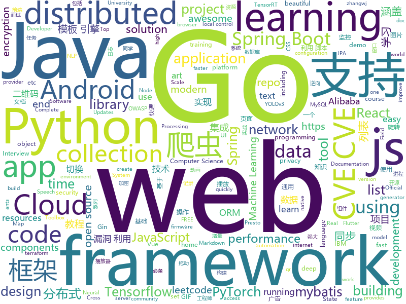

# 2020-06-30
See what the GitHub community is most excited about.

## python
+ [avatarify](https://github.com/alievk/avatarify)(**175 stars today**): Avatars for Zoom, Skype and other video-conferencing apps.
+ [SciencePlots](https://github.com/garrettj403/SciencePlots)(**241 stars today**): Matplotlib styles for scientific plotting
+ [TensorflowTTS](https://github.com/TensorSpeech/TensorflowTTS)(**40 stars today**): 😝TensorflowTTS: Real-Time State-of-the-art Speech Synthesis for Tensorflow 2
+ [spektral](https://github.com/danielegrattarola/spektral)(**100 stars today**): Graph Neural Networks with Keras and Tensorflow 2.
+ [pytorch-lightning](https://github.com/PyTorchLightning/pytorch-lightning)(**49 stars today**): The lightweight PyTorch wrapper for ML researchers. Scale your models. Write less boilerplate
+ [torch2trt](https://github.com/NVIDIA-AI-IOT/torch2trt)(**10 stars today**): An easy to use PyTorch to TensorRT converter
+ [transformers](https://github.com/huggingface/transformers)(**131 stars today**): 🤗Transformers: State-of-the-art Natural Language Processing for Pytorch and TensorFlow 2.0.
+ [dash](https://github.com/plotly/dash)(**13 stars today**): Analytical Web Apps for Python, R, Julia, and Jupyter. No JavaScript Required.
+ [core](https://github.com/home-assistant/core)(**41 stars today**): 🏡Open source home automation that puts local control and privacy first
+ [espnet](https://github.com/espnet/espnet)(**15 stars today**): End-to-End Speech Processing Toolkit
+ [exphub](https://github.com/zhzyker/exphub)(**27 stars today**): Exphub[漏洞利用脚本库] 包括Webloigc、Struts2、Tomcat、Nexus、Solr、Jboss、Drupal的漏洞利用脚本，优先更新高危且易利用的漏洞利用脚本，最新添加CVE-2020-11444、CVE-2020-10204、CVE-2020-10199、CVE-2020-1938、CVE-2020-2551、CVE-2020-2555、CVE-2020-2883、CVE-2019-17558、CVE-2019-6340
+ [tensorflow-yolov4-tflite](https://github.com/hunglc007/tensorflow-yolov4-tflite)(**12 stars today**): YOLOv4, YOLOv4-tiny, YOLOv3, YOLOv3-tiny Implemented in Tensorflow 2.0, Android. Convert YOLO v4 .weights tensorflow, tensorrt and tflite
+ [detr](https://github.com/facebookresearch/detr)(**55 stars today**): End-to-End Object Detection with Transformers
+ [adversarial-robustness-toolbox](https://github.com/IBM/adversarial-robustness-toolbox)(**6 stars today**): Adversarial Robustness Toolbox (ART) - Python Library for Machine Learning Security - Evasion, Poisoning, Extraction, Inference
+ [sktime](https://github.com/alan-turing-institute/sktime)(**98 stars today**): A scikit-learn compatible Python toolbox for machine learning with time series
+ [hackerone_wordlist](https://github.com/xyele/hackerone_wordlist)(**107 stars today**): The wordlists that have been compiled using disclosed reports at HackerOne bug bounty platform
+ [qrcode](https://github.com/sylnsfar/qrcode)(**27 stars today**): artistic QR Code in Python （Animated GIF qr code）- Python 艺术二维码生成器 （GIF动态二维码、图片二维码）
+ [differential-privacy-library](https://github.com/IBM/differential-privacy-library)(**30 stars today**): Diffprivlib: The IBM Differential Privacy Library
+ [learn_python3_spider](https://github.com/wistbean/learn_python3_spider)(**49 stars today**): python爬虫教程系列、从0到1学习python爬虫，包括浏览器抓包，手机APP抓包，如 fiddler、mitmproxy，各种爬虫涉及的模块的使用，如：requests、beautifulSoup、selenium、appium、scrapy等，以及IP代理，验证码识别，Mysql，MongoDB数据库的python使用，多线程多进程爬虫的使用，css 爬虫加密逆向破解，JS爬虫逆向，分布式爬虫，爬虫项目实战实例等
+ [stargan-v2](https://github.com/clovaai/stargan-v2)(**22 stars today**): StarGAN v2 - Official PyTorch Implementation (CVPR 2020)
+ [TextAttack](https://github.com/QData/TextAttack)(**69 stars today**): TextAttack🐙is a Python framework for adversarial attacks, data augmentation, and model training in NLP
+ [featuretools](https://github.com/FeatureLabs/featuretools)(**7 stars today**): An open source python library for automated feature engineering
+ [airflow](https://github.com/apache/airflow)(**21 stars today**): Apache Airflow - A platform to programmatically author, schedule, and monitor workflows
+ [police-brutality](https://github.com/2020PB/police-brutality)(**25 stars today**): Repository containing evidence of police brutality during the 2020 George Floyd protests
+ [apex](https://github.com/NVIDIA/apex)(**15 stars today**): A PyTorch Extension: Tools for easy mixed precision and distributed training in Pytorch

## java
+ [Mindustry](https://github.com/Anuken/Mindustry)(**153 stars today**): A sandbox tower defense game
+ [JavaGuide](https://github.com/Snailclimb/JavaGuide)(**118 stars today**): 「Java学习+面试指南」一份涵盖大部分Java程序员所需要掌握的核心知识。
+ [advanced-java](https://github.com/doocs/advanced-java)(**67 stars today**): 😮互联网 Java 工程师进阶知识完全扫盲：涵盖高并发、分布式、高可用、微服务、海量数据处理等领域知识，后端同学必看，前端同学也可学习
+ [shardingsphere-elasticjob-lite](https://github.com/apache/shardingsphere-elasticjob-lite)(**19 stars today**): Distributed scheduled job framework
+ [toBeTopJavaer](https://github.com/hollischuang/toBeTopJavaer)(**184 stars today**): To Be Top Javaer - Java工程师成神之路
+ [CS-Notes](https://github.com/CyC2018/CS-Notes)(**297 stars today**): 📚技术面试必备基础知识、Leetcode、计算机操作系统、计算机网络、系统设计、Java、Python、C++
+ [springboot-guide](https://github.com/Snailclimb/springboot-guide)(**40 stars today**): Not only Spring Boot but also important knowledge of Spring（不只是SpringBoot还有Spring重要知识点）
+ [datax-web](https://github.com/WeiYe-Jing/datax-web)(**40 stars today**): DataX集成可视化页面，选择数据源即可一键生成数据同步任务，支持批量创建RDBMS数据同步任务，集成开源调度系统，支持分布式、增量同步数据、实时查看运行日志、监控执行器资源、KILL运行进程、数据源信息加密等。
+ [sodium-fabric](https://github.com/jellysquid3/sodium-fabric)(**5 stars today**): A Minecraft mod designed to improve frame rates and micro-stutter
+ [canal](https://github.com/alibaba/canal)(**47 stars today**): 阿里巴巴 MySQL binlog 增量订阅&消费组件
+ [spring-boot-examples](https://github.com/ityouknow/spring-boot-examples)(**21 stars today**): about learning Spring Boot via examples. Spring Boot 教程、技术栈示例代码，快速简单上手教程。
+ [fastjson](https://github.com/alibaba/fastjson)(**30 stars today**): A fast JSON parser/generator for Java.
+ [elasticsearch](https://github.com/elastic/elasticsearch)(**30 stars today**): Open Source, Distributed, RESTful Search Engine
+ [spring-boot-demo](https://github.com/xkcoding/spring-boot-demo)(**132 stars today**): spring boot demo 是一个用来深度学习并实战 spring boot 的项目，目前总共包含 65 个集成demo，已经完成 53 个。 该项目已成功集成 actuator(监控)、admin(可视化监控)、logback(日志)、aopLog(通过AOP记录web请求日志)、统一异常处理(json级别和页面级别)、freemarker(模板引擎)、thymeleaf(模板引擎)、Beetl(模板引擎)、Enjoy(模板引擎)、JdbcTemplate(通用JDBC操作数据库)、JPA(强大的ORM框架)、mybatis(强大的ORM框架)、通用Mapper(快速操作Mybatis)、PageHelper(通用的Mybatis分页插件)、mybatis-plus(快速操作M…
+ [SpringBoot-Labs](https://github.com/YunaiV/SpringBoot-Labs)(**148 stars today**): 一个涵盖六个专栏：Spring Boot 2.X、Spring Cloud、Spring Cloud Alibaba、Dubbo、分布式消息队列、分布式事务的仓库。希望胖友小手一抖，右上角来个 Star，感恩 1024
+ [BurpCrypto](https://github.com/whwlsfb/BurpCrypto)(**51 stars today**): BurpCrypto is a collection of burpsuite encryption plug-ins, support AES/RSA/DES/ExecJs(execute JS encryption code in burpsuite).
+ [hutool](https://github.com/looly/hutool)(**36 stars today**): A set of tools that keep Java sweet.
+ [GSYVideoPlayer](https://github.com/CarGuo/GSYVideoPlayer)(**16 stars today**): 视频播放器（IJKplayer、ExoPlayer、MediaPlayer），HTTPS，支持弹幕，外挂字幕，支持滤镜、水印、gif截图，片头广告、中间广告，多个同时播放，支持基本的拖动，声音、亮度调节，支持边播边缓存，支持视频自带rotation的旋转（90,270之类），重力旋转与手动旋转的同步支持，支持列表播放 ，列表全屏动画，视频加载速度，列表小窗口支持拖动，动画效果，调整比例，多分辨率切换，支持切换播放器，进度条小窗口预览，列表切换详情页面无缝播放，rtsp、concat、mpeg。
+ [banner](https://github.com/youth5201314/banner)(**16 stars today**): 🔥🔥🔥Banner 2.0 来了！Android广告图片轮播控件，内部基于ViewPager2实现，Indicator和UI都可以自定义。
+ [presto](https://github.com/prestosql/presto)(**5 stars today**): Home of the community managed version of Presto, the distributed SQL query engine for big data, under the auspices of the Presto Software Foundation.
+ [spring-cloud-alibaba](https://github.com/alibaba/spring-cloud-alibaba)(**29 stars today**): Spring Cloud Alibaba provides a one-stop solution for application development for the distributed solutions of Alibaba middleware.
+ [PictureSelector](https://github.com/LuckSiege/PictureSelector)(**16 stars today**): Picture Selector Library for Android or 图片选择器
+ [android-interview-questions](https://github.com/MindorksOpenSource/android-interview-questions)(**4 stars today**): Your Cheat Sheet For Android Interview - Android Interview Questions
+ [springBoot](https://github.com/527515025/springBoot)(**20 stars today**): springboot 框架与其它组件结合如 jpa、mybatis、websocket、security、shiro、cache等
+ [Jetpack-MVVM-Best-Practice](https://github.com/KunMinX/Jetpack-MVVM-Best-Practice)(**32 stars today**): 是 难得一见 的 Jetpack MVVM 最佳实践！在 蕴繁于简 的代码中，对 视图控制器 乃至 标准化开发模式 形成正确、深入的理解！

## unknown
+ [OnJava8](https://github.com/LingCoder/OnJava8)(**307 stars today**): 《On Java 8》中文版，又名《Java编程思想》 第5版
+ [Deep-learning-books](https://github.com/loveunk/Deep-learning-books)(**160 stars today**): Books for machine learning, deep learning, math, NLP, CV, RL, etc
+ [awesome-courses](https://github.com/prakhar1989/awesome-courses)(**101 stars today**): 📚List of awesome university courses for learning Computer Science!
+ [Pulse](https://github.com/nasa-jpl/Pulse)(**36 stars today**): A pendant to warn you when you touch your face
+ [deep-learning-drizzle](https://github.com/kmario23/deep-learning-drizzle)(**73 stars today**): Drench yourself in Deep Learning, Reinforcement Learning, Machine Learning, Computer Vision, and NLP by learning from these exciting lectures!!
+ [precourse](https://github.com/NeuromatchAcademy/precourse)(**12 stars today**): A repo for the pre-course work at home exercises
+ [akusio-repo-archive](https://github.com/akusio/akusio-repo-archive)(**9 stars today**): akusio repo (2019-2020)
+ [coding-interview-university](https://github.com/jwasham/coding-interview-university)(**319 stars today**): A complete computer science study plan to become a software engineer.
+ [open_robot_actuator_hardware](https://github.com/open-dynamic-robot-initiative/open_robot_actuator_hardware)(**24 stars today**): 
+ [Pwdb-Public](https://github.com/FlameOfIgnis/Pwdb-Public)(**316 stars today**): A collection of all the data i could extract from 1 billion leaked credentials from internet.
+ [Profiles](https://github.com/DivineEngine/Profiles)(**50 stars today**): 🌐Dial-up Internet access
+ [CKAD-exercises](https://github.com/dgkanatsios/CKAD-exercises)(**13 stars today**): A set of exercises to prepare for Certified Kubernetes Application Developer exam by Cloud Native Computing Foundation
+ [flutter_roadmap](https://github.com/olexale/flutter_roadmap)(**31 stars today**): Highly Subjective Roadmap to Flutter Development
+ [JavaScript-Algorithms](https://github.com/sisterAn/JavaScript-Algorithms)(**32 stars today**): 基础理论+JS框架应用+实践，从0到1构建整个前端算法体系
+ [Summer2021-Internships](https://github.com/Pitt-CSC/Summer2021-Internships)(**15 stars today**): Collection of Summer 2021 tech internships!
+ [learn-python3](https://github.com/michaelliao/learn-python3)(**8 stars today**): Learn Python 3 Sample Code
+ [awesome-design-systems](https://github.com/alexpate/awesome-design-systems)(**14 stars today**): 💅🏻⚒A collection of awesome design systems
+ [nlp-roadmap](https://github.com/graykode/nlp-roadmap)(**47 stars today**): ROADMAP(Mind Map) and KEYWORD for students those who have interest in learning NLP
+ [deep_learning_object_detection](https://github.com/hoya012/deep_learning_object_detection)(**13 stars today**): A paper list of object detection using deep learning.
+ [3y](https://github.com/ZhongFuCheng3y/3y)(**63 stars today**): 📓从Java基础、JavaWeb基础到常用的框架再到面试题都有完整的教程，几乎涵盖了Java后端必备的知识点
+ [free-code](https://github.com/wenyanjun/free-code)(**17 stars today**): webstorm idea phpStorm pycharm 提供激活码和jar激活方式QQ技术交流②群 272712006
+ [Profiles](https://github.com/ConnersHua/Profiles)(**17 stars today**): 
+ [prometheus](https://github.com/vegasbrianc/prometheus)(**5 stars today**): A docker-compose stack for Prometheus monitoring
+ [CyberProfDevelopmentCovidResources](https://github.com/gerryguy311/CyberProfDevelopmentCovidResources)(**10 stars today**): An awesome list of FREE resources for training, conferences, speaking, labs, reading, etc that are free all the time or during COVID-19 that cybersecurity professionals with downtime can take advantage of to improve their skills and marketability to come out on the other side ready to rock.
+ [awesome-php](https://github.com/ziadoz/awesome-php)(**14 stars today**): A curated list of amazingly awesome PHP libraries, resources and shiny things.

## javascript
+ [cnn-explainer](https://github.com/poloclub/cnn-explainer)(**119 stars today**): Learning Convolutional Neural Networks with Interactive Visualization.
+ [leetcode](https://github.com/azl397985856/leetcode)(**83 stars today**): LeetCode Solutions: A Record of My Problem Solving Journey.( leetcode题解，记录自己的leetcode解题之路。)
+ [snowpack](https://github.com/pikapkg/snowpack)(**110 stars today**): The near-instant build tool for modern web apps.
+ [sheetjs](https://github.com/SheetJS/sheetjs)(**32 stars today**): 📗SheetJS Community Edition -- Spreadsheet Data Toolkit
+ [vuex](https://github.com/vuejs/vuex)(**23 stars today**): 🗃️Centralized State Management for Vue.js.
+ [create-react-app](https://github.com/facebook/create-react-app)(**57 stars today**): Set up a modern web app by running one command.
+ [vue](https://github.com/vuejs/vue)(**143 stars today**): 🖖Vue.js is a progressive, incrementally-adoptable JavaScript framework for building UI on the web.
+ [honkit](https://github.com/honkit/honkit)(**373 stars today**): 📖HonKit is building beautiful books using Markdown - Fork of GitBook
+ [Unlock-netease-cloud-music](https://github.com/meng-chuan/Unlock-netease-cloud-music)(**275 stars today**): 解锁网易云音乐客户端变灰歌曲
+ [three.js](https://github.com/mrdoob/three.js)(**58 stars today**): JavaScript 3D library.
+ [beautiful-react-hooks](https://github.com/beautifulinteractions/beautiful-react-hooks)(**133 stars today**): 🔥A collection of beautiful and (hopefully) useful React hooks to speed-up your components and hooks development🔥
+ [webpack-dev-server](https://github.com/webpack/webpack-dev-server)(**4 stars today**): Serves a webpack app. Updates the browser on changes. Documentation https://webpack.js.org/configuration/dev-server/.
+ [mermaid](https://github.com/mermaid-js/mermaid)(**37 stars today**): Generation of diagram and flowchart from text in a similar manner as markdown
+ [react-router](https://github.com/ReactTraining/react-router)(**24 stars today**): Declarative routing for React
+ [v86](https://github.com/copy/v86)(**150 stars today**): x86 virtualization in JavaScript, running in your browser and NodeJS
+ [todomvc](https://github.com/tastejs/todomvc)(**10 stars today**): Helping you select an MV* framework - Todo apps for React.js, Ember.js, Angular, and many more
+ [material-ui](https://github.com/mui-org/material-ui)(**64 stars today**): React components for faster and easier web development. Build your own design system, or start with Material Design.
+ [Rando.js](https://github.com/nastyox/Rando.js)(**105 stars today**): The world's easiest, most powerful random function.
+ [slate](https://github.com/ianstormtaylor/slate)(**14 stars today**): A completely customizable framework for building rich text editors. (Currently in beta.)
+ [react-typescript-cheatsheet](https://github.com/typescript-cheatsheets/react-typescript-cheatsheet)(**52 stars today**): Cheatsheets for experienced React developers getting started with TypeScript
+ [relay](https://github.com/facebook/relay)(**11 stars today**): Relay is a JavaScript framework for building data-driven React applications.
+ [react-chartjs-2](https://github.com/jerairrest/react-chartjs-2)(**22 stars today**): React wrapper for Chart.js
+ [learnVue](https://github.com/answershuto/learnVue)(**24 stars today**): Vue.js 源码解析
+ [SwitchHosts](https://github.com/oldj/SwitchHosts)(**20 stars today**): Switch hosts quickly!
+ [complete-node-bootcamp](https://github.com/jonasschmedtmann/complete-node-bootcamp)(**4 stars today**): Starter files, final projects and FAQ for my Complete Node.js Bootcamp

## html
+ [REKCARC-TSC-UHT](https://github.com/PKUanonym/REKCARC-TSC-UHT)(**63 stars today**): 清华大学计算机系课程攻略 Guidance for courses in Department of Computer Science and Technology, Tsinghua University
+ [qcloud-documents](https://github.com/tencentyun/qcloud-documents)(**5 stars today**): 腾讯云官方文档
+ [web-moderno](https://github.com/cod3rcursos/web-moderno)(**11 stars today**): 
+ [Graphics](https://github.com/Unity-Technologies/Graphics)(**3 stars today**): Unity Graphics - Including Scriptable Render Pipeline
+ [Tasmota](https://github.com/arendst/Tasmota)(**17 stars today**): Alternative firmware for ESP8266 with easy configuration using webUI, OTA updates, automation using timers or rules, expandability and entirely local control over MQTT, HTTP, Serial or KNX. Full documentation at
+ [fastText](https://github.com/facebookresearch/fastText)(**14 stars today**): Library for fast text representation and classification.
+ [Front-end-Developer-Interview-Questions](https://github.com/h5bp/Front-end-Developer-Interview-Questions)(**20 stars today**): A list of helpful front-end related questions you can use to interview potential candidates, test yourself or completely ignore.
+ [PowerBI-DataScience](https://github.com/dsacademybr/PowerBI-DataScience)(**8 stars today**): Repositório do Curso Microsoft Power BI Para Data Science
+ [github-markdown-css](https://github.com/sindresorhus/github-markdown-css)(**8 stars today**): The minimal amount of CSS to replicate the GitHub Markdown style
+ [learning-area](https://github.com/mdn/learning-area)(**6 stars today**): Github repo for the MDN Learning Area.
+ [MatBlazor](https://github.com/SamProf/MatBlazor)(**8 stars today**): Material Design components for Blazor and Razor Components
+ [wpt](https://github.com/web-platform-tests/wpt)(**1 stars today**): Test suites for Web platform specs — including WHATWG, W3C, and others
+ [foundation-sites](https://github.com/foundation/foundation-sites)(**4 stars today**): The most advanced responsive front-end framework in the world. Quickly create prototypes and production code for sites that work on any kind of device.
+ [calico](https://github.com/projectcalico/calico)(**7 stars today**): Cloud native networking and network security
+ [EIPs](https://github.com/ethereum/EIPs)(**7 stars today**): The Ethereum Improvement Proposal repository
+ [html](https://github.com/whatwg/html)(**7 stars today**): HTML Standard
+ [glTF](https://github.com/KhronosGroup/glTF)(**9 stars today**): glTF – Runtime 3D Asset Delivery
+ [NodeGoat](https://github.com/OWASP/NodeGoat)(**2 stars today**): The OWASP NodeGoat project provides an environment to learn how OWASP Top 10 security risks apply to web applications developed using Node.js and how to effectively address them.
+ [tidytuesday](https://github.com/rfordatascience/tidytuesday)(**4 stars today**): Official repo for the #tidytuesday project
+ [favorites-web](https://github.com/cloudfavorites/favorites-web)(**18 stars today**): 云收藏 Spring Boot 2.X 开源项目
+ [boost](https://github.com/boostorg/boost)(**6 stars today**): Super-project for modularized Boost
+ [typedoc](https://github.com/TypeStrong/typedoc)(**8 stars today**): Documentation generator for TypeScript projects.
+ [yi-hack-MStar](https://github.com/roleoroleo/yi-hack-MStar)(**5 stars today**): Custom firmware for Yi 1080p camera based on MStar platform
+ [awesome-modern-cpp](https://github.com/rigtorp/awesome-modern-cpp)(**13 stars today**): A collection of resources on modern C++
+ [mikutap](https://github.com/HFIProgramming/mikutap)(**14 stars today**): A Mainland China Friendly and independent version extracted from https://aidn.jp/mikutap

## go
+ [chat](https://github.com/tinode/chat)(**15 stars today**): Instant messaging server; backend in Go; iOS, Android, web, command line clients; chatbots
+ [vault](https://github.com/hashicorp/vault)(**16 stars today**): A tool for secrets management, encryption as a service, and privileged access management
+ [fabric](https://github.com/hyperledger/fabric)(**9 stars today**): Hyperledger Fabric is an enterprise-grade permissioned distributed ledger framework for developing solutions and applications. Its modular and versatile design satisfies a broad range of industry use cases. It offers a unique approach to consensus that enables performance at scale while preserving privacy.
+ [gin](https://github.com/gin-gonic/gin)(**72 stars today**): Gin is a HTTP web framework written in Go (Golang). It features a Martini-like API with much better performance -- up to 40 times faster. If you need smashing performance, get yourself some Gin.
+ [jaeger-client-go](https://github.com/jaegertracing/jaeger-client-go)(**4 stars today**): Jaeger Bindings for Go OpenTracing API.
+ [postgres-operator](https://github.com/zalando/postgres-operator)(**15 stars today**): Postgres operator creates and manages PostgreSQL clusters running in Kubernetes
+ [dns](https://github.com/miekg/dns)(**3 stars today**): DNS library in Go
+ [go-admin](https://github.com/wenjianzhang/go-admin)(**12 stars today**): 基于Gin + Vue + Element UI的前后端分离权限管理系统脚手架（包含了：基础用户管理功能，jwt鉴权，代码生成器，RBAC资源控制，表单构建等）文档：http://doc.zhangwj.com/go-admin-site/ Demo： http://www.zhangwj.com/#/login
+ [golang-samples](https://github.com/GoogleCloudPlatform/golang-samples)(**8 stars today**): Sample apps and code written for Google Cloud in the Go programming language.
+ [7days-golang](https://github.com/geektutu/7days-golang)(**16 stars today**): 7 days golang apps from scratch (web framework Gee, distributed cache GeeCache, object relational mapping ORM framework GeeORM etc) 7天用Go动手写/从零实现系列
+ [ion](https://github.com/pion/ion)(**8 stars today**): Distributed RTC System by pure Go and Flutter
+ [ants](https://github.com/panjf2000/ants)(**16 stars today**): 🐜🐜🐜ants is a high-performance and low-cost goroutine pool in Go, inspired by fasthttp./ ants 是一个高性能且低损耗的 goroutine 池。
+ [magma](https://github.com/facebookincubator/magma)(**2 stars today**): Platform for building access networks and modular network services
+ [mindoc](https://github.com/lifei6671/mindoc)(**4 stars today**): Golang实现的基于beego框架的接口在线文档管理系统
+ [dgraph](https://github.com/dgraph-io/dgraph)(**19 stars today**): Fast, Distributed Graph DB
+ [beego](https://github.com/astaxie/beego)(**75 stars today**): beego is an open-source, high-performance web framework for the Go programming language.
+ [mongo-go-driver](https://github.com/mongodb/mongo-go-driver)(**7 stars today**): The Go driver for MongoDB
+ [kustomize](https://github.com/kubernetes-sigs/kustomize)(**13 stars today**): Customization of kubernetes YAML configurations
+ [go](https://github.com/golang/go)(**70 stars today**): The Go programming language
+ [age](https://github.com/FiloSottile/age)(**30 stars today**): A simple, modern and secure encryption tool with small explicit keys, no config options, and UNIX-style composability.
+ [autoscaler](https://github.com/kubernetes/autoscaler)(**6 stars today**): Autoscaling components for Kubernetes
+ [influxdb](https://github.com/influxdata/influxdb)(**7 stars today**): Scalable datastore for metrics, events, and real-time analytics
+ [statping](https://github.com/statping/statping)(**31 stars today**): Status Page for monitoring your websites and applications with beautiful graphs, analytics, and plugins. Run on any type of environment.
+ [validator](https://github.com/go-playground/validator)(**20 stars today**): 💯Go Struct and Field validation, including Cross Field, Cross Struct, Map, Slice and Array diving
+ [terraform-provider-ibm](https://github.com/IBM-Cloud/terraform-provider-ibm)(**0 stars today**): Terraform IBM provider https://cloud.ibm.com/docs/terraform?topic=terraform-tf-provider

## WordCloud

