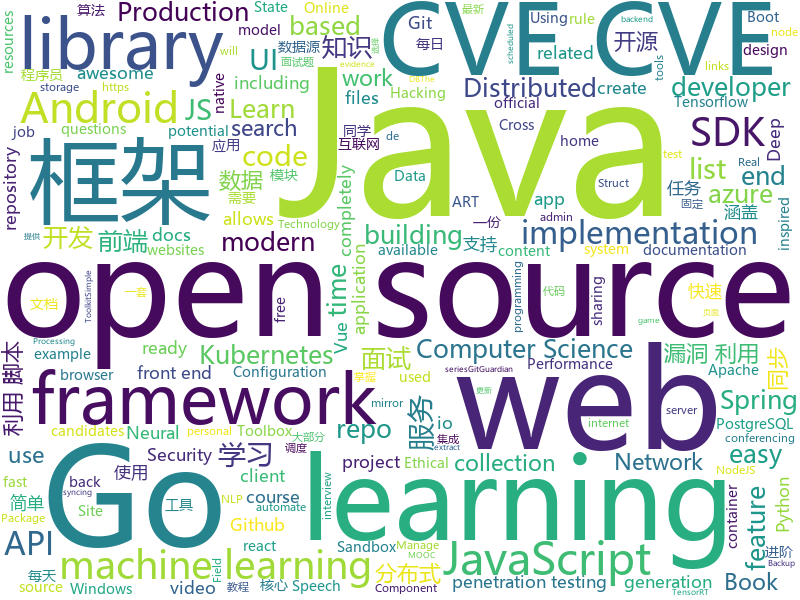

# 2020-07-01
See what the GitHub community is most excited about.

## python
+ [police-brutality](https://github.com/2020PB/police-brutality)(**15 stars today**): Repository containing evidence of police brutality during the 2020 George Floyd protests
+ [cascadia-code](https://github.com/microsoft/cascadia-code)(**40 stars today**): This is a fun, new monospaced font that includes programming ligatures and is designed to enhance the modern look and feel of the Windows Terminal.
+ [White-box-Cartoonization](https://github.com/SystemErrorWang/White-box-Cartoonization)(**164 stars today**): Official tensorflow implementation for CVPR2020 paper “Learning to Cartoonize Using White-box Cartoon Representations”
+ [cadmus](https://github.com/josh-richardson/cadmus)(**112 stars today**): A GUI frontend for @werman's Pulse Audio real-time noise suppression plugin
+ [adversarial-robustness-toolbox](https://github.com/IBM/adversarial-robustness-toolbox)(**8 stars today**): Adversarial Robustness Toolbox (ART) - Python Library for Machine Learning Security - Evasion, Poisoning, Extraction, Inference
+ [pytorch-YOLOv4](https://github.com/Tianxiaomo/pytorch-YOLOv4)(**16 stars today**): PyTorch ,ONNX and TensorRT implementation of YOLOv4
+ [exphub](https://github.com/zhzyker/exphub)(**19 stars today**): Exphub[漏洞利用脚本库] 包括Webloigc、Struts2、Tomcat、Nexus、Solr、Jboss、Drupal的漏洞利用脚本，优先更新高危且易利用的漏洞利用脚本，最新添加CVE-2020-11444、CVE-2020-10204、CVE-2020-10199、CVE-2020-1938、CVE-2020-2551、CVE-2020-2555、CVE-2020-2883、CVE-2019-17558、CVE-2019-6340
+ [TensorflowTTS](https://github.com/TensorSpeech/TensorflowTTS)(**32 stars today**): 😝TensorflowTTS: Real-Time State-of-the-art Speech Synthesis for Tensorflow 2
+ [featuretools](https://github.com/FeatureLabs/featuretools)(**10 stars today**): An open source python library for automated feature engineering
+ [skywater-pdk](https://github.com/google/skywater-pdk)(**36 stars today**): Open source process design kit for usage with SkyWater Technology Foundry's 130nm node.
+ [incubator-superset](https://github.com/apache/incubator-superset)(**20 stars today**): Apache Superset (incubating) is a modern, enterprise-ready business intelligence web application
+ [fastapi](https://github.com/tiangolo/fastapi)(**59 stars today**): FastAPI framework, high performance, easy to learn, fast to code, ready for production
+ [nni](https://github.com/microsoft/nni)(**10 stars today**): An open source AutoML toolkit for automate machine learning lifecycle, including feature engineering, neural architecture search, model compression and hyper-parameter tuning.
+ [pegasus](https://github.com/google-research/pegasus)(**16 stars today**): 
+ [SciencePlots](https://github.com/garrettj403/SciencePlots)(**128 stars today**): Matplotlib styles for scientific plotting
+ [DensePoseFnL](https://github.com/zetyquickly/DensePoseFnL)(**10 stars today**): Fast and Light DensePose implementation
+ [pytext](https://github.com/facebookresearch/pytext)(**4 stars today**): A natural language modeling framework based on PyTorch
+ [avatarify](https://github.com/alievk/avatarify)(**117 stars today**): Avatars for Zoom, Skype and other video-conferencing apps.
+ [espnet](https://github.com/espnet/espnet)(**14 stars today**): End-to-End Speech Processing Toolkit
+ [lets_git_exercise_de](https://github.com/SanJSp/lets_git_exercise_de)(**11 stars today**): This is an excercise created for our MOOC "Let's Git - Versionsverwaltung & Open Source"
+ [faceswap](https://github.com/deepfakes/faceswap)(**32 stars today**): Deepfakes Software For All
+ [sktime](https://github.com/alan-turing-institute/sktime)(**109 stars today**): A scikit-learn compatible Python toolbox for machine learning with time series
+ [gg-shield](https://github.com/GitGuardian/gg-shield)(**49 stars today**): GitGuardian Shield : protect your secrets with GitGuardian
+ [spot-sdk](https://github.com/boston-dynamics/spot-sdk)(**8 stars today**): Spot SDK repo
+ [algo](https://github.com/wangzheng0822/algo)(**24 stars today**): 数据结构和算法必知必会的50个代码实现

## java
+ [Mindustry](https://github.com/Anuken/Mindustry)(**210 stars today**): A sandbox tower defense game
+ [JavaGuide](https://github.com/Snailclimb/JavaGuide)(**157 stars today**): 「Java学习+面试指南」一份涵盖大部分Java程序员所需要掌握的核心知识。
+ [advanced-java](https://github.com/doocs/advanced-java)(**121 stars today**): 😮互联网 Java 工程师进阶知识完全扫盲：涵盖高并发、分布式、高可用、微服务、海量数据处理等领域知识，后端同学必看，前端同学也可学习
+ [shardingsphere-elasticjob-lite](https://github.com/apache/shardingsphere-elasticjob-lite)(**38 stars today**): Distributed scheduled job framework
+ [COLA](https://github.com/alibaba/COLA)(**11 stars today**): Clean Object-oriented & Layered Architecture
+ [datax-web](https://github.com/WeiYe-Jing/datax-web)(**34 stars today**): DataX集成可视化页面，选择数据源即可一键生成数据同步任务，支持批量创建RDBMS数据同步任务，集成开源调度系统，支持分布式、增量同步数据、实时查看运行日志、监控执行器资源、KILL运行进程、数据源信息加密等。
+ [hutool](https://github.com/looly/hutool)(**36 stars today**): A set of tools that keep Java sweet.
+ [elasticsearch](https://github.com/elastic/elasticsearch)(**19 stars today**): Open Source, Distributed, RESTful Search Engine
+ [DataX](https://github.com/alibaba/DataX)(**10 stars today**): 
+ [tutorials](https://github.com/eugenp/tutorials)(**20 stars today**): Just Announced - "Learn Spring Security OAuth":
+ [nifi](https://github.com/apache/nifi)(**4 stars today**): Apache NiFi
+ [QMUI_Android](https://github.com/Tencent/QMUI_Android)(**12 stars today**): 提高 Android UI 开发效率的 UI 库
+ [azure-sdk-for-java](https://github.com/Azure/azure-sdk-for-java)(**1 stars today**): This repository is for active development of the Azure SDK for Java. For consumers of the SDK we recommend visiting our public developer docs at https://docs.microsoft.com/en-us/java/azure/ or our versioned developer docs at https://azure.github.io/azure-sdk-for-java.
+ [bigbluebutton](https://github.com/bigbluebutton/bigbluebutton)(**10 stars today**): Complete open source web conferencing system.
+ [spring-boot](https://github.com/spring-projects/spring-boot)(**35 stars today**): Spring Boot
+ [openapi-generator](https://github.com/OpenAPITools/openapi-generator)(**12 stars today**): OpenAPI Generator allows generation of API client libraries (SDK generation), server stubs, documentation and configuration automatically given an OpenAPI Spec (v2, v3)
+ [PowerJob](https://github.com/KFCFans/PowerJob)(**62 stars today**): 新一代分布式任务调度与计算框架，支持CRON、API、固定频率、固定延迟等调度策略，提供工作流来编排任务解决依赖关系，使用简单，功能强大，文档齐全，欢迎各位接入使用！
+ [android](https://github.com/trebleshot/android)(**6 stars today**): An Open-Source Android application that allows you to send and receive files over available connections, and offers unique features like sharing over HTTP, pausing and resuming transfers
+ [zxing-android-embedded](https://github.com/journeyapps/zxing-android-embedded)(**6 stars today**): Barcode scanner library for Android, based on the ZXing decoder
+ [spring-boot-examples](https://github.com/ityouknow/spring-boot-examples)(**23 stars today**): about learning Spring Boot via examples. Spring Boot 教程、技术栈示例代码，快速简单上手教程。
+ [configuration-as-code-plugin](https://github.com/jenkinsci/configuration-as-code-plugin)(**3 stars today**): Jenkins Configuration as Code Plugin
+ [CommonUtil](https://github.com/LJWLgl/CommonUtil)(**8 stars today**): 轻便简单的Java常用工具类库
+ [react-native-video](https://github.com/react-native-community/react-native-video)(**2 stars today**): A <Video /> component for react-native
+ [MVVMHabit](https://github.com/goldze/MVVMHabit)(**14 stars today**): 👕基于谷歌最新AAC架构，MVVM设计模式的一套快速开发库，整合Okhttp+RxJava+Retrofit+Glide等主流模块，满足日常开发需求。使用该框架可以快速开发一个高质量、易维护的Android应用。
+ [skywalking](https://github.com/apache/skywalking)(**16 stars today**): APM, Application Performance Monitoring System

## unknown
+ [Pwdb-Public](https://github.com/FlameOfIgnis/Pwdb-Public)(**237 stars today**): A collection of all the data i could extract from 1 billion leaked credentials from internet.
+ [Deep-learning-books](https://github.com/loveunk/Deep-learning-books)(**219 stars today**): Books for machine learning, deep learning, math, NLP, CV, RL, etc
+ [PENTESTING-BIBLE](https://github.com/blaCCkHatHacEEkr/PENTESTING-BIBLE)(**11 stars today**): Updates to this repository will continue to arrive until the number of links reaches 10000 links & 10000 pdf files .Learn Ethical Hacking and penetration testing .hundreds of ethical hacking & penetration testing & red team & cyber security & computer science resources.
+ [awesome-courses](https://github.com/prakhar1989/awesome-courses)(**190 stars today**): 📚List of awesome university courses for learning Computer Science!
+ [Profiles](https://github.com/DivineEngine/Profiles)(**39 stars today**): 🌐Dial-up Internet access
+ [you-dont-know-js-ru](https://github.com/azat-io/you-dont-know-js-ru)(**8 stars today**): 📚Russian translation of "You Don't Know JS" book series
+ [computer-science](https://github.com/ossu/computer-science)(**72 stars today**): 🎓Path to a free self-taught education in Computer Science!
+ [rfcs](https://github.com/vuejs/rfcs)(**18 stars today**): RFCs for substantial changes / feature additions to Vue core
+ [articles](https://github.com/axuebin/articles)(**21 stars today**): 📝文章归档
+ [OnJava8](https://github.com/LingCoder/OnJava8)(**132 stars today**): 《On Java 8》中文版，又名《Java编程思想》 第5版
+ [JavaFamily](https://github.com/AobingJava/JavaFamily)(**59 stars today**): 【Java面试+Java学习指南】 一份涵盖大部分Java程序员所需要掌握的核心知识。
+ [Pulse](https://github.com/nasa-jpl/Pulse)(**35 stars today**): A pendant to warn you when you touch your face
+ [NLP-Conferences-Code](https://github.com/yizhen20133868/NLP-Conferences-Code)(**38 stars today**): NLP-Conferences-Code (ACL、EMNL、NAACL、COLING、AAAI、IJCAI)
+ [NieR_Android_Theme](https://github.com/SirYodah/NieR_Android_Theme)(**1 stars today**): Work in progress of a NieR: Automata themed KLWP preset.
+ [precourse](https://github.com/NeuromatchAcademy/precourse)(**12 stars today**): A repo for the pre-course work at home exercises
+ [awesome-pentest](https://github.com/enaqx/awesome-pentest)(**11 stars today**): A collection of awesome penetration testing resources, tools and other shiny things
+ [gitignore](https://github.com/github/gitignore)(**52 stars today**): A collection of useful .gitignore templates
+ [deep-learning-drizzle](https://github.com/kmario23/deep-learning-drizzle)(**40 stars today**): Drench yourself in Deep Learning, Reinforcement Learning, Machine Learning, Computer Vision, and NLP by learning from these exciting lectures!!
+ [Back-End-Developer-Interview-Questions](https://github.com/arialdomartini/Back-End-Developer-Interview-Questions)(**10 stars today**): A list of back-end related questions you can be inspired from to interview potential candidates, test yourself or completely ignore
+ [SwiftUI-Cheat-Sheet](https://github.com/SimpleBoilerplates/SwiftUI-Cheat-Sheet)(**21 stars today**): SwiftUI 2.0 Cheat Sheet
+ [AI-research-tools](https://github.com/bighuang624/AI-research-tools)(**29 stars today**): 🔨AI 方向好用的科研工具
+ [awesome-vue](https://github.com/vuejs/awesome-vue)(**25 stars today**): 🎉A curated list of awesome things related to Vue.js
+ [modern-js-cheatsheet](https://github.com/mbeaudru/modern-js-cheatsheet)(**4 stars today**): Cheatsheet for the JavaScript knowledge you will frequently encounter in modern projects.
+ [JavaScript-Algorithms](https://github.com/sisterAn/JavaScript-Algorithms)(**18 stars today**): 基础理论+JS框架应用+实践，从0到1构建整个前端算法体系
+ [Specs](https://github.com/CocoaPods/Specs)(**1 stars today**): The CocoaPods Master Repo

## javascript
+ [cnn-explainer](https://github.com/poloclub/cnn-explainer)(**158 stars today**): Learning Convolutional Neural Networks with Interactive Visualization.
+ [hexapod](https://github.com/mithi/hexapod)(**39 stars today**): Blazing fast hexapod robot simulator with React and Plotly.
+ [react](https://github.com/facebook/react)(**88 stars today**): A declarative, efficient, and flexible JavaScript library for building user interfaces.
+ [vue](https://github.com/vuejs/vue)(**92 stars today**): 🖖Vue.js is a progressive, incrementally-adoptable JavaScript framework for building UI on the web.
+ [graphql-js](https://github.com/graphql/graphql-js)(**9 stars today**): A reference implementation of GraphQL for JavaScript
+ [MagicMirror](https://github.com/MichMich/MagicMirror)(**9 stars today**): MagicMirror² is an open source modular smart mirror platform. With a growing list of installable modules, the MagicMirror² allows you to convert your hallway or bathroom mirror into your personal assistant.
+ [elasticsearch-head](https://github.com/mobz/elasticsearch-head)(**9 stars today**): A web front end for an elastic search cluster
+ [algorithms-visualiser](https://github.com/dipeshpatil/algorithms-visualiser)(**15 stars today**): Currently Implemented Sorting (Merge, Quick, Heap, Bubble, Insertion, Selection) Backtracking (NQueen Problem) Searching (Linear, Binary)
+ [vant](https://github.com/youzan/vant)(**12 stars today**): Lightweight Mobile UI Components built on Vue
+ [eslint-plugin-react](https://github.com/yannickcr/eslint-plugin-react)(**4 stars today**): React specific linting rules for ESLint
+ [BrasilAPI](https://github.com/filipedeschamps/BrasilAPI)(**9 stars today**): Vamos transformar o Brasil em uma API?
+ [textures](https://github.com/riccardoscalco/textures)(**98 stars today**): Textures.js is a JavaScript library for creating SVG patterns
+ [content](https://github.com/nuxt/content)(**19 stars today**): Write in a content/ directory and fetch your Markdown, JSON, YAML and CSV files through a MongoDB like API, acting as a Git-based Headless CMS
+ [brave-browser](https://github.com/brave/brave-browser)(**36 stars today**): Next generation Brave browser for macOS, Windows, Linux, Android.
+ [posthog](https://github.com/PostHog/posthog)(**10 stars today**): 🦔PostHog is developer-friendly, open-source product analytics.
+ [v86](https://github.com/copy/v86)(**90 stars today**): x86 virtualization in JavaScript, running in your browser and NodeJS
+ [lib-flexible](https://github.com/amfe/lib-flexible)(**11 stars today**): 可伸缩布局方案
+ [layui](https://github.com/sentsin/layui)(**13 stars today**): 采用自身模块规范编写的前端 UI 框架，遵循原生 HTML/CSS/JS 的书写形式，极低门槛，拿来即用。
+ [sheetjs](https://github.com/SheetJS/sheetjs)(**31 stars today**): 📗SheetJS Community Edition -- Spreadsheet Data Toolkit
+ [mobx](https://github.com/mobxjs/mobx)(**6 stars today**): Simple, scalable state management.
+ [playwright](https://github.com/microsoft/playwright)(**29 stars today**): Node library to automate Chromium, Firefox and WebKit with a single API
+ [bull](https://github.com/OptimalBits/bull)(**12 stars today**): Premium Queue package for handling distributed jobs and messages in NodeJS.
+ [fe-interview](https://github.com/haizlin/fe-interview)(**28 stars today**): 前端面试每日 3+1，以面试题来驱动学习，提倡每日学习与思考，每天进步一点！每天早上5点纯手工发布面试题（死磕自己，愉悦大家）
+ [slate](https://github.com/ianstormtaylor/slate)(**12 stars today**): A completely customizable framework for building rich text editors. (Currently in beta.)
+ [docusaurus](https://github.com/facebook/docusaurus)(**24 stars today**): Easy to maintain open source documentation websites.

## html
+ [learning-area](https://github.com/mdn/learning-area)(**4 stars today**): Github repo for the MDN Learning Area.
+ [Java-Interview-Advanced](https://github.com/shishan100/Java-Interview-Advanced)(**3 stars today**): 中华石杉--互联网Java进阶面试训练营
+ [i-book.in_Archive](https://github.com/SaltyLeo/i-book.in_Archive)(**8 stars today**): 
+ [qcloud-documents](https://github.com/tencentyun/qcloud-documents)(**4 stars today**): 腾讯云官方文档
+ [web-moderno](https://github.com/cod3rcursos/web-moderno)(**8 stars today**): 
+ [flutter-in-action](https://github.com/flutterchina/flutter-in-action)(**9 stars today**): 《Flutter实战》电子书
+ [seldon-core](https://github.com/SeldonIO/seldon-core)(**3 stars today**): A framework to deploy, manage and scale your production machine learning to thousands of models
+ [REKCARC-TSC-UHT](https://github.com/PKUanonym/REKCARC-TSC-UHT)(**20 stars today**): 清华大学计算机系课程攻略 Guidance for courses in Department of Computer Science and Technology, Tsinghua University
+ [jsonplaceholder](https://github.com/typicode/jsonplaceholder)(**5 stars today**): A simple online fake REST API server
+ [tidytuesday](https://github.com/rfordatascience/tidytuesday)(**2 stars today**): Official repo for the #tidytuesday project
+ [raytracing.github.io](https://github.com/RayTracing/raytracing.github.io)(**15 stars today**): Main Web Site (Online Books)
+ [cypress-example-kitchensink](https://github.com/cypress-io/cypress-example-kitchensink)(**1 stars today**): This is an example app used to showcase Cypress.io testing.
+ [node-ytdl-core](https://github.com/fent/node-ytdl-core)(**2 stars today**): YouTube video downloader in javascript.
+ [webdevbootcamp](https://github.com/nax3t/webdevbootcamp)(**2 stars today**): All source code for back-end projects from the Web Developer Bootcamp
+ [coreui-free-bootstrap-admin-template](https://github.com/coreui/coreui-free-bootstrap-admin-template)(**5 stars today**): CoreUI is free bootstrap admin template
+ [bootcamp-launchbase-desafios-03](https://github.com/Rocketseat/bootcamp-launchbase-desafios-03)(**0 stars today**): Desafios do terceiro módulo do Bootcamp Launchbase🚀👨🏻‍🚀
+ [mxgraph](https://github.com/jgraph/mxgraph)(**6 stars today**): mxGraph is a fully client side JavaScript diagramming library
+ [complete-web-development-bangla-resources](https://github.com/ProgrammingHero1/complete-web-development-bangla-resources)(**1 stars today**): 
+ [hyperblog](https://github.com/freddier/hyperblog)(**8 stars today**): Un blog increíble para el curso de Git y Github de Platzi
+ [nndl.github.io](https://github.com/nndl/nndl.github.io)(**10 stars today**): 《神经网络与深度学习》 邱锡鹏著 Neural Network and Deep Learning
+ [calico](https://github.com/projectcalico/calico)(**7 stars today**): Cloud native networking and network security
+ [Front-end-Developer-Interview-Questions](https://github.com/h5bp/Front-end-Developer-Interview-Questions)(**10 stars today**): A list of helpful front-end related questions you can use to interview potential candidates, test yourself or completely ignore.
+ [foundation-sites](https://github.com/foundation/foundation-sites)(**5 stars today**): The most advanced responsive front-end framework in the world. Quickly create prototypes and production code for sites that work on any kind of device.
+ [Adminator-admin-dashboard](https://github.com/puikinsh/Adminator-admin-dashboard)(**4 stars today**): Adminator is a easy to use and well design admin dashboard template for web apps, websites, services and more
+ [Graphics](https://github.com/Unity-Technologies/Graphics)(**3 stars today**): Unity Graphics - Including Scriptable Render Pipeline

## go
+ [ultimate-go](https://github.com/hoanhan101/ultimate-go)(**138 stars today**): Ultimate Go study guide
+ [chat](https://github.com/tinode/chat)(**86 stars today**): Instant messaging server; backend in Go; iOS, Android, web, command line clients; chatbots
+ [dgraph](https://github.com/dgraph-io/dgraph)(**14 stars today**): Fast, Distributed Graph DB
+ [helm](https://github.com/helm/helm)(**15 stars today**): The Kubernetes Package Manager
+ [go-ethereum](https://github.com/ethereum/go-ethereum)(**6 stars today**): Official Go implementation of the Ethereum protocol
+ [go-swagger](https://github.com/go-swagger/go-swagger)(**9 stars today**): Swagger 2.0 implementation for go
+ [go](https://github.com/golang/go)(**46 stars today**): The Go programming language
+ [clash](https://github.com/Dreamacro/clash)(**35 stars today**): A rule-based tunnel in Go.
+ [thanos](https://github.com/thanos-io/thanos)(**9 stars today**): Highly available Prometheus setup with long term storage capabilities. CNCF Sandbox project.
+ [go-ipfs](https://github.com/ipfs/go-ipfs)(**8 stars today**): IPFS implementation in Go
+ [fiber](https://github.com/gofiber/fiber)(**87 stars today**): ⚡️Fiber is an Express inspired web framework written in Go with☕️
+ [eksctl](https://github.com/weaveworks/eksctl)(**5 stars today**): The official CLI for Amazon EKS
+ [perkeep](https://github.com/perkeep/perkeep)(**91 stars today**): Perkeep (née Camlistore) is your personal storage system for life: a way of storing, syncing, sharing, modelling and backing up content.
+ [postgres-operator](https://github.com/CrunchyData/postgres-operator)(**4 stars today**): PostgreSQL Operator Creates/Configures/Manages PostgreSQL Clusters on Kubernetes
+ [jupiter](https://github.com/douyu/jupiter)(**48 stars today**): Jupiter是douyu开源的面向服务治理的Golang微服务框架
+ [kubesphere](https://github.com/kubesphere/kubesphere)(**17 stars today**): Easy-to-use Production Ready Container Platform
+ [faas](https://github.com/openfaas/faas)(**9 stars today**): OpenFaaS - Serverless Functions Made Simple
+ [libpod](https://github.com/containers/libpod)(**9 stars today**): libpod is a library used to create container pods. Home of Podman.
+ [velero](https://github.com/vmware-tanzu/velero)(**7 stars today**): Backup and migrate Kubernetes applications and their persistent volumes
+ [wire](https://github.com/google/wire)(**20 stars today**): Compile-time Dependency Injection for Go
+ [kratos](https://github.com/go-kratos/kratos)(**15 stars today**): Kratos是bilibili开源的一套Go微服务框架，包含大量微服务相关框架及工具。
+ [kops](https://github.com/kubernetes/kops)(**7 stars today**): Kubernetes Operations (kops) - Production Grade K8s Installation, Upgrades, and Management
+ [bfe](https://github.com/bfenetworks/bfe)(**78 stars today**): A modern layer 7 load balancer from baidu
+ [validator](https://github.com/go-playground/validator)(**19 stars today**): 💯Go Struct and Field validation, including Cross Field, Cross Struct, Map, Slice and Array diving
+ [kubebuilder](https://github.com/kubernetes-sigs/kubebuilder)(**6 stars today**): Kubebuilder - SDK for building Kubernetes APIs using CRDs

## WordCloud

