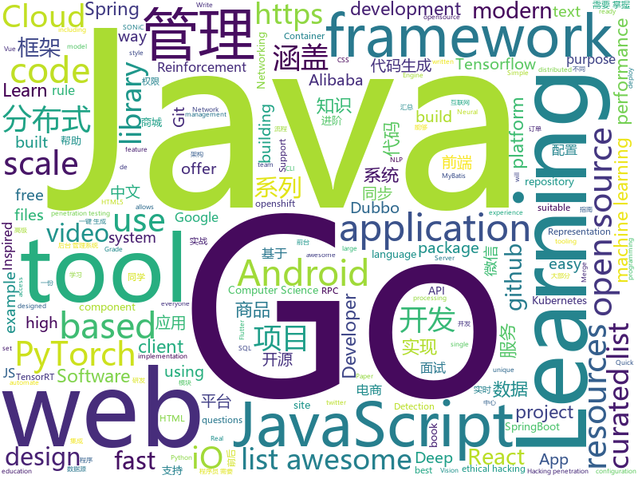

# 2020-07-02
See what the GitHub community is most excited about.

## python
+ [cascadia-code](https://github.com/microsoft/cascadia-code)(**65 stars today**): This is a fun, new monospaced font that includes programming ligatures and is designed to enhance the modern look and feel of the Windows Terminal.
+ [detection-rules](https://github.com/elastic/detection-rules)(**93 stars today**): Rules for the Detection Engine in Elastic Security
+ [OpenPCDet](https://github.com/open-mmlab/OpenPCDet)(**38 stars today**): OpenPCDet Toolbox for LiDAR-based 3D Object Detection.
+ [examples](https://github.com/pytorch/examples)(**33 stars today**): A set of examples around pytorch in Vision, Text, Reinforcement Learning, etc.
+ [pytorch-tutorial](https://github.com/yunjey/pytorch-tutorial)(**42 stars today**): PyTorch Tutorial for Deep Learning Researchers
+ [police-brutality](https://github.com/2020PB/police-brutality)(**235 stars today**): Repository containing evidence of police brutality during the 2020 George Floyd protests
+ [pytorch-lightning](https://github.com/PyTorchLightning/pytorch-lightning)(**25 stars today**): The lightweight PyTorch wrapper for ML researchers. Scale your models. Write less boilerplate
+ [TensorflowTTS](https://github.com/TensorSpeech/TensorflowTTS)(**79 stars today**): 😝TensorflowTTS: Real-Time State-of-the-art Speech Synthesis for Tensorflow 2
+ [White-box-Cartoonization](https://github.com/SystemErrorWang/White-box-Cartoonization)(**115 stars today**): Official tensorflow implementation for CVPR2020 paper “Learning to Cartoonize Using White-box Cartoon Representations”
+ [transformers](https://github.com/huggingface/transformers)(**90 stars today**): 🤗Transformers: State-of-the-art Natural Language Processing for Pytorch and TensorFlow 2.0.
+ [skywater-pdk](https://github.com/google/skywater-pdk)(**43 stars today**): Open source process design kit for usage with SkyWater Technology Foundry's 130nm node.
+ [Python](https://github.com/geekcomputers/Python)(**24 stars today**): My Python Examples
+ [models](https://github.com/tensorflow/models)(**33 stars today**): Models and examples built with TensorFlow
+ [gunicorn](https://github.com/benoitc/gunicorn)(**2 stars today**): gunicorn 'Green Unicorn' is a WSGI HTTP Server for UNIX, fast clients and sleepy applications.
+ [salt](https://github.com/saltstack/salt)(**8 stars today**): Software to automate the management and configuration of any infrastructure or application at scale. Get access to the Salt software package repository here:
+ [photo2cartoon](https://github.com/minivision-ai/photo2cartoon)(**21 stars today**): 人像卡通化探索项目 (photo-to-cartoon translation project)
+ [pytorch-YOLOv4](https://github.com/Tianxiaomo/pytorch-YOLOv4)(**18 stars today**): PyTorch ,ONNX and TensorRT implementation of YOLOv4
+ [example-code](https://github.com/fluentpython/example-code)(**7 stars today**): Example code for the book Fluent Python
+ [yobot](https://github.com/yuudi/yobot)(**4 stars today**): aide bot for pcr (mobile game) 公主连接群聊机器人
+ [nni](https://github.com/microsoft/nni)(**13 stars today**): An open source AutoML toolkit for automate machine learning lifecycle, including feature engineering, neural architecture search, model compression and hyper-parameter tuning.
+ [SciencePlots](https://github.com/garrettj403/SciencePlots)(**170 stars today**): Matplotlib styles for scientific plotting
+ [torch2trt](https://github.com/NVIDIA-AI-IOT/torch2trt)(**9 stars today**): An easy to use PyTorch to TensorRT converter
+ [fastapi](https://github.com/tiangolo/fastapi)(**64 stars today**): FastAPI framework, high performance, easy to learn, fast to code, ready for production
+ [public-apis](https://github.com/public-apis/public-apis)(**106 stars today**): A collective list of free APIs for use in software and web development.
+ [aws-sam-cli](https://github.com/awslabs/aws-sam-cli)(**4 stars today**): CLI tool to build, test, debug, and deploy Serverless applications using AWS SAM

## java
+ [datax-web](https://github.com/WeiYe-Jing/datax-web)(**47 stars today**): DataX集成可视化页面，选择数据源即可一键生成数据同步任务，支持批量创建RDBMS数据同步任务，集成开源调度系统，支持分布式、增量同步数据、实时查看运行日志、监控执行器资源、KILL运行进程、数据源信息加密等。
+ [DataX](https://github.com/alibaba/DataX)(**16 stars today**): 
+ [DoraemonKit](https://github.com/didi/DoraemonKit)(**25 stars today**): A full-featured App (iOS & Android) development assistant. You deserve it. 简称 "DoKit" 。一款功能齐全的客户端（ iOS 、Android、微信小程序 ）研发助手，你值得拥有。https://www.dokit.cn/
+ [arthas](https://github.com/alibaba/arthas)(**27 stars today**): Alibaba Java Diagnostic Tool Arthas/Alibaba Java诊断利器Arthas
+ [nifi](https://github.com/apache/nifi)(**8 stars today**): Apache NiFi
+ [pentaho-kettle](https://github.com/pentaho/pentaho-kettle)(**3 stars today**): Pentaho Data Integration ( ETL ) a.k.a Kettle
+ [mall](https://github.com/macrozheng/mall)(**82 stars today**): mall项目是一套电商系统，包括前台商城系统及后台管理系统，基于SpringBoot+MyBatis实现，采用Docker容器化部署。 前台商城系统包含首页门户、商品推荐、商品搜索、商品展示、购物车、订单流程、会员中心、客户服务、帮助中心等模块。 后台管理系统包含商品管理、订单管理、会员管理、促销管理、运营管理、内容管理、统计报表、财务管理、权限管理、设置等模块。
+ [SpringBoot-Labs](https://github.com/YunaiV/SpringBoot-Labs)(**78 stars today**): 一个涵盖六个专栏：Spring Boot 2.X、Spring Cloud、Spring Cloud Alibaba、Dubbo、分布式消息队列、分布式事务的仓库。希望胖友小手一抖，右上角来个 Star，感恩 1024
+ [Mindustry](https://github.com/Anuken/Mindustry)(**171 stars today**): A sandbox tower defense game
+ [conductor](https://github.com/Netflix/conductor)(**4 stars today**): Conductor is a microservices orchestration engine - https://netflix.github.io/conductor/
+ [apollo](https://github.com/ctripcorp/apollo)(**22 stars today**): Apollo（阿波罗）是携程框架部门研发的分布式配置中心，能够集中化管理应用不同环境、不同集群的配置，配置修改后能够实时推送到应用端，并且具备规范的权限、流程治理等特性，适用于微服务配置管理场景。
+ [JavaGuide](https://github.com/Snailclimb/JavaGuide)(**136 stars today**): 「Java学习+面试指南」一份涵盖大部分Java程序员所需要掌握的核心知识。
+ [jeecg-boot](https://github.com/zhangdaiscott/jeecg-boot)(**25 stars today**): 基于代码生成器的低代码平台，无代码开发、超越传统商业平台！前后端分离架构：SpringBoot 2.x，Ant Design&Vue，Mybatis-plus，Shiro，JWT。强大的代码生成器让前后端代码一键生成，无需写任何代码! 引领新开发模式(OnlineCoding-> 代码生成-> 手工MERGE)，帮助Java项目解决70%重复工作，让开发更关注业务逻辑，既能快速提高开发效率，帮助公司节省成本，同时又不失灵活性。
+ [advanced-java](https://github.com/doocs/advanced-java)(**109 stars today**): 😮互联网 Java 工程师进阶知识完全扫盲：涵盖高并发、分布式、高可用、微服务、海量数据处理等领域知识，后端同学必看，前端同学也可学习
+ [android](https://github.com/trebleshot/android)(**7 stars today**): An Open-Source Android application that allows you to send and receive files over available connections, and offers unique features like sharing over HTTP, pausing and resuming transfers
+ [gpmall](https://github.com/2227324689/gpmall)(**10 stars today**): 【咕泡学院实战项目】-基于SpringBoot+Dubbo构建的电商平台-微服务架构、商城、电商、微服务、高并发、kafka、Elasticsearch
+ [react-native-video](https://github.com/react-native-community/react-native-video)(**2 stars today**): A <Video /> component for react-native
+ [hutool](https://github.com/looly/hutool)(**26 stars today**): A set of tools that keep Java sweet.
+ [FileDownloader](https://github.com/lingochamp/FileDownloader)(**6 stars today**): Multitask、MultiThread(MultiConnection)、Breakpoint-resume、High-concurrency、Simple to use、Single/NotSingle-process
+ [ksql](https://github.com/confluentinc/ksql)(**4 stars today**): The event streaming database purpose-built for stream processing applications
+ [pinpoint](https://github.com/naver/pinpoint)(**6 stars today**): APM, (Application Performance Management) tool for large-scale distributed systems.
+ [dubbo](https://github.com/apache/dubbo)(**19 stars today**): Apache Dubbo is a high-performance, java based, open source RPC framework.
+ [Mycat-Server](https://github.com/MyCATApache/Mycat-Server)(**3 stars today**): 
+ [PictureSelector](https://github.com/LuckSiege/PictureSelector)(**9 stars today**): Picture Selector Library for Android or 图片选择器
+ [spring-security](https://github.com/spring-projects/spring-security)(**9 stars today**): Spring Security

## unknown
+ [PENTESTING-BIBLE](https://github.com/blaCCkHatHacEEkr/PENTESTING-BIBLE)(**31 stars today**): Updates to this repository will continue to arrive until the number of links reaches 10000 links & 10000 pdf files .Learn Ethical Hacking and penetration testing .hundreds of ethical hacking & penetration testing & red team & cyber security & computer science resources.
+ [snipsnap](https://github.com/snipsnapdev/snipsnap)(**44 stars today**): The ultimate snippets collection for VS Code
+ [Deep-learning-books](https://github.com/loveunk/Deep-learning-books)(**165 stars today**): Books for machine learning, deep learning, math, NLP, CV, RL, etc
+ [awesome-courses](https://github.com/prakhar1989/awesome-courses)(**161 stars today**): 📚List of awesome university courses for learning Computer Science!
+ [awesome-real-world-rl](https://github.com/ugurkanates/awesome-real-world-rl)(**27 stars today**): Great resources for making Reinforcement Learning work in Real Life situations. Papers,projects and more.
+ [You-Dont-Know-JS](https://github.com/getify/You-Dont-Know-JS)(**61 stars today**): A book series on JavaScript. @YDKJS on twitter.
+ [javascript-in-one-pic](https://github.com/coodict/javascript-in-one-pic)(**35 stars today**): Learn javascript in one picture.
+ [Flutter-Course-Resources](https://github.com/londonappbrewery/Flutter-Course-Resources)(**10 stars today**): Learn to Code While Building Apps - The Complete Flutter Development Bootcamp
+ [android-interview-questions](https://github.com/javadhme/android-interview-questions)(**32 stars today**): Android interview questions with answers. This repo is suitable for an interviewer, interviewee, and for everyone who wants to improve their knowledge skills about android topics.
+ [computer-science](https://github.com/ossu/computer-science)(**64 stars today**): 🎓Path to a free self-taught education in Computer Science!
+ [architect-awesome](https://github.com/xingshaocheng/architect-awesome)(**25 stars today**): 后端架构师技术图谱
+ [awesome-remote-job](https://github.com/lukasz-madon/awesome-remote-job)(**12 stars today**): A curated list of awesome remote jobs and resources. Inspired by https://github.com/vinta/awesome-python
+ [awesome-wechat-weapp](https://github.com/justjavac/awesome-wechat-weapp)(**29 stars today**): 微信小程序开发资源汇总💯
+ [javascript-questions](https://github.com/lydiahallie/javascript-questions)(**35 stars today**): A long list of (advanced) JavaScript questions, and their explanations✨
+ [deep-learning-drizzle](https://github.com/kmario23/deep-learning-drizzle)(**64 stars today**): Drench yourself in Deep Learning, Reinforcement Learning, Machine Learning, Computer Vision, and NLP by learning from these exciting lectures!!
+ [awesome-scalability](https://github.com/binhnguyennus/awesome-scalability)(**14 stars today**): The Patterns of Scalable, Reliable, and Performant Large-Scale Systems
+ [Blog](https://github.com/mqyqingfeng/Blog)(**18 stars today**): 冴羽写博客的地方，预计写四个系列：JavaScript深入系列、JavaScript专题系列、ES6系列、React系列。
+ [awesome-cpp](https://github.com/fffaraz/awesome-cpp)(**23 stars today**): A curated list of awesome C++ (or C) frameworks, libraries, resources, and shiny things. Inspired by awesome-... stuff.
+ [Awesome-Learning-with-Label-Noise](https://github.com/subeeshvasu/Awesome-Learning-with-Label-Noise)(**11 stars today**): A curated list of resources for Learning with Noisy Labels
+ [JavaFamily](https://github.com/AobingJava/JavaFamily)(**51 stars today**): 【Java面试+Java学习指南】 一份涵盖大部分Java程序员所需要掌握的核心知识。
+ [es6features](https://github.com/lukehoban/es6features)(**4 stars today**): Overview of ECMAScript 6 features
+ [flink-training-course](https://github.com/flink-china/flink-training-course)(**5 stars today**): Flink 中文视频课程（持续更新...）
+ [awesome-android](https://github.com/JStumpp/awesome-android)(**4 stars today**): A curated list of awesome Android packages and resources.
+ [developer-roadmap](https://github.com/kamranahmedse/developer-roadmap)(**111 stars today**): Roadmap to becoming a web developer in 2020
+ [awesome-github-vue](https://github.com/opendigg/awesome-github-vue)(**5 stars today**): Vue相关开源项目库汇总

## javascript
+ [taro](https://github.com/NervJS/taro)(**92 stars today**): 开放式跨端跨框架解决方案，支持使用 React/Vue/Nerv 等框架来开发微信/京东/百度/支付宝/字节跳动/ QQ 小程序/H5 等应用。 https://taro.jd.com/
+ [vanillawebprojects](https://github.com/bradtraversy/vanillawebprojects)(**40 stars today**): Mini projects built with HTML5, CSS & JavaScript. No frameworks or libraries
+ [cnn-explainer](https://github.com/poloclub/cnn-explainer)(**182 stars today**): Learning Convolutional Neural Networks with Interactive Visualization.
+ [hacker-scripts](https://github.com/NARKOZ/hacker-scripts)(**113 stars today**): Based on a true story
+ [material-ui](https://github.com/mui-org/material-ui)(**46 stars today**): React components for faster and easier web development. Build your own design system, or start with Material Design.
+ [Daily-Interview-Question](https://github.com/Advanced-Frontend/Daily-Interview-Question)(**26 stars today**): 我是木易杨，公众号「高级前端进阶」作者，每天搞定一道前端大厂面试题，祝大家天天进步，一年后会看到不一样的自己。
+ [hyperapp](https://github.com/jorgebucaran/hyperapp)(**81 stars today**): The tiny framework for building hypertext applications.
+ [algorithms-visualiser](https://github.com/dipeshpatil/algorithms-visualiser)(**19 stars today**): Currently Implemented Sorting (Merge, Quick, Heap, Bubble, Insertion, Selection) Backtracking (NQueen Problem) Searching (Linear, Binary)
+ [tooling.report](https://github.com/GoogleChromeLabs/tooling.report)(**46 stars today**): tooling.report a quick way to determine the best build tool for your next web project, or if tooling migration is worth it, or how to adopt a tool's best practice into your existing configuration and code base.
+ [video.js](https://github.com/videojs/video.js)(**13 stars today**): Video.js - open source HTML5 & Flash video player
+ [hexapod](https://github.com/mithi/hexapod)(**35 stars today**): Blazing fast hexapod robot simulator with React and Plotly.
+ [blog](https://github.com/tailwindcss/blog)(**16 stars today**): 
+ [WienerScript](https://github.com/pichsenmeister/WienerScript)(**201 stars today**): 
+ [sqlpad](https://github.com/rickbergfalk/sqlpad)(**5 stars today**): Web-based SQL editor run in your own private cloud. Supports MySQL, Postgres, SQL Server, Vertica, Crate, Presto, SAP HANA, Cassandra, Snowflake, BigQuery, SQLite, and more with ODBC
+ [eslint-plugin-react](https://github.com/yannickcr/eslint-plugin-react)(**5 stars today**): React specific linting rules for ESLint
+ [prettier](https://github.com/prettier/prettier)(**13 stars today**): Prettier is an opinionated code formatter.
+ [react](https://github.com/facebook/react)(**81 stars today**): A declarative, efficient, and flexible JavaScript library for building user interfaces.
+ [content](https://github.com/nuxt/content)(**15 stars today**): Write in a content/ directory and fetch your Markdown, JSON, YAML and CSV files through a MongoDB like API, acting as a Git-based Headless CMS
+ [three.js](https://github.com/mrdoob/three.js)(**32 stars today**): JavaScript 3D library.
+ [request](https://github.com/request/request)(**7 stars today**): 🏊🏾 Simplified HTTP request client.
+ [fullstack-course4](https://github.com/jhu-ep-coursera/fullstack-course4)(**21 stars today**): Example code for HTML, CSS, and Javascript for Web Developers Coursera Course
+ [react-native-calendars](https://github.com/wix/react-native-calendars)(**6 stars today**): React Native Calendar Components🗓️📆
+ [google-meet-grid-view](https://github.com/Fugiman/google-meet-grid-view)(**3 stars today**): Userscript to offer a grid-view layout in Google Meets
+ [lib-jitsi-meet](https://github.com/jitsi/lib-jitsi-meet)(**3 stars today**): A low-level JS video API that allows adding a completely custom video experience to web apps.
+ [Administrative-divisions-of-China](https://github.com/modood/Administrative-divisions-of-China)(**10 stars today**): 中华人民共和国行政区划：省级（省份直辖市自治区）、 地级（城市）、 县级（区县）、 乡级（乡镇街道）、 村级（村委会居委会） ，中国省市区镇村二级三级四级五级联动地址数据。

## html
+ [speedlify](https://github.com/zachleat/speedlify)(**30 stars today**): Benchmark sites over time
+ [awesome-piracy](https://github.com/Igglybuff/awesome-piracy)(**25 stars today**): A curated list of awesome warez and piracy links
+ [web-moderno](https://github.com/cod3rcursos/web-moderno)(**8 stars today**): 
+ [text-to-handwriting](https://github.com/saurabhdaware/text-to-handwriting)(**30 stars today**): So your teacher asked you to upload written assignments? Hate writing assigments? This tool will help you convert your text to handwriting xD
+ [flutter-in-action](https://github.com/flutterchina/flutter-in-action)(**10 stars today**): 《Flutter实战》电子书
+ [responsive-html-email-template](https://github.com/leemunroe/responsive-html-email-template)(**8 stars today**): A free simple responsive HTML email template
+ [wpt](https://github.com/web-platform-tests/wpt)(**3 stars today**): Test suites for Web platform specs — including WHATWG, W3C, and others
+ [seldon-core](https://github.com/SeldonIO/seldon-core)(**5 stars today**): A framework to deploy, manage and scale your production machine learning to thousands of models
+ [fastText](https://github.com/facebookresearch/fastText)(**6 stars today**): Library for fast text representation and classification.
+ [start-here-guidelines](https://github.com/zero-to-mastery/start-here-guidelines)(**5 stars today**): Lets Git started in the world of opensource, starting in the Zero To Mastery's opensource playground. Especially designed for education and practical experience purposes.
+ [phpstan](https://github.com/phpstan/phpstan)(**5 stars today**): PHP Static Analysis Tool - discover bugs in your code without running it!
+ [CNN-Architectures](https://github.com/Machine-Learning-Tokyo/CNN-Architectures)(**27 stars today**): 
+ [styleguide](https://github.com/google/styleguide)(**12 stars today**): Style guides for Google-originated open-source projects
+ [goproxy.cn](https://github.com/goproxy/goproxy.cn)(**10 stars today**): The most trusted Go module proxy in China.
+ [raytracing.github.io](https://github.com/RayTracing/raytracing.github.io)(**15 stars today**): Main Web Site (Online Books)
+ [en.javascript.info](https://github.com/javascript-tutorial/en.javascript.info)(**21 stars today**): Modern JavaScript Tutorial
+ [SONiC](https://github.com/Azure/SONiC)(**0 stars today**): Landing page for Software for Open Networking in the Cloud (SONiC) - http://azure.github.io/SONiC/
+ [Java-Interview-Advanced](https://github.com/shishan100/Java-Interview-Advanced)(**3 stars today**): 中华石杉--互联网Java进阶面试训练营
+ [fluxion](https://github.com/FluxionNetwork/fluxion)(**2 stars today**): Fluxion is a remake of linset by vk496 with enhanced functionality.
+ [adeolaadeoti-portfolio](https://github.com/adeolaadeoti/adeolaadeoti-portfolio)(**12 stars today**): My personal website
+ [qcloud-documents](https://github.com/tencentyun/qcloud-documents)(**1 stars today**): 腾讯云官方文档
+ [twemoji](https://github.com/twitter/twemoji)(**12 stars today**): Emoji for everyone. https://twemoji.twitter.com/
+ [hyperblog](https://github.com/freddier/hyperblog)(**8 stars today**): Un blog increíble para el curso de Git y Github de Platzi
+ [portals](https://github.com/WICG/portals)(**5 stars today**): A proposal for enabling seamless navigations between sites or pages
+ [msteams-docs](https://github.com/MicrosoftDocs/msteams-docs)(**0 stars today**): Source for the Microsoft Teams developer platform documentation.

## go
+ [chat](https://github.com/tinode/chat)(**237 stars today**): Instant messaging platform. Backend in Go. Clients: Swift iOS, Java Android, JS webapp, scriptable command line; chatbots
+ [ultimate-go](https://github.com/hoanhan101/ultimate-go)(**223 stars today**): Ultimate Go study guide
+ [teleport](https://github.com/gravitational/teleport)(**7 stars today**): Secure Access for Developers that doesn't get in the way.
+ [fiber](https://github.com/gofiber/fiber)(**50 stars today**): ⚡️Fiber is an Express inspired web framework written in Go with☕️
+ [loki](https://github.com/grafana/loki)(**47 stars today**): Like Prometheus, but for logs.
+ [kubesphere](https://github.com/kubesphere/kubesphere)(**13 stars today**): Easy-to-use Production Ready Container Platform
+ [redis](https://github.com/go-redis/redis)(**9 stars today**): Type-safe Redis client for Golang
+ [advanced-go-programming-book](https://github.com/chai2010/advanced-go-programming-book)(**18 stars today**): 📚《Go语言高级编程》开源图书，涵盖CGO、Go汇编语言、RPC实现、Protobuf插件实现、Web框架实现、分布式系统等高阶主题(完稿)
+ [amazon-vpc-cni-k8s](https://github.com/aws/amazon-vpc-cni-k8s)(**2 stars today**): Networking plugin repository for pod networking in Kubernetes using Elastic Network Interfaces on AWS
+ [go](https://github.com/golang/go)(**51 stars today**): The Go programming language
+ [the-way-to-go_ZH_CN](https://github.com/unknwon/the-way-to-go_ZH_CN)(**21 stars today**): 《The Way to Go》中文译本，中文正式名《Go 入门指南》
+ [helm](https://github.com/helm/helm)(**15 stars today**): The Kubernetes Package Manager
+ [kubernetes](https://github.com/kubernetes/kubernetes)(**52 stars today**): Production-Grade Container Scheduling and Management
+ [cobra](https://github.com/spf13/cobra)(**17 stars today**): A Commander for modern Go CLI interactions
+ [bfe](https://github.com/bfenetworks/bfe)(**66 stars today**): A modern layer 7 load balancer from baidu
+ [yaml](https://github.com/go-yaml/yaml)(**5 stars today**): YAML support for the Go language.
+ [terraform-provider-google](https://github.com/terraform-providers/terraform-provider-google)(**2 stars today**): Terraform Google Cloud Platform provider
+ [go-cache](https://github.com/patrickmn/go-cache)(**7 stars today**): An in-memory key:value store/cache (similar to Memcached) library for Go, suitable for single-machine applications.
+ [fabric](https://github.com/hyperledger/fabric)(**5 stars today**): Hyperledger Fabric is an enterprise-grade permissioned distributed ledger framework for developing solutions and applications. Its modular and versatile design satisfies a broad range of industry use cases. It offers a unique approach to consensus that enables performance at scale while preserving privacy.
+ [nuclei](https://github.com/projectdiscovery/nuclei)(**10 stars today**): Nuclei is a fast tool for configurable targeted scanning based on templates offering massive extensibility and ease of use.
+ [wire](https://github.com/google/wire)(**17 stars today**): Compile-time Dependency Injection for Go
+ [origin](https://github.com/openshift/origin)(**5 stars today**): Images for OpenShift 3 and 4 - see openshift/okd for more
+ [dns](https://github.com/miekg/dns)(**5 stars today**): DNS library in Go
+ [dashboard](https://github.com/kubernetes/dashboard)(**11 stars today**): General-purpose web UI for Kubernetes clusters
+ [clash](https://github.com/Dreamacro/clash)(**31 stars today**): A rule-based tunnel in Go.

## WordCloud

