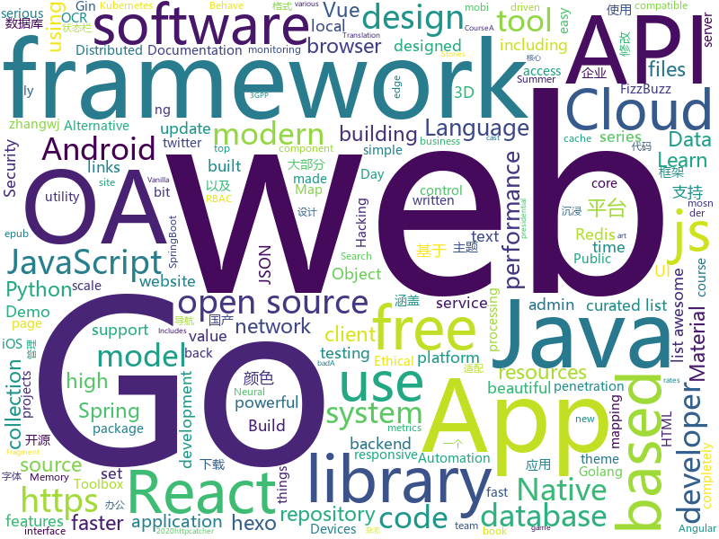

# 2020-07-04
See what the GitHub community is most excited about.

## python
+ [J.A.R.V.I.S](https://github.com/GauravSingh9356/J.A.R.V.I.S)(**70 stars today**): python powered Intelligent System
+ [awesome-discord-communities](https://github.com/mhxion/awesome-discord-communities)(**85 stars today**): A curated list of awesome Discord communities for programmers
+ [EasyOCR](https://github.com/JaidedAI/EasyOCR)(**155 stars today**): Ready-to-use OCR with 40+ languages supported including Chinese, Japanese, Korean and Thai
+ [cassandra-workshop-series](https://github.com/DataStax-Academy/cassandra-workshop-series)(**47 stars today**): All materials for the Cassandra Workshop Series in a single place
+ [summer-code-jam-2020-qualifier](https://github.com/python-discord/summer-code-jam-2020-qualifier)(**10 stars today**): Qualify for the PyDis Summer Code Jam 2020 by completing the task in this repository.
+ [geemap](https://github.com/giswqs/geemap)(**22 stars today**): A Python package for interactive mapping with Google Earth Engine, ipyleaflet, and ipywidgets
+ [free-python-games](https://github.com/grantjenks/free-python-games)(**35 stars today**): Free Python Games
+ [OpenPCDet](https://github.com/open-mmlab/OpenPCDet)(**48 stars today**): OpenPCDet Toolbox for LiDAR-based 3D Object Detection.
+ [vega](https://github.com/huawei-noah/vega)(**35 stars today**): AutoML tools chain
+ [pyTelegramBotAPI](https://github.com/eternnoir/pyTelegramBotAPI)(**10 stars today**): Python Telegram bot api.
+ [gg-shield](https://github.com/GitGuardian/gg-shield)(**82 stars today**): GitGuardian Shield : protect your secrets with GitGuardian
+ [rich](https://github.com/willmcgugan/rich)(**46 stars today**): Rich is a Python library for rich text and beautiful formatting in the terminal.
+ [MONAI](https://github.com/Project-MONAI/MONAI)(**14 stars today**): AI Toolkit for Healthcare Imaging
+ [DeepFaceLab](https://github.com/iperov/DeepFaceLab)(**55 stars today**): DeepFaceLab is the leading software for creating deepfakes.
+ [dka](https://github.com/micb25/dka)(**5 stars today**): Statistische Analyse und Visualisierung der täglichen Diagnoseschlüssel der deutschen COVID-19 Tracing-App (Corona-Warn-App).
+ [zulip](https://github.com/zulip/zulip)(**21 stars today**): Zulip server - powerful open source team chat
+ [provis](https://github.com/salesforce/provis)(**27 stars today**): Official code repository of "BERTology Meets Biology: Interpreting Attention in Protein Language Models."
+ [100-Days-Of-ML-Code](https://github.com/Avik-Jain/100-Days-Of-ML-Code)(**60 stars today**): 100 Days of ML Coding
+ [transformers](https://github.com/huggingface/transformers)(**103 stars today**): 🤗Transformers: State-of-the-art Natural Language Processing for Pytorch and TensorFlow 2.0.
+ [system-design-primer](https://github.com/donnemartin/system-design-primer)(**98 stars today**): Learn how to design large-scale systems. Prep for the system design interview. Includes Anki flashcards.
+ [fastapi](https://github.com/tiangolo/fastapi)(**47 stars today**): FastAPI framework, high performance, easy to learn, fast to code, ready for production
+ [botframework-sdk](https://github.com/microsoft/botframework-sdk)(**5 stars today**): Bot Framework provides the most comprehensive experience for building conversation applications.
+ [public-apis](https://github.com/public-apis/public-apis)(**145 stars today**): A collective list of free APIs for use in software and web development.
+ [tuya-convert](https://github.com/ct-Open-Source/tuya-convert)(**10 stars today**): A collection of scripts to flash Tuya IoT devices to alternative firmwares
+ [OpenNMT-py](https://github.com/OpenNMT/OpenNMT-py)(**14 stars today**): Open Source Neural Machine Translation in PyTorch

## java
+ [PHONK](https://github.com/victordiaz/PHONK)(**82 stars today**): PHONK is a self-contained creative scripting toolbox for new and old Android Devices
+ [easyexcel](https://github.com/alibaba/easyexcel)(**25 stars today**): 快速、简单避免OOM的java处理Excel工具
+ [questdb](https://github.com/questdb/questdb)(**35 stars today**): An open source SQL database designed to process time-series data, faster
+ [druid](https://github.com/alibaba/druid)(**20 stars today**): 阿里巴巴计算平台事业部出品，为监控而生的数据库连接池
+ [ImmersionBar](https://github.com/gyf-dev/ImmersionBar)(**11 stars today**): android 4.4以上沉浸式状态栏和沉浸式导航栏管理，适配横竖屏切换、刘海屏、软键盘弹出等问题，可以修改状态栏字体颜色和导航栏图标颜色，以及不可修改字体颜色手机的适配，适用于Activity、Fragment、DialogFragment、Dialog，PopupWindow，一句代码轻松实现，以及对bar的其他设置，详见README。简书请参考：http://www.jianshu.com/p/2a884e211a62
+ [hibernate-orm](https://github.com/hibernate/hibernate-orm)(**4 stars today**): Hibernate's core Object/Relational Mapping functionality
+ [nifi](https://github.com/apache/nifi)(**2 stars today**): Apache NiFi
+ [micrometer](https://github.com/micrometer-metrics/micrometer)(**6 stars today**): An application metrics facade for the most popular monitoring tools. Think SLF4J, but for metrics.
+ [SpringBootVulExploit](https://github.com/LandGrey/SpringBootVulExploit)(**17 stars today**): SpringBoot 相关漏洞学习资料，利用方法和技巧合集，黑盒安全评估 checklist
+ [geoserver](https://github.com/geoserver/geoserver)(**1 stars today**): Official GeoServer repository
+ [shardingsphere](https://github.com/apache/shardingsphere)(**10 stars today**): Distributed database middleware
+ [sodium-fabric](https://github.com/jellysquid3/sodium-fabric)(**7 stars today**): A Minecraft mod designed to improve frame rates and micro-stutter
+ [AndroidUtilCode](https://github.com/Blankj/AndroidUtilCode)(**16 stars today**): 🔥Android developers should collect the following utils(updating).
+ [hazelcast](https://github.com/hazelcast/hazelcast)(**6 stars today**): Open Source In-Memory Data Grid
+ [oshi](https://github.com/oshi/oshi)(**22 stars today**): Native Operating System and Hardware Information
+ [redisson](https://github.com/redisson/redisson)(**21 stars today**): Redisson - Redis Java client with features of In-Memory Data Grid. Over 50 Redis based Java objects and services: Set, Multimap, SortedSet, Map, List, Queue, Deque, Semaphore, Lock, AtomicLong, Map Reduce, Publish / Subscribe, Bloom filter, Spring Cache, Tomcat, Scheduler, JCache API, Hibernate, MyBatis, RPC, local cache ...
+ [springcloud-learning](https://github.com/macrozheng/springcloud-learning)(**10 stars today**): 一套涵盖大部分核心组件使用的Spring Cloud教程，包括Spring Cloud Alibaba及分布式事务Seata，基于Spring Cloud Greenwich及SpringBoot 2.1.7。20篇文章，篇篇精华，30个Demo，涵盖大部分应用场景。
+ [quarkus](https://github.com/quarkusio/quarkus)(**20 stars today**): Quarkus: Supersonic Subatomic Java.
+ [FizzBuzzEnterpriseEdition](https://github.com/EnterpriseQualityCoding/FizzBuzzEnterpriseEdition)(**17 stars today**): FizzBuzz Enterprise Edition is a no-nonsense implementation of FizzBuzz made by serious businessmen for serious business purposes.
+ [Leaf](https://github.com/Meituan-Dianping/Leaf)(**11 stars today**): Distributed ID Generate Service
+ [o2oa](https://github.com/o2oa/o2oa)(**34 stars today**): 开源OA系统 - 码云GVP|Java开源oa|企业OA办公平台|企业OA|协同办公OA|流程平台OA|O2OA|OA，支持国产麒麟操作系统和国产数据库（达梦、人大金仓），政务OA，军工信息化OA
+ [elasticsearch](https://github.com/elastic/elasticsearch)(**41 stars today**): Open Source, Distributed, RESTful Search Engine
+ [opentelemetry-java](https://github.com/open-telemetry/opentelemetry-java)(**4 stars today**): OpenTelemetry Java SDK
+ [react-native-camera](https://github.com/react-native-community/react-native-camera)(**5 stars today**): A Camera component for React Native. Also supports barcode scanning!
+ [antlr4](https://github.com/antlr/antlr4)(**12 stars today**): ANTLR (ANother Tool for Language Recognition) is a powerful parser generator for reading, processing, executing, or translating structured text or binary files.

## unknown
+ [Summer2021-Internships](https://github.com/Pitt-CSC/Summer2021-Internships)(**45 stars today**): Collection of Summer 2021 tech internships!
+ [PENTESTING-BIBLE](https://github.com/blaCCkHatHacEEkr/PENTESTING-BIBLE)(**94 stars today**): Updates to this repository will continue to arrive until the number of links reaches 10000 links & 10000 pdf files .Learn Ethical Hacking and penetration testing .hundreds of ethical hacking & penetration testing & red team & cyber security & computer science resources.
+ [1](https://github.com/6mao6/1)(**8 stars today**): 这里是直播平台永久回家页，有最新app下载地址。
+ [developer-roadmap](https://github.com/kamranahmedse/developer-roadmap)(**161 stars today**): Roadmap to becoming a web developer in 2020
+ [httpcatcher](https://github.com/pm936/httpcatcher)(**22 stars today**): httpcatcher json code
+ [You-Dont-Know-JS](https://github.com/getify/You-Dont-Know-JS)(**75 stars today**): A book series on JavaScript. @YDKJS on twitter.
+ [awesome-vue](https://github.com/vuejs/awesome-vue)(**38 stars today**): 🎉A curated list of awesome things related to Vue.js
+ [100-days-of-angular](https://github.com/angular-vietnam/100-days-of-angular)(**22 stars today**): Series độc quyền cung cấp bởi thành viên của Angular Vietnam về các chủ đề liên quan tới Angular trong vòng 100 ngày.
+ [tessdata](https://github.com/tesseract-ocr/tessdata)(**6 stars today**): Trained models with support for legacy and LSTM OCR engine
+ [SwiftUI-Cheat-Sheet](https://github.com/SimpleBoilerplates/SwiftUI-Cheat-Sheet)(**71 stars today**): SwiftUI 2.0 Cheat Sheet
+ [optifine](https://github.com/sp614x/optifine)(**9 stars today**): 
+ [Beginner-Network-Pentesting](https://github.com/hmaverickadams/Beginner-Network-Pentesting)(**8 stars today**): Notes for Beginner Network Pentesting Course
+ [CKAD-exercises](https://github.com/dgkanatsios/CKAD-exercises)(**7 stars today**): A set of exercises to prepare for Certified Kubernetes Application Developer exam by Cloud Native Computing Foundation
+ [the-economist-ebooks](https://github.com/hehonghui/the-economist-ebooks)(**7 stars today**): The Economist ebooks(epub, mobi format), update weekly. 经济学人、纽约客杂志电子版下载、订阅(kindle格式),支持epub、mobi格式, 每周更新
+ [gpt-3](https://github.com/openai/gpt-3)(**37 stars today**): GPT-3: Language Models are Few-Shot Learners
+ [awesome-javascript](https://github.com/sorrycc/awesome-javascript)(**21 stars today**): 🐢A collection of awesome browser-side JavaScript libraries, resources and shiny things.
+ [pylance-release](https://github.com/microsoft/pylance-release)(**63 stars today**): Documentation and issues for Pylance
+ [awesome-nextjs](https://github.com/unicodeveloper/awesome-nextjs)(**19 stars today**): 📔📚A curated list of awesome resources : books, videos, articles about using Next.js (A minimalistic framework for universal server-rendered React applications)
+ [weekly](https://github.com/dt-fe/weekly)(**12 stars today**): 前端精读周刊
+ [AKS](https://github.com/Azure/AKS)(**2 stars today**): Azure Kubernetes Service
+ [xiaozhi](https://github.com/qq449245884/xiaozhi)(**15 stars today**): 
+ [javascript-in-one-pic](https://github.com/coodict/javascript-in-one-pic)(**53 stars today**): Learn javascript in one picture.
+ [laravel-best-practices](https://github.com/alexeymezenin/laravel-best-practices)(**14 stars today**): Laravel best practices
+ [NeverSink-Filter](https://github.com/NeverSinkDev/NeverSink-Filter)(**6 stars today**): This is a lootfilter for the game "Path of Exile". It hides low value items, uses a markup-scheme and sounds to highlight expensive gear and is based on economy data mining.
+ [ML_for_SLA](https://github.com/JonathanLaneMcDonald/ML_for_SLA)(**31 stars today**): Training a neural network to isolate comprehensible input from unstructured text to aid vocabulary acquisition.

## javascript
+ [electron-typescript-react](https://github.com/diego3g/electron-typescript-react)(**58 stars today**): An Electron boilerplate including TypeScript, React, Jest and ESLint.
+ [responsively-app](https://github.com/manojVivek/responsively-app)(**588 stars today**): A modified web browser that helps in responsive web development. A web developer's must have dev-tool.
+ [breaking-bad-cast](https://github.com/bradtraversy/breaking-bad-cast)(**55 stars today**): App to show cast info for breaking bad
+ [jsonbase](https://github.com/Devs-Garden/jsonbase)(**308 stars today**): A database software completely built as JSON files in backend. A powerful, portable and simple database works on top of JSON files. It is like a database software, currently having basic CRUD operation features. You can use this as a backend for your ReST APIs as well. The software is completely free and opensource. We are coming up with new fea…
+ [awx](https://github.com/ansible/awx)(**9 stars today**): AWX Project
+ [material-ui](https://github.com/mui-org/material-ui)(**109 stars today**): React components for faster and easier web development. Build your own design system, or start with Material Design.
+ [elevator.js](https://github.com/tholman/elevator.js)(**139 stars today**): Finally, a "back to top" button that behaves like a real elevator.
+ [odoo](https://github.com/odoo/odoo)(**29 stars today**): Odoo. Open Source Apps To Grow Your Business.
+ [NodeBB](https://github.com/NodeBB/NodeBB)(**24 stars today**): Node.js based forum software built for the modern web
+ [react-native](https://github.com/facebook/react-native)(**54 stars today**): A framework for building native apps with React.
+ [vue](https://github.com/vuejs/vue)(**121 stars today**): 🖖Vue.js is a progressive, incrementally-adoptable JavaScript framework for building UI on the web.
+ [freeCodeCamp](https://github.com/freeCodeCamp/freeCodeCamp)(**66 stars today**): freeCodeCamp.org's open source codebase and curriculum. Learn to code at home.
+ [lodash](https://github.com/lodash/lodash)(**24 stars today**): A modern JavaScript utility library delivering modularity, performance, & extras.
+ [taro](https://github.com/NervJS/taro)(**148 stars today**): 开放式跨端跨框架解决方案，支持使用 React/Vue/Nerv 等框架来开发微信/京东/百度/支付宝/字节跳动/ QQ 小程序/H5 等应用。 https://taro.jd.com/
+ [quasar](https://github.com/quasarframework/quasar)(**33 stars today**): Quasar Framework - Build high-performance VueJS user interfaces in record time
+ [GreenTunnel](https://github.com/SadeghHayeri/GreenTunnel)(**24 stars today**): GreenTunnel is an anti-censorship utility designed to bypass the DPI system that is put in place by various ISPs to block access to certain websites.
+ [web-stories-wp](https://github.com/google/web-stories-wp)(**21 stars today**): Web Stories WordPress plugin
+ [three.js](https://github.com/mrdoob/three.js)(**53 stars today**): JavaScript 3D library.
+ [just-react](https://github.com/BetaSu/just-react)(**146 stars today**): 「React技术揭秘」 一本自顶向下，从理念到代码的源码分析书
+ [hexo-theme-yilia](https://github.com/litten/hexo-theme-yilia)(**6 stars today**): 一个简洁优雅的hexo主题 A simple and elegant theme for hexo.
+ [behave](https://github.com/mindedsecurity/behave)(**40 stars today**): Behave! A monitoring browser extension for pages acting as "bad boi"
+ [appium](https://github.com/appium/appium)(**14 stars today**): 📱Automation for iOS, Android, and Windows Apps.
+ [blog](https://github.com/tailwindcss/blog)(**13 stars today**): 
+ [samples](https://github.com/webrtc/samples)(**13 stars today**): WebRTC Web demos and samples
+ [tween.js](https://github.com/tweenjs/tween.js)(**4 stars today**): Javascript tweening engine

## html
+ [tabler-icons](https://github.com/tabler/tabler-icons)(**167 stars today**): A set of over 550 free MIT-licensed high-quality SVG icons for you to use in your web projects.
+ [speedlify](https://github.com/zachleat/speedlify)(**33 stars today**): Benchmark sites over time
+ [chatcord](https://github.com/bradtraversy/chatcord)(**7 stars today**): Realtime chat app with rooms
+ [HevORT](https://github.com/MirageC79/HevORT)(**8 stars today**): Advanced DIY 3D Printer
+ [django-grappelli](https://github.com/sehmaschine/django-grappelli)(**10 stars today**): A jazzy skin for the Django Admin-Interface (official repository).
+ [Tasmota](https://github.com/arendst/Tasmota)(**17 stars today**): Alternative firmware for ESP8266 with easy configuration using webUI, OTA updates, automation using timers or rules, expandability and entirely local control over MQTT, HTTP, Serial or KNX. Full documentation at
+ [FFCSonTheGo](https://github.com/vatz88/FFCSonTheGo)(**14 stars today**): FFCS course registration made hassle free for VITians. Search courses and visualize the timetable on the go!
+ [zepto](https://github.com/madrobby/zepto)(**7 stars today**): Zepto.js is a minimalist JavaScript library for modern browsers, with a jQuery-compatible API
+ [tabler](https://github.com/tabler/tabler)(**16 stars today**): Tabler is free and open-source HTML Dashboard UI Kit built on Bootstrap
+ [website](https://github.com/serpent-linux/website)(**14 stars today**): 
+ [wpt](https://github.com/web-platform-tests/wpt)(**3 stars today**): Test suites for Web platform specs — including WHATWG, W3C, and others
+ [JavaScript30](https://github.com/wesbos/JavaScript30)(**9 stars today**): 30 Day Vanilla JS Challenge
+ [quicklink](https://github.com/GoogleChromeLabs/quicklink)(**8 stars today**): ⚡️Faster subsequent page-loads by prefetching in-viewport links during idle time
+ [1-pixel-wealth](https://github.com/MKorostoff/1-pixel-wealth)(**7 stars today**): 
+ [hugo-academic](https://github.com/gcushen/hugo-academic)(**11 stars today**): 📝The website builder for Hugo. Build and deploy a beautiful website in minutes!
+ [openwrt-packages](https://github.com/kenzok8/openwrt-packages)(**9 stars today**): openwet常用软件包
+ [twemoji](https://github.com/twitter/twemoji)(**21 stars today**): Emoji for everyone. https://twemoji.twitter.com/
+ [webdevbootcamp](https://github.com/nax3t/webdevbootcamp)(**5 stars today**): All source code for back-end projects from the Web Developer Bootcamp
+ [flutter-in-action](https://github.com/flutterchina/flutter-in-action)(**8 stars today**): 《Flutter实战》电子书
+ [html](https://github.com/whatwg/html)(**7 stars today**): HTML Standard
+ [ASVS](https://github.com/OWASP/ASVS)(**9 stars today**): Application Security Verification Standard
+ [awesome-modern-cpp](https://github.com/rigtorp/awesome-modern-cpp)(**11 stars today**): A collection of resources on modern C++
+ [hexo-theme-matery](https://github.com/blinkfox/hexo-theme-matery)(**9 stars today**): A beautiful hexo blog theme with material design and responsive design.一个基于材料设计和响应式设计而成的全面、美观的Hexo主题。国内访问：http://blinkfox.com
+ [us-potus-model](https://github.com/TheEconomist/us-potus-model)(**11 stars today**): Code for a dynamic multilevel Bayesian model to predict US presidential elections. Written in R and Stan.
+ [coreui-free-bootstrap-admin-template](https://github.com/coreui/coreui-free-bootstrap-admin-template)(**7 stars today**): CoreUI is free bootstrap admin template

## go
+ [chat](https://github.com/tinode/chat)(**162 stars today**): Instant messaging platform. Backend in Go. Clients: Swift iOS, Java Android, JS webapp, scriptable command line; chatbots
+ [go-admin](https://github.com/wenjianzhang/go-admin)(**47 stars today**): 基于Gin + Vue + Element UI的前后端分离权限管理系统脚手架（包含了：基础用户管理功能，jwt鉴权，代码生成器，RBAC资源控制，表单构建等）文档：http://doc.zhangwj.com/go-admin-site/ Demo： http://www.zhangwj.com/#/login
+ [ultimate-go](https://github.com/hoanhan101/ultimate-go)(**341 stars today**): Ultimate Go study guide
+ [trubka](https://github.com/xitonix/trubka)(**56 stars today**): A CLI tool for Kafka
+ [go-interface-examples](https://github.com/Evertras/go-interface-examples)(**35 stars today**): 
+ [tailscale](https://github.com/tailscale/tailscale)(**12 stars today**): The easiest, most secure way to use WireGuard and 2FA.
+ [redis](https://github.com/go-redis/redis)(**14 stars today**): Type-safe Redis client for Golang
+ [filestash](https://github.com/mickael-kerjean/filestash)(**39 stars today**): 🦄A modern web client for SFTP, S3, FTP, WebDAV, Git, Minio, LDAP, CalDAV, CardDAV, Mysql, Backblaze, ...
+ [casbin](https://github.com/casbin/casbin)(**16 stars today**): An authorization library that supports access control models like ACL, RBAC, ABAC in Golang
+ [badger](https://github.com/dgraph-io/badger)(**8 stars today**): Fast key-value DB in Go.
+ [cosmos-sdk](https://github.com/cosmos/cosmos-sdk)(**4 stars today**): ⛓️A Framework for Building High Value Public Blockchains✨
+ [kubernetes](https://github.com/kubernetes/kubernetes)(**63 stars today**): Production-Grade Container Scheduling and Management
+ [iris](https://github.com/kataras/iris)(**24 stars today**): 感谢中国开发者 - https://bit.ly/謝謝 | The fastest community-driven web framework for Go. Socket-Sharding, gRPC, Automatic HTTPS with Public Domain, MVC, Sessions, Caching, Versioning API, Problem API, Websocket, Dependency Injection and more. Fully compatible with the standard library and 3rd-party middleware packages. | https://bit.ly/iriscandothat1 | h…
+ [bettercap](https://github.com/bettercap/bettercap)(**9 stars today**): The Swiss Army knife for 802.11, BLE and Ethernet networks reconnaissance and MITM attacks.
+ [sarama](https://github.com/Shopify/sarama)(**9 stars today**): Sarama is a Go library for Apache Kafka 0.8, and up.
+ [mosn](https://github.com/mosn/mosn)(**11 stars today**): MOSN is a cloud native proxy for edge or service mesh. https://mosn.io
+ [traefik](https://github.com/containous/traefik)(**29 stars today**): The Cloud Native Edge Router
+ [gin](https://github.com/gin-gonic/gin)(**63 stars today**): Gin is a HTTP web framework written in Go (Golang). It features a Martini-like API with much better performance -- up to 40 times faster. If you need smashing performance, get yourself some Gin.
+ [goreleaser](https://github.com/goreleaser/goreleaser)(**9 stars today**): Deliver Go binaries as fast and easily as possible
+ [go](https://github.com/golang/go)(**66 stars today**): The Go programming language
+ [fyne](https://github.com/fyne-io/fyne)(**13 stars today**): Cross platform GUI in Go based on Material Design
+ [serving](https://github.com/knative/serving)(**7 stars today**): Kubernetes-based, scale-to-zero, request-driven compute
+ [cilium](https://github.com/cilium/cilium)(**7 stars today**): API-aware Networking and Security using eBPF and XDP
+ [kind](https://github.com/kubernetes-sigs/kind)(**12 stars today**): Kubernetes IN Docker - local clusters for testing Kubernetes
+ [free5gc](https://github.com/free5gc/free5gc)(**4 stars today**): Open source 5G core network base on 3GPP R15

## WordCloud

