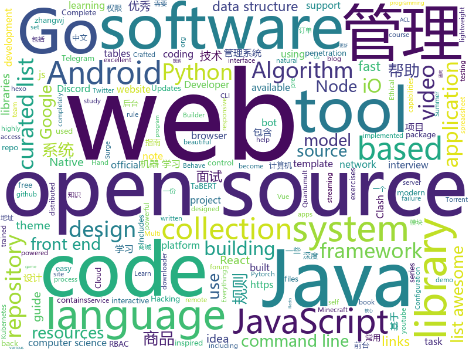

# 2020-07-05
See what the GitHub community is most excited about.

## python
+ [Python](https://github.com/TheAlgorithms/Python)(**157 stars today**): All Algorithms implemented in Python
+ [EasyOCR](https://github.com/JaidedAI/EasyOCR)(**195 stars today**): Ready-to-use OCR with 40+ languages supported including Chinese, Japanese, Korean and Thai
+ [system-design-primer](https://github.com/donnemartin/system-design-primer)(**167 stars today**): Learn how to design large-scale systems. Prep for the system design interview. Includes Anki flashcards.
+ [guietta](https://github.com/alfiopuglisi/guietta)(**872 stars today**): 
+ [allennlp](https://github.com/allenai/allennlp)(**29 stars today**): An open-source NLP research library, built on PyTorch.
+ [public-apis](https://github.com/public-apis/public-apis)(**167 stars today**): A collective list of free APIs for use in software and web development.
+ [awesome-python](https://github.com/vinta/awesome-python)(**102 stars today**): A curated list of awesome Python frameworks, libraries, software and resources
+ [awesome-discord-communities](https://github.com/mhxion/awesome-discord-communities)(**113 stars today**): A curated list of awesome Discord communities for programmers
+ [youtube-dl](https://github.com/ytdl-org/youtube-dl)(**103 stars today**): Command-line program to download videos from YouTube.com and other video sites
+ [anki](https://github.com/ankitects/anki)(**12 stars today**): Anki for desktop computers
+ [DeepLearning.ai-Summary](https://github.com/mbadry1/DeepLearning.ai-Summary)(**8 stars today**): This repository contains my personal notes and summaries on DeepLearning.ai specialization courses. I've enjoyed every little bit of the course hope you enjoy my notes too.
+ [summer-code-jam-2020-qualifier](https://github.com/python-discord/summer-code-jam-2020-qualifier)(**17 stars today**): Qualify for the PyDis Summer Code Jam 2020 by completing the task in this repository.
+ [awesome-python-login-model](https://github.com/Kr1s77/awesome-python-login-model)(**24 stars today**): 😮python模拟登陆一些大型网站，还有一些简单的爬虫，希望对你们有所帮助❤️，如果喜欢记得给个star哦🌟
+ [skywater-pdk](https://github.com/google/skywater-pdk)(**42 stars today**): Open source process design kit for usage with SkyWater Technology Foundry's 130nm node.
+ [FavFreak](https://github.com/devanshbatham/FavFreak)(**93 stars today**): Making Favicon.ico based Recon Great again !
+ [DeepFaceLab](https://github.com/iperov/DeepFaceLab)(**62 stars today**): DeepFaceLab is the leading software for creating deepfakes.
+ [fast-transformers](https://github.com/idiap/fast-transformers)(**61 stars today**): Pytorch library for fast transformer implementations
+ [zulip](https://github.com/zulip/zulip)(**53 stars today**): Zulip server - powerful open source team chat
+ [gym](https://github.com/openai/gym)(**31 stars today**): A toolkit for developing and comparing reinforcement learning algorithms.
+ [J.A.R.V.I.S](https://github.com/GauravSingh9356/J.A.R.V.I.S)(**95 stars today**): python powered Intelligent System
+ [TaBERT](https://github.com/facebookresearch/TaBERT)(**36 stars today**): This repository contains source code for the TaBERT model, a pre-trained language model for learning joint representations of natural language utterances and (semi-)structured tables for semantic parsing. TaBERT is pre-trained on a massive corpus of 26M Web tables and their associated natural language context, and could be used as a drop-in repl…
+ [calibre](https://github.com/kovidgoyal/calibre)(**21 stars today**): The official source code repository for the calibre ebook manager
+ [youtube-dl-gui](https://github.com/MrS0m30n3/youtube-dl-gui)(**16 stars today**): A cross platform front-end GUI of the popular youtube-dl written in wxPython.
+ [Telegram_coin_bot](https://github.com/Black-Triangle-code/Telegram_coin_bot)(**12 stars today**): Bot for automatic tasks CoinClick_bot
+ [geemap](https://github.com/giswqs/geemap)(**36 stars today**): A Python package for interactive mapping with Google Earth Engine, ipyleaflet, and ipywidgets

## java
+ [mall](https://github.com/macrozheng/mall)(**291 stars today**): mall项目是一套电商系统，包括前台商城系统及后台管理系统，基于SpringBoot+MyBatis实现，采用Docker容器化部署。 前台商城系统包含首页门户、商品推荐、商品搜索、商品展示、购物车、订单流程、会员中心、客户服务、帮助中心等模块。 后台管理系统包含商品管理、订单管理、会员管理、促销管理、运营管理、内容管理、统计报表、财务管理、权限管理、设置等模块。
+ [NewPipe](https://github.com/TeamNewPipe/NewPipe)(**22 stars today**): A libre lightweight streaming front-end for Android.
+ [Arduino](https://github.com/arduino/Arduino)(**10 stars today**): open-source electronics platform
+ [questdb](https://github.com/questdb/questdb)(**57 stars today**): An open source SQL database designed to process time-series data, faster
+ [GitHub-Chinese-Top-Charts](https://github.com/kon9chunkit/GitHub-Chinese-Top-Charts)(**119 stars today**): 🇨🇳GitHub中文排行榜，帮助你发现高分优秀中文项目、更高效地吸收国人的优秀经验成果；榜单每周更新一次，敬请关注！
+ [Telegram](https://github.com/DrKLO/Telegram)(**22 stars today**): Telegram for Android source
+ [MusicBot](https://github.com/jagrosh/MusicBot)(**6 stars today**): 🎶A Discord music bot that's easy to set up and run yourself!
+ [interviews](https://github.com/kdn251/interviews)(**61 stars today**): Everything you need to know to get the job.
+ [bigbluebutton](https://github.com/bigbluebutton/bigbluebutton)(**17 stars today**): Complete open source web conferencing system.
+ [Hystrix](https://github.com/Netflix/Hystrix)(**9 stars today**): Hystrix is a latency and fault tolerance library designed to isolate points of access to remote systems, services and 3rd party libraries, stop cascading failure and enable resilience in complex distributed systems where failure is inevitable.
+ [uid-generator](https://github.com/baidu/uid-generator)(**19 stars today**): UniqueID generator
+ [amidst](https://github.com/toolbox4minecraft/amidst)(**8 stars today**): Advanced Minecraft Interface and Data/Structure Tracking
+ [halo](https://github.com/halo-dev/halo)(**41 stars today**): ✍An excellent open source blog publishing application. | 一个优秀的开源博客发布应用。
+ [Leaf](https://github.com/Meituan-Dianping/Leaf)(**22 stars today**): Distributed ID Generate Service
+ [XQuickEnergy](https://github.com/pansong291/XQuickEnergy)(**11 stars today**): 快速收取蚂蚁森林能量
+ [Apktool](https://github.com/iBotPeaches/Apktool)(**10 stars today**): A tool for reverse engineering Android apk files
+ [hive](https://github.com/apache/hive)(**3 stars today**): Apache Hive
+ [EhViewer](https://github.com/seven332/EhViewer)(**12 stars today**): [DEPRECATED] An Unofficial E-Hentai Application for Android
+ [quickstart-android](https://github.com/firebase/quickstart-android)(**10 stars today**): Firebase Quickstart Samples for Android
+ [CtCI-6th-Edition](https://github.com/careercup/CtCI-6th-Edition)(**15 stars today**): Cracking the Coding Interview 6th Ed. Solutions
+ [oshi](https://github.com/oshi/oshi)(**29 stars today**): Native Operating System and Hardware Information
+ [checkstyle](https://github.com/checkstyle/checkstyle)(**4 stars today**): Checkstyle is a development tool to help programmers write Java code that adheres to a coding standard. By default it supports the Google Java Style Guide and Sun Code Conventions, but is highly configurable. It can be invoked with an ANT task and a command line program.
+ [Algorithms](https://github.com/williamfiset/Algorithms)(**28 stars today**): A collection of algorithms and data structures
+ [JavaGuide](https://github.com/Snailclimb/JavaGuide)(**226 stars today**): 「Java学习+面试指南」一份涵盖大部分Java程序员所需要掌握的核心知识。
+ [MCinaBox](https://github.com/longjunyu2/MCinaBox)(**5 stars today**): MCinaBox - A Minecraft Java Edition Launcher on Android

## unknown
+ [You-Dont-Know-JS](https://github.com/getify/You-Dont-Know-JS)(**134 stars today**): A book series on JavaScript. @YDKJS on twitter.
+ [pumpkin-book](https://github.com/datawhalechina/pumpkin-book)(**117 stars today**): 《机器学习》（西瓜书）公式推导解析，在线阅读地址：https://datawhalechina.github.io/pumpkin-book
+ [app-ideas](https://github.com/florinpop17/app-ideas)(**159 stars today**): A Collection of application ideas which can be used to improve your coding skills.
+ [coding-interview-university](https://github.com/jwasham/coding-interview-university)(**292 stars today**): A complete computer science study plan to become a software engineer.
+ [COVID-19](https://github.com/CSSEGISandData/COVID-19)(**48 stars today**): Novel Coronavirus (COVID-19) Cases, provided by JHU CSSE
+ [morphogenesis-resources](https://github.com/jasonwebb/morphogenesis-resources)(**42 stars today**): Comprehensive list of resources on the topic of digital morphogenesis (the creation of form through code). Includes links to major articles, code repos, creative projects, books, software, and more.
+ [free-programming-books](https://github.com/EbookFoundation/free-programming-books)(**175 stars today**): 📚Freely available programming books
+ [gitignore](https://github.com/github/gitignore)(**132 stars today**): A collection of useful .gitignore templates
+ [DeepLearning-500-questions](https://github.com/scutan90/DeepLearning-500-questions)(**43 stars today**): 深度学习500问，以问答形式对常用的概率知识、线性代数、机器学习、深度学习、计算机视觉等热点问题进行阐述，以帮助自己及有需要的读者。 全书分为18个章节，50余万字。由于水平有限，书中不妥之处恳请广大读者批评指正。 未完待续............ 如有意合作，联系scutjy2015@163.com 版权所有，违权必究 Tan 2018.06
+ [PENTESTING-BIBLE](https://github.com/blaCCkHatHacEEkr/PENTESTING-BIBLE)(**168 stars today**): Updates to this repository will continue to arrive until the number of links reaches 10000 links & 10000 pdf files .Learn Ethical Hacking and penetration testing .hundreds of ethical hacking & penetration testing & red team & cyber security & computer science resources.
+ [ru-test-assignments](https://github.com/Hexlet/ru-test-assignments)(**8 stars today**): Тестовые задания для самостоятельного выполнения от разных it компаний
+ [httpcatcher](https://github.com/pm936/httpcatcher)(**25 stars today**): httpcatcher json code
+ [market-toolkit](https://github.com/ckz8780/market-toolkit)(**45 stars today**): A collection of stock market resources and tools
+ [JavaInterview](https://github.com/OUYANGSIHAI/JavaInterview)(**23 stars today**): 【Java面试+Java后端技术学习指南】：一份通向理想互联网公司的面试指南，包括 Java，技术面试必备基础知识、Leetcode、计算机操作系统、计算机网络、系统设计、分布式、数据库（MySQL、Redis）、Java 项目实战等
+ [Summer2021-Internships](https://github.com/Pitt-CSC/Summer2021-Internships)(**107 stars today**): Collection of Summer 2021 tech internships!
+ [computer-science](https://github.com/ossu/computer-science)(**129 stars today**): 🎓Path to a free self-taught education in Computer Science!
+ [CKAD-exercises](https://github.com/dgkanatsios/CKAD-exercises)(**14 stars today**): A set of exercises to prepare for Certified Kubernetes Application Developer exam by Cloud Native Computing Foundation
+ [Beginner-Network-Pentesting](https://github.com/hmaverickadams/Beginner-Network-Pentesting)(**11 stars today**): Notes for Beginner Network Pentesting Course
+ [pylance-release](https://github.com/microsoft/pylance-release)(**89 stars today**): Documentation and issues for Pylance
+ [IntelliJ-IDEA-Tutorial](https://github.com/judasn/IntelliJ-IDEA-Tutorial)(**26 stars today**): IntelliJ IDEA 简体中文专题教程
+ [android](https://github.com/LineageOS/android)(**5 stars today**): 
+ [Rules](https://github.com/lhie1/Rules)(**12 stars today**): 
+ [gpt-3](https://github.com/openai/gpt-3)(**56 stars today**): GPT-3: Language Models are Few-Shot Learners
+ [SS-Rule-Snippet](https://github.com/Hackl0us/SS-Rule-Snippet)(**16 stars today**): 搜集、整理、维护 Surge / Quantumult / Shadowrocket / Surfboard / clash(X) 实用规则。
+ [awesome-quant](https://github.com/wilsonfreitas/awesome-quant)(**22 stars today**): A curated list of insanely awesome libraries, packages and resources for Quants (Quantitative Finance)

## javascript
+ [jexcel](https://github.com/paulhodel/jexcel)(**98 stars today**): jExcel is a lightweight vanilla javascript plugin to create amazing web-based interactive tables and spreadsheets compatible with Excel or any other spreadsheet software.
+ [electron-typescript-react](https://github.com/diego3g/electron-typescript-react)(**143 stars today**): An Electron boilerplate including TypeScript, React, Jest and ESLint.
+ [discord.js](https://github.com/discordjs/discord.js)(**22 stars today**): A powerful JavaScript library for interacting with the Discord API
+ [elevator.js](https://github.com/tholman/elevator.js)(**151 stars today**): Finally, a "back to top" button that behaves like a real elevator.
+ [joplin](https://github.com/laurent22/joplin)(**47 stars today**): Joplin - an open source note taking and to-do application with synchronization capabilities for Windows, macOS, Linux, Android and iOS. Forum: https://discourse.joplinapp.org/
+ [javascript-algorithms](https://github.com/trekhleb/javascript-algorithms)(**102 stars today**): 📝Algorithms and data structures implemented in JavaScript with explanations and links to further readings
+ [freeCodeCamp](https://github.com/freeCodeCamp/freeCodeCamp)(**126 stars today**): freeCodeCamp.org's open source codebase and curriculum. Learn to code at home.
+ [keen-slider](https://github.com/rcbyr/keen-slider)(**147 stars today**): The HTML touch slider carousel with the most native feeling
+ [Zettlr](https://github.com/Zettlr/Zettlr)(**331 stars today**): A Markdown Editor for the 21st century.
+ [NodeBB](https://github.com/NodeBB/NodeBB)(**30 stars today**): Node.js based forum software built for the modern web
+ [just-react](https://github.com/BetaSu/just-react)(**243 stars today**): 「React技术揭秘」 一本自顶向下，从理念到代码的源码分析书
+ [responsively-app](https://github.com/manojVivek/responsively-app)(**1,025 stars today**): A modified web browser that helps in responsive web development. A web developer's must have dev-tool.
+ [blog](https://github.com/tailwindcss/blog)(**16 stars today**): 
+ [html5-boilerplate](https://github.com/h5bp/html5-boilerplate)(**39 stars today**): A professional front-end template for building fast, robust, and adaptable web apps or sites.
+ [realworld](https://github.com/gothinkster/realworld)(**91 stars today**): "The mother of all demo apps" — Exemplary fullstack Medium.com clone powered by React, Angular, Node, Django, and many more🏅
+ [behave](https://github.com/mindedsecurity/behave)(**52 stars today**): Behave! A monitoring browser extension for pages acting as "bad boi"
+ [Script](https://github.com/NobyDa/Script)(**28 stars today**): This project is based on the scripting capabilities of two excellent iOS proxy tools, Quantumult X or Surge.
+ [alpine](https://github.com/alpinejs/alpine)(**49 stars today**): A rugged, minimal framework for composing JavaScript behavior in your markup.
+ [opensource.guide](https://github.com/github/opensource.guide)(**9 stars today**): 📚Community guides for open source creators
+ [grapesjs](https://github.com/artf/grapesjs)(**21 stars today**): Free and Open source Web Builder Framework. Next generation tool for building templates without coding
+ [juice-shop](https://github.com/bkimminich/juice-shop)(**13 stars today**): OWASP Juice Shop: Probably the most modern and sophisticated insecure web application
+ [WebGL-Fluid-Simulation](https://github.com/PavelDoGreat/WebGL-Fluid-Simulation)(**20 stars today**): Play with fluids in your browser (works even on mobile)
+ [awesome-mac](https://github.com/jaywcjlove/awesome-mac)(**48 stars today**):  Now we have become very big, Different from the original idea. Collect premium software in various categories.
+ [RSSHub](https://github.com/DIYgod/RSSHub)(**27 stars today**): 🍰Everything is RSSible
+ [iptv](https://github.com/iptv-org/iptv)(**60 stars today**): Collection of 8000+ publicly available IPTV channels from all over the world

## html
+ [Tasmota](https://github.com/arendst/Tasmota)(**26 stars today**): Alternative firmware for ESP8266 with easy configuration using webUI, OTA updates, automation using timers or rules, expandability and entirely local control over MQTT, HTTP, Serial or KNX. Full documentation at
+ [hugo-academic](https://github.com/gcushen/hugo-academic)(**17 stars today**): 📝The website builder for Hugo. Build and deploy a beautiful website in minutes!
+ [xiaojiejie](https://github.com/JMWpower/xiaojiejie)(**25 stars today**): 
+ [Front-end-Developer-Interview-Questions](https://github.com/h5bp/Front-end-Developer-Interview-Questions)(**107 stars today**): A list of helpful front-end related questions you can use to interview potential candidates, test yourself or completely ignore.
+ [fonts](https://github.com/google/fonts)(**14 stars today**): Font files available from Google Fonts
+ [GDIndex](https://github.com/maple3142/GDIndex)(**10 stars today**): A Google Drive Index built with Vue Running on CloudFlare Workers
+ [shellphish](https://github.com/suljot/shellphish)(**5 stars today**): Phishing Tool for Instagram, Facebook, Twitter, Snapchat, Github
+ [luci-app-clash](https://github.com/frainzy1477/luci-app-clash)(**6 stars today**): Luci interface for Clash Openwrt
+ [awesome-competitive-programming](https://github.com/lnishan/awesome-competitive-programming)(**17 stars today**): 💎A curated list of awesome Competitive Programming, Algorithm and Data Structure resources
+ [node-ytdl-core](https://github.com/fent/node-ytdl-core)(**2 stars today**): YouTube video downloader in javascript.
+ [HevORT](https://github.com/MirageC79/HevORT)(**14 stars today**): Advanced DIY 3D Printer
+ [Coursera-ML-AndrewNg-Notes](https://github.com/fengdu78/Coursera-ML-AndrewNg-Notes)(**34 stars today**): 吴恩达老师的机器学习课程个人笔记
+ [ACL4SSR](https://github.com/ACL4SSR/ACL4SSR)(**15 stars today**): SSR 去广告ACL规则/SS完整GFWList规则/Clash规则碎片，Telegram频道订阅地址
+ [dynaconf](https://github.com/rochacbruno/dynaconf)(**7 stars today**): Configuration Management for Python🔧⚙
+ [windmill-dashboard](https://github.com/estevanmaito/windmill-dashboard)(**12 stars today**): 📊A multi theme, completely accessible, ready for production dashboard.
+ [blog_os](https://github.com/phil-opp/blog_os)(**12 stars today**): Writing an OS in Rust
+ [awesome-piracy](https://github.com/Igglybuff/awesome-piracy)(**25 stars today**): A curated list of awesome warez and piracy links
+ [hexo-theme-matery](https://github.com/blinkfox/hexo-theme-matery)(**16 stars today**): A beautiful hexo blog theme with material design and responsive design.一个基于材料设计和响应式设计而成的全面、美观的Hexo主题。国内访问：http://blinkfox.com
+ [zenbot](https://github.com/DeviaVir/zenbot)(**6 stars today**): Zenbot is a command-line cryptocurrency trading bot using Node.js and MongoDB.
+ [Dism-Multi-language](https://github.com/Chuyu-Team/Dism-Multi-language)(**6 stars today**): Dism++ Multi-language Support & BUG Report
+ [learning-area](https://github.com/mdn/learning-area)(**7 stars today**): Github repo for the MDN Learning Area.
+ [web-moderno](https://github.com/cod3rcursos/web-moderno)(**13 stars today**): 
+ [webdevbootcamp](https://github.com/nax3t/webdevbootcamp)(**8 stars today**): All source code for back-end projects from the Web Developer Bootcamp
+ [openwrt-packages](https://github.com/kenzok8/openwrt-packages)(**10 stars today**): openwet常用软件包
+ [jekflix-template](https://github.com/thiagorossener/jekflix-template)(**4 stars today**): A Jekyll theme inspired by Netflix.🎬

## go
+ [chat](https://github.com/tinode/chat)(**289 stars today**): Instant messaging platform. Backend in Go. Clients: Swift iOS, Java Android, JS webapp, scriptable command line; chatbots
+ [learngo](https://github.com/inancgumus/learngo)(**36 stars today**): 1000+ Hand-Crafted Go Examples, Exercises, and Quizzes
+ [fiber](https://github.com/gofiber/fiber)(**110 stars today**): ⚡️Fiber is an Express inspired web framework written in Go with☕️
+ [bettercap](https://github.com/bettercap/bettercap)(**14 stars today**): The Swiss Army knife for 802.11, BLE and Ethernet networks reconnaissance and MITM attacks.
+ [clash](https://github.com/Dreamacro/clash)(**70 stars today**): A rule-based tunnel in Go.
+ [annie](https://github.com/iawia002/annie)(**78 stars today**): 👾Fast, simple and clean video downloader
+ [f1viewer](https://github.com/SoMuchForSubtlety/f1viewer)(**28 stars today**): 🏎️TUI for F1TV
+ [cli](https://github.com/cli/cli)(**34 stars today**): GitHub’s official command line tool
+ [tailscale](https://github.com/tailscale/tailscale)(**13 stars today**): The easiest, most secure way to use WireGuard and 2FA.
+ [ultimate-go](https://github.com/hoanhan101/ultimate-go)(**461 stars today**): Ultimate Go study guide
+ [go-admin](https://github.com/wenjianzhang/go-admin)(**62 stars today**): 基于Gin + Vue + Element UI的前后端分离权限管理系统脚手架（包含了：基础用户管理功能，jwt鉴权，代码生成器，RBAC资源控制，表单构建等）文档：http://doc.zhangwj.com/go-admin-site/ Demo： http://www.zhangwj.com/#/login
+ [go-git](https://github.com/go-git/go-git)(**16 stars today**): A highly extensible Git implementation in pure Go.
+ [eksctl](https://github.com/weaveworks/eksctl)(**4 stars today**): The official CLI for Amazon EKS
+ [go-interface-examples](https://github.com/Evertras/go-interface-examples)(**46 stars today**): 
+ [hugo](https://github.com/gohugoio/hugo)(**78 stars today**): The world’s fastest framework for building websites.
+ [cloud-torrent](https://github.com/jpillora/cloud-torrent)(**8 stars today**): ☁️Cloud Torrent: a self-hosted remote torrent client
+ [httprobe](https://github.com/tomnomnom/httprobe)(**12 stars today**): Take a list of domains and probe for working HTTP and HTTPS servers
+ [trubka](https://github.com/xitonix/trubka)(**69 stars today**): A CLI tool for Kafka
+ [pixel](https://github.com/faiface/pixel)(**7 stars today**): A hand-crafted 2D game library in Go
+ [v2ray-core](https://github.com/v2ray/v2ray-core)(**68 stars today**): A platform for building proxies to bypass network restrictions.
+ [terraform-provider-azuredevops](https://github.com/terraform-providers/terraform-provider-azuredevops)(**5 stars today**): Terraform Azure DevOps provider
+ [livego](https://github.com/gwuhaolin/livego)(**15 stars today**): live video streaming server in golang
+ [goreleaser](https://github.com/goreleaser/goreleaser)(**13 stars today**): Deliver Go binaries as fast and easily as possible
+ [casbin](https://github.com/casbin/casbin)(**22 stars today**): An authorization library that supports access control models like ACL, RBAC, ABAC in Golang
+ [minio](https://github.com/minio/minio)(**33 stars today**): High Performance, Kubernetes Native Object Storage

## WordCloud

