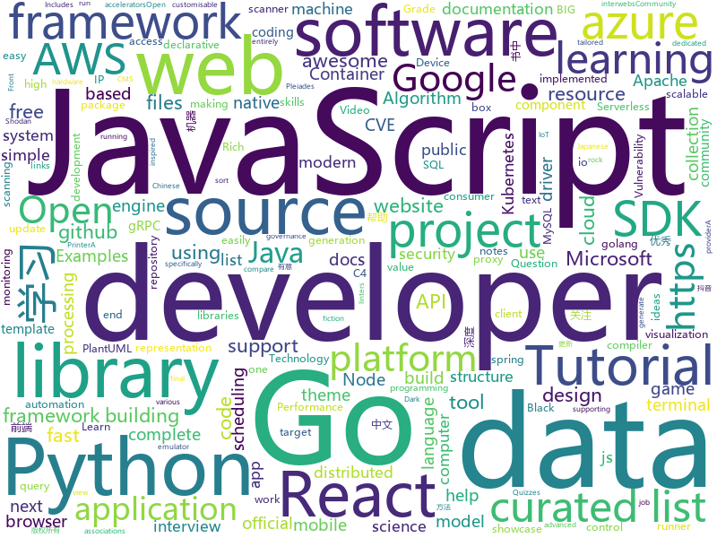

# 2020-07-07
See what the GitHub community is most excited about.

## python
+ [rich](https://github.com/willmcgugan/rich)(**1,061 stars today**): Rich is a Python library for rich text and beautiful formatting in the terminal.
+ [Python](https://github.com/TheAlgorithms/Python)(**405 stars today**): All Algorithms implemented in Python
+ [texthero](https://github.com/jbesomi/texthero)(**206 stars today**): Text preprocessing, representation and visualization from zero to hero.
+ [hackingtool](https://github.com/Z4nzu/hackingtool)(**31 stars today**): ALL IN ONE Hacking Tool For Hackers
+ [EasyOCR](https://github.com/JaidedAI/EasyOCR)(**279 stars today**): Ready-to-use OCR with 40+ languages supported including Chinese, Japanese, Korean and Thai
+ [sweetviz](https://github.com/fbdesignpro/sweetviz)(**60 stars today**): Visualize and compare datasets, target values and associations, with one line of code.
+ [awesome-machine-learning](https://github.com/josephmisiti/awesome-machine-learning)(**79 stars today**): A curated list of awesome Machine Learning frameworks, libraries and software.
+ [skywater-pdk](https://github.com/google/skywater-pdk)(**57 stars today**): Open source process design kit for usage with SkyWater Technology Foundry's 130nm node.
+ [system-design-primer](https://github.com/donnemartin/system-design-primer)(**147 stars today**): Learn how to design large-scale systems. Prep for the system design interview. Includes Anki flashcards.
+ [isort](https://github.com/timothycrosley/isort)(**10 stars today**): A Python utility / library to sort imports.
+ [compose](https://github.com/docker/compose)(**14 stars today**): Define and run multi-container applications with Docker
+ [ray](https://github.com/ray-project/ray)(**29 stars today**): A fast and simple framework for building and running distributed applications. Ray is packaged with RLlib, a scalable reinforcement learning library, and Tune, a scalable hyperparameter tuning library.
+ [black](https://github.com/psf/black)(**16 stars today**): The uncompromising Python code formatter
+ [dataprep](https://github.com/sfu-db/dataprep)(**61 stars today**): Dataprep: Data Preparation in Python
+ [CVE-2020-5902-Scanner](https://github.com/aqhmal/CVE-2020-5902-Scanner)(**14 stars today**): Automated script for F5 BIG-IP scanner (CVE-2020-5902) using hosts retrieved from Shodan API.
+ [eyeloop](https://github.com/simonarvin/eyeloop)(**23 stars today**): EyeLoop is a Python 3-based eye-tracker tailored specifically to dynamic, closed-loop experiments on consumer-grade hardware.
+ [mcwzh-meme-resourcepack](https://github.com/lakejason0/mcwzh-meme-resourcepack)(**4 stars today**): A pacc that inccludd meme transllashhon in Chiniise.
+ [azure-sdk-for-python](https://github.com/Azure/azure-sdk-for-python)(**3 stars today**): This repository is for active development of the Azure SDK for Python. For consumers of the SDK we recommend visiting our public developer docs at https://docs.microsoft.com/en-us/python/azure/ or our versioned developer docs at https://azure.github.io/azure-sdk-for-python.
+ [public-apis](https://github.com/public-apis/public-apis)(**119 stars today**): A collective list of free APIs for use in software and web development.
+ [horovod](https://github.com/horovod/horovod)(**9 stars today**): Distributed training framework for TensorFlow, Keras, PyTorch, and Apache MXNet.
+ [bitcoinbook](https://github.com/bitcoinbook/bitcoinbook)(**20 stars today**): Mastering Bitcoin 2nd Edition - Programming the Open Blockchain
+ [incubator-tvm](https://github.com/apache/incubator-tvm)(**9 stars today**): Open deep learning compiler stack for cpu, gpu and specialized accelerators
+ [mlflow](https://github.com/mlflow/mlflow)(**10 stars today**): Open source platform for the machine learning lifecycle
+ [cloud-custodian](https://github.com/cloud-custodian/cloud-custodian)(**5 stars today**): Rules engine for cloud security, cost optimization, and governance, DSL in yaml for policies to query, filter, and take actions on resources
+ [Statistical-Learning-Method_Code](https://github.com/Dod-o/Statistical-Learning-Method_Code)(**18 stars today**): 手写实现李航《统计学习方法》书中全部算法

## java
+ [CVE-2020-5902](https://github.com/jas502n/CVE-2020-5902)(**87 stars today**): CVE-2020-5902 BIG-IP
+ [Tiktok](https://github.com/18380438200/Tiktok)(**32 stars today**): 高仿抖音APP
+ [industry-app-framework](https://github.com/cosmoplat-dev/industry-app-framework)(**31 stars today**): 
+ [incubator-dolphinscheduler](https://github.com/apache/incubator-dolphinscheduler)(**8 stars today**): Dolphin Scheduler is a distributed and easy-to-extend visual workflow scheduling platform, dedicated to solving the complex dependencies in data processing, making the scheduling system out of the box for data processing.(分布式易扩展的可视化工作流任务调度)
+ [rabbitmq-tutorials](https://github.com/rabbitmq/rabbitmq-tutorials)(**3 stars today**): Tutorials for using RabbitMQ in various ways
+ [aws-sdk-java-v2](https://github.com/aws/aws-sdk-java-v2)(**2 stars today**): The official AWS SDK for Java - Version 2
+ [react-native-camera](https://github.com/react-native-community/react-native-camera)(**5 stars today**): A Camera component for React Native. Also supports barcode scanning!
+ [beam](https://github.com/apache/beam)(**3 stars today**): Apache Beam is a unified programming model for Batch and Streaming
+ [react-native-video](https://github.com/react-native-community/react-native-video)(**3 stars today**): A <Video /> component for react-native
+ [atlas](https://github.com/apache/atlas)(**1 stars today**): Apache Atlas
+ [spring-cloud-sleuth](https://github.com/spring-cloud/spring-cloud-sleuth)(**1 stars today**): Distributed tracing for spring cloud
+ [thingsboard](https://github.com/thingsboard/thingsboard)(**29 stars today**): Open-source IoT Platform - Device management, data collection, processing and visualization.
+ [tutorials](https://github.com/eugenp/tutorials)(**20 stars today**): Just Announced - "Learn Spring Security OAuth":
+ [junit5](https://github.com/junit-team/junit5)(**4 stars today**): The next generation of JUnit.
+ [GitHub-Chinese-Top-Charts](https://github.com/kon9chunkit/GitHub-Chinese-Top-Charts)(**129 stars today**): 🇨🇳GitHub中文排行榜，帮助你发现高分优秀中文项目、更高效地吸收国人的优秀经验成果；榜单每周更新一次，敬请关注！
+ [caffeine](https://github.com/ben-manes/caffeine)(**10 stars today**): A high performance caching library for Java 8
+ [devops-master-class](https://github.com/in28minutes/devops-master-class)(**4 stars today**): Devops Tutorial for Beginners Docker, Kubernetes, Terraform, Ansible, Jenkins and Azure Devops
+ [platform_frameworks_base](https://github.com/aosp-mirror/platform_frameworks_base)(**6 stars today**): 
+ [grpc-java](https://github.com/grpc/grpc-java)(**4 stars today**): The Java gRPC implementation. HTTP/2 based RPC
+ [react-native-keychain](https://github.com/oblador/react-native-keychain)(**3 stars today**): 🔑Keychain Access for React Native
+ [skywalking](https://github.com/apache/skywalking)(**7 stars today**): APM, Application Performance Monitoring System
+ [interview](https://github.com/mission-peace/interview)(**5 stars today**): Interview questions
+ [aws-sdk-java](https://github.com/aws/aws-sdk-java)(**2 stars today**): The official AWS SDK for Java.
+ [interviews](https://github.com/kdn251/interviews)(**24 stars today**): Everything you need to know to get the job.
+ [community](https://github.com/GoogleCloudPlatform/community)(**0 stars today**): This repository holds the content submitted to https://cloud.google.com/community. Files added to the tutorials/ will appear at https://cloud.google.com/community/tutorials.

## unknown
+ [DeepLearning-500-questions](https://github.com/scutan90/DeepLearning-500-questions)(**117 stars today**): 深度学习500问，以问答形式对常用的概率知识、线性代数、机器学习、深度学习、计算机视觉等热点问题进行阐述，以帮助自己及有需要的读者。 全书分为18个章节，50余万字。由于水平有限，书中不妥之处恳请广大读者批评指正。 未完待续............ 如有意合作，联系scutjy2015@163.com 版权所有，违权必究 Tan 2018.06
+ [coding-interview-university](https://github.com/jwasham/coding-interview-university)(**608 stars today**): A complete computer science study plan to become a software engineer.
+ [blog](https://github.com/a327ex/blog)(**58 stars today**): gamedev blog
+ [docker-cheat-sheet](https://github.com/wsargent/docker-cheat-sheet)(**74 stars today**): Docker Cheat Sheet
+ [app-ideas](https://github.com/florinpop17/app-ideas)(**162 stars today**): A Collection of application ideas which can be used to improve your coding skills.
+ [digital-gardeners](https://github.com/MaggieAppleton/digital-gardeners)(**51 stars today**): Resources, links, projects, and ideas for gardeners tending their digital notes on the public interwebs
+ [nuclei-templates](https://github.com/projectdiscovery/nuclei-templates)(**14 stars today**): Community curated list of template files for the nuclei engine to find security vulnerability and fingerprinting the targets.
+ [computer-science](https://github.com/ossu/computer-science)(**93 stars today**): 🎓Path to a free self-taught education in Computer Science!
+ [List-Of-Open-Source-Internships-Programs](https://github.com/deepanshu1422/List-Of-Open-Source-Internships-Programs)(**168 stars today**): A curated list of all the open source internships/Programs
+ [build-your-own-x](https://github.com/danistefanovic/build-your-own-x)(**77 stars today**): 🤓Build your own (insert technology here)
+ [CVE-2020-5902](https://github.com/yassineaboukir/CVE-2020-5902)(**27 stars today**): Proof of concept for CVE-2020-5902
+ [pumpkin-book](https://github.com/datawhalechina/pumpkin-book)(**98 stars today**): 《机器学习》（西瓜书）公式推导解析，在线阅读地址：https://datawhalechina.github.io/pumpkin-book
+ [developer-roadmap](https://github.com/kamranahmedse/developer-roadmap)(**166 stars today**): Roadmap to becoming a web developer in 2020
+ [caule-themes-pack-1](https://github.com/orickcorreia/caule-themes-pack-1)(**9 stars today**): 10 modern colors | 4 categories of styles (Black Glass, Black, Dark, Light) | 40 themes in total | Animated icons for the weather forecast card | And a bonus automatic theme selector for your interface.
+ [You-Dont-Know-JS](https://github.com/getify/You-Dont-Know-JS)(**138 stars today**): A book series on JavaScript. @YDKJS on twitter.
+ [Front-End-Checklist](https://github.com/thedaviddias/Front-End-Checklist)(**26 stars today**): 🗂The perfect Front-End Checklist for modern websites and meticulous developers
+ [GNNPapers](https://github.com/thunlp/GNNPapers)(**16 stars today**): Must-read papers on graph neural networks (GNN)
+ [parallel-programming-in-multicore-ocaml](https://github.com/prismlab/parallel-programming-in-multicore-ocaml)(**29 stars today**): 
+ [kubernetes-cheat-sheet](https://github.com/DenizParlak/kubernetes-cheat-sheet)(**14 stars today**): 
+ [Python-Core-50-Courses](https://github.com/jackfrued/Python-Core-50-Courses)(**14 stars today**): Python语言基础50课
+ [C4-PlantUML](https://github.com/RicardoNiepel/C4-PlantUML)(**5 stars today**): C4-PlantUML combines the benefits of PlantUML and the C4 model for providing a simple way of describing and communicate software architectures
+ [acl2020-openqa-tutorial](https://github.com/danqi/acl2020-openqa-tutorial)(**53 stars today**): ACL2020 Tutorial: Open-Domain Question Answering
+ [pylance-release](https://github.com/microsoft/pylance-release)(**50 stars today**): Documentation and issues for Pylance
+ [Best-websites-a-programmer-should-visit](https://github.com/sdmg15/Best-websites-a-programmer-should-visit)(**17 stars today**): 🔗Some useful websites for programmers.
+ [awesome-interview-questions](https://github.com/MaximAbramchuck/awesome-interview-questions)(**17 stars today**): A curated awesome list of lists of interview questions. Feel free to contribute!🎓

## javascript
+ [edex-ui](https://github.com/GitSquared/edex-ui)(**446 stars today**): A cross-platform, customizable science fiction terminal emulator with advanced monitoring & touchscreen support.
+ [javascript-algorithms](https://github.com/trekhleb/javascript-algorithms)(**103 stars today**): 📝Algorithms and data structures implemented in JavaScript with explanations and links to further readings
+ [tech-interview-handbook](https://github.com/yangshun/tech-interview-handbook)(**30 stars today**): 💯Materials to help you rock your next coding interview
+ [vue](https://github.com/vuejs/vue)(**110 stars today**): 🖖Vue.js is a progressive, incrementally-adoptable JavaScript framework for building UI on the web.
+ [malinajs](https://github.com/malinajs/malinajs)(**38 stars today**): Frontend compiler, inspired by Svelte
+ [phaser](https://github.com/photonstorm/phaser)(**36 stars today**): Phaser is a fun, free and fast 2D game framework for making HTML5 games for desktop and mobile web browsers, supporting Canvas and WebGL rendering.
+ [brave-browser](https://github.com/brave/brave-browser)(**31 stars today**): Next generation Brave browser for macOS, Windows, Linux, Android.
+ [strapi](https://github.com/strapi/strapi)(**51 stars today**): 🚀Open source Node.js Headless CMS to easily build customisable APIs
+ [intl-tel-input](https://github.com/jackocnr/intl-tel-input)(**6 stars today**): A JavaScript plugin for entering and validating international telephone numbers
+ [developerFolio](https://github.com/saadpasta/developerFolio)(**24 stars today**): ⚡️Software Developer Portfolio Template that helps you showcase your work and skills as a software developer.
+ [react-redux](https://github.com/reduxjs/react-redux)(**15 stars today**): Official React bindings for Redux
+ [next.js](https://github.com/vercel/next.js)(**51 stars today**): The React Framework
+ [bootstrap](https://github.com/twbs/bootstrap)(**31 stars today**): The most popular HTML, CSS, and JavaScript framework for developing responsive, mobile first projects on the web.
+ [google-meet-grid-view](https://github.com/Fugiman/google-meet-grid-view)(**2 stars today**): Userscript to offer a grid-view layout in Google Meets
+ [examples](https://github.com/serverless/examples)(**7 stars today**): Serverless Examples – A collection of boilerplates and examples of serverless architectures built with the Serverless Framework on AWS Lambda, Microsoft Azure, Google Cloud Functions, and more.
+ [aws-sdk-js](https://github.com/aws/aws-sdk-js)(**5 stars today**): AWS SDK for JavaScript in the browser and Node.js
+ [lerna](https://github.com/lerna/lerna)(**26 stars today**): 🐉A tool for managing JavaScript projects with multiple packages.
+ [react-native](https://github.com/facebook/react-native)(**36 stars today**): A framework for building native apps with React.
+ [wepy](https://github.com/Tencent/wepy)(**8 stars today**): 小程序组件化开发框架
+ [t-rex-runner](https://github.com/wayou/t-rex-runner)(**5 stars today**): the t-rex runner game extracted from chromium
+ [joi](https://github.com/hapijs/joi)(**13 stars today**): The most powerful data validation library for JS
+ [electron-builder](https://github.com/electron-userland/electron-builder)(**7 stars today**): A complete solution to package and build a ready for distribution Electron app with “auto update” support out of the box
+ [Blog](https://github.com/ljianshu/Blog)(**5 stars today**): 关注基础知识，打造优质前端博客，公众号[前端工匠]的作者
+ [rimraf](https://github.com/isaacs/rimraf)(**3 stars today**): A `rm -rf` util for nodejs
+ [complete-javascript-course](https://github.com/jonasschmedtmann/complete-javascript-course)(**10 stars today**): Starter files, final projects and FAQ for my Complete JavaScript course

## html
+ [IPL-First-Innings-Score-Prediction-Deployment](https://github.com/anujvyas/IPL-First-Innings-Score-Prediction-Deployment)(**14 stars today**): 
+ [complete-web-development-bangla-resources](https://github.com/ProgrammingHero1/complete-web-development-bangla-resources)(**6 stars today**): 
+ [awesome-piracy](https://github.com/Igglybuff/awesome-piracy)(**35 stars today**): A curated list of awesome warez and piracy links
+ [computer-science-flash-cards](https://github.com/jwasham/computer-science-flash-cards)(**9 stars today**): Mini website for testing both general CS knowledge and enforce coding practice and common algorithm/data structure memorization.
+ [mxgraph](https://github.com/jgraph/mxgraph)(**8 stars today**): mxGraph is a fully client side JavaScript diagramming library
+ [kubernetes-goat](https://github.com/madhuakula/kubernetes-goat)(**18 stars today**): Kubernetes Goat is "Vulnerable by Design" Kubernetes Cluster.
+ [ML-notes](https://github.com/Sakura-gh/ML-notes)(**14 stars today**): notes about machine learning
+ [zphisher](https://github.com/htr-tech/zphisher)(**3 stars today**): Automated Phishing Tool
+ [tidytuesday](https://github.com/rfordatascience/tidytuesday)(**4 stars today**): Official repo for the #tidytuesday project
+ [1-pixel-wealth](https://github.com/MKorostoff/1-pixel-wealth)(**6 stars today**): 
+ [zh.javascript.info](https://github.com/javascript-tutorial/zh.javascript.info)(**29 stars today**): 现代 JavaScript 教程（The Modern JavaScript Tutorial）
+ [webdevbootcamp](https://github.com/nax3t/webdevbootcamp)(**9 stars today**): All source code for back-end projects from the Web Developer Bootcamp
+ [tiny-slider](https://github.com/ganlanyuan/tiny-slider)(**3 stars today**): Vanilla javascript slider for all purposes.
+ [Tasmota](https://github.com/arendst/Tasmota)(**16 stars today**): Alternative firmware for ESP8266 with easy configuration using webUI, OTA updates, automation using timers or rules, expandability and entirely local control over MQTT, HTTP, Serial or KNX. Full documentation at
+ [personal-website](https://github.com/github/personal-website)(**6 stars today**): Code that'll help you kickstart a personal website that showcases your work as a software developer.
+ [devdocs](https://github.com/magento/devdocs)(**0 stars today**): Magento Developer Documentation
+ [HevORT](https://github.com/MirageC79/HevORT)(**8 stars today**): Advanced DIY 3D Printer
+ [NER-and-Linking-of-Ancient-and-Historic-Places](https://github.com/lamharrison/NER-and-Linking-of-Ancient-and-Historic-Places)(**3 stars today**): A NER tool for ancient place names based on Pleiades and Spacy.
+ [msteams-docs](https://github.com/MicrosoftDocs/msteams-docs)(**1 stars today**): Source for the Microsoft Teams developer platform documentation.
+ [awesome-video](https://github.com/krzemienski/awesome-video)(**11 stars today**): A curated list of awesome streaming video tools, frameworks, libraries, and learning resources.
+ [gohugo-theme-ananke](https://github.com/theNewDynamic/gohugo-theme-ananke)(**0 stars today**): Ananke: A theme for Hugo Sites
+ [swagger-codegen](https://github.com/swagger-api/swagger-codegen)(**4 stars today**): swagger-codegen contains a template-driven engine to generate documentation, API clients and server stubs in different languages by parsing your OpenAPI / Swagger definition.
+ [PowerBI-DataScience](https://github.com/dsacademybr/PowerBI-DataScience)(**1 stars today**): Repositório do Curso Microsoft Power BI Para Data Science
+ [chatcord](https://github.com/bradtraversy/chatcord)(**2 stars today**): Realtime chat app with rooms
+ [fastText](https://github.com/facebookresearch/fastText)(**6 stars today**): Library for fast text representation and classification.

## go
+ [gitqlite](https://github.com/augmentable-dev/gitqlite)(**190 stars today**): Query git repositories with SQL. Uses SQLite virtual tables and go-git
+ [rod](https://github.com/go-rod/rod)(**33 stars today**): A Devtools driver to make web automation and scraping easy
+ [helm-operator](https://github.com/fluxcd/helm-operator)(**3 stars today**): The Flux Helm Operator, for declarative Helming
+ [pipeline](https://github.com/tektoncd/pipeline)(**7 stars today**): A K8s-native Pipeline resource.
+ [goplus](https://github.com/qiniu/goplus)(**117 stars today**): GoPlus - The Go+ language for data science
+ [goapp](https://github.com/bnkamalesh/goapp)(**43 stars today**): An opinionated guideline to structure a Go web application/service
+ [slack](https://github.com/slack-go/slack)(**3 stars today**): Slack API in Go - community-maintained fork created by the original author, @nlopes
+ [golangci-lint](https://github.com/golangci/golangci-lint)(**16 stars today**): Fast linters Runner for Go
+ [lotus](https://github.com/filecoin-project/lotus)(**4 stars today**): Implementation of the Filecoin protocol, written in Go
+ [sarama](https://github.com/Shopify/sarama)(**6 stars today**): Sarama is a Go library for Apache Kafka 0.8, and up.
+ [qrcp](https://github.com/claudiodangelis/qrcp)(**20 stars today**): ⚡Transfer files over wifi from your computer to your mobile device by scanning a QR code without leaving the terminal.
+ [casbin](https://github.com/casbin/casbin)(**23 stars today**): An authorization library that supports access control models like ACL, RBAC, ABAC in Golang
+ [cosmos-sdk](https://github.com/cosmos/cosmos-sdk)(**6 stars today**): ⛓️A Framework for Building High Value Public Blockchains✨
+ [argo-cd](https://github.com/argoproj/argo-cd)(**9 stars today**): Declarative continuous deployment for Kubernetes.
+ [mysql](https://github.com/go-sql-driver/mysql)(**4 stars today**): Go MySQL Driver is a MySQL driver for Go's (golang) database/sql package
+ [goreleaser](https://github.com/goreleaser/goreleaser)(**11 stars today**): Deliver Go binaries as fast and easily as possible
+ [terraform-provider-aws](https://github.com/terraform-providers/terraform-provider-aws)(**8 stars today**): Terraform AWS provider
+ [oauth2-proxy](https://github.com/oauth2-proxy/oauth2-proxy)(**5 stars today**): A reverse proxy that provides authentication with Google, Github or other providers.
+ [grpc-gateway](https://github.com/grpc-ecosystem/grpc-gateway)(**8 stars today**): gRPC to JSON proxy generator following the gRPC HTTP spec
+ [kubernetes](https://github.com/kubernetes/kubernetes)(**47 stars today**): Production-Grade Container Scheduling and Management
+ [loki](https://github.com/grafana/loki)(**30 stars today**): Like Prometheus, but for logs.
+ [trivy](https://github.com/aquasecurity/trivy)(**16 stars today**): A Simple and Comprehensive Vulnerability Scanner for Containers, Suitable for CI
+ [k3s](https://github.com/rancher/k3s)(**16 stars today**): Lightweight Kubernetes
+ [autoscaler](https://github.com/kubernetes/autoscaler)(**4 stars today**): Autoscaling components for Kubernetes
+ [learngo](https://github.com/inancgumus/learngo)(**116 stars today**): 1000+ Hand-Crafted Go Examples, Exercises, and Quizzes

## WordCloud

