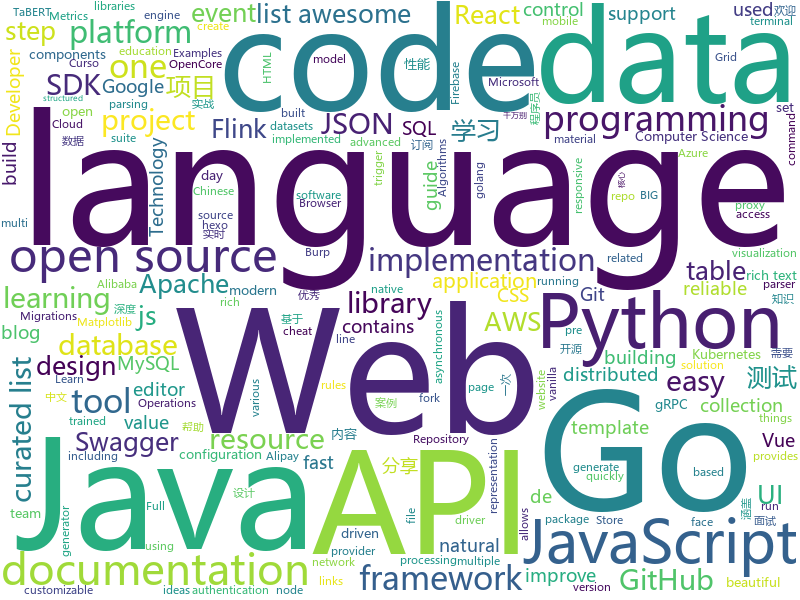

# 2020-07-08
See what the GitHub community is most excited about.

## python
+ [skywater-pdk](https://github.com/google/skywater-pdk)(**118 stars today**): Open source process design kit for usage with SkyWater Technology Foundry's 130nm node.
+ [EasyOCR](https://github.com/JaidedAI/EasyOCR)(**224 stars today**): Ready-to-use OCR with 40+ languages supported including Chinese, Japanese, Korean and Thai
+ [HelloGitHub](https://github.com/521xueweihan/HelloGitHub)(**61 stars today**): Find pearls on open-source seashore 分享 GitHub 上有趣、入门级的开源项目
+ [hackingtool](https://github.com/Z4nzu/hackingtool)(**152 stars today**): ALL IN ONE Hacking Tool For Hackers
+ [bitcoinbook](https://github.com/bitcoinbook/bitcoinbook)(**99 stars today**): Mastering Bitcoin 2nd Edition - Programming the Open Blockchain
+ [TaBERT](https://github.com/facebookresearch/TaBERT)(**29 stars today**): This repository contains source code for the TaBERT model, a pre-trained language model for learning joint representations of natural language utterances and (semi-)structured tables for semantic parsing. TaBERT is pre-trained on a massive corpus of 26M Web tables and their associated natural language context, and could be used as a drop-in repl…
+ [sweetviz](https://github.com/fbdesignpro/sweetviz)(**118 stars today**): Visualize and compare datasets, target values and associations, with one line of code.
+ [Python](https://github.com/TheAlgorithms/Python)(**269 stars today**): All Algorithms implemented in Python
+ [texthero](https://github.com/jbesomi/texthero)(**167 stars today**): Text preprocessing, representation and visualization from zero to hero.
+ [dvc](https://github.com/iterative/dvc)(**26 stars today**): 🦉Data Version Control | Git for Data & Models
+ [shuup](https://github.com/shuup/shuup)(**8 stars today**): E-Commerce Platform
+ [spack](https://github.com/spack/spack)(**3 stars today**): A flexible package manager that supports multiple versions, configurations, platforms, and compilers.
+ [matplotlib](https://github.com/matplotlib/matplotlib)(**18 stars today**): matplotlib: plotting with Python
+ [brython](https://github.com/brython-dev/brython)(**68 stars today**): Brython (Browser Python) is an implementation of Python 3 running in the browser
+ [d2l-en](https://github.com/d2l-ai/d2l-en)(**23 stars today**): Interactive deep learning book with code, math, and discussions. Available in multi-frameworks.
+ [rich](https://github.com/willmcgugan/rich)(**361 stars today**): Rich is a Python library for rich text and beautiful formatting in the terminal.
+ [learn-python3](https://github.com/jerry-git/learn-python3)(**20 stars today**): Jupyter notebooks for teaching/learning Python 3
+ [cheatsheets](https://github.com/matplotlib/cheatsheets)(**597 stars today**): Official Matplotlib cheat sheets
+ [sdk](https://github.com/binaryai/sdk)(**59 stars today**): BinaryAI Python SDK
+ [nlp](https://github.com/huggingface/nlp)(**13 stars today**): 🤗nlp – Datasets and evaluation metrics for Natural Language Processing in NumPy, Pandas, PyTorch and TensorFlow
+ [awesome-machine-learning](https://github.com/josephmisiti/awesome-machine-learning)(**122 stars today**): A curated list of awesome Machine Learning frameworks, libraries and software.
+ [cloudflare-ip-ping](https://github.com/olixu/cloudflare-ip-ping)(**23 stars today**): Ping all the ips of cloudflare.
+ [py_regular_expressions](https://github.com/learnbyexample/py_regular_expressions)(**71 stars today**): Learn Python Regular Expressions step by step from beginner to advanced levels
+ [30-Days-Of-Python](https://github.com/Asabeneh/30-Days-Of-Python)(**22 stars today**): 30 days of Python programming challenge is a step by step guide to learn Python programming language in 30 days.
+ [Princess-connection-farm](https://github.com/SimonShi1994/Princess-connection-farm)(**10 stars today**): 国服PCR公主连结 多开自动农场脚本 基于opencv+UIAutomator

## java
+ [Tiktok](https://github.com/18380438200/Tiktok)(**42 stars today**): 高仿抖音APP
+ [CVE-2020-5902](https://github.com/jas502n/CVE-2020-5902)(**65 stars today**): CVE-2020-5902 BIG-IP
+ [metersphere](https://github.com/metersphere/metersphere)(**12 stars today**): MeterSphere 是一站式的开源企业级持续测试平台，涵盖测试跟踪、接口测试、性能测试、团队协作等功能
+ [GitHub-Chinese-Top-Charts](https://github.com/kon9chunkit/GitHub-Chinese-Top-Charts)(**70 stars today**): 🇨🇳GitHub中文排行榜，帮助你发现高分优秀中文项目、更高效地吸收国人的优秀经验成果；榜单每周更新一次，敬请关注！
+ [netty](https://github.com/netty/netty)(**18 stars today**): Netty project - an event-driven asynchronous network application framework
+ [quarkus](https://github.com/quarkusio/quarkus)(**15 stars today**): Quarkus: Supersonic Subatomic Java.
+ [presto](https://github.com/prestodb/presto)(**4 stars today**): The official home of the Presto distributed SQL query engine for big data
+ [flink-learning](https://github.com/zhisheng17/flink-learning)(**20 stars today**): flink learning blog. http://www.54tianzhisheng.cn 含 Flink 入门、概念、原理、实战、性能调优、源码解析等内容。涉及 Flink Connector、Metrics、Library、DataStream API、Table API & SQL 等内容的学习案例，还有 Flink 落地应用的大型项目案例（PVUV、日志存储、百亿数据实时去重、监控告警）分享。欢迎大家支持我的专栏《大数据实时计算引擎 Flink 实战与性能优化》
+ [hbase](https://github.com/apache/hbase)(**3 stars today**): Apache HBase
+ [kafka](https://github.com/apache/kafka)(**16 stars today**): Mirror of Apache Kafka
+ [hive](https://github.com/apache/hive)(**5 stars today**): Apache Hive
+ [flink](https://github.com/apache/flink)(**17 stars today**): Apache Flink
+ [liferay-portal](https://github.com/liferay/liferay-portal)(**1 stars today**): 
+ [aws-doc-sdk-examples](https://github.com/awsdocs/aws-doc-sdk-examples)(**8 stars today**): Welcome to the AWS Code Examples Repository. This repo contains code examples used in the AWS documentation, AWS SDK Developer Guides, and more. For more information, see the Readme.rst file below.
+ [BurpBounty](https://github.com/wagiro/BurpBounty)(**4 stars today**): Burp Bounty (Scan Check Builder in BApp Store) is a extension of Burp Suite that allows you, in a quick and simple way, to improve the active and passive scanner by means of personalized rules through a very intuitive graphical interface.
+ [fastjson](https://github.com/alibaba/fastjson)(**17 stars today**): A fast JSON parser/generator for Java.
+ [java-tron](https://github.com/tronprotocol/java-tron)(**2 stars today**): Java implementation of the Tron whitepaper
+ [spring-cloud-alibaba](https://github.com/alibaba/spring-cloud-alibaba)(**28 stars today**): Spring Cloud Alibaba provides a one-stop solution for application development for the distributed solutions of Alibaba middleware.
+ [camel](https://github.com/apache/camel)(**2 stars today**): Apache Camel
+ [ksql](https://github.com/confluentinc/ksql)(**6 stars today**): The event streaming database purpose-built for stream processing applications
+ [flyway](https://github.com/flyway/flyway)(**7 stars today**): Flyway by Redgate • Database Migrations Made Easy.
+ [nifi](https://github.com/apache/nifi)(**4 stars today**): Apache NiFi
+ [calcite](https://github.com/apache/calcite)(**4 stars today**): Apache Calcite
+ [canal](https://github.com/alibaba/canal)(**18 stars today**): 阿里巴巴 MySQL binlog 增量订阅&消费组件
+ [alipay-easysdk](https://github.com/alipay/alipay-easysdk)(**6 stars today**): Alipay Easy SDK for multi-language(java、c#、php、ts etc.) allows you to enjoy a minimalist programming experience and quickly access the various high-frequency capabilities of the Alipay Open Platform.

## unknown
+ [DeepLearning-500-questions](https://github.com/scutan90/DeepLearning-500-questions)(**167 stars today**): 深度学习500问，以问答形式对常用的概率知识、线性代数、机器学习、深度学习、计算机视觉等热点问题进行阐述，以帮助自己及有需要的读者。 全书分为18个章节，50余万字。由于水平有限，书中不妥之处恳请广大读者批评指正。 未完待续............ 如有意合作，联系scutjy2015@163.com 版权所有，违权必究 Tan 2018.06
+ [digital-gardeners](https://github.com/MaggieAppleton/digital-gardeners)(**63 stars today**): Resources, links, projects, and ideas for gardeners tending their digital notes on the public interwebs
+ [GitHubDaily](https://github.com/GitHubDaily/GitHubDaily)(**28 stars today**): GitHubDaily 分享内容定期整理与分类。欢迎推荐、自荐项目，让更多人知道你的项目。
+ [OSCP-Preparation-Material](https://github.com/RihaMaheshwari/OSCP-Preparation-Material)(**4 stars today**): All in One OSCP Preparation Material
+ [the-art-of-command-line](https://github.com/jlevy/the-art-of-command-line)(**47 stars today**): Master the command line, in one page
+ [LeetcodeTop](https://github.com/afatcoder/LeetcodeTop)(**33 stars today**): 
+ [computer-science](https://github.com/ossu/computer-science)(**107 stars today**): 🎓Path to a free self-taught education in Computer Science!
+ [app-ideas](https://github.com/florinpop17/app-ideas)(**183 stars today**): A Collection of application ideas which can be used to improve your coding skills.
+ [docker-cheat-sheet](https://github.com/wsargent/docker-cheat-sheet)(**93 stars today**): Docker Cheat Sheet
+ [Resources-for-Beginner-Bug-Bounty-Hunters](https://github.com/nahamsec/Resources-for-Beginner-Bug-Bounty-Hunters)(**21 stars today**): A list of resources for those interested in getting started in bug bounties
+ [Red-Teaming-Toolkit](https://github.com/infosecn1nja/Red-Teaming-Toolkit)(**12 stars today**): A collection of open source and commercial tools that aid in red team operations.
+ [iterm2-with-oh-my-zsh](https://github.com/sirius1024/iterm2-with-oh-my-zsh)(**11 stars today**): iTerm2 + Oh My Zsh 打造舒适终端体验
+ [coding-interview-university](https://github.com/jwasham/coding-interview-university)(**299 stars today**): A complete computer science study plan to become a software engineer.
+ [AZ-103-MicrosoftAzureAdministrator](https://github.com/MicrosoftLearning/AZ-103-MicrosoftAzureAdministrator)(**2 stars today**): AZ-103: Microsoft Azure Administrator
+ [OpenCore-Factory](https://github.com/williambj1/OpenCore-Factory)(**5 stars today**): Automated OpenCore build, triggers every 8 hours. 自动化 OpenCore 编译，每 8 小时刷新一次。
+ [blog](https://github.com/fouber/blog)(**17 stars today**): 没事写写文章，喜欢的话请点star，想订阅点watch，千万别fork！
+ [design-resources-for-developers](https://github.com/bradtraversy/design-resources-for-developers)(**82 stars today**): Curated list of design and UI resources from stock photos, web templates, CSS frameworks, UI libraries, tools and much more
+ [build-your-own-x](https://github.com/danistefanovic/build-your-own-x)(**76 stars today**): 🤓Build your own (insert technology here)
+ [awesome-tailwindcss](https://github.com/aniftyco/awesome-tailwindcss)(**10 stars today**): A curated list of awesome things related to Tailwind CSS
+ [TengineKit](https://github.com/OAID/TengineKit)(**17 stars today**): TengineKit is an easy-to-integrate face detection and face landmarks SDK. It can run on various mobile phones at very low latency.
+ [awesome-vue](https://github.com/vuejs/awesome-vue)(**33 stars today**): 🎉A curated list of awesome things related to Vue.js
+ [Python-Core-50-Courses](https://github.com/jackfrued/Python-Core-50-Courses)(**15 stars today**): Python语言基础50课
+ [awesome-flask](https://github.com/humiaozuzu/awesome-flask)(**8 stars today**): A curated list of awesome Flask resources and plugins
+ [eloquente-javascript](https://github.com/braziljs/eloquente-javascript)(**4 stars today**): Tradução do livro Eloquent JavaScript - 2ª edição.
+ [JavaFamily](https://github.com/AobingJava/JavaFamily)(**83 stars today**): 【Java面试+Java学习指南】 一份涵盖大部分Java程序员所需要掌握的核心知识。

## javascript
+ [edex-ui](https://github.com/GitSquared/edex-ui)(**581 stars today**): A cross-platform, customizable science fiction terminal emulator with advanced monitoring & touchscreen support.
+ [react-native-firebase](https://github.com/invertase/react-native-firebase)(**29 stars today**): 🔥A well-tested feature-rich modular Firebase implementation for React Native. Supports both iOS & Android platforms for all Firebase services.
+ [vue](https://github.com/vuejs/vue)(**119 stars today**): 🖖Vue.js is a progressive, incrementally-adoptable JavaScript framework for building UI on the web.
+ [bootstrap](https://github.com/twbs/bootstrap)(**36 stars today**): The most popular HTML, CSS, and JavaScript framework for developing responsive, mobile first projects on the web.
+ [create-react-app](https://github.com/facebook/create-react-app)(**50 stars today**): Set up a modern web app by running one command.
+ [javascript-algorithms](https://github.com/trekhleb/javascript-algorithms)(**199 stars today**): 📝Algorithms and data structures implemented in JavaScript with explanations and links to further readings
+ [slate](https://github.com/ianstormtaylor/slate)(**13 stars today**): A completely customizable framework for building rich text editors. (Currently in beta.)
+ [graphql-engine](https://github.com/hasura/graphql-engine)(**22 stars today**): Blazing fast, instant realtime GraphQL APIs on Postgres with fine grained access control, also trigger webhooks on database events.
+ [swagger-ui](https://github.com/swagger-api/swagger-ui)(**15 stars today**): Swagger UI is a collection of HTML, JavaScript, and CSS assets that dynamically generate beautiful documentation from a Swagger-compliant API.
+ [google-meet-grid-view](https://github.com/Fugiman/google-meet-grid-view)(**4 stars today**): Userscript to offer a grid-view layout in Google Meets
+ [next-auth](https://github.com/iaincollins/next-auth)(**30 stars today**): Easy authentication for Next.js and Serverless
+ [cypress](https://github.com/cypress-io/cypress)(**23 stars today**): Fast, easy and reliable testing for anything that runs in a browser.
+ [t-rex-runner](https://github.com/wayou/t-rex-runner)(**8 stars today**): the t-rex runner game extracted from chromium
+ [ag-grid](https://github.com/ag-grid/ag-grid)(**6 stars today**): Advanced Data Grid / Data Table supporting Javascript / React / AngularJS / Web Components
+ [strapi](https://github.com/strapi/strapi)(**42 stars today**): 🚀Open source Node.js Headless CMS to easily build customisable APIs
+ [octicons](https://github.com/primer/octicons)(**9 stars today**): A scalable set of icons handcrafted with <3 by GitHub
+ [react-query](https://github.com/tannerlinsley/react-query)(**44 stars today**): ⚛️Hooks for fetching, caching and updating asynchronous data in React
+ [lerna](https://github.com/lerna/lerna)(**31 stars today**): 🐉A tool for managing JavaScript projects with multiple packages.
+ [incubator-echarts](https://github.com/apache/incubator-echarts)(**27 stars today**): A powerful, interactive charting and visualization library for browser
+ [node-red](https://github.com/node-red/node-red)(**15 stars today**): Low-code programming for event-driven applications
+ [exceljs](https://github.com/exceljs/exceljs)(**12 stars today**): Excel Workbook Manager
+ [next.js](https://github.com/vercel/next.js)(**41 stars today**): The React Framework
+ [fullPage.js](https://github.com/alvarotrigo/fullPage.js)(**13 stars today**): fullPage plugin by Alvaro Trigo. Create full screen pages fast and simple
+ [tiptap](https://github.com/scrumpy/tiptap)(**9 stars today**): A rich-text editor for Vue.js
+ [quill](https://github.com/quilljs/quill)(**14 stars today**): Quill is a modern WYSIWYG editor built for compatibility and extensibility.

## html
+ [RADWIMPS](https://github.com/approvers/RADWIMPS)(**31 stars today**): 君の then-then-then 世は Promise で Future
+ [ai-edu](https://github.com/microsoft/ai-edu)(**24 stars today**): AI education materials for Chinese students, teachers and IT professionals.
+ [swagger-codegen](https://github.com/swagger-api/swagger-codegen)(**6 stars today**): swagger-codegen contains a template-driven engine to generate documentation, API clients and server stubs in different languages by parsing your OpenAPI / Swagger definition.
+ [Java-Interview-Advanced](https://github.com/shishan100/Java-Interview-Advanced)(**8 stars today**): 中华石杉--互联网Java进阶面试训练营
+ [styleguide](https://github.com/google/styleguide)(**24 stars today**): Style guides for Google-originated open-source projects
+ [JavaScript30](https://github.com/wesbos/JavaScript30)(**6 stars today**): 30 Day Vanilla JS Challenge
+ [placeholdifier](https://github.com/pomber/placeholdifier)(**37 stars today**): Turn any website into a live wireframe
+ [REKCARC-TSC-UHT](https://github.com/PKUanonym/REKCARC-TSC-UHT)(**16 stars today**): 清华大学计算机系课程攻略 Guidance for courses in Department of Computer Science and Technology, Tsinghua University
+ [hyperblog](https://github.com/freddier/hyperblog)(**10 stars today**): Un blog increíble para el curso de Git y Github de Platzi
+ [website](https://github.com/kubernetes/website)(**5 stars today**): Kubernetes website and documentation repo:
+ [WebFundamentals](https://github.com/google/WebFundamentals)(**4 stars today**): Best practices for modern web development
+ [Tasmota](https://github.com/arendst/Tasmota)(**23 stars today**): Alternative firmware for ESP8266 with easy configuration using webUI, OTA updates, automation using timers or rules, expandability and entirely local control over MQTT, HTTP, Serial or KNX. Full documentation at
+ [hexo-theme-matery](https://github.com/blinkfox/hexo-theme-matery)(**9 stars today**): A beautiful hexo blog theme with material design and responsive design.一个基于材料设计和响应式设计而成的全面、美观的Hexo主题。国内访问：http://blinkfox.com
+ [wpt](https://github.com/web-platform-tests/wpt)(**2 stars today**): Test suites for Web platform specs — including WHATWG, W3C, and others
+ [patchwork](https://github.com/jlord/patchwork)(**0 stars today**): All the Git-it Workshop completers!
+ [calico](https://github.com/projectcalico/calico)(**4 stars today**): Cloud native networking and network security
+ [webdevbootcamp](https://github.com/nax3t/webdevbootcamp)(**5 stars today**): All source code for back-end projects from the Web Developer Bootcamp
+ [shellphish](https://github.com/suljot/shellphish)(**2 stars today**): Phishing Tool for Instagram, Facebook, Twitter, Snapchat, Github
+ [docs](https://github.com/knative/docs)(**1 stars today**): User documentation for Knative components.
+ [skill-map](https://github.com/TeamStuQ/skill-map)(**12 stars today**): 程序员技能图谱
+ [openshift-docs](https://github.com/openshift/openshift-docs)(**0 stars today**): OpenShift 3 and 4 documentation
+ [docsy](https://github.com/google/docsy)(**3 stars today**): A set of Hugo doc templates for launching open source content.
+ [rellax](https://github.com/dixonandmoe/rellax)(**4 stars today**): Lightweight, vanilla javascript parallax library
+ [msteams-docs](https://github.com/MicrosoftDocs/msteams-docs)(**0 stars today**): Source for the Microsoft Teams developer platform documentation.
+ [html-css](https://github.com/gustavoguanabara/html-css)(**4 stars today**): Curso de HTML5 e CSS3

## go
+ [terraform-provider-aws](https://github.com/terraform-providers/terraform-provider-aws)(**9 stars today**): Terraform AWS provider
+ [opentelemetry-go](https://github.com/open-telemetry/opentelemetry-go)(**3 stars today**): OpenTelemetry Go API and SDK
+ [grpc-go](https://github.com/grpc/grpc-go)(**13 stars today**): The Go language implementation of gRPC. HTTP/2 based RPC
+ [jwt-go](https://github.com/dgrijalva/jwt-go)(**10 stars today**): Golang implementation of JSON Web Tokens (JWT)
+ [grpc-gateway](https://github.com/grpc-ecosystem/grpc-gateway)(**4 stars today**): gRPC to JSON proxy generator following the gRPC HTTP spec
+ [terraform](https://github.com/hashicorp/terraform)(**21 stars today**): Terraform enables you to safely and predictably create, change, and improve infrastructure. It is an open source tool that codifies APIs into declarative configuration files that can be shared amongst team members, treated as code, edited, reviewed, and versioned.
+ [kops](https://github.com/kubernetes/kops)(**12 stars today**): Kubernetes Operations (kops) - Production Grade K8s Installation, Upgrades, and Management
+ [go-swagger](https://github.com/go-swagger/go-swagger)(**6 stars today**): Swagger 2.0 implementation for go
+ [terraform-provider-azurerm](https://github.com/terraform-providers/terraform-provider-azurerm)(**5 stars today**): Terraform provider for Azure Resource Manager
+ [aws-sdk-go](https://github.com/aws/aws-sdk-go)(**2 stars today**): AWS SDK for the Go programming language.
+ [oauth2-proxy](https://github.com/oauth2-proxy/oauth2-proxy)(**4 stars today**): A reverse proxy that provides authentication with Google, Github or other providers.
+ [mysql](https://github.com/go-sql-driver/mysql)(**5 stars today**): Go MySQL Driver is a MySQL driver for Go's (golang) database/sql package
+ [chi](https://github.com/go-chi/chi)(**14 stars today**): lightweight, idiomatic and composable router for building Go HTTP services
+ [containerd](https://github.com/containerd/containerd)(**5 stars today**): An open and reliable container runtime
+ [govmomi](https://github.com/vmware/govmomi)(**2 stars today**): Go library for the VMware vSphere API
+ [argo](https://github.com/argoproj/argo)(**11 stars today**): Argo Workflows: Get stuff done with Kubernetes.
+ [migrate](https://github.com/golang-migrate/migrate)(**9 stars today**): Database migrations. CLI and Golang library.
+ [slack](https://github.com/slack-go/slack)(**2 stars today**): Slack API in Go - community-maintained fork created by the original author, @nlopes
+ [gin-admin](https://github.com/LyricTian/gin-admin)(**8 stars today**): RBAC scaffolding based on Gin + Gorm/Mongo + Casbin + Wire
+ [autoscaler](https://github.com/kubernetes/autoscaler)(**6 stars today**): Autoscaling components for Kubernetes
+ [etcd](https://github.com/etcd-io/etcd)(**21 stars today**): Distributed reliable key-value store for the most critical data of a distributed system
+ [go](https://github.com/golang/go)(**42 stars today**): The Go programming language
+ [gjson](https://github.com/tidwall/gjson)(**13 stars today**): Get JSON values quickly - JSON parser for Go
+ [gop](https://github.com/goplus/gop)(**130 stars today**): GoPlus - The Go+ language for data science
+ [charts](https://github.com/helm/charts)(**11 stars today**): Curated applications for Kubernetes

## WordCloud

