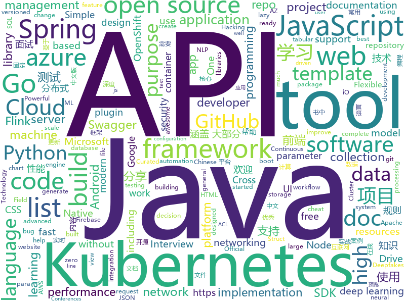

# 2020-07-09
See what the GitHub community is most excited about.

## python
+ [EasyOCR](https://github.com/JaidedAI/EasyOCR)(**965 stars today**): Ready-to-use OCR with 40+ languages supported including Chinese, Japanese, Korean and Thai
+ [texthero](https://github.com/jbesomi/texthero)(**312 stars today**): Text preprocessing, representation and visualization from zero to hero.
+ [hackingtool](https://github.com/Z4nzu/hackingtool)(**367 stars today**): ALL IN ONE Hacking Tool For Hackers
+ [HelloGitHub](https://github.com/521xueweihan/HelloGitHub)(**74 stars today**): Find pearls on open-source seashore 分享 GitHub 上有趣、入门级的开源项目
+ [azure-sdk-for-python](https://github.com/Azure/azure-sdk-for-python)(**3 stars today**): This repository is for active development of the Azure SDK for Python. For consumers of the SDK we recommend visiting our public developer docs at https://docs.microsoft.com/en-us/python/azure/ or our versioned developer docs at https://azure.github.io/azure-sdk-for-python.
+ [DeepFaceLab](https://github.com/iperov/DeepFaceLab)(**159 stars today**): DeepFaceLab is the leading software for creating deepfakes.
+ [skywater-pdk](https://github.com/google/skywater-pdk)(**192 stars today**): Open source process design kit for usage with SkyWater Technology Foundry's 130nm node.
+ [cheatsheets](https://github.com/matplotlib/cheatsheets)(**246 stars today**): Official Matplotlib cheat sheets
+ [Team-Ares](https://github.com/Critical-Start/Team-Ares)(**24 stars today**): Repository for all TeamARES POC code and tools.
+ [lazypredict](https://github.com/shankarpandala/lazypredict)(**24 stars today**): Lazy Predict help build a lot of basic models without much code and helps understand which models works better without any parameter tuning
+ [sweetviz](https://github.com/fbdesignpro/sweetviz)(**104 stars today**): Visualize and compare datasets, target values and associations, with one line of code.
+ [nni](https://github.com/microsoft/nni)(**18 stars today**): An open source AutoML toolkit for automate machine learning lifecycle, including feature engineering, neural architecture search, model compression and hyper-parameter tuning.
+ [Statistical-Learning-Method_Code](https://github.com/Dod-o/Statistical-Learning-Method_Code)(**39 stars today**): 手写实现李航《统计学习方法》书中全部算法
+ [faceswap](https://github.com/deepfakes/faceswap)(**41 stars today**): Deepfakes Software For All
+ [jupyterhub](https://github.com/jupyterhub/jupyterhub)(**3 stars today**): Multi-user server for Jupyter notebooks
+ [dvc](https://github.com/iterative/dvc)(**88 stars today**): 🦉Data Version Control | Git for Data & Models
+ [bitcoinbook](https://github.com/bitcoinbook/bitcoinbook)(**91 stars today**): Mastering Bitcoin 2nd Edition - Programming the Open Blockchain
+ [bugz-tools](https://github.com/D4Vinci/bugz-tools)(**13 stars today**): A collection of tools I wrote for bug bounty or hacking and don't mind publishing it😄
+ [public-apis](https://github.com/public-apis/public-apis)(**117 stars today**): A collective list of free APIs for use in software and web development.
+ [d2l-en](https://github.com/d2l-ai/d2l-en)(**26 stars today**): Interactive deep learning book with code, math, and discussions. Available in multi-frameworks.
+ [vaex](https://github.com/vaexio/vaex)(**11 stars today**): Out-of-Core DataFrames for Python, ML, visualize and explore big tabular data at a billion rows per second🚀
+ [Princess-connection-farm](https://github.com/SimonShi1994/Princess-connection-farm)(**10 stars today**): 国服PCR公主连结 多开自动农场脚本 基于opencv+UIAutomator
+ [git-filter-repo](https://github.com/newren/git-filter-repo)(**9 stars today**): Quickly rewrite git repository history (filter-branch replacement)
+ [spaCy](https://github.com/explosion/spaCy)(**9 stars today**): 💫Industrial-strength Natural Language Processing (NLP) with Python and Cython
+ [elastalert](https://github.com/Yelp/elastalert)(**7 stars today**): Easy & Flexible Alerting With ElasticSearch

## java
+ [tsunami-security-scanner](https://github.com/google/tsunami-security-scanner)(**349 stars today**): Tsunami is a general purpose network security scanner with an extensible plugin system for detecting high severity vulnerabilities with high confidence.
+ [PowerJob](https://github.com/KFCFans/PowerJob)(**39 stars today**): 新一代分布式任务调度与计算框架，支持CRON、API、固定频率、固定延迟等调度策略，提供工作流来编排任务解决依赖关系，使用简单，功能强大，文档齐全，欢迎各位接入使用！
+ [grpc-java](https://github.com/grpc/grpc-java)(**8 stars today**): The Java gRPC implementation. HTTP/2 based RPC
+ [android-interview-questions](https://github.com/MindorksOpenSource/android-interview-questions)(**16 stars today**): Your Cheat Sheet For Android Interview - Android Interview Questions
+ [ksql](https://github.com/confluentinc/ksql)(**6 stars today**): The event streaming database purpose-built for stream processing applications
+ [flink](https://github.com/apache/flink)(**15 stars today**): Apache Flink
+ [tutorials](https://github.com/eugenp/tutorials)(**25 stars today**): Just Announced - "Learn Spring Security OAuth":
+ [sodium-fabric](https://github.com/jellysquid3/sodium-fabric)(**11 stars today**): A Minecraft mod designed to improve frame rates and reduce micro-stutter
+ [Tiktok](https://github.com/18380438200/Tiktok)(**67 stars today**): 高仿抖音APP
+ [flink-learning](https://github.com/zhisheng17/flink-learning)(**19 stars today**): flink learning blog. http://www.54tianzhisheng.cn 含 Flink 入门、概念、原理、实战、性能调优、源码解析等内容。涉及 Flink Connector、Metrics、Library、DataStream API、Table API & SQL 等内容的学习案例，还有 Flink 落地应用的大型项目案例（PVUV、日志存储、百亿数据实时去重、监控告警）分享。欢迎大家支持我的专栏《大数据实时计算引擎 Flink 实战与性能优化》
+ [kkFileView](https://github.com/kekingcn/kkFileView)(**46 stars today**): 使用spring boot打造文件文档在线预览项目解决方案，支持doc、docx、ppt、pptx、xls、xlsx、zip、rar、mp4，mp3以及众多类文本如txt、html、xml、java、properties、sql、js、md、json、conf、ini、vue、php、py、bat、gitignore等文件在线预览
+ [strimzi-kafka-operator](https://github.com/strimzi/strimzi-kafka-operator)(**4 stars today**): Apache Kafka running on Kubernetes
+ [concurrent](https://github.com/RedSpider1/concurrent)(**29 stars today**): 这是RedSpider社区成员原创与维护的Java多线程系列文章。
+ [camunda-bpm-platform](https://github.com/camunda/camunda-bpm-platform)(**5 stars today**): Flexible framework for workflow and decision automation with BPMN and DMN. Integration with Spring, Spring Boot, CDI.
+ [ratel](https://github.com/ainilili/ratel)(**14 stars today**): A fighting landlord program that can be played on the command line
+ [keycloak](https://github.com/keycloak/keycloak)(**14 stars today**): Open Source Identity and Access Management For Modern Applications and Services
+ [camel](https://github.com/apache/camel)(**3 stars today**): Apache Camel
+ [springcloud-learning](https://github.com/macrozheng/springcloud-learning)(**22 stars today**): 一套涵盖大部分核心组件使用的Spring Cloud教程，包括Spring Cloud Alibaba及分布式事务Seata，基于Spring Cloud Greenwich及SpringBoot 2.1.7。20篇文章，篇篇精华，30个Demo，涵盖大部分应用场景。
+ [caffeine](https://github.com/ben-manes/caffeine)(**19 stars today**): A high performance caching library for Java 8
+ [angel](https://github.com/Angel-ML/angel)(**7 stars today**): A Flexible and Powerful Parameter Server for large-scale machine learning
+ [metersphere](https://github.com/metersphere/metersphere)(**17 stars today**): MeterSphere 是一站式的开源企业级持续测试平台，涵盖测试跟踪、接口测试、性能测试、团队协作等功能
+ [GitHub-Chinese-Top-Charts](https://github.com/kon9chunkit/GitHub-Chinese-Top-Charts)(**105 stars today**): 🇨🇳GitHub中文排行榜，帮助你发现高分优秀中文项目、更高效地吸收国人的优秀经验成果；榜单每周更新一次，敬请关注！
+ [druid](https://github.com/apache/druid)(**6 stars today**): Apache Druid: a high performance real-time analytics database.
+ [MPAndroidChart](https://github.com/PhilJay/MPAndroidChart)(**15 stars today**): A powerful🚀Android chart view / graph view library, supporting line- bar- pie- radar- bubble- and candlestick charts as well as scaling, panning and animations.
+ [shardingsphere-elasticjob-lite](https://github.com/apache/shardingsphere-elasticjob-lite)(**45 stars today**): Distributed scheduled job framework

## unknown
+ [DeepLearning-500-questions](https://github.com/scutan90/DeepLearning-500-questions)(**231 stars today**): 深度学习500问，以问答形式对常用的概率知识、线性代数、机器学习、深度学习、计算机视觉等热点问题进行阐述，以帮助自己及有需要的读者。 全书分为18个章节，50余万字。由于水平有限，书中不妥之处恳请广大读者批评指正。 未完待续............ 如有意合作，联系scutjy2015@163.com 版权所有，违权必究 Tan 2018.06
+ [OnJava8](https://github.com/LingCoder/OnJava8)(**193 stars today**): 《On Java 8》中文版，又名《Java编程思想》 第5版
+ [build-your-own-x](https://github.com/danistefanovic/build-your-own-x)(**83 stars today**): 🤓Build your own (insert technology here)
+ [NLP-Conferences-Code](https://github.com/yizhen20133868/NLP-Conferences-Code)(**65 stars today**): NLP-Conferences-Code (ACL、EMNL、NAACL、COLING、AAAI、IJCAI)
+ [Interview_Question_for_Beginner](https://github.com/JaeYeopHan/Interview_Question_for_Beginner)(**13 stars today**): 👦👧Technical-Interview guidelines written for those who started studying programming. I wish you all the best.👾
+ [precourse](https://github.com/NeuromatchAcademy/precourse)(**11 stars today**): A repo for the pre-course work at home exercises
+ [GitHubDaily](https://github.com/GitHubDaily/GitHubDaily)(**25 stars today**): GitHubDaily 分享内容定期整理与分类。欢迎推荐、自荐项目，让更多人知道你的项目。
+ [JavaFamily](https://github.com/AobingJava/JavaFamily)(**81 stars today**): 【Java面试+Java学习指南】 一份涵盖大部分Java程序员所需要掌握的核心知识。
+ [Resources-for-Beginner-Bug-Bounty-Hunters](https://github.com/nahamsec/Resources-for-Beginner-Bug-Bounty-Hunters)(**15 stars today**): A list of resources for those interested in getting started in bug bounties
+ [design-resources-for-developers](https://github.com/bradtraversy/design-resources-for-developers)(**78 stars today**): Curated list of design and UI resources from stock photos, web templates, CSS frameworks, UI libraries, tools and much more
+ [blogs](https://github.com/sl1673495/blogs)(**11 stars today**): 📖前端技术博客，不定时更新
+ [javascript-questions](https://github.com/lydiahallie/javascript-questions)(**37 stars today**): A long list of (advanced) JavaScript questions, and their explanations✨
+ [api-guidelines](https://github.com/microsoft/api-guidelines)(**4 stars today**): Microsoft REST API Guidelines
+ [awesome-deep-learning](https://github.com/ChristosChristofidis/awesome-deep-learning)(**10 stars today**): A curated list of awesome Deep Learning tutorials, projects and communities.
+ [TeachYourselfCS-CN](https://github.com/keithnull/TeachYourselfCS-CN)(**58 stars today**): TeachYourselfCS 的中文翻译 | A Chinese translation of TeachYourselfCS
+ [AZ-103-MicrosoftAzureAdministrator](https://github.com/MicrosoftLearning/AZ-103-MicrosoftAzureAdministrator)(**3 stars today**): AZ-103: Microsoft Azure Administrator
+ [architecture_decision_record](https://github.com/joelparkerhenderson/architecture_decision_record)(**6 stars today**): Architecture decision record (ADR) examples for software planning, IT leadership, and template documentation
+ [AZ-900T0x-MicrosoftAzureFundamentals](https://github.com/MicrosoftLearning/AZ-900T0x-MicrosoftAzureFundamentals)(**2 stars today**): Microsoft Azure Fundamentals - AZ-900T00 and AZ-900T01
+ [COVID-19](https://github.com/CSSEGISandData/COVID-19)(**24 stars today**): Novel Coronavirus (COVID-19) Cases, provided by JHU CSSE
+ [Specs](https://github.com/CocoaPods/Specs)(**3 stars today**): The CocoaPods Master Repo
+ [awesome-dotnet](https://github.com/quozd/awesome-dotnet)(**7 stars today**): A collection of awesome .NET libraries, tools, frameworks and software
+ [github-issue-templates](https://github.com/stevemao/github-issue-templates)(**4 stars today**): 🔣A collection of GitHub issue and pull request templates
+ [awesome-nodejs](https://github.com/sindresorhus/awesome-nodejs)(**18 stars today**): ⚡Delightful Node.js packages and resources
+ [vagas](https://github.com/frontendbr/vagas)(**6 stars today**): 🔬Espaço para divulgação de vagas para front-enders.
+ [webkit](https://github.com/WebKit/webkit)(**2 stars today**): Unofficial mirror of the WebKit SVN repository

## javascript
+ [cml](https://github.com/iterative/cml)(**309 stars today**): CML - Continuous Machine Learning or CI/CD for ML
+ [react-native-firebase](https://github.com/invertase/react-native-firebase)(**39 stars today**): 🔥A well-tested feature-rich modular Firebase implementation for React Native. Supports both iOS & Android platforms for all Firebase services.
+ [bookshelf](https://github.com/kentcdodds/bookshelf)(**82 stars today**): Build a ReactJS App workshop
+ [edex-ui](https://github.com/GitSquared/edex-ui)(**500 stars today**): A cross-platform, customizable science fiction terminal emulator with advanced monitoring & touchscreen support.
+ [send](https://github.com/mozilla/send)(**35 stars today**): Simple, private file sharing from the makers of Firefox
+ [covid-tracker-backend-api](https://github.com/HSEIreland/covid-tracker-backend-api)(**16 stars today**): COVID Tracker backend API
+ [Unlock-netease-cloud-music](https://github.com/meng-chuan/Unlock-netease-cloud-music)(**64 stars today**): 解锁网易云音乐客户端变灰歌曲
+ [fastify](https://github.com/fastify/fastify)(**33 stars today**): Fast and low overhead web framework, for Node.js
+ [lazysizes](https://github.com/aFarkas/lazysizes)(**9 stars today**): High performance and SEO friendly lazy loader for images (responsive and normal), iframes and more, that detects any visibility changes triggered through user interaction, CSS or JavaScript without configuration.
+ [swagger-ui](https://github.com/swagger-api/swagger-ui)(**11 stars today**): Swagger UI is a collection of HTML, JavaScript, and CSS assets that dynamically generate beautiful documentation from a Swagger-compliant API.
+ [fullPage.js](https://github.com/alvarotrigo/fullPage.js)(**14 stars today**): fullPage plugin by Alvaro Trigo. Create full screen pages fast and simple
+ [react-query](https://github.com/tannerlinsley/react-query)(**41 stars today**): ⚛️Hooks for fetching, caching and updating asynchronous data in React
+ [appium-desktop](https://github.com/appium/appium-desktop)(**5 stars today**): Appium Server and Inspector in Desktop GUIs for Mac, Windows, and Linux
+ [electron-builder](https://github.com/electron-userland/electron-builder)(**13 stars today**): A complete solution to package and build a ready for distribution Electron app with “auto update” support out of the box
+ [jsPDF](https://github.com/MrRio/jsPDF)(**14 stars today**): Client-side JavaScript PDF generation for everyone.
+ [jitsi-meet](https://github.com/jitsi/jitsi-meet)(**28 stars today**): Jitsi Meet - Secure, Simple and Scalable Video Conferences that you use as a standalone app or embed in your web application.
+ [carbon](https://github.com/carbon-design-system/carbon)(**5 stars today**): A design system built by IBM
+ [frontend-hard-mode-interview](https://github.com/coffe1891/frontend-hard-mode-interview)(**20 stars today**): 《前端内参》，有关于JavaScript、编程范式、设计模式、软件开发的艺术等大前端范畴内的知识分享，旨在帮助前端工程师们夯实技术基础以通过一线互联网企业技术面试。
+ [gatsby](https://github.com/gatsbyjs/gatsby)(**35 stars today**): Build blazing fast, modern apps and websites with React
+ [pipedream](https://github.com/PipedreamHQ/pipedream)(**3 stars today**): Serverless integration and compute platform. Free for developers.
+ [curso-javascript-ninja](https://github.com/da2k/curso-javascript-ninja)(**3 stars today**): Curso Javascript Ninja
+ [netron](https://github.com/lutzroeder/netron)(**26 stars today**): Visualizer for neural network, deep learning and machine learning models
+ [cypress-example-recipes](https://github.com/cypress-io/cypress-example-recipes)(**5 stars today**): Various recipes for testing common scenarios with Cypress
+ [react-virtualized](https://github.com/bvaughn/react-virtualized)(**9 stars today**): React components for efficiently rendering large lists and tabular data
+ [svelte](https://github.com/sveltejs/svelte)(**47 stars today**): Cybernetically enhanced web apps

## html
+ [free-for-dev](https://github.com/ripienaar/free-for-dev)(**57 stars today**): A list of SaaS, PaaS and IaaS offerings that have free tiers of interest to devops and infradev
+ [Markdown-Resume](https://github.com/CyC2018/Markdown-Resume)(**6 stars today**): ⭐️Markdown 简历模版
+ [swagger-codegen](https://github.com/swagger-api/swagger-codegen)(**9 stars today**): swagger-codegen contains a template-driven engine to generate documentation, API clients and server stubs in different languages by parsing your OpenAPI / Swagger definition.
+ [tidytuesday](https://github.com/rfordatascience/tidytuesday)(**7 stars today**): Official repo for the #tidytuesday project
+ [DetectionLab](https://github.com/clong/DetectionLab)(**6 stars today**): Vagrant & Packer scripts to build a lab environment complete with security tooling and logging best practices
+ [RADWIMPS](https://github.com/approvers/RADWIMPS)(**37 stars today**): 君の then-then-then 世は Promise で Future
+ [calico](https://github.com/projectcalico/calico)(**4 stars today**): Cloud native networking and network security
+ [docsy](https://github.com/google/docsy)(**4 stars today**): A set of Hugo doc templates for launching open source content.
+ [Java-Interview-Advanced](https://github.com/shishan100/Java-Interview-Advanced)(**11 stars today**): 中华石杉--互联网Java进阶面试训练营
+ [ACL4SSR](https://github.com/ACL4SSR/ACL4SSR)(**9 stars today**): SSR 去广告ACL规则/SS完整GFWList规则/Clash规则碎片，Telegram频道订阅地址
+ [openwrt-packages](https://github.com/kenzok8/openwrt-packages)(**6 stars today**): openwet常用软件包
+ [edge-developer](https://github.com/MicrosoftDocs/edge-developer)(**0 stars today**): Developer documentation for Edge.
+ [tiny-slider](https://github.com/ganlanyuan/tiny-slider)(**3 stars today**): Vanilla javascript slider for all purposes.
+ [openshift-docs](https://github.com/openshift/openshift-docs)(**0 stars today**): OpenShift 3 and 4 documentation
+ [shellphish](https://github.com/suljot/shellphish)(**1 stars today**): Phishing Tool for Instagram, Facebook, Twitter, Snapchat, Github
+ [frida-all-in-one](https://github.com/hookmaster/frida-all-in-one)(**4 stars today**): 《FRIDA操作手册》by @hluwa @r0ysue
+ [placeholdifier](https://github.com/pomber/placeholdifier)(**31 stars today**): Turn any website into a live wireframe
+ [serenity-core](https://github.com/serenity-bdd/serenity-core)(**0 stars today**): Serenity BDD is a test automation library designed to make writing automated acceptance tests easier, and more fun.
+ [gopl-zh](https://github.com/golang-china/gopl-zh)(**10 stars today**): 📚Go语言圣经中文版
+ [samples](https://github.com/GoogleChrome/samples)(**3 stars today**): A repo containing samples tied to new functionality in each release of Google Chrome.
+ [startbootstrap-resume](https://github.com/StartBootstrap/startbootstrap-resume)(**5 stars today**): A Bootstrap 4 resume/CV theme created by Start Bootstrap
+ [Spoon-Knife](https://github.com/octocat/Spoon-Knife)(**1 stars today**): This repo is for demonstration purposes only.
+ [sale-workflow](https://github.com/OCA/sale-workflow)(**0 stars today**): Odoo Sales, Workflow and Organization
+ [compat-table](https://github.com/kangax/compat-table)(**3 stars today**): ECMAScript 5/6/7 compatibility tables
+ [web-moderno](https://github.com/cod3rcursos/web-moderno)(**7 stars today**): 

## go
+ [operator-sdk](https://github.com/operator-framework/operator-sdk)(**9 stars today**): SDK for building Kubernetes applications. Provides high level APIs, useful abstractions, and project scaffolding.
+ [jwt-go](https://github.com/dgrijalva/jwt-go)(**11 stars today**): Golang implementation of JSON Web Tokens (JWT)
+ [sftpgo](https://github.com/drakkan/sftpgo)(**43 stars today**): Fully featured and highly configurable SFTP server
+ [opa](https://github.com/open-policy-agent/opa)(**4 stars today**): An open source, general-purpose policy engine.
+ [rclone](https://github.com/rclone/rclone)(**34 stars today**): "rsync for cloud storage" - Google Drive, Amazon Drive, S3, Dropbox, Backblaze B2, One Drive, Swift, Hubic, Cloudfiles, Google Cloud Storage, Yandex Files
+ [minio](https://github.com/minio/minio)(**21 stars today**): High Performance, Kubernetes Native Object Storage
+ [cluster-api](https://github.com/kubernetes-sigs/cluster-api)(**3 stars today**): Home for the Cluster Management API work, a subproject of sig-cluster-lifecycle
+ [rancher](https://github.com/rancher/rancher)(**20 stars today**): Complete container management platform
+ [velero](https://github.com/vmware-tanzu/velero)(**5 stars today**): Backup and migrate Kubernetes applications and their persistent volumes
+ [origin](https://github.com/openshift/origin)(**6 stars today**): Images for OpenShift 3 and 4 - see openshift/okd for more
+ [go-swagger](https://github.com/go-swagger/go-swagger)(**9 stars today**): Swagger 2.0 implementation for go
+ [validator](https://github.com/go-playground/validator)(**23 stars today**): 💯Go Struct and Field validation, including Cross Field, Cross Struct, Map, Slice and Array diving
+ [argo-cd](https://github.com/argoproj/argo-cd)(**6 stars today**): Declarative continuous deployment for Kubernetes.
+ [serving](https://github.com/knative/serving)(**7 stars today**): Kubernetes-based, scale-to-zero, request-driven compute
+ [moby](https://github.com/moby/moby)(**13 stars today**): Moby Project - a collaborative project for the container ecosystem to assemble container-based systems
+ [flux](https://github.com/fluxcd/flux)(**7 stars today**): The GitOps Kubernetes operator
+ [k6](https://github.com/loadimpact/k6)(**16 stars today**): A modern load testing tool, using Go and JavaScript - https://k6.io
+ [go](https://github.com/golang/go)(**52 stars today**): The Go programming language
+ [terraform](https://github.com/hashicorp/terraform)(**25 stars today**): Terraform enables you to safely and predictably create, change, and improve infrastructure. It is an open source tool that codifies APIs into declarative configuration files that can be shared amongst team members, treated as code, edited, reviewed, and versioned.
+ [charts](https://github.com/helm/charts)(**10 stars today**): Curated applications for Kubernetes
+ [kraken](https://github.com/uber/kraken)(**3 stars today**): P2P Docker registry capable of distributing TBs of data in seconds
+ [chi](https://github.com/go-chi/chi)(**10 stars today**): lightweight, idiomatic and composable router for building Go HTTP services
+ [crawlab](https://github.com/crawlab-team/crawlab)(**12 stars today**): Distributed web crawler admin platform for spiders management regardless of languages and frameworks. 分布式爬虫管理平台，支持任何语言和框架
+ [aws-sdk-go](https://github.com/aws/aws-sdk-go)(**1 stars today**): AWS SDK for the Go programming language.
+ [amazon-vpc-cni-k8s](https://github.com/aws/amazon-vpc-cni-k8s)(**4 stars today**): Networking plugin repository for pod networking in Kubernetes using Elastic Network Interfaces on AWS

## WordCloud

