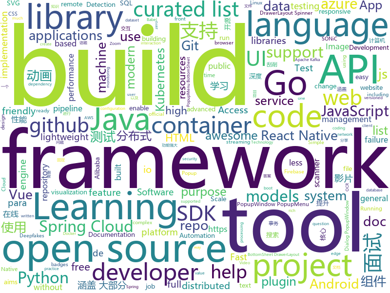

# 2020-07-10
See what the GitHub community is most excited about.

## python
+ [hackingtool](https://github.com/Z4nzu/hackingtool)(**411 stars today**): ALL IN ONE Hacking Tool For Hackers
+ [azure-sdk-for-python](https://github.com/Azure/azure-sdk-for-python)(**13 stars today**): This repository is for active development of the Azure SDK for Python. For consumers of the SDK we recommend visiting our public developer docs at https://docs.microsoft.com/en-us/python/azure/ or our versioned developer docs at https://azure.github.io/azure-sdk-for-python.
+ [DeepFaceLab](https://github.com/iperov/DeepFaceLab)(**188 stars today**): DeepFaceLab is the leading software for creating deepfakes.
+ [EasyOCR](https://github.com/JaidedAI/EasyOCR)(**1,308 stars today**): Ready-to-use OCR with 40+ languages supported including Chinese, Japanese, Korean and Thai
+ [torchsde](https://github.com/google-research/torchsde)(**88 stars today**): Differentiable SDE solvers with GPU support and efficient sensitivity analysis.
+ [texthero](https://github.com/jbesomi/texthero)(**255 stars today**): Text preprocessing, representation and visualization from zero to hero.
+ [cheatsheets](https://github.com/matplotlib/cheatsheets)(**273 stars today**): Official Matplotlib cheat sheets
+ [sweetviz](https://github.com/fbdesignpro/sweetviz)(**131 stars today**): Visualize and compare datasets, target values and associations, with one line of code.
+ [HelloGitHub](https://github.com/521xueweihan/HelloGitHub)(**103 stars today**): Find pearls on open-source seashore 分享 GitHub 上有趣、入门级的开源项目
+ [pytorch-lightning](https://github.com/PyTorchLightning/pytorch-lightning)(**29 stars today**): The lightweight PyTorch wrapper for ML researchers. Scale your models. Write less boilerplate
+ [DeepCreamPy](https://github.com/deeppomf/DeepCreamPy)(**43 stars today**): Decensoring Hentai with Deep Neural Networks
+ [lazypredict](https://github.com/shankarpandala/lazypredict)(**25 stars today**): Lazy Predict help build a lot of basic models without much code and helps understand which models works better without any parameter tuning
+ [elastalert](https://github.com/Yelp/elastalert)(**8 stars today**): Easy & Flexible Alerting With ElasticSearch
+ [PyGithub](https://github.com/PyGithub/PyGithub)(**7 stars today**): Typed interactions with the GitHub API v3
+ [scikit-learn](https://github.com/scikit-learn/scikit-learn)(**15 stars today**): scikit-learn: machine learning in Python
+ [mmediting](https://github.com/open-mmlab/mmediting)(**26 stars today**): OpenMMLab Image and Video Editing Toolbox
+ [modmail](https://github.com/kyb3r/modmail)(**5 stars today**): A feature rich discord Modmail bot
+ [pipelines](https://github.com/kubeflow/pipelines)(**4 stars today**): Machine Learning Pipelines for Kubeflow
+ [mmdetection](https://github.com/open-mmlab/mmdetection)(**32 stars today**): OpenMMLab Detection Toolbox and Benchmark
+ [luigi](https://github.com/spotify/luigi)(**8 stars today**): Luigi is a Python module that helps you build complex pipelines of batch jobs. It handles dependency resolution, workflow management, visualization etc. It also comes with Hadoop support built in.
+ [scispacy](https://github.com/allenai/scispacy)(**8 stars today**): A full spaCy pipeline and models for scientific/biomedical documents.
+ [Team-Ares](https://github.com/Critical-Start/Team-Ares)(**11 stars today**): Repository for all TeamARES POC code and tools.
+ [skywater-pdk](https://github.com/google/skywater-pdk)(**121 stars today**): Open source process design kit for usage with SkyWater Technology Foundry's 130nm node.
+ [faceswap](https://github.com/deepfakes/faceswap)(**30 stars today**): Deepfakes Software For All
+ [spaCy](https://github.com/explosion/spaCy)(**11 stars today**): 💫Industrial-strength Natural Language Processing (NLP) with Python and Cython

## java
+ [tsunami-security-scanner](https://github.com/google/tsunami-security-scanner)(**1,095 stars today**): Tsunami is a general purpose network security scanner with an extensible plugin system for detecting high severity vulnerabilities with high confidence.
+ [metersphere](https://github.com/metersphere/metersphere)(**27 stars today**): MeterSphere 是一站式的开源企业级持续测试平台，涵盖测试跟踪、接口测试、性能测试、团队协作等功能
+ [SpringBoot-Labs](https://github.com/YunaiV/SpringBoot-Labs)(**62 stars today**): 一个涵盖六个专栏：Spring Boot 2.X、Spring Cloud、Spring Cloud Alibaba、Dubbo、分布式消息队列、分布式事务的仓库。希望胖友小手一抖，右上角来个 Star，感恩 1024
+ [tsunami-security-scanner-plugins](https://github.com/google/tsunami-security-scanner-plugins)(**106 stars today**): This project aims to provide a central repository for many useful Tsunami Security Scanner plugins.
+ [presto](https://github.com/prestodb/presto)(**9 stars today**): The official home of the Presto distributed SQL query engine for big data
+ [selenium](https://github.com/SeleniumHQ/selenium)(**14 stars today**): A browser automation framework and ecosystem.
+ [grpc-java](https://github.com/grpc/grpc-java)(**14 stars today**): The Java gRPC implementation. HTTP/2 based RPC
+ [quarkus](https://github.com/quarkusio/quarkus)(**16 stars today**): Quarkus: Supersonic Subatomic Java.
+ [canal](https://github.com/alibaba/canal)(**17 stars today**): 阿里巴巴 MySQL binlog 增量订阅&消费组件
+ [ksql](https://github.com/confluentinc/ksql)(**7 stars today**): The event streaming database purpose-built for stream processing applications
+ [mockito](https://github.com/mockito/mockito)(**8 stars today**): Most popular Mocking framework for unit tests written in Java
+ [shardingsphere-elasticjob-lite](https://github.com/apache/shardingsphere-elasticjob-lite)(**44 stars today**): Distributed scheduled job framework
+ [PowerJob](https://github.com/KFCFans/PowerJob)(**43 stars today**): 新一代分布式任务调度与计算框架，支持CRON、API、固定频率、固定延迟等调度策略，提供工作流来编排任务解决依赖关系，使用简单，功能强大，文档齐全，欢迎各位接入使用！
+ [springcloud-learning](https://github.com/macrozheng/springcloud-learning)(**24 stars today**): 一套涵盖大部分核心组件使用的Spring Cloud教程，包括Spring Cloud Alibaba及分布式事务Seata，基于Spring Cloud Greenwich及SpringBoot 2.1.7。20篇文章，篇篇精华，30个Demo，涵盖大部分应用场景。
+ [karate](https://github.com/intuit/karate)(**5 stars today**): Test Automation Made Simple
+ [QMUI_Android](https://github.com/Tencent/QMUI_Android)(**12 stars today**): 提高 Android UI 开发效率的 UI 库
+ [kkFileView](https://github.com/kekingcn/kkFileView)(**27 stars today**): 使用spring boot打造文件文档在线预览项目解决方案，支持doc、docx、ppt、pptx、xls、xlsx、zip、rar、mp4，mp3以及众多类文本如txt、html、xml、java、properties、sql、js、md、json、conf、ini、vue、php、py、bat、gitignore等文件在线预览
+ [AppAuth-Android](https://github.com/openid/AppAuth-Android)(**3 stars today**): Android client SDK for communicating with OAuth 2.0 and OpenID Connect providers.
+ [keycloak](https://github.com/keycloak/keycloak)(**9 stars today**): Open Source Identity and Access Management For Modern Applications and Services
+ [Tiktok](https://github.com/18380438200/Tiktok)(**76 stars today**): 高仿抖音APP
+ [react-native-twilio-video-webrtc](https://github.com/blackuy/react-native-twilio-video-webrtc)(**0 stars today**): Twilio Video (WebRTC) for React Native
+ [XPopup](https://github.com/li-xiaojun/XPopup)(**6 stars today**): 🔥XPopup2.0版本重磅来袭，2倍以上性能提升，带来可观的动画性能优化和交互细节的提升！！！功能强大，交互优雅，动画丝滑的通用弹窗！可以替代Dialog，PopupWindow，PopupMenu，BottomSheet，DrawerLayout，Spinner等组件，自带十几种效果良好的动画， 支持完全的UI和动画自定义！(Powerful and Beautiful Popup，can absolutely replace Dialog，PopupWindow，PopupMenu，BottomSheet，DrawerLayout，Spinner. With built-in animators , very easy to custom popup view.)
+ [Hystrix](https://github.com/Netflix/Hystrix)(**9 stars today**): Hystrix is a latency and fault tolerance library designed to isolate points of access to remote systems, services and 3rd party libraries, stop cascading failure and enable resilience in complex distributed systems where failure is inevitable.
+ [NewPipe](https://github.com/TeamNewPipe/NewPipe)(**12 stars today**): A libre lightweight streaming front-end for Android.
+ [strimzi-kafka-operator](https://github.com/strimzi/strimzi-kafka-operator)(**6 stars today**): Apache Kafka running on Kubernetes

## unknown
+ [DeepLearning-500-questions](https://github.com/scutan90/DeepLearning-500-questions)(**200 stars today**): 深度学习500问，以问答形式对常用的概率知识、线性代数、机器学习、深度学习、计算机视觉等热点问题进行阐述，以帮助自己及有需要的读者。 全书分为18个章节，50余万字。由于水平有限，书中不妥之处恳请广大读者批评指正。 未完待续............ 如有意合作，联系scutjy2015@163.com 版权所有，违权必究 Tan 2018.06
+ [build-your-own-x](https://github.com/danistefanovic/build-your-own-x)(**88 stars today**): 🤓Build your own (insert technology here)
+ [fucking-algorithm](https://github.com/labuladong/fucking-algorithm)(**138 stars today**): 刷算法全靠套路，认准 labuladong 就够了！English version supported! Crack LeetCode, not only how, but also why.
+ [goQuality-dev-contents](https://github.com/Integerous/goQuality-dev-contents)(**8 stars today**): { 고퀄리티⚡개발 컨텐츠 모음 }
+ [sos-masters](https://github.com/sos-masters/sos-masters)(**1 stars today**): 
+ [first-contributions](https://github.com/firstcontributions/first-contributions)(**20 stars today**): 🚀✨Help beginners to contribute to open source projects
+ [NLP-Conferences-Code](https://github.com/yizhen20133868/NLP-Conferences-Code)(**20 stars today**): NLP-Conferences-Code (ACL、EMNL、NAACL、COLING、AAAI、IJCAI)
+ [tessdata](https://github.com/tesseract-ocr/tessdata)(**8 stars today**): Trained models with support for legacy and LSTM OCR engine
+ [JavaFamily](https://github.com/AobingJava/JavaFamily)(**65 stars today**): 【Java面试+Java学习指南】 一份涵盖大部分Java程序员所需要掌握的核心知识。
+ [awesome-self-supervised-learning](https://github.com/jason718/awesome-self-supervised-learning)(**10 stars today**): A curated list of awesome self-supervised methods
+ [open-source-cs](https://github.com/ForrestKnight/open-source-cs)(**7 stars today**): Video discussing this curriculum:
+ [modern-cpp-features](https://github.com/AnthonyCalandra/modern-cpp-features)(**9 stars today**): A cheatsheet of modern C++ language and library features.
+ [vagas](https://github.com/frontendbr/vagas)(**7 stars today**): 🔬Espaço para divulgação de vagas para front-enders.
+ [Waking-Up](https://github.com/wolverinn/Waking-Up)(**7 stars today**): 计算机基础（计算机网络/操作系统/数据库/Git...）面试问题全面总结，包含详细的follow-up question以及答案；全部采用【问题+追问+答案】的形式，即拿即用，直击互联网大厂面试🚀；可用于模拟面试、面试前复习、短期内快速备战面试...
+ [React-Native-Apps](https://github.com/ReactNativeNews/React-Native-Apps)(**4 stars today**): Curated List of Open Source React Native Apps. Curation curtesy of
+ [awesome-actions](https://github.com/sdras/awesome-actions)(**14 stars today**): A curated list of awesome actions to use on GitHub
+ [javascript-questions](https://github.com/lydiahallie/javascript-questions)(**28 stars today**): A long list of (advanced) JavaScript questions, and their explanations✨
+ [JavGo](https://github.com/javgo-2020/JavGo)(**12 stars today**): JavGo是一个集合影片管理，影片刮削，视频处理，资源搜索等综合一体的全功能影音软件，支持爬取javbus，jav321，javdb，javlibrary进行刮削，支持db，bus的磁力搜索，支持获取library的影片评论。
+ [babel-handbook](https://github.com/jamiebuilds/babel-handbook)(**10 stars today**): 📘A guided handbook on how to use Babel and how to create plugins for Babel.
+ [awesome-semantic-segmentation](https://github.com/mrgloom/awesome-semantic-segmentation)(**9 stars today**): 🤘awesome-semantic-segmentation
+ [deep_learning_object_detection](https://github.com/hoya012/deep_learning_object_detection)(**10 stars today**): A paper list of object detection using deep learning.
+ [design-resources-for-developers](https://github.com/bradtraversy/design-resources-for-developers)(**51 stars today**): Curated list of design and UI resources from stock photos, web templates, CSS frameworks, UI libraries, tools and much more
+ [Specs](https://github.com/CocoaPods/Specs)(**1 stars today**): The CocoaPods Master Repo
+ [awesome-docker](https://github.com/veggiemonk/awesome-docker)(**8 stars today**): 🐳A curated list of Docker resources and projects
+ [A-to-Z-Resources-for-Students](https://github.com/dipakkr/A-to-Z-Resources-for-Students)(**16 stars today**): ✅Curated list of resources for college students

## javascript
+ [cml](https://github.com/iterative/cml)(**147 stars today**): ♾️CML - Continuous Machine Learning or CI/CD for ML
+ [bookshelf](https://github.com/kentcdodds/bookshelf)(**58 stars today**): Build a ReactJS App workshop
+ [alpine](https://github.com/alpinejs/alpine)(**25 stars today**): A rugged, minimal framework for composing JavaScript behavior in your markup.
+ [cypress](https://github.com/cypress-io/cypress)(**28 stars today**): Fast, easy and reliable testing for anything that runs in a browser.
+ [react-query](https://github.com/tannerlinsley/react-query)(**84 stars today**): ⚛️Hooks for fetching, caching and updating asynchronous data in React
+ [three.js](https://github.com/mrdoob/three.js)(**28 stars today**): JavaScript 3D library.
+ [edex-ui](https://github.com/GitSquared/edex-ui)(**260 stars today**): A cross-platform, customizable science fiction terminal emulator with advanced monitoring & touchscreen support.
+ [gatsby](https://github.com/gatsbyjs/gatsby)(**29 stars today**): Build blazing fast, modern apps and websites with React
+ [react-native-firebase](https://github.com/invertase/react-native-firebase)(**118 stars today**): 🔥A well-tested feature-rich modular Firebase implementation for React Native. Supports both iOS & Android platforms for all Firebase services.
+ [svelte](https://github.com/sveltejs/svelte)(**33 stars today**): Cybernetically enhanced web apps
+ [lazysizes](https://github.com/aFarkas/lazysizes)(**9 stars today**): High performance and SEO friendly lazy loader for images (responsive and normal), iframes and more, that detects any visibility changes triggered through user interaction, CSS or JavaScript without configuration.
+ [cube.js](https://github.com/cube-js/cube.js)(**40 stars today**): 📊Cube.js - Open Source Analytics Framework
+ [jsPDF](https://github.com/MrRio/jsPDF)(**12 stars today**): Client-side JavaScript PDF generation for everyone.
+ [redwood](https://github.com/redwoodjs/redwood)(**31 stars today**): Bringing full-stack to the Jamstack.
+ [d3](https://github.com/d3/d3)(**26 stars today**): Bring data to life with SVG, Canvas and HTML.📊📈🎉
+ [quasar](https://github.com/quasarframework/quasar)(**14 stars today**): Quasar Framework - Build high-performance VueJS user interfaces in record time
+ [vant-weapp](https://github.com/youzan/vant-weapp)(**10 stars today**): 轻量、可靠的小程序 UI 组件库
+ [react-native-reanimated](https://github.com/software-mansion/react-native-reanimated)(**9 stars today**): React Native's Animated library reimplemented
+ [pwa-studio](https://github.com/magento/pwa-studio)(**1 stars today**): 🛠Development tools to build, optimize and deploy Progressive Web Applications for Magento 2.
+ [json-server](https://github.com/typicode/json-server)(**23 stars today**): Get a full fake REST API with zero coding in less than 30 seconds (seriously)
+ [Inputmask](https://github.com/RobinHerbots/Inputmask)(**4 stars today**): Input Mask plugin
+ [nuxt.js](https://github.com/nuxt/nuxt.js)(**36 stars today**): The Intuitive Vue Framework
+ [vue-cli](https://github.com/vuejs/vue-cli)(**11 stars today**): 🛠️Standard Tooling for Vue.js Development
+ [shields](https://github.com/badges/shields)(**18 stars today**): Concise, consistent, and legible badges in SVG and raster format
+ [remote-jobs](https://github.com/remoteintech/remote-jobs)(**7 stars today**): A list of semi to fully remote-friendly companies in tech.

## html
+ [free-for-dev](https://github.com/ripienaar/free-for-dev)(**71 stars today**): A list of SaaS, PaaS and IaaS offerings that have free tiers of interest to devops and infradev
+ [swagger-codegen](https://github.com/swagger-api/swagger-codegen)(**10 stars today**): swagger-codegen contains a template-driven engine to generate documentation, API clients and server stubs in different languages by parsing your OpenAPI / Swagger definition.
+ [learning-area](https://github.com/mdn/learning-area)(**8 stars today**): Github repo for the MDN Learning Area.
+ [awesome-compose](https://github.com/docker/awesome-compose)(**12 stars today**): Awesome Docker Compose samples
+ [100knocks-preprocess](https://github.com/The-Japan-DataScientist-Society/100knocks-preprocess)(**9 stars today**): データサイエンス100本ノック（構造化データ加工編）
+ [text-to-handwriting](https://github.com/saurabhdaware/text-to-handwriting)(**10 stars today**): So your teacher asked you to upload written assignments? Hate writing assigments? This tool will help you convert your text to handwriting xD
+ [apidoc](https://github.com/apidoc/apidoc)(**7 stars today**): RESTful web API Documentation Generator.
+ [wpt](https://github.com/web-platform-tests/wpt)(**2 stars today**): Test suites for Web platform specs — including WHATWG, W3C, and others
+ [RADWIMPS](https://github.com/approvers/RADWIMPS)(**18 stars today**): 君の then-then-then 世は Promise で Future
+ [html](https://github.com/whatwg/html)(**6 stars today**): HTML Standard
+ [hyperblog](https://github.com/freddier/hyperblog)(**12 stars today**): Un blog increíble para el curso de Git y Github de Platzi
+ [repo-badges](https://github.com/dwyl/repo-badges)(**8 stars today**): ⭐Use repo badges (build passing, coverage, etc) in your readme/markdown file to signal code quality in a project.
+ [computer-science-flash-cards](https://github.com/jwasham/computer-science-flash-cards)(**5 stars today**): Mini website for testing both general CS knowledge and enforce coding practice and common algorithm/data structure memorization.
+ [CRD3](https://github.com/RevanthRameshkumar/CRD3)(**4 stars today**): The repo containing the Critical Role Dungeons and Dragons Dataset.
+ [git-it-electron](https://github.com/jlord/git-it-electron)(**4 stars today**): 💻🎓Git-it is a (Mac, Win, Linux) Desktop App for Learning Git and GitHub
+ [WebFundamentals](https://github.com/google/WebFundamentals)(**6 stars today**): Best practices for modern web development
+ [tiny-slider](https://github.com/ganlanyuan/tiny-slider)(**9 stars today**): Vanilla javascript slider for all purposes.
+ [responsive-html-email-template](https://github.com/leemunroe/responsive-html-email-template)(**4 stars today**): A free simple responsive HTML email template
+ [devdocs](https://github.com/magento/devdocs)(**0 stars today**): Magento Developer Documentation
+ [SONiC](https://github.com/Azure/SONiC)(**2 stars today**): Landing page for Software for Open Networking in the Cloud (SONiC) - http://azure.github.io/SONiC/
+ [shellphish](https://github.com/suljot/shellphish)(**3 stars today**): Phishing Tool for Instagram, Facebook, Twitter, Snapchat, Github
+ [styleguide](https://github.com/google/styleguide)(**11 stars today**): Style guides for Google-originated open-source projects
+ [v-calendar](https://github.com/nathanreyes/v-calendar)(**3 stars today**): A lightweight, dependency-free plugin for building attributed calendars in Vue.js
+ [zfaka](https://github.com/zlkbdotnet/zfaka)(**2 stars today**): 免费、安全、稳定、高效的发卡系统，值得拥有!
+ [kubernetes-failure-stories](https://github.com/hjacobs/kubernetes-failure-stories)(**3 stars today**): Compilation of public failure/horror stories related to Kubernetes

## go
+ [moby](https://github.com/moby/moby)(**11 stars today**): Moby Project - a collaborative project for the container ecosystem to assemble container-based systems
+ [copilot-cli](https://github.com/aws/copilot-cli)(**86 stars today**): The AWS Copilot CLI is a tool for developers to build, release and operate production ready containerized applications on Amazon ECS and AWS Fargate.
+ [minikube](https://github.com/kubernetes/minikube)(**27 stars today**): Run Kubernetes locally
+ [aws-sdk-go](https://github.com/aws/aws-sdk-go)(**2 stars today**): AWS SDK for the Go programming language.
+ [terraform](https://github.com/hashicorp/terraform)(**22 stars today**): Terraform enables you to safely and predictably create, change, and improve infrastructure. It is an open source tool that codifies APIs into declarative configuration files that can be shared amongst team members, treated as code, edited, reviewed, and versioned.
+ [kubectx](https://github.com/ahmetb/kubectx)(**13 stars today**): Faster way to switch between clusters and namespaces in kubectl
+ [mosn](https://github.com/mosn/mosn)(**10 stars today**): MOSN is a cloud native proxy for edge or service mesh. https://mosn.io
+ [GhostDB](https://github.com/jakekgrog/GhostDB)(**119 stars today**): GhostDB is a distributed, in-memory, general purpose key-value data store that delivers microsecond performance at any scale.
+ [kubeedge](https://github.com/kubeedge/kubeedge)(**5 stars today**): Kubernetes Native Edge Computing Framework (project under CNCF)
+ [night](https://github.com/talkgo/night)(**11 stars today**): Weekly Go Online Meetup via Zoom and Bilibili｜Go 夜读｜由 SIG 成员维护｜通过 zoom 在线直播的方式分享 Go 相关的技术话题，每天大家在微信/telegram/Slack 上及时沟通交流编程技术话题。
+ [golangci-lint](https://github.com/golangci/golangci-lint)(**11 stars today**): Fast linters Runner for Go
+ [sarama](https://github.com/Shopify/sarama)(**7 stars today**): Sarama is a Go library for Apache Kafka 0.8, and up.
+ [rancher](https://github.com/rancher/rancher)(**19 stars today**): Complete container management platform
+ [teleport](https://github.com/gravitational/teleport)(**27 stars today**): Secure Access for Developers that doesn't get in the way.
+ [vuls](https://github.com/future-architect/vuls)(**7 stars today**): Agent-less vulnerability scanner for Linux, FreeBSD, Container Image, Running Container, WordPress, Programming language libraries, Network devices
+ [cortex](https://github.com/cortexlabs/cortex)(**18 stars today**): Build machine learning APIs
+ [prometheus](https://github.com/prometheus/prometheus)(**26 stars today**): The Prometheus monitoring system and time series database.
+ [gorm](https://github.com/go-gorm/gorm)(**24 stars today**): The fantastic ORM library for Golang, aims to be developer friendly (v2 is under public testing...)
+ [kubernetes](https://github.com/kubernetes/kubernetes)(**42 stars today**): Production-Grade Container Scheduling and Management
+ [charts](https://github.com/helm/charts)(**12 stars today**): Curated applications for Kubernetes
+ [mongo-go-driver](https://github.com/mongodb/mongo-go-driver)(**6 stars today**): The Go driver for MongoDB
+ [kubebuilder](https://github.com/kubernetes-sigs/kubebuilder)(**7 stars today**): Kubebuilder - SDK for building Kubernetes APIs using CRDs
+ [grpc-go](https://github.com/grpc/grpc-go)(**13 stars today**): The Go language implementation of gRPC. HTTP/2 based RPC
+ [gopsutil](https://github.com/shirou/gopsutil)(**4 stars today**): psutil for golang
+ [kubevirt](https://github.com/kubevirt/kubevirt)(**4 stars today**): Kubernetes Virtualization API and runtime in order to define and manage virtual machines.

## WordCloud

