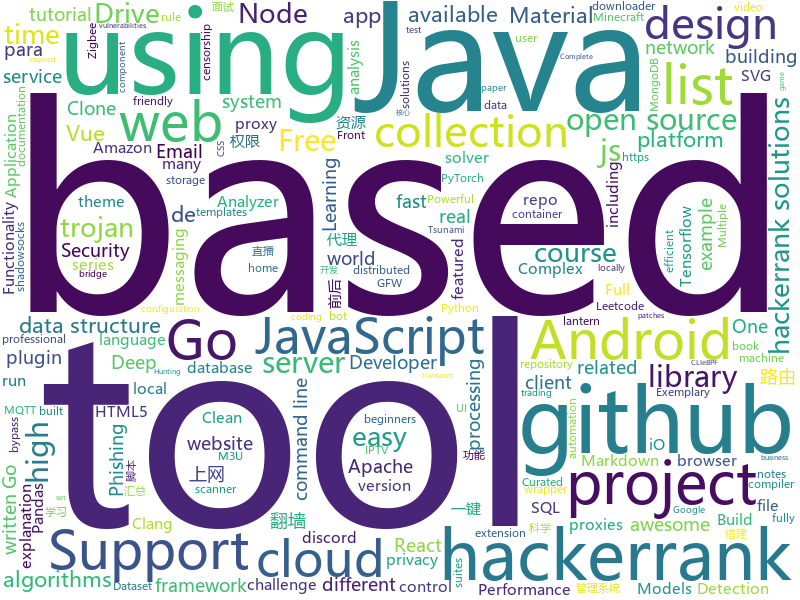

# 2020-07-12
See what the GitHub community is most excited about.

## python
+ [spleeter](https://github.com/deezer/spleeter)(**144 stars today**): Deezer source separation library including pretrained models.
+ [nlp](https://github.com/huggingface/nlp)(**58 stars today**): 🤗nlp – Datasets and evaluation metrics for Natural Language Processing in NumPy, Pandas, PyTorch and TensorFlow
+ [DeepFaceLab](https://github.com/iperov/DeepFaceLab)(**171 stars today**): DeepFaceLab is the leading software for creating deepfakes.
+ [hackingtool](https://github.com/Z4nzu/hackingtool)(**802 stars today**): ALL IN ONE Hacking Tool For Hackers
+ [100-Days-Of-ML-Code](https://github.com/Avik-Jain/100-Days-Of-ML-Code)(**44 stars today**): 100 Days of ML Coding
+ [fastapi](https://github.com/tiangolo/fastapi)(**86 stars today**): FastAPI framework, high performance, easy to learn, fast to code, ready for production
+ [HiddenEye](https://github.com/DarkSecDevelopers/HiddenEye)(**4 stars today**): Modern Phishing Tool With Advanced Functionality And Multiple Tunnelling Services [ Android-Support-Available ]
+ [python-telegram-bot](https://github.com/python-telegram-bot/python-telegram-bot)(**10 stars today**): We have made you a wrapper you can't refuse
+ [Complex-YOLOv4-Pytorch](https://github.com/maudzung/Complex-YOLOv4-Pytorch)(**31 stars today**): The PyTorch Implementation based on YOLOv4 of the paper: "Complex-YOLO: Real-time 3D Object Detection on Point Clouds"
+ [darts](https://github.com/unit8co/darts)(**36 stars today**): A python library for easy manipulation and forecasting of time series.
+ [models](https://github.com/tensorflow/models)(**56 stars today**): Models and examples built with TensorFlow
+ [machine_learning_examples](https://github.com/lazyprogrammer/machine_learning_examples)(**5 stars today**): A collection of machine learning examples and tutorials.
+ [mmsegmentation](https://github.com/open-mmlab/mmsegmentation)(**44 stars today**): OpenMMLab Semantic Segmentation Toolbox and Benchmark.
+ [keras](https://github.com/keras-team/keras)(**14 stars today**): Deep Learning for humans
+ [core](https://github.com/home-assistant/core)(**10 stars today**): 🏡Open source home automation that puts local control and privacy first
+ [scikit-image](https://github.com/scikit-image/scikit-image)(**8 stars today**): Image processing in Python
+ [gibMacOS](https://github.com/corpnewt/gibMacOS)(**6 stars today**): Py2/py3 script that can download macOS components direct from Apple
+ [codechecker](https://github.com/Ericsson/codechecker)(**6 stars today**): CodeChecker is an analyzer tooling, defect database and viewer extension for the Clang Static Analyzer and Clang Tidy
+ [matplotlib](https://github.com/matplotlib/matplotlib)(**16 stars today**): matplotlib: plotting with Python
+ [yfinance](https://github.com/ranaroussi/yfinance)(**8 stars today**): Yahoo! Finance market data downloader (+faster Pandas Datareader)
+ [image-gpt](https://github.com/openai/image-gpt)(**7 stars today**): 
+ [torchsde](https://github.com/google-research/torchsde)(**93 stars today**): Differentiable SDE solvers with GPU support and efficient sensitivity analysis.
+ [freqtrade](https://github.com/freqtrade/freqtrade)(**6 stars today**): Free, open source crypto trading bot
+ [h8mail](https://github.com/khast3x/h8mail)(**4 stars today**): Password Breach Hunting & Email OSINT tool, locally or using premium services. Supports chasing down related email
+ [DeepLearning.ai-Summary](https://github.com/mbadry1/DeepLearning.ai-Summary)(**7 stars today**): This repository contains my personal notes and summaries on DeepLearning.ai specialization courses. I've enjoyed every little bit of the course hope you enjoy my notes too.

## java
+ [tsunami-security-scanner](https://github.com/google/tsunami-security-scanner)(**662 stars today**): Tsunami is a general purpose network security scanner with an extensible plugin system for detecting high severity vulnerabilities with high confidence.
+ [pulsar](https://github.com/apache/pulsar)(**20 stars today**): Apache Pulsar - distributed pub-sub messaging system
+ [Algorithms](https://github.com/williamfiset/Algorithms)(**19 stars today**): A collection of algorithms and data structures
+ [vhr](https://github.com/lenve/vhr)(**62 stars today**): 微人事是一个前后端分离的人力资源管理系统，项目采用SpringBoot+Vue开发。
+ [libgdx](https://github.com/libgdx/libgdx)(**9 stars today**): Desktop/Android/HTML5/iOS Java game development framework
+ [interview](https://github.com/mission-peace/interview)(**8 stars today**): Interview questions
+ [k-9](https://github.com/k9mail/k-9)(**6 stars today**): K-9 Mail – Open Source Email App for Android
+ [androrat](https://github.com/wszf/androrat)(**6 stars today**): androrat
+ [JDA](https://github.com/DV8FromTheWorld/JDA)(**6 stars today**): Java wrapper for the popular chat & VOIP service: Discord https://discord.com
+ [BungeeCord](https://github.com/SpigotMC/BungeeCord)(**2 stars today**): BungeeCord, the 6th in a generation of server portal suites. Efficiently proxies and maintains connections and transport between multiple Minecraft servers.
+ [FairEmail](https://github.com/M66B/FairEmail)(**6 stars today**): Fully featured, open source, privacy friendly email app for Android
+ [Lawnchair](https://github.com/LawnchairLauncher/Lawnchair)(**4 stars today**): No clever tagline needed
+ [tsunami-security-scanner-plugins](https://github.com/google/tsunami-security-scanner-plugins)(**66 stars today**): This project aims to provide a central repository for many useful Tsunami Security Scanner plugins.
+ [tomcat](https://github.com/apache/tomcat)(**7 stars today**): Apache Tomcat
+ [okhttp](https://github.com/square/okhttp)(**14 stars today**): Square’s meticulous HTTP client for Java and Kotlin.
+ [mongo-java-driver](https://github.com/mongodb/mongo-java-driver)(**2 stars today**): The Java driver for MongoDB
+ [Apktool](https://github.com/iBotPeaches/Apktool)(**9 stars today**): A tool for reverse engineering Android apk files
+ [igniter](https://github.com/trojan-gfw/igniter)(**9 stars today**): A trojan client for Android (UNDER CONSTRUCTION).
+ [fabric](https://github.com/FabricMC/fabric)(**2 stars today**): Essential hooks and patches for modding with Fabric.
+ [Arduino](https://github.com/arduino/Arduino)(**4 stars today**): open-source electronics platform
+ [VirtualApp](https://github.com/asLody/VirtualApp)(**7 stars today**): Virtual Engine for Android(Support 10.0 in business version)
+ [MCinaBox](https://github.com/longjunyu2/MCinaBox)(**6 stars today**): MCinaBox - A Minecraft Java Edition Launcher on Android
+ [JavaGuide](https://github.com/Snailclimb/JavaGuide)(**98 stars today**): 「Java学习+面试指南」一份涵盖大部分Java程序员所需要掌握的核心知识。
+ [Hackerrank-Solutions](https://github.com/Java-aid/Hackerrank-Solutions)(**3 stars today**): hackerrank solutions github | hackerrank all solutions | hackerrank solutions for java | hackerrank video tutorial | hackerrank cracking the coding interview solutions | hackerrank data structures | hackerrank solutions algorithms | hackerrank challenge | hackerrank coding challenge | hackerrank algorithms solutions github| hackerrank problem so…
+ [CS-Notes](https://github.com/CyC2018/CS-Notes)(**99 stars today**): 📚技术面试必备基础知识、Leetcode、计算机操作系统、计算机网络、系统设计、Java、Python、C++

## unknown
+ [COVID-19](https://github.com/CSSEGISandData/COVID-19)(**24 stars today**): Novel Coronavirus (COVID-19) Cases, provided by JHU CSSE
+ [developer-handbook](https://github.com/apptension/developer-handbook)(**661 stars today**): An opinionated guide on how to become a professional Web/Mobile App Developer.
+ [paper_collection](https://github.com/0xricksanchez/paper_collection)(**98 stars today**): Academic papers related to fuzzing, binary analysis and exploit dev, that I want to read or have already read
+ [the-art-of-command-line](https://github.com/jlevy/the-art-of-command-line)(**93 stars today**): Master the command line, in one page
+ [diy-eurorack](https://github.com/erica-synths/diy-eurorack)(**75 stars today**): Erica Synths DIY Eurorack Modules
+ [new-pac](https://github.com/Alvin9999/new-pac)(**18 stars today**): 科学上网/自由上网/翻墙/软件/方法，一键翻墙浏览器，免费shadowsocks/ss/ssr/v2ray/goflyway账号，vps一键搭建脚本/教程
+ [free-programming-books](https://github.com/EbookFoundation/free-programming-books)(**150 stars today**): 📚Freely available programming books
+ [build-your-own-x](https://github.com/danistefanovic/build-your-own-x)(**116 stars today**): 🤓Build your own (insert technology here)
+ [fucking-algorithm](https://github.com/labuladong/fucking-algorithm)(**178 stars today**): 刷算法全靠套路，认准 labuladong 就够了！English version supported! Crack LeetCode, not only how, but also why.
+ [trackerslist](https://github.com/ngosang/trackerslist)(**32 stars today**): Updated list of public BitTorrent trackers
+ [formats](https://github.com/corkami/formats)(**292 stars today**): File formats
+ [flutter_roadmap](https://github.com/olexale/flutter_roadmap)(**18 stars today**): Highly Subjective Roadmap to Flutter Development
+ [course-gitbook](https://github.com/full-stack-deep-learning/course-gitbook)(**65 stars today**): Full Stack Deep Learning Online Course
+ [you-dont-know-js-ru](https://github.com/azat-io/you-dont-know-js-ru)(**5 stars today**): 📚Russian translation of "You Don't Know JS" book series
+ [awesome-tailwindcss](https://github.com/aniftyco/awesome-tailwindcss)(**14 stars today**): A curated list of awesome things related to Tailwind CSS
+ [awesome-for-beginners](https://github.com/MunGell/awesome-for-beginners)(**46 stars today**): A list of awesome beginners-friendly projects.
+ [Profiles](https://github.com/ConnersHua/Profiles)(**16 stars today**): 
+ [precourse](https://github.com/NeuromatchAcademy/precourse)(**7 stars today**): A repo for the pre-course work at home exercises
+ [vagas](https://github.com/frontendbr/vagas)(**13 stars today**): 🔬Espaço para divulgação de vagas para front-enders.
+ [project-based-learning](https://github.com/tuvtran/project-based-learning)(**63 stars today**): Curated list of project-based tutorials
+ [Tvlist-awesome-m3u-m3u8](https://github.com/billy21/Tvlist-awesome-m3u-m3u8)(**16 stars today**): 直播源相关资源汇总📺💯IPTV、M3U —— 勤洗手、戴口罩，祝愿所有人百毒不侵
+ [CoronaFaceMaskDetectionTFJS](https://github.com/aribornstein/CoronaFaceMaskDetectionTFJS)(**14 stars today**): Corona Face Mask Detection with Custom Vision and Tensorflow.js
+ [design-patterns-for-humans](https://github.com/kamranahmedse/design-patterns-for-humans)(**17 stars today**): An ultra-simplified explanation to design patterns
+ [design-resources-for-developers](https://github.com/bradtraversy/design-resources-for-developers)(**78 stars today**): Curated list of design and UI resources from stock photos, web templates, CSS frameworks, UI libraries, tools and much more
+ [patterns](https://github.com/rust-unofficial/patterns)(**8 stars today**): A catalogue of Rust design patterns

## javascript
+ [youtubeclone-frontend](https://github.com/manikandanraji/youtubeclone-frontend)(**73 stars today**): Youtube Clone Frontend (React + Redux)
+ [node-react-ecommerce](https://github.com/basir/node-react-ecommerce)(**10 stars today**): Build ECommerce Website Like Amazon By React & Node & MongoDB
+ [realworld](https://github.com/gothinkster/realworld)(**157 stars today**): "The mother of all demo apps" — Exemplary fullstack Medium.com clone powered by React, Angular, Node, Django, and many more🏅
+ [Awesome-Profile-README-templates](https://github.com/kautukkundan/Awesome-Profile-README-templates)(**263 stars today**): A collection of awesome readme templates to display on your profile
+ [youtubeclone-backend](https://github.com/manikandanraji/youtubeclone-backend)(**54 stars today**): Youtube Clone Backend (Express + Sequelize)
+ [Tiny-XSS-Payloads](https://github.com/terjanq/Tiny-XSS-Payloads)(**159 stars today**): A collection of tiny XSS Payloads that can be used in different contexts.
+ [complete-javascript-course](https://github.com/jonasschmedtmann/complete-javascript-course)(**11 stars today**): Starter files, final projects and FAQ for my Complete JavaScript course
+ [github-readme-stats](https://github.com/anuraghazra/github-readme-stats)(**135 stars today**): Dynamically generated stats for your github readmes
+ [sqlpad](https://github.com/rickbergfalk/sqlpad)(**52 stars today**): Web-based SQL editor run in your own private cloud. Supports MySQL, Postgres, SQL Server, Vertica, Crate, ClickHouse, Presto, SAP HANA, Cassandra, Snowflake, BigQuery, SQLite, and more with ODBC
+ [gd-utils](https://github.com/iwestlin/gd-utils)(**53 stars today**): Google Drive 百宝箱
+ [cypress](https://github.com/cypress-io/cypress)(**99 stars today**): Fast, easy and reliable testing for anything that runs in a browser.
+ [vue-realworld-example-app](https://github.com/gothinkster/vue-realworld-example-app)(**6 stars today**): An exemplary real-world application built with Vue.js, Vuex, axios and different other technologies. This is a good example to discover Vue for beginners.
+ [pipedream](https://github.com/PipedreamHQ/pipedream)(**5 stars today**): Serverless integration and compute platform. Free for developers.
+ [automerge](https://github.com/automerge/automerge)(**93 stars today**): A JSON-like data structure (a CRDT) that can be modified concurrently by different users, and merged again automatically.
+ [AudioMass](https://github.com/pkalogiros/AudioMass)(**95 stars today**): Free full-featured web-based audio & waveform editing tool
+ [Real-Time-Person-Removal](https://github.com/jasonmayes/Real-Time-Person-Removal)(**44 stars today**): Removing people from complex backgrounds in real time using TensorFlow.js in the web browser
+ [mdx](https://github.com/mdx-js/mdx)(**15 stars today**): JSX in Markdown for ambitious projects
+ [malinajs](https://github.com/malinajs/malinajs)(**94 stars today**): Frontend compiler, inspired by Svelte
+ [buster](https://github.com/dessant/buster)(**6 stars today**): Captcha solver extension for humans
+ [uvu](https://github.com/lukeed/uvu)(**135 stars today**): uvu is an extremely fast and lightweight test runner for Node.js and the browser
+ [javascript-algorithms](https://github.com/trekhleb/javascript-algorithms)(**135 stars today**): 📝Algorithms and data structures implemented in JavaScript with explanations and links to further readings
+ [shields](https://github.com/badges/shields)(**24 stars today**): Concise, consistent, and legible badges in SVG and raster format
+ [react](https://github.com/facebook/react)(**131 stars today**): A declarative, efficient, and flexible JavaScript library for building user interfaces.
+ [zigbee2mqtt](https://github.com/Koenkk/zigbee2mqtt)(**6 stars today**): Zigbee🐝to MQTT bridge🌉, get rid of your proprietary Zigbee bridges🔨
+ [iptv](https://github.com/iptv-org/iptv)(**43 stars today**): Collection of 8000+ publicly available IPTV channels from all over the world

## html
+ [nndl.github.io](https://github.com/nndl/nndl.github.io)(**25 stars today**): 《神经网络与深度学习》 邱锡鹏著 Neural Network and Deep Learning
+ [free-for-dev](https://github.com/ripienaar/free-for-dev)(**119 stars today**): A list of SaaS, PaaS and IaaS offerings that have free tiers of interest to devops and infradev
+ [Tasmota](https://github.com/arendst/Tasmota)(**16 stars today**): Alternative firmware for ESP8266 with easy configuration using webUI, OTA updates, automation using timers or rules, expandability and entirely local control over MQTT, HTTP, Serial or KNX. Full documentation at
+ [tabler-icons](https://github.com/tabler/tabler-icons)(**234 stars today**): A set of over 550 free MIT-licensed high-quality SVG icons for you to use in your web projects.
+ [hyperblog](https://github.com/freddier/hyperblog)(**19 stars today**): Un blog increíble para el curso de Git y Github de Platzi
+ [ML-notes](https://github.com/Sakura-gh/ML-notes)(**15 stars today**): notes about machine learning
+ [iptv-m3u-maker](https://github.com/EvilCult/iptv-m3u-maker)(**5 stars today**): IPTV 国内+国外 电视台直播源m3u文件, 收集&汇总&本地源脚本
+ [fluxion](https://github.com/FluxionNetwork/fluxion)(**5 stars today**): Fluxion is a remake of linset by vk496 with enhanced functionality.
+ [mxgraph](https://github.com/jgraph/mxgraph)(**8 stars today**): mxGraph is a fully client side JavaScript diagramming library
+ [github-markdown-css](https://github.com/sindresorhus/github-markdown-css)(**4 stars today**): The minimal amount of CSS to replicate the GitHub Markdown style
+ [html-css](https://github.com/gustavoguanabara/html-css)(**2 stars today**): Curso de HTML5 e CSS3
+ [TinDog-Start](https://github.com/londonappbrewery/TinDog-Start)(**3 stars today**): 
+ [shellphish](https://github.com/suljot/shellphish)(**1 stars today**): Phishing Tool for Instagram, Facebook, Twitter, Snapchat, Github
+ [hexo-theme-fluid](https://github.com/fluid-dev/hexo-theme-fluid)(**20 stars today**): 🌊一款 Material Design 风格的 Hexo 主题 / An elegant Material-Design theme for Hexo
+ [hugo-book](https://github.com/alex-shpak/hugo-book)(**4 stars today**): Hugo documentation theme as simple as plain book
+ [ai-edu](https://github.com/microsoft/ai-edu)(**11 stars today**): AI education materials for Chinese students, teachers and IT professionals.
+ [zenbot](https://github.com/DeviaVir/zenbot)(**4 stars today**): Zenbot is a command-line cryptocurrency trading bot using Node.js and MongoDB.
+ [3d-force-graph](https://github.com/vasturiano/3d-force-graph)(**3 stars today**): 3D force-directed graph component using ThreeJS/WebGL
+ [node-ytdl-core](https://github.com/fent/node-ytdl-core)(**1 stars today**): YouTube video downloader in javascript.
+ [WishFish](https://github.com/kinghacker0/WishFish)(**5 stars today**): Powerful Tool For Grab Front Camera Snap Using A Link
+ [zphisher](https://github.com/htr-tech/zphisher)(**2 stars today**): Automated Phishing Tool
+ [blackeye](https://github.com/An0nUD4Y/blackeye)(**4 stars today**): The ultimate phishing tool with 38 websites available!
+ [wpt](https://github.com/web-platform-tests/wpt)(**3 stars today**): Test suites for Web platform specs — including WHATWG, W3C, and others
+ [CRD3](https://github.com/RevanthRameshkumar/CRD3)(**15 stars today**): The repo containing the Critical Role Dungeons and Dragons Dataset.
+ [Dism-Multi-language](https://github.com/Chuyu-Team/Dism-Multi-language)(**6 stars today**): Dism++ Multi-language Support & BUG Report

## go
+ [gin-vue-admin](https://github.com/flipped-aurora/gin-vue-admin)(**95 stars today**): 基于gin+vue搭建的后台管理系统框架，集成jwt鉴权，权限管理，动态路由，分页封装，多点登录拦截，资源权限，上传下载，代码生成器，表单生成器等基础功能，五分钟一套CURD前后端代码包含数据库的快感你不要体验一下吗~,更多功能正在开发中，欢迎issue和pr~
+ [moby](https://github.com/moby/moby)(**45 stars today**): Moby Project - a collaborative project for the container ecosystem to assemble container-based systems
+ [teleport](https://github.com/gravitational/teleport)(**31 stars today**): Secure Access for Developers that doesn't get in the way.
+ [bfe](https://github.com/bfenetworks/bfe)(**57 stars today**): A modern layer 7 load balancer from baidu
+ [rclone](https://github.com/rclone/rclone)(**33 stars today**): "rsync for cloud storage" - Google Drive, Amazon Drive, S3, Dropbox, Backblaze B2, One Drive, Swift, Hubic, Cloudfiles, Google Cloud Storage, Yandex Files
+ [ecs-plugin](https://github.com/docker/ecs-plugin)(**53 stars today**): CLI plugin for using Fargate/ECS with Docker CLI
+ [cilium](https://github.com/cilium/cilium)(**29 stars today**): eBPF-based Networking, Security, and Observability
+ [prometheus](https://github.com/prometheus/prometheus)(**42 stars today**): The Prometheus monitoring system and time series database.
+ [fyne](https://github.com/fyne-io/fyne)(**14 stars today**): Cross platform GUI in Go based on Material Design
+ [go-safeweb](https://github.com/google/go-safeweb)(**75 stars today**): Secure-by-default HTTP servers in Go.
+ [nats-server](https://github.com/nats-io/nats-server)(**11 stars today**): High-Performance server for NATS, the cloud native messaging system.
+ [lantern](https://github.com/getlantern/lantern)(**23 stars today**): Lantern官方版本下载 蓝灯 翻墙 代理 科学上网 外网 加速器 梯子 路由 lantern proxy vpn censorship-circumvention censorship gfw accelerator
+ [telegram-bot-api](https://github.com/go-telegram-bot-api/telegram-bot-api)(**6 stars today**): Golang bindings for the Telegram Bot API
+ [envconfig](https://github.com/kelseyhightower/envconfig)(**8 stars today**): Golang library for managing configuration data from environment variables
+ [gobuster](https://github.com/OJ/gobuster)(**10 stars today**): Directory/File, DNS and VHost busting tool written in Go
+ [f1viewer](https://github.com/SoMuchForSubtlety/f1viewer)(**10 stars today**): 🏎️TUI for F1TV
+ [v2ray-core](https://github.com/v2ray/v2ray-core)(**53 stars today**): A platform for building proxies to bypass network restrictions.
+ [gvisor](https://github.com/google/gvisor)(**8 stars today**): Application Kernel for Containers
+ [tinygo](https://github.com/tinygo-org/tinygo)(**4 stars today**): Go compiler for small places. Microcontrollers, WebAssembly, and command-line tools. Based on LLVM.
+ [trojan-go](https://github.com/p4gefau1t/trojan-go)(**8 stars today**): Go实现的Trojan代理，支持多路复用/路由功能/CDN中转/Shadowsocks混淆插件，多平台，无依赖。A Trojan proxy written in Go. An unidentifiable mechanism that helps you bypass GFW. https://p4gefau1t.github.io/trojan-go/
+ [go-clean-arch](https://github.com/bxcodec/go-clean-arch)(**5 stars today**): Go (Golang) Clean Architecture based on Reading Uncle Bob's Clean Architecture
+ [act](https://github.com/nektos/act)(**54 stars today**): Run your GitHub Actions locally🚀
+ [clash](https://github.com/Dreamacro/clash)(**61 stars today**): A rule-based tunnel in Go.
+ [hugo](https://github.com/gohugoio/hugo)(**43 stars today**): The world’s fastest framework for building websites.
+ [goka](https://github.com/lovoo/goka)(**37 stars today**): Goka is a compact yet powerful distributed stream processing library for Apache Kafka written in Go.

## WordCloud

