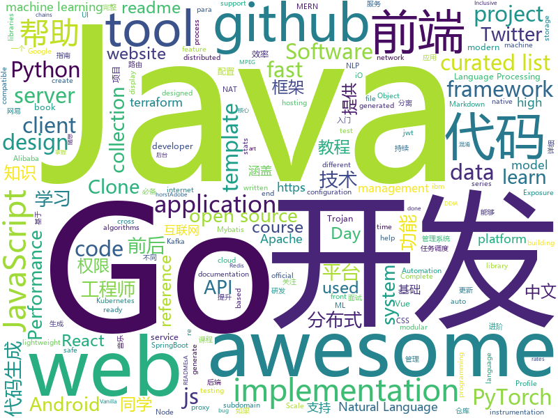

# 2020-07-15
See what the GitHub community is most excited about.

## python
+ [nlp](https://github.com/huggingface/nlp)(**255 stars today**): 🤗nlp – Datasets and evaluation metrics for Natural Language Processing in NumPy, Pandas, PyTorch and TensorFlow
+ [game_control](https://github.com/ChoudharyChanchal/game_control)(**231 stars today**): 
+ [sktime](https://github.com/alan-turing-institute/sktime)(**43 stars today**): A scikit-learn compatible Python toolbox for machine learning with time series
+ [gradio](https://github.com/gradio-app/gradio)(**56 stars today**): Rapidly create UIs for prototyping your machine learning model in 3 minutes
+ [MagicMagnet-Python](https://github.com/pedrolemoz/MagicMagnet-Python)(**36 stars today**): Get magnet links from internet without any effort!🧲
+ [voila](https://github.com/voila-dashboards/voila)(**77 stars today**): Voilà turns Jupyter notebooks into standalone web applications
+ [pytorch-lightning](https://github.com/PyTorchLightning/pytorch-lightning)(**100 stars today**): The lightweight PyTorch wrapper for ML researchers. Scale your models. Write less boilerplate
+ [sentence-transformers](https://github.com/UKPLab/sentence-transformers)(**14 stars today**): Sentence Embeddings with BERT & XLNet
+ [cpython](https://github.com/python/cpython)(**26 stars today**): The Python programming language
+ [fastapi](https://github.com/tiangolo/fastapi)(**316 stars today**): FastAPI framework, high performance, easy to learn, fast to code, ready for production
+ [workshops](https://github.com/ansible/workshops)(**3 stars today**): Training Course for Ansible Automation Platform
+ [transformers](https://github.com/huggingface/transformers)(**77 stars today**): 🤗Transformers: State-of-the-art Natural Language Processing for Pytorch and TensorFlow 2.0.
+ [wait-for-it](https://github.com/vishnubob/wait-for-it)(**5 stars today**): Pure bash script to test and wait on the availability of a TCP host and port
+ [forecasting](https://github.com/microsoft/forecasting)(**25 stars today**): Time Series Forecasting Best Practices & Examples
+ [100-Days-Of-ML-Code](https://github.com/Avik-Jain/100-Days-Of-ML-Code)(**124 stars today**): 100 Days of ML Coding
+ [zhao](https://github.com/programthink/zhao)(**8 stars today**): 【编程随想】整理的《太子党关系网络》，专门揭露赵国的权贵
+ [maskrcnn-benchmark](https://github.com/facebookresearch/maskrcnn-benchmark)(**6 stars today**): Fast, modular reference implementation of Instance Segmentation and Object Detection algorithms in PyTorch.
+ [QUANTAXIS](https://github.com/QUANTAXIS/QUANTAXIS)(**23 stars today**): QUANTAXIS 支持任务调度 分布式部署的 股票/期货/期权/港股/虚拟货币 数据/回测/模拟/交易/可视化/多账户 纯本地量化解决方案
+ [wagtail](https://github.com/wagtail/wagtail)(**7 stars today**): A Django content management system focused on flexibility and user experience
+ [Yet-Another-EfficientDet-Pytorch](https://github.com/zylo117/Yet-Another-EfficientDet-Pytorch)(**13 stars today**): The pytorch re-implement of the official efficientdet with SOTA performance in real time and pretrained weights.
+ [pupy](https://github.com/n1nj4sec/pupy)(**11 stars today**): Pupy is an opensource, cross-platform (Windows, Linux, OSX, Android) remote administration and post-exploitation tool mainly written in python
+ [spaCy](https://github.com/explosion/spaCy)(**10 stars today**): 💫Industrial-strength Natural Language Processing (NLP) with Python and Cython
+ [sentry](https://github.com/getsentry/sentry)(**14 stars today**): Sentry is cross-platform application monitoring, with a focus on error reporting.
+ [gpytorch](https://github.com/cornellius-gp/gpytorch)(**10 stars today**): A highly efficient and modular implementation of Gaussian Processes in PyTorch
+ [robotframework](https://github.com/robotframework/robotframework)(**7 stars today**): Generic automation framework for acceptance testing and RPA

## java
+ [toBeTopJavaer](https://github.com/hollischuang/toBeTopJavaer)(**33 stars today**): To Be Top Javaer - Java工程师成神之路
+ [flink](https://github.com/apache/flink)(**41 stars today**): Apache Flink
+ [advanced-java](https://github.com/doocs/advanced-java)(**51 stars today**): 😮互联网 Java 工程师进阶知识完全扫盲：涵盖高并发、分布式、高可用、微服务、海量数据处理等领域知识，后端同学必看，前端同学也可学习
+ [apollo](https://github.com/ctripcorp/apollo)(**20 stars today**): Apollo（阿波罗）是携程框架部门研发的分布式配置中心，能够集中化管理应用不同环境、不同集群的配置，配置修改后能够实时推送到应用端，并且具备规范的权限、流程治理等特性，适用于微服务配置管理场景。
+ [opentelemetry-java-instrumentation](https://github.com/open-telemetry/opentelemetry-java-instrumentation)(**2 stars today**): OpenTelemetry auto-instrumentation and instrumentation libraries for Java
+ [bigbluebutton](https://github.com/bigbluebutton/bigbluebutton)(**13 stars today**): Complete open source web conferencing system.
+ [jeecg-boot](https://github.com/zhangdaiscott/jeecg-boot)(**31 stars today**): 基于代码生成器的低代码平台，无代码开发、超越传统商业平台！前后端分离架构：SpringBoot 2.x，Ant Design&Vue，Mybatis-plus，Shiro，JWT。强大的代码生成器让前后端代码一键生成，无需写任何代码! 引领新开发模式(OnlineCoding-> 代码生成-> 手工MERGE)，帮助Java项目解决70%重复工作，让开发更关注业务逻辑，既能快速提高开发效率，帮助公司节省成本，同时又不失灵活性。
+ [Android-PickerView](https://github.com/Bigkoo/Android-PickerView)(**6 stars today**): This is a picker view for android , support linkage effect, timepicker and optionspicker.（时间选择器、省市区三级联动）
+ [Lens](https://github.com/iqiyi/Lens)(**40 stars today**): 功能简介：一种开发帮助产品研发的效率工具。主要提供了：页面分析、任务分析、网络分析、DataDump、自定义hook 、Data Explorer 等功能。以帮助开发、测试、UI 等同学更便捷的排查和定位问题，提升开发效率。
+ [NewPipe](https://github.com/TeamNewPipe/NewPipe)(**10 stars today**): A libre lightweight streaming front-end for Android.
+ [vhr](https://github.com/lenve/vhr)(**39 stars today**): 微人事是一个前后端分离的人力资源管理系统，项目采用SpringBoot+Vue开发。
+ [xxl-job](https://github.com/xuxueli/xxl-job)(**29 stars today**): A distributed task scheduling framework.（分布式任务调度平台XXL-JOB）
+ [arthas](https://github.com/alibaba/arthas)(**21 stars today**): Alibaba Java Diagnostic Tool Arthas/Alibaba Java诊断利器Arthas
+ [ignite](https://github.com/apache/ignite)(**4 stars today**): Apache Ignite
+ [dbeaver](https://github.com/dbeaver/dbeaver)(**15 stars today**): Free universal database tool and SQL client
+ [CS-Notes](https://github.com/CyC2018/CS-Notes)(**103 stars today**): 📚技术面试必备基础知识、Leetcode、计算机操作系统、计算机网络、系统设计、Java、Python、C++
+ [sodium-fabric](https://github.com/jellysquid3/sodium-fabric)(**25 stars today**): A Minecraft mod designed to improve frame rates and reduce micro-stutter
+ [spring-boot](https://github.com/spring-projects/spring-boot)(**27 stars today**): Spring Boot
+ [AndroidUtilCode](https://github.com/Blankj/AndroidUtilCode)(**7 stars today**): 🔥Android developers should collect the following utils(updating).
+ [strimzi-kafka-operator](https://github.com/strimzi/strimzi-kafka-operator)(**5 stars today**): Apache Kafka running on Kubernetes
+ [Algorithms](https://github.com/williamfiset/Algorithms)(**22 stars today**): A collection of algorithms and data structures
+ [opentelemetry-java](https://github.com/open-telemetry/opentelemetry-java)(**0 stars today**): OpenTelemetry Java SDK
+ [spring](https://github.com/mybatis/spring)(**4 stars today**): Spring integration for MyBatis 3
+ [nifi](https://github.com/apache/nifi)(**4 stars today**): Apache NiFi
+ [Java-Tutorial](https://github.com/h2pl/Java-Tutorial)(**7 stars today**): 【Java工程师面试复习指南】本仓库涵盖大部分Java程序员所需要掌握的核心知识，整合了互联网上的很多优质Java技术文章，力求打造为最完整最实用的Java开发者学习指南，如果对你有帮助，给个star告诉我吧，谢谢！

## unknown
+ [CodeGuide](https://github.com/fuzhengwei/CodeGuide)(**90 stars today**): 📚本代码库是作者小傅哥多年从事一线互联网 Java 开发的学习历程技术汇总，旨在为大家提供一个清晰详细的学习教程，侧重点更倾向编写Java核心内容。如果本仓库能为您提供帮助，请给予支持(关注、点赞、分享)！
+ [gpt-3](https://github.com/openai/gpt-3)(**100 stars today**): GPT-3: Language Models are Few-Shot Learners
+ [architect-awesome](https://github.com/xingshaocheng/architect-awesome)(**40 stars today**): 后端架构师技术图谱
+ [ddia](https://github.com/Vonng/ddia)(**11 stars today**): 《Designing Data-Intensive Application》DDIA中文翻译
+ [You-Dont-Know-JS](https://github.com/getify/You-Dont-Know-JS)(**53 stars today**): A book series on JavaScript. @YDKJS on twitter.
+ [ios-interview](https://github.com/raywenderlich/ios-interview)(**16 stars today**): The resources and instructions for the iOS Sample Project interview question.
+ [stats-illustrations](https://github.com/allisonhorst/stats-illustrations)(**23 stars today**): R & stats illustrations by @allison_horst
+ [id-workshop](https://github.com/adobe-inclusive-design/id-workshop)(**25 stars today**): Adobe Inclusive Design Workshop
+ [3y](https://github.com/ZhongFuCheng3y/3y)(**35 stars today**): 📓从Java基础、JavaWeb基础到常用的框架再到面试题都有完整的教程，几乎涵盖了Java后端必备的知识点
+ [you-dont-know-js-ru](https://github.com/azat-io/you-dont-know-js-ru)(**4 stars today**): 📚Russian translation of "You Don't Know JS" book series
+ [awesome-README-templates](https://github.com/elangosundar/awesome-README-templates)(**12 stars today**): A collection of awesome readme templates to display on your github profile.
+ [covid-19-data](https://github.com/nytimes/covid-19-data)(**11 stars today**): An ongoing repository of data on coronavirus cases and deaths in the U.S.
+ [Flutter-Course-Resources](https://github.com/londonappbrewery/Flutter-Course-Resources)(**15 stars today**): Learn to Code While Building Apps - The Complete Flutter Development Bootcamp
+ [sysmon-config](https://github.com/SwiftOnSecurity/sysmon-config)(**6 stars today**): Sysmon configuration file template with default high-quality event tracing
+ [vagas](https://github.com/frontendbr/vagas)(**10 stars today**): 🔬Espaço para divulgação de vagas para front-enders.
+ [awesome-distributed-systems](https://github.com/theanalyst/awesome-distributed-systems)(**11 stars today**): A curated list to learn about distributed systems
+ [flink-training-course](https://github.com/flink-china/flink-training-course)(**5 stars today**): Flink 中文视频课程（持续更新...）
+ [Specs](https://github.com/CocoaPods/Specs)(**3 stars today**): The CocoaPods Master Repo
+ [design-patterns-for-humans](https://github.com/kamranahmedse/design-patterns-for-humans)(**83 stars today**): An ultra-simplified explanation to design patterns
+ [anuraghazra](https://github.com/anuraghazra/anuraghazra)(**3 stars today**): 
+ [awesome-java](https://github.com/Snailclimb/awesome-java)(**16 stars today**): Collection of awesome Java project on Github(Github 上非常棒的 Java 开源项目集合).
+ [awesome-osint](https://github.com/jivoi/awesome-osint)(**7 stars today**): 😱A curated list of amazingly awesome OSINT
+ [awesome-production-machine-learning](https://github.com/EthicalML/awesome-production-machine-learning)(**12 stars today**): A curated list of awesome open source libraries to deploy, monitor, version and scale your machine learning
+ [architecture_decision_record](https://github.com/joelparkerhenderson/architecture_decision_record)(**8 stars today**): Architecture decision record (ADR) examples for software planning, IT leadership, and template documentation
+ [awesome-readme](https://github.com/matiassingers/awesome-readme)(**65 stars today**): A curated list of awesome READMEs

## javascript
+ [Awesome-Profile-README-templates](https://github.com/kautukkundan/Awesome-Profile-README-templates)(**227 stars today**): A collection of awesome readme templates to display on your profile
+ [Javascript-Essentials](https://github.com/LetsUpgrade/Javascript-Essentials)(**14 stars today**): 
+ [node-react-ecommerce](https://github.com/basir/node-react-ecommerce)(**89 stars today**): Build ECommerce Website Like Amazon By React & Node & MongoDB
+ [youtubeclone-frontend](https://github.com/manikandanraji/youtubeclone-frontend)(**218 stars today**): Youtube Clone Frontend (React + Redux)
+ [github-readme-stats](https://github.com/anuraghazra/github-readme-stats)(**172 stars today**): Dynamically generated stats for your github readmes
+ [NeteaseCloudMusicApi](https://github.com/Binaryify/NeteaseCloudMusicApi)(**56 stars today**): 网易云音乐 Node.js API service
+ [youtubeclone-backend](https://github.com/manikandanraji/youtubeclone-backend)(**120 stars today**): Youtube Clone Backend (Express + Sequelize)
+ [outline](https://github.com/outline/outline)(**87 stars today**): The fastest wiki and knowledge base for growing teams. Beautiful, feature rich, and markdown compatible.
+ [dayjs](https://github.com/iamkun/dayjs)(**19 stars today**): ⏰Day.js 2KB immutable date library alternative to Moment.js with the same modern API
+ [dash.js](https://github.com/Dash-Industry-Forum/dash.js)(**2 stars today**): A reference client implementation for the playback of MPEG DASH via Javascript and compliant browsers.
+ [complete-javascript-course](https://github.com/jonasschmedtmann/complete-javascript-course)(**10 stars today**): Starter files, final projects and FAQ for my Complete JavaScript course
+ [Web](https://github.com/qianguyihao/Web)(**25 stars today**): 前端入门到进阶，超详细的Web前端学习图文教程。从零开始学前端，做一名精致优雅的前端工程师。持续更新...
+ [Tiny-XSS-Payloads](https://github.com/terjanq/Tiny-XSS-Payloads)(**118 stars today**): A collection of tiny XSS Payloads that can be used in different contexts.
+ [react-jsonschema-form](https://github.com/rjsf-team/react-jsonschema-form)(**8 stars today**): A React component for building Web forms from JSON Schema.
+ [twitter-clone-frontend](https://github.com/manikandanraji/twitter-clone-frontend)(**14 stars today**): Twitter Clone Frontend
+ [awesome-github-profile-readme](https://github.com/abhisheknaiidu/awesome-github-profile-readme)(**78 stars today**): A curated list of awesome Github Profile READMEs
+ [devconnector_2.0](https://github.com/bradtraversy/devconnector_2.0)(**6 stars today**): Social network for developers, built on the MERN stack
+ [instaclone-frontend](https://github.com/manikandanraji/instaclone-frontend)(**14 stars today**): Instragram clone using MERN stack
+ [BullshitGenerator](https://github.com/menzi11/BullshitGenerator)(**6 stars today**): Needs to generate some texts to test if my GUI rendering codes good or not. so I made this.
+ [robintrack](https://github.com/Ameobea/robintrack)(**15 stars today**): Scrapes the Robinhood API to retrieve + store popularity and price data.
+ [bumblebee](https://github.com/jaxcore/bumblebee)(**26 stars today**): Jaxcore Bumblebee - a JavaScript voice application framework
+ [tour_of_rust](https://github.com/richardanaya/tour_of_rust)(**42 stars today**): A tour of rust's language features
+ [Unlock-netease-cloud-music](https://github.com/meng-chuan/Unlock-netease-cloud-music)(**70 stars today**): 解锁网易云音乐客户端变灰歌曲
+ [opensource.builders](https://github.com/junaid33/opensource.builders)(**52 stars today**): Find open-source alternatives
+ [awesome-selfhosted](https://github.com/awesome-selfhosted/awesome-selfhosted)(**61 stars today**): A list of Free Software network services and web applications which can be hosted locally. Selfhosting is the process of hosting and managing applications instead of renting from Software-as-a-Service providers

## html
+ [swagger-codegen](https://github.com/swagger-api/swagger-codegen)(**8 stars today**): swagger-codegen contains a template-driven engine to generate documentation, API clients and server stubs in different languages by parsing your OpenAPI / Swagger definition.
+ [tidytuesday](https://github.com/rfordatascience/tidytuesday)(**9 stars today**): Official repo for the #tidytuesday project
+ [Engineer-Petr.github.io](https://github.com/Engineer-Petr/Engineer-Petr.github.io)(**9 stars today**): Companies that relocate Software Engineers from Russia
+ [1-pixel-wealth](https://github.com/MKorostoff/1-pixel-wealth)(**14 stars today**): 
+ [webdevbootcamp](https://github.com/nax3t/webdevbootcamp)(**7 stars today**): All source code for back-end projects from the Web Developer Bootcamp
+ [ML-notes](https://github.com/Sakura-gh/ML-notes)(**21 stars today**): notes about machine learning
+ [tiny-slider](https://github.com/ganlanyuan/tiny-slider)(**8 stars today**): Vanilla javascript slider for all purposes.
+ [tools](https://github.com/googlecodelabs/tools)(**5 stars today**): Codelabs management & hosting tools
+ [JavaScript30](https://github.com/wesbos/JavaScript30)(**10 stars today**): 30 Day Vanilla JS Challenge
+ [riot-web](https://github.com/vector-im/riot-web)(**4 stars today**): A glossy Matrix collaboration client for the web.
+ [csswg-drafts](https://github.com/w3c/csswg-drafts)(**4 stars today**): CSS Working Group Editor Drafts
+ [github-markdown-css](https://github.com/sindresorhus/github-markdown-css)(**2 stars today**): The minimal amount of CSS to replicate the GitHub Markdown style
+ [simple-icons](https://github.com/simple-icons/simple-icons)(**11 stars today**): SVG icons for popular brands
+ [vue3-vs-vue2](https://github.com/shengxinjing/vue3-vs-vue2)(**31 stars today**): 《前端会客厅第一期代码》和尤大聊vue3的 提升
+ [machine-learning-systems-design](https://github.com/chiphuyen/machine-learning-systems-design)(**10 stars today**): A booklet on machine learning systems design with exercises
+ [html](https://github.com/whatwg/html)(**3 stars today**): HTML Standard
+ [shellphish](https://github.com/suljot/shellphish)(**3 stars today**): Phishing Tool for Instagram, Facebook, Twitter, Snapchat, Github
+ [design-blocks](https://github.com/froala/design-blocks)(**4 stars today**): A set of 170+ Bootstrap based design blocks ready to be used to create clean modern websites.
+ [hugo-book](https://github.com/alex-shpak/hugo-book)(**3 stars today**): Hugo documentation theme as simple as plain book
+ [tianzigebishun](https://github.com/bunian/tianzigebishun)(**22 stars today**): 田字格笔顺生成
+ [ecma262](https://github.com/tc39/ecma262)(**9 stars today**): Status, process, and documents for ECMA-262
+ [core](https://github.com/stackblitz/core)(**6 stars today**): Online IDE powered by Visual Studio Code⚡️
+ [twemoji](https://github.com/twitter/twemoji)(**8 stars today**): Emoji for everyone. https://twemoji.twitter.com/
+ [REKCARC-TSC-UHT](https://github.com/PKUanonym/REKCARC-TSC-UHT)(**19 stars today**): 清华大学计算机系课程攻略 Guidance for courses in Department of Computer Science and Technology, Tsinghua University
+ [embeddedsw](https://github.com/Xilinx/embeddedsw)(**0 stars today**): Xilinx Embedded Software (embeddedsw) Development

## go
+ [protobuf](https://github.com/golang/protobuf)(**5 stars today**): Go support for Google's protocol buffers
+ [OpenDiablo2](https://github.com/OpenDiablo2/OpenDiablo2)(**52 stars today**): An open source re-implementation of Diablo 2
+ [subfinder](https://github.com/projectdiscovery/subfinder)(**10 stars today**): Subfinder is a subdomain discovery tool that discovers valid subdomains for websites. Designed as a passive framework to be useful for bug bounties and safe for penetration testing.
+ [vault](https://github.com/hashicorp/vault)(**16 stars today**): A tool for secrets management, encryption as a service, and privileged access management
+ [redis](https://github.com/go-redis/redis)(**15 stars today**): Type-safe Redis client for Golang
+ [mock](https://github.com/golang/mock)(**6 stars today**): GoMock is a mocking framework for the Go programming language.
+ [esbuild](https://github.com/evanw/esbuild)(**74 stars today**): An extremely fast JavaScript bundler and minifier
+ [websocket](https://github.com/gorilla/websocket)(**11 stars today**): A fast, well-tested and widely used WebSocket implementation for Go.
+ [gin-vue-admin](https://github.com/flipped-aurora/gin-vue-admin)(**116 stars today**): 基于gin+vue搭建的后台管理系统框架，集成jwt鉴权，权限管理，动态路由，分页封装，多点登录拦截，资源权限，上传下载，代码生成器，表单生成器等基础功能，五分钟一套CURD前后端代码包含数据库的快感你不要体验一下吗~,更多功能正在开发中，欢迎issue和pr~
+ [the-way-to-go_ZH_CN](https://github.com/unknwon/the-way-to-go_ZH_CN)(**33 stars today**): 《The Way to Go》中文译本，中文正式名《Go 入门指南》
+ [argo](https://github.com/argoproj/argo)(**14 stars today**): Argo Workflows: Get stuff done with Kubernetes.
+ [viper](https://github.com/spf13/viper)(**21 stars today**): Go configuration with fangs
+ [trojan-go](https://github.com/p4gefau1t/trojan-go)(**9 stars today**): Go实现的Trojan代理，支持多路复用/路由功能/CDN中转/Shadowsocks混淆插件，多平台，无依赖。A Trojan proxy written in Go. An unidentifiable mechanism that helps you bypass GFW. https://p4gefau1t.github.io/trojan-go/
+ [nats-server](https://github.com/nats-io/nats-server)(**15 stars today**): High-Performance server for NATS, the cloud native messaging system.
+ [terraform-provider-ibm](https://github.com/IBM-Cloud/terraform-provider-ibm)(**0 stars today**): Terraform IBM provider https://cloud.ibm.com/docs/terraform?topic=terraform-tf-provider
+ [sarama](https://github.com/Shopify/sarama)(**6 stars today**): Sarama is a Go library for Apache Kafka 0.8, and up.
+ [google-api-go-client](https://github.com/googleapis/google-api-go-client)(**17 stars today**): Auto-generated Google APIs for Go.
+ [cobra](https://github.com/spf13/cobra)(**28 stars today**): A Commander for modern Go CLI interactions
+ [thanos](https://github.com/thanos-io/thanos)(**8 stars today**): Highly available Prometheus setup with long term storage capabilities. CNCF Sandbox project.
+ [frp](https://github.com/fatedier/frp)(**40 stars today**): A fast reverse proxy to help you expose a local server behind a NAT or firewall to the internet.
+ [exposure-notifications-server](https://github.com/google/exposure-notifications-server)(**14 stars today**): Exposure Notification Reference Server | Covid-19 Exposure Notifications
+ [grpc-go](https://github.com/grpc/grpc-go)(**10 stars today**): The Go language implementation of gRPC. HTTP/2 based RPC
+ [coredns](https://github.com/coredns/coredns)(**10 stars today**): CoreDNS is a DNS server that chains plugins
+ [charts](https://github.com/helm/charts)(**12 stars today**): Curated applications for Kubernetes
+ [minio](https://github.com/minio/minio)(**20 stars today**): High Performance, Kubernetes Native Object Storage

## WordCloud

