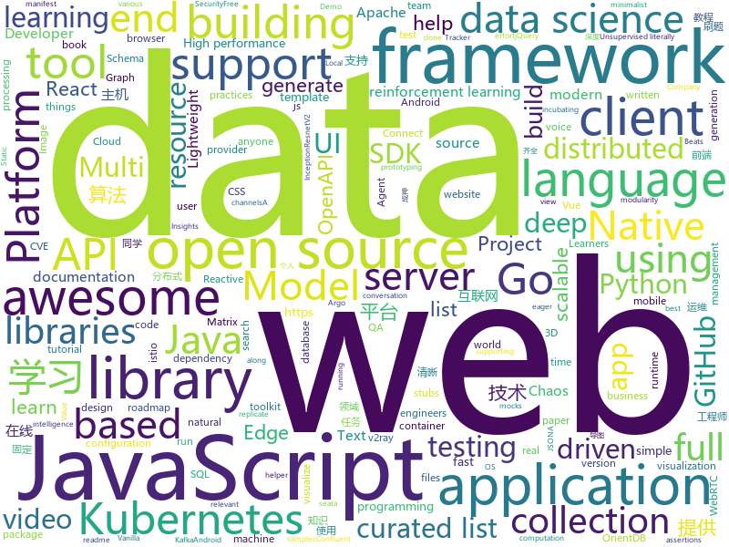

# 2020-07-18
See what the GitHub community is most excited about.

## python
+ [capa](https://github.com/fireeye/capa)(**225 stars today**): The FLARE team's open-source tool to identify capabilities in executable files.
+ [Deep-Learning-Papers-Reading-Roadmap](https://github.com/floodsung/Deep-Learning-Papers-Reading-Roadmap)(**34 stars today**): Deep Learning papers reading roadmap for anyone who are eager to learn this amazing tech!
+ [data-scientist-roadmap](https://github.com/MrMimic/data-scientist-roadmap)(**66 stars today**): Toturial coming with "data science roadmap" graphe.
+ [unfurl](https://github.com/obsidianforensics/unfurl)(**23 stars today**): Extract and Visualize Data from URLs using Unfurl
+ [ray](https://github.com/ray-project/ray)(**21 stars today**): A fast and simple framework for building and running distributed applications. Ray is packaged with RLlib, a scalable reinforcement learning library, and Tune, a scalable hyperparameter tuning library.
+ [zulip](https://github.com/zulip/zulip)(**70 stars today**): Zulip server - powerful open source team chat
+ [gpt-2](https://github.com/openai/gpt-2)(**12 stars today**): Code for the paper "Language Models are Unsupervised Multitask Learners"
+ [spack](https://github.com/spack/spack)(**2 stars today**): A flexible package manager that supports multiple versions, configurations, platforms, and compilers.
+ [pwncat](https://github.com/calebstewart/pwncat)(**50 stars today**): Fancy reverse and bind shell handler
+ [pytorch3d](https://github.com/facebookresearch/pytorch3d)(**24 stars today**): PyTorch3D is FAIR's library of reusable components for deep learning with 3D data
+ [spaCy](https://github.com/explosion/spaCy)(**9 stars today**): 💫Industrial-strength Natural Language Processing (NLP) with Python and Cython
+ [discord.py](https://github.com/Rapptz/discord.py)(**14 stars today**): An API wrapper for Discord written in Python.
+ [SAP_RECON](https://github.com/chipik/SAP_RECON)(**15 stars today**): PoC for CVE-2020-6287, CVE-2020-6286 (SAP RECON vulnerability)
+ [keras](https://github.com/keras-team/keras)(**20 stars today**): Deep Learning for humans
+ [pretrained-models.pytorch](https://github.com/Cadene/pretrained-models.pytorch)(**16 stars today**): Pretrained ConvNets for pytorch: NASNet, ResNeXt, ResNet, InceptionV4, InceptionResnetV2, Xception, DPN, etc.
+ [gradio](https://github.com/gradio-app/gradio)(**175 stars today**): Create UIs for prototyping your machine learning model in 3 minutes
+ [dbt](https://github.com/fishtown-analytics/dbt)(**2 stars today**): dbt (data build tool) enables data analysts and engineers to transform their data using the same practices that software engineers use to build applications.
+ [gym](https://github.com/openai/gym)(**20 stars today**): A toolkit for developing and comparing reinforcement learning algorithms.
+ [mmediting](https://github.com/open-mmlab/mmediting)(**50 stars today**): OpenMMLab Image and Video Editing Toolbox
+ [fast-reid](https://github.com/JDAI-CV/fast-reid)(**20 stars today**): SOTA ReID Methods and Toolbox
+ [spinningup](https://github.com/openai/spinningup)(**10 stars today**): An educational resource to help anyone learn deep reinforcement learning.
+ [botframework-sdk](https://github.com/microsoft/botframework-sdk)(**3 stars today**): Bot Framework provides the most comprehensive experience for building conversation applications.
+ [incubator-superset](https://github.com/apache/incubator-superset)(**12 stars today**): Apache Superset (incubating) is a modern, enterprise-ready business intelligence web application
+ [poetry](https://github.com/python-poetry/poetry)(**17 stars today**): Python dependency management and packaging made easy.
+ [django](https://github.com/django/django)(**29 stars today**): The Web framework for perfectionists with deadlines.

## java
+ [NewPipe](https://github.com/TeamNewPipe/NewPipe)(**175 stars today**): A libre lightweight streaming front-end for Android.
+ [PowerJob](https://github.com/KFCFans/PowerJob)(**40 stars today**): 新一代分布式任务调度与计算框架，支持CRON、API、固定频率、固定延迟等调度策略，提供工作流来编排任务解决依赖关系，使用简单，功能强大，文档齐全，欢迎各位接入使用！
+ [openapi-generator](https://github.com/OpenAPITools/openapi-generator)(**11 stars today**): OpenAPI Generator allows generation of API client libraries (SDK generation), server stubs, documentation and configuration automatically given an OpenAPI Spec (v2, v3)
+ [elasticsearch](https://github.com/elastic/elasticsearch)(**19 stars today**): Open Source, Distributed, RESTful Search Engine
+ [lucene-solr](https://github.com/apache/lucene-solr)(**3 stars today**): Apache Lucene and Solr open-source search software
+ [java](https://github.com/kubernetes-client/java)(**9 stars today**): Official Java client library for kubernetes
+ [RIBs](https://github.com/uber/RIBs)(**7 stars today**): Uber's cross-platform mobile architecture framework.
+ [toBeTopJavaer](https://github.com/hollischuang/toBeTopJavaer)(**115 stars today**): To Be Top Javaer - Java工程师成神之路
+ [istio-tutorial](https://github.com/redhat-developer-demos/istio-tutorial)(**4 stars today**): Istio Tutorial for https://dn.dev/master
+ [ExoPlayer](https://github.com/google/ExoPlayer)(**14 stars today**): An extensible media player for Android
+ [react-native-push-notification](https://github.com/zo0r/react-native-push-notification)(**4 stars today**): React Native Local and Remote Notifications
+ [kafka](https://github.com/apache/kafka)(**19 stars today**): Mirror of Apache Kafka
+ [AppAuth-Android](https://github.com/openid/AppAuth-Android)(**36 stars today**): Android client SDK for communicating with OAuth 2.0 and OpenID Connect providers.
+ [aws-lambda-developer-guide](https://github.com/awsdocs/aws-lambda-developer-guide)(**3 stars today**): The AWS Lambda Developer Guide
+ [orientdb](https://github.com/orientechnologies/orientdb)(**4 stars today**): OrientDB is the most versatile DBMS supporting Graph, Document, Reactive, Full-Text, Geospatial and Key-Value models in one Multi-Model product. OrientDB can run distributed (Multi-Master), supports SQL, ACID Transactions, Full-Text indexing and Reactive Queries. OrientDB Community Edition is Open Source using a liberal Apache 2 license.
+ [advanced-java](https://github.com/doocs/advanced-java)(**38 stars today**): 😮互联网 Java 工程师进阶知识完全扫盲：涵盖高并发、分布式、高可用、微服务、海量数据处理等领域知识，后端同学必看，前端同学也可学习
+ [seata-samples](https://github.com/seata/seata-samples)(**4 stars today**): seata-samples
+ [schema-registry](https://github.com/confluentinc/schema-registry)(**1 stars today**): Confluent Schema Registry for Kafka
+ [spring-microservices](https://github.com/in28minutes/spring-microservices)(**2 stars today**): Spring Microservices using Spring Cloud
+ [spring-security](https://github.com/spring-projects/spring-security)(**8 stars today**): Spring Security
+ [dbeaver](https://github.com/dbeaver/dbeaver)(**28 stars today**): Free universal database tool and SQL client
+ [druid](https://github.com/apache/druid)(**6 stars today**): Apache Druid: a high performance real-time analytics database.
+ [uCrop](https://github.com/Yalantis/uCrop)(**6 stars today**): Image Cropping Library for Android
+ [thingsboard](https://github.com/thingsboard/thingsboard)(**14 stars today**): Open-source IoT Platform - Device management, data collection, processing and visualization.
+ [micronaut-core](https://github.com/micronaut-projects/micronaut-core)(**14 stars today**): Micronaut Application Framework

## unknown
+ [gpt-3](https://github.com/openai/gpt-3)(**175 stars today**): GPT-3: Language Models are Few-Shot Learners
+ [awesome-datascience](https://github.com/academic/awesome-datascience)(**216 stars today**): 📝An awesome Data Science repository to learn and apply for real world problems.
+ [Awesome-Hacking](https://github.com/Hack-with-Github/Awesome-Hacking)(**358 stars today**): A collection of various awesome lists for hackers, pentesters and security researchers
+ [developer-roadmap](https://github.com/kamranahmedse/developer-roadmap)(**562 stars today**): Roadmap to becoming a web developer in 2020
+ [design-resources-for-developers](https://github.com/bradtraversy/design-resources-for-developers)(**182 stars today**): Curated list of design and UI resources from stock photos, web templates, CSS frameworks, UI libraries, tools and much more
+ [CTF_Hacker-Tools](https://github.com/Harveysn0w/CTF_Hacker-Tools)(**18 stars today**): CTF-渗透测试~工具合集
+ [QA_bible](https://github.com/Vladislav610/QA_bible)(**22 stars today**): Библия QA это 163 страницы смеси ответов на вопросы с реальных собеседований на manual QA, перевода интересного контента с зарубежных ресурсов и агрегации материала с отечественных.
+ [You-Dont-Know-JS](https://github.com/getify/You-Dont-Know-JS)(**59 stars today**): A book series on JavaScript. @YDKJS on twitter.
+ [ds-cheatsheets](https://github.com/FavioVazquez/ds-cheatsheets)(**38 stars today**): List of Data Science Cheatsheets to rule the world
+ [glodroid_manifest](https://github.com/GloDroid/glodroid_manifest)(**17 stars today**): Android manifest for GloDroid (AOSP for the world's most accessible development platforms)
+ [architect-awesome](https://github.com/xingshaocheng/architect-awesome)(**96 stars today**): 后端架构师技术图谱
+ [CodeGuide](https://github.com/fuzhengwei/CodeGuide)(**121 stars today**): 📚本代码库是作者小傅哥多年从事一线互联网 Java 开发的学习历程技术汇总，旨在为大家提供一个清晰详细的学习教程，侧重点更倾向编写Java核心内容。如果本仓库能为您提供帮助，请给予支持(关注、点赞、分享)！
+ [archive-program](https://github.com/github/archive-program)(**275 stars today**): The GitHub Archive Program & Arctic Code Vault
+ [WSL](https://github.com/microsoft/WSL)(**12 stars today**): Issues found on WSL
+ [awesome-php](https://github.com/ziadoz/awesome-php)(**9 stars today**): A curated list of amazingly awesome PHP libraries, resources and shiny things.
+ [1](https://github.com/6mao6/1)(**8 stars today**): 这里是直播平台永久回家页，有最新app下载地址。
+ [free-programming-books](https://github.com/EbookFoundation/free-programming-books)(**105 stars today**): 📚Freely available programming books
+ [Python](https://github.com/TwoWater/Python)(**20 stars today**): 最良心的 Python 教程：
+ [sindresorhus](https://github.com/sindresorhus/sindresorhus)(**24 stars today**): 🦄
+ [ps4-payload-repo](https://github.com/Scene-Collective/ps4-payload-repo)(**8 stars today**): Auto generates payloads and packages when they're updated
+ [NewGrad-2021](https://github.com/Pitt-CSC/NewGrad-2021)(**6 stars today**): A collection of New Grad full time roles in SWE, Quant, and PM.
+ [EconomicTracker](https://github.com/Opportunitylab/EconomicTracker)(**2 stars today**): Download data from the Opportunity Insights Economic Tracker — https://tracktherecovery.org/
+ [awesome-production-machine-learning](https://github.com/EthicalML/awesome-production-machine-learning)(**14 stars today**): A curated list of awesome open source libraries to deploy, monitor, version and scale your machine learning
+ [laravel-best-practices](https://github.com/alexeymezenin/laravel-best-practices)(**9 stars today**): Laravel best practices
+ [awesome-vue](https://github.com/vuejs/awesome-vue)(**38 stars today**): 🎉A curated list of awesome things related to Vue.js

## javascript
+ [x-spreadsheet](https://github.com/myliang/x-spreadsheet)(**587 stars today**): A web-based JavaScript（canvas） spreadsheet
+ [super-expressive](https://github.com/francisrstokes/super-expressive)(**579 stars today**): 🦜Super Expressive is a zero-dependency JavaScript library for building regular expressions in (almost) natural language
+ [ps4jb](https://github.com/sleirsgoevy/ps4jb)(**49 stars today**): PS4 6.72 jailbreak
+ [hedgehog-lab](https://github.com/lidangzzz/hedgehog-lab)(**63 stars today**): An open source scientific computing environment for JavaScript TOTALLY in your browser, matrix operations with GPU acceleration, TeX support, data visualization and symbolic computation.
+ [bumblebee](https://github.com/jaxcore/bumblebee)(**48 stars today**): Jaxcore Bumblebee - a JavaScript voice application framework
+ [RecordRTC](https://github.com/muaz-khan/RecordRTC)(**157 stars today**): RecordRTC is WebRTC JavaScript library for audio/video as well as screen activity recording. It supports Chrome, Firefox, Opera, Android, and Microsoft Edge. Platforms: Linux, Mac and Windows.
+ [Awesome-Profile-README-templates](https://github.com/kautukkundan/Awesome-Profile-README-templates)(**707 stars today**): A collection of awesome readme templates to display on your profile
+ [github-readme-stats](https://github.com/anuraghazra/github-readme-stats)(**276 stars today**): Dynamically generated stats for your github readmes
+ [lodash](https://github.com/lodash/lodash)(**20 stars today**): A modern JavaScript utility library delivering modularity, performance, & extras.
+ [react-native-testing-library](https://github.com/callstack/react-native-testing-library)(**8 stars today**): Lightweight React Native testing utilities helping you write better tests with less effort
+ [jquery](https://github.com/jquery/jquery)(**48 stars today**): jQuery JavaScript Library
+ [simple-peer](https://github.com/feross/simple-peer)(**14 stars today**): 📡Simple WebRTC video, voice, and data channels
+ [jsoneditor](https://github.com/josdejong/jsoneditor)(**10 stars today**): A web-based tool to view, edit, format, and validate JSON
+ [awesome-github-profile-readme](https://github.com/abhisheknaiidu/awesome-github-profile-readme)(**326 stars today**): A curated list of awesome Github Profile READMEs
+ [gatsby](https://github.com/gatsbyjs/gatsby)(**30 stars today**): Build blazing fast, modern apps and websites with React
+ [spug](https://github.com/openspug/spug)(**14 stars today**): 开源运维平台：面向中小型企业设计的轻量级无Agent的自动化运维平台，整合了主机管理、主机批量执行、主机在线终端、文件在线上传下载、应用发布部署、在线任务计划、配置中心、监控、报警等一系列功能。
+ [CodeceptJS](https://github.com/codeceptjs/CodeceptJS)(**8 stars today**): Supercharged End 2 End Testing Framework for NodeJS
+ [react-native](https://github.com/facebook/react-native)(**32 stars today**): A framework for building native apps with React.
+ [odoo](https://github.com/odoo/odoo)(**13 stars today**): Odoo. Open Source Apps To Grow Your Business.
+ [hello-algorithm](https://github.com/geekxh/hello-algorithm)(**149 stars today**): 本项目包括：1、我写的 30w 字图解算法题典 2、100 张各领域超清晰思维导图 3、小浩算法网站源代码
+ [gridstudio](https://github.com/ricklamers/gridstudio)(**28 stars today**): Grid studio is a web-based application for data science with full integration of open source data science frameworks and languages.
+ [redash](https://github.com/getredash/redash)(**26 stars today**): Make Your Company Data Driven. Connect to any data source, easily visualize, dashboard and share your data.
+ [vue](https://github.com/vuejs/vue)(**106 stars today**): 🖖Vue.js is a progressive, incrementally-adoptable JavaScript framework for building UI on the web.
+ [docker-handbook-projects](https://github.com/fhsinchy/docker-handbook-projects)(**47 stars today**): Project codes used in "The Docker Handbook"📓
+ [Detox](https://github.com/wix/Detox)(**9 stars today**): Gray box end-to-end testing and automation framework for mobile apps

## html
+ [2020-S2](https://github.com/adnandeakin/2020-S2)(**2 stars today**): 
+ [ephtracy.github.io](https://github.com/ephtracy/ephtracy.github.io)(**3 stars today**): 
+ [open_robot_actuator_hardware](https://github.com/open-dynamic-robot-initiative/open_robot_actuator_hardware)(**21 stars today**): 
+ [html](https://github.com/whatwg/html)(**5 stars today**): HTML Standard
+ [fastText](https://github.com/facebookresearch/fastText)(**8 stars today**): Library for fast text representation and classification.
+ [github-markdown-css](https://github.com/sindresorhus/github-markdown-css)(**3 stars today**): The minimal amount of CSS to replicate the GitHub Markdown style
+ [devdocs](https://github.com/magento/devdocs)(**1 stars today**): Magento Developer Documentation
+ [beautiful-jekyll](https://github.com/daattali/beautiful-jekyll)(**7 stars today**): ✨Build a beautiful and simple website in literally minutes. Demo at https://beautifuljekyll.com
+ [Coursera-ML-AndrewNg-Notes](https://github.com/fengdu78/Coursera-ML-AndrewNg-Notes)(**28 stars today**): 吴恩达老师的机器学习课程个人笔记
+ [tiny-slider](https://github.com/ganlanyuan/tiny-slider)(**8 stars today**): Vanilla javascript slider for all purposes.
+ [umi-top.github.io](https://github.com/umi-top/umi-top.github.io)(**10 stars today**): 
+ [pybluez](https://github.com/pybluez/pybluez)(**4 stars today**): Bluetooth Python extension module
+ [WebGazer](https://github.com/brownhci/WebGazer)(**71 stars today**): WebGazer.js: Scalable Webcam EyeTracking Using User Interactions
+ [v2-ui](https://github.com/sprov065/v2-ui)(**6 stars today**): 支持多协议多用户的 v2ray 面板，Support multi-protocol multi-user v2ray panel
+ [glTF](https://github.com/KhronosGroup/glTF)(**9 stars today**): glTF – Runtime 3D Asset Delivery
+ [mxgraph](https://github.com/jgraph/mxgraph)(**6 stars today**): mxGraph is a fully client side JavaScript diagramming library
+ [swagger-codegen](https://github.com/swagger-api/swagger-codegen)(**7 stars today**): swagger-codegen contains a template-driven engine to generate documentation, API clients and server stubs in different languages by parsing your OpenAPI / Swagger definition.
+ [istio.io](https://github.com/istio/istio.io)(**2 stars today**): Source for the istio.io site
+ [the-rosa](https://github.com/jlop007/the-rosa)(**1 stars today**): Starter files for The Rosa video tutorial to help you get set up to follow along.
+ [riot-web](https://github.com/vector-im/riot-web)(**8 stars today**): A glossy Matrix collaboration client for the web.
+ [blog_os](https://github.com/phil-opp/blog_os)(**9 stars today**): Writing an OS in Rust
+ [ai-edu](https://github.com/microsoft/ai-edu)(**8 stars today**): AI education materials for Chinese students, teachers and IT professionals.
+ [kubernetes-goat](https://github.com/madhuakula/kubernetes-goat)(**4 stars today**): Kubernetes Goat is "Vulnerable by Design" Kubernetes Cluster.
+ [technical-books](https://github.com/doocs/technical-books)(**6 stars today**): 😆国内外互联网技术大牛们都写了哪些书籍：计算机基础、网络、前端、后端、数据库、架构、大数据、深度学习...
+ [fastclick](https://github.com/ftlabs/fastclick)(**5 stars today**): Polyfill to remove click delays on browsers with touch UIs

## go
+ [telegraf](https://github.com/influxdata/telegraf)(**7 stars today**): The plugin-driven server agent for collecting & reporting metrics.
+ [MailHog](https://github.com/mailhog/MailHog)(**10 stars today**): Web and API based SMTP testing
+ [algorithm-pattern](https://github.com/greyireland/algorithm-pattern)(**110 stars today**): 算法模板，最科学的刷题方式，最快速的刷题路径，你值得拥有~
+ [minio](https://github.com/minio/minio)(**27 stars today**): High Performance, Kubernetes Native Object Storage
+ [chaos-mesh](https://github.com/chaos-mesh/chaos-mesh)(**10 stars today**): A Chaos Engineering Platform for Kubernetes.
+ [chaosmonkey](https://github.com/Netflix/chaosmonkey)(**33 stars today**): Chaos Monkey is a resiliency tool that helps applications tolerate random instance failures.
+ [beats](https://github.com/elastic/beats)(**9 stars today**): 🐠Beats - Lightweight shippers for Elasticsearch & Logstash
+ [clair](https://github.com/quay/clair)(**7 stars today**): Vulnerability Static Analysis for Containers
+ [gorush](https://github.com/appleboy/gorush)(**19 stars today**): A push notification server written in Go (Golang).
+ [go](https://github.com/golang/go)(**43 stars today**): The Go programming language
+ [traefik](https://github.com/containous/traefik)(**25 stars today**): The Cloud Native Edge Router
+ [gaos](https://github.com/Trendyol/gaos)(**13 stars today**): HTTP mocking to test API services for chaos scenarios
+ [azure-sdk-for-go](https://github.com/Azure/azure-sdk-for-go)(**1 stars today**): Microsoft Azure SDK for Go
+ [gh-ost](https://github.com/github/gh-ost)(**15 stars today**): GitHub's Online Schema Migrations for MySQL
+ [aws-sdk-go](https://github.com/aws/aws-sdk-go)(**2 stars today**): AWS SDK for the Go programming language.
+ [testify](https://github.com/stretchr/testify)(**11 stars today**): A toolkit with common assertions and mocks that plays nicely with the standard library
+ [dapr](https://github.com/dapr/dapr)(**13 stars today**): Dapr is a portable, event-driven, runtime for building distributed applications across cloud and edge.
+ [go-ethereum](https://github.com/ethereum/go-ethereum)(**10 stars today**): Official Go implementation of the Ethereum protocol
+ [client-go](https://github.com/kubernetes/client-go)(**8 stars today**): Go client for Kubernetes.
+ [echo](https://github.com/labstack/echo)(**17 stars today**): High performance, minimalist Go web framework
+ [moby](https://github.com/moby/moby)(**12 stars today**): Moby Project - a collaborative project for the container ecosystem to assemble container-based systems
+ [inframap](https://github.com/cycloidio/inframap)(**69 stars today**): Read your tfstate or HCL to generate a graph specific for each provider, showing only the resources that are most important/relevant.
+ [k3d](https://github.com/rancher/k3d)(**48 stars today**): Little helper to run Rancher Lab's k3s in Docker
+ [yaml](https://github.com/go-yaml/yaml)(**8 stars today**): YAML support for the Go language.
+ [argo](https://github.com/argoproj/argo)(**13 stars today**): Argo Workflows: Get stuff done with Kubernetes.

## WordCloud

