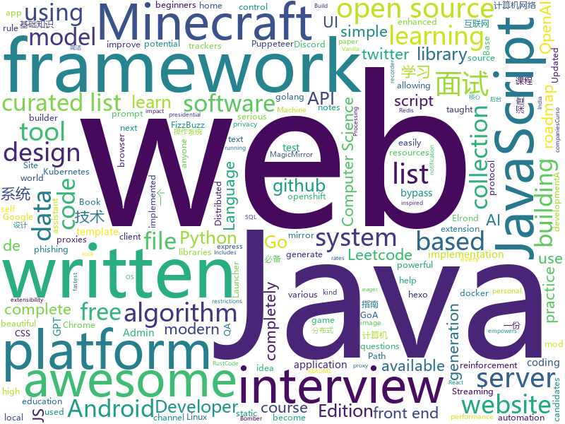

# 2020-07-20
See what the GitHub community is most excited about.

## python
+ [core](https://github.com/home-assistant/core)(**26 stars today**): 🏡Open source home automation that puts local control and privacy first
+ [zulip](https://github.com/zulip/zulip)(**73 stars today**): Zulip server - powerful open source team chat
+ [Deep-Learning-Papers-Reading-Roadmap](https://github.com/floodsung/Deep-Learning-Papers-Reading-Roadmap)(**182 stars today**): Deep Learning papers reading roadmap for anyone who are eager to learn this amazing tech!
+ [elyra](https://github.com/elyra-ai/elyra)(**39 stars today**): Elyra extends JupyterLab Notebooks with an AI centric approach.
+ [gpt-3-experiments](https://github.com/minimaxir/gpt-3-experiments)(**67 stars today**): Test prompts for OpenAI's GPT-3 API and the resulting AI-generated texts.
+ [reddit_automations](https://github.com/KalleHallden/reddit_automations)(**42 stars today**): 
+ [docker-pi-hole](https://github.com/pi-hole/docker-pi-hole)(**8 stars today**): Pi-hole in a docker container
+ [gpt-2](https://github.com/openai/gpt-2)(**42 stars today**): Code for the paper "Language Models are Unsupervised Multitask Learners"
+ [detectron2](https://github.com/facebookresearch/detectron2)(**24 stars today**): Detectron2 is FAIR's next-generation platform for object detection and segmentation.
+ [system-design-primer](https://github.com/donnemartin/system-design-primer)(**94 stars today**): Learn how to design large-scale systems. Prep for the system design interview. Includes Anki flashcards.
+ [baselines](https://github.com/openai/baselines)(**19 stars today**): OpenAI Baselines: high-quality implementations of reinforcement learning algorithms
+ [image-gpt](https://github.com/openai/image-gpt)(**23 stars today**): 
+ [DeepLearning.ai-Summary](https://github.com/mbadry1/DeepLearning.ai-Summary)(**31 stars today**): This repository contains my personal notes and summaries on DeepLearning.ai specialization courses. I've enjoyed every little bit of the course hope you enjoy my notes too.
+ [Python](https://github.com/TheAlgorithms/Python)(**111 stars today**): All Algorithms implemented in Python
+ [TBomb](https://github.com/TheSpeedX/TBomb)(**3 stars today**): This is a SMS And Call Bomber For Linux And Termux
+ [awesome-machine-learning](https://github.com/josephmisiti/awesome-machine-learning)(**38 stars today**): A curated list of awesome Machine Learning frameworks, libraries and software.
+ [d2l-zh](https://github.com/d2l-ai/d2l-zh)(**43 stars today**): 《动手学深度学习》：面向中文读者、能运行、可讨论。英文版即伯克利“深度学习导论”教材。
+ [pifuhd](https://github.com/facebookresearch/pifuhd)(**82 stars today**): High-Resolution 3D Human Digitization from A Single Image.
+ [discord.py](https://github.com/Rapptz/discord.py)(**11 stars today**): An API wrapper for Discord written in Python.
+ [gym](https://github.com/openai/gym)(**27 stars today**): A toolkit for developing and comparing reinforcement learning algorithms.
+ [twitter-saucenao](https://github.com/FujiMakoto/twitter-saucenao)(**13 stars today**): A Twitter bot that utilizes the SauceNao API to find the source of images or anime screencaps
+ [fbi](https://github.com/xHak9x/fbi)(**6 stars today**): Facebook Information
+ [gpt-2-simple](https://github.com/minimaxir/gpt-2-simple)(**28 stars today**): Python package to easily retrain OpenAI's GPT-2 text-generating model on new texts
+ [stock](https://github.com/pythonstock/stock)(**48 stars today**): stock，股票系统。使用python进行开发。
+ [game_control](https://github.com/ChoudharyChanchal/game_control)(**71 stars today**): 

## java
+ [NativeAlphaForAndroid](https://github.com/cylonid/NativeAlphaForAndroid)(**60 stars today**): 
+ [NewPipe](https://github.com/TeamNewPipe/NewPipe)(**133 stars today**): A libre lightweight streaming front-end for Android.
+ [HMCL](https://github.com/huanghongxun/HMCL)(**6 stars today**): A Minecraft Launcher which is multi-functional, cross-platform and popular
+ [InternetArchitect](https://github.com/bjmashibing/InternetArchitect)(**6 stars today**): 年薪百万互联网架构师课程文档及源码(公开部分)
+ [FizzBuzzEnterpriseEdition](https://github.com/EnterpriseQualityCoding/FizzBuzzEnterpriseEdition)(**42 stars today**): FizzBuzz Enterprise Edition is a no-nonsense implementation of FizzBuzz made by serious businessmen for serious business purposes.
+ [AarogyaSetu_Android](https://github.com/nic-delhi/AarogyaSetu_Android)(**4 stars today**): Aarogya Setu Android app native code
+ [Mindustry](https://github.com/Anuken/Mindustry)(**6 stars today**): A sandbox tower defense game
+ [JavaGuide](https://github.com/Snailclimb/JavaGuide)(**58 stars today**): 「Java学习+面试指南」一份涵盖大部分Java程序员所需要掌握的核心知识。
+ [android-developer-roadmap](https://github.com/MindorksOpenSource/android-developer-roadmap)(**2 stars today**): Android Developer Roadmap - A complete roadmap to learn Android App Development
+ [sodium-fabric](https://github.com/jellysquid3/sodium-fabric)(**38 stars today**): A Fabric mod designed to improve frame rates and reduce micro-stutter
+ [CS-Notes](https://github.com/CyC2018/CS-Notes)(**100 stars today**): 📚技术面试必备基础知识、Leetcode、计算机操作系统、计算机网络、系统设计、Java、Python、C++
+ [runelite](https://github.com/runelite/runelite)(**3 stars today**): Open source Old School RuneScape client
+ [MinecraftForge](https://github.com/MinecraftForge/MinecraftForge)(**1 stars today**): Modifications to the Minecraft base files to assist in compatibility between mods.
+ [ripme](https://github.com/RipMeApp/ripme)(**6 stars today**): Downloads albums in bulk
+ [Java](https://github.com/TheAlgorithms/Java)(**30 stars today**): All Algorithms implemented in Java
+ [Algorithms](https://github.com/williamfiset/Algorithms)(**20 stars today**): A collection of algorithms and data structures
+ [tomcat](https://github.com/apache/tomcat)(**8 stars today**): Apache Tomcat
+ [Leetcode](https://github.com/fishercoder1534/Leetcode)(**7 stars today**): Solutions to LeetCode problems; updated daily. Subscribe to my YouTube channel for more.
+ [base-admin](https://github.com/huanzi-qch/base-admin)(**23 stars today**): Base Admin一套简单通用的后台管理系统
+ [TagMo](https://github.com/HiddenRamblings/TagMo)(**4 stars today**): 
+ [MCinaBox](https://github.com/longjunyu2/MCinaBox)(**6 stars today**): MCinaBox - A Minecraft Java Edition Launcher on Android
+ [dropwizard](https://github.com/dropwizard/dropwizard)(**1 stars today**): A damn simple library for building production-ready RESTful web services.
+ [Geyser](https://github.com/GeyserMC/Geyser)(**7 stars today**): A bridge/proxy allowing you to connect to Minecraft: Java Edition servers with Minecraft: Bedrock edition.
+ [interview](https://github.com/mission-peace/interview)(**8 stars today**): Interview questions
+ [BungeeCord](https://github.com/SpigotMC/BungeeCord)(**0 stars today**): BungeeCord, the 6th in a generation of server portal suites. Efficiently proxies and maintains connections and transport between multiple Minecraft servers.

## unknown
+ [gpt-3](https://github.com/openai/gpt-3)(**601 stars today**): GPT-3: Language Models are Few-Shot Learners
+ [coding-interview-university](https://github.com/jwasham/coding-interview-university)(**177 stars today**): A complete computer science study plan to become a software engineer.
+ [computer-science](https://github.com/ossu/computer-science)(**269 stars today**): 🎓Path to a free self-taught education in Computer Science!
+ [design-resources-for-developers](https://github.com/bradtraversy/design-resources-for-developers)(**207 stars today**): Curated list of design and UI resources from stock photos, web templates, CSS frameworks, UI libraries, tools and much more
+ [airlines-to-china-covid-19](https://github.com/USCreditCardGuide/airlines-to-china-covid-19)(**28 stars today**): 疫情期间的回国航班汇总
+ [awesome-mlops](https://github.com/visenger/awesome-mlops)(**96 stars today**): A curated list of references for MLOps
+ [awesome-for-beginners](https://github.com/MunGell/awesome-for-beginners)(**62 stars today**): A list of awesome beginners-friendly projects.
+ [QA_bible](https://github.com/Vladislav610/QA_bible)(**13 stars today**): Библия QA это 163 страницы смеси ответов на вопросы с реальных собеседований на manual QA, перевода интересного контента с зарубежных ресурсов и агрегации материала с отечественных.
+ [archive-program](https://github.com/github/archive-program)(**65 stars today**): The GitHub Archive Program & Arctic Code Vault
+ [developer-roadmap](https://github.com/kamranahmedse/developer-roadmap)(**586 stars today**): Roadmap to becoming a web developer in 2020
+ [kubernetes-the-hard-way](https://github.com/kelseyhightower/kubernetes-the-hard-way)(**31 stars today**): Bootstrap Kubernetes the hard way on Google Cloud Platform. No scripts.
+ [You-Dont-Know-JS](https://github.com/getify/You-Dont-Know-JS)(**48 stars today**): A book series on JavaScript. @YDKJS on twitter.
+ [eng-practices](https://github.com/google/eng-practices)(**13 stars today**): Google's Engineering Practices documentation
+ [Awesome-Hacking](https://github.com/Hack-with-Github/Awesome-Hacking)(**328 stars today**): A collection of various awesome lists for hackers, pentesters and security researchers
+ [data-science](https://github.com/ossu/data-science)(**7 stars today**): 📊Path to a free self-taught education in Data Science!
+ [LeetcodeTop](https://github.com/afatcoder/LeetcodeTop)(**57 stars today**): 
+ [app-ideas](https://github.com/florinpop17/app-ideas)(**46 stars today**): A Collection of application ideas which can be used to improve your coding skills.
+ [JavaInterview](https://github.com/OUYANGSIHAI/JavaInterview)(**14 stars today**): 【Java面试+Java后端技术学习指南】：一份通向理想互联网公司的面试指南，包括 Java，技术面试必备基础知识、Leetcode、计算机操作系统、计算机网络、系统设计、分布式、数据库（MySQL、Redis）、Java 项目实战等
+ [system-design-interview](https://github.com/checkcheckzz/system-design-interview)(**21 stars today**): System design interview for IT companies
+ [UNSAM_2020c2_Python](https://github.com/python-unsam/UNSAM_2020c2_Python)(**5 stars today**): Curso de programación en Python - 2do cuatrimestre 2020 - UNSAM
+ [free-programming-books](https://github.com/EbookFoundation/free-programming-books)(**69 stars today**): 📚Freely available programming books
+ [cs-video-courses](https://github.com/Developer-Y/cs-video-courses)(**13 stars today**): List of Computer Science courses with video lectures.
+ [trackerslist](https://github.com/ngosang/trackerslist)(**19 stars today**): Updated list of public BitTorrent trackers
+ [awesome](https://github.com/sindresorhus/awesome)(**67 stars today**): 😎Awesome lists about all kinds of interesting topics
+ [first-contributions](https://github.com/firstcontributions/first-contributions)(**13 stars today**): 🚀✨Help beginners to contribute to open source projects

## javascript
+ [myvision](https://github.com/OvidijusParsiunas/myvision)(**90 stars today**): Computer vision based ML training data generation tool.🚀
+ [bypass-paywalls-chrome](https://github.com/iamadamdev/bypass-paywalls-chrome)(**41 stars today**): Bypass Paywalls web browser extension for Chrome and Firefox.
+ [puppeteer-recorder](https://github.com/checkly/puppeteer-recorder)(**391 stars today**): Puppeteer recorder is a Chrome extension that records your browser interactions and generates a Puppeteer script.
+ [33-js-concepts](https://github.com/leonardomso/33-js-concepts)(**17 stars today**): 📜33 concepts every JavaScript developer should know.
+ [lodash](https://github.com/lodash/lodash)(**41 stars today**): A modern JavaScript utility library delivering modularity, performance, & extras.
+ [MagicMirror](https://github.com/MichMich/MagicMirror)(**9 stars today**): MagicMirror² is an open source modular smart mirror platform. With a growing list of installable modules, the MagicMirror² allows you to convert your hallway or bathroom mirror into your personal assistant.
+ [p5.js](https://github.com/processing/p5.js)(**10 stars today**): p5.js is a client-side JS platform that empowers artists, designers, students, and anyone to learn to code and express themselves creatively on the web. It is based on the core principles of Processing. http://twitter.com/p5xjs —
+ [hexo-theme-yilia](https://github.com/litten/hexo-theme-yilia)(**6 stars today**): 一个简洁优雅的hexo主题 A simple and elegant theme for hexo.
+ [vuepress](https://github.com/vuejs/vuepress)(**21 stars today**): 📝Minimalistic Vue-powered static site generator
+ [iptv](https://github.com/iptv-org/iptv)(**39 stars today**): Collection of 8000+ publicly available IPTV channels from all over the world
+ [front-end-interview-handbook](https://github.com/yangshun/front-end-interview-handbook)(**134 stars today**): 🕸Almost complete answers to "Front-end Job Interview Questions" which you can use to interview potential candidates, test yourself or completely ignore
+ [Reactive-Resume](https://github.com/AmruthPillai/Reactive-Resume)(**55 stars today**): A one-of-a-kind resume builder that keeps your privacy in mind. Completely secure, customizable, portable, open-source and free forever. Try it out today!
+ [github-profile-readme-generator](https://github.com/rahuldkjain/github-profile-readme-generator)(**58 stars today**): 🚀Generate github profile README easily with latest add-ons like visitors count, github stats, etc using minimal UI.
+ [svelte](https://github.com/sveltejs/svelte)(**34 stars today**): Cybernetically enhanced web apps
+ [discord.js](https://github.com/discordjs/discord.js)(**9 stars today**): A powerful JavaScript library for interacting with the Discord API
+ [next.js](https://github.com/vercel/next.js)(**75 stars today**): The React Framework
+ [anime](https://github.com/juliangarnier/anime)(**28 stars today**): JavaScript animation engine
+ [fullstack-course4](https://github.com/jhu-ep-coursera/fullstack-course4)(**15 stars today**): Example code for HTML, CSS, and Javascript for Web Developers Coursera Course
+ [hyperapp](https://github.com/jorgebucaran/hyperapp)(**16 stars today**): The tiny framework for building hypertext applications.
+ [lx-music-desktop](https://github.com/lyswhut/lx-music-desktop)(**73 stars today**): 一个基于 electron 的音乐软件
+ [covid19india-react](https://github.com/covid19india/covid19india-react)(**15 stars today**): Tracking the impact of COVID-19 in India
+ [tech-interview-handbook](https://github.com/yangshun/tech-interview-handbook)(**45 stars today**): 💯Materials to help you rock your next coding interview
+ [perspective](https://github.com/finos/perspective)(**11 stars today**): Streaming pivot visualization via WebAssembly
+ [webtorrent](https://github.com/webtorrent/webtorrent)(**20 stars today**): ⚡️Streaming torrent client for the web
+ [awesome-mac](https://github.com/jaywcjlove/awesome-mac)(**18 stars today**):  Now we have become very big, Different from the original idea. Collect premium software in various categories.

## html
+ [Front-end-Developer-Interview-Questions](https://github.com/h5bp/Front-end-Developer-Interview-Questions)(**24 stars today**): A list of helpful front-end related questions you can use to interview potential candidates, test yourself or completely ignore.
+ [awesome-compose](https://github.com/docker/awesome-compose)(**118 stars today**): Awesome Docker Compose samples
+ [home-assistant.io](https://github.com/home-assistant/home-assistant.io)(**5 stars today**): 📘Home Assistant User documentation
+ [blackeye](https://github.com/An0nUD4Y/blackeye)(**1 stars today**): The ultimate phishing tool with 38 websites available!
+ [openwrt-packages](https://github.com/kenzok8/openwrt-packages)(**6 stars today**): openwet常用软件包
+ [Tasmota](https://github.com/arendst/Tasmota)(**14 stars today**): Alternative firmware for ESP8266 with easy configuration using webUI, OTA updates, automation using timers or rules, expandability and entirely local control over MQTT, HTTP, Serial or KNX. Full documentation at
+ [machine-learning-systems-design](https://github.com/chiphuyen/machine-learning-systems-design)(**13 stars today**): A booklet on machine learning systems design with exercises
+ [en.javascript.info](https://github.com/javascript-tutorial/en.javascript.info)(**23 stars today**): Modern JavaScript Tutorial
+ [fluxion](https://github.com/FluxionNetwork/fluxion)(**6 stars today**): Fluxion is a remake of linset by vk496 with enhanced functionality.
+ [raytracing.github.io](https://github.com/RayTracing/raytracing.github.io)(**28 stars today**): Main Web Site (Online Books)
+ [hyperblog](https://github.com/freddier/hyperblog)(**19 stars today**): Un blog increíble para el curso de Git y Github de Platzi
+ [WebFundamentals](https://github.com/google/WebFundamentals)(**11 stars today**): Best practices for modern web development
+ [awesome-piracy](https://github.com/Igglybuff/awesome-piracy)(**12 stars today**): A curated list of awesome warez and piracy links
+ [blog_os](https://github.com/phil-opp/blog_os)(**23 stars today**): Writing an OS in Rust
+ [us-potus-model](https://github.com/TheEconomist/us-potus-model)(**6 stars today**): Code for a dynamic multilevel Bayesian model to predict US presidential elections. Written in R and Stan.
+ [JavaScript30](https://github.com/wesbos/JavaScript30)(**10 stars today**): 30 Day Vanilla JS Challenge
+ [computer-science-flash-cards](https://github.com/jwasham/computer-science-flash-cards)(**7 stars today**): Mini website for testing both general CS knowledge and enforce coding practice and common algorithm/data structure memorization.
+ [aave-protocol](https://github.com/aave/aave-protocol)(**4 stars today**): Aave Protocol Version 1.0 - Decentralized Lending Pools
+ [hugo-academic](https://github.com/gcushen/hugo-academic)(**7 stars today**): 📝The website builder for Hugo. Build and deploy a beautiful website in minutes!
+ [ru.javascript.info](https://github.com/javascript-tutorial/ru.javascript.info)(**3 stars today**): Современный учебник JavaScript
+ [webKnowledge](https://github.com/huyaocode/webKnowledge)(**21 stars today**): 前端面试知识点总结
+ [awesome-modern-cpp](https://github.com/rigtorp/awesome-modern-cpp)(**2 stars today**): A collection of resources on modern C++
+ [gentelella](https://github.com/ColorlibHQ/gentelella)(**6 stars today**): Free Bootstrap 4 Admin Dashboard Template
+ [zju-icicles](https://github.com/QSCTech/zju-icicles)(**21 stars today**): 浙江大学课程攻略共享计划
+ [web-api-auth-examples](https://github.com/spotify/web-api-auth-examples)(**1 stars today**): Basic examples to authenticate and fetch data using the Spotify Web API

## go
+ [NoiseTorch](https://github.com/lawl/NoiseTorch)(**221 stars today**): Real-time microphone noise suppression on Linux.
+ [godbledger](https://github.com/darcys22/godbledger)(**50 stars today**): Accounting Software with GRPC endpoints and SQL Backends
+ [ebiten](https://github.com/hajimehoshi/ebiten)(**10 stars today**): A dead simple 2D game library for Go
+ [AdGuardHome](https://github.com/AdguardTeam/AdGuardHome)(**19 stars today**): Network-wide ads & trackers blocking DNS server
+ [syncthing](https://github.com/syncthing/syncthing)(**20 stars today**): Open Source Continuous File Synchronization
+ [f1viewer](https://github.com/SoMuchForSubtlety/f1viewer)(**6 stars today**): 🏎️TUI for F1TV
+ [roadrunner](https://github.com/spiral/roadrunner)(**13 stars today**): High-performance PHP application server, load-balancer and process manager written in Golang
+ [clash](https://github.com/Dreamacro/clash)(**41 stars today**): A rule-based tunnel in Go.
+ [crawlab](https://github.com/crawlab-team/crawlab)(**40 stars today**): Distributed web crawler admin platform for spiders management regardless of languages and frameworks. 分布式爬虫管理平台，支持任何语言和框架
+ [hugo](https://github.com/gohugoio/hugo)(**32 stars today**): The world’s fastest framework for building websites.
+ [fiber](https://github.com/gofiber/fiber)(**35 stars today**): ⚡️Fiber is an Express inspired web framework written in Go with☕️
+ [elrond-go](https://github.com/ElrondNetwork/elrond-go)(**3 stars today**): ⚡Elrond-GO: The official implementation of the Elrond protocol, written in golang.
+ [nuclei](https://github.com/projectdiscovery/nuclei)(**5 stars today**): Nuclei is a fast tool for configurable targeted scanning based on templates offering massive extensibility and ease of use.
+ [powerline-go](https://github.com/justjanne/powerline-go)(**9 stars today**): A beautiful and useful low-latency prompt for your shell, written in go
+ [todocheck](https://github.com/preslavmihaylov/todocheck)(**57 stars today**): A static code analyzer for annotated TODO comments
+ [shell-operator](https://github.com/flant/shell-operator)(**23 stars today**): Shell-operator is a tool for running event-driven scripts in a Kubernetes cluster
+ [powergate](https://github.com/textileio/powergate)(**3 stars today**): Multitiered file storage API built on Filecoin and IPFS
+ [origin](https://github.com/openshift/origin)(**4 stars today**): Images for OpenShift 3 and 4 - see openshift/okd for more
+ [evilginx2](https://github.com/kgretzky/evilginx2)(**12 stars today**): Standalone man-in-the-middle attack framework used for phishing login credentials along with session cookies, allowing for the bypass of 2-factor authentication
+ [v2ray-core](https://github.com/v2ray/v2ray-core)(**45 stars today**): A platform for building proxies to bypass network restrictions.
+ [lf](https://github.com/gokcehan/lf)(**10 stars today**): Terminal file manager
+ [afero](https://github.com/spf13/afero)(**56 stars today**): A FileSystem Abstraction System for Go
+ [gorush](https://github.com/appleboy/gorush)(**23 stars today**): A push notification server written in Go (Golang).
+ [jaeger](https://github.com/jaegertracing/jaeger)(**13 stars today**): CNCF Jaeger, a Distributed Tracing Platform
+ [gin-admin](https://github.com/LyricTian/gin-admin)(**7 stars today**): RBAC scaffolding based on Gin + Gorm/Mongo + Casbin + Wire

## WordCloud

