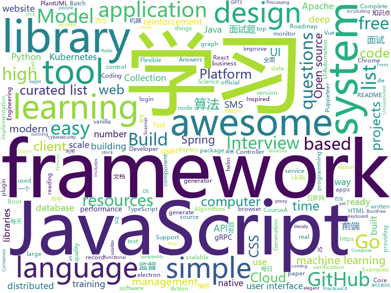

# 2020-07-21
See what the GitHub community is most excited about.

## python
+ [gpt-3-experiments](https://github.com/minimaxir/gpt-3-experiments)(**78 stars today**): Test prompts for OpenAI's GPT-3 API and the resulting AI-generated texts.
+ [Deep-Learning-Papers-Reading-Roadmap](https://github.com/floodsung/Deep-Learning-Papers-Reading-Roadmap)(**162 stars today**): Deep Learning papers reading roadmap for anyone who are eager to learn this amazing tech!
+ [transformers](https://github.com/huggingface/transformers)(**126 stars today**): 🤗Transformers: State-of-the-art Natural Language Processing for Pytorch and TensorFlow 2.0.
+ [core](https://github.com/home-assistant/core)(**65 stars today**): 🏡Open source home automation that puts local control and privacy first
+ [incubator-superset](https://github.com/apache/incubator-superset)(**26 stars today**): Apache Superset (incubating) is a modern, enterprise-ready business intelligence web application
+ [sudoku-solver](https://github.com/Adityaojas/sudoku-solver)(**40 stars today**): Solves sudoku in a real time webcam feed
+ [wttr.in](https://github.com/chubin/wttr.in)(**9 stars today**): ⛅The right way to check the weather
+ [routersploit](https://github.com/threat9/routersploit)(**5 stars today**): Exploitation Framework for Embedded Devices
+ [Statistical-Learning-Method_Code](https://github.com/Dod-o/Statistical-Learning-Method_Code)(**21 stars today**): 手写实现李航《统计学习方法》书中全部算法
+ [python-for-absolute-beginners-course](https://github.com/talkpython/python-for-absolute-beginners-course)(**35 stars today**): Code samples and other handouts for our course.
+ [gpt-2](https://github.com/openai/gpt-2)(**48 stars today**): Code for the paper "Language Models are Unsupervised Multitask Learners"
+ [gym](https://github.com/openai/gym)(**27 stars today**): A toolkit for developing and comparing reinforcement learning algorithms.
+ [mlflow](https://github.com/mlflow/mlflow)(**5 stars today**): Open source platform for the machine learning lifecycle
+ [system-design-primer](https://github.com/donnemartin/system-design-primer)(**98 stars today**): Learn how to design large-scale systems. Prep for the system design interview. Includes Anki flashcards.
+ [models](https://github.com/tensorflow/models)(**38 stars today**): Models and examples built with TensorFlow
+ [baselines](https://github.com/openai/baselines)(**15 stars today**): OpenAI Baselines: high-quality implementations of reinforcement learning algorithms
+ [black](https://github.com/psf/black)(**28 stars today**): The uncompromising Python code formatter
+ [searx](https://github.com/asciimoo/searx)(**11 stars today**): Privacy-respecting metasearch engine
+ [ray](https://github.com/ray-project/ray)(**19 stars today**): A fast and simple framework for building and running distributed applications. Ray is packaged with RLlib, a scalable reinforcement learning library, and Tune, a scalable hyperparameter tuning library.
+ [elastalert](https://github.com/Yelp/elastalert)(**3 stars today**): Easy & Flexible Alerting With ElasticSearch
+ [dgl](https://github.com/dmlc/dgl)(**13 stars today**): Python package built to ease deep learning on graph, on top of existing DL frameworks.
+ [mmaction2](https://github.com/open-mmlab/mmaction2)(**12 stars today**): OpenMMLab's Next Generation Action Understanding Toolbox and Benchmark
+ [RepPointsV2](https://github.com/Scalsol/RepPointsV2)(**18 stars today**): 
+ [poetry](https://github.com/python-poetry/poetry)(**17 stars today**): Python dependency management and packaging made easy.
+ [requests](https://github.com/psf/requests)(**18 stars today**): A simple, yet elegant HTTP library.

## java
+ [NativeAlphaForAndroid](https://github.com/cylonid/NativeAlphaForAndroid)(**48 stars today**): 
+ [Java](https://github.com/TheAlgorithms/Java)(**76 stars today**): All Algorithms implemented in Java
+ [rocketmq](https://github.com/apache/rocketmq)(**16 stars today**): Mirror of Apache RocketMQ
+ [conductor](https://github.com/Netflix/conductor)(**3 stars today**): Conductor is a microservices orchestration engine - https://netflix.github.io/conductor/
+ [tomcat](https://github.com/apache/tomcat)(**9 stars today**): Apache Tomcat
+ [ignite](https://github.com/apache/ignite)(**2 stars today**): Apache Ignite
+ [FEBS-Shiro](https://github.com/febsteam/FEBS-Shiro)(**3 stars today**): Spring Boot 2.2.5，Shiro1.4.2 & Layui 2.5.5 权限管理系统。预览地址：http://47.104.70.138:8080/login
+ [InternetArchitect](https://github.com/bjmashibing/InternetArchitect)(**12 stars today**): 年薪百万互联网架构师课程文档及源码(公开部分)
+ [Mindustry](https://github.com/Anuken/Mindustry)(**15 stars today**): A sandbox tower defense game
+ [elasticsearch](https://github.com/elastic/elasticsearch)(**27 stars today**): Open Source, Distributed, RESTful Search Engine
+ [spring-batch](https://github.com/spring-projects/spring-batch)(**3 stars today**): Spring Batch is a framework for writing offline and batch applications using Spring and Java
+ [spring-cloud-gateway](https://github.com/spring-cloud/spring-cloud-gateway)(**3 stars today**): A Gateway built on Spring Framework 5.x and Spring Boot 2.x providing routing and more.
+ [geoserver](https://github.com/geoserver/geoserver)(**2 stars today**): Official GeoServer repository
+ [zaproxy](https://github.com/zaproxy/zaproxy)(**7 stars today**): The OWASP ZAP core project
+ [pinpoint](https://github.com/naver/pinpoint)(**8 stars today**): APM, (Application Performance Management) tool for large-scale distributed systems.
+ [spring-boot](https://github.com/spring-projects/spring-boot)(**34 stars today**): Spring Boot
+ [dbeaver](https://github.com/dbeaver/dbeaver)(**23 stars today**): Free universal database tool and SQL client
+ [interview](https://github.com/mission-peace/interview)(**10 stars today**): Interview questions
+ [JUC](https://github.com/bjmashibing/JUC)(**4 stars today**): 多线程与高并发
+ [quarkus](https://github.com/quarkusio/quarkus)(**17 stars today**): Quarkus: Supersonic Subatomic Java.
+ [resilience4j](https://github.com/resilience4j/resilience4j)(**8 stars today**): Resilience4j is a fault tolerance library designed for Java8 and functional programming
+ [nacos](https://github.com/alibaba/nacos)(**29 stars today**): an easy-to-use dynamic service discovery, configuration and service management platform for building cloud native applications.
+ [druid](https://github.com/apache/druid)(**3 stars today**): Apache Druid: a high performance real-time analytics database.
+ [easyexcel](https://github.com/alibaba/easyexcel)(**28 stars today**): 快速、简单避免OOM的java处理Excel工具
+ [swagger-core](https://github.com/swagger-api/swagger-core)(**5 stars today**): Examples and server integrations for generating the Swagger API Specification, which enables easy access to your REST API

## unknown
+ [gpt-3](https://github.com/openai/gpt-3)(**550 stars today**): GPT-3: Language Models are Few-Shot Learners
+ [awesome-production-machine-learning](https://github.com/EthicalML/awesome-production-machine-learning)(**267 stars today**): A curated list of awesome open source libraries to deploy, monitor, version and scale your machine learning
+ [coding-interview-university](https://github.com/jwasham/coding-interview-university)(**420 stars today**): A complete computer science study plan to become a software engineer.
+ [CyberProfDevelopmentCovidResources](https://github.com/gerryguy311/CyberProfDevelopmentCovidResources)(**5 stars today**): An awesome list of FREE resources for training, conferences, speaking, labs, reading, etc that are free all the time or during COVID-19 that cybersecurity professionals with downtime can take advantage of to improve their skills and marketability to come out on the other side ready to rock.
+ [design-resources-for-developers](https://github.com/bradtraversy/design-resources-for-developers)(**196 stars today**): Curated list of design and UI resources from stock photos, web templates, CSS frameworks, UI libraries, tools and much more
+ [Cookbook](https://github.com/andkret/Cookbook)(**7 stars today**): The Data Engineering Cookbook
+ [awesome-gcp-certifications](https://github.com/sathishvj/awesome-gcp-certifications)(**7 stars today**): Google Cloud Platform Certification resources.
+ [awesome-cpp](https://github.com/fffaraz/awesome-cpp)(**24 stars today**): A curated list of awesome C++ (or C) frameworks, libraries, resources, and shiny things. Inspired by awesome-... stuff.
+ [awesome-satellite-imagery-datasets](https://github.com/chrieke/awesome-satellite-imagery-datasets)(**17 stars today**): 🛰️List of satellite image training datasets with annotations for computer vision and deep learning
+ [computer-science](https://github.com/ossu/computer-science)(**233 stars today**): 🎓Path to a free self-taught education in Computer Science!
+ [renaming](https://github.com/github/renaming)(**48 stars today**): Guidance for changing the default branch name for GitHub repositories
+ [awesome-for-beginners](https://github.com/MunGell/awesome-for-beginners)(**48 stars today**): A list of awesome beginners-friendly projects.
+ [Machine-learning-learning-notes](https://github.com/Vay-keen/Machine-learning-learning-notes)(**4 stars today**): 周志华《机器学习》又称西瓜书是一本较为全面的书籍，书中详细介绍了机器学习领域不同类型的算法(例如：监督学习、无监督学习、半监督学习、强化学习、集成降维、特征选择等)，记录了本人在学习过程中的理解思路与扩展知识点，希望对新人阅读西瓜书有所帮助！
+ [4noobs](https://github.com/he4rt/4noobs)(**9 stars today**): 
+ [gpt3-list](https://github.com/sw-yx/gpt3-list)(**13 stars today**): List of things that people are claiming is enabled by GPT3. unverified but links to sources.
+ [NewGrad-2021](https://github.com/Pitt-CSC/NewGrad-2021)(**12 stars today**): A collection of New Grad full time roles in SWE, Quant, and PM.
+ [awesome-sushi](https://github.com/738/awesome-sushi)(**39 stars today**): 🍣국내 스시 오마카세 맛집 리스트
+ [AspNetCore-Developer-Roadmap](https://github.com/MoienTajik/AspNetCore-Developer-Roadmap)(**10 stars today**): Roadmap to becoming an ASP.NET Core developer in 2019
+ [python_for_data_analysis_2nd_chinese_version](https://github.com/iamseancheney/python_for_data_analysis_2nd_chinese_version)(**10 stars today**): 《利用Python进行数据分析·第2版》
+ [app-ideas](https://github.com/florinpop17/app-ideas)(**60 stars today**): A Collection of application ideas which can be used to improve your coding skills.
+ [system-design-interview](https://github.com/checkcheckzz/system-design-interview)(**19 stars today**): System design interview for IT companies
+ [awesome-mlops](https://github.com/visenger/awesome-mlops)(**106 stars today**): A curated list of references for MLOps
+ [cppbestpractices](https://github.com/lefticus/cppbestpractices)(**5 stars today**): Collaborative Collection of C++ Best Practices
+ [LeetcodeTop](https://github.com/afatcoder/LeetcodeTop)(**47 stars today**): 
+ [C4-PlantUML](https://github.com/RicardoNiepel/C4-PlantUML)(**4 stars today**): C4-PlantUML combines the benefits of PlantUML and the C4 model for providing a simple way of describing and communicate software architectures

## javascript
+ [hello-algorithm](https://github.com/geekxh/hello-algorithm)(**390 stars today**): 🇨🇳🇨🇳🇨🇳本项目包括：1、我写的 30w 字图解算法题典 2、100 张编程类超清晰思维导图 3、100 篇大厂面经汇总 4、各语言编程电子书 100 本 5、小浩算法网站源代码 （🚀🚀国人项目上榜不容易，右上角助力一波！干就对了，奥利给 ！🚀🚀）
+ [puppeteer-recorder](https://github.com/checkly/puppeteer-recorder)(**436 stars today**): Puppeteer recorder is a Chrome extension that records your browser interactions and generates a Puppeteer script.
+ [front-end-interview-handbook](https://github.com/yangshun/front-end-interview-handbook)(**146 stars today**): 🕸No bullshit answers to the famous h5bp "Front-end Job Interview Questions"
+ [myvision](https://github.com/OvidijusParsiunas/myvision)(**119 stars today**): Computer vision based ML training data generation tool🚀
+ [lx-music-desktop](https://github.com/lyswhut/lx-music-desktop)(**70 stars today**): 一个基于 electron 的音乐软件
+ [reactjs-interview-questions](https://github.com/sudheerj/reactjs-interview-questions)(**23 stars today**): List of top 500 ReactJS Interview Questions & Answers....Coding exercise questions are coming soon!!
+ [fe-interview](https://github.com/haizlin/fe-interview)(**22 stars today**): 前端面试每日 3+1，以面试题来驱动学习，提倡每日学习与思考，每天进步一点！每天早上5点纯手工发布面试题（死磕自己，愉悦大家），3000+道前端面试题全面覆盖，HTML/CSS/JavaScript/Vue/React/Nodejs/TypeScript/ECMAScritpt/Webpack/Jquery/小程序/软技能……
+ [react](https://github.com/facebook/react)(**82 stars today**): A declarative, efficient, and flexible JavaScript library for building user interfaces.
+ [PS4JB](https://github.com/DarkModderVC/PS4JB)(**5 stars today**): Stable version of PS4 6.72 Jailbreak shared by sleirsgoevy
+ [quasar](https://github.com/quasarframework/quasar)(**53 stars today**): Quasar Framework - Build high-performance VueJS user interfaces in record time
+ [malinajs](https://github.com/malinajs/malinajs)(**25 stars today**): Frontend compiler, inspired by Svelte
+ [cml](https://github.com/iterative/cml)(**26 stars today**): ♾️CML - Continuous Machine Learning | CI/CD for ML
+ [fullstack-course4](https://github.com/jhu-ep-coursera/fullstack-course4)(**14 stars today**): Example code for HTML, CSS, and Javascript for Web Developers Coursera Course
+ [react-native-keyboard-aware-scroll-view](https://github.com/APSL/react-native-keyboard-aware-scroll-view)(**10 stars today**): A ScrollView component that handles keyboard appearance and automatically scrolls to focused TextInput.
+ [gatsby](https://github.com/gatsbyjs/gatsby)(**27 stars today**): Build blazing fast, modern apps and websites with React
+ [javascript](https://github.com/airbnb/javascript)(**38 stars today**): JavaScript Style Guide
+ [complete-javascript-course](https://github.com/jonasschmedtmann/complete-javascript-course)(**10 stars today**): Starter files, final projects and FAQ for my Complete JavaScript course
+ [currency.js](https://github.com/scurker/currency.js)(**77 stars today**): A javascript library for handling currencies
+ [microsoft-authentication-library-for-js](https://github.com/AzureAD/microsoft-authentication-library-for-js)(**6 stars today**): Microsoft Authentication Library (MSAL) for JS
+ [github-activity-readme](https://github.com/jamesgeorge007/github-activity-readme)(**17 stars today**): Updates README with the recent GitHub activity of a user
+ [bumblebee](https://github.com/jaxcore/bumblebee)(**74 stars today**): Jaxcore Bumblebee - a JavaScript voice application framework
+ [axios](https://github.com/axios/axios)(**39 stars today**): Promise based HTTP client for the browser and node.js
+ [odoo](https://github.com/odoo/odoo)(**14 stars today**): Odoo. Open Source Apps To Grow Your Business.
+ [react-datepicker](https://github.com/Hacker0x01/react-datepicker)(**5 stars today**): A simple and reusable datepicker component for React
+ [vue-cli](https://github.com/vuejs/vue-cli)(**18 stars today**): 🛠️Standard Tooling for Vue.js Development

## html
+ [calico](https://github.com/projectcalico/calico)(**1 stars today**): Cloud native networking and network security
+ [machine-learning-systems-design](https://github.com/chiphuyen/machine-learning-systems-design)(**16 stars today**): A booklet on machine learning systems design with exercises
+ [JavaScript30](https://github.com/wesbos/JavaScript30)(**14 stars today**): 30 Day Vanilla JS Challenge
+ [hyperblog](https://github.com/freddier/hyperblog)(**15 stars today**): Un blog increíble para el curso de Git y Github de Platzi
+ [qcloud-documents](https://github.com/tencentyun/qcloud-documents)(**4 stars today**): 腾讯云官方文档
+ [zphisher](https://github.com/htr-tech/zphisher)(**5 stars today**): Automated Phishing Tool
+ [blog_os](https://github.com/phil-opp/blog_os)(**13 stars today**): Writing an OS in Rust
+ [awesome-compose](https://github.com/docker/awesome-compose)(**39 stars today**): Awesome Docker Compose samples
+ [thmsgbrt](https://github.com/thmsgbrt/thmsgbrt)(**4 stars today**): My awesome README.md
+ [rellax](https://github.com/dixonandmoe/rellax)(**4 stars today**): Lightweight, vanilla javascript parallax library
+ [seldon-core](https://github.com/SeldonIO/seldon-core)(**6 stars today**): An MLOps framework to package, deploy, monitor and manage thousands of production machine learning models
+ [fastText](https://github.com/facebookresearch/fastText)(**11 stars today**): Library for fast text representation and classification.
+ [beautiful-jekyll](https://github.com/daattali/beautiful-jekyll)(**5 stars today**): ✨Build a beautiful and simple website in literally minutes. Demo at https://beautifuljekyll.com
+ [tabler-icons](https://github.com/tabler/tabler-icons)(**136 stars today**): A set of over 550 free MIT-licensed high-quality SVG icons for you to use in your web projects.
+ [csswg-drafts](https://github.com/w3c/csswg-drafts)(**4 stars today**): CSS Working Group Editor Drafts
+ [electron-api-demos](https://github.com/electron/electron-api-demos)(**6 stars today**): Explore the Electron APIs
+ [umi-top.github.io](https://github.com/umi-top/umi-top.github.io)(**16 stars today**): 
+ [Java-Interview-Advanced](https://github.com/shishan100/Java-Interview-Advanced)(**5 stars today**): 中华石杉--互联网Java进阶面试训练营
+ [WireViz](https://github.com/formatc1702/WireViz)(**9 stars today**): Easily document cables and wiring harnesses
+ [node-js-getting-started](https://github.com/heroku/node-js-getting-started)(**0 stars today**): Getting Started with Node on Heroku
+ [ru.javascript.info](https://github.com/javascript-tutorial/ru.javascript.info)(**5 stars today**): Современный учебник JavaScript
+ [Python-UIAutomation-for-Windows](https://github.com/yinkaisheng/Python-UIAutomation-for-Windows)(**3 stars today**): (Donot use 3.7.6,3.8.1)🐍Python 3 wrapper of Microsoft UIAutomation. Support UIAutomation for MFC, WindowsForm, WPF, Modern UI(Metro UI), Qt, IE, Firefox, Chrome ...
+ [typedoc](https://github.com/TypeStrong/typedoc)(**8 stars today**): Documentation generator for TypeScript projects.
+ [webKnowledge](https://github.com/huyaocode/webKnowledge)(**6 stars today**): 前端面试知识点总结
+ [design-blocks](https://github.com/froala/design-blocks)(**5 stars today**): A set of 170+ Bootstrap based design blocks ready to be used to create clean modern websites.

## go
+ [number-verifier](https://github.com/upmasked/number-verifier)(**42 stars today**): Number Verifier is a SMS verification tool that makes it easy to get a disposable SMS number and bypass SMS number verifications on any site.
+ [trivy](https://github.com/aquasecurity/trivy)(**14 stars today**): A Simple and Comprehensive Vulnerability Scanner for Containers, Suitable for CI
+ [afero](https://github.com/spf13/afero)(**48 stars today**): A FileSystem Abstraction System for Go
+ [aws-sdk-go](https://github.com/aws/aws-sdk-go)(**3 stars today**): AWS SDK for the Go programming language.
+ [redigo](https://github.com/gomodule/redigo)(**7 stars today**): Go client for Redis
+ [protoc-gen-validate](https://github.com/envoyproxy/protoc-gen-validate)(**2 stars today**): protoc plugin to generate polyglot message validators
+ [chaos-mesh](https://github.com/chaos-mesh/chaos-mesh)(**9 stars today**): A Chaos Engineering Platform for Kubernetes.
+ [helm-diff](https://github.com/databus23/helm-diff)(**7 stars today**): A helm plugin that shows a diff explaining what a helm upgrade would change
+ [video-srt-windows](https://github.com/wxbool/video-srt-windows)(**28 stars today**): 这是一个可以识别视频语音自动生成字幕SRT文件的开源 Windows-GUI 软件工具。
+ [grpc-gateway](https://github.com/grpc-ecosystem/grpc-gateway)(**10 stars today**): gRPC to JSON proxy generator following the gRPC HTTP spec
+ [traefik](https://github.com/containous/traefik)(**15 stars today**): The Cloud Native Edge Router
+ [client-go](https://github.com/kubernetes/client-go)(**4 stars today**): Go client for Kubernetes.
+ [casbin](https://github.com/casbin/casbin)(**13 stars today**): An authorization library that supports access control models like ACL, RBAC, ABAC in Golang
+ [ingress-nginx](https://github.com/kubernetes/ingress-nginx)(**10 stars today**): NGINX Ingress Controller for Kubernetes
+ [k3s](https://github.com/rancher/k3s)(**14 stars today**): Lightweight Kubernetes
+ [dgraph](https://github.com/dgraph-io/dgraph)(**6 stars today**): Native GraphQL Database with graph backend
+ [kratos](https://github.com/ory/kratos)(**2 stars today**): Never build user login, user registration, 2fa, profile management ever again! Works on any operating system, cloud, with any programming language, user interface, and user experience! Written in Go.
+ [alertmanager](https://github.com/prometheus/alertmanager)(**7 stars today**): Prometheus Alertmanager
+ [eksctl](https://github.com/weaveworks/eksctl)(**3 stars today**): The official CLI for Amazon EKS
+ [logrus](https://github.com/sirupsen/logrus)(**17 stars today**): Structured, pluggable logging for Go.
+ [redis](https://github.com/go-redis/redis)(**15 stars today**): Type-safe Redis client for Golang
+ [lotus](https://github.com/filecoin-project/lotus)(**4 stars today**): Implementation of the Filecoin protocol, written in Go
+ [sealed-secrets](https://github.com/bitnami-labs/sealed-secrets)(**8 stars today**): A Kubernetes controller and tool for one-way encrypted Secrets
+ [grpc-go](https://github.com/grpc/grpc-go)(**14 stars today**): The Go language implementation of gRPC. HTTP/2 based RPC
+ [act](https://github.com/nektos/act)(**30 stars today**): Run your GitHub Actions locally🚀

## WordCloud

