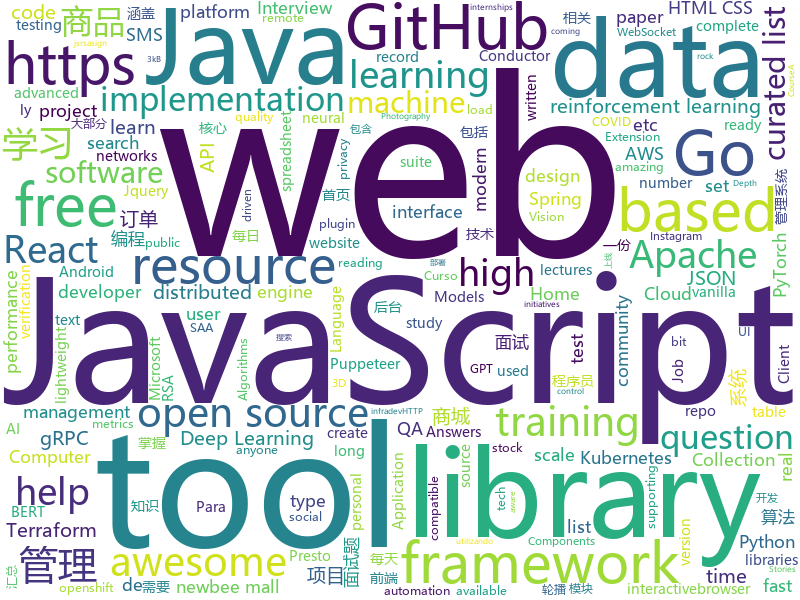

# 2020-07-22
See what the GitHub community is most excited about.

## python
+ [Deep-Learning-Papers-Reading-Roadmap](https://github.com/floodsung/Deep-Learning-Papers-Reading-Roadmap)(**235 stars today**): Deep Learning papers reading roadmap for anyone who are eager to learn this amazing tech!
+ [stock](https://github.com/pythonstock/stock)(**175 stars today**): stock，股票系统。使用python进行开发。
+ [d2l-en](https://github.com/d2l-ai/d2l-en)(**24 stars today**): Interactive deep learning book with code, math, and discussions. Available in multi-frameworks.
+ [gym](https://github.com/openai/gym)(**39 stars today**): A toolkit for developing and comparing reinforcement learning algorithms.
+ [3d-photo-inpainting](https://github.com/vt-vl-lab/3d-photo-inpainting)(**75 stars today**): [CVPR 2020] 3D Photography using Context-aware Layered Depth Inpainting
+ [baselines](https://github.com/openai/baselines)(**12 stars today**): OpenAI Baselines: high-quality implementations of reinforcement learning algorithms
+ [gpt-2](https://github.com/openai/gpt-2)(**40 stars today**): Code for the paper "Language Models are Unsupervised Multitask Learners"
+ [Summer2021-Internships](https://github.com/Pitt-CSC/Summer2021-Internships)(**12 stars today**): Collection of Summer 2021 tech internships!
+ [horovod](https://github.com/horovod/horovod)(**11 stars today**): Distributed training framework for TensorFlow, Keras, PyTorch, and Apache MXNet.
+ [black](https://github.com/psf/black)(**23 stars today**): The uncompromising Python code formatter
+ [pytorch_geometric](https://github.com/rusty1s/pytorch_geometric)(**16 stars today**): Geometric Deep Learning Extension Library for PyTorch
+ [Chinese-BERT-wwm](https://github.com/ymcui/Chinese-BERT-wwm)(**13 stars today**): Pre-Training with Whole Word Masking for Chinese BERT（中文BERT-wwm系列模型）
+ [swav](https://github.com/facebookresearch/swav)(**66 stars today**): PyTorch implementation of SwAV https//arxiv.org/abs/2006.09882
+ [gpt-3-experiments](https://github.com/minimaxir/gpt-3-experiments)(**94 stars today**): Test prompts for OpenAI's GPT-3 API and the resulting AI-generated texts.
+ [spinningup](https://github.com/openai/spinningup)(**7 stars today**): An educational resource to help anyone learn deep reinforcement learning.
+ [searx](https://github.com/asciimoo/searx)(**15 stars today**): Privacy-respecting metasearch engine
+ [InstaPy](https://github.com/timgrossmann/InstaPy)(**9 stars today**): 📷Instagram Bot - Tool for automated Instagram interactions
+ [aws-cli](https://github.com/aws/aws-cli)(**3 stars today**): Universal Command Line Interface for Amazon Web Services
+ [haystack](https://github.com/deepset-ai/haystack)(**11 stars today**): 🔍Transformers at scale for question answering & search
+ [sherlock](https://github.com/sherlock-project/sherlock)(**20 stars today**): 🔎Hunt down social media accounts by username across social networks
+ [locust](https://github.com/locustio/locust)(**13 stars today**): Scalable user load testing tool written in Python
+ [core](https://github.com/home-assistant/core)(**73 stars today**): 🏡Open source home automation that puts local control and privacy first
+ [mlflow](https://github.com/mlflow/mlflow)(**12 stars today**): Open source platform for the machine learning lifecycle
+ [moto](https://github.com/spulec/moto)(**7 stars today**): A library that allows you to easily mock out tests based on AWS infrastructure.
+ [ignite](https://github.com/pytorch/ignite)(**4 stars today**): High-level library to help with training and evaluating neural networks in PyTorch flexibly and transparently.

## java
+ [grpc-java](https://github.com/grpc/grpc-java)(**6 stars today**): The Java gRPC implementation. HTTP/2 based RPC
+ [Java](https://github.com/TheAlgorithms/Java)(**70 stars today**): All Algorithms implemented in Java
+ [camel](https://github.com/apache/camel)(**5 stars today**): Apache Camel
+ [selenium](https://github.com/SeleniumHQ/selenium)(**10 stars today**): A browser automation framework and ecosystem.
+ [quarkus](https://github.com/quarkusio/quarkus)(**15 stars today**): Quarkus: Supersonic Subatomic Java.
+ [JavaGuide](https://github.com/Snailclimb/JavaGuide)(**104 stars today**): 「Java学习+面试指南」一份涵盖大部分Java程序员所需要掌握的核心知识。
+ [druid](https://github.com/apache/druid)(**5 stars today**): Apache Druid: a high performance real-time analytics database.
+ [tutorials](https://github.com/eugenp/tutorials)(**10 stars today**): Just Announced - "Learn Spring Security OAuth":
+ [graylog2-server](https://github.com/Graylog2/graylog2-server)(**3 stars today**): Free and open source log management
+ [jsonschema2pojo](https://github.com/joelittlejohn/jsonschema2pojo)(**6 stars today**): Generate Java types from JSON or JSON Schema and annotates those types for data-binding with Jackson, Gson, etc
+ [InternetArchitect](https://github.com/bjmashibing/InternetArchitect)(**36 stars today**): 年薪百万互联网架构师课程文档及源码(公开部分)
+ [lucene-solr](https://github.com/apache/lucene-solr)(**7 stars today**): Apache Lucene and Solr open-source search software
+ [AgoraLive](https://github.com/AgoraIO-Usecase/AgoraLive)(**46 stars today**): Fun with Real Life Live Broadcasting.
+ [newbee-mall](https://github.com/newbee-ltd/newbee-mall)(**5 stars today**): newbee-mall 项目（新蜂商城）是一套电商系统，包括 newbee-mall 商城系统及 newbee-mall-admin 商城后台管理系统，基于 Spring Boot 2.X 及相关技术栈开发。 前台商城系统包含首页门户、商品分类、新品上线、首页轮播、商品推荐、商品搜索、商品展示、购物车、订单结算、订单流程、个人订单管理、会员中心、帮助中心等模块。 后台管理系统包含数据面板、轮播图管理、商品管理、订单管理、会员管理、分类管理、设置等模块。
+ [retrofit](https://github.com/square/retrofit)(**8 stars today**): A type-safe HTTP client for Android and the JVM
+ [elasticsearch](https://github.com/elastic/elasticsearch)(**20 stars today**): Open Source, Distributed, RESTful Search Engine
+ [pinpoint](https://github.com/naver/pinpoint)(**10 stars today**): APM, (Application Performance Management) tool for large-scale distributed systems.
+ [conductor](https://github.com/Netflix/conductor)(**4 stars today**): Conductor is a microservices orchestration engine - https://netflix.github.io/conductor/
+ [interview](https://github.com/mission-peace/interview)(**11 stars today**): Interview questions
+ [react-native-navigation](https://github.com/wix/react-native-navigation)(**9 stars today**): A complete native navigation solution for React Native
+ [spring-cloud-kubernetes](https://github.com/spring-cloud/spring-cloud-kubernetes)(**2 stars today**): Kubernetes integration with Spring Cloud Discovery Client, Configuration, etc...
+ [presto](https://github.com/prestosql/presto)(**7 stars today**): Home of the community managed version of Presto, the distributed SQL query engine for big data, under the auspices of the Presto Software Foundation.
+ [kafka](https://github.com/apache/kafka)(**13 stars today**): Mirror of Apache Kafka
+ [Telegram](https://github.com/DrKLO/Telegram)(**11 stars today**): Telegram for Android source
+ [cloud2020](https://github.com/EiletXie/cloud2020)(**5 stars today**): SpringCloud2020最新技术学习

## unknown
+ [awesome-ml-courses](https://github.com/luspr/awesome-ml-courses)(**142 stars today**): Awesome free machine learning and AI courses with video lectures.
+ [awesome-production-machine-learning](https://github.com/EthicalML/awesome-production-machine-learning)(**351 stars today**): A curated list of awesome open source libraries to deploy, monitor, version and scale your machine learning
+ [awesome-remote-job](https://github.com/lukasz-madon/awesome-remote-job)(**29 stars today**): A curated list of awesome remote jobs and resources. Inspired by https://github.com/vinta/awesome-python
+ [renaming](https://github.com/github/renaming)(**100 stars today**): Guidance for changing the default branch name for GitHub repositories
+ [JavaFamily](https://github.com/AobingJava/JavaFamily)(**120 stars today**): 【Java面试+Java学习指南】 一份涵盖大部分Java程序员所需要掌握的核心知识。
+ [QA_bible](https://github.com/Vladislav610/QA_bible)(**16 stars today**): Библия QA это 163 страницы смеси ответов на вопросы с реальных собеседований на manual QA, перевода интересного контента с зарубежных ресурсов и агрегации материала с отечественных.
+ [awesome-mlops](https://github.com/visenger/awesome-mlops)(**167 stars today**): A curated list of references for MLOps
+ [coding-interview-university](https://github.com/jwasham/coding-interview-university)(**357 stars today**): A complete computer science study plan to become a software engineer.
+ [AWS-SAA-C02-Course](https://github.com/alozano-77/AWS-SAA-C02-Course)(**8 stars today**): Personal notes for SAA-C02 test from: https://learn.cantrill.io
+ [NewGrad-2021](https://github.com/Pitt-CSC/NewGrad-2021)(**13 stars today**): A collection of New Grad full time roles in SWE, Quant, and PM.
+ [gpt-3](https://github.com/openai/gpt-3)(**381 stars today**): GPT-3: Language Models are Few-Shot Learners
+ [CyberProfDevelopmentCovidResources](https://github.com/gerryguy311/CyberProfDevelopmentCovidResources)(**11 stars today**): An awesome list of FREE resources for training, conferences, speaking, labs, reading, etc that are free all the time or during COVID-19 that cybersecurity professionals with downtime can take advantage of to improve their skills and marketability to come out on the other side ready to rock.
+ [patterns](https://github.com/rust-unofficial/patterns)(**28 stars today**): A catalogue of Rust design patterns
+ [airlines-to-china-covid-19](https://github.com/USCreditCardGuide/airlines-to-china-covid-19)(**16 stars today**): 疫情期间的回国航班汇总
+ [deep-learning-drizzle](https://github.com/kmario23/deep-learning-drizzle)(**11 stars today**): Drench yourself in Deep Learning, Reinforcement Learning, Machine Learning, Computer Vision, and NLP by learning from these exciting lectures!!
+ [awesome-gcp-certifications](https://github.com/sathishvj/awesome-gcp-certifications)(**9 stars today**): Google Cloud Platform Certification resources.
+ [design-resources-for-developers](https://github.com/bradtraversy/design-resources-for-developers)(**233 stars today**): Curated list of design and UI resources from stock photos, web templates, CSS frameworks, UI libraries, tools and much more
+ [first-contributions](https://github.com/firstcontributions/first-contributions)(**15 stars today**): 🚀✨Help beginners to contribute to open source projects
+ [team-learning-program](https://github.com/datawhalechina/team-learning-program)(**4 stars today**): 主要用于存放 编程、数据结构与算法相关的组队学习项目。
+ [javascript-questions](https://github.com/lydiahallie/javascript-questions)(**27 stars today**): A long list of (advanced) JavaScript questions, and their explanations✨
+ [GNNPapers](https://github.com/thunlp/GNNPapers)(**18 stars today**): Must-read papers on graph neural networks (GNN)
+ [COVID-19](https://github.com/CSSEGISandData/COVID-19)(**20 stars today**): Novel Coronavirus (COVID-19) Cases, provided by JHU CSSE
+ [crash-course-CRM](https://github.com/divanov11/crash-course-CRM)(**1 stars today**): Django customer management platform
+ [creative-profile-readme](https://github.com/coderjojo/creative-profile-readme)(**10 stars today**): A Collection of GitHub Profiles with awesome readme
+ [PoC-in-GitHub](https://github.com/nomi-sec/PoC-in-GitHub)(**13 stars today**): 📡PoC auto collect from GitHub.

## javascript
+ [hello-algorithm](https://github.com/geekxh/hello-algorithm)(**566 stars today**): 🇨🇳🇨🇳🇨🇳本项目包括：1、我写的三十万字图解算法题典 2、100 张编程类超清晰思维导图 3、100 篇大厂面经汇总 4、各语言编程电子书 100 本 5、小浩算法网站源代码 （🚀🚀国人项目上榜首不易，右上角助力一波！干就对了，奥利给 ！🚀🚀）
+ [fe-interview](https://github.com/haizlin/fe-interview)(**45 stars today**): 前端面试每日 3+1，以面试题来驱动学习，提倡每日学习与思考，每天进步一点！每天早上5点纯手工发布面试题（死磕自己，愉悦大家），3000+道前端面试题全面覆盖，HTML/CSS/JavaScript/Vue/React/Nodejs/TypeScript/ECMAScritpt/Webpack/Jquery/小程序/软技能……
+ [jsoneditor](https://github.com/josdejong/jsoneditor)(**15 stars today**): A web-based tool to view, edit, format, and validate JSON
+ [microsoft-authentication-library-for-js](https://github.com/AzureAD/microsoft-authentication-library-for-js)(**6 stars today**): Microsoft Authentication Library (MSAL) for JS
+ [reactjs-interview-questions](https://github.com/sudheerj/reactjs-interview-questions)(**65 stars today**): List of top 500 ReactJS Interview Questions & Answers....Coding exercise questions are coming soon!!
+ [svelte](https://github.com/sveltejs/svelte)(**65 stars today**): Cybernetically enhanced web apps
+ [preact](https://github.com/preactjs/preact)(**14 stars today**): ⚛️Fast 3kB React alternative with the same modern API. Components & Virtual DOM.
+ [front-end-interview-handbook](https://github.com/yangshun/front-end-interview-handbook)(**122 stars today**): 🕸No bullshit answers to the famous h5bp "Front-end Job Interview Questions"
+ [GitHub-Jobs-API-React-App](https://github.com/WebDevSimplified/GitHub-Jobs-API-React-App)(**9 stars today**): 
+ [javascript](https://github.com/airbnb/javascript)(**30 stars today**): JavaScript Style Guide
+ [select2](https://github.com/select2/select2)(**5 stars today**): Select2 is a jQuery based replacement for select boxes. It supports searching, remote data sets, and infinite scrolling of results.
+ [puppeteer-recorder](https://github.com/checkly/puppeteer-recorder)(**222 stars today**): Puppeteer recorder is a Chrome extension that records your browser interactions and generates a Puppeteer script.
+ [myvision](https://github.com/OvidijusParsiunas/myvision)(**121 stars today**): Computer vision based ML training data generation tool🚀
+ [OpenAPI-Specification](https://github.com/OAI/OpenAPI-Specification)(**7 stars today**): The OpenAPI Specification Repository
+ [quasar](https://github.com/quasarframework/quasar)(**52 stars today**): Quasar Framework - Build high-performance VueJS user interfaces in record time
+ [yapi](https://github.com/YMFE/yapi)(**25 stars today**): YApi 是一个可本地部署的、打通前后端及QA的、可视化的接口管理平台
+ [web-stories-wp](https://github.com/google/web-stories-wp)(**5 stars today**): Web Stories WordPress plugin
+ [howler.js](https://github.com/goldfire/howler.js)(**15 stars today**): Javascript audio library for the modern web.
+ [jexcel](https://github.com/paulhodel/jexcel)(**61 stars today**): jExcel is a lightweight vanilla javascript plugin to create amazing web-based interactive tables and spreadsheets compatible with Excel or any other spreadsheet software.
+ [alpine](https://github.com/alpinejs/alpine)(**32 stars today**): A rugged, minimal framework for composing JavaScript behavior in your markup.
+ [ag-grid](https://github.com/ag-grid/ag-grid)(**7 stars today**): Advanced Data Grid / Data Table supporting Javascript / React / AngularJS / Web Components
+ [react-error-boundary](https://github.com/bvaughn/react-error-boundary)(**169 stars today**): Simple reusable React error boundary component
+ [fullstack-course4](https://github.com/jhu-ep-coursera/fullstack-course4)(**20 stars today**): Example code for HTML, CSS, and Javascript for Web Developers Coursera Course
+ [react](https://github.com/facebook/react)(**89 stars today**): A declarative, efficient, and flexible JavaScript library for building user interfaces.
+ [hiring-without-whiteboards](https://github.com/poteto/hiring-without-whiteboards)(**20 stars today**): ⭐️Companies that don't have a broken hiring process

## html
+ [tabler-icons](https://github.com/tabler/tabler-icons)(**115 stars today**): A set of over 550 free MIT-licensed high-quality SVG icons for you to use in your web projects.
+ [learning-area](https://github.com/mdn/learning-area)(**5 stars today**): Github repo for the MDN Learning Area.
+ [design-blocks](https://github.com/froala/design-blocks)(**5 stars today**): A set of 170+ Bootstrap based design blocks ready to be used to create clean modern websites.
+ [MSEdgeExplainers](https://github.com/MicrosoftEdge/MSEdgeExplainers)(**5 stars today**): Home for explainer documents originated by the Microsoft Edge team
+ [fastText](https://github.com/facebookresearch/fastText)(**8 stars today**): Library for fast text representation and classification.
+ [openwrt-packages](https://github.com/kenzok8/openwrt-packages)(**5 stars today**): openwet常用软件包
+ [glTF](https://github.com/KhronosGroup/glTF)(**7 stars today**): glTF – Runtime 3D Asset Delivery
+ [PowerBI-DataScience](https://github.com/dsacademybr/PowerBI-DataScience)(**3 stars today**): Repositório do Curso Microsoft Power BI Para Data Science
+ [wpt](https://github.com/web-platform-tests/wpt)(**1 stars today**): Test suites for Web platform specs — including WHATWG, W3C, and others
+ [jsrsasign](https://github.com/kjur/jsrsasign)(**20 stars today**): The 'jsrsasign' (RSA-Sign JavaScript Library) is an opensource free cryptography library supporting RSA/RSAPSS/ECDSA/DSA signing/validation, ASN.1, PKCS#1/5/8 private/public key, X.509 certificate, CRL, OCSP, CMS SignedData, TimeStamp, CAdES JSON Web Signature/Token in pure JavaScript.
+ [umi-top.github.io](https://github.com/umi-top/umi-top.github.io)(**112 stars today**): 
+ [rellax](https://github.com/dixonandmoe/rellax)(**6 stars today**): Lightweight, vanilla javascript parallax library
+ [keycloak-documentation](https://github.com/keycloak/keycloak-documentation)(**0 stars today**): 
+ [tiny-slider](https://github.com/ganlanyuan/tiny-slider)(**8 stars today**): Vanilla javascript slider for all purposes.
+ [phpstan](https://github.com/phpstan/phpstan)(**10 stars today**): PHP Static Analysis Tool - discover bugs in your code without running it!
+ [tidytuesday](https://github.com/rfordatascience/tidytuesday)(**4 stars today**): Official repo for the #tidytuesday project
+ [hyperblog](https://github.com/freddier/hyperblog)(**19 stars today**): Un blog increíble para el curso de Git y Github de Platzi
+ [javascript](https://github.com/gustavoguanabara/javascript)(**5 stars today**): Curso de JavaScript
+ [free-for-dev](https://github.com/ripienaar/free-for-dev)(**17 stars today**): A list of SaaS, PaaS and IaaS offerings that have free tiers of interest to devops and infradev
+ [almanac.httparchive.org](https://github.com/HTTPArchive/almanac.httparchive.org)(**2 stars today**): HTTP Archive's annual "State of the Web" report made by the web community
+ [personal-website](https://github.com/github/personal-website)(**1 stars today**): Code that'll help you kickstart a personal website that showcases your work as a software developer.
+ [Bramble](https://github.com/marcrowProject/Bramble)(**4 stars today**): Bramble is a hacking Open source suite.
+ [web-moderno](https://github.com/cod3rcursos/web-moderno)(**8 stars today**): 
+ [community](https://github.com/ansible/community)(**2 stars today**): This repository is for management of all Ansible community related initiatives.
+ [30diasDeCSS](https://github.com/MilenaCarecho/30diasDeCSS)(**9 stars today**): Desafio criar 30 mini projetos utilizando HTML e CSS em 30 dias

## go
+ [number-verifier](https://github.com/upmasked/number-verifier)(**72 stars today**): Number Verifier is a SMS verification tool that makes it easy to get a disposable SMS number and bypass SMS number verifications on any site.
+ [gotraining](https://github.com/ardanlabs/gotraining)(**42 stars today**): Go Training Class Material :
+ [autoscaler](https://github.com/kubernetes/autoscaler)(**4 stars today**): Autoscaling components for Kubernetes
+ [thanos](https://github.com/thanos-io/thanos)(**9 stars today**): Highly available Prometheus setup with long term storage capabilities. CNCF Sandbox project.
+ [terraform-provider-azurerm](https://github.com/terraform-providers/terraform-provider-azurerm)(**5 stars today**): Terraform provider for Azure Resource Manager
+ [spark-on-k8s-operator](https://github.com/GoogleCloudPlatform/spark-on-k8s-operator)(**6 stars today**): Kubernetes operator for managing the lifecycle of Apache Spark applications on Kubernetes.
+ [terragrunt](https://github.com/gruntwork-io/terragrunt)(**5 stars today**): Terragrunt is a thin wrapper for Terraform that provides extra tools for working with multiple Terraform modules.
+ [terraform-provider-aws](https://github.com/terraform-providers/terraform-provider-aws)(**5 stars today**): Terraform AWS provider
+ [origin](https://github.com/openshift/origin)(**2 stars today**): Images for OpenShift 3 and 4 - see openshift/okd for more
+ [telegraf](https://github.com/influxdata/telegraf)(**10 stars today**): The plugin-driven server agent for collecting & reporting metrics.
+ [vegeta](https://github.com/tsenart/vegeta)(**15 stars today**): HTTP load testing tool and library. It's over 9000!
+ [grpc-gateway](https://github.com/grpc-ecosystem/grpc-gateway)(**11 stars today**): gRPC to JSON proxy generator following the gRPC HTTP spec
+ [go-ethereum](https://github.com/ethereum/go-ethereum)(**14 stars today**): Official Go implementation of the Ethereum protocol
+ [go-github](https://github.com/google/go-github)(**7 stars today**): Go library for accessing the GitHub API
+ [kops](https://github.com/kubernetes/kops)(**10 stars today**): Kubernetes Operations (kops) - Production Grade K8s Installation, Upgrades, and Management
+ [bigcache](https://github.com/allegro/bigcache)(**6 stars today**): Efficient cache for gigabytes of data written in Go.
+ [websocket](https://github.com/gorilla/websocket)(**13 stars today**): A fast, well-tested and widely used WebSocket implementation for Go.
+ [arkade](https://github.com/alexellis/arkade)(**28 stars today**): Your one-stop CLI for Kubernetes
+ [ultimate-go](https://github.com/hoanhan101/ultimate-go)(**18 stars today**): Ultimate Go study guide
+ [minikube](https://github.com/kubernetes/minikube)(**8 stars today**): Run Kubernetes locally
+ [iris](https://github.com/kataras/iris)(**18 stars today**): 感谢中国开发者 - https://bit.ly/謝謝 | The fastest community-driven web framework for Go. Socket-Sharding, gRPC, Automatic HTTPS with Public Domain, MVC, Sessions, Caching, Versioning API, Problem API, Websocket, Dependency Injection and more. Fully compatible with the standard library and 3rd-party middleware packages. | https://bit.ly/iriscandothat1 | h…
+ [influxdb](https://github.com/influxdata/influxdb)(**9 stars today**): Scalable datastore for metrics, events, and real-time analytics
+ [aws-lambda-go](https://github.com/aws/aws-lambda-go)(**3 stars today**): Libraries, samples and tools to help Go developers develop AWS Lambda functions.
+ [go](https://github.com/golang/go)(**54 stars today**): The Go programming language
+ [cloud-on-k8s](https://github.com/elastic/cloud-on-k8s)(**4 stars today**): Elastic Cloud on Kubernetes

## WordCloud

