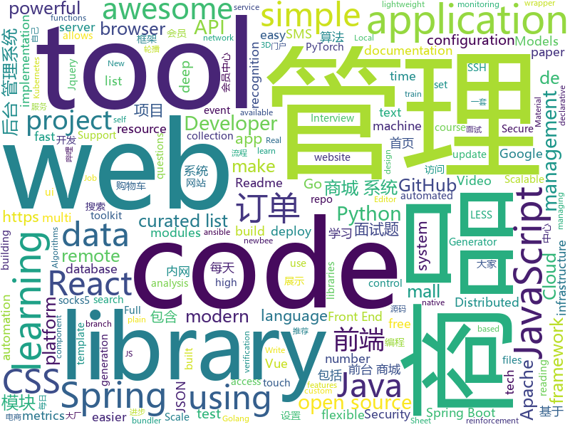

# 2020-07-23
See what the GitHub community is most excited about.

## python
+ [stock](https://github.com/pythonstock/stock)(**287 stars today**): stock，股票系统。使用python进行开发。
+ [Deep-Learning-Papers-Reading-Roadmap](https://github.com/floodsung/Deep-Learning-Papers-Reading-Roadmap)(**294 stars today**): Deep Learning papers reading roadmap for anyone who are eager to learn this amazing tech!
+ [d2l-en](https://github.com/d2l-ai/d2l-en)(**54 stars today**): Interactive deep learning book with code, math, and discussions. Available in multi-frameworks.
+ [pandas](https://github.com/pandas-dev/pandas)(**19 stars today**): Flexible and powerful data analysis / manipulation library for Python, providing labeled data structures similar to R data.frame objects, statistical functions, and much more
+ [Summer2021-Internships](https://github.com/Pitt-CSC/Summer2021-Internships)(**36 stars today**): Collection of Summer 2021 tech internships!
+ [gym](https://github.com/openai/gym)(**53 stars today**): A toolkit for developing and comparing reinforcement learning algorithms.
+ [macOS-Simple-KVM](https://github.com/foxlet/macOS-Simple-KVM)(**21 stars today**): Tools to set up a quick macOS VM in QEMU, accelerated by KVM.
+ [incubator-superset](https://github.com/apache/incubator-superset)(**29 stars today**): Apache Superset (incubating) is a modern, enterprise-ready business intelligence web application
+ [python-for-absolute-beginners-course](https://github.com/talkpython/python-for-absolute-beginners-course)(**33 stars today**): Code samples and other handouts for our course.
+ [models](https://github.com/tensorflow/models)(**32 stars today**): Models and examples built with TensorFlow
+ [covid19_critically_ill](https://github.com/cojocchen/covid19_critically_ill)(**15 stars today**): 
+ [pytorch-lightning](https://github.com/PyTorchLightning/pytorch-lightning)(**42 stars today**): The lightweight PyTorch wrapper for ML researchers. Scale your models. Write less boilerplate
+ [pre-commit](https://github.com/pre-commit/pre-commit)(**6 stars today**): A framework for managing and maintaining multi-language pre-commit hooks.
+ [mypy](https://github.com/python/mypy)(**9 stars today**): Optional static typing for Python 3 and 2 (PEP 484)
+ [gpt-2](https://github.com/openai/gpt-2)(**27 stars today**): Code for the paper "Language Models are Unsupervised Multitask Learners"
+ [3d-photo-inpainting](https://github.com/vt-vl-lab/3d-photo-inpainting)(**131 stars today**): [CVPR 2020] 3D Photography using Context-aware Layered Depth Inpainting
+ [ScoutSuite](https://github.com/nccgroup/ScoutSuite)(**7 stars today**): Multi-Cloud Security Auditing Tool
+ [scikit-learn](https://github.com/scikit-learn/scikit-learn)(**19 stars today**): scikit-learn: machine learning in Python
+ [insightface](https://github.com/deepinsight/insightface)(**11 stars today**): Face Analysis Project on MXNet
+ [pygooglenews](https://github.com/kotartemiy/pygooglenews)(**14 stars today**): If Google News had a Python library
+ [ansible](https://github.com/ansible/ansible)(**25 stars today**): Ansible is a radically simple IT automation platform that makes your applications and systems easier to deploy. Avoid writing scripts or custom code to deploy and update your applications — automate in a language that approaches plain English, using SSH, with no agents to install on remote systems. https://docs.ansible.com/ansible/
+ [tianshou](https://github.com/thu-ml/tianshou)(**17 stars today**): An elegant, flexible, and superfast PyTorch deep reinforcement learning platform. (For previewed features, please checkout the "dev" branch)
+ [Spring2021Internships](https://github.com/BaruYogesh/Spring2021Internships)(**4 stars today**): 
+ [patroni](https://github.com/zalando/patroni)(**3 stars today**): A template for PostgreSQL High Availability with Etcd, Consul, ZooKeeper, or Kubernetes
+ [netbox](https://github.com/netbox-community/netbox)(**8 stars today**): IP address management (IPAM) and data center infrastructure management (DCIM) tool.

## java
+ [easyexcel](https://github.com/alibaba/easyexcel)(**31 stars today**): 快速、简单避免OOM的java处理Excel工具
+ [elasticsearch](https://github.com/elastic/elasticsearch)(**26 stars today**): Open Source, Distributed, RESTful Search Engine
+ [openapi-generator](https://github.com/OpenAPITools/openapi-generator)(**11 stars today**): OpenAPI Generator allows generation of API client libraries (SDK generation), server stubs, documentation and configuration automatically given an OpenAPI Spec (v2, v3)
+ [spring-boot](https://github.com/spring-projects/spring-boot)(**33 stars today**): Spring Boot
+ [AgoraLive](https://github.com/AgoraIO-Usecase/AgoraLive)(**56 stars today**): Fun with Real Life Live Broadcasting.
+ [calcite](https://github.com/apache/calcite)(**2 stars today**): Apache Calcite
+ [serve](https://github.com/pytorch/serve)(**12 stars today**): Model Serving on PyTorch
+ [antlr4](https://github.com/antlr/antlr4)(**9 stars today**): ANTLR (ANother Tool for Language Recognition) is a powerful parser generator for reading, processing, executing, or translating structured text or binary files.
+ [camel](https://github.com/apache/camel)(**6 stars today**): Apache Camel
+ [InternetArchitect](https://github.com/bjmashibing/InternetArchitect)(**15 stars today**): 年薪百万互联网架构师课程文档及源码(公开部分)
+ [nifi](https://github.com/apache/nifi)(**2 stars today**): Apache NiFi
+ [jacoco](https://github.com/jacoco/jacoco)(**10 stars today**): 🔬JaCoCo - Java Code Coverage Library
+ [Java](https://github.com/TheAlgorithms/Java)(**46 stars today**): All Algorithms implemented in Java
+ [PictureSelector](https://github.com/LuckSiege/PictureSelector)(**8 stars today**): Picture Selector Library for Android or 图片选择器
+ [mall](https://github.com/macrozheng/mall)(**68 stars today**): mall项目是一套电商系统，包括前台商城系统及后台管理系统，基于SpringBoot+MyBatis实现，采用Docker容器化部署。 前台商城系统包含首页门户、商品推荐、商品搜索、商品展示、购物车、订单流程、会员中心、客户服务、帮助中心等模块。 后台管理系统包含商品管理、订单管理、会员管理、促销管理、运营管理、内容管理、统计报表、财务管理、权限管理、设置等模块。
+ [dbeaver](https://github.com/dbeaver/dbeaver)(**18 stars today**): Free universal database tool and SQL client
+ [newbee-mall](https://github.com/newbee-ltd/newbee-mall)(**10 stars today**): newbee-mall 项目（新蜂商城）是一套电商系统，包括 newbee-mall 商城系统及 newbee-mall-admin 商城后台管理系统，基于 Spring Boot 2.X 及相关技术栈开发。 前台商城系统包含首页门户、商品分类、新品上线、首页轮播、商品推荐、商品搜索、商品展示、购物车、订单结算、订单流程、个人订单管理、会员中心、帮助中心等模块。 后台管理系统包含数据面板、轮播图管理、商品管理、订单管理、会员管理、分类管理、设置等模块。
+ [keycloak](https://github.com/keycloak/keycloak)(**11 stars today**): Open Source Identity and Access Management For Modern Applications and Services
+ [react-native-video](https://github.com/react-native-community/react-native-video)(**1 stars today**): A <Video /> component for react-native
+ [react-native-push-notification](https://github.com/zo0r/react-native-push-notification)(**5 stars today**): React Native Local and Remote Notifications
+ [grpc-java](https://github.com/grpc/grpc-java)(**9 stars today**): The Java gRPC implementation. HTTP/2 based RPC
+ [netty](https://github.com/netty/netty)(**14 stars today**): Netty project - an event-driven asynchronous network application framework
+ [SpringAll](https://github.com/wuyouzhuguli/SpringAll)(**27 stars today**): 循序渐进，学习Spring Boot、Spring Boot & Shiro、Spring Batch、Spring Cloud、Spring Cloud Alibaba、Spring Security & Spring Security OAuth2，博客Spring系列源码：https://mrbird.cc
+ [ExoPlayer](https://github.com/google/ExoPlayer)(**12 stars today**): An extensible media player for Android
+ [micrometer](https://github.com/micrometer-metrics/micrometer)(**1 stars today**): An application metrics facade for the most popular monitoring tools. Think SLF4J, but for metrics.

## unknown
+ [awesome-ml-courses](https://github.com/luspr/awesome-ml-courses)(**194 stars today**): Awesome free machine learning and AI courses with video lectures.
+ [awesome-remote-job](https://github.com/lukasz-madon/awesome-remote-job)(**75 stars today**): A curated list of awesome remote jobs and resources. Inspired by https://github.com/vinta/awesome-python
+ [css-in-readme-like-wat](https://github.com/sindresorhus/css-in-readme-like-wat)(**238 stars today**): Style your readme using CSS with this simple trick
+ [renaming](https://github.com/github/renaming)(**176 stars today**): Guidance for changing the default branch name for GitHub repositories
+ [awesome-mlops](https://github.com/visenger/awesome-mlops)(**100 stars today**): A curated list of references for MLOps
+ [JavaFamily](https://github.com/AobingJava/JavaFamily)(**230 stars today**): 【Java面试+Java学习指南】 一份涵盖大部分Java程序员所需要掌握的核心知识。
+ [DamianRincon](https://github.com/DamianRincon/DamianRincon)(**9 stars today**): Readme personal y una galería de ejemplos de Readme.
+ [developer-handbook](https://github.com/apptension/developer-handbook)(**114 stars today**): An opinionated guide on how to become a professional Web/Mobile App Developer.
+ [pua-books](https://github.com/ixinzhi/pua-books)(**10 stars today**): 📚PUA 书籍
+ [awesome-design-systems](https://github.com/alexpate/awesome-design-systems)(**45 stars today**): 💅🏻⚒A collection of awesome design systems
+ [awesome-production-machine-learning](https://github.com/EthicalML/awesome-production-machine-learning)(**186 stars today**): A curated list of awesome open source libraries to deploy, monitor, version and scale your machine learning
+ [GNNPapers](https://github.com/thunlp/GNNPapers)(**13 stars today**): Must-read papers on graph neural networks (GNN)
+ [LeetcodeTop](https://github.com/afatcoder/LeetcodeTop)(**28 stars today**): 
+ [NewGrad-2021](https://github.com/Pitt-CSC/NewGrad-2021)(**26 stars today**): A collection of New Grad full time roles in SWE, Quant, and PM.
+ [PCAP-ATTACK](https://github.com/sbousseaden/PCAP-ATTACK)(**16 stars today**): 
+ [awesome-deep-text-detection-recognition](https://github.com/hwalsuklee/awesome-deep-text-detection-recognition)(**2 stars today**): A curated list of resources for text detection/recognition (optical character recognition ) with deep learning methods.
+ [proposals](https://github.com/tc39/proposals)(**11 stars today**): Tracking ECMAScript Proposals
+ [data-science](https://github.com/ossu/data-science)(**11 stars today**): 📊Path to a free self-taught education in Data Science!
+ [laravel-best-practices](https://github.com/alexeymezenin/laravel-best-practices)(**5 stars today**): Laravel best practices
+ [Flutter-Course-Resources](https://github.com/londonappbrewery/Flutter-Course-Resources)(**8 stars today**): Learn to Code While Building Apps - The Complete Flutter Development Bootcamp
+ [google-cloud-4-words](https://github.com/gregsramblings/google-cloud-4-words)(**5 stars today**): The Google Cloud Developer's Cheat Sheet
+ [Front-End-Checklist](https://github.com/thedaviddias/Front-End-Checklist)(**12 stars today**): 🗂The perfect Front-End Checklist for modern websites and meticulous developers
+ [PoC-in-GitHub](https://github.com/nomi-sec/PoC-in-GitHub)(**20 stars today**): 📡PoC auto collect from GitHub.
+ [JavaScript-Algorithms](https://github.com/sisterAn/JavaScript-Algorithms)(**10 stars today**): 基础理论+JS框架应用+实践，从0到1构建整个前端算法体系
+ [bilibili-API-collect](https://github.com/SocialSisterYi/bilibili-API-collect)(**10 stars today**): 哔哩哔哩-API收集整理【不断更新中....】

## javascript
+ [hello-algorithm](https://github.com/geekxh/hello-algorithm)(**983 stars today**): 🇨🇳🇨🇳🇨🇳本项目包括：1、我写的三十万字图解算法题典 2、100 张编程类超清晰思维导图 3、100 篇大厂面经汇总 4、各语言编程电子书 100 本 5、小浩算法网站源代码 （🚀🚀国人项目上榜首不易，右上角助力一波！干就对了，奥利给 ！🚀🚀）
+ [gutenberg](https://github.com/WordPress/gutenberg)(**3 stars today**): The Block Editor project for WordPress and beyond. Plugin is available from the official repository.
+ [svelte](https://github.com/sveltejs/svelte)(**82 stars today**): Cybernetically enhanced web apps
+ [jitsi-meet](https://github.com/jitsi/jitsi-meet)(**14 stars today**): Jitsi Meet - Secure, Simple and Scalable Video Conferences that you use as a standalone app or embed in your web application.
+ [33-js-concepts](https://github.com/leonardomso/33-js-concepts)(**24 stars today**): 📜33 concepts every JavaScript developer should know.
+ [remote-jobs](https://github.com/remoteintech/remote-jobs)(**13 stars today**): A list of semi to fully remote-friendly companies in tech.
+ [lx-music-desktop](https://github.com/lyswhut/lx-music-desktop)(**50 stars today**): 一个基于 electron 的音乐软件
+ [Sortable](https://github.com/SortableJS/Sortable)(**14 stars today**): Sortable — is a JavaScript library for reorderable drag-and-drop lists on modern browsers and touch devices. No jQuery required. Supports Meteor, AngularJS, React, Polymer, Vue, Ember, Knockout and any CSS library, e.g. Bootstrap.
+ [umi-core-js](https://github.com/umi-top/umi-core-js)(**186 stars today**): UMI Core JS Library
+ [parcel](https://github.com/parcel-bundler/parcel)(**17 stars today**): 📦🚀Blazing fast, zero configuration web application bundler
+ [lerna](https://github.com/lerna/lerna)(**24 stars today**): 🐉A tool for managing JavaScript projects with multiple packages.
+ [Daily-Interview-Question](https://github.com/Advanced-Frontend/Daily-Interview-Question)(**12 stars today**): 我是木易杨，公众号「高级前端进阶」作者，每天搞定一道前端大厂面试题，祝大家天天进步，一年后会看到不一样的自己。
+ [react-native](https://github.com/facebook/react-native)(**36 stars today**): A framework for building native apps with React.
+ [three.js](https://github.com/mrdoob/three.js)(**26 stars today**): JavaScript 3D library.
+ [ccxt](https://github.com/ccxt/ccxt)(**9 stars today**): A JavaScript / Python / PHP cryptocurrency trading API with support for more than 120 bitcoin/altcoin exchanges
+ [nuxt.js](https://github.com/nuxt/nuxt.js)(**28 stars today**): The Intuitive Vue Framework
+ [website](https://github.com/CodingTrain/website)(**3 stars today**): The train engine powering the Coding Train website
+ [pdf.js](https://github.com/mozilla/pdf.js)(**18 stars today**): PDF Reader in JavaScript
+ [cypress](https://github.com/cypress-io/cypress)(**28 stars today**): Fast, easy and reliable testing for anything that runs in a browser.
+ [downshift](https://github.com/downshift-js/downshift)(**4 stars today**): 🏎A set of primitives to build simple, flexible, WAI-ARIA compliant React autocomplete, combobox or select dropdown components.
+ [BackstopJS](https://github.com/garris/BackstopJS)(**7 stars today**): Catch CSS curve balls.
+ [carbon](https://github.com/carbon-design-system/carbon)(**9 stars today**): A design system built by IBM
+ [webpack](https://github.com/webpack/webpack)(**15 stars today**): A bundler for javascript and friends. Packs many modules into a few bundled assets. Code Splitting allows for loading parts of the application on demand. Through "loaders", modules can be CommonJs, AMD, ES6 modules, CSS, Images, JSON, Coffeescript, LESS, ... and your custom stuff.
+ [material-table](https://github.com/mbrn/material-table)(**6 stars today**): Datatable for React based on material-ui's table with additional features
+ [front-end-interview-handbook](https://github.com/yangshun/front-end-interview-handbook)(**89 stars today**): 🕸No bullshit answers to the famous h5bp "Front-end Job Interview Questions"

## html
+ [fe-interview](https://github.com/haizlin/fe-interview)(**112 stars today**): 前端面试每日 3+1，以面试题来驱动学习，提倡每日学习与思考，每天进步一点！每天早上5点纯手工发布面试题（死磕自己，愉悦大家），3000+道前端面试题全面覆盖，HTML/CSS/JavaScript/Vue/React/Nodejs/TypeScript/ECMAScritpt/Webpack/Jquery/小程序/软技能……
+ [umi-top.github.io](https://github.com/umi-top/umi-top.github.io)(**196 stars today**): 
+ [Tasmota](https://github.com/arendst/Tasmota)(**12 stars today**): Alternative firmware for ESP8266 with easy configuration using webUI, OTA updates, automation using timers or rules, expandability and entirely local control over MQTT, HTTP, Serial or KNX. Full documentation at
+ [hyperblog](https://github.com/freddier/hyperblog)(**18 stars today**): Un blog increíble para el curso de Git y Github de Platzi
+ [fastText](https://github.com/facebookresearch/fastText)(**8 stars today**): Library for fast text representation and classification.
+ [boost](https://github.com/boostorg/boost)(**4 stars today**): Super-project for modularized Boost
+ [ImportJSON](https://github.com/bradjasper/ImportJSON)(**2 stars today**): Import JSON into Google Sheets, this library adds various ImportJSON functions to your spreadsheet
+ [Spoon-Knife](https://github.com/octocat/Spoon-Knife)(**1 stars today**): This repo is for demonstration purposes only.
+ [laravel-elearning](https://github.com/fikrisuheri/laravel-elearning)(**12 stars today**): 
+ [keep-a-changelog](https://github.com/olivierlacan/keep-a-changelog)(**4 stars today**): If you build software, keep a changelog.
+ [csswg-drafts](https://github.com/w3c/csswg-drafts)(**2 stars today**): CSS Working Group Editor Drafts
+ [digital-garden-jekyll-template](https://github.com/maximevaillancourt/digital-garden-jekyll-template)(**0 stars today**): Start your own digital garden using this Jekyll template🌱
+ [rollout-ui](https://github.com/fetlife/rollout-ui)(**4 stars today**): Minimalist UI for Rollout
+ [1-pixel-wealth](https://github.com/MKorostoff/1-pixel-wealth)(**4 stars today**): 
+ [learning-area](https://github.com/mdn/learning-area)(**5 stars today**): Github repo for the MDN Learning Area.
+ [ClashR_for_Windows](https://github.com/BoyceLig/ClashR_for_Windows)(**5 stars today**): 
+ [devdocs](https://github.com/magento/devdocs)(**1 stars today**): Magento Developer Documentation
+ [Front-end-Developer-Interview-Questions](https://github.com/h5bp/Front-end-Developer-Interview-Questions)(**18 stars today**): A list of helpful front-end related questions you can use to interview potential candidates, test yourself or completely ignore.
+ [serenity-core](https://github.com/serenity-bdd/serenity-core)(**0 stars today**): Serenity BDD is a test automation library designed to make writing automated acceptance tests easier, and more fun.
+ [beautiful-jekyll](https://github.com/daattali/beautiful-jekyll)(**5 stars today**): ✨Build a beautiful and simple website in literally minutes. Demo at https://beautifuljekyll.com
+ [hugo-book](https://github.com/alex-shpak/hugo-book)(**6 stars today**): Hugo documentation theme as simple as plain book
+ [Intro-to-Data-APIs-JS](https://github.com/CodingTrain/Intro-to-Data-APIs-JS)(**1 stars today**): Working with Data and APIs in JavaScript
+ [fastclick](https://github.com/ftlabs/fastclick)(**3 stars today**): Polyfill to remove click delays on browsers with touch UIs
+ [screenfull.js](https://github.com/sindresorhus/screenfull.js)(**5 stars today**): Simple wrapper for cross-browser usage of the JavaScript Fullscreen API
+ [website](https://github.com/Real-Dev-Squad/website)(**2 stars today**): 

## go
+ [terraform](https://github.com/hashicorp/terraform)(**16 stars today**): Terraform enables you to safely and predictably create, change, and improve infrastructure. It is an open source tool that codifies APIs into declarative configuration files that can be shared amongst team members, treated as code, edited, reviewed, and versioned.
+ [number-verifier](https://github.com/upmasked/number-verifier)(**220 stars today**): Number Verifier is a SMS verification tool that makes it easy to get a disposable SMS number and bypass SMS number verifications on any site.
+ [gotraining](https://github.com/ardanlabs/gotraining)(**110 stars today**): Go Training Class Material :
+ [vault](https://github.com/hashicorp/vault)(**13 stars today**): A tool for secrets management, encryption as a service, and privileged access management
+ [caddy](https://github.com/caddyserver/caddy)(**20 stars today**): Fast, multi-platform web server with automatic HTTPS
+ [istio](https://github.com/istio/istio)(**13 stars today**): Connect, secure, control, and observe services.
+ [jupiter](https://github.com/douyu/jupiter)(**27 stars today**): Jupiter是douyu开源的面向服务治理的Golang微服务框架
+ [influxdb](https://github.com/influxdata/influxdb)(**14 stars today**): Scalable datastore for metrics, events, and real-time analytics
+ [terraform-provider-aws](https://github.com/terraform-providers/terraform-provider-aws)(**7 stars today**): Terraform AWS provider
+ [gopsutil](https://github.com/shirou/gopsutil)(**7 stars today**): psutil for golang
+ [lotus](https://github.com/filecoin-project/lotus)(**3 stars today**): Implementation of the Filecoin protocol, written in Go
+ [terratest](https://github.com/gruntwork-io/terratest)(**8 stars today**): Terratest is a Go library that makes it easier to write automated tests for your infrastructure code.
+ [flux](https://github.com/fluxcd/flux)(**9 stars today**): The GitOps Kubernetes operator
+ [testify](https://github.com/stretchr/testify)(**16 stars today**): A toolkit with common assertions and mocks that plays nicely with the standard library
+ [go](https://github.com/golang/go)(**66 stars today**): The Go programming language
+ [prometheus](https://github.com/prometheus/prometheus)(**25 stars today**): The Prometheus monitoring system and time series database.
+ [nps](https://github.com/ehang-io/nps)(**24 stars today**): 一款轻量级、高性能、功能强大的内网穿透代理服务器。支持tcp、udp、socks5、http等几乎所有流量转发，可用来访问内网网站、本地支付接口调试、ssh访问、远程桌面，内网dns解析、内网socks5代理等等……，并带有功能强大的web管理端。a lightweight, high-performance, powerful intranet penetration proxy server, with a powerful web management terminal.
+ [helm-operator](https://github.com/fluxcd/helm-operator)(**6 stars today**): The Flux Helm Operator, for declarative Helming
+ [websocket](https://github.com/gorilla/websocket)(**18 stars today**): A fast, well-tested and widely used WebSocket implementation for Go.
+ [terraform-provider-azurerm](https://github.com/terraform-providers/terraform-provider-azurerm)(**3 stars today**): Terraform provider for Azure Resource Manager
+ [sourcegraph](https://github.com/sourcegraph/sourcegraph)(**7 stars today**): Universal code search (self-hosted)
+ [jwt-go](https://github.com/dgrijalva/jwt-go)(**5 stars today**): Golang implementation of JSON Web Tokens (JWT)
+ [velero](https://github.com/vmware-tanzu/velero)(**8 stars today**): Backup and migrate Kubernetes applications and their persistent volumes
+ [tidb](https://github.com/pingcap/tidb)(**20 stars today**): TiDB is an open source distributed HTAP database compatible with the MySQL protocol
+ [jaeger](https://github.com/jaegertracing/jaeger)(**16 stars today**): CNCF Jaeger, a Distributed Tracing Platform

## WordCloud

